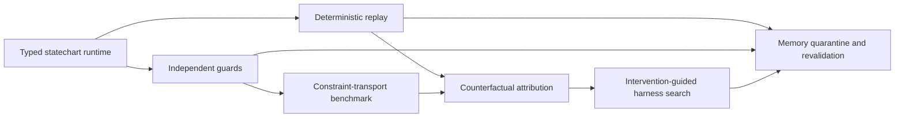

# Grounded Harness Research Portfolio

Status: D1 deterministic replay, D2 deterministic Constraint Transport, and a
thin six-surface Counterfactual Harness Search pilot passed. A deterministic
causal-use-gated memory shift/recurrence fixture also passed; live-model,
stochastic, and confirmatory claims remain untested.

Last updated: 2026-07-20.

## Decision

This portfolio turns five related ideas into one staged research program:

1. **Grounded Statecharts** is the first product and instrumentation layer.
2. **Constraint Transport** is the first reliability benchmark built on that
   layer.
3. **Counterfactual Harness Search** is the flagship research method and first
   publication target.
4. **Harnesses That Know When to Unlearn** is the follow-up on persistent
   experience under world, tool, and model change.
5. **Load-Bearing Prose Test** is the shortest-path move to test whether the
   concern-transport bridge theorem extends one substrate above CT — from
   actions to the prose that authorizes actions — using the CT κ and the
   CT commitment-surface oracle. Plan and preregistration frozen
   2026-07-21; scaffolding follows; no empirical claim yet. See
   [`load_bearing_prose_test.md`](load_bearing_prose_test.md).

The four projects should not begin as separate implementations. They share a
typed event log, transition receipts, deterministic replay, fault injection,
dataset schema, statistical protocol, and public-release contract. Each design
still has an independent hypothesis and a stop condition, so failure in one
does not automatically invalidate the others.

The first executable package now lives at
[`experiments/grounded_statecharts`](../../experiments/grounded_statecharts/README.md).
It publishes the typed event schema, serialized checkpoint, paired manifests,
exact no-op replay, one G3 artifact guard, and a static false-completion replay.
It also publishes typed constraint lineage and task/violation metrics for two
fixture families at depths one through four. These pass deterministic exit
gates only; they are not evidence for task-population, model, or OOD claims.
The same package now publishes paired single-component repair/placebo evidence
for six injected harness surfaces at an equal seven-evaluation budget. That
pilot is synthetic-identifiable and does not satisfy CHS1–CHS6.
The memory fixture suppresses a stale item plus its derived summary, records
quarantine/retirement receipts, and restores it after recurrence. It is
functional harness control on one fixture, not neural unlearning or HU1–HU7.

The concrete post-fixture build order, live-pilot gate, six-lane parallelization
contract, and release definition are frozen in the
[Grounded Harness Build and Experiment Handoff](../next_agent_grounded_harness_experiments_handoff_2026-07-20.md).
Tranche 1 of that handoff — the shared live-evaluation contract — is now
implemented under `experiments/grounded_statecharts/` as schemas, a fixture
adapter, budgets, sanitization, task-clustered bootstrap utilities, and a
clean-clone smoke bundle. Credentialed held-out D2 mechanics have started; see `experiments/grounded_statecharts/D2_PILOT_DECISION.md` for the freeze decision.

## Why This Is a Real Transition

The existing harness literature establishes that orchestration and control
layers can materially change agent behavior. MemoHarness, for example,
structures harness edits across context, tools, generation, orchestration,
memory, and output, then reuses experience for case-specific adaptation. Its
own limitations leave statistical robustness, complete component ablations,
and component attribution open. The proposed portfolio asks the narrower next
question: **which harness component caused an observed outcome, and can that
cause be repaired without weakening independent constraints?**

Explicit graphs do not answer that question by themselves. State machines make
states and legal edges inspectable, but an LLM can still choose an incorrect
edge or approve its own work. Graphs of improvement loops can likewise become
circular systems of mutual confirmation. The new object is therefore a
**grounded transition**: a state change authorized by evidence whose provenance
and verifier are independent enough for the claim being made.

This extends the repository's existing minimum-pass rule: successful behavior
is necessary, but it is insufficient without a structure-specific gate and an
anti-cheat control. It does not relabel prior representation results as harness
results.

## Portfolio Map



| Design | Primary outcome | First claim | Role in the portfolio |
|---|---|---|---|
| [Grounded Statecharts](grounded_statecharts.md) | Runnable, inspectable harness | Independent evidence guards reduce false transitions at matched task budgets | Commercial and demonstration substrate |
| [Constraint Transport](constraint_transport.md) | Recursive-agent reliability benchmark | Typed constraint envelopes plus external guards preserve obligations better than prompt copying | Immediate reliability result |
| [Counterfactual Harness Search](counterfactual_harness_search.md) | Causal diagnosis and search method | Paired interventions identify responsible harness components and improve equal-budget repair | Flagship publication |
| [Harnesses That Know When to Unlearn](harness_unlearning.md) | Adaptive memory lifecycle | Quarantine and revalidation stop stale experience from controlling action while retaining useful memory | Follow-up publication |

## Shared System Boundary

The system under study is the external control layer around a fixed or declared
base model. A harness configuration has at least six editable surfaces:

| Surface | Examples |
|---|---|
| Context | instructions, demonstrations, compression, retrieved evidence |
| Tools | exposure, schemas, permissions, routing, retries |
| Generation | sampling, token budget, candidate count |
| Orchestration | states, agent roles, call topology, arbitration |
| Memory | write, retrieval, summarization, quarantine, retirement |
| Output | validation, repair, fallback, finalization |

The initial implementation should keep model weights fixed. Training or
fine-tuning the base model would make harness-level attribution harder and is
outside the first release.

## Shared Runtime Contract

Every run should emit an append-only event stream. The minimal public event is:

```json
{
  "run_id": "stable identifier",
  "episode_id": "stable task instance",
  "event_index": 17,
  "state_before": "verify",
  "proposed_transition": "verify->commit",
  "actor": "generator",
  "event_type": "transition_proposed",
  "evidence_refs": ["artifact://test-report/17"],
  "constraint_refs": ["constraint://must-run-tests"],
  "guard_results": [{"guard": "tests_pass", "passed": false}],
  "intervention": null,
  "state_after": "repair",
  "timestamp_logical": 31
}
```

Provider payloads, hidden chain-of-thought, secrets, and unrestricted tool
outputs are not part of the public schema. Public traces contain structured
events, bounded summaries, hashes, scores, and safe artifacts only.

The runtime has five separable services:

1. **Executor:** runs the model and tools.
2. **Statechart:** records the current state and admissible transitions.
3. **Guard service:** evaluates externally checkable transition predicates.
4. **Replay service:** re-executes a run from a checkpoint with one declared
   intervention while holding other controllable factors fixed.
5. **Evaluator:** scores behavior, causal structure, cost, and constraint
   violations without editing the run.

## Shared Benchmark and Public Dataset Contract

Each project publishes a project-specific dataset, plus a normalized view that
can be combined into a **Grounded Harness Benchmark**. The public package must
contain:

```text
grounded-harness-benchmark/
  README.md
  LICENSE
  CITATION.cff
  schema/
    episode.schema.json
    event.schema.json
    result.schema.json
  tasks/
    train.jsonl
    validation.jsonl
    test_public.jsonl
  fixtures/
    deterministic_tool_responses/
  baselines/
    manifests/
  results/
    reference_summary.json
  cards/
    benchmark_card.md
    dataset_card.md
```

Every episode row should declare:

- task family, split, generator version, and stable task hash;
- model, provider adapter, harness manifest, and environment manifest;
- seed, repeat index, token/tool/time budgets, and termination reason;
- injected fault or shift class when public, with a sealed-label option for a
  held-out attribution split;
- row-level behavior, transition, attribution, constraint, memory, and cost
  metrics as applicable;
- artifact hashes and replay checkpoint references;
- allowed claim, non-claims, and data-license provenance.

Raw provider logs remain local unless their redistribution terms and privacy
properties are known. Public fixtures must be sufficient to run scoring and
replay tests without paid APIs. A small API-backed reference set may be
published as derived rows and summaries, not unrestricted transcripts.

## Shared Evaluation Standard

### Experimental unit and pairing

The task instance is the primary experimental unit. Harnesses should be paired
on identical tasks, environment snapshots, fault schedules, and deterministic
tool responses. API runs add repeated samples within task; repeats must not be
treated as independent tasks.

### Primary statistics

- Report absolute effects and paired differences with 95% confidence
  intervals, not point estimates alone.
- Use task-level paired bootstrap intervals, stratified by task family.
- For nested repeated API runs, use a hierarchical bootstrap over task and
  repeat.
- Report Wilson intervals for standalone rates and paired permutation or
  randomization tests for pre-registered primary comparisons.
- Correct families of secondary comparisons with Holm's procedure.
- Publish per-task rows so readers can recompute every interval.

No project may claim superiority when the pre-registered primary interval
crosses zero, even if the point estimate is favorable. Practical significance
thresholds must be declared before the confirmatory run.

### Budget matching

Comparisons must separately report model calls, input/output tokens, tool calls,
wall time, and estimated monetary cost. The primary matched comparison fixes a
declared call/token/tool budget. A second frontier plot may show quality versus
cost. An expensive method cannot be described as more reliable without showing
whether the gain survives a useful budget.

### Required out-of-distribution axes

Every project must test at least four of these five axes:

1. unseen task family;
2. unseen base-model family or capability tier;
3. unseen tool or environment implementation;
4. unseen fault, shift, or constraint composition;
5. longer horizon, deeper recursion, or larger state graph.

The validation set may tune thresholds. The OOD test set must not tune guards,
memory policies, or search proposals.

### Shared negative controls

- matched-cost random intervention;
- wrong-component or wrong-edge intervention;
- passive logging without enforcement;
- self-verification by the same model that produced the candidate;
- oracle information presented only as an upper diagnostic reference;
- no-op replay proving that checkpoint restoration itself does not change the
  outcome distribution beyond a declared tolerance.

## Two-Minute Visual Replay Contract

Each project ships a browser-based replay that can explain one failure without
requiring the viewer to read a trace. The common timeline is:

| Time | View | Required message |
|---|---|---|
| 0:00-0:20 | Task, constraints, state graph | What the agent is trying to do |
| 0:20-0:45 | Original event path | Where the run first diverges |
| 0:45-1:15 | Component/edge intervention | Exactly one thing changes |
| 1:15-1:40 | Paired replay | Downstream behavior changes or remains unchanged |
| 1:40-2:00 | Evidence panel | Attribution, uncertainty, cost, and claim boundary |

The viewer must show observed events separately from inferred causal credit.
It must never display hidden chain-of-thought. A shareable static replay bundle
contains sanitized JSON, SVG/HTML assets, and a screenshot or short video.

## Publication and Open-Source Contract

Each project is incomplete until it has all four surfaces below:

1. **Preprint:** problem, related work, formal claim, benchmark, methods,
   pre-registration, baselines, ablations, uncertainty, limitations, and
   reproducibility appendix.
2. **Engineering article:** a concise explanation centered on one real failure,
   one mechanism, one replay, and one measured result.
3. **Clean repository:** one-command fixture evaluation, pinned environment,
   typed manifests, example traces, tests, license, citation file, contribution
   guide, and no secret or raw-provider dependence.
4. **Public dataset:** versioned JSONL/Parquet rows, schema, task generator or
   immutable fixtures, dataset card, license ledger, checksums, and reference
   scores.

The repository's existing public-safe rule still applies: raw dumps stay under
gitignored `artifacts/`; tracked results are compact summaries, cards, fixtures,
and paper artifacts.

## Stage Gates

| Stage | Required evidence | Escalation rule |
|---|---|---|
| D0 Design | Claim, non-claim, baselines, gates, data schema, stop condition | All four project docs reviewed |
| D1 Fixture | Deterministic tasks, event log, replay identity test | No-op replay within tolerance |
| D2 Pilot | At least two task families and all required controls | Directional primary effect without integrity failure |
| D3 Confirmatory | Frozen manifests, adequate task count, 95% CIs, OOD tests | Pre-registered practical and statistical gates pass |
| D4 Release | Dataset, benchmark card, preprint, article, replay, clean clone | Independent clean-clone reproduction |

Current status: D1 passes exactly on the registered missing-artifact fixture;
the minimal D2 mechanism path is demonstrated but D2 remains open until two
task families and all required controls are evaluated.

### Portfolio stop rule

Do not build all four systems before D1. First prove that the shared event log
can restore a run and replay a single declared intervention. If replay is not
stable enough to support paired causal comparisons, narrow the flagship claim
to fault-localization under deterministic fixtures before adding online agents.

## Discovery-Regime Audit

**Current regime:** harnesses can be compared by task success and inspected by
traces; this repository can additionally test commitment, re-engagement, and
causal use in controlled settings.

**Proposed transition:** add transition receipts, paired harness interventions,
recursive constraint envelopes, and memory lifecycle states as first-class
artifact types.

**Search versus discovery:** changing prompts, thresholds, or graph topology is
search inside the old regime. A new result counts as discovery only when a new
verifier or causal operation explains held-out failures and survives matched
wrong-intervention controls.

**Rejected alternatives to preserve:** final success alone; more agents as a
default remedy; graphs without anchors; self-approval as independent evidence;
deleting memory whenever performance falls; and interpreting correlational
trace features as causal attribution.

## Source Anchors

- [MemoHarness: Agent Harnesses That Learn from Experience](https://arxiv.org/abs/2607.14159)
- [Language model harnesses are compositional generalizers](https://alexzhang13.github.io/blog/2026/harness/)
- [Meta-Harness](https://arxiv.org/abs/2603.28052)
- [Natural-Language Agent Harnesses](https://arxiv.org/abs/2603.25723)
- [Recursive Agent Harnesses](https://arxiv.org/abs/2606.13643)
- [Harness-Bench](https://arxiv.org/abs/2605.27922)
- [TraceElephant](https://aclanthology.org/2026.acl-long.912/)
- [Causally Grounded Finite Agents Benchmark](../causally_grounded_agents_benchmark.md)
- [Causally Grounded Agents Release Schema](../causally_grounded_agents_release_schema.md)
- [Null Intervention](../../papers/null_intervention/paper.md)
- [The Commitment Surface](../../papers/commitment_surface/paper.md)
- [Suite C Re-Engagement](../../papers/habituated_reengagement/suite_c_reengagement_under_world_change.md)
- [Long-Horizon Moved Bottleneck Benchmark Card](../../experiments/long_horizon_bottleneck/BENCHMARK_CARD.md)
