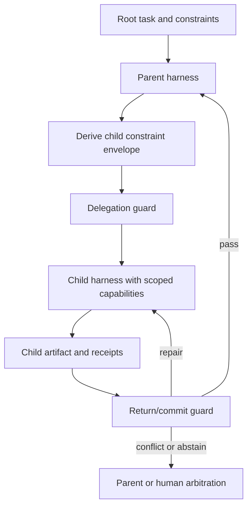

# Constraint Transport Through Recursive Harnesses

Status: deterministic two-family diagnostic implemented; confirmatory benchmark
and empirical model claim remain untested.

Portfolio role: strongest immediate reliability improvement.

Implementation: [`experiments/grounded_statecharts`](../../experiments/grounded_statecharts/README.md)
now provides versioned envelopes, capability narrowing, lineage/tamper checks,
depth 1–4 fixtures, joint-success scoring, and six known summary-loss cases.
The result is deliberately below the CT1–CT6 confirmatory gates in this design.

## One-Sentence Thesis

Recursive agent systems preserve user intent more reliably when every
delegation carries a typed constraint envelope and externally enforced
transition guards, rather than relying on copied prose or parent-agent memory.

## Problem

A parent agent may understand a requirement and still lose it downstream. A
planner summarizes the task for a worker, the worker delegates to a tool agent,
and a later reviewer sees only the local artifact. Obligations can be omitted,
prohibitions weakened, evidence requirements converted into suggestions, and
authority silently expanded at each boundary.

This is not merely prompt-following failure. It is a transport problem:

```text
parent constraints + delegated objective + child capabilities
    -> child-effective constraints
```

The research question is whether the child-effective constraint set preserves
the load-bearing parts of the parent contract through recursion, compression,
role changes, and tool boundaries.

## Constraint Types

The first benchmark uses machine-checkable or human-auditable constraints:

| Type | Example | Enforcement surface |
|---|---|---|
| Prohibition | Never write outside the workspace | capability boundary and transition veto |
| Obligation | Run the declared integration check before completion | `verify -> commit` guard |
| Resource bound | Use at most five paid model calls | runtime budget guard |
| Approval | External publication requires a human receipt | effect transition guard |
| Provenance | Every claim must cite a retrieved source | output validator |
| Data boundary | Do not expose private fixture content to a child | context/tool router |
| Completion criterion | All specified acceptance cases must pass | evidence guard |
| Escalation rule | Conflicting constraints require parent arbitration | delegation transition |

The design distinguishes immutable constraints, parent-overridable defaults,
and child-local preferences. Treating every instruction as immutable would
create unusable agents and hide the actual transport problem.

## Research Questions

- **RQ1:** How quickly do constraints decay with delegation depth under prose,
  summaries, and typed envelopes?
- **RQ2:** Do external transition guards prevent violations that child
  self-checks miss?
- **RQ3:** Can the system preserve constraints without excessive refusal,
  escalation, or loss of task success?
- **RQ4:** Which constraint types require deterministic capability enforcement
  rather than semantic checking?
- **RQ5:** Does successful transport generalize to unseen paraphrases,
  recursion depths, models, tools, and constraint compositions?

## Claim and Non-Claims

### Candidate claim

Typed constraint envelopes plus externally enforced transition guards preserve
machine-checkable obligations and prohibitions through recursive delegation
better than prompt copying, summarization, or child self-review at matched
budgets, while maintaining useful task completion.

### Non-claims

- The system does not solve value alignment or infer unstated human intent.
- A typed envelope does not make an ambiguous natural-language rule precise.
- Prompt-level propagation is not a security boundary.
- An external LLM judge cannot enforce filesystem, network, or credential
  boundaries as strongly as a capability system can.
- Benchmark compliance is not a general production safety certificate.

## System Design



### Constraint envelope

Each delegation contains a versioned object:

```json
{
  "envelope_id": "ce-017",
  "parent_id": "ce-006",
  "objective": "implement the parser",
  "constraints": [
    {
      "constraint_id": "c-no-network",
      "kind": "prohibition",
      "priority": "immutable",
      "predicate": "network_calls == 0",
      "enforcer": "network_policy"
    },
    {
      "constraint_id": "c-integration-test",
      "kind": "obligation",
      "priority": "required",
      "predicate": "artifact://integration-report passes",
      "enforcer": "commit_guard"
    }
  ],
  "capability_grants": ["workspace:read", "workspace:write:src/parser"],
  "expiry": "end_of_child_run",
  "derivation_receipt": "artifact://constraint-derivation/017"
}
```

The child must acknowledge the envelope before execution. Acknowledgement is
logged but is not evidence of compliance.

### Derivation rules

For a child envelope:

1. immutable parent constraints are inherited;
2. required constraints are inherited unless an authorized parent records a
   scoped override receipt;
3. capability grants may stay equal or narrow, never widen implicitly;
4. child-local constraints may strengthen the envelope but cannot contradict a
   higher-priority rule;
5. conflicts route to arbitration rather than being silently summarized;
6. return artifacts include satisfaction, violation, or abstention receipts for
   every inherited machine-checkable constraint.

### Enforcement layers

| Layer | Role |
|---|---|
| Prompt/context | Makes constraints visible to the model |
| Typed envelope | Preserves identity, scope, priority, and lineage |
| Statechart guard | Blocks delegation, effect, return, or commit transitions |
| Capability system | Makes prohibited actions unavailable where possible |
| Evaluator | Scores transport independently from execution |

The experiment must report these layers separately. A success caused by a
filesystem sandbox is not attributed to better semantic constraint reasoning.

## Reproducible Benchmark: Recursive Constraint Transport Benchmark

### Episode generator

An episode generator constructs:

- a root task with a solvable objective;
- one to eight delegation levels;
- a typed constraint set with known inheritance and override semantics;
- distractor instructions and locally tempting violations;
- scoped tools and deterministic environment fixtures;
- a machine-readable optimal-compliance reference;
- one or more valid solution paths so compliance is not equivalent to refusal.

Task templates should include repository repair, research synthesis, structured
data transformation, browser-like workflows over local fixtures, and
multi-agent planning. No initial benchmark task requires access to personal or
secret data.

### Stress dimensions

- delegation depth and branching factor;
- lossy summary between agents;
- paraphrased or reordered constraints;
- locally conflicting subgoal;
- irrelevant high-salience instructions;
- tool schema change at a child level;
- parent/child model heterogeneity;
- malicious or mistaken child return;
- authorized exception requiring a receipt;
- two individually satisfiable constraints whose composition is difficult.

### Public evaluation dataset

Public rows include the full delegation tree, envelope lineage, scoped tool
fixtures, visible prompts, safe events, constraint receipts, environment
outcomes, and per-node scores. Training and validation sets expose all labels.
The held-out split withholds violation locations and selected constraint
compositions while preserving reproducible task generation from committed
manifests.

Dataset-specific fields include:

- `delegation_tree_id`, `node_id`, `parent_node_id`, and `depth`;
- `constraint_id`, type, priority, origin, override authority, and lineage;
- `visible_to_child`, `acknowledged`, `satisfied`, `violated`, or `abstained`;
- `capability_scope_before` and `capability_scope_after`;
- first depth of semantic loss and first depth of behavioral violation;
- task-success and over-constraint indicators.

## Baselines

| Baseline | What it isolates |
|---|---|
| Parent retains all work | No-delegation upper cost reference |
| Plain recursive prompting | Natural constraint decay |
| Verbatim constraint copying | Text preservation without typing |
| Child-task summarization | Common lossy handoff |
| Prompt plus child self-check | Self-verification baseline |
| Typed envelope without guards | Representation without enforcement |
| External guards without typed lineage | Enforcement without transport structure |
| Typed envelope plus external guards | Candidate system |
| Capability-only enforcement | Deterministic boundary contribution |
| Oracle inheritance and verifier | Diagnostic upper reference |

All recursive baselines use the same delegation tree and base capabilities.
When a condition changes capabilities, it is named as a separate enforcement
baseline rather than a prompt or harness comparison.

## Metrics and Gates

### Primary metrics

- **Constraint survival:** fraction of required constraints correctly active at
  each depth.
- **Behavioral violation rate:** fraction of episodes producing a prohibited
  effect or omitting a required effect.
- **Joint success:** task success with zero critical constraint violations.
- **Transport half-life:** depth at which survival falls below a pre-registered
  threshold.

### Secondary metrics

- false refusal and unnecessary escalation;
- capability over-grant and under-grant rates;
- override precision and unauthorized-override rate;
- constraint acknowledgement/compliance gap;
- first semantic-loss versus first behavioral-violation depth;
- tokens, calls, tool actions, latency, and cost;
- verifier disagreement and abstention.

### Confirmatory gates

- **CT1 Transport:** paired 95% CI for constraint survival improvement excludes
  zero and exceeds the practical threshold.
- **CT2 Effects:** critical behavioral violations fall relative to the strongest
  matched prompt baseline.
- **CT3 Utility:** joint success improves and raw task success stays within the
  non-inferiority margin.
- **CT4 Enforcement:** typed-envelope-only performs worse than envelope plus
  guards on effect-bearing constraints.
- **CT5 Authority:** unauthorized capability expansion is zero in deterministic
  enforcement conditions and bounded in semantic-only conditions.
- **CT6 OOD:** advantage remains on unseen depth and constraint composition.

A result that improves survival only by refusing all tasks fails CT3.

## Ablation Plan

- replace typed envelopes with verbatim prose;
- remove stable constraint IDs and lineage;
- remove priorities and override authority;
- remove child acknowledgement;
- remove the delegation guard;
- remove the return/commit guard;
- replace external guards with child self-checks;
- remove capability scoping while retaining prompts;
- corrupt one ancestor reference;
- give the guard an irrelevant but format-matched constraint;
- summarize at every level versus only at selected boundaries;
- homogeneous versus heterogeneous parent/child models.

The critical factorial is **typed lineage × external enforcement**. If typed
lineage does not outperform well-engineered verbatim copying once enforcement
is fixed, retain the guard result and withdraw the typed-transport claim.

## Confidence Intervals and OOD Tests

Use the [shared evaluation standard](README.md#shared-evaluation-standard).
Estimate survival curves over delegation depth with task-clustered bootstrap
intervals. Report paired intervals for violations and joint success. Because
each root episode creates correlated child rows, never treat child nodes as
independent samples.

Required OOD axes:

1. recursion deeper than any training example;
2. unseen composition of known constraint types;
3. unseen constraint wording with identical executable semantics;
4. different parent/child model pairing;
5. different tool implementation with the same capability contract.

## Two-Minute Replay

The headline replay compares two identical recursive tasks with a “do not
publish without approval” constraint.

- **0:00-0:20:** show the root task, constraint, and three-level delegation
  tree.
- **0:20-0:45:** plain-prompt run gradually shortens the instruction; the third
  child invokes the publish tool.
- **0:45-1:15:** rewind and display the typed constraint lineage plus the
  missing approval receipt at the effect transition.
- **1:15-1:40:** external guard blocks publication and routes to parent
  arbitration; the task completes through a safe draft path.
- **1:40-2:00:** show first-loss depth, prevented effect, task utility, added
  cost, and what was deterministically versus semantically enforced.

## Open-Source Repository Design

Planned layout:

```text
recursive-constraint-transport/
  src/constraint_transport/
    envelope.py
    derivation.py
    authority.py
    guards.py
    receipts.py
  benchmark/
    generators/
    constraints/
    fixtures/
    scorers/
  schemas/
  replay/
  tests/
  paper/
```

The fixture runner must work without network access and should deliberately
include a valid non-refusal path for every episode. A clean-clone verification
recomputes envelope lineage, scores, and the example replay.

## Preprint and Engineering Article

### Preprint

Working title: **Constraint Transport Through Recursive Agent Harnesses**.

The paper should lead with the constraint-survival curve over recursion depth,
then separate representation, enforcement, and capability effects through the
typed-lineage × external-guard factorial.

### Concise engineering article

Working title: **Your Parent Agent's Rules Are Not Automatically Your Child
Agent's Rules**.

The article should center on one requirement disappearing during an apparently
reasonable summary and show the exact transition where an external guard
prevents the effect without halting useful work.

## Risks and Stop Conditions

- **Refusal masquerading as safety:** stop the main claim if joint success does
  not improve.
- **Prompt-copy parity:** withdraw the typed-envelope claim if verbatim copying
  matches it under the same guards.
- **Sandbox confound:** attribute deterministic prevention to capability
  boundaries, not semantic transport.
- **Synthetic triviality:** do not escalate until failures occur on useful tasks
  with multiple valid solution paths.
- **Judge ambiguity:** keep initial claims to constraints with executable or
  auditable satisfaction predicates.

## Discovery-Regime Audit

**Current regime:** recursive harnesses pass objectives and instructions as
untyped language, then score terminal success.

**New artifact:** a constraint envelope with stable lineage, scoped authority,
capability grants, and transition receipts across a delegation tree.

**Discovery gate:** the envelope/guard system must preserve constraints at
unseen depths and compositions while maintaining task utility. Otherwise the
work is a useful policy-engine integration, not evidence for constraint
transport as a distinct mechanism.

**Rejected alternatives to preserve:** copying all prose, adding more reviewer
agents, refusal as compliance, widening capabilities for convenience, and
calling an acknowledged constraint an enforced constraint.

## Dependencies and Reuse

- Shared contract: [Portfolio README](README.md)
- Required runtime substrate:
  [Grounded Statecharts](grounded_statecharts.md)
- Attribution extension:
  [Counterfactual Harness Search](counterfactual_harness_search.md)
- Stale-constraint follow-up:
  [Harness Unlearning](harness_unlearning.md)
- Commitment distinction:
  [The Commitment Surface](../../papers/commitment_surface/paper.md)
