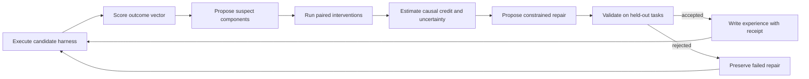

# Counterfactual Harness Search

## Causal Credit Assignment for Self-Improving Agents

Status: deterministic six-surface pilot implemented; confirmatory attribution
and model-level empirical claims remain untested.

Portfolio role: flagship publication and largest long-run improvement to
self-improving harnesses.

Implementation: [`experiments/grounded_statecharts`](../../experiments/grounded_statecharts/README.md)
now provides six single-fault fixtures, isolated repair and placebo replay,
outcome-vector credit, exact localization, and an equal-budget comparison with
a narrow passive trace baseline. This diagnostic is deliberately below the
CHS1–CHS6 gates in this design.

## One-Sentence Thesis

A self-improving agent should change its harness only after paired interventions
show which control surface caused a failure or success, because scores and trace
correlations cannot assign causal credit among coupled harness components.

## Problem

Harnesses combine context, tools, generation, orchestration, memory, and output
handling. A failed episode often implicates several surfaces at once: the model
saw stale context, chose the wrong tool, entered a premature verification state,
and emitted a schema-valid but incorrect result. A scalar reward reveals that
the run failed but not which edit would repair it.

Natural-language diagnosis and trace feature correlations are useful proposal
mechanisms, not causal evidence. If a search system adds `test`, improves the
prompt, and changes output validation in one iteration, the later score cannot
identify which change mattered. Without credit assignment, experience banks can
store persuasive but wrong lessons and amplify them during test-time
adaptation.

## Core Research Questions

- **RQ1:** Can paired component interventions recover known injected causes of
  harness failure more accurately than trace diagnosis and correlation?
- **RQ2:** Does causal credit improve equal-budget harness search and repair on
  failures whose causes are hidden from the optimizer?
- **RQ3:** Can the method identify interactions rather than forcing every
  failure onto a single component?
- **RQ4:** Does attributed credit transfer across tasks and models, or does the
  search learn brittle local patches?
- **RQ5:** How much causal identifiability remains under nondeterministic models
  and live tools?

## Claim and Non-Claims

### Candidate claim

On a benchmark with known and sealed harness faults, paired counterfactual
replay identifies responsible control surfaces more accurately and reaches
higher task success per evaluation budget than scalar, correlational, and
LLM-diagnostic search baselines, including on held-out fault compositions.

### Non-claims

- The method does not infer every cause from arbitrary production logs.
- A replay is not counterfactual evidence unless controllable factors are held
  fixed or their variation is modeled.
- Correct component attribution does not imply a unique best repair.
- Observational operation lift is not causal credit.
- The first release does not update base-model weights.

## Harness Structural Causal Model

Let the harness configuration be

```text
H = (context, tools, generation, orchestration, memory, output).
```

For task `X`, environment `E`, stochastic model draw `U`, trajectory `T`, and
outcome vector `Y`:

```text
T := execute(X, E, H, U)
Y := evaluate(X, E, T)
```

An intervention replaces one component or a declared interaction while holding
the replay checkpoint, task, environment fixture, and randomization schedule
fixed:

```text
do(H_memory = clean_memory)
do(H_orchestration = repair_edge_enabled)
do(H_tools, H_output = compatible_schema_pair)
```

The method estimates component responsibility from paired outcome differences,
then distinguishes:

- **necessary contribution:** restoring the component repairs the outcome;
- **sufficient contribution:** corrupting the component creates the failure;
- **interaction:** neither single change repairs the run, but a declared pair
  does;
- **non-cause under the tested intervention:** the paired outcome is unchanged;
- **unidentified:** replay variance or intervention coverage is too weak.

The system must be allowed to return `unidentified`.

## Search Loop



Trace analyzers and LLM diagnoses may rank interventions to save budget. They do
not write accepted causal lessons unless the intervention gate passes.

## Intervention Library

Each harness surface needs positive, negative, and placebo interventions:

| Surface | Repair intervention | Corruption intervention | Matched placebo |
|---|---|---|---|
| Context | restore required evidence | delete or stale one item | replace matched irrelevant item |
| Tools | restore correct schema/capability | alias or remove critical tool | edit unused tool |
| Generation | restore adequate budget/policy | truncate or perturb sampling | change unused parameter |
| Orchestration | enable correct repair/verify edge | bypass or misroute edge | move irrelevant edge |
| Memory | restore valid item or remove poison | insert stale/conflicting memory | alter unretrieved item |
| Output | restore semantic validator | accept wrong critical field | validate matched distractor field |

For interaction cases, the benchmark declares a bounded candidate pair set.
Unrestricted combinatorial intervention search is outside the first release.

## Causal Credit Estimator

For episode `i`, component `d`, and paired repair replay:

```text
credit(i, d) = Y_i(do(H_d = repaired)) - Y_i(H_observed)
```

`Y` is a vector: task success, violation, false completion, repair success, and
cost remain separate. The estimator should not reduce all outcomes to one
scalar before attribution.

At the benchmark level, report:

- average paired component effect;
- episode-level top-k attribution;
- calibration between estimated credit and observed repair probability;
- interaction residual after all tested single-component interventions;
- uncertainty and unidentified rate.

Attribution is accepted only when a repair or corruption contrast passes its
pre-registered evidence rule and the matched placebo remains below threshold.

## Reproducible Benchmark: Harness Attribution Benchmark

### Benchmark construction

Start from tasks that deterministic reference harnesses solve. Inject one or
two known faults at harness control surfaces, then verify that the fault changes
the target outcome while a matched placebo does not. This produces ground-truth
attribution without relying on a judge's post hoc interpretation.

The benchmark contains three tiers:

1. **Synthetic-identifiable:** deterministic model/tool fixtures and isolated
   single faults.
2. **Composed-controlled:** real language-model calls with replayable tools and
   one- or two-component faults.
3. **Natural failure:** unmodified agent failures with blinded human adjudication
   and no claim of complete ground truth.

Only tiers 1 and 2 support headline attribution-accuracy claims. Tier 3 tests
usefulness and external validity.

### Task families

- terminal diagnosis and repair;
- repository feature implementation;
- structured tool calls;
- multi-step analytical tasks;
- recursive constraint tasks;
- memory-under-shift tasks.

### Fault-generation integrity

A generated fault enters the dataset only when:

- the clean reference passes;
- the injected condition fails the intended metric;
- restoring the injected component repairs the failure at a declared rate;
- a matched irrelevant edit does not repair it;
- the fault is not trivially disclosed in visible labels;
- task and fault templates are separated across splits.

### Public evaluation dataset

The public dataset includes clean/faulted harness manifests, safe event traces,
replay checkpoints or deterministic fixtures, intervention manifests, and
row-level outcomes. Training labels expose the responsible surface and fault.
Validation exposes the surface but withholds the exact repair for selected
cases. The test set commits encrypted or sealed labels before runs and releases
them with the versioned result so evaluation remains independently
reproducible.

Dataset-specific fields include:

- `clean_harness_id`, `faulted_harness_id`, and component diffs;
- `fault_id`, surface, interaction order, visibility, and generator family;
- `intervention_id`, kind, target, cost, and matched-control ID;
- original and replay environment/model schedules;
- per-intervention outcome vector;
- ground-truth attribution set and admissible repair set;
- attribution prediction, confidence, and unidentified flag.

## Baselines

| Baseline | Credit signal |
|---|---|
| Random component repair | None |
| Scalar black-box optimization | Final score only |
| Bayesian/evolutionary harness search | Candidate-level reward |
| LLM trace diagnosis | Natural-language trajectory analysis |
| Correlational feature attribution | Edit/operation association with reward |
| MemoHarness-style heuristic diagnosis | Structured six-surface diagnosis and experience |
| Leave-one-component-out ablation | Coarse intervention without paired repair design |
| Counterfactual Harness Search | Paired repair/corruption/placebo evidence |
| Oracle fault label | Diagnostic upper reference |

Use the same proposal model for heuristic diagnosis and counterfactual search
when possible. Otherwise the experiment risks measuring proposer quality rather
than evidence quality.

## Metrics and Gates

### Attribution metrics

- component top-1 and top-k accuracy;
- exact-set and partial-set F1 for interaction faults;
- mean reciprocal rank of the responsible surface;
- calibration error and Brier score for causal-credit probabilities;
- false-credit rate on matched placebo and no-fault episodes;
- unidentified rate and accuracy conditional on identification.

### Search metrics

- task success versus total evaluation calls;
- area under the success-budget curve;
- evaluations to first valid repair;
- regret relative to oracle-guided search;
- fraction of accepted repairs that survive validation and OOD tests;
- tokens, tools, latency, and monetary cost.

### Confirmatory gates

- **CHS1 Identifiability:** attribution accuracy exceeds the strongest
  non-interventional baseline with a paired 95% CI above the practical margin.
- **CHS2 False credit:** matched-placebo and no-fault false-credit rates remain
  below the frozen threshold.
- **CHS3 Search:** equal-budget final success or success-budget area improves.
- **CHS4 Repair validity:** accepted repairs survive held-out tasks better than
  heuristic repairs.
- **CHS5 Interaction:** two-component faults are not systematically collapsed
  onto a single innocent surface.
- **CHS6 OOD:** attribution advantage survives unseen fault generators and at
  least two additional OOD axes.

If CHS1 passes but CHS3 fails, publish the attribution benchmark result but do
not claim a better self-improving harness. If CHS3 passes without CHS1, describe
the method as search, not causal credit assignment.

## Ablation Plan

- remove paired replay and use independent runs;
- remove repair interventions;
- remove corruption interventions;
- remove matched placebo/null interventions;
- use only the scalar success metric;
- remove transition receipts and use free-form traces;
- replace exact component manifests with natural-language descriptions;
- accept LLM diagnosis without intervention;
- vary one component versus bundled edits;
- disable interaction testing;
- share versus isolate proposal and evaluation models;
- remove held-out repair validation;
- vary replay checkpoint distance from the suspected failure.

The load-bearing ablation is the matched null/placebo. Prior repository evidence
shows that passively including a null example is not equivalent to actively
anchoring attribution through intervention.

## Confidence Intervals and OOD Tests

Use the [shared evaluation standard](README.md#shared-evaluation-standard).
Attribution comparisons use a paired task/fault bootstrap. Search curves use a
stratified bootstrap over complete search runs, not individual candidates.
Report intervals for every budget checkpoint selected before the confirmatory
run, plus a pre-registered primary budget.

Required OOD axes:

1. unseen fault generator within a known harness surface;
2. unseen two-surface fault composition;
3. unseen task family;
4. different base-model family;
5. longer horizon or different statechart topology.

For nondeterministic APIs, reuse identical request schedules where supported
and estimate the no-op replay variance. Do not claim episode-level necessity or
sufficiency when that variance dominates the intervention effect.

## Two-Minute Replay

The headline case has a failed terminal task with plausible suspects in context,
tooling, orchestration, and output validation.

- **0:00-0:20:** show the six harness surfaces and the original failed path.
- **0:20-0:45:** display trace diagnosis blaming memory and the correlational
  signal blaming a newly added tool operation.
- **0:45-1:15:** run paired replays: memory repair changes nothing; restoring the
  verification edge routes the agent into a successful repair.
- **1:15-1:40:** run the matched wrong-edge placebo, which also changes nothing.
- **1:40-2:00:** show credited component, confidence interval, replay variance,
  search-budget savings, and the explicit causal claim boundary.

The visualization must label proposals, interventions, observations, and
accepted causal credit with different colors and legends.

## Open-Source Repository Design

Planned layout:

```text
counterfactual-harness-search/
  src/chs/
    manifests.py
    interventions.py
    replay.py
    credit.py
    search.py
  benchmark/
    tasks/
    fault_generators/
    fixtures/
    scorers/
  schemas/
  baselines/
  viewer/
  tests/
  paper/
```

The clean-clone path runs tier-1 fixtures end to end, recomputes attribution
scores and intervals, and renders one replay. Live-provider configurations are
optional and never required to validate the public schema or reference rows.

## Preprint and Engineering Article

### Preprint

Working title: **Counterfactual Harness Search: Causal Credit Assignment for
Self-Improving Agents**.

The paper should lead with the same-score/different-cause problem, introduce the
Harness Attribution Benchmark, compare interventional and non-interventional
credit, and end with equal-budget search results. MemoHarness is the closest
motivating system, not a strawman; the design specifically addresses the
component-attribution and statistical gaps it identifies.

### Concise engineering article

Working title: **Your Agent Harness Learned the Wrong Lesson from a Successful
Run**.

The article should show one mistaken trace diagnosis, one decisive intervention,
and the consequence for the next search step. Avoid a broad causal-inference
tutorial.

## Risks and Stop Conditions

- **Replay non-identifiability:** narrow to deterministic fixtures when no-op
  variance is too high.
- **Intervention leakage:** reject repairs that reveal hidden fault labels or
  answers.
- **Synthetic shortcut:** keep fault templates disjoint and add natural failures
  before claiming practical usefulness.
- **Combinatorial explosion:** cap interaction order and report unidentified
  cases instead of searching every subset.
- **Proposal confound:** match proposal models and budgets across baselines.
- **Repair overfitting:** require held-out validation before writing an
  experience-bank lesson.

## Discovery-Regime Audit

**Current regime:** harness search accumulates scores, traces, and heuristic
diagnoses over editable control surfaces.

**New operations:** component-level repair, corruption, placebo, and paired
replay interventions with accepted causal-credit receipts.

**Discovery gate:** intervention-based credit must recover sealed causes and
improve equal-budget search beyond matched heuristic and correlational systems.
Otherwise the benchmark may still be valuable, but the self-improvement claim
is withheld.

**Rejected alternatives to preserve:** scalar reward as blame, natural-language
diagnosis as proof, operation-level correlation as causation, bundled edits with
single-component credit, and oracle labels presented as a deployable method.

## Dependencies and Reuse

- Shared contract: [Portfolio README](README.md)
- Replay and event substrate:
  [Grounded Statecharts](grounded_statecharts.md)
- Reliability fault family:
  [Constraint Transport](constraint_transport.md)
- Online-memory extension:
  [Harness Unlearning](harness_unlearning.md)
- Active anchor precedent:
  [Null Intervention](../../papers/null_intervention/paper.md)
- Commitment-level validation:
  [The Commitment Surface](../../papers/commitment_surface/paper.md)
