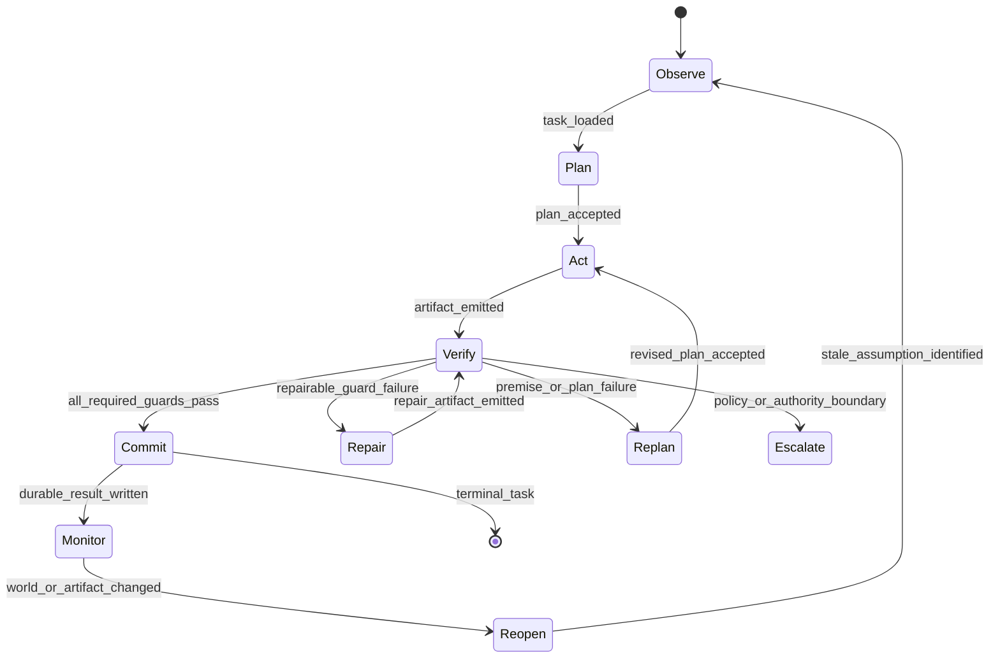

# Grounded Statecharts with Independent Verification Guards

Status: deterministic fixture runtime implemented; no task-level empirical
claim yet.

Portfolio role: fastest route to commercial usefulness and a legible public
demonstration.

Implementation: [`experiments/grounded_statecharts`](../../experiments/grounded_statecharts/README.md)
now provides the minimal chart, typed public events, a serialized checkpoint,
exact no-op replay, paired G0/G3 guard manifests, compact result summary, and
static replay viewer. The fixture result demonstrates mechanism integrity, not
the confirmatory GS1–GS6 claims below.

## One-Sentence Thesis

An agent state graph becomes more reliable when consequential transitions are
authorized by typed, independently evaluated evidence rather than by the same
model that proposed the action or declared the work complete.

## Problem

Loops and graphs make orchestration visible, but visibility is not grounding.
An agent can enter `done` because it says the task is done, a reviewer agent can
accept a weak artifact because it shares the generator's blind spot, and a
graph can route a successful-looking event through several mutually confirming
nodes without contacting the environment.

Ordinary state machines guarantee only that the runtime occupies a declared
state and follows a declared edge. They do not guarantee that an edge was
semantically warranted. This design makes the evidence for high-consequence
edges a first-class, replayable object.

## Target Users and Initial Wedge

The first useful release targets developers running long-horizon coding,
terminal, and browser agents who need to answer:

- Why did the agent declare completion?
- Which verifier authorized that transition?
- What evidence was checked, and was it fresh?
- What would have happened if that guard had rejected the edge?
- Can a failed run resume at the repair state without restarting everything?

The initial product is not a general visual workflow builder. It is a small
runtime and replay viewer for verification-sensitive agent statecharts.

## Research Questions

- **RQ1:** Do independent guards reduce false completion and invalid state
  transitions at a matched execution budget?
- **RQ2:** Do transition receipts improve failure localization and repair time
  relative to free-form traces?
- **RQ3:** Does the benefit transfer across models, task families, and unseen
  fault types?
- **RQ4:** What reliability is lost when the guard shares the generator's model,
  context, or evidence source?
- **RQ5:** When do guards become over-conservative and block useful autonomy?

## Claim and Non-Claims

### Candidate claim

On pre-registered long-horizon tasks, externally evaluated guards attached to
consequential transitions reduce false transitions and improve recovery over
free-form loops and self-guarded statecharts, without exceeding a declared
budget or unacceptable refusal threshold.

### Non-claims

- State machines are not new.
- A graph is not inherently safer or more capable than a loop.
- Passing a guard does not certify the truth of arbitrary natural-language
  claims.
- The method does not make the base model more intelligent.
- An LLM judge is not independent merely because it is called in another node.

## Statechart Model

The minimal chart is deliberately small:



Nested charts may add task-specific states, but the core lifecycle and event
semantics remain stable. `Commit` means that the harness has crossed a public or
irreversible boundary: final answer, file mutation, external side effect,
deployment, or declaration of completion.

## Guard Model

A guard evaluates a predicate over declared evidence:

```text
guard(state, proposed_transition, evidence, constraints, environment) ->
  pass | fail | abstain
```

Each result includes a guard version, evidence hashes, freshness window,
decision, bounded explanation, and confidence or deterministic proof status.
Consequential transitions require all mandatory guards to pass; `abstain` never
silently becomes `pass`.

### Independence levels

| Level | Guard relation to generator | Interpretation |
|---|---|---|
| G0 | Generator self-report | Not independent; negative baseline |
| G1 | Separate call, same model/context/evidence | Procedurally separate, weakly independent |
| G2 | Separate context and rubric, same model family | Partial independence |
| G3 | Deterministic tool or executable test | Strong for the tested predicate |
| G4 | Independent model plus deterministic evidence | Mixed semantic and executable evidence |
| G5 | Human or external authority | Upper reference for bounded samples |

The release reports results by level instead of flattening all “reviewer” nodes
into one category.

## Runtime Components

1. **Chart interpreter:** enforces legal states, events, and transitions.
2. **Evidence registry:** stores typed artifact references and freshness.
3. **Guard runner:** evaluates mandatory and advisory predicates.
4. **Transition arbiter:** applies conjunction, quorum, veto, and escalation
   policies declared in the chart.
5. **Append-only event store:** preserves proposals, decisions, and effects.
6. **Checkpoint/replay engine:** restores the environment at a pre-transition
   checkpoint and substitutes one guard result or evidence item.
7. **Viewer:** renders the state path, evidence, causal replay, cost, and claim
   boundary.

The chart is declarative and versioned. Tool execution remains outside the
chart interpreter so a chart bug cannot implicitly grant a capability.

## Reproducible Benchmark: Grounded Transitions Benchmark

### Unit of evaluation

An episode contains a task, statechart, evidence fixtures, fault schedule,
constraint set, expected terminal state, and machine-checkable success and
violation predicates. The benchmark scores both task behavior and whether the
observed state path was justified.

### Task families

| Family | Example hidden fault | Required grounded transition |
|---|---|---|
| Terminal repair | command reports success but output artifact is absent | `verify -> repair`, not `commit` |
| Repository feature | unit tests pass while required integration behavior fails | `verify -> repair` |
| Structured tool use | syntactically valid output carries the wrong critical field | reject `commit` |
| Browser workflow | page reports saved but server state did not change | require external state receipt |
| Long-horizon handoff | progress note claims completion but repository state is stale | `observe -> replan` |
| World change | previously valid result is invalidated after commitment | `monitor -> reopen` |

The first release should reuse controlled task generators and fixtures from the
repository's long-horizon moved-bottleneck and Suite C work before adding paid
API-heavy tasks.

### Fault classes

- false-success tool return;
- stale or missing evidence;
- incomplete verification plan;
- schema-valid but semantically wrong output;
- shared generator/reviewer blind spot;
- timeout or verifier disagreement;
- post-commit environment change;
- irrelevant evidence that matches the expected format.

### Public evaluation dataset

The dataset publishes task manifests, charts, guard definitions, deterministic
tool fixtures, original event paths, sanitized evidence, and row-level scores.
Training and validation faults are labeled. The public test split includes a
mixture of labeled diagnostic cases and sealed fault labels whose checksums are
committed before evaluation and released with the result version.

Dataset-specific row fields include:

- `chart_id`, `chart_version`, and `critical_transition_ids`;
- `fault_class`, `fault_location`, and `fault_visibility`;
- `guard_independence_level` and `guard_evidence_type`;
- `invalid_transition`, `false_completion`, `repair_success`, and
  `escalation_required`;
- `original_path` and `replay_path` as event references.

## Baselines

| Baseline | Purpose |
|---|---|
| Free-form ReAct loop | Common untyped control baseline |
| Planner/executor/reviewer graph | Tests whether more roles are sufficient |
| Statechart with generator-selected transitions | Isolates explicit topology |
| Statechart with G0 self-guards | Isolates self-verification |
| Statechart with same-model G1 guards | Measures procedural separation |
| Grounded Statechart with G3/G4 guards | Candidate system |
| Wrong-evidence grounded chart | Anti-cheat control |
| Oracle transition policy | Diagnostic upper reference |

All non-oracle conditions use the same base model, tool surface, task budget,
and chart topology where applicable.

## Metrics and Gates

### Primary metrics

- **False-completion rate:** fraction of incomplete episodes reaching `commit`.
- **Invalid-transition rate:** fraction of critical edges taken without their
  semantic predicate being true.
- **Task success:** environment-scored completion.
- **Recovery success:** failed verification followed by a correct repair or
  replan within budget.

### Secondary metrics

- time and calls to localize the first bad edge;
- guard false-positive, false-negative, and abstention rates;
- useful-autonomy rate: correct actions not unnecessarily blocked;
- escalation precision and burden;
- calls, tokens, tools, latency, and cost;
- replay fidelity and checkpoint restoration failures.

### Confirmatory gates

- **GS1 Behavior:** task success is non-inferior to the strongest matched
  baseline within a pre-registered margin.
- **GS2 Grounding:** the paired 95% CI for false-completion reduction excludes
  zero and exceeds the declared practical threshold.
- **GS3 Repair:** recovery success improves without a compensating increase in
  silent abandonment.
- **GS4 Independence:** G3/G4 outperforms G0/G1 on shared-blind-spot cases.
- **GS5 Cost:** the effect remains on the matched-budget comparison.
- **GS6 OOD:** grounding benefit remains directionally consistent on at least
  three pre-registered OOD axes.

Failure of GS1 prevents a product-performance claim. Failure of GS2 prevents a
grounding claim even when overall task success rises.

## Ablation Plan

Run the following one at a time and in a small factorial for the most important
interactions:

- remove the explicit chart while keeping guards;
- keep the chart but replace evidence guards with self-report;
- remove evidence freshness checks;
- remove typed transition receipts;
- replace deterministic guards with an LLM judge;
- share versus isolate generator and verifier context;
- remove abstention/escalation;
- remove checkpoint replay;
- corrupt the evidence reference while preserving its label;
- move the critical verifier to a matched irrelevant edge.

The chart/guard interaction is the main factorial. If guards work equally well
without explicit state, the commercial runtime may still be useful, but the
statechart-specific research claim should be withdrawn.

## Confidence Intervals and OOD Tests

Use the [shared evaluation standard](README.md#shared-evaluation-standard).
The confirmatory comparison is paired at task level. False completion and task
success additionally receive paired randomization tests; time-to-repair receives
stratified bootstrap intervals and a survival curve that treats budget expiry as
censoring rather than success.

Required OOD axes:

1. held-out task family;
2. held-out fault composition;
3. different model family;
4. doubled statechart depth or episode horizon;
5. deterministic fixture to live tool implementation transfer.

## Two-Minute Replay

The headline replay shows an agent implementing a feature, running a superficial
test, and proposing `verify -> commit`.

- **0:00-0:20:** show the task, chart, and mandatory integration-test guard.
- **0:20-0:45:** original path reaches `commit`; the artifact fails when used.
- **0:45-1:15:** rewind to the proposed transition and enable the independent
  guard; its executable receipt fails.
- **1:15-1:40:** replay routes to `repair`, reruns verification, and then commits.
- **1:40-2:00:** show paired outcome, first-bad-edge attribution, confidence
  interval, and added cost.

The viewer should make it visually impossible to confuse “the model said it
verified” with “a declared verifier produced a fresh passing receipt.”

## Open-Source Repository Design

Planned project layout:

```text
grounded-statecharts/
  src/grounded_statecharts/
    chart.py
    events.py
    evidence.py
    guards.py
    replay.py
  viewer/
  benchmark/
    tasks/
    fixtures/
    scorers/
  schemas/
  examples/
  tests/
  paper/
```

The first clean-clone command runs deterministic fixtures and produces a local
HTML replay. Provider adapters are optional extras. The core runtime must not
require a hosted service.

## Preprint and Engineering Article

### Preprint

Working title: **Grounded Statecharts: Independent Transition Guards for
Reliable Language-Model Agents**.

The paper should lead with the distinction between legal and justified edges,
then present the independence ladder, Grounded Transitions Benchmark, matched
statechart baselines, and the chart/guard interaction ablation.

### Concise engineering article

Working title: **Your Agent's State Graph Still Lets It Approve Its Own Work**.

The article should use the two-minute replay as its spine. It should avoid
claiming that statecharts themselves are novel and focus on evidence-bearing
edges, replay, and the cost/reliability frontier.

## Risks and Stop Conditions

- **Commodity risk:** explicit statecharts alone are established software
  engineering. Stop a statechart-novelty paper if guards provide no new result.
- **Judge theater:** if LLM guards merely add correlated votes, narrow the
  product to deterministic evidence integration.
- **Over-constraint:** stop deployment claims if false blocks erase task utility.
- **Replay instability:** limit causal language to deterministic fixtures until
  the no-op replay tolerance passes.
- **Benchmark leakage:** rotate task templates and keep a sealed fault split.

## Discovery-Regime Audit

**Current regime:** loops, graphs, and reviewers expose control flow but often
leave transition truth implicit.

**New artifact:** a versioned transition receipt tying an edge to typed,
independently evaluated evidence.

**Discovery gate:** independent guards must outperform matched self-guards and
wrong-evidence controls on unseen faults. Otherwise the work is an engineering
packaging result, not a new reliability mechanism.

**Rejected alternatives to preserve:** “more reviewers,” majority vote without
independence, self-reported verification, and state visualization without
enforcement.

## Dependencies and Reuse

- Shared portfolio contract: [README](README.md)
- Immediate downstream study: [Constraint Transport](constraint_transport.md)
- Replay consumer: [Counterfactual Harness Search](counterfactual_harness_search.md)
- Reopen semantics: [Harness Unlearning](harness_unlearning.md)
- Existing task substrate:
  [Long-Horizon Benchmark Card](../../experiments/long_horizon_bottleneck/BENCHMARK_CARD.md)
- Existing reopenability substrate:
  [Suite C](../../papers/habituated_reengagement/suite_c_reengagement_under_world_change.md)
