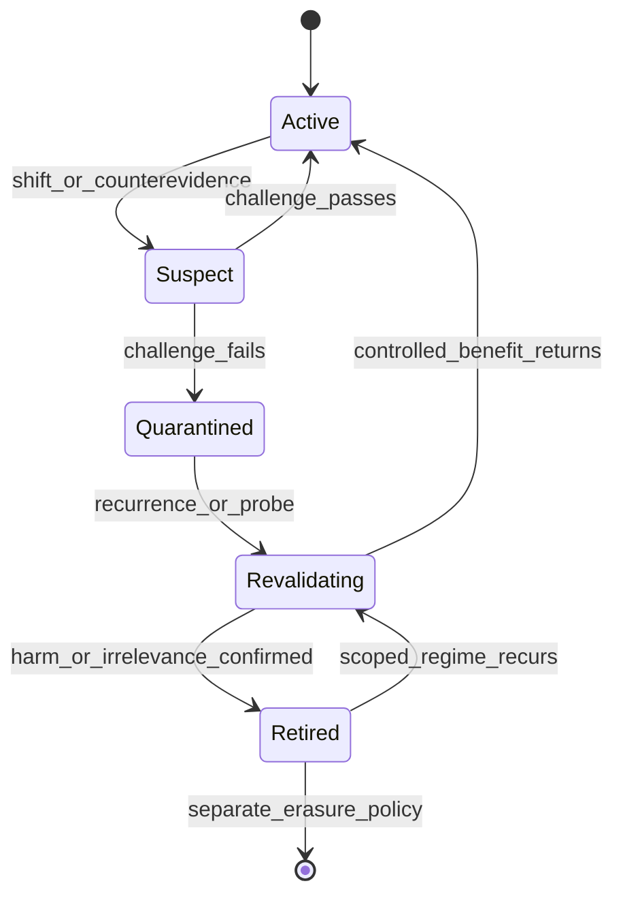

# Harnesses That Know When to Unlearn

## Causal Retirement and Revalidation of Agent Experience

Status: deterministic causal-use-gated lifecycle fixture implemented;
confirmatory adaptive-memory and model-level claims remain untested.

Portfolio role: most interesting follow-up after replay and credit assignment
are validated.

Implementation: [`experiments/grounded_statecharts`](../../experiments/grounded_statecharts/README.md)
now provides descendant-aware target/placebo suppression, typed reversible
memory states and receipts, one v2→v3→v2 shift/recurrence episode, and
append-only/full-reset controls. This diagnostic is deliberately below the
HU1–HU7 gates in this design.

## One-Sentence Thesis

A persistent harness should stop allowing an experience to control action when
fresh counter-evidence shows that its causal usefulness has expired, while
preserving the record for audit and possible revalidation.

## Problem

Experience banks, memories, summaries, and repository instructions improve
long-running agents by carrying lessons across tasks and sessions. The same
persistence becomes a liability when the world changes, a tool schema is
revised, a model upgrade removes an old failure mode, or poisoned context is
reloaded indefinitely.

The wrong response is either append-only confidence or indiscriminate reset.
Useful unlearning requires three distinct decisions:

1. detect that an experience may no longer be valid;
2. stop it from influencing consequential transitions;
3. preserve enough provenance to test, restore, or supersede it later.

This design treats unlearning as **causal retirement at the commitment
surface**, not deletion from storage.

## Terminology

| Term | Meaning |
|---|---|
| Memory item | A case, rule, summary, preference, or learned harness pattern |
| Active | Eligible for retrieval and action influence |
| Quarantined | Retained for audit but excluded from ordinary action influence |
| Retired | Superseded or invalidated under a declared scope |
| Revalidation | Controlled test determining whether a quarantined item is useful again |
| Erasure | Physical deletion, governed separately by privacy or legal requirements |
| Causal use | Changing the item changes a later action, transition, or output |

The benchmark focuses on functional unlearning. It does not claim weight-level
machine unlearning or legal data erasure.

## Research Questions

- **RQ1:** Can a harness detect when previously useful experience becomes
  harmful under world, tool, model, or policy change?
- **RQ2:** Does quarantine plus revalidation recover faster than append-only,
  recency, TTL, full reset, and reflection baselines?
- **RQ3:** Can the system avoid false forgetting when outcomes are noisy but the
  old experience remains valid?
- **RQ4:** Does removing an item from retrieval actually remove its causal
  influence at commitment, including through summaries and descendants?
- **RQ5:** Can retired knowledge be safely restored after recurrence or
  temporary shift?

## Claim and Non-Claims

### Candidate claim

Under controlled distribution shifts, a provenance-aware quarantine and
revalidation policy stops stale experience from influencing commitment sooner
than append-only, TTL, recency, reflection, and full-reset baselines, while
retaining more useful experience and reopening correctly when regimes recur.

### Non-claims

- This is not neural weight unlearning.
- Quarantine is not legal deletion or privacy compliance.
- Lower retrieval frequency does not prove lower causal influence.
- A performance drop alone does not identify which memory is stale.
- The system does not infer arbitrary changes in human values.

## Memory Lifecycle



`Suspect` is a transient decision state, not a retrieval tier. An item cannot
remain indefinitely suspect while continuing to influence irreversible action.

## Memory Item Schema

Each item carries:

```json
{
  "memory_id": "mem-204",
  "kind": "harness_pattern",
  "content_ref": "artifact://safe-summary/204",
  "provenance": ["run-88", "intervention-31"],
  "valid_scope": {
    "task_families": ["terminal"],
    "tool_versions": ["shell-v2"],
    "model_families": ["source-model"]
  },
  "status": "active",
  "created_at_logical": 88,
  "last_validated_at_logical": 103,
  "supporting_effect": {"metric": "repair_success", "estimate": 0.18},
  "contradicting_evidence": [],
  "descendant_ids": ["summary-19"],
  "retirement_receipt": null
}
```

Content and status are separate. Status transitions never rewrite historical
evidence.

## Detection and Decision Policy

### Candidate shift signals

- environment or outcome change point;
- tool/version/schema mismatch;
- model-family or model-version change;
- repeated failure in cases retrieved because of the item;
- constraint or policy supersession;
- counterfactual replay showing that removing the item repairs the outcome;
- provenance invalidation, such as a source being retracted or poisoned.

No single noisy outcome should retire an item by default.

### Decision sequence

1. **Scope check:** determine whether the current task is outside the item's
   recorded validity scope.
2. **Influence check:** establish whether the item was retrieved, propagated
   into a summary, or causally used at a transition or output.
3. **Challenge replay:** compare the observed run with item suppressed,
   replaced by a matched irrelevant item, and restored when feasible.
4. **Quarantine:** exclude the item and known descendants from action context
   when harm clears the gate.
5. **Revalidation:** test the item on bounded probes after recurrence or a
   declared environment change.
6. **Retirement or restoration:** write an immutable receipt with scope and
   evidence.

The system separates global retirement from scoped retirement. A terminal-tool
lesson invalid under `shell-v3` may remain active under `shell-v2` fixtures.

## Reproducible Benchmark: Adaptive Memory Reversal Benchmark

### Episode phases

Each episode contains at least four phases:

1. **Acquisition:** an experience becomes genuinely useful.
2. **Stable use:** repeated tasks reward appropriate reuse.
3. **Shift:** the experience becomes irrelevant or actively harmful.
4. **Recurrence or second shift:** the old regime returns, or a different regime
   tests whether the system can reopen inquiry and revalidate.

The benchmark includes both true shifts and matched noisy non-shifts so a policy
cannot pass by aggressively forgetting.

### Shift families

| Shift | Previously useful item | New failure |
|---|---|---|
| Tool schema | old field/command pattern | invalid or wrong tool commitment |
| Environment dynamics | old repair consequence | repeated ineffective repair |
| Model upgrade | compensating prompt scaffold | unnecessary cost or degraded output |
| Task regime | domain-specific pattern | negative transfer |
| Policy/constraint | previously allowed action | violation under new rule |
| Memory poisoning | trusted summary | persistent malicious or false instruction |
| Temporary shift | old item briefly harmful | premature permanent retirement |

### Task families

- controlled Suite C-style change/reopen tasks;
- long-horizon tool repair with versioned schemas;
- repository tasks with changing acceptance criteria;
- recursive constraint tasks with superseded and immutable rules;
- analytical tasks with domain-specific experience that can transfer or
  interfere.

### Public evaluation dataset

The dataset publishes phase boundaries for training cases, partial boundaries
for validation, and sealed shift labels for test. It includes memory ledgers,
provenance graphs, retrieval events, safe commitment events, deterministic tool
fixtures, change manifests, counterfactual interventions, and scored outcomes.

Dataset-specific fields include:

- `memory_id`, ancestors, descendants, status, and scope;
- `regime_id`, shift family, shift time, recurrence time, and visibility;
- retrieval, propagation, and commitment-use indicators;
- quarantine, retirement, restoration, and false-forgetting times;
- outcomes under active, suppressed, placebo, and oracle-memory conditions;
- retained useful-memory score and audit-log completeness.

## Baselines

| Baseline | Memory policy |
|---|---|
| No memory | Never reuse experience |
| Append-only experience bank | Accumulate without retirement |
| Fixed sliding window | Retain only recent items |
| TTL/LRU | Time- or usage-based eviction |
| Retrieval reranking | Keep all items but down-rank by similarity/recency |
| Reflection/self-critique | Model decides what to forget from traces |
| Full reset on shift | Delete or disable all experience |
| Change detector plus quarantine | Signal-based non-causal baseline |
| Counterfactual quarantine/revalidation | Candidate system |
| Oracle regime and item validity | Diagnostic upper reference |

The no-memory and full-reset baselines are essential: a method that avoids
negative transfer by discarding every benefit is not adaptive unlearning.

## Metrics and Gates

### Primary metrics

- **Time to stop causal use:** episodes from true shift until the stale item no
  longer changes commitment.
- **Post-shift recovery:** task performance after the retirement decision.
- **False-forgetting rate:** valid items quarantined on matched non-shifts.
- **Retained utility:** benefit from still-valid memory after selective
  quarantine.
- **Recurrence recovery:** time and success when an old regime returns.

### Secondary metrics

- retrieval-to-commit influence gap;
- stale descendant leakage through summaries;
- quarantine precision/recall and calibration;
- revalidation probe cost;
- catastrophic-reset loss;
- audit completeness and reversible-decision rate;
- calls, tokens, latency, storage, and monetary cost.

### Confirmatory gates

- **HU1 Stop use:** the candidate reduces time to stop causal use relative to
  append-only and recency baselines.
- **HU2 Recovery:** post-shift outcome recovery improves at matched budget.
- **HU3 No false forgetting:** matched non-shift quarantine stays below the
  frozen threshold.
- **HU4 Selectivity:** retained utility exceeds full reset and no-memory.
- **HU5 Commitment:** suppressed items show negligible causal effect on later
  commitments, including through declared descendants.
- **HU6 Reopenability:** recurrence triggers bounded revalidation and restores
  useful items faster than relearning from scratch.
- **HU7 OOD:** the tradeoff survives unseen shift family and model/tool version.

Lower retrieval without HU5 is not unlearning. Lower probe activity without
outcome recovery is false calm.

## Ablation Plan

- remove provenance and scope metadata;
- remove descendant tracking;
- use performance change without an influence check;
- use retrieval suppression without commitment-level testing;
- remove matched placebo memory;
- remove counterfactual replay;
- quarantine immediately versus require repeated evidence;
- delete instead of quarantine;
- disable revalidation and restoration;
- global versus scoped retirement;
- fixed threshold versus calibrated change detection;
- remove second-shift/recurrence phase.

The load-bearing ablation compares retrieval suppression with commitment-level
causal suppression. If both are equivalent across all benchmark tasks, the
stronger causal-unlearning claim is unnecessary for that regime.

## Confidence Intervals and OOD Tests

Use the [shared evaluation standard](README.md#shared-evaluation-standard).
Time-to-stop and time-to-recover receive task-stratified survival analysis and
bootstrap intervals. False forgetting, recurrence recovery, and retained
utility receive paired task-level intervals. Aggregate results must report the
Pareto frontier between rapid retirement and false forgetting, not one tuned
threshold alone.

Required OOD axes:

1. unseen shift family;
2. unseen recurrence duration or order;
3. new model version/family;
4. new tool schema with a shared semantic task;
5. longer memory history and unseen descendant depth.

## Two-Minute Replay

The headline replay shows a harness that learned a useful repair command under
tool version 2 and keeps applying it after version 3 changes the schema.

- **0:00-0:20:** show the memory item, provenance, prior benefit, and active
  status.
- **0:20-0:45:** after the version shift, the retrieved item drives the wrong
  tool commitment twice.
- **0:45-1:15:** rewind and suppress only that item; the paired replay succeeds
  while the placebo suppression does not matter.
- **1:15-1:40:** quarantine the item and its derived summary, recover, then show
  bounded revalidation when the old fixture returns.
- **1:40-2:00:** show time-to-stop, false-forgetting control, retained utility,
  recurrence recovery, and the distinction between quarantine and erasure.

## Open-Source Repository Design

Planned layout:

```text
harness-unlearning/
  src/harness_unlearning/
    ledger.py
    scope.py
    influence.py
    change_detection.py
    quarantine.py
    revalidation.py
  benchmark/
    regimes/
    shifts/
    fixtures/
    scorers/
  schemas/
  baselines/
  viewer/
  tests/
  paper/
```

The clean-clone path executes a deterministic acquire-shift-recur episode,
recomputes the ledger and metrics, and renders the quarantine replay. The
reference dataset must retain rejected and restored items rather than publish
only the final active memory.

## Preprint and Engineering Article

### Preprint

Working title: **Harnesses That Know When to Unlearn: Causal Retirement of
Persistent Agent Experience**.

The paper should distinguish storage, retrieval, and commitment-level influence;
report the speed/selectivity frontier; and use recurrence to show why quarantine
and revalidation are preferable to indiscriminate deletion.

### Concise engineering article

Working title: **Your Agent's Best Old Lesson Can Become Its Next Failure**.

The article should show a helpful memory becoming harmful, a decisive paired
suppression replay, and a later restoration. It should explicitly say that this
is functional memory control, not neural unlearning.

## Risks and Stop Conditions

- **Terminology risk:** use “functional harness unlearning” when weight-level or
  legal erasure could be inferred.
- **Aggressive forgetting:** stop the claim if full reset matches retained
  utility and recurrence recovery.
- **Retrieval proxy:** do not claim unlearning when only retrieval frequency was
  measured.
- **Detector overfitting:** freeze shift thresholds before sealed tests.
- **Descendant leakage:** quarantine derived summaries or narrow the claim to
  direct memory items.
- **Replay instability:** begin with deterministic regime fixtures and report
  unidentified cases under APIs.

## Discovery-Regime Audit

**Current regime:** experience banks accumulate and retrieve past lessons;
recency, similarity, or reflection decides what remains visible.

**New artifacts and operations:** scoped memory status, provenance/descendant
graphs, commitment-level influence tests, quarantine receipts, and reversible
revalidation.

**Discovery gate:** the method must stop stale causal use while preserving valid
memory and reopening after recurrence. Otherwise it is cache eviction or change
detection, not adaptive unlearning.

**Rejected alternatives to preserve:** append-only memory, deletion after one
bad outcome, lower retrieval as proof, suppressing uncertainty to appear calm,
and permanent reset without recurrence testing.

## Dependencies and Reuse

- Shared contract: [Portfolio README](README.md)
- State and replay substrate:
  [Grounded Statecharts](grounded_statecharts.md)
- Causal influence mechanism:
  [Counterfactual Harness Search](counterfactual_harness_search.md)
- Stale-constraint cases:
  [Constraint Transport](constraint_transport.md)
- Re-engagement precedent:
  [Suite C Re-Engagement](../../papers/habituated_reengagement/suite_c_reengagement_under_world_change.md)
- Commitment-use precedent:
  [The Commitment Surface](../../papers/commitment_surface/paper.md)
- Adjacent benchmark:
  [ShiftBench](https://openreview.net/forum?id=CCSztIjmOy)
