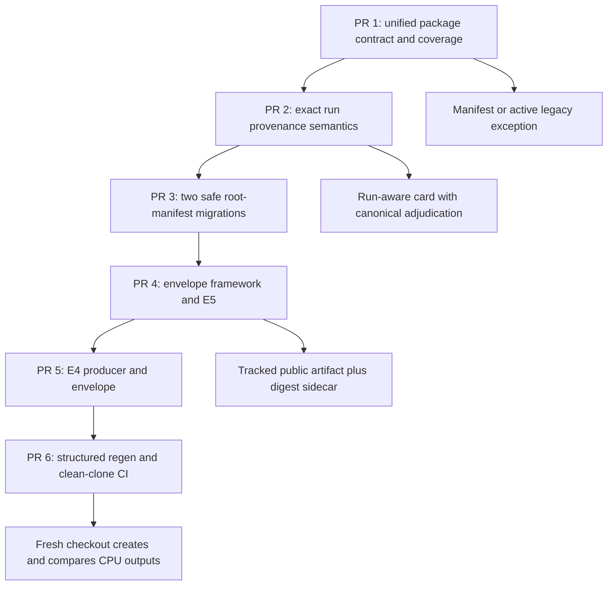

# Evidence Infrastructure Completion Handoff - Plan

> Start from a fresh fetch of `main`, not from a prior experiment branch.
> Audited baseline: `main` at `8c0183bca3d2cc45f40c79150c67001c18fcf748`, immediately after PR #362 merged, with no open pull requests on 2026-07-14.
> Human director: Jawaun Brown. Agent-generated code, results, and papers remain under his direction and review.

## Goal Capsule

- **Objective:** finish the next trustworthy evidence-infrastructure tranche through small merged PRs: package-level manifest coverage, explicit structured provenance bindings with a conservative migration batch, public-artifact envelopes, and clean-clone reproduction.
- **Authority order:** `AGENTS.md`; frozen preregistrations and committed scientific outcomes; this handoff; existing schemas and validators; prose backlogs.
- **Execution profile:** CPU-only repository work. Do not launch Modal or spend L4 resources in this session.
- **Landing policy:** one focused PR per dependency layer. Merge each green PR before fetching fresh `main` and starting the next worktree.
- **Parallelism:** use the available agent slots for disjoint read-only inventory, test design, and review. Serialize edits to shared schemas, validators, generated indexes, and docs unless the harness guarantees isolated worker branches.
- **Stop conditions:** stop and report rather than guessing if a migration would adjudicate an ambiguous scientific status, overwrite a newer run binding, weaken publication safety, or require a new preregistration.

---

## Product Contract

### Summary

The four-experiment handoff from PRs #348 and #352 is exhausted, and its old “build E6 first” language is superseded by the audited updates already on `main`.
The highest-value unblocked work is the P0 evidence substrate introduced by PR #357: make structured coverage fail closed, replace heuristic provenance only where an exact run binding exists, validate public artifacts as clean-clone-safe envelopes, and turn `regen.py` from a dispatcher into a verifier for a bounded deterministic lane.

### Current State

| Surface | Audited state on `main` |
|---|---|
| Open PRs | 0 |
| Research packages | 54 direct `experiments/*` packages, excluding `experiments/common` |
| Root manifests | 5: `bayesian_voi`, `commitment_surface`, `mathematical_claims`, `passive_active_phase_map`, `seed_bootstrap_calibration` |
| Manifest gaps | 49 packages, so package-root coverage is 5/54 or 9.26% |
| Generated verification | 54 cards, 229 committed result reports; card status means `paper`/`results`/`scaffold`, not scientific acceptance |
| Structured adjudication | 12 evidence records, 12 claims, and one gate-verdict JSON |
| Last root quality result | Green on merged PR #362: tests, publication guard, validators, provenance check, Ruff, and ty passed |

### Scientific Queue Boundary

- **E5:** complete. The 135-cell confirmatory grid supports the strict `coverage` verdict; do not relaunch it.
- **E6:** runner-complete but frozen-smoke-blocked before round 1 because 8/104 candidates satisfy the frozen two-surface threshold when 52 are required. It needs a new preregistration before the reward contract can change.
- **E7:** executed but integrity-invalid because 6/32 matched groups exceed the frozen 2% per-arm timing gate. G1-G4 are withheld; `INVALID` is not equivalent to `rejected`.
- **M5:** complete strict FAIL. F0/F1/F4/F5 pass and F2/F3 fail; do not tune or rerun it.
- **E5-L:** a historical frozen follow-up, not an active queue item. Activation requires an explicit queue decision, dev calibration, cost audit, and L4 authorization.

### Requirements

#### Manifest Coverage

- R1. Every direct research package must have exactly one package-root `experiment_manifest.json` or one active legacy exception; `experiments/common` remains excluded.
- R2. One authoritative `docs/experiment_contract_registry.json` must record every direct package as either `structured_manifest` or `legacy_exception`; do not create parallel coverage and provenance registries.
- R3. A legacy exception must identify the package, owner, bounded reason code and explanation, next action, review date, expiry date, and frozen legacy cutoff, and must state that it does not adjudicate claims. Normal CI warns 30 days before expiry and fails on expiry; renewals require a reviewed PR, refreshed rationale/next action, and a new horizon of at most 180 days.
- R4. Coverage validation must reject missing, duplicate, expired, orphaned, nested-only, and manifest-plus-exception cases while keeping explicit manifest-path validation backward compatible.
- R5. A newly added package must not be able to pass as legacy merely by adding an ungrounded exception. Store the sorted frozen legacy-package set and its SHA-256 inside the committed registry, validate the digest without consulting Git history, and reject exceptions for packages outside that set. Date-sensitive tests must inject an `as_of` date, and the validator must provide a clearly labeled historical-inspection mode without weakening normal CI.

#### Structured Provenance

- R6. Package cards must distinguish artifact-surface status (`paper`/`results`/`scaffold`), the manifest v1 `status` displayed verbatim as noncanonical `manifest_status`, and claim-level `scientific_adjudications[]`. Each adjudication comes from `claim_registry.status`; evidence or gate `pass`/`fail` is supporting linkage and must never be mapped directly into a claim status. A run with no validated claim binding is `unadjudicated`.
- R7. The unified registry must contain explicit run records with `run_id`, `publication_package`, `runtime_package`, `provenance_mode`, `integrity_state`, optional `manifest_path`, report paths, and exact `claim_ids`, `evidence_ids`, and `gate_verdict_paths`. `integrity_state` is strictly `valid|invalid|not_assessed` and describes execution validity only; a failed scientific gate never implies `invalid`. The registry also supports an optional package `primary_run_id` and `run_coverage: complete|partial`. Validate every ID/path and the bidirectional claim/evidence/gate chain fail closed. A primary run is a display choice, not proof that all package history is structured.
- R8. A structured binding must fail closed on a missing or malformed manifest and must never assume a package-root manifest describes the latest run or silently fall back to prose heuristics.
- R9. Prose command/seed discovery remains temporarily available for active package-level legacy exceptions and for explicit `provenance_mode: legacy_report` run records inside a partially structured package. Every fallback-derived field must be labeled; an unregistered heuristic fallback is an error.
- R10. The first root-manifest migration batch is limited to two unambiguous runs: the negative External Contact LoRA result in `experiments/external_contact/results/p1_pythia_lora_2026_06_22.md` with base seed `20260618`, and `phase5_external_validity`. External Contact is `manifest_status: rejected`, `integrity_state: valid`, and binds the existing rejected claim/failing evidence. Phase 5 is `manifest_status: accepted`, `integrity_state: valid`, and remains canonically unadjudicated unless separately authorized. Remove their two exception records in the same commit. Do not migrate `semantic_concern_geometry`; its aggregate spans two Modal dispatches and the current manifest schema represents only one runtime command.
- R11. `commitment_surface` must gain `experiments/commitment_surface/manifests/m5/experiment_manifest.json` and `experiments/commitment_surface/manifests/e4/experiment_manifest.json` while preserving the existing E5-specific root manifest. The M5 run record has `runtime_package: world_responds`, `publication_package: commitment_surface`, `manifest_status: rejected`, `integrity_state: valid`, and no canonical adjudication. E4 is also `manifest_status: rejected`, `integrity_state: valid`, and canonically unadjudicated. E7 is `integrity_state: invalid`; blocked-before-round-1 E6 is `integrity_state: not_assessed`. Gate-verdict validation must consume the registry-bound run manifest instead of always inferring the package root. The registry may select M5 as the primary card run, but must mark historical run coverage partial.

#### Public Artifacts and Reproduction

- R12. A public payload participates in the first envelope tranche only when its manifest artifact entry declares an `envelope_path`; envelope/provenance files are never recursively enveloped. The exact initial pairs are `e5_generator_vs_coverage.json` -> `e5_generator_vs_coverage.json.envelope.json` and `e4_pythia_lora_v2_appendix.json` -> `e4_pythia_lora_v2_appendix.json.envelope.json`. Each sidecar contains the public-artifact SHA-256, source receipt, exact producer-manifest path, included/omitted fields, row/cell counts, generator version, public-safety classification, and canonical references. Do not put an output digest inside the artifact it hashes.
- R13. A participating public artifact and its sidecar must be safe repo-relative tracked files. Because ignored E4/E5 raw inputs are absent in a clean clone, bootstrap each first sidecar from the committed public JSON and its embedded raw-source receipt; clean-clone validation recomputes the public-artifact digest and verifies receipt consistency but does not pretend to recompute the missing raw hash. Exporter behavior with raw input is tested using fixtures. Canonical claim/evidence/gate arrays may be empty only with an explicit `unadjudicated` marker; E5 binds to the existing E5 manifest and E4 to its dedicated E4 manifest, never to the M5 primary.
- R14. Reproduction recipes must live in or be referenced by the unified structured contract, use argv/cwd data, and avoid `shell=True` command strings.
- R15. The first clean-clone allowlist is exactly `bayesian_voi` -> `experiments/bayesian_voi/results/bayesian_voi_summary.json` and `mathematical_claims` -> `experiments/mathematical_claims/results/mathematical_claims_summary.json`. In an isolated temporary checkout, delete the declared outputs, run the recipes, require that each output is newly created, and compare it byte-for-byte with the committed oracle. A no-op command must fail this test.

#### Documentation and Landing

- R16. Every substantive PR must update `docs/system_design.md` and `docs/module_explainer.md`; provenance-affecting PRs must run `python scripts/gen_provenance.py`.
- R17. `TODO.md` and `docs/primers/backlogs/software_engineering_todo.md` implementation logs must report partial progress honestly; do not mark the broad manifest-migration item complete while legacy exceptions or partial run histories remain.
- R18. Each PR must pass the targeted tests plus `python3 scripts/run_quality_checks.py`, receive a diff-scoped review, be pushed, opened, and merged before the next tranche begins.

### Acceptance Examples

- AE1. Given a new `experiments/new_family/` directory with neither a root manifest nor a valid frozen exception, the no-argument manifest validator fails and the root quality gate stops.
- AE2. Given an expired, duplicate, orphaned, or manifest-overlapping exception, validation fails with the package and reason.
- AE3. Given `commitment_surface/experiment_manifest.json` describing E5 while the generated card is meant to describe M5, provenance uses the explicit M5 binding and never silently substitutes E5 fields.
- AE4. Given a malformed bound manifest, provenance generation fails rather than returning an empty artifact list and scraping prose.
- AE5. Given a public artifact that exists only in ignored local `artifacts/`, clean-clone validation rejects it even though `Path.exists()` is true locally.
- AE6. Given an `accepted` manifest but no validated claim binding, the card reports noncanonical `manifest_status: accepted` and scientific adjudication `unadjudicated`. Given a run with both supported and rejected claims, it renders two entries from `claim_registry.status`; it never collapses evidence/gate pass/fail into one run verdict.
- AE7. Given E4, E5, and M5 records under one package, each public envelope resolves its own producer manifest even when M5 is the card primary.
- AE8. Given a no-op reproduction command with committed outputs already present in the source tree, the isolated verifier deletes those outputs and fails because they were not newly created.
- AE9. Given a clean clone with the committed E4/E5 public JSON but no ignored raw artifact, envelope validation succeeds only by matching the sidecar to the public bytes and the embedded raw-source receipt; it never claims raw-byte revalidation.
- AE10. Given M5's strict scientific FAIL, its registry/card still reports `integrity_state: valid` and `manifest_status: rejected`; only E7 reports `integrity_state: invalid`.

### Scope Boundaries

- Do not launch E6, E5-L, E7, M5, or any other GPU grid.
- Do not change frozen gates, relabel INVALID as rejected, infer a claim from `paper`/`results`/`scaffold`, or treat evidence `PASS` as proof of a positive universal claim.
- Do not bulk-migrate ambiguous multi-run packages such as `activation_geometry`, `rotation_weakness`, or the full `commitment_surface` history.
- Do not require `experiment_id` to equal the package directory; the existing commitment-surface root manifest intentionally uses an E5-specific identifier.
- Do not require committed existence for raw nonpublic artifacts; those may be intentionally gitignored.
- Do not make every historical experiment clean-clone-reproducible in one PR. Start with an explicit CPU allowlist and expand only after the verifier is stable.

---

## Planning Contract

### Key Technical Decisions

- KTD1. **Land six dependency-ordered PRs.** Keep framework changes separate from migrations: unified coverage, provenance semantics, two safe package migrations, envelope framework/E5 example, E4 envelope migration, then clean-clone reproduction.
- KTD2. **Treat package coverage and run coverage as different facts.** A root manifest proves that a package has at least one structured contract, not that every historical run in that directory is structured.
- KTD3. **Use one package contract registry.** Coverage mode, exact root/run bindings, runtime/publication ownership, per-run provenance and integrity, canonical claim/evidence/gate links, primary-run display choice, run-coverage state, and legacy debt live in one schema. Generate downstream indexes rather than maintaining another hand-edited source registry.
- KTD4. **Freeze legacy debt rather than normalize it into claims.** Legacy records are migration metadata and must forbid scientific status, verdict, and claim-tier fields.
- KTD5. **Keep three surfaces separate.** Preserve artifact maturity, label manifest v1's mixed `status` as noncanonical `manifest_status`, and render a claim-level adjudication array from the claim registry. Evidence and gate states support the join but do not determine claim status.
- KTD6. **Validate tracked public state, not workstation state.** Public-envelope checks use safe repo-relative paths plus `git ls-files` or an equivalent clean-tree inventory.
- KTD7. **Use declared digest sidecars and honest receipts.** An optional manifest `envelope_path` selects payloads, so sidecars are not recursive. The sidecar hashes the public artifact, names the exact producer manifest, and preserves the embedded raw-source receipt without claiming clean-clone access to ignored raw bytes.
- KTD8. **Make reproduction a creation verifier.** Recipes are structured data, subprocesses run without a shell, pre-existing outputs are removed in an isolated checkout, newly created outputs are required, and CI compares them with committed oracles.

### High-Level Technical Design

### Parallel Work Map

| Slot | Safe responsibility |
|---|---|
| Root agent | Own the active PR, shared schemas/validators, integration, authoritative tests, commits, and merge |
| Agent 1 | Read-only inventory and exact registry/migration evidence; report file paths and ambiguity risks |
| Agent 2 | Read-only test-gap and failure-mode review; propose focused cases before implementation |
| Agent 3 | Diff-scoped correctness and scientific-status review after implementation |

If the harness provides truly isolated worker branches, disjoint migration manifests may be implemented in parallel and merged in dependency order.
Otherwise keep subagents read-only because this Codex workspace may expose one shared filesystem.

### Landing Sequence

For every PR, fetch and prune `origin`, confirm no overlapping open PR or active worktree, create a fresh `codex/` branch from `origin/main`, implement only that tranche, run targeted checks, run the full root quality gate, review and fix, then commit, push, open, and merge.
After merge, discard the old worktree as an execution base and repeat from the new `origin/main`.

---

## Implementation Units

### U1. Re-audit and Prove the Contract Shape

- **Goal:** confirm the handoff is still current and test the proposed data flow before freezing schemas.
- **Requirements:** R18
- **Dependencies:** none
- **Files:** read `TODO.md`, `docs/next_agent_audit_and_queue_2026-07-13.md`, `docs/primers/backlogs/software_engineering_todo.md`, `scripts/validate_experiment_manifest.py`, `scripts/gen_provenance.py`, `scripts/regen.py`, and `.github/workflows/quality.yml`.
- **Approach:** fetch `origin/main`, enumerate open PRs/worktrees, and recount packages/manifests. In a disposable temporary workspace, exercise one `bayesian_voi` record through the proposed unified-registry shape, run-aware card fields, sidecar digest, and delete-before-run reproduction flow. Discard the spike; carry only proven field names and failure cases into PR 1.
- **Test scenarios:** distinguish merged, open-PR, active-worktree, and idle work; ensure the spike can represent package coverage separately from run coverage and scientific adjudication.
- **Verification:** report the audited SHA/open PRs/counts and any divergence. Do not start PR 1 if another branch already owns the same schema.

### U2. PR 1 - Unified Contract Registry and Coverage Gate

- **Goal:** make the current five root manifests plus 49 explicit legacy records an exact fail-closed partition of all 54 packages.
- **Requirements:** R1-R5, R16-R18; AE1-AE2
- **Dependencies:** U1
- **Files:** create `docs/experiment_contract_registry.json` and `schemas/experiment_contract_registry.schema.json`; modify `scripts/validate_experiment_manifest.py`, `scripts/run_quality_checks.py`, `tests/test_experiment_manifest.py`, `tests/test_research_contract_schema_parity.py`, `tests/test_run_quality_checks.py`, `docs/system_design.md`, `docs/module_explainer.md`, `TODO.md`, and `docs/primers/backlogs/software_engineering_todo.md`.
- **Approach:** give every package one registry record. Structured records contain the run-record fields in R7, optional `primary_run_id`, and `run_coverage: complete|partial`; legacy records carry exception-review/expiry fields and may not carry verdict fields. Embed the sorted frozen legacy-package list plus its SHA-256 so shallow CI needs no historical commit. Extend no-argument validation to enforce the direct-package XOR partition while preserving explicit manifest-path validation. Stagger initial expiry dates by reason/owner; warn 30 days before expiry, hard-fail at expiry, cap renewals at 180 days, and provide an explicit historical `--as-of`/inspection path.
- **Execution note:** land failing tests for a missing package, an ungrounded new exception, and expiry behavior before implementing the registry reader.
- **Test scenarios:** valid `54 = 5 + 49` partition; uncovered new package; exception outside the frozen list; frozen-list digest mismatch; expired and near-expiry records; overlong renewal; duplicate package; orphaned path; blank fields; nested-only manifest; manifest-plus-exception overlap; forbidden verdict field on legacy; excluded `common`; injected dates independent of wall-clock time; shallow-checkout behavior.
- **Verification:** targeted manifest/schema/quality-wrapper tests, direct no-argument validation, Ruff, ty, then the full root quality gate.

### U3. PR 2 - Exact Run Provenance and Adjudication Semantics

- **Goal:** make generated provenance consume the unified registry and stop conflating artifact surface, noncanonical manifest status, and scientific adjudication.
- **Requirements:** R6-R9, R11, R16-R18; AE3-AE4, AE6
- **Dependencies:** U2 merged
- **Files:** modify `scripts/gen_provenance.py`, `scripts/validate_gate_verdict.py`, `scripts/run_quality_checks.py`, their focused tests, `docs/experiment_contract_registry.json`, `docs/system_design.md`, `docs/module_explainer.md`, `TODO.md`, and the primer backlog; add `experiments/commitment_surface/manifests/m5/experiment_manifest.json`.
- **Approach:** resolve command, seeds, public results, preregistration, and experiment ID only from the exact primary run manifest for structured cards. Display its schema-v1 field as `manifest_status`, never as a canonical verdict. Build `scientific_adjudications[]` by validating each run record's claim/evidence/gate paths and reading each claim's own status. For `commitment_surface`, record E5 and M5 as structured runs, E6/E7 as explicitly legacy-derived runs, select M5 for display, and mark broader history partial. Freeze M5 as rejected/valid/unadjudicated, E6 as not-assessed integrity, and E7 as invalid integrity. M5's runtime package is `world_responds`; its publication package is `commitment_surface`. Make gate-verdict validation use the run binding when present rather than inferring the root manifest.
- **Execution note:** first add regression tests for malformed-manifest fallback, E5/M5 ambiguity, a manifest `accepted` status with no canonical claim, mixed supported/rejected claims, mismatched claim/evidence links, and incomplete run coverage.
- **Test scenarios:** exact structured derivation; no unregistered regex fallback; active legacy and explicit legacy-run fallback; missing/malformed binding; M5 selected without rewriting E5; runtime/publication package split; surface/manifest/adjudication separation; claim-level mixed results; evidence `pass` supporting a rejected claim; M5 strict FAIL remains integrity-valid while E7 is invalid; deterministic generated files.
- **Verification:** validate the M5 manifest and updated registry, run provenance tests, run `python scripts/gen_provenance.py` and its `--check` mode, then the full root quality gate.

### U4. PR 3 - Two Safe Root-Manifest Migrations

- **Goal:** prove the migration path on two exact runs without absorbing ambiguous multi-dispatch history.
- **Requirements:** R7-R10, R16-R18
- **Dependencies:** U3 merged
- **Files:** add root manifests for `experiments/external_contact/` and `experiments/phase5_external_validity/`; update `docs/experiment_contract_registry.json`, manifest/provenance tests, generated provenance, both required architecture docs, `TODO.md`, and the primer backlog.
- **Approach:** bind External Contact only to the LoRA run reported in `experiments/external_contact/results/p1_pythia_lora_2026_06_22.md`, preserve base seed `20260618`, set rejected/valid, bind the existing `WEAKNESS_EXTERNAL_PORTABILITY` / `EVID-EXTERNAL-WEAKNESS-P1` canonical records, and leave the earlier linear run visible as legacy history. Bind Phase 5 only after matching its committed command, seed set, report, and gate language; set accepted/valid but leave scientific adjudication empty/unadjudicated unless separately authorized. Atomically replace the two legacy package records with two structured records, changing the partition from `5 + 49` to `7 + 47`. Keep both run histories partial where older runs remain prose-only.
- **Execution note:** do not include `semantic_concern_geometry`; representing its two dispatches requires a later schema decision for execution shards.
- **Test scenarios:** exact External Contact LoRA binding; no accidental binding to the earlier linear result; negative outcome preserved; exact Phase 5 report; exception removal in the same diff; structured count `7`, legacy count `47`; no manifest status promoted into a claim verdict.
- **Verification:** validate both manifests and registry records, regenerate provenance, run targeted manifest/provenance tests, then the full root quality gate.

### U5. PR 4 - Public-Envelope Framework and E5 Vertical Slice

- **Goal:** define a non-self-referential public-artifact envelope and prove it against the existing E5 contract.
- **Requirements:** R12-R13, R16-R18; AE5, AE7
- **Dependencies:** U4 merged
- **Files:** create `schemas/public_artifact_envelope.schema.json`, `scripts/validate_public_artifact_envelopes.py`, a template under `templates/experiment/`, and focused tests; add optional `envelope_path` support to the manifest schema/validator; modify `scripts/export_commitment_surface_e5_results.py`, `experiments/commitment_surface/experiment_manifest.json`, `scripts/run_quality_checks.py`, `docs/system_design.md`, `docs/module_explainer.md`, `TODO.md`, and the primer backlog; add `experiments/commitment_surface/results/e5_generator_vs_coverage.json.envelope.json`.
- **Approach:** mark only the E5 public payload with `envelope_path`; envelope/provenance artifacts are exempt. Bootstrap the committed sidecar by hashing the committed public JSON and copying its embedded raw-source SHA/byte-count/manifest receipt with `source_verification: receipt_only`. Record the exact E5 producer manifest, included/omitted fields, expected/exported counts, generator version, public-safety metadata, and canonical claim/evidence/gate links. Validate safe repo-relative tracked state with `git ls-files`. When raw input is available, the exporter emits both payload and sidecar; test that behavior with temporary fixtures.
- **Execution note:** the ignored 5.6 MB E5 raw artifact is absent in a clean clone. Do not run the production exporter or claim raw-byte revalidation there. The sidecar must bind to the E5 manifest even though M5 is the package card primary.
- **Test scenarios:** valid E5 sidecar without raw input; path traversal; ignored/untracked file; wrong public digest; embedded-receipt mismatch; missing omission list; incomplete 135-cell grid; undeclared envelope; recursive-envelope attempt; M5-as-producer mistake; fixture-backed exporter emission; nonpublic raw exemption.
- **Verification:** focused fixture-backed exporter/envelope/publication-guard tests, validate the committed E5 payload/sidecar pair, refresh provenance, then run the full root quality gate. Do not regenerate the committed E5 payload without its exact raw source.

### U6. PR 5 - E4 Producer Manifest and Envelope Migration

- **Goal:** prove that envelope lineage remains run-specific inside a multi-run package.
- **Requirements:** R11-R13, R16-R18; AE7
- **Dependencies:** U5 merged
- **Files:** add `experiments/commitment_surface/manifests/e4/experiment_manifest.json`; modify `docs/experiment_contract_registry.json`, `scripts/export_commitment_surface_e4_appendix.py`, envelope/manifest/provenance tests, both required architecture docs, `TODO.md`, and the primer backlog; add `experiments/commitment_surface/results/e4_pythia_lora_v2_appendix.json.envelope.json`.
- **Approach:** add E4 to the known structured-run collection without claiming complete package history. Freeze it as rejected/valid/unadjudicated. Declare its exact sidecar on the public appendix artifact, hash the committed public JSON, and preserve the embedded raw-source receipt as `receipt_only`. Bind the sidecar to the E4 run manifest, not the E5 root or M5 primary. Since E4 has no canonical claim/evidence/gate record, use empty reference arrays plus explicit `unadjudicated`; do not create scientific records merely to satisfy the envelope.
- **Test scenarios:** E4 producer resolution; E4/E5/M5 disambiguation; wrong-primary rejection; tracked sidecar; public digest/embedded-receipt/row-count mismatch; fixture-backed exporter emission; explicit unadjudicated references; package history remains partial.
- **Verification:** focused fixture-backed E4 exporter/envelope/provenance tests, validate the committed E4 payload/sidecar pair, refresh provenance, then run the full root quality gate. Do not regenerate the committed E4 payload without its exact raw source.

### U7. PR 6 - Structured Reproduction and Clean-Clone CI

- **Goal:** make two deterministic CPU experiments verifiably reproducible from an isolated checkout without shell strings or inherited outputs.
- **Requirements:** R14-R18; AE8
- **Dependencies:** U6 merged
- **Files:** modify `scripts/regen.py`; add focused regen tests; consume the unified registry and existing manifest `runtime.command` fields rather than adding another hand-maintained registry; add a clean-clone job under `.github/workflows/`; update `docs/system_design.md`, `docs/module_explainer.md`, `docs/verification.md` generation, `TODO.md`, and the primer backlog.
- **Approach:** allowlist only `bayesian_voi` and `mathematical_claims`. Copy each committed oracle aside, delete the declared output in a temporary checkout, execute argv with an explicit cwd and no shell, require a newly created file, and byte-compare it with the oracle. Treat Linux CI as the canonical byte-stability environment; keep Modal/external recipes inspectable but non-dispatching.
- **Execution note:** first add tests proving that current print-only dispatch, `shell=True`, and a no-op command cannot pass when committed outputs pre-exist.
- **Test scenarios:** argv execution; cwd handling; unknown or non-allowlisted package; Modal non-dispatch; missing newly created output; byte mismatch; undeclared dirty output; no-op failure; both exact allowlist outputs pass; no secrets/network/GPU access.
- **Verification:** focused regen tests, local isolated-checkout simulation, workflow syntax review, provenance refresh, then the full root quality gate.

### U8. Final Audit and Queue Decision

- **Goal:** record exactly what the six PRs closed and what remains scientifically or structurally blocked.
- **Requirements:** R16-R18
- **Dependencies:** U2-U7 merged
- **Files:** update `TODO.md`, the primer backlog implementation log, and the audit ledger only where merged evidence supports the change.
- **Approach:** recount structured packages, active exceptions, structured/legacy run coverage, envelope-covered artifacts, and clean-clone recipes. Leave broad migration work open while any exception or partial run history remains. Record `semantic_concern_geometry` as awaiting a multi-execution contract decision, not as silently migrated. Do not activate a scientific run as an infrastructure side effect.
- **Test scenarios:** generated counts match the repository; no stale paths; no broad TODO is marked complete without its gate; no scientific status is inferred; no open PR remains.
- **Verification:** fresh-main validators and full quality gate pass. The final report names merged PRs, exact remaining counts, and the next smallest discriminating migration or preregistration decision.

---

## Verification Contract

| Gate | Applies to | Command or evidence | Done signal |
|---|---|---|---|
| Targeted unit tests | U2-U7 | `uv run --no-sync python -m pytest -q <targeted test files>` | All focused scenarios pass |
| Research contracts | U2-U6 | `uv run --no-sync python scripts/validate_experiment_manifest.py` plus registry, gate-verdict, and envelope validation when applicable | Exact coverage, joins, bindings, and sidecars pass |
| Provenance | U3-U8 | `python scripts/gen_provenance.py` followed by `uv run --no-sync python scripts/gen_provenance.py --check` | Generated cards and indexes are current |
| Publication safety | U5-U8 | `uv run --no-sync python scripts/publication_guard.py` plus envelope validation | No secret/raw leakage and all public files are tracked |
| Lint | Every PR | `uv run --no-sync ruff check .` | No Ruff findings |
| Type check | Every PR | `uv run --no-sync ty check scripts experiments tests` | No type errors |
| Root quality | Every PR before commit/merge | `QUALITY_PYTEST_WORKERS=auto python3 scripts/run_quality_checks.py` | Entire fail-fast quality gate passes |
| PR landing | Every PR | GitHub checks and review threads | PR is green, merged, and no longer open |
| GPU spend | Entire plan | Audit only | Zero Modal/L4 execution |

---

## Definition of Done

- PR 1 merges one authoritative registry with an exact, tested 54-package partition: five structured roots and 49 time-bounded legacy records.
- PR 2 merges run-aware provenance, a dedicated M5 runtime/publication binding, explicit E6/E7 legacy integrity records, partial-history reporting, and claim-level canonical adjudication without changing any verdict.
- PR 3 atomically migrates exactly External Contact LoRA and Phase 5 from legacy to structured coverage, producing seven structured roots and 47 legacy records.
- PR 4 merges the public-envelope schema/validator and a tracked E5 digest sidecar bound to the E5 producer manifest, with clean-clone receipt validation that does not claim access to ignored raw bytes.
- PR 5 merges a dedicated E4 producer manifest and unadjudicated E4 sidecar while preserving E4/E5/M5 run disambiguation and partial history.
- PR 6 merges shell-free structured recipes plus a green clean-clone CPU lane that deletes outputs before reproducing the two exact allowlisted summaries.
- Each PR updates `docs/system_design.md` and `docs/module_explainer.md`, refreshes provenance when affected, passes targeted and full quality gates, receives review, and is merged before the next PR begins.
- The final fresh-main audit reports exact package and run-coverage counts, leaves ambiguous migrations open, records the next exception deadlines, and confirms no GPU work was launched.
- Abandoned designs, temporary fixtures, local raw artifacts, and superseded generated outputs are absent from the final diffs.
