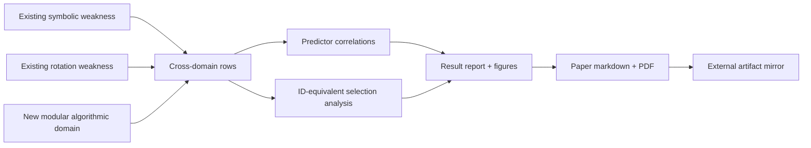

# feat: Structure-Compatible Generalization L4 Suite

## Goal Capsule

Build the next phase of the weakness/OOD program as a concrete experiment suite: a reusable "structure-compatible generalization" benchmark that measures whether compatibility with deployment-generating transformations predicts OOD behavior among models with similar train/ID performance.

The first landing target is a publishable controlled slice, not full OOD certification. It should run cheaply on Modal L4 workers, reuse the existing symbolic and rotation weakness infrastructure, add a modular algorithmic domain, produce a result report and paper draft/PDF, and mirror final paper artifacts into the requested external Metaphysics of Intelligence archive folder.

---

## Problem Frame

The existing portfolio already has a strong Paper 3 result: weakness separates shortcut-compatible symbolic completions and predicts OOD in cyclic MLP and rotated-stroke tasks. The next research move is to make that result feel like a protocol rather than a one-off metric.

The implementation should answer a narrower question:

> Among train/ID-tied or near-tied finite models, is transformation compatibility the best predictor of OOD behavior across symbolic, vision, and algorithmic domains, and can compatibility-based selection improve OOD without OOD labels?

This plan intentionally does not jump to messy LLM deployment or open-world semantic shifts. It keeps transformation structure controlled so failure modes remain interpretable.

---

## Scope Boundaries

### In Scope

- A new experiment package for structure-compatible generalization diagnostics.
- A modular arithmetic/algorithmic controlled domain to complement existing cyclic symbolic and rotation vision domains.
- A cross-domain summary that ranks OOD predictors: compatibility, wrong-group compatibility, train loss, ID validation, parameter norm, sharpness, and train accuracy where available.
- A compatibility-based model-selection analysis without OOD labels.
- A Modal runner using L4 workers, budget guards, shard/cell metadata, and deterministic seeds.
- A markdown result report, paper draft, generated figures, PDF artifact, provenance, and external artifact mirror.
- Local smoke tests and targeted regression tests for the new experiment logic.

### Out of Scope

- Full formal verification or guaranteed deployment behavior.
- Large language model behavioral OOD claims.
- Learned transformation generators as a confirmed result. The first suite may define the extension point and one weak inferred-group selector, but learned generators are follow-up unless implementation discovers it is cheap.
- New topology claims. Paper 4 remains a boundary result and should be referenced as such, not folded into the main mechanism.

### Deferred to Follow-Up Work

- Natural-language paraphrase/entity-substitution behavior with real generation metrics.
- PAC-Bayes-grade baselines if they require a separate perturbation training study.
- Training-time compatibility regularization beyond a small model-selection or ablation hook.

---

## Key Technical Decisions

1. **Create a new package instead of overloading Paper 3 files.**  
   `experiments/symbolic_weakness` and `experiments/rotation_weakness` are established reproducibility artifacts. The new package should orchestrate and extend them without rewriting their core evidence.

2. **Use L4 as the default GPU target, but keep CPU smoke paths.**  
   L4 is cheaper than H100 and already has local repo precedent in `experiments/long_horizon_bottleneck`. The new Modal entrypoint should declare `GPU = "L4"` and include a budget guard before dispatch.

3. **Make the headline analysis cross-domain, not a single-domain rerun.**  
   The result report should normalize metrics into a common predictor table per domain and a pooled "rank of compatibility" figure. The strongest claim is model-selection under underspecification, so the selection analysis is as important as raw correlations.

4. **Keep oracle and wrong-group controls explicit.**  
   Compatibility is load-bearing only when the transformation family matches deployment. Every domain should include a wrong-group or uninformative-group control so the suite cannot quietly reward generic invariance.

5. **Write paper artifacts into the repo, then mirror externally.**  
   Canonical source artifacts belong under `papers/structure_compatible_generalization` and `experiments/structure_compatible_generalization`. The external Metaphysics of Intelligence folder is an archive/export target, not the only source of truth.

---

## High-Level Technical Design

The design keeps task-specific training code local to each domain while forcing all outputs into one common schema:

- `domain`
- `model_id`
- train/ID metrics
- OOD metric
- true compatibility metric
- wrong/noisy compatibility controls
- model/hyperparameter metadata
- selection-eligible flag

That schema is the bridge between experiments and the paper.

---

## Implementation Units

### U1. Package Scaffold and Common Analysis Schema

**Goal:** Add the new experiment package, common dataclasses/helpers, correlation ranking, ID-equivalent filtering, and compatibility-based selection analysis.

**Requirements:** Supports the cross-domain diagnostic protocol and keeps future domains pluggable.

**Dependencies:** None.

**Files:**

- `experiments/structure_compatible_generalization/__init__.py`
- `experiments/structure_compatible_generalization/core.py`
- `experiments/structure_compatible_generalization/PROVENANCE.md`
- `tests/test_structure_compatible_generalization.py`

**Approach:** Define a lightweight row schema and pure functions for Pearson/Spearman, predictor ranking, ID-band filtering, group means, and "select best model by predictor without OOD labels" analysis. Keep this dependency-light so reports and tests can run without Modal.

**Patterns to follow:** `experiments/symbolic_weakness/summarize_neural_sweep.py`, `experiments/rotation_weakness/neural.py`, and the cost guard style in `experiments/long_horizon_bottleneck/core.py`.

**Test scenarios:**

- Given synthetic rows where compatibility is monotone with OOD, predictor ranking puts true compatibility first.
- Given equal train/ID rows, model selection by compatibility yields higher OOD than selection by wrong-group compatibility.
- Ties and constant predictors do not crash and return zero correlations.
- The common schema round-trips through JSON-compatible dictionaries.

**Verification:** Targeted tests pass locally and the functions can summarize a tiny synthetic domain without torch.

### U2. Modular Algorithmic Domain

**Goal:** Add a controlled algorithmic task where a model can fit ID examples by a local shortcut or learn a modular transportable rule.

**Requirements:** Adds the sequence/algorithmic pillar requested by the research direction while preserving known transformation structure.

**Dependencies:** U1.

**Files:**

- `experiments/structure_compatible_generalization/modular_domain.py`
- `tests/test_structure_compatible_generalization.py`

**Approach:** Use a finite modular table task such as `f(a, b) = a + b mod n` with biased train support. Train small MLPs on one-hot pairs. OOD holds out parts of the transformation orbit. Compute compatibility under the true translation family and a wrong random-permutation family from the learned full table.

**Execution note:** Start with small CPU smoke settings before L4 dispatch; the domain should finish in seconds for tests and minutes for the full sweep.

**Test scenarios:**

- The true modular rule has maximal true compatibility and high OOD accuracy.
- A local shortcut can be train-perfect but low OOD and low true compatibility.
- Wrong-group compatibility does not rank the true rule above chance in the controlled fixtures.
- A tiny neural sweep emits rows matching the common schema.

**Verification:** Unit tests cover exact rule/shortcut fixtures and a low-epoch neural smoke run produces finite metrics.

### U3. Cross-Domain Orchestrator and L4 Modal Runner

**Goal:** Add a single entrypoint that runs symbolic, vision, and modular domains locally or on Modal L4 workers and writes one JSON payload.

**Requirements:** Uses L4s instead of H100s, preserves reproducibility metadata, and supports budget-limited dispatch.

**Dependencies:** U1, U2.

**Files:**

- `experiments/structure_compatible_generalization/run_suite.py`
- `experiments/structure_compatible_generalization/modal_l4_suite.py`
- `experiments/structure_compatible_generalization/README.md`
- `tests/test_structure_compatible_generalization.py`

**Approach:** The local runner should call existing Python APIs where safe and use small defaults. The Modal runner should map domain cells/shards over L4 workers, cap containers, estimate worst-case GPU spend, and write a payload with manifest, rows, summaries, and selection analysis.

**Patterns to follow:** `experiments/long_horizon_bottleneck/modal_moved_bottleneck_sweep.py` for L4/cost guard and `experiments/symbolic_weakness/modal_neural_sweep.py` for shard maps.

**Test scenarios:**

- Dry-run/budget mode emits manifest without launching cells.
- Local smoke mode runs all enabled domains at tiny scale and writes JSON.
- Unknown domain names fail with a clear error.
- Payload summary contains per-domain and pooled sections.

**Verification:** Local smoke command completes and test coverage exercises budget/dry-run behavior without Modal credentials.

### U4. Report, Figures, and Paper Draft

**Goal:** Produce the first paper artifacts for the new program: result report, figures, markdown paper, and PDF.

**Requirements:** Paper artifacts should make the underspecification/compatibility claim concrete and bounded.

**Dependencies:** U1-U3.

**Files:**

- `experiments/structure_compatible_generalization/summarize_suite.py`
- `experiments/structure_compatible_generalization/results/structure_compatible_l4_2026_07_06.md`
- `papers/structure_compatible_generalization/structure_compatible_generalization.md`
- `papers/structure_compatible_generalization/structure_compatible_generalization.pdf`
- `papers/structure_compatible_generalization/figures/`
- `scripts/build_structure_compatible_pdf.py`
- `tests/test_structure_compatible_generalization.py`

**Approach:** Generate a concise report from the JSON payload, then build a paper draft that explicitly states what passed, what remains preliminary, and what boundaries survive from Paper 4. Use `scripts/paperkit.py` for the PDF to match existing paper generation.

**Test scenarios:**

- Summarizer writes markdown from a tiny synthetic payload.
- Figure generation tolerates missing optional domains by marking them absent rather than inventing results.
- PDF builder creates a non-empty PDF from committed report numbers.

**Verification:** Report and PDF generation run locally; PDF exists and has non-zero size.

### U5. Artifact Mirroring to Metaphysics Archive

**Goal:** Copy final paper artifacts into the requested external Metaphysics of Intelligence folder after the repo artifacts are generated.

**Requirements:** User explicitly requested paper artifacts in the Jawaun/Metaphysics of Intelligence folder.

**Dependencies:** U4.

**Files:**

- `scripts/export_structure_compatible_artifacts.py`
- `papers/structure_compatible_generalization/README.md`

**Approach:** Add an export script that copies the paper PDF, markdown, result report, and key figures into a timestamped external archive directory. The script should print the target path and not delete or mutate existing archive files.

**Execution note:** The actual external write requires filesystem approval because the sandbox only permits repo/temp writes by default.

**Test scenarios:**

- Dry-run mode lists intended files without copying.
- Export fails clearly when source artifacts are missing.
- Export preserves filenames and creates the destination directory when permitted.

**Verification:** Dry-run passes locally; approved export writes the expected archive files.

### U6. Verification, PR, and Merge

**Goal:** Land the work according to repo instructions.

**Requirements:** Run lints, type checks, targeted tests, commit, push, open a PR, and merge when checks are green.

**Dependencies:** U1-U5.

**Files:**

- New and modified files from U1-U5.

**Approach:** Run repository lint/type gates plus targeted tests for the new package. Commit generated source artifacts and confirmed result artifacts. Push the branch, open a PR, monitor checks, and merge once green.

**Test scenarios:** No new code scenarios; this unit is process verification.

**Verification:** Lints, type checks, targeted tests, PR checks, and merge state are all clean.

---

## Verification Contract

Before committing:

- Ruff lint passes for new/changed Python files or the repo-configured lint gate passes.
- Type checking gate runs according to repo conventions.
- Targeted tests for `tests/test_structure_compatible_generalization.py` pass.
- Local smoke run writes a JSON payload and markdown report.
- PDF builder creates a non-empty paper PDF.
- External artifact export is dry-run verified and then executed with approved filesystem access.

Before merging:

- Branch is pushed.
- PR is opened.
- Required checks are green or explicitly non-applicable.
- PR is merged only after the finished artifacts are committed.

---

## Risks and Mitigations

- **Modal run takes too long or credentials are unavailable.**  
  Keep local smoke and dry-run reports as committed proof, then document the blocked L4 dispatch if external credentials fail. The L4 runner itself must still be ready.

- **Cross-domain pooled metric overclaims.**  
  Report per-domain results first and only pool ranks, not raw incompatible scales, unless normalization is explicit.

- **New modular task is too easy.**  
  Include shortcut fixtures and ID-equivalent filtering; if neural models all solve OOD, lower data coverage or use selection analysis on mixed augmentation conditions.

- **External archive write blocked by sandbox.**  
  Request explicit approval for the export script rather than silently omitting the requested artifact mirror.

---

## Definition of Done

- New structure-compatible generalization suite is implemented and tested.
- L4 Modal runner exists with budget guard and documented command.
- At least a local smoke payload/report is generated; L4 payload is generated if credentials and runtime allow.
- Paper markdown, figures, and PDF exist under `papers/structure_compatible_generalization`.
- Paper artifacts are mirrored into the requested external Metaphysics of Intelligence archive folder.
- Lint, type check, and targeted tests run before commit.
- Branch is committed, pushed, PR opened, and merged when green.
