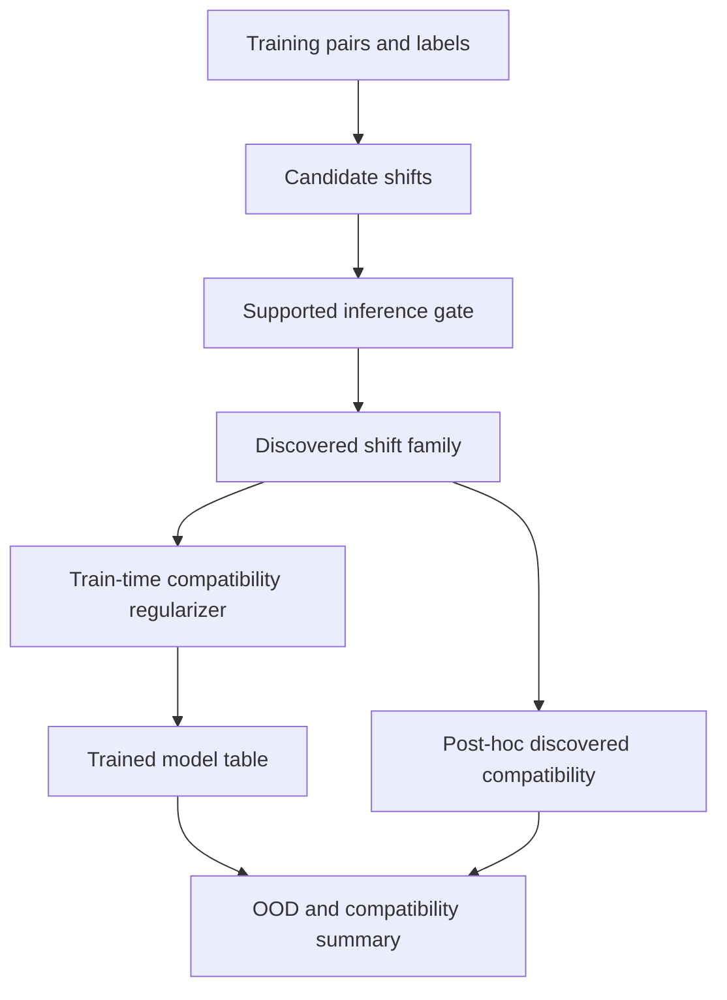

# feat: Add inferred transformations and compatibility intervention

## Goal Capsule

Extend the structure-compatible generalization suite from an oracle-compatibility diagnostic into a first intervention protocol: infer candidate deployment transformations from observed data, score learned functions under that inferred family, and train/select models with compatibility pressure without using OOD labels.

---

## Problem Frame

Phase one showed that compatibility with the true deployment transformation predicts OOD behavior across controlled symbolic, vision, and modular domains. The remaining bottleneck is that the strongest diagnostic is still partly oracle-shaped: the true transformation family is supplied by the experimenter.

This phase attacks the next regime transition:

- **Old regime:** known deployment group, post-hoc compatibility score, OOD-free model selection.
- **Transition:** supported transformation discovery from training evidence plus a train-time compatibility regularizer.
- **Allowed claim:** diagnostic plus first neural intervention result in a finite structured domain, not full OOD certification.

---

## Requirements

- **R1. Supported inference:** The inferred transformation score must avoid vacuous compatibility claims when the training set gives no evidence for a non-identity transformation.
- **R2. Oracle comparison:** The phase-two report must compare inferred/discovered compatibility against true compatibility, wrong compatibility, train loss, train accuracy, and ID validation.
- **R3. Intervention:** Add a compatibility-guided training intervention that uses inferred transformations and unlabeled domain points, not OOD labels.
- **R4. Modal-first execution:** Confirmatory sweeps and quality gates run through Modal L4 workers.
- **R5. Artifact handoff:** Write repo paper/report artifacts and export the paper artifacts to the Metaphysics archive.
- **R6. Regime audit:** The report must state what changed structurally, what failed or remained limited, and the bounded claim now justified.

---

## Key Technical Decisions

- **KTD1. Start with modular addition.** The modular domain has finite tables, known candidate transformations, wrong controls, and cheap neural sweeps. It is the right first place to test discovery and intervention without making the suite depend on heavier language or vision inference.
- **KTD2. Require support for inferred transformations.** A shift is admitted only if enough observed pairs overlap with its transformed counterpart and all overlapping labels satisfy the induced label action. This avoids treating unobserved shifts as learned structure.
- **KTD3. Use compatibility regularization on unlabeled domain points.** For admitted shifts, train the model so predictions on shifted inputs match shifted predictions on original inputs. This uses the input domain and inferred action, not OOD labels.
- **KTD4. Keep oracle compatibility as a comparator, not a dependency.** True compatibility remains in the rows so the report can measure whether inferred compatibility tracks oracle compatibility and OOD.
- **KTD5. Preserve phase-one schema compatibility.** Add optional fields to the common row schema rather than breaking existing phase-one artifacts.

---

## High-Level Technical Design



The discovery gate separates evidence for transformations from the oracle group. The regularizer consumes only the discovered shifts and unlabeled finite-domain inputs. OOD labels are used only at evaluation time.

---

## Output Structure

```text
experiments/structure_compatible_generalization/
  transformation_discovery.py
  modal_phase2_transformations.py
  summarize_phase2.py
  results/phase2_transformations_2026_07_06.md
papers/structure_compatible_generalization/
  inferred_transformations_intervention.md
  inferred_transformations_intervention.pdf
  figures/fig3_discovered_vs_oracle.png
  figures/fig4_regularization_intervention.png
scripts/
  build_structure_compatible_phase2_pdf.py
  export_structure_compatible_artifacts.py
tests/
  test_structure_compatible_generalization.py
```

---

## Implementation Units

### U1. Add supported transformation discovery

**Goal:** Introduce reusable finite-domain discovery helpers and wire the modular domain to use them.

**Requirements:** R1, R2, R6

**Dependencies:** none

**Files:**

- `experiments/structure_compatible_generalization/transformation_discovery.py`
- `experiments/structure_compatible_generalization/modular_domain.py`
- `experiments/structure_compatible_generalization/core.py`
- `tests/test_structure_compatible_generalization.py`

**Approach:** Add a supported-shift inference function that counts observed overlaps under each candidate shift and admits only shifts meeting a configurable support floor with zero label-action violations. Add optional `compatibility_discovered` and support metadata to `DiagnosticRow`.

**Patterns to follow:** Existing modular exact compatibility functions and row serialization in `core.py`.

**Test scenarios:**

- Supported inference admits identity and observed consistent shifts on augmented modular data.
- Supported inference rejects non-identity shifts when no observed overlap exists.
- A shortcut table has lower discovered/true compatibility than the true modular table when the observed shifts support the translation action.
- Row serialization preserves optional discovered-compatibility fields.

**Verification:** Modal quality gate passes targeted tests, compileall, publication guard, ruff, and ty.

### U2. Add compatibility-guided intervention training

**Goal:** Add a train-time regularization arm that uses discovered transformations and unlabeled domain points to improve OOD behavior without OOD labels.

**Requirements:** R2, R3, R4

**Dependencies:** U1

**Files:**

- `experiments/structure_compatible_generalization/modular_domain.py`
- `tests/test_structure_compatible_generalization.py`

**Approach:** Extend `ModularConfig` with a compatibility regularization strength and support floor. During training, infer shifts from training data, compute consistency loss over all finite-domain pairs, and add it to the supervised training loss. Preserve supervised train loss separately for proxy comparison.

**Execution note:** The regularizer is small-domain and GPU-safe; confirmatory training still runs in Modal L4, not locally.

**Test scenarios:**

- Zero regularization preserves the existing training path.
- Nonzero regularization records discovered shifts and regularizer metadata in row metadata.
- The regularizer can run for a tiny two-epoch smoke configuration inside the Modal quality gate.

**Verification:** Modal quality gate passes and the phase-two Modal sweep returns both regularized and unregularized rows.

### U3. Add phase-two Modal runner

**Goal:** Run phase-two modular discovery/intervention sweeps independently of the phase-one suite.

**Requirements:** R3, R4

**Dependencies:** U1, U2

**Files:**

- `experiments/structure_compatible_generalization/modal_phase2_transformations.py`
- `experiments/structure_compatible_generalization/README.md`

**Approach:** Add an L4 runner with sharded modular intervention cells, conservative budget checks, and a Modal quality cell. Keep raw JSON output under `artifacts/structure_compatible_generalization/phase2_transformations.json`.

**Test scenarios:**

- Dry-run budget refuses over-budget dispatch.
- Quality-only path runs the targeted Modal quality gate.
- Sweep output includes manifest, cells, rows, and summary.

**Verification:** Modal L4 phase-two sweep completes under the configured budget.

### U4. Add phase-two summaries, figures, and PDF

**Goal:** Produce the second paper artifact set from the phase-two Modal payload.

**Requirements:** R2, R5, R6

**Dependencies:** U3

**Files:**

- `experiments/structure_compatible_generalization/summarize_phase2.py`
- `experiments/structure_compatible_generalization/results/phase2_transformations_2026_07_06.md`
- `papers/structure_compatible_generalization/inferred_transformations_intervention.md`
- `papers/structure_compatible_generalization/inferred_transformations_intervention.pdf`
- `papers/structure_compatible_generalization/figures/fig3_discovered_vs_oracle.png`
- `papers/structure_compatible_generalization/figures/fig4_regularization_intervention.png`
- `scripts/build_structure_compatible_phase2_pdf.py`
- `scripts/export_structure_compatible_artifacts.py`

**Approach:** Summarize discovered-vs-oracle predictor correlations, OOD-free selection, and intervention deltas by regularization strength. Add a short phase-two paper/PDF that reports the regime transition and bounded claim. Render the phase-two artifacts through Modal and only write returned artifact bytes locally.

**Test scenarios:**

- Summary generation handles rows with and without optional discovered compatibility.
- Intervention aggregation separates regularized and unregularized rows.
- Export helper copies both phase-one and phase-two paper artifacts.

**Verification:** Generated Markdown/PDF/figures exist and are exported to the Metaphysics archive.

### U5. Run, review, commit, PR, merge

**Goal:** Finish the branch with Modal verification and PR landing.

**Requirements:** R4, R5, R6

**Dependencies:** U1, U2, U3, U4

**Files:**

- All changed files

**Approach:** Run the phase-two L4 sweep, generate artifacts, export them, run Modal quality, review the diff, commit, push, open PR, watch checks, and merge when green.

**Test scenarios:** The PR body records Modal suite URL, Modal quality URL, result summary, and exported artifact path.

**Verification:** PR merged to `main`; remote feature branch deleted.

---

## Verification Contract

- Modal phase-two L4 sweep completes and writes `artifacts/structure_compatible_generalization/phase2_transformations.json`.
- Modal quality passes targeted pytest, compileall, publication guard, ruff, and ty.
- Paper/report artifacts are regenerated from the Modal payload.
- Phase-two artifacts are exported to `/Users/jawaun/Metaphysics of Intelligence/Structure_Compatible_Generalization_2026_07_06`.
- PR is opened and merged after checks are green or absent.

---

## Risk Analysis

- **Vacuous inference risk:** If support is too low, discovered compatibility can overstate generalization. Mitigation: require support and report admitted shift counts.
- **Regularizer collapse risk:** Equivariance pressure can reward constant predictions. Mitigation: keep supervised CE primary, compare train/ID accuracy, and report ID-equivalent selection.
- **Overclaiming risk:** Modular intervention does not prove discovery works for language or vision. Mitigation: report this as a finite-domain intervention result and name learned transformation generators as the next bottleneck.
- **Budget risk:** L4 cells can multiply quickly. Mitigation: keep phase two modular-first with budget checks.

---

## Definition of Done

- Supported transformation discovery is implemented and tested.
- Compatibility regularization is implemented and tested.
- Modal L4 phase-two sweep has completed.
- Report, figures, Markdown paper, and PDF are generated through Modal artifact rendering.
- Artifacts are exported to the Metaphysics archive.
- Branch is committed, pushed, PR opened, and PR merged.
