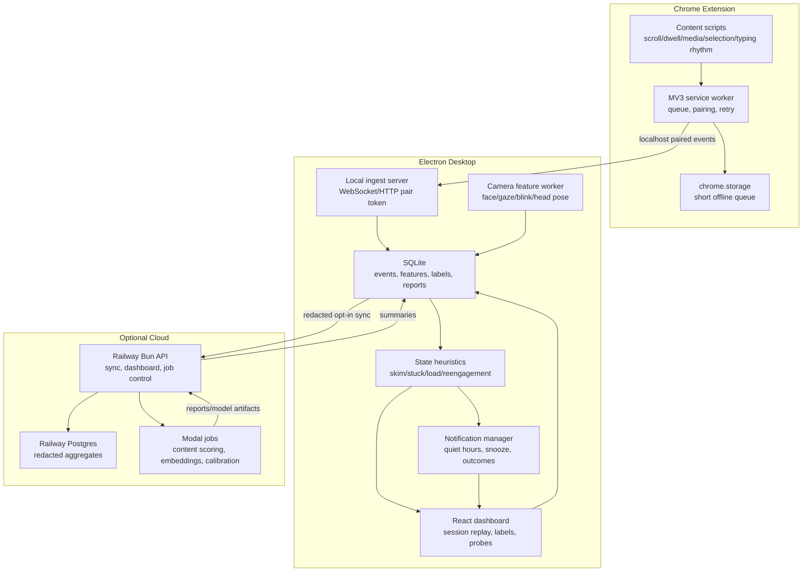

# feat: Inquiry Black Box

## Goal Capsule

Build a local-first personal Neurophenom cockpit that captures browser interaction traces, desktop camera-derived features, typing rhythm, self-labels, and recall checks, then turns them into research-session replay, comprehension GPS, and a private longitudinal dataset.

Authority hierarchy: protect raw camera frames, raw key content, and page content by default; prefer local feature extraction over cloud upload; use cloud services only for optional sync, batch analysis, and model jobs; keep EEG and clinical claims out of the MVP.

Stop conditions: do not ship global key capture without explicit OS permission, aggregate-only storage, and a visible recording state; do not upload raw video or raw keystrokes; do not present state estimates as medical, diagnostic, or workplace-surveillance outputs.

Execution profile: new greenfield app under this repo, using Bun workspaces, Electron, a Chrome MV3 extension, Railway, Modal, and Doppler.

## Product Contract

### Summary

Inquiry Black Box records enough private behavioral signal to help the user understand how research sessions unfold: where they skimmed, stalled, overloaded, entered productive confusion, or generated a reusable idea.
The first useful product is session replay plus active labels, not a live mind-reading score.
The product earns stronger state prediction only after it has collected user-specific outcomes such as self-labels, recall checks, accepted repairs, and next-day usefulness.

### Problem Frame

The user wants a desktop or Chrome tool that uses camera and typing signals to support research, comprehension, and dataset-building.
The Neurophenom evidence suggests cheap traces such as gaze, pupil, interaction, and typing should be treated as weak but useful state evidence, while the concern-geometry work says a signal only matters if it changes action, memory, repair, or future inquiry.
The app therefore needs an architecture that captures multimodal traces safely, stores them locally, and verifies whether interventions actually help.

### Requirements

- R1. The system captures browser traces from Chrome pages, including scroll, dwell, visibility, selection, copy, highlight, form typing rhythm, and media play/pause/seek events.
- R2. The desktop app captures camera-derived features such as face present, gaze-away estimate, blink proxy, head pose, and stillness without storing raw video frames by default.
- R3. The system captures typing dynamics as timing and editing features, not raw key content, with browser typing first and global desktop typing deferred behind explicit OS permissions.
- R4. The system groups events into research sessions with start/stop controls, visible recording state, source attribution, and local pause/resume.
- R5. The user can add active self-labels such as flow, overloaded, confused-good, confused-bad, avoiding, near-breakthrough, and tired.
- R6. The system creates end-of-session replays that identify likely skimmed sections, stuck loops, high-load moments, copied passages, abandoned branches, and recommended return points.
- R7. The system supports micro-probes, recall checks, and opt-in desktop notifications that verify whether a suggested repair improved understanding.
- R8. The system keeps a local-first data store with export, deletion, retention controls, and per-signal toggles.
- R9. Optional cloud sync stores redacted aggregates and generated reports, not raw video, raw keystrokes, or full page text unless the user opts in per document.
- R10. Modal jobs support heavier analysis such as content difficulty scoring, embedding, session summarization, model calibration, and offline report generation.
- R11. Railway hosts the optional sync/control-plane API and web dashboard, with Doppler-managed secrets across local, Railway, and Modal environments.
- R12. The architecture exposes a reusable event schema so future EEG, eye-tracker, PPG, or OpenNeuro/BBBD-style datasets can be imported into the same timeline model.

### Acceptance Examples

- AE1. Given the user watches a lecture in Chrome, when they pause, rewind, switch tabs, and later label a section as confused-bad, then the replay links the label to the timestamped page/media context and camera/typing features around it.
- AE2. Given camera capture is enabled, when the session ends, then the local database contains feature vectors and quality flags but no saved frame images unless the user has enabled a debug capture mode.
- AE3. Given the extension is installed and paired, when the desktop app is offline, then browser events queue locally and retry without sending data to Railway.
- AE4. Given the user requests a recall check, when they answer, then the result becomes a verifier attached to the earlier page segment and any suggested repair.
- AE5. Given cloud sync is disabled, when a Modal analysis action is attempted, then the app explains that batch analysis requires explicit opt-in and leaves local data untouched.
- AE6. Given notification nudges are enabled, when a local heuristic detects a sustained stuck loop or likely abandon point outside quiet hours, then the desktop app sends one actionable notification and records whether the user accepted, snoozed, dismissed, or ignored it.

### Scope Boundaries

In scope:
- Personal desktop and Chrome capture for one user.
- Local session replay, labels, simple heuristics, and privacy controls.
- Optional cloud analysis using redacted or explicitly selected payloads.
- Architecture that can later absorb EEG, eye-tracker, PPG, and public research datasets.

Deferred to follow-up work:
- Global desktop typing metrics beyond hotkeys and active-app metadata.
- Native app packaging, signing, auto-update, and Chrome Web Store publication.
- Paid multi-user accounts, teams, and shared dashboards.
- EEG ingestion and clinical biomarker claims.
- Real-time intervention selection beyond conservative prompts and opt-in local notifications.

Outside this product's identity:
- Workplace surveillance.
- Medical diagnosis.
- Lie detection or emotion certainty.
- Raw keystroke logging.
- Hidden recording.

## Planning Contract

### Key Technical Decisions

- KTD1. Use Electron for the desktop app. Electron gives fast TypeScript delivery, Chromium camera APIs, a mature global-shortcut surface, and easy sharing with the Chrome-extension code. Tauri is a good later packaging option, but Electron has lower integration risk for the first local camera and extension companion.
- KTD2. Use a Chrome MV3 extension for browser telemetry. Content scripts can observe page DOM and interaction events, while the service worker handles extension lifecycle and pairing. The extension sends events to the desktop app through a localhost WebSocket/HTTP bridge for the MVP; native messaging is deferred until packaged distribution.
- KTD3. Use Bun workspaces for the app monorepo. Bun supports npm-style workspaces, gives one fast TypeScript toolchain for desktop, extension, cloud API, and shared packages, and matches the user's requested runtime.
- KTD4. Keep raw capture local. Store derived feature events in SQLite by default. Raw video frames, raw key content, and full page text require explicit debug or document-level opt-in.
- KTD5. Split local and cloud responsibilities. Electron owns live capture, local ingestion, SQLite, and replay. Railway owns optional sync, account/device metadata, web dashboard, and Modal job orchestration. Modal owns heavy Python analysis and model calibration jobs.
- KTD6. Prefer feature baselines before learned state models. The MVP should use interpretable heuristics for skim, stuckness, overload risk, and session segmentation, then train personalized models only after enough labels and outcomes exist.
- KTD7. Treat models as providers behind interfaces. Camera feature extraction uses browser-side MediaPipe/WebGazer-style modules where possible. LLM or embedding calls use provider adapters and environment variables, so OpenAI, Anthropic, local models, or Modal-hosted models can be swapped without changing capture.
- KTD8. Use Doppler for secrets. Local dev commands run under Doppler when secrets are needed. Railway and Modal receive service credentials through their deployment environments, with no committed `.env` secrets.
- KTD9. Use desktop notifications only as local, rate-limited interventions. Notifications should be opt-in, tied to inspectable evidence, respect quiet hours and snooze state, and record outcomes for later learning.

### High-Level Technical Design

### Event And Data Model

All signals use a shared envelope:
- `event_id`, `session_id`, `source`, `source_version`
- `captured_at`, `monotonic_ms`, `timezone`
- `event_type`, `confidence`, `quality_flags`
- `payload`, `privacy_class`, `retention_policy`

Core local tables:
- `sessions`: start/end, active task, notes, recording state.
- `events`: normalized envelope for browser, camera, typing, label, probe, and system events.
- `features`: windowed aggregates keyed by session, source, and time range.
- `labels`: user state labels and confidence.
- `content_refs`: URL/domain/title hashes, optional selected text snapshots, media timestamps.
- `probes`: micro-questions, recall checks, answer scores, repair links.
- `reports`: generated replay summaries and next-action memos.
- `notifications`: local notification candidates, delivery state, user response, and suppression reason.
- `sync_queue`: redacted payloads waiting for Railway.
- `model_runs`: Modal/local model version, inputs, outputs, and provenance.

### Model Strategy

MVP models:
- Camera features: face-present ratio, gaze-away proxy, blink proxy, head pose variance, motion/stillness, camera-quality flags.
- Typing features: inter-key interval distribution, burst length, pause length, backspace ratio, edit churn, text-entry context without raw content.
- Browser features: scroll velocity, dwell, revisit loops, media seekback, tab churn, copy/highlight events.
- Content features: document/video difficulty, novelty, prerequisite density, transition density, and likely quiz points via optional provider calls.
- State heuristics: skim risk, stuck-loop risk, overload risk, productive-confusion candidate, reengagement cue.

Personalization models:
- Start with logistic regression or gradient-boosted trees trained from user labels and probes in Modal.
- Keep model cards with feature importances, calibration curves, and minimum-data thresholds.
- Do not show personalized predictions until calibration beats heuristic baselines on held-out user sessions.

### Sources And Research

- Chrome content scripts run in web pages, read DOM details, and message extension contexts; this justifies putting page telemetry in the extension rather than the desktop shell: https://developer.chrome.com/docs/extensions/develop/concepts/content-scripts.
- Chrome storage is extension-specific, asynchronous, and has local/session areas; this supports short offline queues but not the primary data store: https://developer.chrome.com/docs/extensions/reference/api/storage.
- Electron global shortcuts work outside app focus, but arbitrary global typing is not the same capability; the plan defers global typing metrics behind OS permission and a native helper: https://www.electronjs.org/docs/latest/api/global-shortcut.
- Modal's primary programming model is Python functions, with web endpoints and external invocation, making it a good fit for heavier analysis jobs rather than live local capture: https://modal.com/docs/guide and https://modal.com/docs/guide/webhooks.
- Bun supports npm-style workspaces; Railway has Bun deployment guidance with optional Postgres; Doppler supports `doppler run --` secret injection for local dev.
- Webcam eye tracking has been used to predict task-unrelated thought and reading comprehension in online reading tasks, but lighting, glasses, and calibration matter; the app should store quality flags and avoid certainty claims.
- Pupillometry is a known cognitive-load measure in learning contexts, but webcam pupil quality is not guaranteed; pupil-derived claims stay behind camera-quality gates.
- Keystroke dynamics have evidence as mental-fatigue biomarkers, but privacy and generalization risks require aggregate features and explicit consent.

## Implementation Units

### U1. Bun workspace and app scaffold

- **Goal:** Create the greenfield workspace for desktop, extension, cloud, Modal jobs, shared schema, and shared UI without changing existing research code.
- **Requirements:** R1, R2, R8, R11, R12
- **Dependencies:** None
- **Files:** `apps/inquiry-black-box/package.json`, `apps/inquiry-black-box/bunfig.toml`, `apps/inquiry-black-box/tsconfig.base.json`, `apps/inquiry-black-box/apps/desktop/package.json`, `apps/inquiry-black-box/apps/extension/package.json`, `apps/inquiry-black-box/apps/cloud/package.json`, `apps/inquiry-black-box/packages/schema/package.json`, `apps/inquiry-black-box/packages/signals/package.json`, `apps/inquiry-black-box/packages/ui/package.json`, `apps/inquiry-black-box/modal/pyproject.toml`, `apps/inquiry-black-box/README.md`
- **Approach:** Use Bun workspaces rooted at `apps/inquiry-black-box` so the new app remains isolated from the Python research repo. Add shared TypeScript project references for schema and signal packages. Add a Python Modal subproject for batch jobs.
- **Patterns to follow:** Keep app-local commands in the app root, mirroring `sites/reafference_attribution/package.json` isolation rather than turning the repository root into a JavaScript monorepo.
- **Test scenarios:** Verify workspace install resolves shared packages; verify `schema` can be imported by desktop, extension, and cloud; verify `bun run typecheck` catches a deliberate schema mismatch.
- **Verification:** The app workspace has install, lint, typecheck, test, dev desktop, dev extension, dev cloud, and modal-check scripts.

### U2. Shared event schema, privacy classes, and local database

- **Goal:** Define the canonical event envelope, privacy classes, retention policies, and SQLite schema.
- **Requirements:** R4, R8, R9, R12
- **Dependencies:** U1
- **Files:** `apps/inquiry-black-box/packages/schema/src/events.ts`, `apps/inquiry-black-box/packages/schema/src/privacy.ts`, `apps/inquiry-black-box/packages/schema/src/sessions.ts`, `apps/inquiry-black-box/apps/desktop/src/main/db/migrations/*.sql`, `apps/inquiry-black-box/apps/desktop/src/main/db/index.ts`, `apps/inquiry-black-box/apps/desktop/tests/db.test.ts`
- **Approach:** Use Zod or Valibot for runtime validation and TypeScript inference. Store all local events in SQLite with an append-only `events` table plus typed projection tables for reports and sync queue. Encode privacy class at event creation time so sync and export cannot accidentally widen payloads.
- **Patterns to follow:** Match the repo's provenance discipline: every derived report points back to source events and model runs.
- **Test scenarios:** Insert each event type and verify round-trip validation; reject payloads missing privacy class; delete a session and verify all dependent rows are removed; export a session and verify raw-video/raw-key fields are absent by default.
- **Verification:** DB migrations are deterministic, schema tests pass, and the local export is readable JSONL.

### U3. Chrome MV3 extension telemetry and pairing

- **Goal:** Capture browser-level research traces and send them to the desktop app through a paired local bridge.
- **Requirements:** R1, R3, R4, R8
- **Dependencies:** U1, U2
- **Files:** `apps/inquiry-black-box/apps/extension/manifest.json`, `apps/inquiry-black-box/apps/extension/src/content/index.ts`, `apps/inquiry-black-box/apps/extension/src/background/service-worker.ts`, `apps/inquiry-black-box/apps/extension/src/popup/App.tsx`, `apps/inquiry-black-box/apps/extension/src/lib/localBridge.ts`, `apps/inquiry-black-box/apps/extension/tests/content-events.test.ts`, `apps/inquiry-black-box/apps/extension/tests/pairing.test.ts`
- **Approach:** Content scripts capture scroll/dwell/media/selection/copy/highlight and typing rhythm on allowed pages. The service worker batches events, stores a short offline queue in extension storage, and posts to the Electron localhost ingest endpoint using a pairing token. The popup exposes recording state and per-site toggles.
- **Patterns to follow:** Use dynamic host permissions or allowlist-first defaults to reduce Chrome Web Store review and privacy burden.
- **Test scenarios:** Capture scroll and media events on a fixture page; ensure typing payloads contain timing/edit metrics but no raw typed text; simulate desktop offline and verify queue/retry; reject posts without the current pairing token.
- **Verification:** Extension builds as MV3, loads unpacked in Chrome, captures fixture events, and respects pause/site-disable toggles.

### U4. Electron desktop ingest, camera features, and visible controls

- **Goal:** Provide the desktop shell, local ingest server, camera feature worker, recording controls, and session lifecycle.
- **Requirements:** R2, R3, R4, R5, R8
- **Dependencies:** U1, U2
- **Files:** `apps/inquiry-black-box/apps/desktop/src/main/main.ts`, `apps/inquiry-black-box/apps/desktop/src/main/ingest/server.ts`, `apps/inquiry-black-box/apps/desktop/src/main/security/pairing.ts`, `apps/inquiry-black-box/apps/desktop/src/renderer/App.tsx`, `apps/inquiry-black-box/apps/desktop/src/renderer/camera/CameraPanel.tsx`, `apps/inquiry-black-box/apps/desktop/src/renderer/camera/featureWorker.ts`, `apps/inquiry-black-box/apps/desktop/src/renderer/session/SessionControls.tsx`, `apps/inquiry-black-box/apps/desktop/tests/ingest.test.ts`, `apps/inquiry-black-box/apps/desktop/tests/camera-features.test.ts`
- **Approach:** Electron main process owns the localhost bridge and SQLite access. Renderer owns camera permission and feature extraction using browser-compatible models. The UI makes recording state obvious and allows pause/resume, session start/stop, and labels. Global keyboard shortcuts are limited to marking states and pausing capture.
- **Execution note:** Do not implement arbitrary global key capture in the MVP. Add only aggregate browser typing metrics and explicit global hotkeys.
- **Patterns to follow:** Keep privileged filesystem and network access in the main process, with a narrow IPC bridge to the renderer.
- **Test scenarios:** Accept valid extension events and reject invalid token/origin; start and stop sessions; verify camera feature worker emits quality flags; verify no image blobs are persisted; verify global hotkey events create label events only.
- **Verification:** Desktop dev app can pair with the extension, record a local session, and stop cleanly with no background capture.

### U5. Session replay, labels, probes, notifications, and first heuristics

- **Goal:** Turn captured events into an immediately useful replay with labels, micro-probes, opt-in desktop notifications, and conservative state heuristics.
- **Requirements:** R5, R6, R7
- **Dependencies:** U2, U3, U4
- **Files:** `apps/inquiry-black-box/packages/signals/src/windows.ts`, `apps/inquiry-black-box/packages/signals/src/heuristics.ts`, `apps/inquiry-black-box/apps/desktop/src/main/notifications/notificationManager.ts`, `apps/inquiry-black-box/apps/desktop/src/renderer/replay/ReplayTimeline.tsx`, `apps/inquiry-black-box/apps/desktop/src/renderer/labels/StateLabelBar.tsx`, `apps/inquiry-black-box/apps/desktop/src/renderer/probes/ProbePanel.tsx`, `apps/inquiry-black-box/apps/desktop/src/renderer/settings/NotificationSettings.tsx`, `apps/inquiry-black-box/apps/desktop/src/main/reports/sessionReplay.ts`, `apps/inquiry-black-box/apps/desktop/tests/replay.test.ts`, `apps/inquiry-black-box/apps/desktop/tests/notifications.test.ts`, `apps/inquiry-black-box/packages/signals/tests/heuristics.test.ts`
- **Approach:** Build windowed features over events and generate replay markers for skim risk, stuck loops, high-load candidates, copied passages, rewinds, tab churn, and label/probe moments. Convert only a small allowlist of high-confidence local markers into notification candidates, then apply opt-in settings, quiet hours, cooldowns, and snooze rules before delivery. Make all heuristic outputs inspectable with evidence snippets rather than opaque scores.
- **Patterns to follow:** Use the Neurophenom "signal changes action" discipline: every state marker should suggest a possible action or question, not just display a number.
- **Test scenarios:** Fixture session with known scroll/rewind/tab-switch patterns produces expected replay markers; labels attach to nearest time window; recall probe result links to source segment; heuristics do not emit markers when event quality is too low; notification settings suppress quiet-hours and cooldown candidates; accepted, snoozed, dismissed, and ignored notifications become timeline events.
- **Verification:** A synthetic fixture session renders a coherent timeline, produces a replay memo with three next actions, and sends at most one actionable desktop notification when notification nudges are enabled.

### U6. Railway Bun API, optional sync, and cloud dashboard

- **Goal:** Add the optional cloud service for redacted sync, report access, device metadata, and Modal orchestration.
- **Requirements:** R9, R10, R11
- **Dependencies:** U1, U2, U5
- **Files:** `apps/inquiry-black-box/apps/cloud/src/server.ts`, `apps/inquiry-black-box/apps/cloud/src/routes/sync.ts`, `apps/inquiry-black-box/apps/cloud/src/routes/jobs.ts`, `apps/inquiry-black-box/apps/cloud/src/routes/reports.ts`, `apps/inquiry-black-box/apps/cloud/src/db/schema.ts`, `apps/inquiry-black-box/apps/cloud/railway.json`, `apps/inquiry-black-box/apps/cloud/tests/sync.test.ts`, `apps/inquiry-black-box/docs/deployment.md`
- **Approach:** Deploy a Bun HTTP service on Railway with Postgres. The cloud API accepts only redacted event aggregates and generated report payloads. Desktop sync remains opt-in and queues locally. The cloud dashboard is secondary; the desktop remains the main UX.
- **Execution note:** Use Doppler for local secrets and Railway variables for deployed service secrets. Do not commit `.env` values.
- **Patterns to follow:** Railway is the always-on coordination layer; Modal is invoked only for heavier jobs.
- **Test scenarios:** Reject raw privacy-class payloads; sync idempotently with duplicate event IDs; device tokens can be revoked; report fetch returns only the authenticated user's reports.
- **Verification:** `railway run` or Doppler-wrapped local cloud dev works, and Railway deployment has documented variables.

### U7. Modal batch analysis and model calibration

- **Goal:** Add Modal jobs for content difficulty, embeddings, session summarization, and personalized model calibration.
- **Requirements:** R10, R11, R12
- **Dependencies:** U2, U5, U6
- **Files:** `apps/inquiry-black-box/modal/inquiry_jobs.py`, `apps/inquiry-black-box/modal/models/session_features.py`, `apps/inquiry-black-box/modal/models/calibration.py`, `apps/inquiry-black-box/modal/tests/test_session_features.py`, `apps/inquiry-black-box/modal/README.md`, `apps/inquiry-black-box/apps/cloud/src/lib/modalClient.ts`
- **Approach:** Modal jobs consume redacted session exports or explicitly selected content snapshots. Jobs write reports, feature tables, calibration metrics, and model artifacts back through Railway. Use Modal volumes for model cache and artifacts when needed.
- **Patterns to follow:** Match `coherence-testbench` gate discipline: each model run records inputs, model version, output, and limitations.
- **Test scenarios:** Run feature extraction on a redacted fixture; reject payloads containing raw video/key content; train a toy calibration model and produce a model card; cloud job route records submitted/running/complete/failed states.
- **Verification:** Modal local tests pass and a smoke job runs with synthetic data.

### U8. Privacy, consent, export, and deletion UX

- **Goal:** Make capture boundaries understandable and enforceable.
- **Requirements:** R2, R3, R4, R8, R9
- **Dependencies:** U2, U4, U6
- **Files:** `apps/inquiry-black-box/apps/desktop/src/renderer/settings/PrivacySettings.tsx`, `apps/inquiry-black-box/apps/desktop/src/main/privacy/export.ts`, `apps/inquiry-black-box/apps/desktop/src/main/privacy/delete.ts`, `apps/inquiry-black-box/apps/extension/src/popup/PrivacyToggles.tsx`, `apps/inquiry-black-box/docs/privacy-model.md`, `apps/inquiry-black-box/apps/desktop/tests/privacy.test.ts`
- **Approach:** Provide per-signal toggles, per-site controls, retention settings, local export, local delete, cloud delete request, and a persistent recording indicator. Document exactly which features are captured and which raw signals are never stored by default.
- **Patterns to follow:** Treat privacy as product functionality, not compliance copy.
- **Test scenarios:** Disable camera and verify no camera events are produced; disable a site and verify extension stops capture; export excludes raw-sensitive classes; delete removes local session data and queues cloud deletion for synced aggregates.
- **Verification:** Privacy tests pass and onboarding clearly explains each signal before enabling it.

### U9. End-to-end QA, documentation, and release packaging

- **Goal:** Verify the complete local loop and document development, deployment, and operational workflows.
- **Requirements:** R1-R12
- **Dependencies:** U1-U8
- **Files:** `apps/inquiry-black-box/tests/e2e/local-session.spec.ts`, `apps/inquiry-black-box/tests/fixtures/research-session.jsonl`, `apps/inquiry-black-box/docs/local-dev.md`, `apps/inquiry-black-box/docs/architecture.md`, `apps/inquiry-black-box/docs/research-validation.md`, `apps/inquiry-black-box/README.md`
- **Approach:** Create a fixture-driven E2E path: extension emits events, desktop ingests them, camera fixture emits feature windows, user labels state, replay renders markers, export works, optional cloud sync rejects raw-sensitive payloads, and Modal smoke job returns a report.
- **Patterns to follow:** Keep tests mostly fixture-based so the app can be verified without a real camera or Chrome automation in CI.
- **Test scenarios:** Full synthetic session replay; extension-to-desktop pairing; pause/resume stops capture; privacy export/delete; cloud raw-payload rejection; Modal smoke report.
- **Verification:** Full app verification commands pass, docs describe local dev with Bun/Doppler, Railway deploy, Modal deploy, and known limitations.

## Verification Contract

| Gate | Applies to | Command | Done signal |
|---|---|---|---|
| Workspace lint | U1-U9 | `bun run --cwd apps/inquiry-black-box lint` | No lint errors in the new app workspace. |
| Type check | U1-U9 | `bun run --cwd apps/inquiry-black-box typecheck` | Desktop, extension, cloud, and shared packages typecheck. |
| Unit tests | U2-U8 | `bun run --cwd apps/inquiry-black-box test` | Schema, signals, desktop, extension, and cloud tests pass. |
| E2E fixture | U9 | `bun run --cwd apps/inquiry-black-box test:e2e` | Synthetic local session produces a replay and privacy-safe export. |
| Modal tests | U7 | `cd apps/inquiry-black-box/modal && doppler run -- pytest` when secrets are needed, otherwise `pytest` | Feature extraction and calibration smoke tests pass. |
| Extension smoke | U3 | Manual unpacked Chrome load plus fixture page | Extension captures allowed fixture events and honors pause/site toggles. |
| Desktop smoke | U4-U5 | Manual Electron dev run | Desktop pairs with extension, records a session, and stops capture visibly. |
| Railway smoke | U6 | Railway local/deploy smoke with configured variables | Cloud API accepts redacted sync and rejects raw-sensitive payloads. |

Existing repo gates still run before commit:
- `uvx ruff check .`
- `uvx ty check`
- targeted tests only if implementation touches existing Python experiment code.

## Definition of Done

- U1-U2 done when the app workspace installs, shared schema validates every event type, and local SQLite persists/export/deletes fixture sessions.
- U3 done when the Chrome extension captures browser traces without raw typed content and queues/retries to the paired desktop bridge.
- U4 done when the Electron app captures camera-derived features, visible session controls, and hotkey labels without storing raw frames.
- U5 done when a fixture session renders a useful replay with evidence-backed markers, labels, probes, opt-in notification outcomes, and next actions.
- U6 done when Railway hosts the optional sync/control plane and rejects privacy-ineligible payloads.
- U7 done when Modal can analyze a redacted fixture and return a report/model card with provenance.
- U8 done when privacy settings are enforceable in tests and visible in onboarding.
- U9 done when the complete fixture loop passes and docs cover local development, architecture, deployment, privacy, and limitations.
- Global done when no raw camera frames, raw keystrokes, or hidden recording paths exist in the default flow, and abandoned experimental code is removed from the diff.

## Risks & Dependencies

| Risk | Mitigation |
|---|---|
| Camera features are noisy under poor lighting, glasses, or unusual posture. | Store quality flags, use conservative heuristics, and never present camera-only certainty. |
| Global typing capture becomes privacy-invasive. | Defer arbitrary global key metrics; start with browser text-entry rhythm and explicit hotkeys. |
| Chrome MV3 lifecycle drops background state. | Keep the extension queue short and make the desktop SQLite store authoritative. |
| Localhost bridge is awkward for public extension distribution. | Use it for MVP; plan native messaging for packaged release. |
| Cloud sync creates trust risk. | Make sync opt-in, redacted, and inspectable before upload. |
| LLM-generated summaries overclaim cognitive state. | Tie every marker to observed evidence and verification outcomes. |
| Notifications become a nag loop and reduce trust. | Default them off, rate-limit heavily, support quiet hours/snooze, and learn from dismissals. |
| Modal/Railway/Doppler add operational overhead. | Keep the app fully useful locally before cloud analysis is enabled. |

## System-Wide Impact

This plan adds a new app subtree and should not alter existing research experiments.
It introduces a reusable event schema that can later import BBBD, OpenNeuro, eye-tracker, EEG, PPG, and keystroke datasets.
It introduces privacy-sensitive capture surfaces, so review must treat consent, local storage, export, and deletion as core behavior.
It introduces cloud infrastructure, but cloud services are optional and must not be required for local session replay.

## Appendix

### Candidate Environment Variables

Local and deployed secrets should live in Doppler or provider-managed environments:

- `INQUIRY_LOCAL_API_PORT`
- `INQUIRY_PAIRING_SECRET`
- `DATABASE_URL`
- `RAILWAY_PUBLIC_API_URL`
- `MODAL_TOKEN_ID`
- `MODAL_TOKEN_SECRET`
- `MODAL_ENVIRONMENT`
- `OPENAI_API_KEY`
- `ANTHROPIC_API_KEY`
- `MODEL_PROVIDER`
- `EMBEDDING_MODEL`
- `SESSION_SUMMARY_MODEL`
- `SYNC_ENCRYPTION_KEY`

### Later Research Extensions

- Import BBBD and ROAMM-style datasets into the event schema for offline benchmark comparison.
- Add EEG/eye-tracker/PPG adapters as additional `source` values.
- Add temporal metric transport experiments: move which early clue matters later and test whether memory-state features become denser around it.
- Add concern-weighted embedding audits for user research notes and PDFs.
