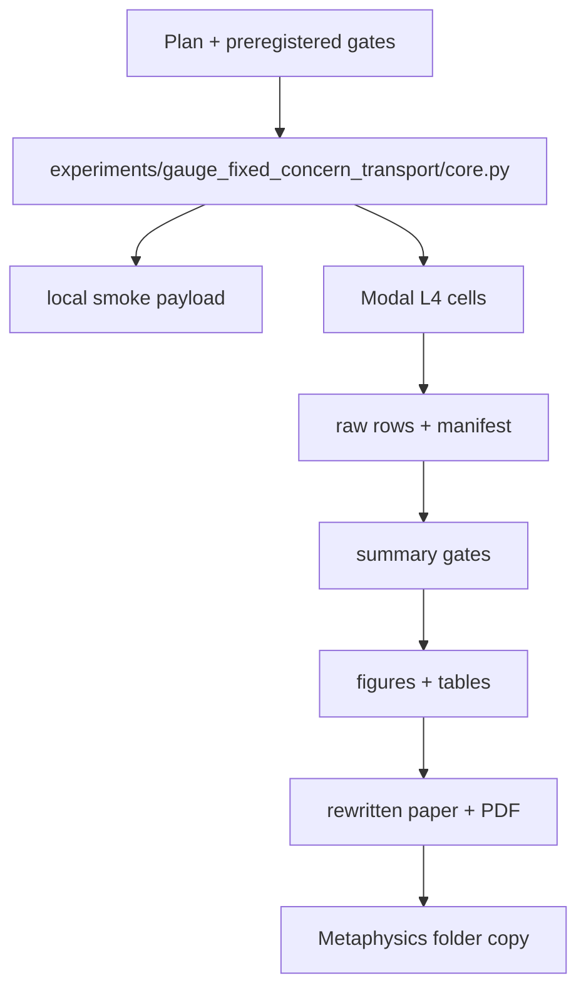

# feat: Gauge-Fixed Concern Transport Modal Experiments

## Goal Capsule

Run the full empirical program for the Gauge-Fixed Transport of Concern paper: implement a synthetic experiment suite, dispatch the registered cells on Modal L4 workers, analyze the results, and rewrite the paper so the bridge theorem is supported by actual empirical gates rather than only proposed demos.

Authority hierarchy: preserve the mathematical theorem; do not overclaim beyond synthetic L4 evidence; prefer cheap reproducible synthetic gates over fragile external datasets; record failures as findings; copy the final generated PDF into the user's Metaphysics folder.

Stop conditions: do not claim human, neural, biological, or foundation-model validation; do not dispatch Modal jobs if the conservative L4 timeout estimate exceeds the declared budget; do not rewrite the paper as empirical unless the payload, summary, figures, and verification artifacts exist.

Execution profile: code and knowledge-work hybrid, shipped as a normal branch with committed source, result payloads, figures, PDF, validation test, pushed PR, and copied external PDF.

---

## Product Contract

### Summary

The theory paper currently proves a bridge theorem but does not run the empirical demonstrations.
This work adds a registered synthetic Modal L4 suite that tests the theorem premises across concern-weighted OOD selection, causal gauge fixing, mechanistic commitment effects, reafference, and moved bottlenecks.
The rewritten paper should make the result useful across fields by showing proof plus empirical gates, while keeping the allowed claim level bounded.

### Problem Frame

The bridge theorem says a distinction becomes load-bearing when concern mass survives transport, gauge alternatives are separated, and the distinction changes a commitment surface.
That is mathematically clean but empirically incomplete.
Readers need to see that the theorem changes what gets measured: raw validation is insufficient, probe decodability is insufficient, ungauge-fixed latent factors are insufficient, and early encodings are insufficient when the bottleneck moves.

### Requirements

- R1. Add a durable plan and regime-transition record describing old regime, transition, gates, rejected alternatives, residual finding, and allowed claim.
- R2. Preserve or recreate the theory paper artifacts so the empirical branch contains the paper to rewrite.
- R3. Implement five synthetic experiments with deterministic local smoke mode and full Modal L4 mode.
- R4. Dispatch the full suite on Modal L4 workers with `max_containers` parallelism and a conservative budget guard.
- R5. Store raw rows, summary statistics, gate decisions, manifest, and Modal run metadata in committed artifacts.
- R6. Generate paper-ready figures and tables from the result payload.
- R7. Rewrite the paper to include methods, results, limitations, and the discovery-regime audit.
- R8. Generate and visually verify the PDF, then copy it into the Metaphysics folder.
- R9. Run lint, type checks, direct build checks, and targeted tests before commit.
- R10. Commit, push, and open a PR from the fresh main-based worktree.

### Acceptance Examples

- AE1. Given the Modal full suite completes, when the payload is summarized, then every experiment has a pass/fail gate and the overall claim is bounded to synthetic L4 empirical validation.
- AE2. Given a model has high validation accuracy but fails high-concern deployment contexts, when concern-weighted selection is applied, then the concern-weighted selector wins on weighted deployment risk.
- AE3. Given a latent variable is decodable under an observational gauge ambiguity, when paired interventions are added, then the gauge-fixed learner has higher factor alignment and commitment effect.
- AE4. Given a decodable but noncausal feature, when activation/feature patching is simulated, then probe score and commitment effect diverge.
- AE5. Given self/world ambiguity in a sensorimotor task, when efference/null interventions are used, then attribution and corrective action improve relative to the no-efference control.
- AE6. Given a long-horizon agent with moved memory bottlenecks, when the operative bottleneck is patched, then commitment changes more than when early encoding is patched.

### Scope Boundaries

In scope:
- Synthetic controlled tasks that directly test theorem premises.
- Modal L4 dispatch with many parallel cells and budget guards.
- Paper rewrite with empirical tables and figures.
- Reproducible local smoke mode and committed summary artifacts.

Deferred to follow-up work:
- Human-subject, EEG, eye-tracking, or clinical validation.
- Public foundation-model or large transformer validation.
- External dataset benchmarks requiring fragile downloads or licensing.

Outside this product's identity:
- Treating synthetic evidence as biological consciousness evidence.
- Treating L4 execution as proof that GPU computation was scientifically necessary.
- Hiding failed gates or controls.

---

## Planning Contract

### Key Technical Decisions

- KTD1. Use synthetic experiments first. Synthetic gates let the paper test exact theorem premises with known ground truth and clean interventions.
- KTD2. Use one suite package under `experiments/gauge_fixed_concern_transport`. A single package keeps the manifest, gates, and summary coherent across all experiments.
- KTD3. Use Modal L4 for full runs and local smoke for correctness. Modal demonstrates the requested parallel L4 execution; local smoke keeps tests fast and CI-friendly.
- KTD4. Gate each experiment against a theorem premise. The output should say which premise passed or failed: concern weighting, transport survival, gauge fixing, commitment effect, or moved bottleneck.
- KTD5. Keep the allowed claim bounded. Passing gates promote the paper from theory-only to synthetic empirical validation; they do not imply human, neural, or foundation-model truth.
- KTD6. Make PDF builds deterministic. ReportLab builders should run in invariant mode so validation rebuilds do not dirty committed PDFs.

### High-Level Technical Design

### Experiment Matrix

| ID | Experiment | Theorem premise | Primary gate |
| --- | --- | --- | --- |
| E1 | Concern-weighted OOD selection | concern-weighted weakness beats uniform count when future concern is nonuniform | concern-weighted selector lowers weighted deployment error versus validation selector |
| E2 | Causal gauge fixing | observational equivalence leaves latent factors unidentified | paired interventions improve factor alignment and commitment effect |
| E3 | Mechanistic commitment | decodability is not load-bearing | causal feature patch effect exceeds decodable distractor patch effect |
| E4 | Reafference/null intervention | self/world source attribution is gauge fixing | efference-copy model beats no-efference control under null interventions |
| E5 | Moved bottleneck | commitment surface locates operative representation | patching the active bottleneck changes final commitment more than early encoding patches |

---

## Implementation Units

### U1. Preserve theory paper and create research audit

- **Goal:** Bring the theory-paper artifact into this fresh branch and add the regime-transition record for empirical validation.
- **Requirements:** R1, R2
- **Files:** `papers/gauge_fixed_concern_transport/*`, `papers/pdf/README.md`, `docs/gauge_fixed_concern_transport_experiment_audit.md`
- **Approach:** Cherry-pick or recreate the theory-paper files, then update them after the experiment suite lands.
- **Test scenarios:** Verify the paper builder still produces a PDF and copies it to the external folder.
- **Verification:** The branch contains the paper source, PDF builder, committed PDF, and audit note.

### U2. Implement synthetic experiment suite

- **Goal:** Add deterministic local experiment code covering all five gates.
- **Requirements:** R3, R5
- **Files:** `experiments/gauge_fixed_concern_transport/core.py`, `experiments/gauge_fixed_concern_transport/summarize.py`, `experiments/gauge_fixed_concern_transport/budget.py`, `experiments/gauge_fixed_concern_transport/README.md`, `tests/test_gauge_fixed_concern_transport_experiments.py`
- **Approach:** Implement each experiment as seeded NumPy/PyTorch-compatible cells returning row dictionaries. Summaries compute per-track means, standard errors, and pass/fail gates.
- **Test scenarios:** Smoke preset runs all tracks; each gate has a synthetic failure fixture; budget guard refuses over-budget dispatch; summary has stable schema.
- **Verification:** Targeted pytest passes locally without Modal.

### U3. Implement Modal L4 runner

- **Goal:** Dispatch all experiment cells on Modal L4 workers with parallelism and budget guard.
- **Requirements:** R4, R5
- **Files:** `experiments/gauge_fixed_concern_transport/modal_l4_suite.py`, `experiments/gauge_fixed_concern_transport/PROVENANCE.md`
- **Approach:** Follow existing `phase5_external_validity` patterns: `modal.Image.debian_slim`, `gpu="L4"`, `max_containers`, `run_cell.map`, summary cell, `quality_only`, dry-run budget, and committed payload output.
- **Test scenarios:** Dry-run budget prints manifest; quality-only runs targeted checks in Modal; full dispatch writes payload with all tracks and cells.
- **Verification:** Full run writes `artifacts/gauge_fixed_concern_transport/l4_full_suite.json`.

### U4. Analyze results and generate figures

- **Goal:** Convert payload into paper figures, tables, and a markdown report.
- **Requirements:** R5, R6
- **Files:** `scripts/make_gauge_fixed_concern_transport_figures.py`, `experiments/gauge_fixed_concern_transport/results/gfc_l4_suite_2026_07_07.md`, `papers/gauge_fixed_concern_transport/figures/*`
- **Approach:** Generate a gate-status chart, concern-selection chart, gauge-fixing chart, commitment-effect chart, and bottleneck chart.
- **Test scenarios:** Fixture payload generates all expected figures; report includes manifest, gate table, and allowed claim.
- **Verification:** Figures are nonempty and payload/report are internally consistent.

### U5. Rewrite and rebuild paper

- **Goal:** Rewrite the paper from theory-only to proof-plus-results.
- **Requirements:** R6, R7, R8
- **Files:** `papers/gauge_fixed_concern_transport/paper.md`, `scripts/build_gauge_fixed_concern_transport_pdf.py`, `papers/gauge_fixed_concern_transport/paper.pdf`, `papers/pdf/gauge_fixed_concern_transport.pdf`
- **Approach:** Add methods/results sections, empirical tables, audit, limitations, and the actual payload path. Preserve proofs and literature review.
- **Test scenarios:** PDF has text extraction, figure render, result tables, and reference section; copy lands in the external folder.
- **Verification:** Direct PDF build check passes and representative pages render nonblank.

### U6. Final validation and PR

- **Goal:** Run quality gates, commit, push, and open PR.
- **Requirements:** R9, R10
- **Files:** All changed files.
- **Approach:** Run ruff on changed Python files, pyright on changed Python files, targeted pytest, direct PDF build check, and `git diff --check`.
- **Test scenarios:** Dirty-worktree rebuilds do not change deterministic PDFs; Modal payload remains parseable JSON.
- **Verification:** Branch is pushed and PR is open.

---

## Verification Contract

| Gate | Command or check | Required result |
| --- | --- | --- |
| Local smoke | `python -m experiments.gauge_fixed_concern_transport.core --preset smoke` | payload writes and all tracks appear |
| Targeted tests | `python -m pytest tests/test_gauge_fixed_concern_transport_experiments.py tests/test_gauge_fixed_concern_transport_pdf.py` | pass, with PDF test allowed to skip if deps absent |
| Modal dry run | `uvx --python 3.12 --from modal modal run experiments/gauge_fixed_concern_transport/modal_l4_suite.py --preset full --dry-run-budget` | within budget |
| Modal full run | same runner without dry-run | payload exists with full rows |
| Lint | `python -m ruff check ...` | pass |
| Type | `pyright ...` | pass |
| PDF | direct builder invocation with bundled ReportLab runtime | PDF, repo copy, and external copy exist |
| Diff hygiene | `git diff --check` | pass |

---

## Definition of Done

- The plan and audit are committed.
- The Modal L4 full suite has run or a clearly documented Modal blocker is preserved with local smoke evidence.
- The empirical payload, summary report, figures, and rewritten paper are committed.
- The final PDF is copied into the Metaphysics folder.
- Lint, type, targeted tests, direct PDF build, and diff hygiene pass or are honestly reported with blockers.
- The branch is pushed and a PR is opened.
