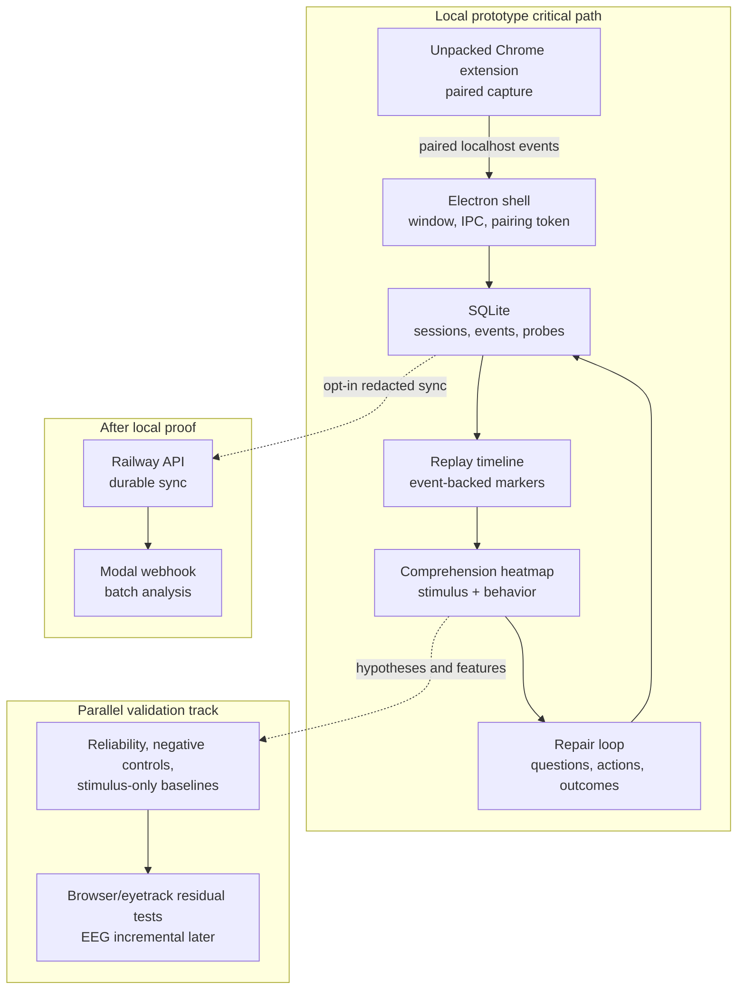
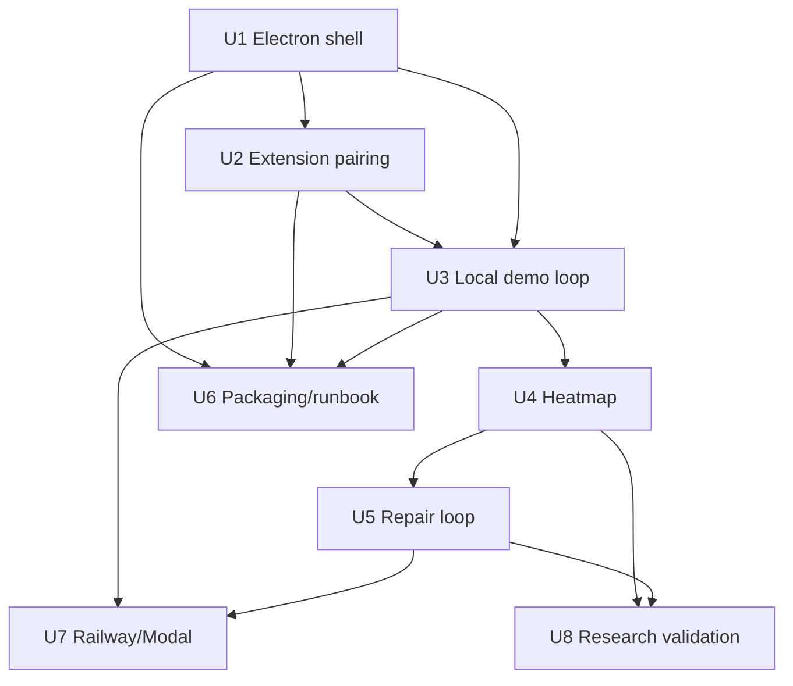

# Inquiry Live Prototype - Plan

## Goal Capsule

- **Objective:** Turn the merged Inquiry Black Box foundation into a locally runnable prototype that can capture a real browser research session, show a replay and comprehension heatmap, ask repair questions, and export/delete the session safely.
- **Priority rule:** Prove the local desktop + extension loop before Railway, Modal, packaging polish, or BBBD research work.
- **Authority hierarchy:** preserve the privacy invariants in `apps/inquiry-black-box/AGENTS.md`; keep cloud sync and Modal optional; avoid EEG, medical, workplace-surveillance, or mind-reading claims in the prototype.
- **Stop conditions:** do not proceed to cloud deployment until a real local extension-to-desktop session works; do not add raw page text, raw video, or raw typed content without per-document opt-in; do not package a binary before the dev runtime can complete the demo loop.
- **Tail ownership:** the implementation PR should leave a reproducible local demo script, updated docs, and verification evidence for the real extension pairing flow.

---

## Product Contract

### Summary

The next tranche should make Inquiry Black Box feel like a product, not just a tested foundation.
The fastest path is a local prototype: an Electron window with visible session controls and pairing token, a loaded Chrome extension sending real events, a replay timeline, a first comprehension heatmap, and a repair loop that asks targeted recall questions.

Cloud deployment, durable Railway storage, Modal webhook deployment, packaging, and BBBD validation remain important, but they should follow the local demo because they do not prove the user can actually capture and repair a research session.

### Problem Frame

PR #286 merged the architecture, schema, desktop runtime, extension telemetry, cloud API foundation, Modal jobs, tests, and folder-level agent guide.
It did not prove the installed extension can pair with a real desktop window, that a user can run a 10-minute session without touching code, or that replay/heatmap output is useful for comprehension repair.

The attached neurophenom idea menu points toward the right product/research bridge: sell learning-state instrumentation, not mind reading.
For the prototype, that means stimulus difficulty plus browser behavior should produce inspectable "where the thread broke" segments, then ask repair questions and collect outcomes.

### Requirements

**Runnable Local Prototype**

- R1. The desktop app must launch as an actual Electron window with session controls, recording state, pairing token, replay, settings, export, and delete surfaces.
- R2. The Chrome extension must be loadable unpacked, pair with the desktop app, record on normal `http` and `https` pages only after opt-in, and respect pause, stop, site disable, and privacy toggles.
- R3. A user must be able to run one local research session without Railway, Modal, Doppler, or provider API keys.
- R4. The app must include a reproducible local demo flow that captures browser events, labels at least one moment, shows replay evidence, exports safely, and deletes the session with a cloud-deletion tombstone.

**Comprehension Heatmap and Repair**

- R5. The prototype must turn replay markers into a timeline heatmap with likely skim, stuck-loop, high-load, copied-passage, rewind, and tab-churn segments.
- R6. The prototype must add a stimulus-analysis layer that can segment a transcript, video note, or article/PDF-derived text into difficulty, concept-transition, and quiz-checkpoint candidates without requiring cloud calls.
- R7. The heatmap must combine stimulus difficulty and user behavior rather than treating physiology/browser traces as standalone truth.
- R8. The repair loop must generate or select targeted prompts such as "rewatch this span," "state the claim in one sentence," or "answer this recall question," then store answer/outcome events.
- R9. All heatmap and repair claims must show evidence event IDs, confidence, and a limitation note so the UI remains inspectable.

**Deployability and Research Track**

- R10. Railway durable storage and Modal webhook deployment should be planned after the local prototype works, with `DATABASE_URL`, `INQUIRY_CLOUD_AUTH_SECRET`, and `MODAL_JOB_WEBHOOK_URL` documented and smoke-tested.
- R11. The research validation track should start with reliability ceiling, negative controls, stimulus-only baselines, and eyetrack/browser-behavior residual tests before EEG model-zoo or event-locked EEG rescue work.
- R12. Packaging should make the local prototype repeatable, but signing, notarization, and Chrome Web Store publication remain follow-up work unless needed for demo distribution.

### Acceptance Examples

- AE1. Given the desktop app is launched locally, when the user starts a session, then the UI shows a visible recording state, a current pairing token, and controls for pause, resume, stop, labels, export, and delete.
- AE2. Given the Chrome extension is loaded unpacked and paired, when the user scrolls, highlights, rewinds media, pauses recording, and disables a site, then only allowed events are stored and blocked events are neither queued nor posted.
- AE3. Given a user completes a short article or video session, when they open replay, then the timeline shows event-backed markers and a heatmap that distinguishes stimulus difficulty from user behavior evidence.
- AE4. Given a heatmap segment has a stuck-loop or high-load marker, when the user opens repair, then the app presents one targeted question/action and stores the answer or dismissal as a probe/outcome event.
- AE5. Given cloud variables are absent, when the local demo runs, then the prototype still captures, replays, exports, and deletes locally.
- AE6. Given Railway/Modal are configured later, when cloud sync or a Modal job is triggered, then only `public`, `redacted-sync`, or explicit `document-opt-in` payloads leave the machine.

### Scope Boundaries

#### In Scope

- Local Electron shell and IPC for the merged desktop runtime.
- Real unpacked Chrome extension pairing and smoke QA.
- Local demo fixture and human-session QA checklist.
- Comprehension heatmap v0 from replay markers plus local stimulus segmentation.
- Repair prompt/probe loop with outcome tracking.
- Packaging/dev-experience work needed to make the demo repeatable.
- Planning hooks for Railway/Modal activation and BBBD validation.

#### Deferred to Follow-Up Work

- Durable Railway Postgres implementation before the local demo works.
- Deployed Modal webhook smoke before local repair-loop value is proven.
- macOS signing/notarization, auto-update, and Chrome Web Store publication.
- VLM provider integration, transcript download automation, and PDF OCR.
- Braindecode fleet benchmark, EEG-over-eyetrack incremental tests, and event-locked EEG windows.
- Multi-user dashboard, accounts, billing, or shared team analytics.

#### Outside This Product's Identity

- Medical diagnosis, emotion certainty, lie detection, and workplace surveillance.
- Hidden recording or always-on capture without visible local state.
- Raw keylogging, raw camera-frame persistence, or silent raw page-content upload.

---

## Planning Contract

### Key Technical Decisions

- KTD1. **Local prototype first:** implement Electron shell, extension pairing, and local demo before Railway/Modal deployment because this is the shortest path to proving user value.
- KTD2. **Desktop owns live state:** keep session lifecycle, pairing token, replay, export/delete, and settings behind desktop IPC so the renderer and extension cannot bypass local privacy rules.
- KTD3. **Heatmap uses two evidence channels:** combine stimulus segments and user-behavior markers so the app can say "this section was intrinsically dense" versus "your trace shows likely loss of thread."
- KTD4. **Stimulus analysis starts local and deterministic:** use transcript/article/manual text input and basic segmentation first; provider/VLM ratings are optional later adapters.
- KTD5. **Repair prompts are stored as probes:** model every suggested action, answer, dismissal, snooze, or accepted repair as events so personalization can learn from outcomes.
- KTD6. **Cloud activation follows local proof:** implement durable Railway and deployed Modal only after AE1-AE4 pass, then keep cloud paths opt-in and redacted.
- KTD7. **Research validation runs beside the product, not in front of it:** start with ceiling/leakage/stimulus controls and browser/eyetrack residuals; do not block prototype delivery on EEG rescue.

### High-Level Technical Design

### Delivery Sequence

| Phase | Units | Purpose | Exit Signal |
|---|---:|---|---|
| A. Make it runnable | U1-U3 | Electron shell, extension pairing, real local demo | A user can run one local session and see replay |
| B. Make it useful | U4-U5 | Heatmap and repair loop | The replay recommends specific, answerable repairs |
| C. Make it repeatable | U6 | Packaging and demo docs | A fresh developer can run the prototype from docs |
| D. Make it expandable | U7-U8 | Cloud/Modal activation and research validation | Optional deploy/research tracks are ready without blocking local UX |

### Parallelization Strategy

The work can be parallelized, but the local prototype has one non-negotiable integration spine: U1 Electron shell enables U2 real extension pairing, U1+U2 enable U3 local demo, U3 anchors U4 heatmap, and U4 anchors U5 repair outcomes.
Agents may start adjacent work from fixtures, but merges should respect that spine so runtime behavior does not drift.

| Workstream | Units | Can Start | Merge After | Collision Notes |
|---|---|---|---|---|
| Desktop shell | U1 | Immediately | First | Owns Electron, preload, renderer shell, and desktop runtime wiring. |
| Extension pairing | U2 | Immediately against current bridge contract; final smoke waits for U1 | After U1 | Owns extension popup/background/content tests. Coordinate docs edits with U6. |
| Local demo integration | U3 | After U1 and U2 contracts stabilize | After U1+U2 | Owns demo fixture and E2E loop. This is the main integration gate. |
| Heatmap model/UI | U4 | Immediately using fixture events and current replay report | After U3 for runtime wiring | Owns `packages/signals` heatmap/stimulus files and replay heatmap rendering. Coordinate schema changes with U5. |
| Repair loop | U5 | After U4 API shape is drafted | After U4 | Owns repair candidate logic, probe/outcome events, and repair UI. |
| Runbook/packaging | U6 | Immediately for docs outline; final commands wait for U1-U3 | Near end of local tranche | Owns docs/scripts. Must track actual commands from U1-U3 rather than inventing them. |
| Cloud activation | U7 | Design-only after U3; implementation after AE1-AE4 pass | After local prototype proof | Should not block local demo. Keep this out of the critical path unless the goal changes to hosted demo. |
| Research validation | U8 | Immediately as docs/matrix work; code waits for separate research PR | Independent or after U4/U5 | Avoid broad `coherence-testbench` edits in the prototype branch. |

**Two-agent dispatch:** Agent A owns U1 then U3. Agent B owns U2 and drafts U6 docs, then helps U4 once U3 fixture shape is stable. Keep U7/U8 as plan/docs notes unless the local demo finishes early.

**Four-agent dispatch:** Agent A owns U1. Agent B owns U2. Agent C starts U4 from fixture events and later wires into U3. Agent D owns U6 and U8 docs, then supports U3 smoke/runbook updates. Merge order stays U1, U2, U3, U4, U5, U6, U8, U7.

**Six-agent dispatch:** Agent A owns U1, Agent B owns U2, Agent C owns U3, Agent D owns U4, Agent E owns U5, and Agent F owns U6 plus U8 and prepares U7 as design-only. This is fastest only if one coordinator enforces schema/API boundaries and resolves overlapping files such as `ReplayTimeline.tsx`, `packages/schema/src/events.ts`, and `docs/local-dev.md`.

**Do not parallelize blindly:** U7 should not run as a production deployment effort until the local prototype acceptance examples pass. U5 should not finalize event schemas before U4's heatmap contract lands. U3 should not fake success with fixture-only behavior if U2 has not proven real extension pairing.

### Assumptions

- The merged PR #286 is the baseline and remains available on `main`.
- The first prototype targets developer-run local use, not signed distribution.
- Users can provide a transcript/article/manual text input for stimulus analysis v0.
- Real webcam gaze quality remains optional; browser behavior and labels are enough for the first heatmap.

---

## Implementation Units

### U1. Electron Shell and IPC Runtime

- **Goal:** Replace the CLI-only desktop runtime with a visible Electron app shell that exposes the existing session, camera, replay, privacy, export/delete, and pairing capabilities.
- **Requirements:** R1, R3, R4, AE1, AE5
- **Dependencies:** None
- **Files:** `apps/inquiry-black-box/apps/desktop/package.json`, `apps/inquiry-black-box/apps/desktop/src/main/main.ts`, `apps/inquiry-black-box/apps/desktop/src/main/preload.ts`, `apps/inquiry-black-box/apps/desktop/src/renderer/index.html`, `apps/inquiry-black-box/apps/desktop/src/renderer/index.ts`, `apps/inquiry-black-box/apps/desktop/src/renderer/App.tsx`, `apps/inquiry-black-box/apps/desktop/src/renderer/replay/ReplayTimeline.tsx`, `apps/inquiry-black-box/apps/desktop/tests/desktop-shell.test.ts`
- **Approach:** Add Electron dependencies and scripts only under `apps/inquiry-black-box/apps/desktop`. Main process creates the runtime and BrowserWindow. Preload exposes a narrow `InquiryDesktopBridge` matching the renderer facade. Renderer shows visible recording state, current session, pairing token, camera status, replay, labels, notification settings, privacy toggles, export, and delete. Keep filesystem, SQLite, and ingest server access in main.
- **Execution note:** Start with IPC facade tests using a fake runtime before wiring the real window.
- **Patterns to follow:** Follow the privilege split already implied by `apps/desktop/src/main/main.ts` and `apps/desktop/src/renderer/App.tsx`.
- **Test scenarios:** Starting the shell initializes a runtime and returns a pairing token; renderer start/pause/resume/stop calls mutate session state through IPC; export/delete actions call the main privacy layer; renderer cannot call arbitrary filesystem APIs; app shutdown stops ingest and closes SQLite.
- **Verification:** `bun run dev:desktop` opens a window and can complete start, label, pause, resume, stop, export, and delete against a local database.

### U2. Real Extension Pairing and Browser Smoke

- **Goal:** Prove the unpacked Chrome extension can pair with the desktop app and capture real browser events under visible recording controls.
- **Requirements:** R2, R3, R4, AE2, AE5
- **Dependencies:** U1
- **Files:** `apps/inquiry-black-box/apps/extension/src/background/service-worker.ts`, `apps/inquiry-black-box/apps/extension/src/content/index.ts`, `apps/inquiry-black-box/apps/extension/src/popup/App.tsx`, `apps/inquiry-black-box/apps/extension/tests/pairing.test.ts`, `apps/inquiry-black-box/apps/extension/tests/content-events.test.ts`, `apps/inquiry-black-box/tests/e2e/extension-pairing.spec.ts`, `apps/inquiry-black-box/docs/local-dev.md`
- **Approach:** Add a desktop-visible pairing token copy flow and update extension popup copy/status so pairing, recording state, queue size, endpoint, and disabled-site state are obvious. Add a local smoke fixture page and an E2E or scripted manual QA harness that builds the extension, loads it unpacked when possible, pairs it, records scroll/highlight/media events, toggles pause/stop/site disable, and verifies SQLite event counts.
- **Execution note:** Prefer an automated fixture smoke for repeatability, but keep a manual Chrome checklist if extension loading cannot be fully automated in CI.
- **Patterns to follow:** Preserve stopped-by-default capture and `isBridgeEventAllowed` as the single extension-side permission gate.
- **Test scenarios:** Pairing with a valid token starts posting accepted events; missing or stale token keeps capture blocked; pause and stop suppress new events; site-disable suppresses matching hashed host; offline desktop keeps allowed events queued; queue flushes when desktop returns.
- **Verification:** A local Chrome session on an `http` fixture page records events into desktop SQLite and shows them in replay without Railway or Modal.

### U3. End-to-End Local Demo Loop

- **Goal:** Create a repeatable local demo that exercises session capture, labels, replay, export, and delete in one short research-session path.
- **Requirements:** R3, R4, R5, AE1, AE3, AE5
- **Dependencies:** U1, U2
- **Files:** `apps/inquiry-black-box/tests/e2e/local-session.spec.ts`, `apps/inquiry-black-box/tests/fixtures/research-session.jsonl`, `apps/inquiry-black-box/tests/fixtures/demo-article.html`, `apps/inquiry-black-box/apps/desktop/tests/replay.test.ts`, `apps/inquiry-black-box/docs/local-dev.md`, `apps/inquiry-black-box/README.md`
- **Approach:** Expand the current fixture E2E into a demo path with a local article/video-like page, scripted user actions, a self-label, replay generation, JSONL export parsing, and deletion. The demo should work without provider keys. Add a short human QA checklist for a real 10-minute run.
- **Patterns to follow:** Keep fixture-based tests as the CI proof and manual smoke as product proof.
- **Test scenarios:** Fixture session includes scroll, visibility, highlight/copy, media seek, label, and probe events; replay markers include evidence IDs; export omits debug-sensitive payloads; delete removes the session and queues a redacted cloud-delete tombstone; demo fails clearly if extension/desktop are not paired.
- **Verification:** One command or documented checklist proves the local loop from capture to replay to export/delete.

### U4. Comprehension Heatmap v0

- **Goal:** Add the first useful "where the thread broke" heatmap by combining replay markers with local stimulus segmentation.
- **Requirements:** R5, R6, R7, R9, AE3
- **Dependencies:** U3
- **Files:** `apps/inquiry-black-box/packages/signals/src/stimulus.ts`, `apps/inquiry-black-box/packages/signals/src/heatmap.ts`, `apps/inquiry-black-box/packages/signals/tests/heatmap.test.ts`, `apps/inquiry-black-box/packages/schema/src/events.ts`, `apps/inquiry-black-box/apps/desktop/src/main/reports/sessionReplay.ts`, `apps/inquiry-black-box/apps/desktop/src/renderer/replay/ReplayTimeline.tsx`, `apps/inquiry-black-box/apps/desktop/tests/replay.test.ts`
- **Approach:** Add local stimulus inputs for transcript/article/manual segment text with hashed or explicit `document-opt-in` content references. Segment stimulus material into chunks with duration/range, density, term novelty, transition count, and quiz-checkpoint candidates. Combine these chunks with replay markers into heatmap segments that separate stimulus evidence from behavior evidence.
- **Execution note:** Keep provider/VLM ratings behind a later adapter; v0 should be deterministic and local.
- **Patterns to follow:** Use event-backed provenance from `packages/signals/src/heuristics.ts`; every heatmap segment should trace to stimulus segment IDs and event IDs.
- **Test scenarios:** Dense stimulus segment with low user friction reports "intrinsic difficulty"; low-density segment with high rewind/stuck markers reports "behavioral loss of thread"; missing stimulus input still produces behavior-only heatmap; document-opt-in text is included only when explicitly attached; redacted export excludes raw document text by default.
- **Verification:** Replay timeline renders heatmap bands with evidence, confidence, and limitation text for a fixture session.

### U5. Repair Loop and Outcome Tracking

- **Goal:** Turn heatmap segments into targeted repair prompts and store whether the user accepted, answered, dismissed, or found the repair useful.
- **Requirements:** R8, R9, AE4
- **Dependencies:** U4
- **Files:** `apps/inquiry-black-box/packages/signals/src/repairs.ts`, `apps/inquiry-black-box/packages/signals/tests/repairs.test.ts`, `apps/inquiry-black-box/packages/schema/src/events.ts`, `apps/inquiry-black-box/apps/desktop/src/renderer/probes/ProbePanel.tsx`, `apps/inquiry-black-box/apps/desktop/src/main/db/index.ts`, `apps/inquiry-black-box/apps/desktop/tests/replay.test.ts`, `apps/inquiry-black-box/apps/desktop/tests/db.test.ts`
- **Approach:** Add repair candidates as typed events linked to heatmap markers. Start with templated actions: restate the claim, identify the missing prerequisite, rewatch/reread the span, answer a recall question, or promote a branch to a follow-up note. Store answer quality, user response, and optional next-day usefulness as events rather than mutating the original marker.
- **Patterns to follow:** Keep the "signal changes action" discipline from the original plan: a marker is useful only if it suggests a repair or question.
- **Test scenarios:** Stuck-loop marker generates a prerequisite question; skim-risk marker generates a recall prompt; copied-passage marker asks why it mattered; accepting a repair creates a probe event; dismissing creates an outcome event; repair candidates are not emitted when confidence/evidence is below threshold.
- **Verification:** A fixture replay produces at least one actionable repair, and answering it changes the replay/probe state without altering source events.

### U6. Prototype Packaging and Developer Runbook

- **Goal:** Make the prototype repeatable for future sessions and demos without requiring the implementer to rediscover commands.
- **Requirements:** R3, R12, AE1, AE2, AE5
- **Dependencies:** U1, U2, U3
- **Files:** `apps/inquiry-black-box/package.json`, `apps/inquiry-black-box/apps/desktop/package.json`, `apps/inquiry-black-box/apps/extension/package.json`, `apps/inquiry-black-box/docs/local-dev.md`, `apps/inquiry-black-box/docs/prototype-demo.md`, `apps/inquiry-black-box/AGENTS.md`, `apps/inquiry-black-box/README.md`
- **Approach:** Add app-local scripts for desktop dev, extension build, extension watch if cheap, local demo test, and Modal checks. Document the exact local prototype flow: install, launch desktop, load unpacked extension, pair, run demo page, inspect replay, export, delete. Add packaging notes for later Electron builder/signing without making signing a blocker.
- **Execution note:** This is mostly packaging/config; prefer runtime smoke verification over unit coverage where behavior is already tested by U1-U3.
- **Patterns to follow:** Keep all commands under `apps/inquiry-black-box` and preserve the folder-level agent guide as the quick-start source.
- **Test scenarios:** Fresh clone can run documented scripts; extension build output lands in a predictable ignored location; docs mention required and optional env vars; missing cloud/Modal variables do not block local demo; build artifacts do not create unrelated git churn.
- **Verification:** A future agent can follow `docs/prototype-demo.md` from zero local app state to a captured local session.

### U7. Railway and Modal Activation After Local Proof

- **Goal:** Add durable optional cloud deployment and real Modal webhook only after the local prototype proves capture and repair value.
- **Requirements:** R10, AE6
- **Dependencies:** U3, U5
- **Files:** `apps/inquiry-black-box/apps/cloud/src/db/schema.ts`, `apps/inquiry-black-box/apps/cloud/src/db/postgres.ts`, `apps/inquiry-black-box/apps/cloud/src/server.ts`, `apps/inquiry-black-box/apps/cloud/tests/sync.test.ts`, `apps/inquiry-black-box/apps/cloud/railway.json`, `apps/inquiry-black-box/apps/cloud/src/lib/modalClient.ts`, `apps/inquiry-black-box/modal/inquiry_jobs.py`, `apps/inquiry-black-box/docs/deployment.md`
- **Approach:** Replace or wrap the in-memory cloud store with a durable Postgres-backed store selected when `DATABASE_URL` is present. Keep the existing in-memory path for local tests only. Deploy the Modal webhook and record the actual `MODAL_JOB_WEBHOOK_URL` contract in docs. Add smoke tests that can run with Doppler/Railway credentials but do not require them in CI.
- **Execution note:** Do not start this unit until AE1-AE4 are verified locally.
- **Patterns to follow:** Keep `INQUIRY_ALLOW_IN_MEMORY_CLOUD=1` as an explicit smoke-test escape hatch, not a production default.
- **Test scenarios:** Postgres store syncs events idempotently; revoked device tokens block sync; reports are scoped per user; missing `INQUIRY_CLOUD_AUTH_SECRET` fails production startup; Modal timeout/failure records failed job state; raw sensitive payloads are rejected before store or Modal submission.
- **Verification:** Railway health check passes with durable storage, and Modal smoke returns a job ID/status without leaking raw-sensitive payloads.

### U8. Research Validation Track for Product Grounding

- **Goal:** Create the first research-validation tranche that keeps the product honest without blocking the local prototype.
- **Requirements:** R11
- **Dependencies:** U4, U5
- **Files:** `apps/inquiry-black-box/docs/research-validation.md`, `docs/plans/2026-07-07-003-feat-inquiry-live-prototype-plan.md`, `coherence-testbench/README.md`, `coherence-testbench/scripts/*`, `coherence-testbench/tests/*`
- **Approach:** Define a bounded research plan for reliability ceiling, label-noise audit, negative controls, stimulus-only baselines, browser/eyetrack residual prediction, and EEG-over-browser incremental tests. Treat Braindecode fleet, EEG foundation-model rescue, and event-locked EEG windows as later work until the residual gates are clean.
- **Execution note:** This unit is planning and validation scaffolding; implementation should avoid touching fragile `coherence-testbench` code unless the validation scripts are in scope for that PR.
- **Patterns to follow:** Use the gate discipline already documented in the original Inquiry plan and the existing `coherence-testbench` GO/KILL style.
- **Test scenarios:** Negative-control spec includes within-video permutation, cross-subject shuffle, future-participant score, and fake shifted features; stimulus baseline spec includes dumb features and optional VLM ratings; residual table defines demographics, stimulus, browser/eyetrack, EEG, and fusion rows; research docs state that product claims remain probabilistic and non-medical.
- **Verification:** A future research PR can start from a concrete validation matrix without changing the prototype critical path.

---

## Verification Contract

| Gate | Applies To | Done Signal |
|---|---|---|
| App lint | U1-U7 | `bun run lint` passes from `apps/inquiry-black-box`. |
| App typecheck | U1-U7 | `bun run typecheck` passes from `apps/inquiry-black-box`. |
| Unit tests | U1-U7 | `bun run test` passes and includes new shell, pairing, heatmap, and repair coverage. |
| Fixture E2E | U2-U5 | `bun run test:e2e` passes with local session and extension/demo fixture coverage. |
| Extension build | U2, U6 | `bun run build` passes from `apps/inquiry-black-box/apps/extension`. |
| Modal tests | U7 | `python3 -m pytest` passes from `apps/inquiry-black-box/modal`. |
| Local human smoke | U1-U6 | A documented local run captures a real browser session, shows replay/heatmap, asks a repair prompt, exports, and deletes. |
| Repo hygiene | All units | `git diff --check` and `uvx ruff check .` pass; root `uvx ty check .` status is recorded if existing `coherence-testbench` diagnostics remain. |

---

## Definition of Done

- PR #286 is merged into `main` before implementation begins.
- The desktop app opens as a window and controls the local runtime through a narrow IPC bridge.
- The extension can be loaded unpacked, paired, and verified against a real local page.
- A local user can complete one research-session demo without Railway, Modal, Doppler, or provider keys.
- Replay includes a comprehension heatmap that shows behavior evidence, stimulus evidence, confidence, and limitations.
- At least one repair prompt can be accepted or dismissed, and the outcome is stored as event data.
- Export and delete remain safe: no raw camera frames, raw typed content, or hidden raw page text is exported by default.
- Docs explain the local prototype flow, the deferred cloud path, and the research-validation path.
- Abandoned experiments and generated build artifacts are removed or ignored before landing.

---

## Risks & Dependencies

- **Electron dependency surface:** adding real Electron may introduce platform-specific dev issues. Mitigate with a minimal shell, IPC tests, and a documented local smoke path.
- **Chrome extension automation:** fully automated unpacked-extension QA can be brittle. Mitigate with fixture tests plus a manual checklist if browser automation becomes expensive.
- **Heatmap overclaiming:** marker confidence can sound like certainty. Mitigate with evidence IDs, limitation copy, and separation of stimulus difficulty from user behavior.
- **Stimulus text privacy:** transcript/article inputs can contain sensitive content. Mitigate with explicit document opt-in, hashed references by default, and export filtering.
- **Cloud distraction:** Railway/Modal work is valuable but can consume time before the product feels real. Mitigate by gating U7 on local acceptance examples AE1-AE4.
- **Research branch drift:** BBBD validation can become a separate research program. Mitigate by scoping U8 to validation matrix and docs unless a dedicated research PR starts.

---

## Documentation / Operational Notes

- Update `apps/inquiry-black-box/AGENTS.md` whenever commands, env vars, or prototype flow changes.
- Add `apps/inquiry-black-box/docs/prototype-demo.md` as the canonical local demo runbook.
- Keep `apps/inquiry-black-box/docs/deployment.md` focused on optional Railway/Modal activation, not required local prototype steps.
- Keep the product promise as "learning-state instrumentation" and avoid "mind reading," "diagnosis," or universal physiology claims.

---

## Sources & Research

- `docs/plans/2026-07-07-001-feat-inquiry-black-box-plan.md` defines the merged foundation, privacy boundaries, architecture, Modal/Railway split, and original implementation units.
- `apps/inquiry-black-box/AGENTS.md` defines app-local commands, privacy invariants, environment variables, Railway/Modal flow, and future-agent orientation.
- `apps/inquiry-black-box/README.md` lists the current workspace packages and validation commands.
- The user-provided neurophenom next-menu argues for stimulus baselines, residual tests, comprehension heatmaps, adaptive repair, and learning-state instrumentation over "brain decoding" claims.
