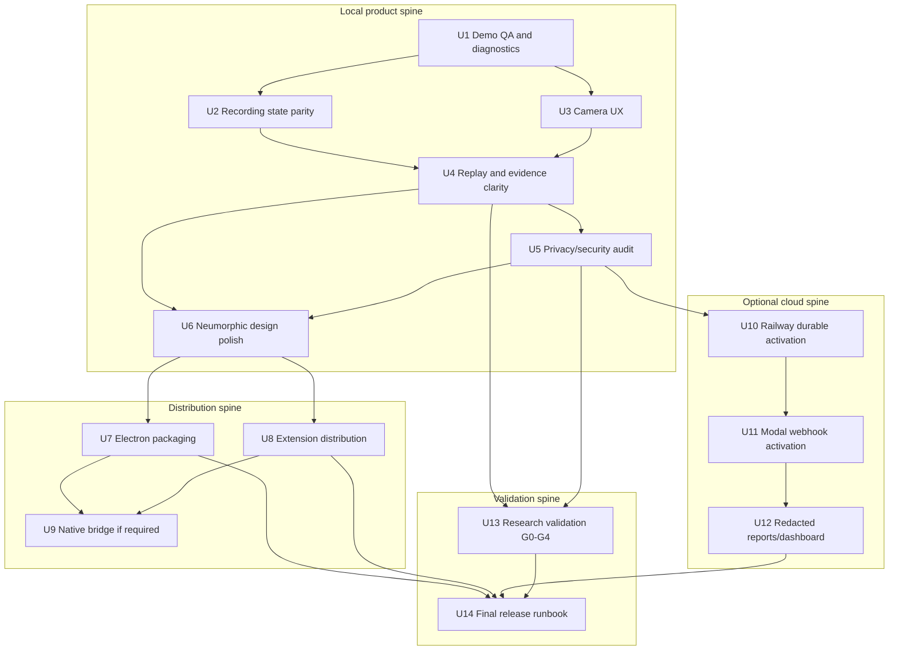

# Inquiry Finish Product - Plan

## Goal Capsule

- **Objective:** Finish Inquiry Black Box from a useful local prototype into a shippable local-first product with reliable desktop + extension capture, clear replay, visible camera state, packaged distribution, optional Railway/Modal activation, and a first validation loop.
- **Current baseline:** `main` already has the local app workspace, Electron shell, Chrome MV3 extension, SQLite ingest, extension-to-desktop recording coordination, replay evidence episodes, opt-in selected text snippets, fixture E2E, local docs, cloud API scaffold, and Modal job scaffold.
- **Authority hierarchy:** local-first privacy beats model richness; visible recording state beats convenience; inspectable evidence beats confidence theater; local demo reliability beats cloud deployment; research validation gates beat neurophenom claims.
- **Stop conditions:** do not ship hidden recording, raw camera frames, raw typed content, ambient page text capture, cloud upload of `document-opt-in` data, workplace-surveillance claims, medical claims, or camera/gaze certainty claims.
- **Execution profile:** finish in sequenced PRs under `apps/inquiry-black-box`, with each PR using a fresh worktree, app lint/typecheck, targeted tests, and a PR before merge.
- **Tail ownership:** implementation should land tickets as independently reviewable PRs, but final completion requires the Definition of Done in this plan, not just a single ticket merge.

---

## Product Contract

### Summary

Inquiry Black Box is past the "does the local idea exist?" stage.
The remaining work is product hardening: make the real demo reliable across pages and tabs, make the camera and replay states self-explanatory, package the app and extension, activate optional cloud/Modal paths, and validate whether the replay/repair loop improves understanding.

This plan treats the app as a local-first research cockpit.
Railway, Modal, and signed distribution matter, but they should not weaken the default privacy model or distract from the core loop: capture -> replay -> evidence -> repair -> outcome.

### Current State

Already done:

- Desktop/local SQLite ingest, sessions, replay, export, delete, notifications, camera feature events, and IPC facade.
- Chrome MV3 extension capture, pairing, page-listener diagnostics, offline queue, site disable, privacy toggles, opt-in selected text excerpts, and extension Record/Stop coordination with desktop.
- Local demo fixture with scroll, dwell, highlight/copy, media seek, tab churn, labels, probes, heatmap, repair candidates, export, delete, and cloud-delete tombstone.
- Optional cloud API scaffold with redacted sync/report/job routes and Postgres-aware storage.
- Modal Python job scaffold with sensitive-field rejection and smoke reports.
- Docs for local development, prototype demo, privacy model, deployment, and research validation.

Not yet finished:

- A clean manual dogfood pass across normal sites, multiple tabs, camera permission states, extension reloads, replay after stop, export/delete, and restart.
- Desktop-to-extension recording parity beyond extension-driven Record/Stop.
- Production packaging for Electron and Chrome extension distribution.
- Live Railway deploy with durable Postgres and signed auth smoke.
- Deployed Modal webhook smoke through the cloud API.
- Hosted redacted report/dashboard experience if the goal includes remote review.
- Formal validation artifacts for reliability ceiling, stimulus-only baseline, browser residual value, camera residual value, and repair utility.
- Design polish; the app and extension are functional but visually plain.

### Problem Frame

The user's latest dogfood uncovered the right product questions.
"0 queued" was healthy but looked broken, page listener state was opaque, camera features were active but did not feel like the camera was on, and replay did not automatically feel like a useful account of what happened.
Recent PRs fixed several of those gaps, but the app still needs a complete finishing pass before it can be called live or distributable.

The original plan promised a local-first Neurophenom cockpit, not a cloud-only analytics app.
The finish line is therefore not "deploy something somewhere"; it is a trusted loop the user can run repeatedly and inspect.
Cloud, Modal, and validation become useful only after that loop is stable.

### Requirements

**Local Capture And Replay Quality**

- R1. A paired extension Record action starts or resumes the authoritative desktop session, and browser events across allowed `http`/`https` tabs land in that session without needing a second hidden control.
- R2. Desktop and extension recording states must converge after Record, Stop, app restart, extension reload, desktop crash, bridge offline, and page reload scenarios.
- R3. The desktop camera UI must make permission, enabled state, feature collection, quality flags, and "no raw frames stored" legible without implying a video recording is saved.
- R4. Replay must refresh after Stop, show evidence episodes before low-level markers, explain what was copied/selected/seen using privacy-safe evidence, and show opt-in snippets only when `Selected text excerpts` was enabled.
- R5. The local demo must be reproducible from docs and must include a manual dogfood checklist plus a lightweight evidence ledger for bugs and observations.

**Privacy, Security, And Data Controls**

- R6. Default capture remains derived-only: no raw camera frames, raw key names, raw typed text, raw page text, or raw selected text unless a specific opt-in allows it.
- R7. Exports, deletes, sync queue tombstones, cloud rejection tests, and retention behavior must be verified for default, selected-text opt-in, and cloud-sync opt-in sessions.
- R8. Pairing tokens, localhost origin checks, cloud bearer tokens, Modal webhook tokens, and deployment secrets must be documented and tested without committed `.env` files.

**Distribution And Operations**

- R9. The Electron app must have a repeatable packaged build path, app identity, icons, entitlements/permissions notes, smoke install flow, and macOS signing/notarization plan.
- R10. The extension must have a repeatable distribution build path, minimal permissions, Web Store/privacy copy, versioning, icons, and a real installed-extension smoke checklist.
- R11. Native messaging or an equivalent installed-app bridge must be planned and implemented only if packaged distribution needs stronger desktop-to-extension control than localhost polling can provide.
- R12. Railway activation must prove durable Postgres startup, auth, redacted sync, health/readiness, cloud-delete tombstones, and production refusal of in-memory storage.
- R13. Modal activation must prove deployed webhook auth, redacted job submission through the Railway API, smoke-job provenance, timeout behavior, and sensitive-field rejection before invocation.
- R14. If remote review is part of the product, a hosted redacted report/dashboard path must exist without exposing local-only data.

**Validation And Product Finish**

- R15. The first validation artifacts must measure reliability ceiling, stimulus-only baseline, browser-behavior residual value, camera residual value, and repair utility before making stronger learning-state claims.
- R16. The app and extension must receive a restrained neumorphic design pass that feels tactile and calm while preserving dense research workflows, accessibility, contrast, and mobile/popup constraints.
- R17. Final docs must answer how to run, test, package, deploy, inspect the database, debug pairing, recover from common failures, and decide what remains outside MVP.

### Acceptance Examples

- AE1. Given desktop is running and the extension is paired, when the user clicks Record in the extension, browses two normal `http`/`https` tabs, highlights/copies one claim, seeks media, labels a moment, and clicks Stop, then desktop replay shows the same authoritative session with evidence episodes, heatmap, repair prompt, export, and delete.
- AE2. Given camera permission is allowed, when the user enables camera features, then the desktop shows camera-on feature status, quality flags, and privacy copy that says no frames are stored by default.
- AE3. Given `Selected text excerpts` is off, when the user copies text, then replay describes counts, lengths, page refs, and privacy limits without raw text; when the toggle is on, replay shows bounded local snippets marked as `document-opt-in`.
- AE4. Given desktop is stopped while the extension popup says Recording, when the popup refreshes or the extension heartbeat runs, then the extension detects the desktop state mismatch and stops or warns before capturing more events.
- AE5. Given the packaged desktop app and packaged extension are installed, when the user pairs them, then the same local demo flow works after app restart and extension reload.
- AE6. Given Railway and Modal variables are configured, when a redacted session sync and job request are sent, then Railway stores only eligible privacy classes and Modal returns a job report with provenance and no sensitive payload.
- AE7. Given a validation fixture export, when the validation scripts run, then they produce G0-G4 tables and negative-control results before the app claims personalized state prediction.
- AE8. Given the neumorphic polish is complete, when the user opens desktop and popup, then controls have a soft tactile feel, status hierarchy is obvious, text fits, keyboard focus is visible, and the interface still reads as a serious research tool.

### Scope Boundaries

#### In Scope

- One-user local desktop and Chrome extension product readiness.
- Manual dogfood and fixture-backed reliability hardening.
- Camera feature UX, replay/evidence clarity, export/delete clarity, and privacy-state copy.
- Electron packaging and Chrome extension distribution preparation.
- Optional Railway/Modal activation with redacted data only.
- First validation pipeline and reports for G0-G4.
- Neumorphic visual polish for desktop and extension.

#### Deferred To Follow-Up Work

- Paid accounts, teams, billing, shared multi-user dashboards, and organization admin controls.
- EEG ingestion, OpenNeuro/BBBD expansion, or broad `coherence-testbench` edits from the product branch.
- Full provider/VLM content scoring beyond local deterministic stimulus analysis.
- Auto-update infrastructure beyond a documented packaging path unless release distribution requires it.
- Native mobile apps.

#### Outside This Product's Identity

- Medical diagnosis.
- Emotion certainty, lie detection, or workplace surveillance.
- Hidden recording.
- Raw keylogging.
- Routine raw video, raw typed content, ambient viewport text, or silent cloud upload.

### Run And Test Context

Run app commands from `apps/inquiry-black-box`.

Core local gates:

```bash
bun install
bun run lint
bun run typecheck
bun run test
bun run test:e2e
bun run build:prototype
```

Manual local demo:

```bash
bun run build:prototype
mkdir -p tmp
INQUIRY_DESKTOP_DB_PATH=tmp/inquiry-demo.sqlite bun run dev:desktop
python3 -m http.server 4173 --directory tests/fixtures
```

Then load `apps/inquiry-black-box/apps/extension` as an unpacked Chrome extension, open `http://127.0.0.1:4173/demo-article.html`, pair with the desktop token, click Record in the extension, interact with the page, stop, inspect replay, export, and delete.

Database inspection context:

```bash
sqlite3 tmp/inquiry-demo.sqlite '.tables'
sqlite3 tmp/inquiry-demo.sqlite 'select session_id,title,recording_state,started_at,ended_at from sessions;'
sqlite3 tmp/inquiry-demo.sqlite 'select event_type,privacy_class,retention_policy,count(*) from events group by 1,2,3 order by 1;'
sqlite3 tmp/inquiry-demo.sqlite 'select kind,payload from sync_queue order by queued_at desc limit 5;'
```

Cloud local dev:

```bash
doppler run -- bun run --cwd apps/cloud dev
curl "$RAILWAY_PUBLIC_API_URL/health"
```

Modal local and deployed checks:

```bash
cd modal
python3 -m pytest
doppler run -- modal deploy inquiry_jobs.py
doppler run -- modal run inquiry_jobs.py::smoke_job
```

Known limitations of fixture tests:

- They do not prove real Chrome permissions on every site.
- They do not prove the installed extension against a packaged desktop app.
- They do not prove macOS camera permission prompts.
- They do not prove Railway or Modal are deployed live.
- They do not prove learning-state validity.

---

## Planning Contract

### Key Technical Decisions

- KTD1. **Finish local reliability before cloud:** every deployment or packaging ticket depends on a repeatable local dogfood pass because cloud success does not prove capture, replay, or repair usefulness.
- KTD2. **Use desktop as source of truth:** the desktop session id, SQLite events, export/delete state, and replay report remain authoritative; extension state must reconcile to desktop rather than inventing parallel sessions.
- KTD3. **Prefer reconciliation over premature native messaging:** localhost polling/status checks can fix most desktop-extension state drift. Native messaging enters only when packaged distribution or desktop-to-extension commands require it.
- KTD4. **Make camera status explicit without storing frames:** the UI should show camera permission and feature extraction status, not a surveillance preview by default.
- KTD5. **Treat replay as evidence narrative:** users should first see what the app observed and what it did not store, then detailed markers and heatmap bands.
- KTD6. **Separate design polish from evidence logic:** neumorphic polish should introduce shared tokens and component styling without changing privacy, event schema, or signal semantics.
- KTD7. **Activate cloud behind privacy gates:** Railway and Modal can ship after local proof, but only with redacted-sync/public payloads, authenticated routes, and production storage readiness.
- KTD8. **Validate action usefulness before state claims:** G0-G4 validation should ask whether repairs improve recall/usefulness, not whether the app can read minds.
- KTD9. **Keep implementation tickets PR-sized:** each unit below is a ticket/PR candidate; large tickets may be split internally, but merge order must preserve the dependency spine.

### High-Level Technical Design



### Phased Delivery And PR Strategy

| Phase | Tickets | Purpose | Exit Signal |
|---|---|---|---|
| A. Trust the local loop | U1-U5 | Fix recording drift, camera clarity, replay clarity, and privacy/data controls. | A manual dogfood session works and reads correctly without cloud. |
| B. Make it feel finished | U6 | Apply restrained neumorphic polish to desktop and extension. | Desktop and popup feel coherent, tactile, and accessible. |
| C. Distribute it | U7-U9 | Package Electron, package extension, add native bridge only if needed. | Installed app + installed extension complete the local demo after restart. |
| D. Activate optional cloud | U10-U12 | Deploy Railway/Modal and expose redacted reports. | Redacted sync/job/report smoke passes against live services. |
| E. Validate and release | U13-U14 | Produce first validation artifacts and final runbook. | G0-G4 report exists and release checklist passes. |

### Parallelization Strategy

The critical spine is:

`U1 -> U2 -> U4 -> U5 -> U6 -> U7/U8 -> U14`

This cannot be bypassed because it defines the user's real local experience.
Cloud and validation can start from fixtures, but final merge should wait for the local privacy/replay behavior they measure or expose.

| Workstream | Can Start Now | Final Merge Waits For | Parallelization Notes |
|---|---|---|---|
| U1 Demo QA | Yes | None | First because it defines the evidence ledger and failure matrix for all other tickets. |
| U2 Recording parity | Yes, after reading U1 draft | U1 | Shares files with extension popup/background and desktop ingest. Avoid parallel edits to `localBridge.ts` and `server.ts`. |
| U3 Camera UX | Yes | U1 for manual checklist | Mostly independent from extension. Can parallelize with U2. |
| U4 Replay clarity | Yes from fixtures | U2 and U3 for final manual proof | Shares `ReplayTimeline.tsx`, `episodes.ts`, and replay tests. Coordinate with U5. |
| U5 Privacy/security audit | Yes | U4 for final replay/export proof | Can run as a focused audit while U2/U3 implement. Gates cloud/distribution. |
| U6 Neumorphic polish | Design audit can start now | U2-U5 stable UI states | Do not merge before status/error/empty states are known. |
| U7 Electron packaging | Research/scaffold can start now | U6 and U5 | Packaging should not freeze poor UX or privacy copy. |
| U8 Extension distribution | Research/scaffold can start now | U6 and U5 | Can parallelize with U7 after U6 tokens are known. |
| U9 Native bridge | Design only now | U7 and U8 | Implement only if localhost reconciliation is insufficient for distribution. |
| U10 Railway | Yes from existing scaffold | U5 | Can parallelize with packaging after privacy audit. |
| U11 Modal | Yes locally | U10 for cloud-to-Modal smoke | Modal local tests can run before Railway, live smoke waits for Railway URL/auth. |
| U12 Reports/dashboard | Design can start | U10 and U11 | Needs real redacted report/job shapes. |
| U13 Validation | Docs/fixture scripts can start | U4 and U5 for final data shape | Must not broaden `coherence-testbench` in product PRs. |
| U14 Release runbook | Outline can start | All previous exit signals | Final checklist must reflect actual commands and smoke results. |

Recommended dispatch:

- **2 agents:** Agent A does U1, U2, U4. Agent B does U3, U5, U6, then packaging docs. Cloud waits.
- **4 agents:** Agent A does U1/U2, Agent B does U3/U4, Agent C does U5/U10/U11, Agent D does U6/U7/U8 docs and packaging. U14 stays with the integrator.
- **6 agents:** Split U1/U2, U3, U4/U5, U6, U7/U8/U9, U10/U11/U12/U13. One coordinator must own schema, privacy classes, and final runbook.

Do not parallelize blindly:

- Do not run production Railway/Modal deploy before U5 privacy gates pass.
- Do not finalize design polish before U2-U4 expose all statuses and empty/error states.
- Do not implement native messaging until U7/U8 prove whether localhost reconciliation is insufficient.
- Do not publish extension permissions before the final content-script and selected-text behavior is fixed.
- Do not claim validation success from fixture-only data.

### Risks And Mitigations

| Risk | Impact | Mitigation |
|---|---|---|
| Chrome content scripts cannot attach on restricted pages. | Users think recording is broken. | U2 makes listener status and unsupported-page copy explicit; tests cover unsupported URLs. |
| Camera permission appears active but no useful features arrive. | User distrusts camera state. | U3 separates permission, feature heartbeat, quality flags, and no-frames privacy copy. |
| Neumorphic styling reduces contrast or density. | Pretty but less usable. | U6 requires accessibility checks, focus states, and dense workflow screenshots. |
| Packaging breaks localhost pairing paths. | Installed demo fails after dev success. | U7/U8 smoke installed app + extension after restart; U9 exists only if needed. |
| Cloud sync accidentally accepts local-only data. | Privacy breach. | U5/U10 tests reject `local-derived`, `document-opt-in`, debug, blocked, and sensitive fields. |
| Validation overclaims user state. | Product/research credibility loss. | U13 reports baselines, negative controls, and action utility before state claims. |

### Assumptions

- The first finished release targets one local user on macOS with Chrome.
- Bun remains the JavaScript toolchain inside `apps/inquiry-black-box`.
- The app may use Doppler for local secrets and Railway/Modal managed variables for deployed secrets.
- Signed packaging may require Apple Developer credentials that are outside the repo.
- Chrome Web Store publication may require account-level steps outside code.
- Root Python type checks can have unrelated `coherence-testbench` diagnostics; app-specific JS gates and Modal targeted checks own this plan unless a ticket touches broader research code.

---

## Implementation Units

### Unit Index

| Unit | Ticket | Primary Files | Depends On |
|---|---|---|---|
| U1 | Demo QA harness and diagnostics | `apps/inquiry-black-box/docs/prototype-demo.md`, `apps/inquiry-black-box/tests/e2e/*` | None |
| U2 | Recording parity and cross-tab capture | `apps/extension/src/lib/localBridge.ts`, `apps/extension/src/background/service-worker.ts`, `apps/desktop/src/main/ingest/server.ts` | U1 |
| U3 | Camera UX and feature heartbeat | `apps/desktop/src/renderer/camera/*`, `apps/desktop/tests/camera-features.test.ts` | U1 |
| U4 | Replay and evidence clarity | `packages/signals/src/episodes.ts`, `apps/desktop/src/renderer/replay/ReplayTimeline.tsx` | U2, U3 |
| U5 | Privacy/security/data controls audit | `packages/schema/src/events.ts`, `apps/cloud/src/routes/*`, `apps/desktop/src/main/privacy/*` | U4 |
| U6 | Neumorphic design polish | `apps/desktop/src/renderer/index.html`, `apps/extension/src/popup/App.tsx` | U2, U3, U4, U5 |
| U7 | Electron packaging | `apps/desktop/package.json`, new packaging config, docs | U5, U6 |
| U8 | Extension distribution | `apps/extension/manifest.json`, `apps/extension/package.json`, docs | U5, U6 |
| U9 | Installed bridge/native messaging | desktop bridge files, extension bridge files, packaging docs | U7, U8 |
| U10 | Railway durable activation | `apps/cloud/*`, `apps/cloud/railway.json`, deployment docs | U5 |
| U11 | Modal webhook activation | `modal/*`, `apps/cloud/src/lib/modalClient.ts`, deployment docs | U10 |
| U12 | Redacted report/dashboard path | `apps/cloud/src/routes/reports.ts`, desktop report/sync UI docs | U10, U11 |
| U13 | Research validation G0-G4 | `docs/research-validation.md`, new validation scripts/reports | U4, U5 |
| U14 | Final release runbook | docs, release checklist, smoke ledger | U7, U8, U10, U11, U12, U13 |

### U1. Demo QA Harness And Diagnostics

- **Goal:** Turn the local demo into a repeatable QA harness with a dogfood ledger, database inspection steps, known failure modes, and a clear "useful demo" gate.
- **Requirements:** R1, R2, R5, R17, AE1
- **Dependencies:** None.
- **Files:** `apps/inquiry-black-box/docs/prototype-demo.md`, `apps/inquiry-black-box/docs/local-dev.md`, `apps/inquiry-black-box/README.md`, `apps/inquiry-black-box/tests/e2e/local-session.spec.ts`, `apps/inquiry-black-box/tests/e2e/extension-pairing.spec.ts`, `apps/inquiry-black-box/tests/fixtures/demo-article.html`
- **Subplan:**
  - Add a manual QA matrix covering desktop start, extension Record, cross-tab capture, camera permission, selected-text opt-in, stop, replay, export, delete, app restart, and extension reload.
  - Add a dogfood ledger template that records date, build commit, OS/browser, DB path, session id, events captured, failures, screenshots, and fix ticket links.
  - Add DB inspection commands for sessions, event type counts, privacy classes, and sync queue tombstones.
  - Extend E2E fixtures only where they can prove behavior without a real browser; leave true Chrome/camera checks in manual QA.
- **Approach:** Treat this ticket as the test map for all remaining work. It should document what can be automated today and what must be manually smoked before release.
- **Patterns to follow:** Existing `apps/inquiry-black-box/docs/prototype-demo.md` and `tests/e2e/local-session.spec.ts`.
- **Test scenarios:** Existing fixture E2E still passes; docs accurately name the current extension folder, local article URL, DB path, and one-button extension Record path.
- **Verification:** A fresh developer can follow the docs and produce a dogfood ledger entry without asking which button to press.
- **Parallelization:** Start first. Other tickets can begin, but final QA wording should be updated after U2-U5 land.

### U2. Recording Parity And Cross-Tab Capture

- **Goal:** Make desktop and extension recording state converge across normal browser tabs, reloads, stop/start paths, and bridge failures.
- **Requirements:** R1, R2, R8, AE1, AE4
- **Dependencies:** U1.
- **Files:** `apps/inquiry-black-box/apps/desktop/src/main/ingest/server.ts`, `apps/inquiry-black-box/apps/desktop/src/main/ingest/session.ts`, `apps/inquiry-black-box/apps/desktop/tests/ingest.test.ts`, `apps/inquiry-black-box/apps/extension/src/lib/localBridge.ts`, `apps/inquiry-black-box/apps/extension/src/background/service-worker.ts`, `apps/inquiry-black-box/apps/extension/src/content/index.ts`, `apps/inquiry-black-box/apps/extension/src/popup/App.tsx`, `apps/inquiry-black-box/apps/extension/tests/pairing.test.ts`, `apps/inquiry-black-box/apps/extension/tests/popup-listener.test.ts`, `apps/inquiry-black-box/tests/e2e/extension-pairing.spec.ts`
- **Subplan:**
  - Add a desktop session-status endpoint that returns authoritative recording state and session id behind pairing-token/origin checks.
  - Have the extension reconcile local state against desktop status when the popup opens, after Record/Stop, after retry failures, and on a conservative heartbeat while recording.
  - Improve cross-tab listener diagnostics so unsupported pages, restricted Chrome pages, missing listener, and attached listener are distinct.
  - Verify content scripts attach and emit across at least two normal `http`/`https` tabs in manual QA; fixture tests should simulate multi-tab event batches.
- **Approach:** Keep extension Record/Stop coordination from the current baseline, then add reconciliation so desktop Stop and bridge failures do not leave extension capture silently running.
- **Patterns to follow:** Existing `/v1/extension/session` flow, `detectPageListener`, `postSessionControl`, and pairing tests.
- **Test scenarios:** Bad token rejects status/control; extension Record starts desktop and stores desktop session id; desktop stopped status causes extension warning or stop on next reconciliation; unsupported `chrome://` tab shows unsupported copy; two simulated tabs post events to the same desktop session.
- **Verification:** Manual dogfood proves a browser session across multiple normal tabs records into one desktop session and stops cleanly from extension and desktop.
- **Parallelization:** Can run beside U3. Coordinate with U1 docs and avoid overlapping edits to extension popup copy during U6.

### U3. Camera UX And Feature Heartbeat

- **Goal:** Make camera permission and feature collection visible, trustworthy, and privacy-safe.
- **Requirements:** R3, R6, AE2
- **Dependencies:** U1.
- **Files:** `apps/inquiry-black-box/apps/desktop/src/renderer/camera/CameraPanel.tsx`, `apps/inquiry-black-box/apps/desktop/src/renderer/camera/featureWorker.ts`, `apps/inquiry-black-box/apps/desktop/src/renderer/App.tsx`, `apps/inquiry-black-box/apps/desktop/tests/camera-features.test.ts`, `apps/inquiry-black-box/apps/desktop/tests/desktop-shell.test.ts`, `apps/inquiry-black-box/docs/privacy-model.md`, `apps/inquiry-black-box/docs/prototype-demo.md`
- **Subplan:**
  - Split camera UI into permission state, enabled state, last feature heartbeat, quality flags, and privacy note.
  - Add a local-only live status indicator; avoid storing or exporting preview frames by default.
  - Record a small synthetic or real feature heartbeat event when feature extraction is active so replay/debug can prove the camera lane ran.
  - Add docs explaining macOS/Chrome camera permission, degraded quality flags, and why no raw frames appear in export.
- **Approach:** Show enough state for trust without creating a default video preview or frame storage path.
- **Patterns to follow:** `cameraPanelViewModel`, `summarizeCameraFeatureWindow`, and `createCameraFeatureEvent`.
- **Test scenarios:** Permission denied shows blocked state; enabled with no feature heartbeat shows waiting/degraded state; quality flags show degraded copy; export after camera session contains `camera.feature_window` and no frame/image fields.
- **Verification:** Manual dogfood answers "is the camera on?" and "what did it store?" from the UI alone.
- **Parallelization:** Independent from U2 except for shared manual QA docs.

### U4. Replay And Evidence Clarity

- **Goal:** Make replay explain what happened, what was stored, and what the user should do next after Stop.
- **Requirements:** R4, R5, R6, R7, AE1, AE3
- **Dependencies:** U2, U3.
- **Files:** `apps/inquiry-black-box/packages/signals/src/episodes.ts`, `apps/inquiry-black-box/packages/signals/src/heuristics.ts`, `apps/inquiry-black-box/packages/signals/src/heatmap.ts`, `apps/inquiry-black-box/packages/signals/src/repairs.ts`, `apps/inquiry-black-box/packages/signals/tests/heuristics.test.ts`, `apps/inquiry-black-box/packages/signals/tests/heatmap.test.ts`, `apps/inquiry-black-box/packages/signals/tests/repairs.test.ts`, `apps/inquiry-black-box/apps/desktop/src/main/reports/sessionReplay.ts`, `apps/inquiry-black-box/apps/desktop/src/renderer/replay/ReplayTimeline.tsx`, `apps/inquiry-black-box/apps/desktop/tests/replay.test.ts`
- **Subplan:**
  - Auto-refresh replay after Stop and after repair outcomes so the user does not see an empty replay state.
  - Add first-class empty, loading, no-events, and no-repair states.
  - Group evidence by episode and show copied/selected evidence with counts, length ranges, source refs, event ids, and opt-in snippets where allowed.
  - Make heatmap and repair copy distinguish stimulus evidence, behavior evidence, confidence, and limitations.
- **Approach:** Preserve raw event provenance but put episode narratives first. The UI should never imply it knows raw text or gaze-to-DOM content that was not stored.
- **Patterns to follow:** Existing `EvidenceEpisode`, `ReplayMemo`, `renderReplayTimeline`, `buildComprehensionHeatmap`, and repair candidate events.
- **Test scenarios:** Stop triggers replay refresh; no-event session shows a useful empty state; copy burst without selected-text opt-in shows privacy limitation; opt-in copy burst shows bounded snippet; repair answer updates replay outcome; heatmap segments keep evidence ids.
- **Verification:** A manual session with derived-only capture and one with selected-text opt-in both produce readable replay without confusing raw-text claims.
- **Parallelization:** Fixture-driven work can start early, but final manual proof waits for U2 and U3.

### U5. Privacy, Security, And Data Controls Audit

- **Goal:** Prove the finished product keeps local-only data local, rejects sensitive cloud payloads, and deletes/export data as promised.
- **Requirements:** R6, R7, R8, AE3, AE6
- **Dependencies:** U4.
- **Files:** `apps/inquiry-black-box/packages/schema/src/events.ts`, `apps/inquiry-black-box/packages/schema/src/privacy.ts`, `apps/inquiry-black-box/packages/schema/tests/events.test.ts`, `apps/inquiry-black-box/apps/desktop/src/main/privacy/export.ts`, `apps/inquiry-black-box/apps/desktop/src/main/privacy/delete.ts`, `apps/inquiry-black-box/apps/desktop/tests/privacy.test.ts`, `apps/inquiry-black-box/apps/cloud/src/routes/sync.ts`, `apps/inquiry-black-box/apps/cloud/src/routes/common.ts`, `apps/inquiry-black-box/apps/cloud/tests/sync.test.ts`, `apps/inquiry-black-box/docs/privacy-model.md`, `apps/inquiry-black-box/docs/deployment.md`
- **Subplan:**
  - Add a privacy-class matrix for default export, selected-text opt-in export, cloud sync, Modal jobs, and delete tombstones.
  - Add tests for raw frame, raw key, typed text, selected text, document text, and debug-sensitive rejection in cloud paths.
  - Verify local delete removes local session/events and leaves only redacted cloud-delete tombstone where needed.
  - Audit pairing token, bearer token, and Modal webhook token docs so no step requires committed secrets.
- **Approach:** Treat privacy behavior as product behavior. Every new data path introduced by packaging/cloud/validation must cite this matrix.
- **Patterns to follow:** Existing schema guards for stimulus text and selected text, cloud sync privacy-class rejection, and `deleteLocalSession`.
- **Test scenarios:** Default export omits sensitive fields; document-opt-in selected text is local/exportable but sync-ineligible; cloud sync rejects local-derived/document-opt-in/debug/blocked payloads; delete queues redacted tombstone; missing production auth secret fails startup where applicable.
- **Verification:** A reviewer can trace every payload type to allowed storage/export/sync behavior.
- **Parallelization:** Can run with U2-U4 as an audit, but final tests should include U4 replay/export behavior.

### U6. Neumorphic Design Polish For Desktop And Extension

- **Goal:** Give the desktop app and extension a restrained neumorphic feel while preserving dense research usability, accessibility, and trustworthy status hierarchy.
- **Requirements:** R16, AE8
- **Dependencies:** U2, U3, U4, U5.
- **Files:** `apps/inquiry-black-box/apps/desktop/src/renderer/index.html`, `apps/inquiry-black-box/apps/desktop/src/renderer/App.tsx`, `apps/inquiry-black-box/apps/desktop/src/renderer/session/SessionControls.tsx`, `apps/inquiry-black-box/apps/desktop/src/renderer/camera/CameraPanel.tsx`, `apps/inquiry-black-box/apps/desktop/src/renderer/replay/ReplayTimeline.tsx`, `apps/inquiry-black-box/apps/desktop/src/renderer/settings/PrivacySettings.tsx`, `apps/inquiry-black-box/apps/desktop/src/renderer/probes/ProbePanel.tsx`, `apps/inquiry-black-box/apps/extension/src/popup/App.tsx`, `apps/inquiry-black-box/apps/extension/src/popup/PrivacyToggles.tsx`, `apps/inquiry-black-box/apps/desktop/tests/desktop-shell.test.ts`, `apps/inquiry-black-box/apps/extension/tests/popup-listener.test.ts`, `apps/inquiry-black-box/docs/prototype-demo.md`
- **Subplan:**
  - Introduce shared design tokens for soft background, raised surfaces, pressed controls, inset inputs, focus rings, status colors, spacing, and shadows.
  - Apply neumorphic treatment to repeated surfaces, segmented status indicators, primary controls, toggles, inputs, replay evidence cards, and popup panels.
  - Keep research-dashboard density: no oversized marketing hero, no decorative orbs, no low-contrast text, no card nesting that obscures hierarchy.
  - Add screenshot/manual QA notes for desktop narrow/wide layouts and extension popup dimensions.
- **Approach:** Use soft light/dark paired shadows and subtle inset states, but keep clear button affordances and WCAG-friendly contrast. Neumorphism is a tactile layer, not the information architecture.
- **Patterns to follow:** Current DOM-rendered components; avoid introducing a heavy UI framework unless the implementation finds a strong reason.
- **Test scenarios:** Buttons, toggles, inputs, long pairing tokens, page-listener errors, camera degraded state, replay evidence, and repair prompts fit within desktop and popup containers; keyboard focus is visible; disabled states remain readable; selected-text opt-in is not visually buried.
- **Verification:** Manual screenshots show a coherent neumorphic desktop and popup at normal desktop width, narrow desktop width, and Chrome popup width.
- **Parallelization:** Design audit can begin now, but implementation should merge after U2-U5 so all real states are styled.

### U7. Electron Packaging And Installed Desktop Smoke

- **Goal:** Produce a repeatable packaged desktop build path with app identity, icons, permissions notes, and installed-app smoke coverage.
- **Requirements:** R9, R17, AE5
- **Dependencies:** U5, U6.
- **Files:** `apps/inquiry-black-box/apps/desktop/package.json`, `apps/inquiry-black-box/package.json`, `apps/inquiry-black-box/apps/desktop/src/main/electron.ts`, new packaging config under `apps/inquiry-black-box/apps/desktop`, new assets under `apps/inquiry-black-box/apps/desktop/assets`, `apps/inquiry-black-box/docs/local-dev.md`, `apps/inquiry-black-box/docs/prototype-demo.md`, `apps/inquiry-black-box/docs/deployment.md`
- **Subplan:**
  - Choose Electron Forge, electron-builder, or a minimal packaging path based on current Bun/Electron constraints.
  - Add app id, product name, icons, macOS camera/network entitlements notes, and unsigned local package command.
  - Document signing/notarization inputs and mark credential-dependent steps separately from repo-verifiable steps.
  - Smoke the packaged app with a throwaway DB path, ingest bridge, camera permission, export/delete, and restart.
- **Approach:** Start with reproducible unsigned developer packaging, then add signing/notarization when credentials are available.
- **Patterns to follow:** Keep packaging dependencies scoped under `apps/inquiry-black-box`, not the repo root.
- **Test scenarios:** Package command produces app artifact; packaged app opens; bridge listens on configured port; app restart preserves or recovers local state; export/delete still works; no dev-only paths are required at runtime.
- **Verification:** Installed desktop app completes the manual demo with the unpacked or packaged extension.
- **Parallelization:** Can research tool choice while U6 runs; final packaging waits for U6 design and U5 privacy copy.

### U8. Chrome Extension Distribution And Permission Polish

- **Goal:** Prepare the extension for repeatable packaged distribution with minimal permissions, icons, privacy copy, and installed-extension smoke.
- **Requirements:** R10, R17, AE5
- **Dependencies:** U5, U6.
- **Files:** `apps/inquiry-black-box/apps/extension/manifest.json`, `apps/inquiry-black-box/apps/extension/package.json`, `apps/inquiry-black-box/apps/extension/popup.html`, `apps/inquiry-black-box/apps/extension/src/popup/App.tsx`, new assets under `apps/inquiry-black-box/apps/extension/assets`, `apps/inquiry-black-box/apps/extension/tests/build-output.test.ts`, `apps/inquiry-black-box/docs/prototype-demo.md`, `apps/inquiry-black-box/docs/privacy-model.md`
- **Subplan:**
  - Add production build/zip command and assert dist output has no module syntax incompatible with MV3.
  - Audit permissions and host access so content scripts run on normal pages without overbroad or unexplained access.
  - Add icons, versioning, Web Store description/privacy text, and an installed-extension smoke checklist.
  - Test extension reload, popup reopen, page reload, and disabled-site behavior after packaging.
- **Approach:** Keep dev-load workflow but add a production artifact and review-ready permission rationale.
- **Patterns to follow:** Existing `build-output.test.ts`, popup listener diagnostics, and privacy docs.
- **Test scenarios:** Zip/build includes manifest/popup/dist/assets; content script remains classic/IIFE-compatible; popup reports paired/recording/listener states after reload; selected-text toggle default is off in a fresh install.
- **Verification:** Packaged extension can be loaded into Chrome and complete the manual demo with desktop.
- **Parallelization:** Can run beside U7 after U6 design tokens stabilize.

### U9. Installed Bridge Or Native Messaging If Required

- **Goal:** Close any distribution-only gap in desktop-extension communication after U7/U8 prove installed behavior.
- **Requirements:** R2, R11, AE4, AE5
- **Dependencies:** U7, U8.
- **Files:** `apps/inquiry-black-box/apps/desktop/src/main/ingest/server.ts`, `apps/inquiry-black-box/apps/desktop/src/main/security/pairing.ts`, `apps/inquiry-black-box/apps/extension/src/lib/localBridge.ts`, `apps/inquiry-black-box/apps/extension/src/background/service-worker.ts`, `apps/inquiry-black-box/apps/extension/manifest.json`, packaging docs, possible native host manifest under `apps/inquiry-black-box/apps/desktop`
- **Subplan:**
  - Run installed smoke with localhost reconciliation first and record exact gaps.
  - If gaps are only stale popup state, fix polling/status copy without native messaging.
  - If desktop-to-extension commands or packaged security require it, add Chrome native messaging host registration and bridge protocol.
  - Document install/uninstall and security boundaries for the bridge.
- **Approach:** This is conditional. Do not build native messaging because it sounds "production"; build it only if U7/U8 expose an actual installed-app failure.
- **Patterns to follow:** Pairing-token auth, `postSessionControl`, and Chrome native messaging constraints if adopted.
- **Test scenarios:** Localhost bridge works after restart; stale state reconciles; if native messaging is added, unpaired messages are rejected, host registration path is documented, and extension cannot bypass desktop privacy rules.
- **Verification:** Installed app + extension can start, stop, reconcile, and recover without dev server assumptions.
- **Parallelization:** Design only before U7/U8; implementation waits for installed smoke evidence.

### U10. Railway Durable Activation

- **Goal:** Deploy and smoke the optional cloud API with durable Postgres, production auth, redacted sync, and readiness checks.
- **Requirements:** R12, R14, AE6
- **Dependencies:** U5.
- **Files:** `apps/inquiry-black-box/apps/cloud/src/server.ts`, `apps/inquiry-black-box/apps/cloud/src/db/postgres.ts`, `apps/inquiry-black-box/apps/cloud/src/db/schema.ts`, `apps/inquiry-black-box/apps/cloud/src/routes/sync.ts`, `apps/inquiry-black-box/apps/cloud/src/routes/common.ts`, `apps/inquiry-black-box/apps/cloud/tests/postgres-store.test.ts`, `apps/inquiry-black-box/apps/cloud/tests/sync.test.ts`, `apps/inquiry-black-box/apps/cloud/railway.json`, `apps/inquiry-black-box/docs/deployment.md`, `apps/inquiry-black-box/AGENTS.md`
- **Subplan:**
  - Verify production startup refuses missing `INQUIRY_CLOUD_AUTH_SECRET` and refuses in-memory storage unless explicitly allowed for smoke.
  - Set Railway variables for `DATABASE_URL`, auth secret, public API URL, and sync encryption.
  - Run health/readiness and redacted sync smoke against Railway.
  - Verify cloud-delete tombstone handling and sensitive payload rejection against deployed API.
- **Approach:** Keep Railway optional. The local prototype must remain useful when Railway is absent.
- **Patterns to follow:** Existing Postgres store tests, health response storage field, and deployment docs.
- **Test scenarios:** Health fails on broken Postgres; health passes with durable store; authenticated redacted events sync; local-derived/document-opt-in events reject; missing/invalid bearer token rejects; in-memory production startup refuses by default.
- **Verification:** A PR or release note records the deployed Railway URL, smoke date, storage mode, and redacted sync result without exposing secrets.
- **Parallelization:** Can run after U5 while packaging work continues.

### U11. Modal Webhook Activation

- **Goal:** Deploy Modal jobs and prove Railway can submit redacted jobs to the deployed webhook with provenance and failure handling.
- **Requirements:** R13, AE6
- **Dependencies:** U10.
- **Files:** `apps/inquiry-black-box/modal/inquiry_jobs.py`, `apps/inquiry-black-box/modal/models/session_features.py`, `apps/inquiry-black-box/modal/models/calibration.py`, `apps/inquiry-black-box/modal/tests/test_session_features.py`, `apps/inquiry-black-box/apps/cloud/src/lib/modalClient.ts`, `apps/inquiry-black-box/apps/cloud/src/routes/jobs.ts`, `apps/inquiry-black-box/apps/cloud/tests/sync.test.ts`, `apps/inquiry-black-box/docs/deployment.md`, `apps/inquiry-black-box/modal/README.md`
- **Subplan:**
  - Deploy Modal with Doppler or provider-managed secrets.
  - Configure Railway `MODAL_JOB_WEBHOOK_URL` and token variables.
  - Submit a redacted `session_summary` smoke through Railway `/jobs`.
  - Verify sensitive fields reject before Modal invocation and timeout/error states are visible.
- **Approach:** Modal remains batch-only. It should consume redacted exports or explicit document-opt-in payloads, not live local streams.
- **Patterns to follow:** Existing `LocalModalClient`, `HttpModalClient`, `smoke_job`, and sensitive-field tests.
- **Test scenarios:** Local Modal tests pass; deployed smoke returns `modal_call_id` and status; invalid token rejects; sensitive payload rejects before webhook call; timeout produces a clear job error.
- **Verification:** Deployment docs include the smoke request shape, expected response, and rollback/disable behavior.
- **Parallelization:** Local Modal checks can run before U10; cloud-to-Modal smoke waits for U10.

### U12. Redacted Reports And Hosted Review Path

- **Goal:** Provide a remote report/review path only for redacted or public data, so cloud activation has visible product value without exposing local-only data.
- **Requirements:** R14, R17, AE6
- **Dependencies:** U10, U11.
- **Files:** `apps/inquiry-black-box/apps/cloud/src/routes/reports.ts`, `apps/inquiry-black-box/apps/cloud/src/routes/jobs.ts`, `apps/inquiry-black-box/apps/cloud/tests/sync.test.ts`, `apps/inquiry-black-box/apps/desktop/src/main/reports/sessionReplay.ts`, `apps/inquiry-black-box/apps/desktop/src/renderer/settings/PrivacySettings.tsx`, `apps/inquiry-black-box/docs/deployment.md`, `apps/inquiry-black-box/docs/privacy-model.md`
- **Subplan:**
  - Define what a cloud report can show from `public` and `redacted-sync` only.
  - Add or harden report lookup routes and desktop copy that explains cloud sync opt-in.
  - Show local provenance for reports returned from Railway/Modal.
  - Keep document-opt-in snippets local unless a separate explicit export/share flow is designed later.
- **Approach:** A hosted dashboard is optional for local usefulness. If implemented, it must be redacted by construction.
- **Patterns to follow:** Existing reports route, privacy classes, and deployment docs.
- **Test scenarios:** Report route returns only redacted fields; report lookup rejects missing auth; document-opt-in snippet never appears in cloud report; desktop UI explains sync-disabled state.
- **Verification:** User can distinguish local replay from cloud report and knows which data left the machine.
- **Parallelization:** Design can start after U10 API shape, implementation after U11 job result shape.

### U13. Research Validation G0-G4

- **Goal:** Produce the first validation artifacts for reliability, stimulus-only baseline, browser residual value, camera residual value, and repair utility.
- **Requirements:** R15, AE7
- **Dependencies:** U4, U5.
- **Files:** `apps/inquiry-black-box/docs/research-validation.md`, new validation scripts under `apps/inquiry-black-box/research` or `apps/inquiry-black-box/scripts`, new reports under `apps/inquiry-black-box/docs` or `docs`, `apps/inquiry-black-box/tests/fixtures/research-session.jsonl`, `apps/inquiry-black-box/packages/signals/src/heatmap.ts`, `apps/inquiry-black-box/packages/signals/src/repairs.ts`
- **Subplan:**
  - Create an export-to-validation table for labels, probes, repair outcomes, stimulus segments, behavior markers, and camera quality flags.
  - Implement G0 reliability report for repeated labels/probes/outcomes where data exists.
  - Implement G1 stimulus-only baseline and negative controls for shuffled segment order and shifted boundaries.
  - Implement G2-G4 scaffolds for browser residual, camera residual, and repair utility, with fixture/demo outputs marked as smoke until enough real sessions exist.
- **Approach:** Start with transparent tables and negative controls. Do not train personalized models or claim state prediction until the gates show stable residual value.
- **Patterns to follow:** `docs/research-validation.md`, local JSONL export, and the repo's research discipline around baselines and GO/KILL decisions.
- **Test scenarios:** Fixture export converts to validation rows; stimulus-only baseline produces deterministic output; shuffled controls run; insufficient-data states are explicit; no validation script requires raw camera frames or raw typed content.
- **Verification:** A validation report states what is proven, what is only smoke-tested, and what data threshold is needed next.
- **Parallelization:** Can start as docs/scripts from fixtures, but final interpretation waits for U4/U5 and real dogfood sessions.

### U14. Final Release Runbook And Completion Gate

- **Goal:** Create the final release checklist that proves the plan is complete and tells the user exactly how to run, install, deploy, debug, and validate the app.
- **Requirements:** R17, AE1-AE8
- **Dependencies:** U7, U8, U10, U11, U12, U13.
- **Files:** `apps/inquiry-black-box/README.md`, `apps/inquiry-black-box/AGENTS.md`, `apps/inquiry-black-box/docs/local-dev.md`, `apps/inquiry-black-box/docs/prototype-demo.md`, `apps/inquiry-black-box/docs/deployment.md`, `apps/inquiry-black-box/docs/privacy-model.md`, `apps/inquiry-black-box/docs/research-validation.md`, possible new `apps/inquiry-black-box/docs/release-checklist.md`
- **Subplan:**
  - Consolidate commands for dev demo, packaged desktop, packaged extension, Railway, Modal, DB inspection, and validation reports.
  - Add troubleshooting for page listener missing, 0 queued/Queue clear, desktop bridge offline, camera permission, selected-text opt-in, replay empty, and cloud auth failures.
  - Add a final QA matrix with automated gates, manual gates, deployed gates, and validation gates.
  - Record remaining non-MVP items separately so "done" does not silently expand.
- **Approach:** This ticket closes the loop. It should read like the answer to "what now and how can I run it?"
- **Patterns to follow:** Existing app `AGENTS.md`, `prototype-demo.md`, `deployment.md`, and `research-validation.md`.
- **Test scenarios:** Documentation-only, but reviewers should follow the checklist against a clean checkout and installed build; commands match package scripts; all referenced artifacts exist.
- **Verification:** The user can choose local dev, packaged demo, cloud smoke, or validation path from docs without asking for missing context.
- **Parallelization:** Outline can start now; final runbook must wait for real outputs from U7-U13.

---

## Verification Contract

Each implementation PR should run the smallest responsible subset plus the global app gates when behavior changes.
The final completion gate runs all rows below.

| Gate | Command Or Action | Applies To | Done Signal |
|---|---|---|---|
| Repo hygiene | `git diff --check` | Every PR | No whitespace/conflict-marker issues. |
| Install check | `bun run install:check` from `apps/inquiry-black-box` | Dependency or packaging changes | Lockfile and workspace install are reproducible. |
| App lint | `bun run lint` from `apps/inquiry-black-box` | Every app PR | Lint passes. |
| App typecheck | `bun run typecheck` from `apps/inquiry-black-box` | Every app PR | TypeScript project references pass. |
| App unit tests | `bun run test` from `apps/inquiry-black-box` | Behavior changes | Desktop, extension, cloud, schema, and signals tests pass. |
| App E2E fixture | `bun run test:e2e` from `apps/inquiry-black-box` | Capture/replay/privacy changes | Local session and extension pairing fixtures pass. |
| Prototype build | `bun run build:prototype` from `apps/inquiry-black-box` | Desktop/extension changes | Desktop and extension build artifacts exist. |
| Modal local | `python3 -m pytest` from `apps/inquiry-black-box/modal` | Modal changes | Modal tests pass without deployed credentials. |
| Modal typecheck | `uvx ty check apps/inquiry-black-box/modal` from repo root | Modal typed Python changes | Targeted ty check passes or documents an unrelated pre-existing diagnostic. |
| Railway smoke | `curl "$RAILWAY_PUBLIC_API_URL/health"` plus redacted sync request | U10-U12 | Health reports durable storage and redacted sync works. |
| Modal deployed smoke | Railway `/jobs` request with redacted input | U11-U12 | Response includes job id/status and provenance. |
| Manual local dogfood | Follow `docs/prototype-demo.md` | U1-U6 | Ledger entry shows Record, cross-tab capture, camera state, replay, export, delete. |
| Installed smoke | Packaged app + packaged extension | U7-U9 | Local demo works after app restart and extension reload. |
| Design QA | Desktop and popup screenshot/manual audit | U6 | Neumorphic styling is accessible, dense, and non-overlapping. |
| Validation smoke | G0-G4 validation scripts/reports | U13 | Report distinguishes real evidence from insufficient-data smoke. |

---

## Definition of Done

Global completion requires:

- U1-U14 have landed or are explicitly removed from scope by a new plan.
- A fresh checkout can run the local developer demo from docs.
- A packaged desktop app and packaged extension can complete the local demo after restart/reload, or the plan clearly marks packaging as not part of the chosen release.
- Camera state is visible and privacy-safe.
- Replay after Stop is readable, evidence-backed, and honest about what was not stored.
- Selected-text snippets appear only when explicitly opted in and remain local/exportable, not cloud-sync eligible.
- Export/delete/sync privacy behavior is verified.
- Railway and Modal live smoke checks pass if cloud release is in scope.
- The redacted report/dashboard path exists if remote review is in scope.
- G0-G4 validation artifacts exist and avoid overclaiming.
- Neumorphic polish is applied to desktop and extension without sacrificing contrast, focus, layout stability, or research workflow density.
- Final docs answer how to run, inspect, package, deploy, troubleshoot, and validate.
- All verification gates required by touched tickets pass before the final PR merges.
- Dead-end experimental code and stale docs from implementation attempts are removed.

---

## Appendix

### Source Artifacts

- `docs/plans/2026-07-07-001-feat-inquiry-black-box-plan.md`
- `docs/plans/2026-07-07-003-feat-inquiry-live-prototype-plan.md`
- `docs/plans/2026-07-07-004-feat-inquiry-evidence-context-plan.md`
- `docs/plans/2026-07-08-001-feat-inquiry-opt-in-text-context-plan.md`
- `docs/plans/2026-07-08-002-feat-inquiry-recording-coordination-plan.md`
- `apps/inquiry-black-box/AGENTS.md`
- `apps/inquiry-black-box/README.md`
- `apps/inquiry-black-box/docs/local-dev.md`
- `apps/inquiry-black-box/docs/prototype-demo.md`
- `apps/inquiry-black-box/docs/privacy-model.md`
- `apps/inquiry-black-box/docs/deployment.md`
- `apps/inquiry-black-box/docs/research-validation.md`

### Ticket Landing Order

Default merge order:

1. U1
2. U2 and U3
3. U4
4. U5
5. U6
6. U7 and U8
7. U9 only if required
8. U10
9. U11
10. U12
11. U13
12. U14

Cloud-only demo exception:

- If the explicit goal changes to a remote hosted demo, U10-U12 may move earlier, but U1-U5 still gate any claim that the product works locally.

Research-only exception:

- If the explicit goal changes to validation only, U13 can run from fixture exports and dogfood JSONL, but it must not mutate product privacy behavior or broaden `coherence-testbench` from this app branch.
