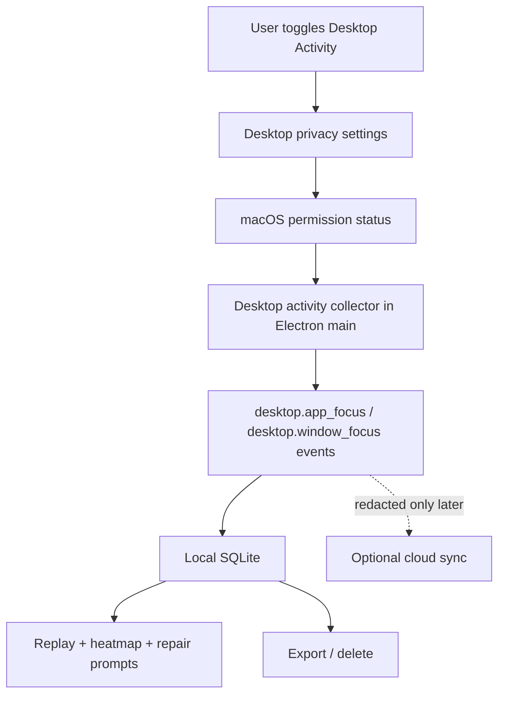
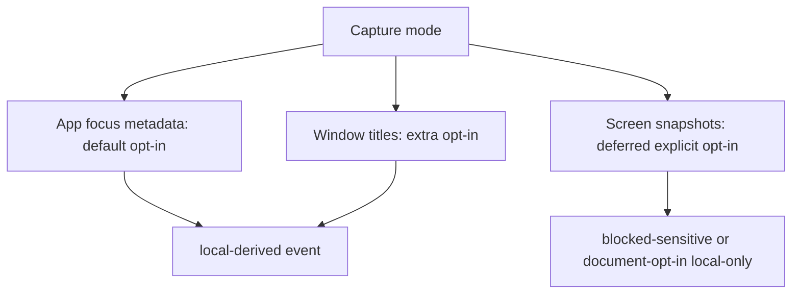

# Inquiry Desktop App Watch - Plan

## Copy/Paste Handoff Prompt

Use this prompt to start a new agent session:

```text
Continue Inquiry Black Box from docs/plans/2026-07-08-004-feat-inquiry-desktop-app-watch-plan.md.

Starting state: PR #306, "feat: wire inquiry model deploy envs", was merged into `main` on July 8, 2026. Start from a fresh `origin/main` pull and verify the model/env wiring files are present before beginning. Do not redo Railway/model env wiring in this desktop activity PR.

Goal: add an explicit opt-in macOS desktop activity lane so Inquiry can watch which desktop app/window I am working in, without raw screenshots by default, and package/install the Electron app into Applications when the packaged app is ready. Preserve the local-first privacy model.

First answer these product-state questions for me in plain language:
- How can I use the app right now?
- Will it help us today?
- Does it currently have an LLM that interprets results?
- Does it ingest and suggest improvements daily?

Then implement the plan in dependency order. Start with foreground app/window metadata and permission UX. Do not add raw screen capture by default. Treat screen snapshots as a later explicit opt-in path with Screen Recording permission and local-only retention. After the packaged app passes smoke, add an install command for Applications so I can open it like a normal macOS app.

Required validation before PR: git diff --check, bun run install:check, bun run lint, bun run typecheck, bun run test, bun run test:e2e, bun run build:prototype, bun run package:desktop, and targeted tests added by the implementation. Always commit, push, and open a PR.
```

---

## Goal Capsule

| Field | Value |
|---|---|
| Objective | Add a privacy-preserving desktop activity lane for macOS app/window context, then make the packaged Electron app easy to install and launch from Applications. |
| Authority | Local-first desktop behavior and privacy model outrank cloud/LLM interpretation. Cross-app capture is opt-in and visible. |
| Stop condition | Desktop activity metadata appears in local session replay/export with tests, raw screenshots remain off by default, packaged app smoke passes, and install-to-Applications workflow is documented and tested. |
| Execution profile | Standard feature plan with macOS permission risk, packaging risk, and cross-surface schema/UI changes. |
| Tail ownership | Daily digest and LLM coaching are follow-up product work. PR #306 supplies deploy/model env readiness, but a separate session-summary flow is still needed before calling this LLM-interpreted in product. |

---

## Current Product Answers

### How can we use the app now?

Use it today for browser-centric research or learning sessions. Run the desktop app, pair the Chrome extension, click Record, work in normal `http` or `https` browser pages, add self-labels, optionally enable camera-derived feature windows, then stop and inspect replay, heatmap, repair prompt, export, and delete.

Canonical local commands live under `apps/inquiry-black-box`:

```bash
bun install
bun run build:prototype
INQUIRY_DESKTOP_DB_PATH=/tmp/inquiry-demo.sqlite bun run dev:desktop
python3 -m http.server 4173 --directory tests/fixtures
```

Then load `apps/inquiry-black-box/apps/extension` as an unpacked Chrome extension and open `http://127.0.0.1:4173/demo-article.html` or a real research page.

### Will it help us today?

Yes, for browser-heavy reading, research, and note-taking. It can surface skim risk, stuck loops, tab churn, copied/highlighted evidence, media rewinds, camera/typing high-load hints, self-labels, and evidence-backed repair prompts. It is most useful when you stop a session and review what happened before deciding what to reread, summarize, or turn into a follow-up note.

It is not yet a full ambient desktop assistant. It cannot currently tell whether you were in Cursor, Terminal, Preview, Slack, Figma, or another desktop app unless that activity happened through the Chrome extension or you manually labeled it.

### Does it currently have an LLM that interprets results?

On `main`, interpretation is still mostly deterministic local heuristics plus optional Modal job plumbing. The cloud `/jobs` route can submit redacted jobs to Modal, and Modal has smoke/calibration jobs, but the product does not yet provide a polished LLM-generated session interpretation in the desktop UI.

PR #306 is merged and added the deploy/model environment wiring, created the Railway `inquiry-black-box` project, deployed the cloud API, and saved provider/model keys. Treat that as infrastructure readiness for serious LLM work. The next LLM unit still needs to build the actual session-summary/report flow rather than assuming env wiring equals product interpretation.

### Does it ingest and suggest improvements daily?

It ingests while a visible session is recording. It stores local SQLite events from the Chrome extension, camera-derived features, labels/probes, repair outcomes, and optional redacted cloud sync.

It does not yet run a daily digest, recurring scheduler, or automatic daily improvement feed. Notifications exist as an opt-in local concept, and repair prompts appear during replay from current-session evidence. Daily suggestions should be planned after the desktop activity lane and LLM session-summary flow are stable.

---

## Product Contract

### Summary

Inquiry should watch desktop activity only after the user opts in. The first shippable version should collect foreground app/window metadata as local-derived events, not screen pixels. A later screen-content path may use ScreenCaptureKit only behind a separate explicit opt-in, system picker/permission UX, and local-only retention.

### Problem Frame

The current product knows a lot about browser sessions but misses context switches into desktop apps. That makes replay incomplete for real work sessions where the user reads in Chrome, edits in Cursor, runs Terminal, reviews PDFs, chats in Slack, and returns to the browser. The missing lane should improve replay and repair prompts without turning the app into hidden surveillance.

### Requirements

**Desktop activity capture**

- R1. Cross-app desktop capture must be off by default and require an explicit visible desktop setting before any activity polling starts.
- R2. The default desktop activity lane must store foreground app metadata and bounded window metadata only, with raw screenshots, screen recordings, raw document text, and raw keystrokes excluded.
- R3. The activity lane must emit schema-validated local events that participate in replay, export, delete, and privacy controls like existing browser/camera events.
- R4. The app must keep recording indicators, pause, stop, export, and delete behavior authoritative in the desktop app.

**macOS permissions and privacy**

- R5. The UI must show macOS permission status for app/window metadata and explain what is captured before requesting access.
- R6. Window titles must be separately suppressible because they can reveal document names, private chats, filenames, and meeting names.
- R7. Screen capture or screenshot-derived features must be a separate later opt-in and must never be required for app-focus metadata.
- R8. Any screen-content path must use macOS Screen Recording/ScreenCaptureKit permission patterns and remain local-only unless a later explicit share/export flow is designed.

**Replay and usefulness**

- R9. Replay should show desktop app context alongside browser markers so the user can see attention flow across Chrome and non-browser apps.
- R10. The signal layer should generate conservative desktop-context markers such as app churn, long off-browser focus, return-to-browser loops, or deep-work spans.
- R11. Repair prompts should remain evidence-backed and action-oriented, not diagnostic claims about cognition.
- R12. Daily digest or LLM coaching is out of scope for this first desktop activity lane, but the event shape should support later daily summaries.

**Packaging and launch**

- R13. The packaged Electron app should be installable into an Applications folder only after packaged smoke passes.
- R14. The install workflow must avoid surprising overwrites and should default to the user Applications folder unless the user explicitly chooses system `/Applications`.

### Acceptance Examples

- AE1. Given desktop activity is disabled, when a session records while the user switches between Cursor, Terminal, and Chrome, then no desktop app/window events are stored.
- AE2. Given desktop activity is enabled and window titles are disabled, when the user switches between Cursor, Terminal, and Chrome, then replay shows app names/bundle IDs and timing but no window title strings.
- AE3. Given desktop activity and window titles are enabled with required permission granted, when the user switches windows, then replay shows bounded title metadata and export/delete handle those events with local-derived retention.
- AE4. Given screen snapshots are not enabled, when the user records a session, then no screenshot, image blob, frame, or screen text payload can be stored or synced.
- AE5. Given the packaged app has passed smoke, when the user runs the install command, then `Inquiry Black Box.app` is copied into an Applications folder with overwrite confirmation and can launch outside the repo.

### Scope Boundaries

#### In Scope

- macOS foreground app/window metadata lane.
- Desktop privacy settings and permission status UI.
- Schema, SQLite, replay, signals, export/delete, and tests for desktop activity events.
- Packaged app install command for `~/Applications` and optional `/Applications`.
- Handoff notes explaining current app usefulness, LLM status, and daily suggestion status.

#### Deferred to Follow-Up Work

- Daily digest, morning/evening review, recurring insight scheduler, or automated improvement feed.
- Full LLM session-summary UI, unless a separate implementation unit is explicitly pulled into scope.
- Persistent raw screen recording, raw screenshots, OCR, or screenshot text extraction.
- Native messaging host for desktop-extension communication.
- Chrome Web Store publication and notarized public distribution.

#### Outside This Product's Identity

- Hidden background surveillance after the user stops or pauses recording.
- Raw keystroke capture or raw typed text capture.
- Silent cloud upload of local-only desktop app/window activity.
- Diagnostic claims about mental state from app focus, camera, browser, or LLM outputs.

---

## Planning Contract

### Key Technical Decisions

- KTD1. Start with foreground app/window metadata, not screenshots. App focus timing answers the first product question with much lower privacy risk than pixels. ScreenCaptureKit can come later for explicit screen-content work.
- KTD2. Add desktop activity as first-class schema events. Reusing opaque debug payloads would make privacy eligibility, export, replay, and cloud rejection brittle.
- KTD3. Gate window titles separately from app identity. App name and bundle ID are useful and usually low risk; window titles can expose private content.
- KTD4. Keep capture in the Electron main process. The desktop main process already owns SQLite, sessions, ingest, pairing, export/delete, and camera feature appends, so desktop app activity belongs there rather than in the Chrome extension.
- KTD5. Treat macOS permission state as product state. The UI should show `not_requested`, `granted`, `denied`, and `unavailable` states, not fail silently.
- KTD6. Make install-to-Applications an explicit package/install step. Moving the app before package smoke creates confusing permission identities and can reset macOS privacy prompts.

### High-Level Technical Design





### Current Patterns to Follow

- `apps/inquiry-black-box/apps/desktop/src/main/main.ts` owns local runtime lifecycle and currently appends camera feature windows through the desktop bridge.
- `apps/inquiry-black-box/apps/desktop/src/main/ipc.ts` exposes typed IPC actions for replay, privacy settings, export/delete, and repair prompts.
- `apps/inquiry-black-box/packages/schema/src/events.ts` is the canonical event source/type registry and validation boundary.
- `apps/inquiry-black-box/packages/schema/src/privacy.ts` owns privacy-class sync/export/job eligibility.
- `apps/inquiry-black-box/packages/signals/src/heuristics.ts` builds replay markers from windows of events.
- `apps/inquiry-black-box/apps/desktop/scripts/package-desktop.ts` creates the unsigned macOS app bundle at `apps/desktop/release/mac/Inquiry Black Box.app`.
- `apps/inquiry-black-box/docs/prototype-demo.md` is the canonical manual dogfood and demo runbook.

### Sources and Research

- Apple ScreenCaptureKit documentation says ScreenCaptureKit streams desktop content such as displays, apps, and windows, and Apple’s WWDC material emphasizes system UI/picker and privacy safeguards for screen sharing. Use this only for the deferred screen-content path.
- Apple `AXIsProcessTrustedWithOptions` documentation says it checks whether the current process is a trusted accessibility client and that prompting is asynchronous. Use this for the window-title/accessibility permission path.
- Apple protected-resource documentation notes macOS prompts include usage-description strings explaining why protected access is needed. Add the relevant Info.plist strings before requesting protected resources.
- Apple developer forum guidance around screen capture permission persistence notes that macOS ties screen-capture permission to app identity/signing. Package/install smoke should account for permission reset behavior when app identity changes.

---

## Implementation Units

### U1. Desktop Activity Schema and Privacy Contract

- **Goal:** Add event types and privacy rules for desktop app/window activity.
- **Requirements:** R1, R2, R3, R4, R6, R8, AE1, AE2, AE3, AE4
- **Dependencies:** None
- **Files:** `apps/inquiry-black-box/packages/schema/src/events.ts`, `apps/inquiry-black-box/packages/schema/src/privacy.ts`, `apps/inquiry-black-box/packages/schema/tests/events.test.ts`, `apps/inquiry-black-box/apps/desktop/tests/privacy.test.ts`
- **Approach:** Add a new event source if needed, likely `desktop-activity`, and event types such as `desktop.app_focus`, `desktop.window_focus`, and a reserved local-only `desktop.screen_capture_features` only if a derived screen feature scaffold is needed. Define payload shapes that include app name, bundle ID, process ID hash if useful, focus start/end timing, optional bounded window title, and permission/source metadata. Reject `screenshot`, `image`, `frame`, `ocr_text`, `document_text`, and similar raw fields through the existing sensitive-field guard.
- **Execution note:** Start with schema tests before wiring collectors.
- **Patterns to follow:** Existing `camera.feature_window`, `browser.tab`, and selected-text privacy tests.
- **Test scenarios:** Creating a `desktop.app_focus` event with app name and bundle ID validates as `local-derived`. Creating a `desktop.window_focus` event without title validates when titles are disabled. Creating a window event with a bounded title validates only under the selected privacy class. Payloads containing screenshot/image/OCR/raw text aliases are rejected. Cloud/job eligibility rejects desktop activity unless explicitly redacted by a later flow.
- **Verification:** Schema tests prove valid metadata events and raw screen/text rejection.

### U2. macOS Permission and Activity Collector

- **Goal:** Collect foreground app/window metadata only while a session is recording and desktop activity is enabled.
- **Requirements:** R1, R2, R4, R5, R6, AE1, AE2, AE3
- **Dependencies:** U1
- **Files:** `apps/inquiry-black-box/apps/desktop/src/main/activity/desktopActivity.ts`, `apps/inquiry-black-box/apps/desktop/src/main/activity/macosActivityProvider.ts`, `apps/inquiry-black-box/apps/desktop/src/main/main.ts`, `apps/inquiry-black-box/apps/desktop/src/main/ipc.ts`, `apps/inquiry-black-box/apps/desktop/tests/desktop-activity.test.ts`
- **Approach:** Add a provider interface that can be mocked in tests. The macOS provider should report foreground app identity first and optional window title only when the user enables title capture and permission is granted. Prefer a native macOS helper path for reliable app identity; use Accessibility only for focused window/title metadata. Poll at a modest interval such as 1-2 seconds, coalesce unchanged focus spans, and append events on app/window changes or session stop.
- **Execution note:** Keep runtime behavior testable by injecting the provider and fake clock.
- **Patterns to follow:** `appendCameraFeatureWindow`, session recording-state checks, `createDesktopRuntime` option injection, and ingest/session tests.
- **Test scenarios:** With desktop activity disabled, provider polls do not start and no events are appended. With activity enabled and recording, app switches append focus events with monotonic timing. Pausing/stopping stops polling and closes the current focus span. Permission denied yields a visible status and no metadata. Window titles disabled omits title fields even if provider returns them.
- **Verification:** Unit tests prove gating, coalescing, and stop/pause behavior without touching real macOS APIs.

### U3. Desktop Permission and Privacy UI

- **Goal:** Give the user clear controls for desktop activity, window titles, and future screen capture.
- **Requirements:** R1, R5, R6, R7, R8, AE1, AE2, AE3, AE4
- **Dependencies:** U1, U2
- **Files:** `apps/inquiry-black-box/apps/desktop/src/renderer/settings/PrivacySettings.tsx`, `apps/inquiry-black-box/apps/desktop/src/renderer/App.tsx`, `apps/inquiry-black-box/apps/desktop/src/main/ipc.ts`, `apps/inquiry-black-box/apps/desktop/tests/privacy.test.ts`, `apps/inquiry-black-box/apps/desktop/tests/desktop-shell.test.ts`
- **Approach:** Extend signal settings with `desktopActivity`, `desktopWindowTitles`, and a disabled/deferred `screenSnapshots` affordance only if the UI can make the deferral clear. Show permission status, last activity heartbeat, and exact local-only capture scope. Do not use in-app text to over-explain every feature, but do make the toggles and statuses unambiguous.
- **Execution note:** Prefer feature-complete toggle/status behavior over starting the collector from hidden state.
- **Patterns to follow:** Current camera and privacy settings panels.
- **Test scenarios:** Fresh settings default all desktop activity toggles off. Enabling app activity does not enable window titles. Denied permission displays a blocked status and leaves collection inactive. Export/delete availability remains unchanged. Toggling desktop activity while recording starts/stops collector behavior through the main bridge.
- **Verification:** Renderer and IPC tests prove visible opt-in and status behavior.

### U4. Replay Markers for Cross-App Context

- **Goal:** Make desktop activity useful in replay and repair prompts.
- **Requirements:** R9, R10, R11, R12
- **Dependencies:** U1, U2
- **Files:** `apps/inquiry-black-box/packages/signals/src/heuristics.ts`, `apps/inquiry-black-box/packages/signals/src/windows.ts`, `apps/inquiry-black-box/packages/signals/tests/heuristics.test.ts`, `apps/inquiry-black-box/apps/desktop/src/renderer/replay/ReplayTimeline.tsx`, `apps/inquiry-black-box/apps/desktop/tests/replay.test.ts`
- **Approach:** Add conservative markers such as `app-churn`, `off-browser-focus`, and `deep-work-span` if the evidence is strong enough. Suggested actions should be practical: choose which branch to close, promote a follow-up note, or summarize what happened in the non-browser work block. Avoid claims that app switching means distraction.
- **Execution note:** Use fixture event sequences to prove the markers before tuning thresholds.
- **Patterns to follow:** Existing `tab-churn`, `stuck-loop`, and repair candidate flow.
- **Test scenarios:** Frequent app switching within a window creates one app-churn marker with focus-event evidence. Long Cursor/Terminal focus after browser research creates a deep-work marker rather than a distraction marker. Window title absence still renders useful app-level evidence. Desktop markers feed repair candidates only when they have evidence event IDs.
- **Verification:** Signal and replay tests show desktop app context beside existing browser/camera markers.

### U5. Deferred ScreenCaptureKit Scaffold and Guardrails

- **Goal:** Prepare for optional screen-content features without shipping raw screenshots by default.
- **Requirements:** R7, R8, AE4
- **Dependencies:** U1, U3
- **Files:** `apps/inquiry-black-box/docs/privacy-model.md`, `apps/inquiry-black-box/docs/deployment.md`, `apps/inquiry-black-box/apps/desktop/packaging/mac/entitlements.plist`, `apps/inquiry-black-box/apps/desktop/tests/packaging.test.ts`
- **Approach:** Document the future ScreenCaptureKit path and add only the minimum packaging/privacy metadata needed if the implementation touches protected resources. Do not implement screenshot storage in this unit. If a placeholder event type exists, tests must prove raw image/text aliases are rejected and cloud sync remains ineligible.
- **Execution note:** Treat this as guardrail/documentation unless the user explicitly expands scope to screenshots.
- **Patterns to follow:** Current camera entitlement and privacy-model wording.
- **Test scenarios:** Packaging metadata includes only justified protected-resource strings. Privacy docs state screen snapshots are off by default and local-only if ever enabled. Schema tests reject raw screen payloads.
- **Verification:** No product path can store raw screen images after this unit.

### U6. Applications Install Workflow

- **Goal:** Make the packaged Electron app easy to open from Applications after smoke passes.
- **Requirements:** R13, R14, AE5
- **Dependencies:** U2, U3, U4
- **Files:** `apps/inquiry-black-box/package.json`, `apps/inquiry-black-box/apps/desktop/scripts/install-desktop.ts`, `apps/inquiry-black-box/apps/desktop/tests/packaging.test.ts`, `apps/inquiry-black-box/docs/deployment.md`, `apps/inquiry-black-box/docs/prototype-demo.md`
- **Approach:** Add an install script that runs after `bun run package:desktop`. Default to `~/Applications/Inquiry Black Box.app` to avoid sudo and destructive system writes. Support an explicit `--target system` mode for `/Applications/Inquiry Black Box.app` with overwrite confirmation. Use `ditto` or a safe recursive copy, remove only the destination app bundle after confirmation, and print the installed path. Do not auto-launch if that would hide permission reset behavior; document a manual `open` smoke.
- **Execution note:** This is packaging/config; prefer install/runtime smoke verification over unit-only proof.
- **Patterns to follow:** Existing `package-desktop.ts` and packaging tests.
- **Test scenarios:** Install script refuses to run when the packaged `.app` is missing. Default target resolves to user Applications. Existing destination requires explicit overwrite. System target requires explicit flag. Packaging tests assert script registration and package path.
- **Verification:** `bun run package:desktop`, install to a test destination, launch manually, pair extension, record/stop/replay/export/delete.

---

## Verification Contract

| Gate | Applies To | Expected Result |
|---|---|---|
| `git diff --check` | All units | No whitespace errors. |
| `bun run install:check` | All units | Lockfile and workspace installs unchanged unless intentionally updated. |
| `bun run lint` | All units | Privacy lint passes with no raw key/frame/text regressions. |
| `bun run typecheck` | All TypeScript units | Workspace TypeScript builds. |
| `bun run test` | U1-U6 | Unit suites pass, including new schema/activity/replay/packaging tests. |
| `bun run test:e2e` | U2-U4 | Existing desktop-extension pairing and fixture loop still work. |
| `bun run build:prototype` | U3-U6 | Desktop and extension builds still succeed. |
| `bun run package:desktop` | U5-U6 | Packaged app is produced at `apps/desktop/release/mac/Inquiry Black Box.app`. |
| Manual packaged smoke | U2-U6 | Installed app launches, shows pairing token, records a browser+desktop session, replays desktop context, exports, deletes, quits, and relaunches. |

---

## Definition of Done

- Desktop activity is disabled by default and cannot run invisibly.
- App/window metadata events are schema-valid, local-first, exportable, deletable, and cloud-ineligible unless later redacted.
- Window titles are separately gated and can be disabled while app focus remains useful.
- Raw screenshots, screen recordings, OCR text, document text, and raw keystrokes remain rejected by default.
- Replay shows desktop app context with evidence-backed suggested actions.
- Packaging produces an unsigned local app bundle and an explicit install command can place it in an Applications folder after smoke.
- Docs answer the current-use, LLM, ingestion, daily suggestion, and desktop-watch questions honestly.
- Validation gates in the Verification Contract pass before PR.

---

## Appendix

### PR #306 Context

PR #306 is merged as of July 8, 2026 and is the model/deploy-env prerequisite created before this plan. It added sanitized Modal model environment provenance, a Railway env sync helper, a root Railway config, Node 22 for Nixpacks, and a deployed Railway project/service at `https://inquiry-black-box-api-production.up.railway.app`.

The desktop activity PR should start from `origin/main` with those files present. Do not redo that Railway/model env work; only touch model interpretation if a new session-summary unit is explicitly added.

### LLM and Daily Suggestions Follow-Up

After desktop activity is in place, a separate plan should add a session-summary/daily-digest loop:

- Generate a local deterministic daily rollup from session reports.
- Submit only `redacted-sync` summaries to Modal/LLM when the user opts in.
- Store generated report provenance as `model.run` and `report.generated`.
- Show a daily review panel with "what helped", "what fragmented", "what to retry", and "what to ignore".
- Require user ratings before treating suggestions as useful.

This is intentionally not part of the first cross-app capture PR.
