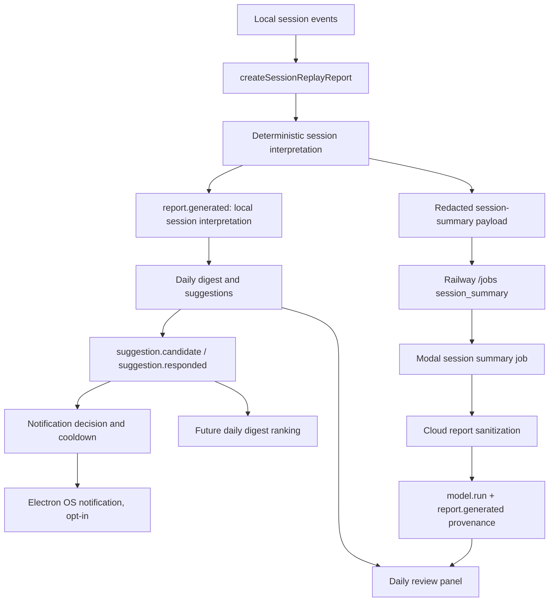
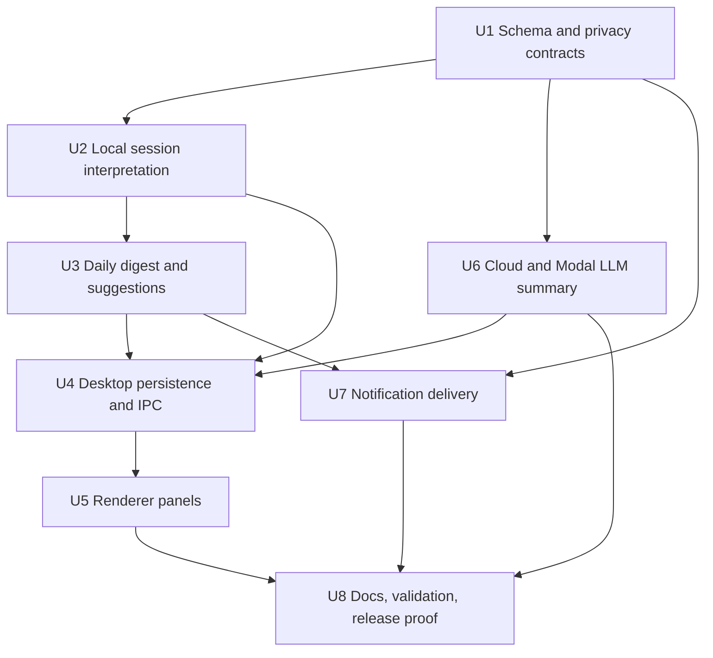

# Inquiry LLM Session Interpretation And Daily Suggestions - Plan

## Goal Capsule

| Field | Value |
|---|---|
| Objective | Turn Inquiry replay data into useful session interpretations, daily suggestions, opt-in checkup notifications, and user-confirmed care/refocus signals without weakening the local-first privacy model. |
| Authority | Local deterministic summaries are the product baseline. LLM enrichment is optional, redacted, provenance-tracked, and never required for replay or daily review. |
| Stop condition | Desktop can generate a useful session interpretation and daily review from local events, optionally enrich a redacted session summary through cloud/Modal, show actionable suggestions with feedback controls, and deliver opt-in checkups through quiet-hours/cooldown logic. |
| Execution profile | Deep cross-surface feature: shared schema, signal builders, Electron main/renderer, optional Railway/Modal job flow, notifications, privacy/export/delete/docs, and validation gates. |
| Tail ownership | Personalized claims remain gated by user ratings and research-validation baselines; do not market this as mind reading, diagnosis, or an always-on desktop monitor. |

---

## Product Contract

### Summary

Inquiry already captures and replays useful browser, camera-derived, desktop-activity, label, probe, repair, and notification evidence during explicit sessions.
The missing value layer is an interpretation loop: explain what happened, identify what helped or fragmented the session, recommend what to do next, and learn only from the user's explicit responses.

This plan covers any visible Inquiry session, not just formal research.
Browser research, web search, coding while referencing pages, note-taking, paper reading, and mixed desktop/browser sessions should all produce the same kind of daily review when the evidence exists.

### Problem Frame

Replay currently shows markers and repair prompts, but the user still has to assemble the "so what?" themselves.
The product should convert replay evidence into an inspectable answer to "what should I do next?" while preserving the core boundary: derived local signals by default, no hidden background surveillance, no raw typed text, no raw screenshots, no routine raw document upload, and no claims stronger than the evidence supports.

LLMs can make the summary easier to read, but they must not become the source of truth.
The deterministic local interpretation must be useful on a laptop with no cloud credentials, and every model-generated artifact must cite its input class, model/provider, limitations, and report lineage.

### Requirements

**Session interpretation**

- R1. The desktop app must generate a local session interpretation from an existing replay report, repair candidates, repair outcomes, labels, probes, and session metadata.
- R2. A session interpretation must include a short summary, evidence-backed themes, next actions, open loops, limitations, and provenance back to marker/report/event ids.
- R3. Interpretation copy must stay probabilistic and action-oriented: "evidence suggests", "try next", "needs confirmation", not "you were distracted" or "you care about X" as fact.
- R4. Interpretation must work for browser research, web search, mixed desktop/browser work, and explicitly titled user sessions without hardcoding "research paper" as the only session type.

**Daily suggestions**

- R5. The app must generate a local daily review from that day's session interpretations and outcomes.
- R6. The daily review must group output into "what helped", "what fragmented", "what to retry", "what to ignore", "open loops", and "care candidates to confirm".
- R7. Daily suggestions must be actionable, bounded, and backed by local evidence ids or report ids.
- R8. Suggestions must support accept, snooze, dismiss, rate useful, and rate not useful responses so the product can learn from explicit feedback.

**Optional LLM enrichment**

- R9. LLM enrichment must be opt-in and run only on a redacted session-summary payload unless a separate future document-opt-in flow is designed.
- R10. LLM inputs must exclude raw typed text, raw selected text, raw page text, screenshots, OCR text, desktop activity events, app names, and window titles.
- R11. LLM outputs must be validated against a structured report contract, sanitized by cloud report routes, and stored with `model.run` and `report.generated` provenance.
- R12. Local deterministic interpretation must remain available when cloud sync, Modal, or model-provider credentials are unavailable.

**Checkups and notifications**

- R13. Checkup notifications must be off by default, opt-in, inspectable, quiet-hours aware, snoozable, and cooldown-limited.
- R14. Notifications must be event-driven from markers, daily review readiness, or user-requested reminders; do not add an always-on background daemon or periodic nag loop in this plan.
- R15. Notification responses must flow back into the same suggestion/outcome data used by daily reviews.

**Care/refocus model**

- R16. "What I care about" must start as local care candidates inferred from repeated accepted suggestions, labels, copied evidence, session titles, and explicit confirmations.
- R17. Care candidates must require user confirmation before the UI treats them as durable preferences.
- R18. Refocus advice must explain its evidence and offer concrete next actions, not hidden scoring or personality profiling.

**Privacy, lifecycle, and validation**

- R19. Generated interpretations, reports, suggestions, notification outcomes, and model provenance must export and delete with the session/day they describe.
- R20. Cloud sync and Modal jobs must continue rejecting privacy-ineligible payloads and sensitive fields.
- R21. Validation must extend the existing G0-G4 posture: usefulness is measured through user ratings, repair outcomes, and recall/probe evidence, not model eloquence.

### Acceptance Examples

- AE1. Given a browser search session with tab churn, copied evidence metrics, and a dismissed repair, when the user opens the session interpretation, then it summarizes the search pattern, names the copied-evidence open loop, recommends one next action, and includes limitations without raw selected text.
- AE2. Given a mixed Chrome, Cursor, and Terminal session with desktop activity enabled, when the daily review is generated, then local UI may reference app context, but the optional LLM payload contains only redacted counts/categories and excludes app names, bundle ids, window titles, and desktop events.
- AE3. Given cloud/model settings are disabled, when the user stops a session, then deterministic interpretation and daily review still appear without submitting a job.
- AE4. Given LLM enrichment is enabled and a redacted payload passes privacy checks, when Modal returns a session-summary report, then the desktop stores a `model.run` event and a `report.generated` event with provider/model/provenance/limitations and displays the enriched text as secondary to local evidence.
- AE5. Given notifications are disabled, when a daily review has suggestions, then no OS notification is delivered and the suggestions remain visible in the app.
- AE6. Given notifications are enabled but quiet hours apply or cooldown is active, when a checkup candidate is produced, then it is suppressed with an inspectable reason and no delivery event is recorded.
- AE7. Given a user dismisses a repeated suggestion twice and rates it not useful, when the next daily review is generated, then that pattern appears under "what to ignore" or is deprioritized rather than repeated.
- AE8. Given the app infers a recurring theme from accepted suggestions and labels, when it appears in the daily review, then it is shown as a care candidate to confirm, not as a settled claim about the user.

### Scope Boundaries

#### In Scope

- Session interpretation generated from replay reports and local evidence.
- Daily review and suggestion generation from local sessions and outcomes.
- Optional redacted LLM session-summary job path using existing cloud/Modal scaffolding.
- Desktop UI panels for session interpretation, daily review, suggestion feedback, and model provenance.
- Opt-in OS notification delivery for checkup candidates while the desktop app is running.
- Privacy/export/delete/report-sanitization coverage for generated artifacts.
- Docs and validation updates that explain current LLM/daily suggestion behavior honestly.

#### Deferred to Follow-Up Work

- Raw document-text or selected-text LLM interpretation beyond redacted summaries.
- Raw screenshots, OCR, video/audio interpretation, or screen-content model input.
- Always-on background monitoring when the desktop app is closed.
- Calendar/email/Slack integrations, task manager writes, or cross-device reminders.
- Learned personalized ranking that claims predictive power before enough user-rated outcomes exist.
- Public distribution, notarization, or Chrome Web Store publication.

#### Outside This Product's Identity

- Hidden workplace surveillance.
- Medical, diagnostic, lie-detection, or mental-state certainty claims.
- Sending raw desktop usage, raw typed text, raw selected text, screenshots, OCR, or raw page content to cloud analysis by default.
- Treating LLM narration as evidence when local event/probe/feedback evidence disagrees.

---

## Planning Contract

### Assumptions

- The prior icon and desktop-activity work is merged to `main`; this work starts from fresh `origin/main`.
- The first useful version should favor deterministic local interpretation plus optional LLM enrichment, not an LLM-only feature.
- It is acceptable to add new schema event types for suggestion candidates/responses if they are the cleanest way to avoid overloading repair or notification events.
- The desktop renderer should stay in the existing dependency-light DOM style rather than introducing React for these panels.
- Cloud/Modal implementation should run in tests with stubs and fixtures; CI must not require live model-provider credentials.

### Key Technical Decisions

- KTD1. Build deterministic interpretation in `packages/signals` first. Shared pure builders keep desktop, tests, and future validation on the same evidence model and make the product useful offline.
- KTD2. Use existing `report.generated` and `model.run` for generated report/model provenance, and add suggestion-specific events only for daily/refocus candidates and user responses. Repair events are segment-specific and notification events are delivery-specific; daily suggestions need their own feedback lifecycle.
- KTD3. Store generated artifacts as event-log records before adding new tables. The existing SQLite event log already exports, deletes, and orders session-local artifacts; new tables should be deferred unless query performance or day-level caching makes them necessary during implementation.
- KTD4. Treat LLM output as enrichment, not authority. The local interpretation creates evidence references and privacy-safe summaries; the model may improve wording or prioritization only within a structured schema and with explicit limitations.
- KTD5. Redact desktop context before cloud. Local interpretation can reference app names when the user opted into desktop activity, but cloud/Modal payloads must collapse desktop evidence to marker kinds, durations, counts, and coarse categories.
- KTD6. Make daily suggestions feedback-driven. Accepted, snoozed, dismissed, and rated responses become the first data for "what to ignore", "what to retry", and care candidates; do not infer durable preferences without confirmation.
- KTD7. Deliver notifications from the Electron main process with an injectable notifier. Keep `notificationManager.ts` pure and testable, and isolate Electron `Notification` usage behind a small adapter.
- KTD8. Keep scheduled behavior app-local. Generate daily review on session stop, app start, and explicit refresh; deliver at most one daily review notification per local day while the app is running.

### High-Level Technical Design

### Parallelization Plan

| Workstream | Can start after | Owns | Do not edit in parallel |
|---|---|---|---|
| Schema/privacy owner | Start first | Event types, payload validation, privacy matrix/tests, shared fixtures | Any downstream files depending on event names until U1 lands |
| Signals owner | U1 payload/event decisions | `packages/signals` interpretation and daily digest builders | Desktop IPC/UI integration files |
| Desktop main owner | U2 and U3 initial builders | SQLite event persistence helpers, IPC facade, preload bridge | Renderer components until IPC shapes are stable |
| Renderer owner | U1 types and mocked fixture shapes | Session interpretation panel, daily review panel, feedback controls | Main-process persistence logic |
| Cloud/Modal owner | U1 redacted payload contract | Railway job validation, Modal session summary, Python tests | Desktop UI and Electron notification code |
| Notification owner | U1 suggestion response contract and U3 candidate shape | Pure scheduling/decision logic plus Electron notifier adapter | Daily digest ranking logic |

Serial integration points:

- U1 must land before any stream adds event names or payloads.
- U4 is the integration point for U2, U3, and U6 desktop-facing artifacts.
- U5 should use mocked fixtures early, then rewire to U4 IPC once stable.
- U8 happens last and should remove abandoned scaffolding before PR.

### Coding Constraints

- Keep TypeScript package boundaries: shared evidence logic in `packages/signals`, schema/privacy in `packages/schema`, Electron storage/IPC in `apps/desktop/src/main`, DOM rendering in `apps/desktop/src/renderer`, cloud orchestration in `apps/cloud`, Python batch work in `modal`.
- Do not introduce a frontend framework migration.
- Do not add provider SDKs to the desktop app. Model calls belong in Modal or a server-side job surface, with desktop receiving sanitized reports.
- Keep tests fixture-based. No CI test should require Chrome automation, macOS notification permissions, Railway, Modal, Doppler, or real LLM credentials.
- Do not store daily suggestions in localStorage. Persist through schema-validated events so export/delete/provenance stay coherent.
- Do not add raw app names or window titles to cloud payloads. Local display may show them only when desktop activity/window-title settings already allowed capture.

---

## Implementation Units

### U1. Schema And Privacy Contracts

- **Goal:** Define the report/suggestion contracts before any implementation stream consumes them.
- **Requirements:** R2, R8, R10, R11, R19, R20.
- **Dependencies:** None. This is the serial gate.
- **Files:**
  - `apps/inquiry-black-box/packages/schema/src/events.ts`
  - `apps/inquiry-black-box/packages/schema/src/privacy.ts`
  - `apps/inquiry-black-box/packages/schema/src/index.ts`
  - `apps/inquiry-black-box/packages/schema/tests/events.test.ts`
  - `apps/inquiry-black-box/apps/cloud/tests/sync.test.ts`
- **Approach:** Add typed payloads for session interpretation reports, daily digest reports, suggestion candidates, suggestion responses, and model-run/report provenance if the current generic `JsonObject` shape is too loose. Keep `report.generated` and `model.run` as the report/model artifact events. Add `suggestion.candidate` and `suggestion.responded` event types unless implementation finds an existing event type that can represent daily suggestions without semantic overload. Ensure generated reports are `local-derived` by default and redacted model reports are `redacted-sync` only after the payload builder has stripped sensitive fields.
- **Patterns to follow:** Existing `RepairCandidatePayload`, `RepairOutcomePayload`, desktop activity title gating, and privacy matrix tests.
- **Test scenarios:**
  - Happy path: a `report.generated` event with local interpretation metadata validates, exports locally, and includes limitations/provenance.
  - Happy path: a `suggestion.candidate` event validates with evidence ids, report ids, confidence, limitation, and a local-derived privacy class.
  - Happy path: a `suggestion.responded` event validates accepted, snoozed, dismissed, rated-useful, and rated-not-useful responses.
  - Edge case: a suggestion without evidence ids or report ids is rejected unless it is explicitly marked as a low-confidence review reminder.
  - Error path: payloads containing raw typed text, selected text, raw page content, screenshots, OCR text, raw keys, app names in cloud redacted payloads, or window titles are rejected for Modal/session-summary surfaces.
  - Integration: cloud job tests continue rejecting desktop activity and window-title Modal inputs after the new report/suggestion types are added.
- **Verification:** Schema package tests show the new artifacts validate locally and fail closed for sensitive fields.

### U2. Local Session Interpretation Builder

- **Goal:** Convert replay reports into local, deterministic session interpretations that answer "what happened?" and "what should I do next?".
- **Requirements:** R1, R2, R3, R4, R12, R18.
- **Dependencies:** U1.
- **Files:**
  - `apps/inquiry-black-box/packages/signals/src/interpretation.ts`
  - `apps/inquiry-black-box/packages/signals/src/index.ts`
  - `apps/inquiry-black-box/packages/signals/tests/interpretation.test.ts`
  - `apps/inquiry-black-box/apps/desktop/src/main/reports/sessionReplay.ts`
  - `apps/inquiry-black-box/apps/desktop/tests/replay.test.ts`
- **Approach:** Add a pure `buildSessionInterpretation`-style builder that consumes `ReplayMemo`, repair candidates, repair/probe outcomes, session metadata, and optional model report text. It should rank the top evidence-backed themes, produce a compact local summary, preserve next actions, name open loops, and carry limitations from replay. Keep raw event payload inspection shallow: use marker kinds, evidence ids, durations, counts, labels, and outcome categories rather than scraping raw text.
- **Execution note:** Implement the builder test-first with fixture events for web search, copied evidence, desktop focus, and repair feedback before wiring it into desktop main.
- **Patterns to follow:** `buildReplayMemo`, `buildRepairCandidates`, `buildEvidenceEpisodes`, and replay limitation copy.
- **Test scenarios:**
  - Happy path: a skim-risk plus copied-evidence session produces a summary, one recall/follow-up next action, evidence ids, and a limitation about raw selected text not being stored.
  - Happy path: a mixed desktop/browser session includes local desktop context in the local interpretation while marking it local-only.
  - Happy path: repair outcomes alter the interpretation by moving accepted repairs into "helped" evidence and dismissed repairs into retry/ignore evidence.
  - Edge case: an empty or marker-free session returns a low-confidence interpretation with "collect more evidence" rather than throwing.
  - Edge case: a web-search-like session with search typing metrics and tab churn is interpreted as search/research navigation without requiring stimulus text.
  - Error path: an event containing blocked sensitive payload fields cannot be interpreted because schema validation rejects it before the builder receives it.
- **Verification:** `packages/signals` exports the builder, desktop replay report can include its output, and tests prove output remains evidence-linked and privacy-aware.

### U3. Daily Digest And Suggestion Engine

- **Goal:** Aggregate session interpretations and outcomes into a daily review with ranked suggestions and care candidates.
- **Requirements:** R5, R6, R7, R8, R16, R17, R21.
- **Dependencies:** U1, U2.
- **Files:**
  - `apps/inquiry-black-box/packages/signals/src/daily.ts`
  - `apps/inquiry-black-box/packages/signals/src/index.ts`
  - `apps/inquiry-black-box/packages/signals/tests/daily.test.ts`
  - `apps/inquiry-black-box/apps/desktop/tests/replay.test.ts`
- **Approach:** Add a pure daily builder that accepts session interpretations, suggestion responses, repair outcomes, notification outcomes, and local date boundaries. It should produce the daily categories from R6, deduplicate repeated suggestions, deprioritize suggestions the user dismissed or rated not useful, and surface care candidates as "confirm this?" items. Keep ranking simple and inspectable: confidence, recency, accepted/rated outcomes, and evidence count are enough for the first version.
- **Execution note:** Keep daily aggregation deterministic. If an LLM report exists, treat it as one input with provenance, not as a replacement for local scoring.
- **Patterns to follow:** Existing replay marker ranking, repair candidate max-candidate behavior, notification cooldown decision shape.
- **Test scenarios:**
  - Happy path: two sessions on the same local day produce one daily review with helped, fragmented, retry, ignore, open loop, and care-candidate sections.
  - Happy path: an accepted/rated-useful suggestion increases priority for a similar next-day suggestion only when evidence recurs.
  - Happy path: repeated dismissals move a suggestion pattern to "what to ignore" and stop it from appearing as a top action.
  - Edge case: sessions across midnight use local timezone boundaries and do not mix days.
  - Edge case: a day with no sessions returns an empty state suitable for UI.
  - Error path: malformed suggestion response ids are ignored with a limitation rather than corrupting the digest.
- **Verification:** Daily digest fixtures produce stable, inspectable output without LLM credentials or desktop runtime.

### U4. Desktop Persistence, IPC, And Local Report Lifecycle

- **Goal:** Persist generated interpretations/suggestions and expose them to renderer through typed Electron IPC.
- **Requirements:** R1, R5, R8, R12, R15, R19.
- **Dependencies:** U1, U2, U3. U6 can integrate later through the same report lifecycle.
- **Files:**
  - `apps/inquiry-black-box/apps/desktop/src/main/db/index.ts`
  - `apps/inquiry-black-box/apps/desktop/src/main/reports/sessionInterpretation.ts`
  - `apps/inquiry-black-box/apps/desktop/src/main/reports/dailyDigest.ts`
  - `apps/inquiry-black-box/apps/desktop/src/main/ipc.ts`
  - `apps/inquiry-black-box/apps/desktop/src/main/electron.ts`
  - `apps/inquiry-black-box/apps/desktop/src/main/preload.ts`
  - `apps/inquiry-black-box/apps/desktop/tests/db.test.ts`
  - `apps/inquiry-black-box/apps/desktop/tests/desktop-shell.test.ts`
  - `apps/inquiry-black-box/apps/desktop/tests/privacy.test.ts`
- **Approach:** Add main-process helpers that build session interpretations on session stop and on explicit refresh, append `report.generated` events idempotently, build daily digest events for a local day, and append suggestion candidate/response events. Add IPC methods for current session interpretation, current daily review, refresh daily review, and respond to suggestion. Prefer event-log storage and query helpers over a new table. If implementation discovers day-level querying is too awkward, add a minimal indexed table only for cached daily report ids, not for raw report payloads.
- **Execution note:** Make event ids deterministic where reruns should be idempotent, such as a report for a given session/replay version or a daily digest for a local date.
- **Patterns to follow:** `replayReport`, `acceptRepair`, `answerRepair`, `dismissRepair`, `appendEventIfNew`, export/delete tests.
- **Test scenarios:**
  - Happy path: stopping a session creates or refreshes a local interpretation report and leaves replay still available.
  - Happy path: daily review IPC returns suggestions after multiple sessions and records accept/snooze/dismiss/rating responses.
  - Happy path: export includes local-derived interpretation/suggestion events and delete removes them with the session.
  - Edge case: refreshing the same daily digest twice does not duplicate reports or suggestion candidates.
  - Edge case: no remembered session returns `null` interpretation and an empty daily review rather than throwing.
  - Error path: responding to an unknown suggestion id returns a clear IPC error and does not append an outcome event.
  - Integration: cloud/model report events from U6 can be merged into the interpretation view without bypassing local privacy checks.
- **Verification:** Desktop shell tests cover persistence and IPC, privacy tests cover export/delete, and no new event type is appended outside schema validation.

### U5. Renderer Panels For Interpretation, Daily Review, And Feedback

- **Goal:** Make the value layer visible and usable in the desktop app.
- **Requirements:** R2, R3, R5, R6, R7, R8, R16, R17.
- **Dependencies:** U1 for types; U4 for live IPC integration. Renderer can begin earlier against fixtures after U1.
- **Files:**
  - `apps/inquiry-black-box/apps/desktop/src/renderer/App.tsx`
  - `apps/inquiry-black-box/apps/desktop/src/renderer/replay/ReplayTimeline.tsx`
  - `apps/inquiry-black-box/apps/desktop/src/renderer/interpretation/SessionInterpretationPanel.tsx`
  - `apps/inquiry-black-box/apps/desktop/src/renderer/daily/DailyReviewPanel.tsx`
  - `apps/inquiry-black-box/apps/desktop/src/renderer/suggestions/SuggestionList.tsx`
  - `apps/inquiry-black-box/apps/desktop/src/renderer/index.html`
  - `apps/inquiry-black-box/apps/desktop/tests/replay.test.ts`
  - `apps/inquiry-black-box/apps/desktop/tests/desktop-shell.test.ts`
- **Approach:** Add compact panels below replay: session interpretation for the selected/remembered session, daily review for today, and suggestion controls. Use existing DOM helper style, stable class names, and the FakeDocument test harness. Show evidence ids/provenance in concise inspectable copy, include model provenance only when an LLM report exists, and label care candidates as confirmation requests.
- **Execution note:** The UI should be a working surface, not a marketing page. Keep it dense enough to review repeatedly after sessions.
- **Patterns to follow:** `renderReplayTimeline`, `renderProbePanel`, `renderPrivacySettings`, current `renderApp` refresh loop.
- **Test scenarios:**
  - Happy path: renderer shows local session summary, top next actions, limitations, and evidence refs.
  - Happy path: daily review shows the six daily categories and lets the user accept, snooze, dismiss, rate useful, and rate not useful.
  - Happy path: care candidates render with confirm/dismiss affordances and do not read as settled claims.
  - Edge case: no sessions today shows an empty daily state without hiding replay.
  - Edge case: LLM unavailable shows deterministic local copy and no broken model-provenance section.
  - Error path: a failed suggestion response keeps the visible item and shows a recoverable state rather than deleting it optimistically.
- **Verification:** Renderer tests prove the panels render from fixture data, and desktop integration tests prove IPC-backed refresh updates the panels after responses.

### U6. Optional Cloud And Modal LLM Session Summary

- **Goal:** Add an optional redacted LLM enrichment path that returns structured, sanitized session-summary reports.
- **Requirements:** R9, R10, R11, R12, R20.
- **Dependencies:** U1. Can run in parallel with U2/U3 after redacted payload shape is settled.
- **Files:**
  - `apps/inquiry-black-box/apps/cloud/src/routes/jobs.ts`
  - `apps/inquiry-black-box/apps/cloud/src/routes/reports.ts`
  - `apps/inquiry-black-box/apps/cloud/src/lib/modalClient.ts`
  - `apps/inquiry-black-box/apps/cloud/tests/sync.test.ts`
  - `apps/inquiry-black-box/modal/inquiry_jobs.py`
  - `apps/inquiry-black-box/modal/models/session_summary.py`
  - `apps/inquiry-black-box/modal/models/session_features.py`
  - `apps/inquiry-black-box/modal/model_env.py`
  - `apps/inquiry-black-box/modal/tests/test_session_summary.py`
  - `apps/inquiry-black-box/modal/tests/test_session_features.py`
- **Approach:** Define a redacted session-summary input built from interpretation/report features, not raw events. Tighten `session_summary` job validation so this feature accepts only redacted summary payloads and rejects raw text/selected text even when other future job kinds might support explicit document-opt-in. Add Modal code that can produce a deterministic fallback report for tests and optionally call the configured provider/model when credentials exist. Return a structured report with summary, suggested next actions, limitations, input privacy, model environment, and provenance. Keep hosted report sanitization as a second defense.
- **Execution note:** Do not block desktop local interpretation on this unit. The desktop should show "model enrichment unavailable/not configured" and continue.
- **Patterns to follow:** Existing `/jobs` state transitions, report creation from job result, `run_smoke_job`, `resolve_model_environment`, report sanitization tests.
- **Test scenarios:**
  - Happy path: submitting a `session_summary` job with a redacted summary payload creates a job, records Modal call id/status, and produces a sanitized report on completion.
  - Happy path: Modal deterministic fallback returns a valid report with model environment provenance and no secrets.
  - Edge case: provider env is missing, so Modal returns a local deterministic enrichment with a limitation instead of failing the whole feature.
  - Error path: raw text, selected text, page text, app names, desktop event objects, window titles, screenshots, OCR, or raw keys in job input are rejected before Modal is called.
  - Error path: a Modal result containing sensitive fields is rejected before report creation.
  - Integration: desktop can append `model.run` and `report.generated` events from sanitized cloud report metadata without duplicating the local interpretation report.
- **Verification:** Cloud tests cover job validation/report sanitization, Modal pytest covers session summary output and env redaction, and desktop remains useful when U6 is disabled.

### U7. Opt-In Checkup Notifications

- **Goal:** Wire real desktop notification delivery for actionable markers and daily-review checkups without becoming a nag loop.
- **Requirements:** R13, R14, R15.
- **Dependencies:** U1 and the suggestion candidate shape from U3. Can run in parallel with renderer after U1.
- **Files:**
  - `apps/inquiry-black-box/apps/desktop/src/main/notifications/notificationManager.ts`
  - `apps/inquiry-black-box/apps/desktop/src/main/notifications/desktopNotifier.ts`
  - `apps/inquiry-black-box/apps/desktop/src/main/notifications/notificationScheduler.ts`
  - `apps/inquiry-black-box/apps/desktop/src/main/main.ts`
  - `apps/inquiry-black-box/apps/desktop/src/main/ipc.ts`
  - `apps/inquiry-black-box/apps/desktop/src/main/electron.ts`
  - `apps/inquiry-black-box/apps/desktop/src/renderer/settings/NotificationSettings.tsx`
  - `apps/inquiry-black-box/apps/desktop/tests/notifications.test.ts`
  - `apps/inquiry-black-box/apps/desktop/tests/desktop-shell.test.ts`
- **Approach:** Keep notification decisions pure, then add an Electron main-process adapter that uses the installed Electron notification surface through an injectable interface. Generate candidates from high-confidence replay markers and daily review readiness, apply quiet hours/cooldown/snooze/settings, append `notification.candidate` and `notification.delivered` only when appropriate, and convert click/dismiss actions into suggestion or notification responses. Run checkups on session stop, daily digest refresh, app start, and explicit user refresh while the app is open.
- **Execution note:** Verify Electron 43 notification behavior against installed docs/API during implementation, but keep tests mocked.
- **Patterns to follow:** Existing `decideNotification`, `recordNotificationOutcome`, privacy settings toggle patterns, desktop activity injectable provider tests.
- **Test scenarios:**
  - Happy path: enabled notifications deliver a daily review checkup once per local day and append delivered/outcome events through the mock notifier.
  - Happy path: clicking a notification records accepted/opened response and refreshes daily review state.
  - Edge case: quiet hours, cooldown, snooze, disabled setting, missing session, and no actionable suggestions all suppress delivery with inspectable reasons.
  - Error path: notifier failure records no delivered event and leaves the suggestion visible in-app.
  - Integration: notification responses are visible to U3 daily digest ranking on the next refresh.
- **Verification:** Tests prove the adapter is injectable, OS delivery is not required in CI, and notifications remain off by default.

### U8. Docs, Validation, Release Proof, And Product Language

- **Goal:** Keep product docs, validation claims, and release proof aligned with the new value layer.
- **Requirements:** R3, R12, R17, R18, R19, R20, R21.
- **Dependencies:** U2-U7.
- **Files:**
  - `apps/inquiry-black-box/README.md`
  - `apps/inquiry-black-box/AGENTS.md`
  - `apps/inquiry-black-box/docs/architecture.md`
  - `apps/inquiry-black-box/docs/privacy-model.md`
  - `apps/inquiry-black-box/docs/research-validation.md`
  - `apps/inquiry-black-box/docs/prototype-demo.md`
  - `apps/inquiry-black-box/docs/release-checklist.md`
  - `apps/inquiry-black-box/research/validation.ts`
  - `apps/inquiry-black-box/research/validation.test.ts`
  - `apps/inquiry-black-box/tests/e2e/local-demo.test.ts`
- **Approach:** Update docs to say exactly what the product now does: local session interpretation, daily suggestions, optional redacted LLM enrichment, and opt-in notifications. Extend validation export rows for suggestion responses, daily reviews, model provenance, and care confirmations. Keep claim language inside the existing validation boundary and document how ratings/outcomes are used before any personalized model claim.
- **Execution note:** Remove any exploratory code or unused fixtures left by parallel streams before final validation.
- **Patterns to follow:** `docs/research-validation.md` G0-G4 gates, `docs/privacy-model.md`, `research/validation.ts`, local demo fixture loop.
- **Test scenarios:**
  - Happy path: validation smoke consumes suggestion response and report/model provenance rows without raw text.
  - Happy path: local demo e2e proves a session can produce replay, interpretation, daily review, suggestion response, export, and delete.
  - Edge case: validation output marks LLM summaries as provenance-bearing reports, not ground-truth labels.
  - Error path: fixture containing sensitive report/suggestion payload fields fails validation or is omitted according to privacy policy.
- **Verification:** Docs answer the user's "what does it do, can it help daily, can it monitor desktop, does it use LLMs?" questions honestly, and validation smoke reflects the new artifacts.

---

## Verification Contract

| Gate | Applies to | Done signal |
|---|---|---|
| `git diff --check` | Whole PR | No whitespace or patch-format issues. |
| `cd apps/inquiry-black-box && bun run install:check` | Dependency integrity | Lockfile is current and install is reproducible. |
| `cd apps/inquiry-black-box && bun run lint` | TypeScript/docs style in app workspace | Lint passes with new files included. |
| `cd apps/inquiry-black-box && bun run typecheck` | All TS workspaces | Project references compile. |
| `cd apps/inquiry-black-box && bun run test` | Unit/integration tests | Desktop, extension, cloud, schema, and signals tests pass. |
| `cd apps/inquiry-black-box && bun run test:e2e` | Local demo behavior | Fixture loop proves session/replay/daily suggestion flow without live services. |
| `cd apps/inquiry-black-box && bun run build:prototype` | Desktop and extension build | Desktop and extension bundles compile after schema/preload changes. |
| `cd apps/inquiry-black-box && bun run package:desktop` | Electron main/preload/notification changes | Packaged app builds after notification and preload edits. |
| `cd apps/inquiry-black-box && bun run modal-check` | Modal/Python changes | Modal pytest passes without real provider credentials. |
| `cd apps/inquiry-black-box && bun run validation:smoke` | Research validation updates | Validation report includes new report/suggestion/provenance rows and no raw-content leakage. |

Targeted test expectations:

- U1-U3 require focused schema/signals tests before desktop integration.
- U4-U5 require desktop shell/renderer/privacy tests.
- U6 requires cloud route tests and Modal pytest.
- U7 requires notification manager/scheduler tests with a mock notifier.
- U8 requires validation smoke updates and docs review.

---

## Definition of Done

- Session interpretation is available locally for the remembered/current session and remains useful with cloud/model features disabled.
- Daily review produces evidence-backed suggestions across sessions for the local day.
- Suggestion feedback is persisted, exported, deleted, and reused by future daily ranking.
- Care/refocus output is framed as user-confirmed candidates, not settled psychological claims.
- Optional LLM enrichment accepts only privacy-safe redacted summaries, records model/report provenance, and fails closed on sensitive input/output.
- Notifications are off by default, opt-in, quiet-hours/cooldown/snooze aware, delivered through an injectable Electron adapter, and reflected in outcomes.
- Existing replay, repair, export, delete, desktop activity, extension build, cloud jobs, and Modal smoke behavior continue to pass.
- Docs and validation describe the shipped behavior without overstating cognition, attention, or personalization claims.
- All verification gates in the Verification Contract pass before commit/PR.

---

## Appendix

### Sources And Local Grounding

- `docs/plans/2026-07-08-004-feat-inquiry-desktop-app-watch-plan.md` identifies this as the intended LLM/daily-suggestions follow-up.
- `apps/inquiry-black-box/AGENTS.md` defines the app workspace, commands, privacy invariants, and Modal/cloud boundaries.
- `apps/inquiry-black-box/docs/architecture.md` establishes local capture, local interpretation, optional cloud coordination, and optional batch analysis.
- `apps/inquiry-black-box/docs/privacy-model.md` defines default derived capture, desktop activity boundaries, cloud eligibility, deletion, and notification expectations.
- `apps/inquiry-black-box/docs/research-validation.md` defines accepted/rejected claims and G0-G4 validation gates.
- `apps/inquiry-black-box/packages/schema/src/events.ts` already contains `report.generated`, `model.run`, notification events, repair events, desktop activity events, and payload guards.
- `apps/inquiry-black-box/packages/signals/src/heuristics.ts` already builds replay markers for skim risk, stuck loops, high load, copied passages, tab churn, app churn, off-browser focus, and deep-work spans.
- `apps/inquiry-black-box/apps/cloud/src/routes/jobs.ts` already handles `session_summary` job kind and rejects privacy-ineligible Modal inputs.
- `apps/inquiry-black-box/modal/inquiry_jobs.py` and `apps/inquiry-black-box/modal/model_env.py` already provide Modal smoke/calibration entrypoints and model environment provenance.

### Handoff Notes For The Next Agent

- Start with U1. Do not let parallel streams invent their own event names.
- After U1, split work by package boundary: signals, renderer fixtures, cloud/Modal, and notification adapter can move in parallel.
- Keep desktop IPC integration serial and deliberate because it touches the renderer, preload, DB, and Electron handler names.
- Run the full app verification suite before committing, even if individual streams passed their targeted tests.
