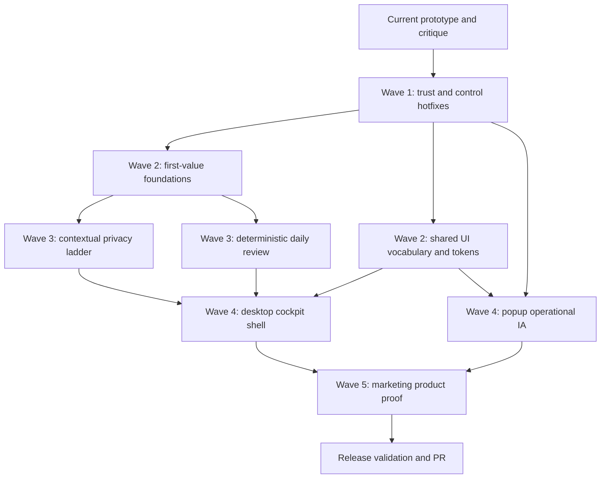

# feat: Improve Inquiry Black Box usability, value, and design coherence

## Goal Capsule

Objective: turn the existing Inquiry Black Box prototype from a technically credible local logger into a usable, trustworthy, value-forward session instrument.

Authority hierarchy: protect privacy and trust first; make the first useful replay obvious second; unify visual language third; only then invest in the larger cockpit and popup redesign.

Stop conditions: do not add hidden recording, raw camera frames, raw typed content, raw screen capture, or cloud upload as a shortcut to better reports; do not strengthen cognitive certainty claims beyond evidence-backed behavior; do not spend a major redesign pass on surfaces that still lack first-run value.

Execution profile: this is a follow-up implementation plan for `apps/inquiry-black-box` and `sites/inquiry_black_box`, rooted in the current local-first Electron desktop app, Chrome MV3 extension, shared `apps/inquiry-black-box/packages/ui`, shared schema/signals packages, and marketing site.

---

## Product Contract

### Summary

The existing critique is directionally right, but its task list needs a stronger execution spine.
It correctly identifies identity fragmentation, weak first-run value, trust gaps, an over-technical extension popup, a desktop app that feels like a settings page, and one risky cognition label.
Its main flaw is sequencing: it mixes trust fixes, value fixes, shared design-system work, full layout redesign, and polish as peers.

The improved plan is to ship in waves.
First fix trust-eroding controls and overclaiming.
Then reduce session-start friction and make accumulated value visible.
Then establish shared UI primitives and privacy vocabulary.
Then make the daily review and replay the primary value surfaces.
Only after that should the desktop cockpit and extension popup receive their larger structural redesigns.

### Problem Frame

Inquiry Black Box asks the user to do more work than passive capture tools: install a desktop app, pair a Chrome extension, explicitly start sessions, answer probes, and manage privacy choices.
That friction can be justified only if the product feels safer, more intentional, and more useful than passive competitors.

Today the prototype has the right technical boundaries but the payoff is hidden.
The desktop app starts every session as `Research session`, has no visible session history, exposes a full pairing token in the header, renders replay as lists, and places privacy/settings controls at the same visual level as the product's actual value.
The extension popup can send invalid-looking transport commands, uses a disable-site checkbox whose checked state means capture is off, and shows developer-grade diagnostics before the operational question "am I recording this site?"
The marketing site explains the product well but has weak conversion and trust links.

### Assessment Of The Existing Critique

- Keep the critique's verdict against a full immediate redesign.
The marketing site is the strongest surface, and the desktop/popup need structural redesign only after the trust and first-value gaps are corrected.
- Strengthen the value diagnosis.
The biggest product issue is not visual polish; it is that the product sells interpretation while the current app mostly shows capture and raw replay evidence.
- Reorder the "must fix before users" list.
Pairing token masking, delete confirmation, state-aware recording controls, site pause semantics, session titles, and first-run replay/demo states are user-trust and activation blockers.
Neumorphic tuning, dark mode, alternate icons, and screenshots are downstream polish.
- Merge duplicate vocabulary work.
Signal labels, privacy labels, recording states, self-label display names, and heatmap naming should move into shared UI/domain helpers rather than being repaired separately in desktop and popup code.
- Defer marketing screenshot work until the cockpit/replay canvas exists.
Adding a CTA and privacy/repo links can ship now; showing a real product screenshot should wait until the app surface is worth representing.

### Requirements

- R1. The desktop app must stop exposing high-risk trust hazards: full pairing token visibility, unconfirmed destructive delete, unlabeled probe inputs, ambiguous repair buttons, raw self-label slugs, and cognition-overclaiming labels.
- R2. The extension popup must behave like an operational control surface: clear recording state, valid state-aware transport actions, explicit "pause capture on this site" semantics, compact health, and diagnostics behind disclosure.
- R3. Session creation must cost one obvious action from either desktop or extension, while still allowing a meaningful title or generated title that makes history review useful.
- R4. The app must show accumulated value through session history: title, duration, recording state, top markers, and one-line verdict for recent sessions.
- R5. Empty states must show the user what a successful replay looks like, using the existing fixture path or deterministic sample data without pretending live evidence exists.
- R6. Recording integrity must be protected with idle auto-pause or a "still recording?" nudge so accidental non-work activity does not poison later reports.
- R7. Privacy controls must be reframed as a value ladder at the moment of need: when a marker cannot name the passage or context, the UI should explain which opt-in would improve that marker and what it would store.
- R8. The daily review must become the primary value surface, summarizing helped, fragmented, retry, confirm, and limitations from local deterministic evidence before optional LLM enrichment.
- R9. Repair outcomes must be measurable as product feedback, including accepted, answered, dismissed, snoozed, ignored, rated useful, and rated not useful where applicable.
- R10. Desktop, popup, and marketing surfaces must share a recognizable design language: warm neutrals, teal as the recording/signature accent, semantic warning/error colors, shared label vocabulary, and a small aperture brand signal where useful.
- R11. The desktop cockpit must prioritize always-visible recording/privacy/session state in a rail and promote replay/daily review in the main canvas.
- R12. The marketing site must link to the actual product path, repository or install instructions, and privacy model, while avoiding stronger claims than the app can currently support.

### Acceptance Examples

- AE1. Given the desktop app is visible during a screen share, when the header renders, then the pairing token is masked by default and can only be revealed intentionally.
- AE2. Given a user presses Delete, when a session exists, then the app asks for confirmation before deleting local session data and distinguishes Delete from Export visually.
- AE3. Given the extension popup is paired and the desktop state is `recording`, when it renders transport controls, then Record is active/held or disabled, Pause and Stop are valid actions, and invalid state transitions are not offered as equivalent primary actions.
- AE4. Given the active tab is allowed, when the user toggles site capture, then the label says "Pause capture on this site" and the checked state means capture is paused for that site.
- AE5. Given a new user has no replay evidence, when they open the replay panel, then they see a sample/demo replay option or fixture-backed preview that demonstrates expected value without misrepresenting live data.
- AE6. Given the user starts five sessions, when they open the desktop app later, then they can distinguish sessions by title, duration, top markers, and one-line verdict rather than seeing five identical "Research session" rows.
- AE7. Given a marker cannot name a passage because selected text is off, when the user views that marker, then the UI explains that enabling selected-text excerpts would allow passage names and states the storage/privacy tradeoff.
- AE8. Given the user forgets to stop recording after inactivity, when idle criteria are met, then the app pauses or asks whether to keep recording and records that integrity decision.
- AE9. Given a completed session with enough events, when the user opens the main desktop canvas, then the daily review leads with what helped, what fragmented, what to retry, what to confirm, and visible limitations.
- AE10. Given the marketing site is the user's first surface, when they reach the hero or footer, then they can find the product install/repo path and the privacy model without hunting.

### Scope Boundaries

In scope:

- Desktop renderer, IPC facade, session controller, SQLite accessors, and focused tests needed for trust, session history, daily review, idle integrity, replay display, and cockpit layout.
- Extension popup, service worker/session-control helpers, privacy toggle labels, and focused extension tests.
- Shared UI vocabulary, tokens, and simple view-model helpers in `apps/inquiry-black-box/packages/ui`.
- Marketing site content/CSS tests for CTA, trust links, and later product proof.

Deferred to follow-up work:

- Dark mode.
- Store-listing art and alternate icon generation.
- Full native one-click pairing through deep links or native messaging if the current localhost bridge can support a smaller first step.
- LLM-enriched daily summaries beyond deterministic local daily review.
- Chrome Web Store publication, app signing, auto-update, and release packaging improvements not required to prove this UX loop.

Outside this product's identity:

- Passive hidden capture as the default.
- Raw screen, raw typed text, raw camera, or raw document capture to make reports more impressive.
- Medical, diagnostic, emotion-certainty, or workplace-surveillance framing.

---

## Planning Contract

### Key Technical Decisions

- KTD1. Fix trust and correctness before design-system extraction.
Masking secrets, confirming destructive actions, making recording controls state-aware, and correcting overclaiming labels remove immediate user harm and are low-dependency changes.

- KTD2. Treat first value as a product dependency for redesign.
The cockpit should not merely arrange today's weak payoff more beautifully; session history, demo replay, idle integrity, contextual privacy tradeoffs, and daily review should shape the layout.

- KTD3. Use `apps/inquiry-black-box/packages/ui` for shared vocabulary and view models, not browser or Electron APIs.
The existing `recordingIndicator` helper is the right seed.
Extend this package with token constants, display labels, confidence bands, privacy-label metadata, and session-control view models that both desktop and popup can consume.

- KTD4. Keep app CSS local at first but source values from shared tokens.
The repo does not currently have a bundler-level CSS token pipeline.
Exporting token maps and/or generated CSS variable strings from `apps/inquiry-black-box/packages/ui` gives reuse without introducing a new design-system dependency.

- KTD5. Build session history on existing SQLite session records before adding new analytics tables.
The database already stores sessions and events.
Add list/query helpers and derive duration/top markers from existing replay/report generation before creating a larger reporting schema.

- KTD6. Make privacy upgrades contextual and reversible.
The opt-in ladder should appear near replay markers and daily review limitations, not only in settings.
Every prompt must state what additional data is stored and keep default capture derived/local.

- KTD7. Make daily review deterministic first.
Use local reports, markers, repair outcomes, labels, and limitations to generate a stable review.
Optional redacted LLM wording can enhance prose later, but the product should not depend on a model to answer "what now?"

- KTD8. Parallelize by surface only after shared contracts are frozen.
Desktop trust fixes, popup transport fixes, and marketing CTA links can run in parallel.
The larger cockpit and popup redesigns should wait until shared tokens/view models and value surfaces are stable.

### High-Level Technical Design

### Execution Order And Parallelization

| Wave | Work | Units | Parallelization |
|---|---|---:|---|
| 0 | Baseline branch, read current tests, confirm no dirty work | none | Single owner; do before edits. |
| 1 | Trust/control hotfixes and site CTA basics | U1, U2, U3, U4 | U1/U2 desktop, U3 popup, and U4 site can run in parallel because they touch separate surfaces. Coordinate shared wording before final tests. |
| 2 | Shared UI vocabulary plus session-start/history foundations | U5, U6, U7 | U5 can run beside U6's data/API work. U7 should start after session title/list contracts are agreed. |
| 3 | Recording integrity and contextual privacy/value ladder | U8, U9 | U8 can run beside U9 if they avoid the same replay rendering files until integration. |
| 4 | Deterministic daily review | U10 | Should follow U7 and U9 so review can cite sessions and limitations. |
| 5 | Larger desktop cockpit and popup IA redesign | U11, U12 | Can run in parallel after U5 and U10. Freeze token names and shared view models first. |
| 6 | Marketing proof, docs, final verification | U13 | Final site screenshot/proof should wait for U11. |

Do not parallelize these pairs without a clear contract first:

- U5 with U11/U12 if token names, label names, or class conventions are still changing.
- U6/U7 with U10 if session-history fields and report summary shape are not agreed.
- U3 with U12 in the same branch unless U3's popup state model has already landed.
- U9 with U11 if both are rewriting `ReplayTimeline.tsx`; land the marker/limitation semantics before layout polish.

### Revised Priority Order

1. Mask pairing token, confirm delete, fix probe labels/buttons, rename `Comprehension Heatmap`, humanize self-labels, and make popup recording/site controls state-safe.
2. Add real CTA/privacy links to the site so the strongest surface can convert and build trust immediately.
3. Add session titles, one-click start from popup/desktop, and a visible recent-session history.
4. Add demo replay/fixture empty states and idle auto-pause or still-recording nudges.
5. Extract shared UI tokens, signal vocabulary, recording-state view models, and confidence bands.
6. Add contextual privacy opt-in ladder inside replay/daily review.
7. Ship deterministic daily review and repair-feedback KPI.
8. Redesign desktop into rail plus main canvas.
9. Redesign popup into status, transport, site, queue, privacy, diagnostics.
10. Add real product screenshot, dark mode, icon variants, and other polish later.

### Alternatives Considered

- Full visual redesign first.
Rejected because it risks beautifying an app whose activation and value loop are still incomplete.

- Marketing-only polish first.
Rejected because it can improve perception but will worsen trust if the installed app still exposes secrets, weak controls, and thin payoff.

- Passive capture parity with Rewind-style competitors.
Rejected because it violates the product's intentional local-first lab-notebook identity.
The plan instead makes the explicit ritual cheaper and more rewarding.

---

## Implementation Units

| Unit | Name | Primary files | Depends on |
|---|---|---|---|
| U1 | Desktop trust and destructive-action safety | `apps/inquiry-black-box/apps/desktop/src/renderer/App.tsx`, `apps/inquiry-black-box/apps/desktop/src/renderer/settings/PrivacySettings.tsx` | none |
| U2 | Probe, replay, and label claim hygiene | `apps/inquiry-black-box/apps/desktop/src/renderer/probes/ProbePanel.tsx`, `apps/inquiry-black-box/apps/desktop/src/renderer/replay/ReplayTimeline.tsx`, `apps/inquiry-black-box/apps/desktop/src/renderer/session/SessionControls.tsx` | none |
| U3 | Popup transport correctness and site-pause semantics | `apps/inquiry-black-box/apps/extension/src/popup/App.tsx`, `apps/inquiry-black-box/apps/extension/tests/*.test.ts` | none |
| U4 | Marketing CTA and trust-link quick pass | `sites/inquiry_black_box/index.html`, `sites/inquiry_black_box/styles.css` | none |
| U5 | Shared UI vocabulary and tokens | `apps/inquiry-black-box/packages/ui/src/index.ts` | U1, U2, U3 preferred |
| U6 | Low-friction session start | `apps/inquiry-black-box/apps/desktop/src/renderer/App.tsx`, `apps/inquiry-black-box/apps/extension/src/lib/localBridge.ts`, `apps/inquiry-black-box/apps/extension/src/background/service-worker.ts` | U3 |
| U7 | Session history and demo replay empty states | `apps/inquiry-black-box/apps/desktop/src/main/db/index.ts`, `apps/inquiry-black-box/apps/desktop/src/main/ipc.ts`, `apps/inquiry-black-box/apps/desktop/src/renderer/App.tsx` | U6 |
| U8 | Idle integrity and still-recording nudges | `apps/inquiry-black-box/apps/desktop/src/main/ingest/session.ts`, `apps/inquiry-black-box/apps/desktop/src/main/notifications/notificationManager.ts` | U6 |
| U9 | Contextual privacy opt-in ladder | `apps/inquiry-black-box/apps/desktop/src/renderer/replay/ReplayTimeline.tsx`, `apps/inquiry-black-box/apps/desktop/src/renderer/settings/PrivacySettings.tsx` | U5, U7 |
| U10 | Deterministic daily review and feedback KPI | `apps/inquiry-black-box/packages/signals/src/*`, `apps/inquiry-black-box/apps/desktop/src/main/reports/sessionReplay.ts` | U7, U9 |
| U11 | Desktop cockpit shell and replay visualization | `apps/inquiry-black-box/apps/desktop/src/renderer/App.tsx`, `apps/inquiry-black-box/apps/desktop/src/renderer/index.html`, `apps/inquiry-black-box/apps/desktop/src/renderer/replay/ReplayTimeline.tsx` | U5, U10 |
| U12 | Popup operational IA redesign | `apps/inquiry-black-box/apps/extension/src/popup/App.tsx`, `apps/inquiry-black-box/apps/extension/src/popup/PrivacyToggles.tsx` | U3, U5, U6 |
| U13 | Product proof, documentation, and release validation | `sites/inquiry_black_box/*`, `apps/inquiry-black-box/docs/*` | U10, U11, U12 |

### U1. Desktop trust and destructive-action safety

- **Goal:** Remove the highest-risk desktop trust failures before any larger redesign.
- **Requirements:** R1, AE1, AE2
- **Dependencies:** None
- **Files:** `apps/inquiry-black-box/apps/desktop/src/renderer/App.tsx`, `apps/inquiry-black-box/apps/desktop/src/renderer/settings/PrivacySettings.tsx`, `apps/inquiry-black-box/apps/desktop/src/renderer/index.html`, `apps/inquiry-black-box/apps/desktop/tests/privacy.test.ts`, `apps/inquiry-black-box/apps/desktop/tests/desktop-shell.test.ts`
- **Approach:** Mask the pairing token by default in `renderShellHeader`, add reveal/copy affordances, and avoid putting the full secret in ordinary screen state.
Style Delete as destructive, separate it from Export, and require confirmation before calling `deleteSession`.
Keep the existing deletion semantics in main/database code intact; this unit is about safer initiation and clearer UI state.
- **Patterns to follow:** Keep privileged deletion behavior in main process and renderer actions narrow, matching the existing `InquiryPrivacyFacade` boundary.
- **Test scenarios:** Render the shell header with a fake pairing token and verify the full token is not present in default text; click reveal and verify intentional display; render privacy settings and verify Delete has a destructive class/label; simulate dismissing confirmation and verify delete action is not called; simulate confirming and verify it is called once.
- **Verification:** Desktop shell/privacy tests prove secrets are masked by default and delete cannot fire accidentally.

### U2. Probe, replay, and label claim hygiene

- **Goal:** Make the existing desktop value surface more humane and less overclaiming before changing layout.
- **Requirements:** R1, R8, AE7, AE9
- **Dependencies:** None
- **Files:** `apps/inquiry-black-box/apps/desktop/src/renderer/probes/ProbePanel.tsx`, `apps/inquiry-black-box/apps/desktop/src/renderer/replay/ReplayTimeline.tsx`, `apps/inquiry-black-box/apps/desktop/src/renderer/session/SessionControls.tsx`, `apps/inquiry-black-box/apps/desktop/src/renderer/index.html`, `apps/inquiry-black-box/apps/desktop/tests/replay.test.ts`
- **Approach:** Rename `Comprehension Heatmap` to `Reading engagement map` or another behavior-grounded label.
Change probe buttons from `Start`/`Save` to action-specific text such as `Accept repair`, `Save answer`, and `Dismiss`.
Add visible labels to textarea/range controls and show a human confidence label/value.
Render self-label display names such as `Confused (productive)` while preserving existing schema payload values.
Move bare confidence percentages toward low/medium/high bands with the numeric value in disclosure text.
- **Patterns to follow:** Preserve heuristic limitation copy and evidence IDs; the change is presentation and claim hygiene, not a new model.
- **Test scenarios:** Replay render test expects `Reading engagement map` and no `Comprehension Heatmap`; probe render test finds accessible labels for answer and confidence; confidence changes update visible readout; label buttons display human strings but still call `addLabel` with the canonical slug; replay still includes evidence and limitation text.
- **Verification:** Existing replay/probe tests stay green with updated expectations and stronger accessibility checks.

### U3. Popup transport correctness and site-pause semantics

- **Goal:** Make the extension popup safe and understandable under pressure.
- **Requirements:** R2, AE3, AE4
- **Dependencies:** None
- **Files:** `apps/inquiry-black-box/apps/extension/src/popup/App.tsx`, `apps/inquiry-black-box/apps/extension/src/popup/PrivacyToggles.tsx`, `apps/inquiry-black-box/apps/extension/tests/pairing.test.ts`, `apps/inquiry-black-box/apps/extension/tests/popup-listener.test.ts`
- **Approach:** Reuse or mirror the desktop session-control enablement rules so Record, Pause, Resume, and Stop match the authoritative recording state.
Make the active state visually held and invalid actions disabled.
Replace `Disable <site>` with `Pause capture on this site`, with checked meaning paused/disabled for that site.
Compress endpoint/session/page-listener diagnostics behind a secondary section after state and controls.
- **Patterns to follow:** Current popup tests already cover runtime messages, listener detection, and session control posts; extend them rather than adding browser automation for this unit.
- **Test scenarios:** Paired recording state disables Record, enables Pause/Stop, and marks Recording as active; paused state enables Resume/Stop; stopped state enables Record only; site checkbox label uses pause language and sends `disabled: true` when checked; diagnostics remain available but are not the first content after the header.
- **Verification:** Extension tests prove invalid state transitions are not presented as primary actions.

### U4. Marketing CTA and trust-link quick pass

- **Goal:** Make the strongest current surface convert and substantiate privacy claims before app redesign.
- **Requirements:** R12, AE10
- **Dependencies:** None
- **Files:** `sites/inquiry_black_box/index.html`, `sites/inquiry_black_box/styles.css`, `sites/inquiry_black_box/tests/content.test.js`, `sites/inquiry_black_box/tests/server.test.js`
- **Approach:** Add hero and masthead actions for the real product path: repo, local install/build instructions, or extension/desktop download when available.
Add footer links to `apps/inquiry-black-box/docs/privacy-model.md`, `apps/inquiry-black-box/README.md`, and the repository.
Keep current editorial tone; do not add a fake product screenshot yet.
Raise mobile nav hit targets and avoid 9px navigation.
- **Patterns to follow:** Existing site tests assert privacy/cognition restraint and Neurophenom typography; add assertions for CTA/trust links.
- **Test scenarios:** Content test finds a primary install/repo CTA, privacy model link, README/repo link, and no stronger cognitive/medical claims; CSS test verifies nav text/tap target size is not regressed.
- **Verification:** Site tests pass and the hero/footer give a user a concrete next action.

### U5. Shared UI vocabulary and tokens

- **Goal:** Stop desktop, popup, and site-adjacent app surfaces from drifting into separate products.
- **Requirements:** R2, R10
- **Dependencies:** U1, U2, U3 preferred so hotfix copy informs shared names.
- **Files:** `apps/inquiry-black-box/packages/ui/src/index.ts`, `apps/inquiry-black-box/packages/ui/package.json`, `apps/inquiry-black-box/packages/ui/tsconfig.json`, `apps/inquiry-black-box/apps/desktop/src/renderer/index.html`, `apps/inquiry-black-box/apps/extension/src/popup/App.tsx`, `apps/inquiry-black-box/apps/extension/src/popup/PrivacyToggles.tsx`
- **Approach:** Extend `apps/inquiry-black-box/packages/ui` with shared display metadata for recording states, self-labels, signal/privacy labels, confidence bands, and design tokens.
Use warm paper neutrals, teal as signature/recording accent, and green/amber/rose only for semantic state.
Expose values in a dependency-light way that works in both desktop renderer and extension popup without importing Electron or Chrome APIs.
- **Patterns to follow:** The existing `recordingIndicator` helper is the model: typed, small, and framework-free.
- **Test scenarios:** Unit or compile-time tests verify all recording states, self-label slugs, and signal keys have display labels; desktop and popup import shared helpers rather than duplicating labels; typecheck catches missing metadata for a new signal key.
- **Verification:** `apps/inquiry-black-box/packages/ui` becomes the canonical source for cross-surface vocabulary and tokens.

### U6. Low-friction session start

- **Goal:** Reduce the ritual cost of starting a useful session without removing explicit consent.
- **Requirements:** R3, AE3, AE6
- **Dependencies:** U3
- **Files:** `apps/inquiry-black-box/apps/desktop/src/renderer/App.tsx`, `apps/inquiry-black-box/apps/desktop/src/renderer/session/SessionControls.tsx`, `apps/inquiry-black-box/apps/desktop/src/main/ingest/session.ts`, `apps/inquiry-black-box/apps/desktop/src/main/ipc.ts`, `apps/inquiry-black-box/apps/desktop/src/main/security/hotkeys.ts`, `apps/inquiry-black-box/apps/extension/src/lib/localBridge.ts`, `apps/inquiry-black-box/apps/extension/src/background/service-worker.ts`, `apps/inquiry-black-box/apps/extension/src/popup/App.tsx`, `apps/inquiry-black-box/apps/desktop/tests/desktop-shell.test.ts`, `apps/inquiry-black-box/apps/extension/tests/pairing.test.ts`
- **Approach:** Add a lightweight title input or generated title flow so desktop starts are not hardcoded to `Research session`.
Let the popup start a titled session with a sensible default derived from hostname or current page context, still using the existing session-control endpoint.
Consider a global shortcut only for explicit start/pause if it fits the current hotkey boundary; avoid arbitrary global typing capture.
- **Patterns to follow:** Keep session lifecycle authority in desktop `SessionController`; extension sends control intent through `postSessionControl`.
- **Test scenarios:** Desktop start action uses user-provided or generated title; extension `postSessionControl` can send a title and stores returned session id; starting while already active follows existing controller error behavior; shortcut path creates the same session events as button path if implemented.
- **Verification:** Starting a session from desktop or popup produces a distinguishable title and visible recording state.

### U7. Session history and demo replay empty states

- **Goal:** Make longitudinal value visible and show first-run value before live evidence exists.
- **Requirements:** R4, R5, AE5, AE6
- **Dependencies:** U6
- **Files:** `apps/inquiry-black-box/apps/desktop/src/main/db/index.ts`, `apps/inquiry-black-box/apps/desktop/src/main/ipc.ts`, `apps/inquiry-black-box/apps/desktop/src/renderer/App.tsx`, `apps/inquiry-black-box/apps/desktop/src/renderer/replay/ReplayTimeline.tsx`, `apps/inquiry-black-box/apps/desktop/tests/db.test.ts`, `apps/inquiry-black-box/apps/desktop/tests/replay.test.ts`, `apps/inquiry-black-box/tests/fixtures/research-session.jsonl`, `apps/inquiry-black-box/docs/prototype-demo.md`
- **Approach:** Add a `listSessions` database/IPCs facade that returns recent sessions with title, start/end, duration, state, and enough metadata to select a session.
Derive top markers and one-line verdict from existing replay reports for each selected or recent stopped session.
Use the existing fixture to render a demo/sample replay from an empty state without mixing it into live session data.
- **Patterns to follow:** Keep SQLite authoritative and renderer state derived from IPC; do not add a new persistence layer for history.
- **Test scenarios:** DB test lists sessions in recent order with stopped/active states; renderer test shows distinct session titles and can select a prior session; empty replay state offers sample/demo without claiming live evidence; demo fixture renders known marker text and limitations.
- **Verification:** A user can open the app, see prior sessions, and understand what replay will eventually produce.

### U8. Idle integrity and still-recording nudges

- **Goal:** Protect report integrity when the user forgets to stop recording.
- **Requirements:** R6, AE8
- **Dependencies:** U6
- **Files:** `apps/inquiry-black-box/apps/desktop/src/main/ingest/session.ts`, `apps/inquiry-black-box/apps/desktop/src/main/activity/desktopActivity.ts`, `apps/inquiry-black-box/apps/desktop/src/main/notifications/notificationManager.ts`, `apps/inquiry-black-box/apps/desktop/src/renderer/settings/NotificationSettings.tsx`, `apps/inquiry-black-box/apps/desktop/tests/ingest.test.ts`, `apps/inquiry-black-box/apps/desktop/tests/notifications.test.ts`, `apps/inquiry-black-box/apps/desktop/tests/desktop-activity.test.ts`
- **Approach:** Define idle criteria from already available local signals such as no browser events, no desktop activity heartbeat, or long inactive span during recording.
Start with a conservative "still recording?" nudge or auto-pause only when confidence is high and user settings allow it.
Record the outcome as a local event so later reports can distinguish intentional capture from integrity correction.
- **Patterns to follow:** Existing notification manager quiet-hours/cooldown behavior should gate nudges.
- **Test scenarios:** Sustained idle while recording creates at most one nudge after cooldown; active browser or desktop activity suppresses idle nudge; accepting keep-recording continues session; pause action records a session pause/system event; quiet hours suppress notifications.
- **Verification:** Accidental long recording spans are interrupted or marked without hidden background behavior.

### U9. Contextual privacy opt-in ladder

- **Goal:** Let users understand what value additional privacy opt-ins would buy at the moment a report is vague.
- **Requirements:** R7, AE7
- **Dependencies:** U5, U7
- **Files:** `apps/inquiry-black-box/apps/desktop/src/renderer/replay/ReplayTimeline.tsx`, `apps/inquiry-black-box/apps/desktop/src/renderer/settings/PrivacySettings.tsx`, `apps/inquiry-black-box/apps/extension/src/popup/PrivacyToggles.tsx`, `apps/inquiry-black-box/packages/schema/src/sessions.ts`, `apps/inquiry-black-box/packages/signals/src/heatmap.ts`, `apps/inquiry-black-box/apps/desktop/tests/replay.test.ts`, `apps/inquiry-black-box/apps/desktop/tests/privacy.test.ts`
- **Approach:** Attach limitation metadata to replay markers and heatmap segments that says which disabled signal would improve specificity.
Render the message inline: for example, "Enable selected-text excerpts to name the passage; this stores bounded selected text locally by default."
Keep the global privacy settings panel as the place to toggle, but surface the reason inside replay/daily review.
- **Patterns to follow:** Current replay reports already preserve limitations and privacy notes; extend that mechanism rather than creating ad hoc UI warnings.
- **Test scenarios:** Behavior-only marker with selected text off renders contextual opt-in copy; enabling selected text removes or changes the limitation copy; screen snapshots remain deferred and cannot be enabled through the ladder; cloud sync is never enabled as a side effect.
- **Verification:** Users can see the value/privacy tradeoff exactly where the vague marker appears.

### U10. Deterministic daily review and feedback KPI

- **Goal:** Make the product's value layer real before optional model enrichment.
- **Requirements:** R8, R9, AE9
- **Dependencies:** U7, U9
- **Files:** `apps/inquiry-black-box/packages/signals/src/index.ts`, `apps/inquiry-black-box/packages/signals/src/heuristics.ts`, `apps/inquiry-black-box/packages/signals/src/repairs.ts`, `apps/inquiry-black-box/apps/desktop/src/main/reports/sessionReplay.ts`, `apps/inquiry-black-box/apps/desktop/src/renderer/replay/ReplayTimeline.tsx`, `apps/inquiry-black-box/apps/desktop/src/main/ipc.ts`, `apps/inquiry-black-box/apps/desktop/tests/replay.test.ts`, `apps/inquiry-black-box/packages/signals/tests/heuristics.test.ts`, `apps/inquiry-black-box/packages/signals/tests/repairs.test.ts`
- **Approach:** Add a deterministic daily/session review object derived from replay markers, evidence episodes, labels, repair outcomes, notifications, and limitations.
Use buckets like Helped, Fragmented, Retry, Confirm, and Limitations.
Add repair-feedback aggregation so the app can compute accepted/answered/dismissed/useful rates from local events.
Render daily review as the lead value surface in the desktop main canvas once enough evidence exists.
- **Patterns to follow:** Preserve evidence IDs and limitations; the review is a summary over inspectable local evidence, not a new opaque state model.
- **Test scenarios:** Fixture events produce stable review buckets; repair outcome events change feedback KPI counts; no raw text appears unless document-opt-in event exists; low-evidence sessions render a bounded "not enough evidence" review; limitations always appear when behavior-only inference is used.
- **Verification:** The app can answer "what now?" without cloud sync or LLM calls.

### U11. Desktop cockpit shell and replay visualization

- **Goal:** Redesign desktop from equal-weight cards into an instrument cockpit once value surfaces are ready.
- **Requirements:** R10, R11, AE6, AE9
- **Dependencies:** U5, U10
- **Files:** `apps/inquiry-black-box/apps/desktop/src/renderer/App.tsx`, `apps/inquiry-black-box/apps/desktop/src/renderer/index.html`, `apps/inquiry-black-box/apps/desktop/src/renderer/session/SessionControls.tsx`, `apps/inquiry-black-box/apps/desktop/src/renderer/replay/ReplayTimeline.tsx`, `apps/inquiry-black-box/apps/desktop/src/renderer/settings/PrivacySettings.tsx`, `apps/inquiry-black-box/apps/desktop/src/renderer/probes/ProbePanel.tsx`, `apps/inquiry-black-box/apps/desktop/tests/replay.test.ts`, `apps/inquiry-black-box/apps/desktop/tests/desktop-shell.test.ts`
- **Approach:** Replace the six equal root cards and nth-child grid hacks with named shell regions: persistent rail and main canvas.
Rail: brand mark, recording state, transport, current session title/elapsed, privacy quick-state, pairing health, and compact repair queue.
Main canvas: daily review first, replay timeline/reading engagement map second, episodes/cards with evidence disclosures, settings as a secondary route or section.
Use stable classes/regions instead of ordering-dependent CSS selectors.
- **Patterns to follow:** Keep a dense operational tool feel; avoid landing-page hero layout inside the app.
- **Test scenarios:** Renderer creates named rail/main regions independent of render order; active recording state remains visible while scrolling main content; daily review appears before low-level evidence lists; evidence IDs are collapsed or disclosed rather than dumped as primary prose; settings remain reachable without dominating first viewport.
- **Verification:** Desktop app reads as a work cockpit with value and recording state visible at a glance.

### U12. Popup operational IA redesign

- **Goal:** Turn the extension popup from a diagnostics panel into the compact control surface users will actually use daily.
- **Requirements:** R2, R3, R10, AE3, AE4
- **Dependencies:** U3, U5, U6
- **Files:** `apps/inquiry-black-box/apps/extension/src/popup/App.tsx`, `apps/inquiry-black-box/apps/extension/src/popup/PrivacyToggles.tsx`, `apps/inquiry-black-box/apps/extension/src/lib/localBridge.ts`, `apps/inquiry-black-box/apps/extension/tests/pairing.test.ts`, `apps/inquiry-black-box/apps/extension/tests/popup-listener.test.ts`, `apps/inquiry-black-box/apps/extension/tests/build-output.test.ts`
- **Approach:** Reorder popup IA to status header, transport, current site capture, queue/health one-liner, privacy disclosure, diagnostics disclosure, and pairing only when unpaired or explicitly editing.
Use aperture brand signal, shared tokens, and shared labels.
Keep endpoint/session/listener details available but not dominant.
- **Patterns to follow:** Maintain the MV3 service worker/local bridge boundaries; popup remains a client of runtime messages.
- **Test scenarios:** Paired popup hides pairing form by default and shows edit action; unpaired popup makes pairing primary; current site state is visible above diagnostics; privacy toggles use shared labels; queue state stays visible; build output still contains popup assets.
- **Verification:** A user can answer "am I recording, can I pause, is this site captured, is the queue healthy?" in the first viewport.

### U13. Product proof, documentation, and release validation

- **Goal:** Align external promise, internal docs, and final validation after the product value loop is visible.
- **Requirements:** R10, R12, AE10
- **Dependencies:** U10, U11, U12
- **Files:** `sites/inquiry_black_box/index.html`, `sites/inquiry_black_box/styles.css`, `sites/inquiry_black_box/tests/content.test.js`, `apps/inquiry-black-box/README.md`, `apps/inquiry-black-box/docs/prototype-demo.md`, `apps/inquiry-black-box/docs/privacy-model.md`, `apps/inquiry-black-box/docs/release-checklist.md`
- **Approach:** Add a real product screenshot or fixture-rendered replay image only after the cockpit exists.
Update README and prototype demo to describe the new activation loop: pair, start titled session, generate replay/daily review, answer repair, review history, export/delete.
Keep privacy model language synchronized with the contextual opt-in ladder.
- **Patterns to follow:** The site already has restrained copy and content tests; expand tests to guard against overclaiming and missing links.
- **Test scenarios:** Site content test sees the new proof surface and still rejects medical/diagnostic claims; docs reference the same privacy boundaries as UI; prototype demo covers title, history, demo/fixture replay, daily review, and delete confirmation.
- **Verification:** Marketing, docs, and product UI tell the same story.

---

## Verification Contract

| Gate | Command | Applies to | Done signal |
|---|---|---|---|
| App lint | `bun run lint` from `apps/inquiry-black-box` | U1-U13 app work | No lint failures. |
| App typecheck | `bun run typecheck` from `apps/inquiry-black-box` | U1-U13 app work | TypeScript project references compile. |
| App unit tests | `bun run test` from `apps/inquiry-black-box` | U1-U12 | Desktop, extension, cloud, schema, and signals tests pass. |
| E2E fixture loop | `bun run test:e2e` from `apps/inquiry-black-box` | U6-U13 | Local session fixture and extension pairing smoke pass. |
| Prototype build | `bun run build:prototype` from `apps/inquiry-black-box` | U3, U6, U11, U12 | Desktop and extension build outputs are produced. |
| Validation smoke | `bun run validation:smoke` from `apps/inquiry-black-box` | U10-U13 | Fixture validation report is regenerated without regressions. |
| Site tests | `bun test tests/*.test.js` from `sites/inquiry_black_box` | U4, U13 | Site content/server tests pass. |

Targeted tests should run after each unit before broad gates.
Full gates should run before commit, push, and PR.

---

## Definition of Done

- The immediate trust blockers are fixed: masked pairing token, confirmed delete, accessible probe controls, human labels, claim-safe replay naming, and state-aware popup controls.
- A user can start a titled session from the desktop or popup and later find it in history.
- Empty states show sample value or fixture-backed preview without pretending the sample is live data.
- Recording integrity has a local idle nudge or auto-pause path with test coverage.
- Replay/daily review explains privacy-related limitations contextually and never enables broader capture by accident.
- Deterministic daily review exists and is the first serious value surface in the desktop app.
- Shared UI vocabulary/tokens reduce duplicated labels and palette drift across desktop and popup.
- Desktop layout uses named cockpit regions rather than order-dependent grid hacks.
- Popup first viewport answers recording, transport, current-site capture, queue, and pairing state.
- Marketing links to real product/privacy paths and waits for real product proof before using a screenshot.
- All verification gates in the Verification Contract pass.
- Abandoned experimental UI paths, duplicate token definitions no longer used, and dead copy variants are removed before PR.
