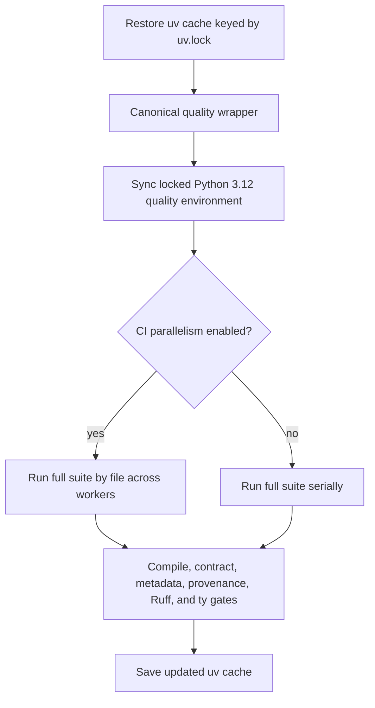

# Faster Root Quality Gate - Plan

## Goal Capsule

- **Objective:** Reduce the root quality job from the 9-minute baseline recorded on PR #357 while preserving every test, validator, lint rule, and type check.
- **Authority:** The user's request and repository `AGENTS.md` requirements override this plan; the existing root quality contract remains authoritative for coverage.
- **Execution profile:** Optimize the measured bottleneck first, keep dependency resolution deterministic, and validate the change on GitHub's Linux runner before merge.
- **Stop conditions:** Stop if parallel execution changes test semantics, introduces nondeterminism, skips coverage, or cannot beat the baseline without weakening a gate.
- **Tail ownership:** Commit and push the optimization on a standalone branch, open a focused pull request, watch its required check to green, and merge it when GitHub reports it merge-ready.

---

## Product Contract

### Summary

The root quality gate will use a locked CPU-only scientific environment and parallelize the pytest workload that dominates wall-clock time.
The documented `python3 scripts/run_quality_checks.py` entry point and all existing checks remain intact.

### Problem Frame

PR #357's first quality run took 9 minutes.
The dependency download that appeared expensive in the live log completed in roughly 16 seconds, while pytest reported 492 passed, 3 skipped, and 54 subtests passed in 489.83 seconds.
The current wrapper also resolves two separate unpinned `uvx` environments and selects CUDA-enabled PyTorch on a CPU-only GitHub runner.

### Requirements

**Runtime latency**

- R1. The quality job must preserve the full baseline of 492 passed tests, 3 skipped tests, and 54 passed subtests, add the wrapper-regression tests, and retain every post-pytest validator, lint, and type gate.
- R2. Pytest should use safe scope-level parallelism in CI and fall back to a conservative serial path when parallel execution is not requested.
- R3. The optimized GitHub job must complete in at most 5 minutes on both the new-lock-key run and an immediate warm-cache rerun of the same commit.

**Dependency determinism**

- R4. Root quality dependencies must be declared in `pyproject.toml`, locked in `uv.lock`, and installed once into a shared Python 3.12 environment.
- R5. PyTorch must resolve from the explicit CPU-only PyTorch index so Linux CI does not download Triton or NVIDIA CUDA packages.
- R6. GitHub's uv cache key must track `uv.lock` so dependency changes invalidate the cache predictably.

**Contributor contract**

- R7. `python3 scripts/run_quality_checks.py` must remain the canonical local and CI entry point.
- R8. `README.md`, `docs/system_design.md`, and `docs/module_explainer.md` must describe the locked environment, CPU-only Torch, parallel CI behavior, and unchanged coverage boundaries.
- R9. Provenance views must remain current after documentation and run-command changes.

### Acceptance Examples

- AE1. Given Linux/Python 3.12 dependency resolution, when the quality environment is locked, then Torch resolves to a `+cpu` build and the resolution contains no `nvidia-*` or `triton` packages.
- AE2. Given `CI=true`, when the wrapper launches pytest, then tests are distributed by file across workers and the complete baseline passes before validators run.
- AE3. Given a contributor runs the documented wrapper locally without CI parallelism, when dependencies are absent, then uv creates the locked Python 3.12 environment once and the wrapper completes through ty.
- AE4. Given a dependency declaration changes, when GitHub restores the uv cache, then the `uv.lock` hash selects a new cache entry.

### Scope Boundaries

- Keep all 69 root test files, compile targets, research-contract validators, primer metadata checks, provenance checks, Ruff, and ty in the root gate.
- Keep `poppler-utils` and `pdfinfo` in this PR; replacing them with a Python PDF reader saves only about nine seconds and adds a separate metadata-parser change.
- Do not add the Inquiry, coherence-testbench, Haskell, or site suites to the root gate.
- Do not weaken assertions, add skips, or select tests by changed paths.

---

## Planning Contract

### Key Technical Decisions

- KTD1. Use a PEP 735 `quality` dependency group plus `uv.lock` rather than repeated `uvx --with` lists. This makes the dependency graph reviewable, cache-addressable, and reusable across pytest, Ruff, and ty.
- KTD2. Pin Torch to an explicit CPU-only index using `[tool.uv.sources]` and an `explicit = true` index. This confines the alternate index to Torch while leaving generic dependencies on PyPI, following uv's documented PyTorch pattern.
- KTD3. Use pytest-xdist scope-level distribution for CI, capped at four workers with native math-library threads capped at one. Scope-level scheduling preserves expensive module/class fixtures while attacking the measured 489.83-second bottleneck without unbounded CPU oversubscription.
- KTD4. Preserve the wrapper as the orchestration boundary. It will sync the locked environment once, then invoke every Python/tool command from that environment without repeated resolution.
- KTD5. Treat the first new-lock-key GitHub run and an immediate rerun of the same commit as the acceptance benchmarks. Local hardware is useful for correctness but cannot establish the GitHub-runner latency target.

### High-Level Technical Design

### Assumptions

- GitHub's runner exposes enough CPU concurrency for scope-level xdist to reduce wall time materially.
- Tests that write artifacts remain safe when tests from the same file stay on one worker; any discovered cross-file collision must be isolated rather than ignored.
- The CPU-only Torch build exercises the same code paths as the current CPU execution of the CUDA-capable wheel.

### Risks and Mitigations

- **Parallel write collisions:** Run the complete suite with scope-level distribution and treat any collision as a correctness defect to isolate or serialize explicitly.
- **CPU oversubscription:** Bound worker count based on benchmark evidence rather than assuming every logical core improves throughput.
- **Lock portability:** Generate and verify the lock on the project-supported Python/platform set, then prove Linux resolves `torch+cpu` without accelerator packages.
- **Misleading speedup:** Compare GitHub step timestamps and pytest duration against the recorded 9-minute/489.83-second baseline.

### Sources and Research

- `scripts/run_quality_checks.py` contains the duplicated ephemeral dependency environments and full gate order.
- `.github/workflows/quality.yml` owns the GitHub runner, uv cache, Poppler setup, and canonical wrapper invocation.
- `tests/test_primer_metadata.py` and the broader root suite establish that all current pytest files remain collected.
- uv's official PyTorch integration guide documents explicit CPU-only indexes and package-to-index source pinning: https://docs.astral.sh/uv/guides/integration/pytorch/
- `astral-sh/setup-uv` documents dependency-file-derived cache keys and `cache-dependency-glob`: https://github.com/astral-sh/setup-uv
- No applicable institutional learning was found under `docs/solutions/`; the only current entry concerns PDF rendering rather than CI performance.

---

## Implementation Units

### U1. Lock a reusable CPU-only quality environment

- **Goal:** Replace duplicated ephemeral dependency declarations with one locked root quality environment.
- **Requirements:** R4, R5, R7; covers AE1 and AE3.
- **Dependencies:** None.
- **Files:** `pyproject.toml`, `uv.lock`, `scripts/run_quality_checks.py`.
- **Approach:** Add the quality dependency group, bind Torch to an explicit CPU index, generate the lock, and have the wrapper sync once before invoking all Python and tool gates from the shared environment.
- **Patterns to follow:** Preserve the existing wrapper's fail-fast subprocess orchestration and Python 3.12 contract.
- **Test scenarios:** Resolve the Linux lock and assert CPU Torch without NVIDIA/Triton packages; run the wrapper from a missing quality environment and confirm one sync precedes every existing gate; rerun with the environment present and confirm no dependency re-resolution changes the lock.
- **Verification:** The lock is unchanged after a frozen sync, the wrapper reaches all existing gates, and Linux resolution satisfies AE1.

### U2. Parallelize the measured pytest bottleneck in CI

- **Goal:** Reduce the 489.83-second pytest phase without reducing coverage or changing post-test gates.
- **Requirements:** R1, R2, R3, R6; covers AE2 and AE4.
- **Dependencies:** U1.
- **Files:** `pyproject.toml`, `uv.lock`, `scripts/run_quality_checks.py`, `.github/workflows/quality.yml`.
- **Approach:** Add pytest-xdist to the locked group, use bounded scope-level distribution when CI requests parallelism, retain the serial local default, cap nested native-library threads, and key setup-uv caching to the lockfile.
- **Execution note:** Benchmark worker counts against the full suite and keep the fastest stable configuration; a failed parallel run must be fixed or conservatively serialized, never bypassed.
- **Patterns to follow:** Preserve the workflow's concurrency cancellation and single canonical wrapper step.
- **Test scenarios:** Run all root tests with CI parallelism and confirm the same pass/skip/subtest inventory; run serially to preserve the local fallback; verify a test failure still stops later gates; inspect the new-lock-key Actions run and an immediate rerun of the same commit to confirm both meet R3.
- **Verification:** The standalone PR's new-lock-key quality check and warm-cache rerun are green, report full collection, and each finish within five minutes.

### U3. Synchronize contributor and system documentation

- **Goal:** Make the new dependency and execution model discoverable without overstating gate coverage.
- **Requirements:** R8, R9.
- **Dependencies:** U1, U2.
- **Files:** `README.md`, `docs/system_design.md`, `docs/module_explainer.md`, generated provenance files selected by `scripts/gen_provenance.py`.
- **Approach:** Replace ephemeral-uvx descriptions and manual commands with the locked wrapper contract, document CPU-only Torch and CI scope-level parallelism, retain explicit exclusions, and refresh provenance.
- **Patterns to follow:** Follow the repository's documentation-sync and public-safe provenance rules in `AGENTS.md`.
- **Test expectation:** No new behavioral test; documentation accuracy is enforced by provenance freshness, quality-gate execution, and review against the implemented commands.
- **Verification:** Both required architecture/catalog docs agree with the wrapper and workflow, README commands are executable, and `scripts/gen_provenance.py --check` passes.

---

## Verification Contract

| Gate | Applies to | Done signal |
|---|---|---|
| Frozen dependency resolution and CPU-Torch inspection | U1 | Lock remains unchanged; Linux resolution has `torch+cpu` and no NVIDIA/Triton packages |
| Serial targeted/full-suite compatibility | U1, U2 | Existing pass/skip/subtest inventory remains intact |
| CI-parallel full root quality wrapper | U2 | Every existing gate passes and both the new-lock-key run and same-commit warm-cache rerun finish in at most five minutes |
| Ruff and ty | U1, U2 | Both tools pass from the shared locked environment |
| Provenance regeneration and freshness check | U3 | Generated views are refreshed and `--check` passes |
| Required repository quality command | U1, U2, U3 | `python3 scripts/run_quality_checks.py` exits successfully |

---

## Definition of Done

- U1 is done when one frozen Python 3.12 environment supplies every root quality dependency and CPU-only Torch is proven on Linux.
- U2 is done when the complete gate passes on the standalone optimization PR within five minutes in both cache states with no skipped or weakened coverage.
- U3 is done when README, system design, module catalog, and provenance describe the implemented model consistently.
- The branch contains no abandoned benchmark code, temporary timing artifacts, cache files, or unrelated changes.
- The standalone optimization PR is green, mergeable, pushed, and merged into `main`.
