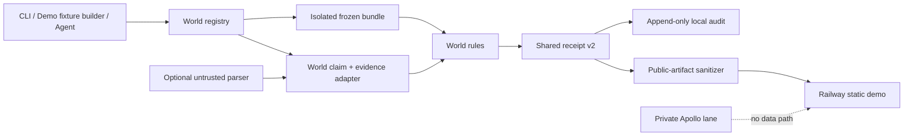
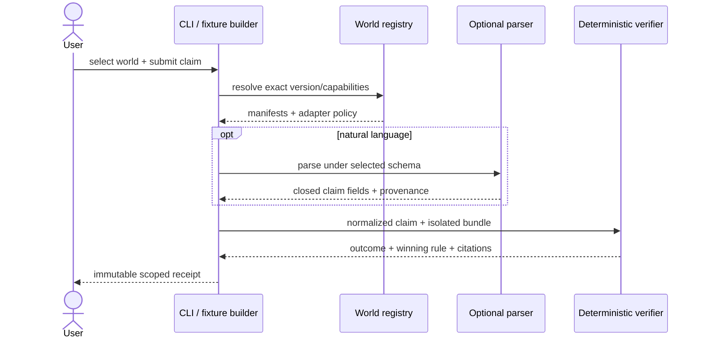
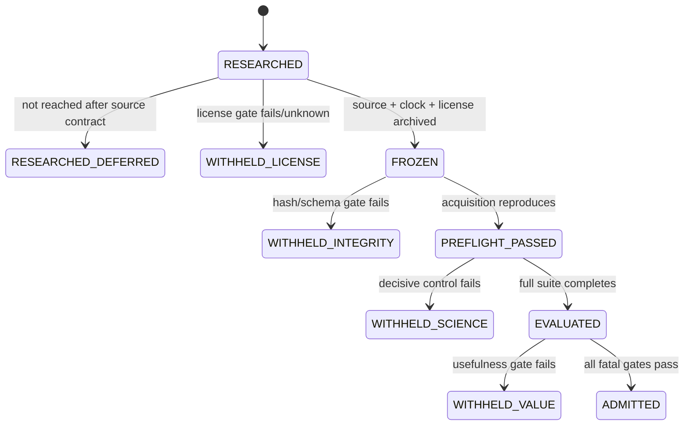
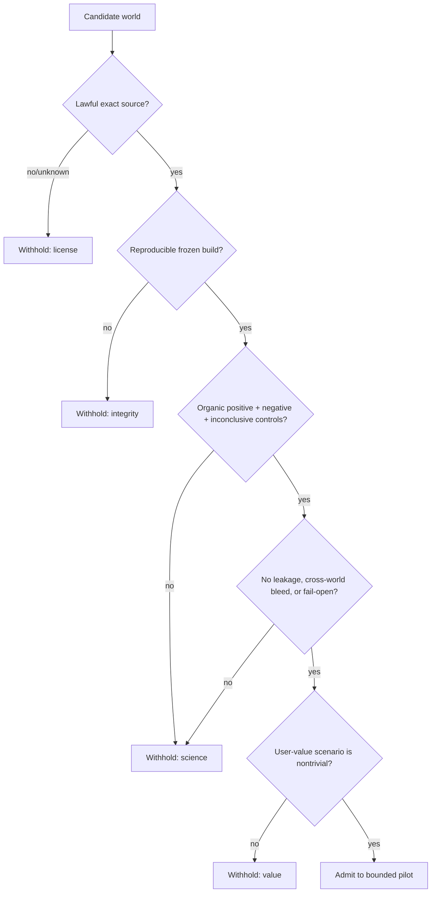
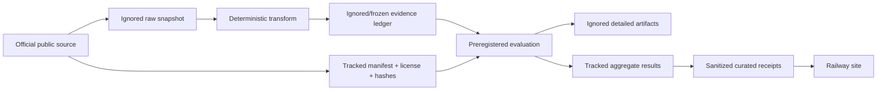
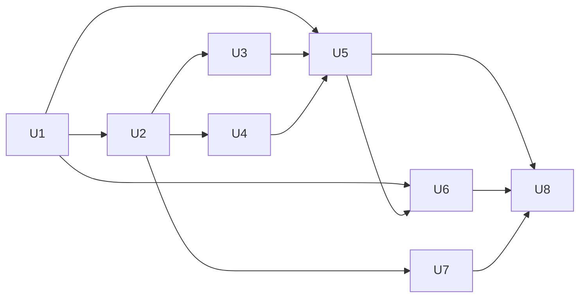

# Bio Claim Firewall Evidence Worlds and Public Demo

## Goal Capsule

Expand Bio Claim Firewall from one frozen K562 perturbation world into a reusable, evidence-world-bound claim checker, evaluate five ranked scientific domains, admit at least three that prove a useful buyer workflow, identify credible design-partner buyers privately, and ship a polished public Railway demo that shows only reproducible sanitized receipts.

The first release is a bounded design-partner pilot, not a universal biology truth engine. A public badge means that a claim satisfied a declared contract against a named frozen evidence world; it does not mean the claim is globally true.

### Success measures

- Five candidate worlds have an audit card and source contract covering versioned source, license, retrieval clock, and schema. Every world that reaches `FROZEN` also has deterministic preprocessing and digest manifests; failed or unreached candidates remain visible as withheld or deferred rather than silently disappearing.
- At least three admissible worlds, including one perturbational and one translational/commercial world, pass their preregistered positive, negative, inconclusive, corruption, and isolation controls.
- The same structured claim and world digest produce a byte-stable canonical receipt payload and identifier across repeated runs; issuance and parser-run metadata are explicitly outside that digest.
- No parser, prompt, or evidence content can choose evidence, change a verdict, switch the world after the caller selects it, or make missing evidence pass.
- A deployed Railway site demonstrates curated receipts, winning rules, source citations, scope, and limitations without provider keys, raw private data, Apollo data, or arbitrary server-side claim execution.
- A private Apollo run produces a deduplicated account-and-role design-partner list and a sanitized aggregate summary; it sends no outreach and publishes no person-level contact data.
- The primary pilot workflow lets a biotech scientific-diligence analyst check trial-disclosure and target–disease claims before a decision memo; each admitted world contributes locked workflow-derived claims and reports its answerable-versus-inconclusive coverage.

## Product Contract

### Actors

- **Scientist or analyst:** selects a named evidence world, submits a structured claim or optional natural-language claim, and inspects the verdict and receipt.
- **Design-partner evaluator:** uses the public demo to understand supported and rejected claims, sources, scope, and failure behavior before requesting a pilot.
- **Evidence-world maintainer:** freezes sources, records licenses and data clocks, builds derived ledgers, and advances a world version only through preregistered gates.
- **Private GTM operator:** discovers companies and buyer roles with Apollo, reviews local artifacts, and decides separately whether to contact anyone.
- **Automated agent:** can list worlds, describe capabilities, check a structured claim, and retrieve the same receipt exposed to a user; it cannot bypass world selection or evidence gates.

### Requirements

- **R1 — Explicit world binding.** Every check names a registered `world_id` and version. Unknown, absent, ambiguous, partially hashed, or cross-world sources fail closed.
- **R2 — World-specific semantics.** Each world owns its claim schema, evidence adapter, capability statement, rules, and fault codes while sharing one verdict-and-receipt envelope.
- **R3 — Immutable provenance.** Every receipt records the world digest, all source/derived hashes, retrieval clock, license identifier and evidence reference, checker/rule/schema versions, exact normalized claim, winning rule, cited records, and optional parser provenance marked untrusted. The canonical digest covers the normalized structured claim, evidence/rule outcome, source hashes, and deterministic versions with fixed field ordering and numeric formatting; it excludes `issued_at`, parser-run metadata, request IDs, and other run-local fields.
- **R4 — Parser containment.** Natural-language parsing happens only after the caller selects a world. Outbound provider requests contain only caller-supplied claim text and the selected world's field schema—never evidence, receipts, filings, Apollo data, or private artifacts. Parser output may contain only the registered world claim fields; evidence, citations, rules, verdicts, and alternate worlds are rejected. Ambiguous parses return inconclusive or require explicit normalized-claim confirmation.
- **R5 — Four-way outcome.** Checks distinguish accepted, rejected, inconclusive, and checker error. Missing, corrupt, stale, or out-of-capability data never become accepted or ordinary rejected claims.
- **R6 — Reproducible evidence acquisition.** Every candidate world has a lawful source contract; every frozen world has an exact retrieval command, raw-to-derived transformation, row counts, schema version, and hashes. Manifests classify sources as immutable releases or rolling snapshots: rolling snapshots require retained-custody and redistribution terms, and a changed re-fetch creates a new world version rather than a tampering verdict. Each admitted world declares a refresh cadence and staleness horizon. Raw/heavy/provider artifacts remain ignored.
- **R7 — Noncompensatory scientific gates.** Failed license, identity, temporal, data-integrity, leakage, or decisive-control gates withhold the affected world or claim; good downstream metrics cannot average them away.
- **R8 — Preserved disagreement.** Conflicting records and cross-world results remain separate scoped receipts. The system never collapses them into a context-free truth score.
- **R9 — Public-surface safety.** The Railway demo serves only committed sanitized fixtures and receipts through whitelisted GET/HEAD routes, includes per-world capability and out-of-scope examples, and contains no secrets, live LLM calls, Apollo data, or raw datasets. It exposes a static `mailto:jawaun.brown95@gmail.com` pilot-request path with no server-side visitor-data collection.
- **R10 — Public/agent parity.** The CLI and demo expose the same world metadata, claim inputs, outcome labels, rule rationale, citations, and receipt identifiers; user-visible actions have equivalent deterministic programmatic operations.
- **R11 — Private buyer research.** Apollo credentials enter only through environment injection. A request allowlist permits read-only company and people-search endpoints and denies outreach/CRM mutation. Search starts with qualified organizations, then role categories; raw company/person outputs are permission-restricted, ignored, and purged after the sanitized summary is reviewed. Tracked output is aggregate ICP coverage and role categories only.
- **R12 — Honest pilot decision.** A generated readiness report labels the release `READY_FOR_BOUNDED_PILOT` only when every fatal gate passes for every admitted world, at least three ranked candidate worlds are admitted including one perturbational and one translational/commercial world, and complete inspectable workflow scenarios exist for Clinical Trials/SEC and Open Targets. Publication-grade or clinical-use claims remain withheld pending independent review.
- **R13 — Documentation and provenance.** Meaningful changes update `docs/system_design.md`, `docs/module_explainer.md`, project runbooks/specs, and generated provenance in the same landed work.

### Acceptance examples

- **AE1:** Given a frozen Arc VCC H1 world and a structured target-gene expression-direction claim within its declared assay, checking it twice returns the same outcome, winning rule, citations, world digest, and stable receipt content.
- **AE2:** Given an Open Targets target–disease claim whose cited association exists in the frozen release, the receipt accepts only the supported association type and score semantics; a causal or efficacy overclaim is rejected.
- **AE3:** Given a human-confirmed structured disclosure claim citing an SEC accession, exhibit locator, and hashed quoted span, the checker resolves trial/sponsor/intervention identity and data clocks before comparing the asserted content with the registered status/results available at that time. The receipt verifies registry consistency with the asserted span, not general corporate accuracy or efficacy.
- **AE4:** Given a NeuroVault map/collection claim, the checker cites the frozen map and region/peak evidence; an unsupported diagnosis, causality, or population generalization is rejected or inconclusive.
- **AE5:** Given FlyWire/Codex static connectivity data whose archived terms permit internal analysis and public derived display, a scoped cell-type connectivity claim returns cited synapse counts. If internal-use terms are unresolved, acquisition stops at `RESEARCHED`; if only public-display terms fail, the world remains `WITHHELD_LICENSE` and publishes no evidence-derived content.
- **AE6:** Given a manifest from world A and a claim bound to world B, loading or checking fails with a checker error before rule evaluation; no record from A can support or contradict B.
- **AE7:** Given missing or modified source bytes, the checker returns a hash/integrity error and produces no accepted verdict.
- **AE8:** Given natural language containing prompt injection, a fabricated citation, or a requested world switch, the parser may emit only allowed claim fields and the verifier independently binds evidence and outcome.
- **AE9:** Given a public demo scenario, the displayed verdict, winning rule, citation, scope, and receipt ID match the committed CLI-generated receipt fixture and work without credentials.
- **AE10:** Given a private Apollo company search, the client can call only allowlisted read methods; logs and committed files contain no key, company-candidate list, person name, named title, profile URL, email, phone, or provider ID; no outreach occurs; and the retained sanitized summary reports only aggregate ICP coverage and buyer-role categories.

### Key Decisions

- **KD1 — A firewall, not a truth oracle.** Acceptance is always scoped to a frozen evidence contract. Governs R1-R5, R8-R10, R12.
- **KD2 — Evidence worlds are isolated products.** Different modalities share a receipt envelope but not a lowest-common-denominator scientific schema. Governs R1-R8.
- **KD3 — Proof precedes public admission.** Candidate worlds may be researched and tested locally, but only gate-passing worlds appear in the public admitted list. Governs R6-R9, R12.
- **KD4 — Public demo, private operations.** The website is credential-free and fixture-backed; LLM smoke, raw data, and buyer discovery stay offline. Governs R9-R11.
- **KD5 — Design-partner pilot before paper claims.** The near-term deliverable is a useful, inspectable pilot; a publishable empirical result needs independent blinded review and broader evaluation. Governs R12-R13.

## Ranked Evidence-World Portfolio

| Rank | Candidate world | Wedge claim | Buyer/use value | Source and admissibility | Initial decision |
|---:|---|---|---|---|---|
| 1 | Clinical-trial disclosure integrity | “This human-confirmed, locator-cited disclosure assertion is consistent with the registered trial status/results available at that time.” | Biotech scientific diligence before an investment, BD, or research memo | ClinicalTrials.gov API v2 plus SEC EDGAR submissions/filings; public official sources, exact filing and registry clocks required | Build and target for pilot admission |
| 2 | Open Targets target–disease evidence | “Target T has a specified evidence association with disease D in release 26.06.” | Target validation, portfolio review, scientific search quality | Open Targets downloadable datasets/GraphQL, CC0 and commercial-use compatible | Build and target for pilot admission |
| 3 | Arc VCC perturbational biology | “Perturbing gene G changes expression of gene H in the declared H1 assay/direction.” | Perturbation-model evaluation, virtual-cell workflows, model-output checking | Arc VCC 2025 measurements under CC0; use the dataset only, not State model code/weights with separate restrictions | Build and target for pilot admission |
| 4 | NeuroVault fMRI maps | “This frozen statistical map has a reported peak/region relationship within its collection metadata.” | Neuroimaging result checking, review, education | NeuroVault REST/downloads, public CC0 data; spatial preprocessing must be frozen | Build and target for pilot admission if spatial controls pass |
| 5 | Fly connectome connectivity | “Cell type A has at least N cited synapses to cell type B in snapshot S.” | Connectomics exploration, graph-analysis checking, compelling visual demo | FlyWire/Codex static downloads; exact product license and citation terms must be archived before acquisition | Freeze the source contract; build only if internal-use terms pass, and admit only if public-display terms pass |

EEG Motor Movement/Imagery is retained as the first deferred alternative. Its public ODC-By dataset is attractive, but a useful claim requires a new signal-processing and statistical-validity regime; verifying only authored task labels would create little product value. OpenNeuro remains a future raw BIDS source after the lighter NeuroVault spatial adapter proves the contract.

## Assumptions

- MIDAS source reuse for Bio Claim Firewall is authorized by its author as confirmed to Jawaun Brown; the stale “BLOCKS any public release” language in `bio-claim-firewall/HANDOFF.md`, `PROVENANCE.md`, and `spec/non_goals.md` will be replaced with the settled attribution obligation. The private screenshot and personal correspondence remain untracked and unpublished.
- The first Railway release is a static, interactive receipt demonstration rather than a public live LLM or arbitrary evidence-checking API.
- “Last year” for company disclosure research means 2025-09-01 through 2026-09-01 in America/New_York, with each filing's authoritative SEC acceptance timestamp preserved.
- Apollo is authorized for private account and role discovery only. There is no outreach, CRM mutation, or publication of emails, phone numbers, provider IDs, or raw responses.
- The public launch admits only worlds that pass all fatal gates; a top-five research rank does not guarantee five deployed worlds.
- The K562/Replogle world remains supported through a compatibility wrapper and becomes one registered world rather than an implicit default.
- K562 is a compatibility/control world with its own audit card and lifecycle state, but it does not count toward the minimum of three newly ranked candidate worlds required by R12.
- Within the eight-hour execution window, the critical path is the registry plus Clinical Trials/SEC, Open Targets, and Arc VCC. NeuroVault and FlyWire must reach audited source-contract states; full adapters proceed only after the top-three readiness path is intact and their own preflight gates pass.

## Planning Contract

### Key Technical Decisions

- **KTD1 — Registry plus isolated bundles** *(session-settled: user-directed — chosen over one merged multi-source ledger: explicit isolation prevents cross-world false support).* Add an immutable world registry whose entries name the exact manifests, versions, schema adapters, capabilities, and parser policy. `load_bundle` gains allowlisted loading; no world is inferred from available files. Implements R1-R3, R6.
- **KTD2 — Shared receipt envelope, typed world adapters** *(session-settled: user-directed — chosen over coercing every modality into the K562 subject/object/direction schema: the five worlds have materially different identity, time, spatial, graph, and causal semantics).* World adapters normalize to typed, world-owned claims and evidence, then return a shared verdict/receipt contract. Implements R2-R5, R8.
- **KTD3 — Deterministic core, optional untrusted parser** *(session-settled: user-directed — chosen over LLM-selected worlds or evidence: model flexibility must not control proof).* The structured checker is authoritative; the LLM receives minimum claim text plus schema, maps into an already selected world's closed fields, and records provider/model/prompt provenance outside the canonical receipt digest. Semantic-fidelity fixtures and explicit normalized-claim confirmation prevent a schema-valid parse from silently changing user intent. Implements R4-R5, R10.
- **KTD4 — Curated static Railway demonstration** *(session-settled: user-directed — chosen over a live public model/API service: the static surface proves value without cost, secret, abuse, or scientific-drift risks).* Build-time generation produces sanitized public receipts consumed by a Node static server patterned after existing `sites/*` deployments. Implements R9-R10, R12.
- **KTD5 — Private, company-first Apollo lane** *(session-settled: user-directed — chosen over broad people enrichment: account qualification is cheaper, safer, and better aligned with design-partner discovery).* Search and score organizations first, resolve relevant role holders second, write raw responses only to ignored artifacts, and commit only aggregate/organization-level summaries approved by the sanitizer. Implements R11.
- **KTD6 — Gate-based admission** *(session-settled: user-directed — chosen over forcing all five worlds into the launch: failed legal or scientific prerequisites cannot be compensated by presentation quality).* Candidate states are `RESEARCHED`, `FROZEN`, `PREFLIGHT_PASSED`, `EVALUATED`, `ADMITTED`, or a typed `WITHHELD_*` state. Implements R6-R8, R12.

### Delivery slices

1. **Foundation:** world registry, isolated loading, receipt v2, K562 compatibility.
2. **Critical evidence:** frozen manifests and complete adapters for Clinical Trials/SEC, Open Targets, and Arc VCC.
3. **Portfolio research:** audited source contracts for NeuroVault and FlyWire; full adapters only after the critical evidence slice is green and their fatal preflights pass.
4. **Proof:** locked workflow-derived controls, mutation/adversarial runs, readiness report.
5. **Product:** curated public receipts, designed Railway demo, private buyer research.
6. **Ship:** documentation, provenance, review, live deployment verification, squash merge.

If time forces descope, preserve U1-U3, the Arc portion of U4, U5-U6, and U8. Defer the NeuroVault/FlyWire full adapters first and Apollo execution second; a candidate not reached remains `RESEARCHED_DEFERRED`, never mislabeled as a failed gate.

## High-Level Technical Design

These sketches communicate constraints and ownership; exact class and function shapes remain implementation choices.

### Component relationships

### Check protocol

### Candidate-world lifecycle

### Admission decisions

### Data and publication flow

## Scientific Preregistration Contract

Create one compact audit card per world before downloading a large payload or tuning a rule. Each card records:

- **Target object and decision:** the exact claim class and the decision the experiment can support.
- **Representation and data clock:** entity identifiers, units, coordinate system where applicable, source release/snapshot, retrieval time, and disclosure-time semantics.
- **Material assumptions:** identity joins, missingness, thresholds, score meanings, spatial atlas choice, graph aggregation, and whether evidence is causal, associational, descriptive, or registered disclosure.
- **Fatal gates:** license, source identity, complete hashes, leakage, time travel, world isolation, decisive positive/negative/null controls, and no fail-open behavior.
- **Decisive controls:** organic supported claims, organic contradicted claims where available, out-of-scope claims, controlled identity/scope/time/direction mutations, missing/corrupt source tests, and cross-world contamination tests.
- **Evidence paths:** manifest, raw ignored artifact, transformation command, derived ledger, test fixtures, results summary, and audit receipt.

The first run is an acceptance-characterization run, not metric optimization. Any later threshold or rule tuning uses a declared development set and reruns untouched held-out examples; alternatives and failed worlds remain in the results record.

## Implementation Units

### U1. Evidence-world registry, isolation, and receipt v2

- **Goal:** Make every check explicitly world-bound while preserving existing K562 behavior.
- **Requirements:** R1-R5, R8, R10; KTD1-KTD3.
- **Likely files:** `bio-claim-firewall/spec/world.schema.json`, `bio-claim-firewall/spec/verdict.schema.json`, `bio-claim-firewall/src/evidence/loader.py`, `bio-claim-firewall/src/evidence/manifest.py`, new `bio-claim-firewall/src/worlds/`, `bio-claim-firewall/src/claim_checker/service.py`, `bio-claim-firewall/src/claim_checker/natural_language.py`, `bio-claim-firewall/src/claim_checker/__main__.py`, and matching `tests/worlds/`, `tests/evidence/`, `tests/claim_checker/`, `tests/verifier/`.
- **Approach:** Register K562 as `replogle-k562/2022-pilot`, require exact source allowlists and complete digests, add world capability descriptions, and extend the shared receipt without changing the meaning of existing verdicts. Keep `check_k562_claim()` as a compatibility wrapper that explicitly chooses the registered K562 world.
- **Technical boundary:** The generic check operation accepts `world_id`, `world_version`, and world-typed claim fields only. The resolved world adapter—not the caller—derives authoritative evidence IDs and citations from its isolated bundle before invoking world rules. Receipt issuance metadata is stored alongside, but outside, the canonical hashed payload.
- **Execution note:** Characterize the existing K562 CLI/service receipts first; make receipt-version and schema changes together so partial upgrades fail loudly.
- **Test scenarios:**
  - Known K562 claims through the old wrapper and new generic service return equivalent outcome/rule/citation semantics.
  - Unknown, missing-version, duplicate, partially hashed, and source-mismatched worlds return checker errors before rule evaluation.
  - Loading two world directories never merges their sources; a cross-world claim cannot see records from the other directory.
  - Repeated checks with the same claim and bundle produce stable canonical receipt bytes and identifiers.
  - Parser output that adds evidence, citation, verdict, world, or unknown fields is rejected while structured checks remain available.
- **Verification:** Targeted registry/loader/service/schema tests plus the existing full Bio Claim Firewall suite.

### U2. Portfolio preregistration, source contracts, and acquisition harness

- **Goal:** Freeze lawful, reproducible source contracts for all five ranked candidates before scientific rule tuning.
- **Requirements:** R6-R8, R12-R13; KTD6.
- **Likely files:** new `bio-claim-firewall/experiments/evidence_worlds/preregistration/`, `bio-claim-firewall/data/worlds/registry.yaml`, `bio-claim-firewall/data/scripts/worlds/`, tracked manifests under `bio-claim-firewall/data/manifests/worlds/`, `bio-claim-firewall/data/README.md`, and `.gitignore` guard tests.
- **Approach:** Implement shared download/cache/hash helpers, but keep one explicit acquisition and transformation entry point per source. Record official URL, license text/reference, immutable-versus-rolling classification, retained-snapshot custody, redistribution permission, refresh cadence, staleness horizon, source release, retrieval clock, file inventory, raw and derived hashes, row counts, and preprocessing command. Add explicit root `.gitignore` exceptions for the tracked registry/manifests/scripts and assert they are not ignored. A `preflight` command reports typed world state without downloading when a cached verified artifact exists.
- **Execution note:** Run small metadata/sample preflights before large downloads. Do not commit raw VCC matrices, FlyWire graphs, NeuroVault images, SEC filings, Apollo responses, or provider transcripts.
- **Test scenarios:**
  - A clean fixture download produces the declared manifest and deterministic derived hash.
  - Changed bytes, incomplete files, unexpected columns, duplicate identifiers, and clock regressions fail preflight.
  - Re-running against verified cached bytes does not silently replace the frozen snapshot; changed bytes from a rolling re-fetch create drift/new-version evidence rather than a corruption verdict against the retained snapshot.
  - FlyWire with unresolved internal-use terms stops at `RESEARCHED`; a public-display restriction after lawful local freezing transitions to `WITHHELD_LICENSE`, while other candidates proceed independently.
  - A tracked-artifact guard rejects raw/private extensions or known secret/contact fields staged under public paths.
- **Verification:** Acquisition fixture tests, manifest schema validation, ignored-artifact audit, and recorded sample preflight receipts.

### U3. Clinical-trial disclosure and Open Targets adapters

- **Goal:** Prove the two highest-value commercial wedges with precise identity and scope semantics.
- **Requirements:** R1-R8, R12; KTD1-KTD3, KTD6.
- **Likely files:** `bio-claim-firewall/src/worlds/clinical_trials/`, `bio-claim-firewall/src/worlds/open_targets/`, world claim/evidence schemas under `spec/worlds/`, source scripts under `data/scripts/worlds/`, fixtures under `tests/fixtures/worlds/`, tests under `tests/worlds/`, and result reports under `bio-claim-firewall/experiments/evidence_worlds/results/`.
- **Approach:**
  - Clinical trials: join CT.gov NCT IDs, sponsors, interventions, conditions, result postings, SEC CIK/accession/exhibit metadata, and dated disclosure claims. The first pilot corpus uses human-confirmed, hashed exhibit spans with exact locators; a model may propose a claim but cannot author evidence. Evaluate only information available at the disclosure timestamp; separate exact asserted-span/registry consistency from efficacy inference.
  - Open Targets: freeze one release and support typed target–disease association/evidence-source claims. Preserve source-specific evidence and score definitions; reject causal, clinical-efficacy, or universal-language upgrades not licensed by the record.
- **Execution note:** Use official APIs/downloads and bounded samples spanning at least three organizations/diseases. Full-text extraction is limited to publicly filed exhibit text needed for the selected claims and remains ignored unless a short compliant derived excerpt is required.
- **Test scenarios:**
  - Exact NCT/CIK/accession/exhibit/span matches with aligned timestamps produce a scoped accepted or rejected consistency receipt; altered spans or unconfirmed extraction fail preflight.
  - Sponsor-name collision, renamed company, ambiguous intervention, absent results, amended filing, and post-disclosure registry updates return typed inconclusive/error outcomes rather than guessed joins.
  - Open Targets exact target/disease/evidence claims accept, while score-threshold, causal, wrong-release, and unsupported efficacy mutations reject or abstain as preregistered.
  - Corrupt SEC/CT.gov/Open Targets payloads and cross-world records fail closed.
- **Verification:** Adapter unit tests, live-source smoke captured as frozen manifests, preregistered evaluation summaries, and mutation results.

### U4. Arc VCC adapter plus NeuroVault and Fly connectome gated research

- **Goal:** Admit Arc VCC on the critical path and establish decision-ready source contracts for spatial and graph evidence without weakening modality semantics.
- **Requirements:** R1-R8, R12; KTD1-KTD3, KTD6.
- **Likely files:** `bio-claim-firewall/src/worlds/arc_vcc/`, `bio-claim-firewall/src/worlds/neurovault/`, `bio-claim-firewall/src/worlds/fly_connectome/`, corresponding schemas/scripts/fixtures/tests, and experiment results.
- **Approach:**
  - Arc VCC: use the CC0 H1 measurement tables and declared train/validation partition; define perturbation, target, response feature, summary statistic, direction, threshold, and assay context. Do not use or redistribute State code/weights.
  - NeuroVault: complete the audit card and compact source preflight first. If the top-three path is green, freeze selected public map metadata and source-reported peak/region tables with exact coordinates; voxel-array reading/resampling is deferred until a pinned imaging dependency and atlas policy are separately preregistered. Reject diagnosis, subject-level, and causal interpretations.
  - Fly connectome: complete the audit card before acquisition. Download static snapshot tables only if archived terms permit internal analysis; build the graph adapter after the top-three path is green, and withhold all evidence-derived public content unless the exact data-product license permits display.
- **Execution note:** Start with compact derived tables that preserve source row references; avoid loading entire matrices/graphs into ordinary test runs.
- **Test scenarios:**
  - Arc organic perturbation-direction examples and held-out sign/scope/identity mutations behave as preregistered; split leakage is detected.
  - NeuroVault source-reported coordinate/space mismatch, absent map, thresholded-only evidence, and collection mismatch do not accept; no plan-time claim depends on unimplemented voxel resampling.
  - If Fly reaches adapter execution, directed edge/count examples preserve snapshot and aggregation semantics; reversed edges, wrong cell type, threshold boundary, and duplicate edge aggregation are tested.
  - Each adapter refuses another adapter's claim and evidence types.
- **Verification:** Per-world targeted tests, sample acquisition/rebuild, preregistered controls, and admission-state reports.

### U5. Evaluation, adversarial controls, and pilot-readiness report

- **Goal:** Turn “it works” into a falsifiable release decision across admitted worlds.
- **Requirements:** R3-R8, R10, R12; KTD3, KTD6.
- **Likely files:** extend `bio-claim-firewall/eval/`, add `eval/evidence_worlds/`, per-world question/control fixtures, mutation operators, `experiments/evidence_worlds/results/READINESS_*.md`, and tests under `tests/eval/`.
- **Approach:** Add a common runner that records immutable run manifests, a locked workflow-derived holdout labeled before adapter/rule tuning, development partitions, seeds, source/world digests, checker/parser versions, outcomes, answerable-versus-inconclusive coverage, fault-code coverage, mutation survival, repeatability, and publication-sanitization status. Add benign-paraphrase/ambiguity and adversarial parser cases plus an ablation view comparing rules/controls without averaging fatal gates.
- **Execution note:** Fix the two known surviving mechanical mutations in `_shared.py` before interpreting multi-world mutation coverage. Live LLM smoke uses Doppler-injected OpenAI/OpenRouter credentials locally and an explicit opt-in. A redaction boundary runs before `TrajectoryLogger`; allowlisted fields are written with owner-only permissions, while raw questions, provider payloads, evidence, filings, person data, and secret-like values are rejected from durable logs.
- **Test scenarios:**
  - Organic positive, organic negative/contradiction, inconclusive/out-of-scope, and corrupted-source cases exist for every evaluated world.
  - Prompt injection, fabricated evidence, unsupported fields, requested world switches, and parser timeouts cannot produce acceptance or change selected evidence; benign paraphrases preserve the intended normalized claim, and ambiguity requires confirmation or inconclusive.
  - Payload-capture fixtures prove outbound model requests contain only selected-world schema plus claim text; trajectory fixtures prove prohibited raw/private/provider fields never reach disk.
  - Removing a decisive rule or isolation check is killed by the mutation suite; surviving mutants remain named and block claims they undermine.
  - One failed fatal gate yields a withheld state even when aggregate accuracy or mutation score is high.
  - The readiness generator emits `READY_FOR_BOUNDED_PILOT` only when R12's minimum three ranked candidates, modality categories, top-two inspectable scenarios, every admitted-world fatal gate, and cross-surface parity all pass; zero or fewer than three admitted worlds can never pass.
- **Verification:** Mechanical and adversarial suites, repeatability run, live-LLM smoke with redacted outputs, and a generated readiness decision checked into results.

### U6. Public demo, visual system, and agent parity

- **Goal:** Let a nontechnical visitor understand and test the bounded value in under two minutes.
- **Requirements:** R3-R5, R8-R10, R12; KTD4.
- **Likely files:** new `sites/bio_claim_firewall/` with `index.html`, `styles.css`, `app.js`, `server.js`, `package.json`, `railway.json`, `assets/`, generated `worlds.json` and sanitized `receipts.json`, tests, plus a receipt export/sanitizer in `bio-claim-firewall/`.
- **Approach:** Build a responsive single-page “claim checkpoint” around the biotech scientific-diligence workflow. The default hierarchy is: bounded non-oracle promise; default admitted trial-disclosure scenario; world/preset selection; outcome plus scope; progressively disclosed winning rule/citation/receipt; limitations; design-partner CTA. The animated evidence-stream-to-firewall hero supports that flow rather than preceding the product explanation. Candidate worlds show progress/source-contract status but are disabled and expose no verdict; withheld/deferred worlds show only title, lifecycle state, and a reviewed gate reason. Curated natural-language-looking examples are labeled fixtures whose click selects an exact committed receipt—there is no text entry or simulated live parser. A `<noscript>` path renders the default receipt, scope, citations, limitations, static world links, and `mailto:jawaun.brown95@gmail.com`. Use product-specific SVG/CSS iconography and reduced-motion support.
- **Execution note:** The demo computes no scientific verdict in the browser. It selects among sanitized receipts generated locally by the same CLI/checker and verifies their canonical digest at build/test time. Source-derived strings render only as escaped text/text nodes; the server sets a restrictive Content Security Policy with no inline or third-party scripts. The world-state-aware sanitizer emits no evidence-derived fields for non-`ADMITTED` worlds. Every visible action has an equivalent local CLI command documented next to the fixture source.
- **Test scenarios:**
  - Selecting each admitted world and preset renders the exact committed verdict, rule, citation, scope, and receipt ID.
  - Withheld worlds explain the failed gate and cannot be presented as admitted.
  - Candidate worlds are visibly non-selectable for checking, describe only progress, and expose no receipt; non-admitted public JSON contains no citations, record excerpts, counts, or sample values.
  - Invalid routes/methods, path traversal, missing assets, malformed fixture JSON, and digest mismatch fail safely.
  - Page content and bundled assets contain no secret-like values, Apollo/person data, raw source dumps, unsupported clinical claims, or stale permission-blocker language.
  - HTML/script-like source fields render literally and execute nothing; CSP, keyboard navigation, focus, contrast, mobile layout, reduced motion, and the defined no-JavaScript default-receipt flow work.
- **Verification:** Node content/server tests, browser smoke at local and deployed URLs, visual screenshots at desktop/mobile, accessibility check, secret scan, and CLI-to-site receipt parity test.

### U7. Private Apollo design-partner discovery

- **Goal:** Produce an actionable but private list of organizations and buyer roles for a bounded pilot.
- **Requirements:** R11-R12; KTD5.
- **Likely files:** new ignored `artifacts/bio_claim_firewall/gtm/`, an environment-only script or play under `bio-claim-firewall/private/` if repo policy permits, `.gitignore` entries, a tracked methodology/aggregate report under `bio-claim-firewall/experiments/evidence_worlds/results/`, and tests for redaction/deduplication.
- **Approach:** Center the first ICP on biotech scientific-diligence teams, then map secondary wedges to the ranked worlds. Query Apollo company search in small paginated slices, score public organization attributes, deduplicate by normalized apex domain, and resolve role categories such as scientific platform, computational biology, translational informatics, clinical intelligence, and diligence/research. A thin client allowlists only Apollo company/people search methods and rejects message, sequence, enrichment, or CRM mutation routes. Raw responses use owner-only permissions in a non-synced ignored directory and are purged within seven days or immediately after the sanitized summary is reviewed, whichever comes first. Tracked output contains aggregate counts, role categories, coverage, and caveats—never a company/person candidate list.
- **Execution note:** Inject `APOLLO_API_KEY` from the current environment or Doppler without printing it. Do not enrich email/phone, send messages, or mutate CRM state. Provider errors and redacted logs cannot include response bodies.
- **Test scenarios:**
  - Missing credentials produce a clear local-only skip without affecting product tests or deployment.
  - Pagination, rate limits, duplicate subsidiaries/domains, missing domains, vendor-as-buyer false positives, and ambiguous people identities are handled and reported.
  - Redaction tests reject API keys, emails, phones, provider IDs, person names, named-person titles, LinkedIn/profile URLs, company-candidate rows, and raw response fragments from tracked/public outputs.
  - Request interception proves the client cannot issue enrichment, outreach, sequence, or CRM-mutating calls; purge removes raw person/company payloads while leaving the aggregate summary.
  - Re-running the same normalized input produces stable account scoring and deduplication.
- **Verification:** Private smoke against Apollo, ignored-output proof, redaction tests, and a sanitized ICP/account-role summary reviewed separately from scientific readiness.

### U8. Documentation, deployment, review, and landing

- **Goal:** Land a green, reproducible release on `main` and verify the live public experience.
- **Requirements:** R9-R13; KTD4, KTD6.
- **Likely files:** `bio-claim-firewall/README.md`, `HANDOFF.md`, `PHASE_4_PLAN.md` or successor status doc, `spec/non_goals.md`, `PROVENANCE.md`, root `README.md`, `docs/system_design.md`, `docs/module_explainer.md`, `.github/workflows/` deployment config, and Railway/site docs.
- **Approach:** Replace stale permission-blocker and local-only wording with the bounded public-demo contract; document admitted/withheld/deferred worlds, exact runbooks, private/public boundaries, live URL, deployed commit, rollback, and known limitations. Regenerate provenance. Create or confirm a dedicated Railway project/environment/service for `sites/bio_claim_firewall`, record its identifiers in the deploy workflow, keep deployment credentials in the existing environment-secret scope, deploy, smoke the production URL, review the substantive diff, and squash-merge only after required checks pass. Missing Railway identifiers block only the live-deployment gate, not U1-U7.
- **Execution note:** Follow the repository's remote-backed isolated-worktree and merge-on-green rules. Never commit secrets, screenshot correspondence, raw datasets, raw Apollo responses, or live provider transcripts.
- **Test scenarios:**
  - A cold-start reader can reproduce at least one admitted world from documented commands and locate its preregistration/results/receipt.
  - Railway serves the expected commit, cache/content types are correct, invalid methods/routes fail, and the contact CTA points to the requested email.
  - Rollback to the prior deployment is documented and does not alter scientific artifacts.
  - Repository-wide documentation links, generated provenance, lints, type checks, targeted suites, and quality checks pass from a clean checkout.
- **Verification:** Repository quality command, docs/provenance checks, PR CI, production browser smoke, deployed-commit receipt, and squash merge confirmation.

## Dependency and Parallelization Map

- U3 and U4 may run in parallel after U1-U2 settle the contracts.
- U7 may run privately after ICP definitions and ignored-artifact controls exist; it must not share an output path with U3-U6.
- U6 can scaffold visual structure after U1, but public receipt content waits for U5's admitted-world decision.
- One branch/PR should carry the coherent concern unless implementation proves too large for safe review; any split must land registry/contracts before adapters and admission before public claims.

## System-Wide Impact

### Interfaces and compatibility

- `check_k562_claim()` and existing K562 CLI behavior remain supported, but the generic path requires an explicit world ID. No caller may rely on directory contents to select a world.
- Verdict schema evolution is versioned. Older K562 result consumers retain their existing outcome/rule meaning; new receipt fields are additive only where schema validation and canonical hashing agree.
- The optional parser receives selected-world context and returns claim fields only. Registry listing, structured checking, receipt retrieval, and error semantics stay available without a model.
- Public receipt fixtures are generated artifacts with a source command and digest, not hand-authored copies of checker output.

### Failure propagation and recovery

- Acquisition, manifest, identity, schema, and hash failures stop before rule evaluation and propagate as typed checker/admission errors.
- Parser timeout or invalid output never disables the structured checker and never triggers fallback to another world or provider.
- A candidate-world failure changes only that world's lifecycle state; it cannot block existing K562 checks or contaminate another world.
- Interrupted evaluation retains its run manifest and partial private artifacts but cannot publish receipts or reuse the same completed-run identity.
- Railway is a read-only presentation layer. A failed deploy rolls back to the last known-good static release and cannot mutate scientific evidence or private research.
- Apollo rate limits, authentication, or provider downtime mark the private discovery run incomplete without affecting scientific readiness or the public site.

### Data lifecycle and trust boundaries

- Official source bytes, derived ledgers, redacted LLM trajectories, and Apollo responses stay in separate ignored roots with source-specific custody/retention notes. Apollo raw responses use owner-only permissions outside synced folders and are purged within seven days or immediately after aggregate review.
- Only manifests, compact lawful fixtures, aggregate results, and sanitizer-approved receipts cross into tracked/public paths.
- World digests cover every source and derived artifact needed to reproduce a receipt; ontology, identity-map, coordinate/atlas, and aggregation dependencies cannot remain implicit.
- The public Node process receives no OpenAI, OpenRouter, Apollo, or raw-data credential. Deployment and local private runs use separate environment scopes; model-provider egress is explicit, opt-in, and minimum-field only.

### Performance and operating envelope

- Normal tests and the Railway build use compact fixtures, not full matrices, imaging archives, connectomes, or filing corpora.
- Full acquisition/evaluation commands support bounded samples, resumable cached downloads, provider pagination, and explicit resource estimates before large runs.
- Public latency is static-asset latency; scientific compute cost is paid offline when curated receipts are regenerated.

## Local Grounding

- `bio-claim-firewall/src/claim_checker/service.py` owns the current K562-specific selector and is the compatibility seam for U1.
- `bio-claim-firewall/src/evidence/loader.py` currently discovers and merges manifests; U1 must replace ambient discovery with registry allowlists or isolated roots.
- `bio-claim-firewall/src/claim_checker/natural_language.py` currently has one narrow parser shape; U1/U5 make parser schemas world-specific and untrusted.
- `bio-claim-firewall/spec/*.schema.json`, `src/rules/`, and closed fault-code tests establish the versioned-contract pattern for every new modality.
- `bio-claim-firewall/data/scripts/download_replogle_2022.py`, `sample_replogle_2022.py`, and `_common.py` establish raw/derived hash provenance; U2 also fixes nondeterministic ontology snapshot selection before multiple worlds coexist.
- `sites/envelope_guard/` and `sites/inquiry_black_box/` establish the Railway static-server, whitelisted-route, traversal-test, and deployment layout for U6.
- `.github/workflows/railway-deploy.yml` is the deployment integration point after the real Railway project/environment/service identifiers are known.

## Open Questions

There are no product-blocking questions. Implementation may choose compact samples, thresholds, atlas/coordinate policy, and exact Apollo company filters only through the preregistrations and fatal gates above; those choices cannot weaken R1-R13 or convert a withheld world into an admitted one without evidence.

## Verification Contract

| Gate | Command or evidence | Pass condition |
|---|---|---|
| Bio firewall targeted | `python3 -m pytest bio-claim-firewall/tests -q` | All existing and new world/receipt/eval tests pass. |
| Mutation | `PYTHONPATH=bio-claim-firewall python3 -m eval.mutation` or documented successor | Known `_shared.py` mutants are killed; any survivors are named and linked to withheld claims. |
| Provenance | `python3 scripts/gen_provenance.py` followed by clean diff check | Generated provenance matches committed experiments and run commands. |
| Repository quality | `python3 scripts/run_quality_checks.py` | Lints, type checks, schema/docs checks, and required targeted suites pass. |
| Site tests | `npm test --prefix sites/bio_claim_firewall` | Content, server, route, secret, fixture-digest, and parity tests pass. |
| Local browser | Start the documented site command and exercise desktop/mobile flows | Presets, receipts, citations, withheld states, keyboard/reduced-motion, CTA, and error routes behave as specified. |
| Data reproducibility | Run each admitted world's documented preflight/rebuild against cached or bounded official samples | Source/derived hashes, counts, versions, licenses, and world states match tracked manifests. |
| Scientific controls | Run the evidence-world evaluation command | Every admitted world passes organic positive/negative/inconclusive, corruption, isolation, and declared modality-specific fatal gates. |
| Live LLM | Doppler-wrapped red-question smoke | Parser containment holds; no secret or raw transcript enters tracked artifacts. |
| Apollo privacy | Environment-injected bounded smoke plus tracked-file scan | No key/person data is logged or committed; no outreach occurs; sanitized summary passes redaction. |
| Railway production | Railway deployment receipt plus browser/curl smoke against the public URL | Expected commit is live; whitelisted routes work; secrets/raw/private data are absent; contact CTA is correct. |
| Review and delivery | Structured code review, green PR checks, `gh pr merge --squash` | No unresolved correctness/security/data-integrity findings; PR is squash-merged to `main`. |

## Pilot-Readiness Gates

All fatal gates are noncompensatory.

1. **Source/legal:** exact official source and data-product license archived for every admitted world; redistribution and commercial-demo status are explicit.
2. **Integrity:** complete source/derived hashes, deterministic rebuild, schema validation, no mixed-world sources, and no clock regression.
3. **Scientific:** declared object/scope/representation, organic positive and negative controls, meaningful null/inconclusive cases, and modality-specific decisive mutations all pass.
4. **Model containment:** structured core works without an LLM; adversarial parsing cannot select worlds/evidence/verdicts or bypass fail-closed behavior.
5. **Usefulness and coverage:** at least three newly ranked candidate worlds are admitted, including one perturbational and one translational/commercial world. Locked workflow-derived claims report answerable-versus-inconclusive coverage, and the Clinical Trials/SEC and Open Targets wedges each have a complete inspectable scientific-diligence scenario.
6. **Product parity:** CLI, curated receipt export, and Railway rendering agree exactly on world, claim, outcome, rule, citation, scope, and receipt ID.
7. **Privacy/security:** public artifacts contain no secret, raw Apollo/contact/company-candidate data, raw restricted data, private correspondence, source-derived executable markup, or uncontrolled execution route; LLM and Apollo clients pass their explicit egress/method allowlists.
8. **Operational:** Railway production URL serves the expected commit, error routes are safe, the CTA works, rollback is documented, and required checks/PR CI are green.

Passing these gates authorizes a small, supervised design-partner pilot. It does not authorize clinical decision support, regulatory assertions, investment advice, a general public checking API, or a publication claim of broad biological truth. A paper-quality empirical claim additionally needs a locked evaluation corpus, a fully described method, independent blinded review, and replication outside the authors' implementation loop.

## Scope Boundaries

### In scope

- Generic world registry, isolated evidence bundles, typed adapters, receipt v2, and K562 compatibility.
- Five ranked candidate-world source contracts and preregistered proof runs.
- Admission of every world that passes the fatal gates; explicit withholding of any that does not.
- Static interactive Railway demo, landing page, visual animation/iconography, citations, limitations, and contact CTA.
- Private Apollo organization/role discovery and a sanitized aggregate summary.
- Documentation, provenance, quality checks, review, PR, squash merge, and production smoke.

### Deferred to follow-up work

- EEG Motor Movement/Imagery signal-validity adapter and raw OpenNeuro BIDS ingestion.
- Live public natural-language checking/API, authentication, accounts, billing, persistent user data, or public user-submitted claims.
- Full State model inference, redistribution, or benchmarking of restricted State code/weights.
- Broad/full-corpus ingestion after bounded samples prove source contracts and operating cost.
- Automated outreach, CRM writes, email/phone enrichment, or campaign execution.
- Publication submission, blinded external study execution, or claims beyond the readiness report.

### Outside this product's identity

- Clinical decision support, diagnosis, treatment recommendations, regulatory compliance certification, or investment recommendations.
- A context-free “true/false” oracle or an LLM that invents/chooses its own evidence.
- Hiding failed experiments, conflicting records, withheld worlds, or unresolved prerequisites to improve the demo narrative.

## Risks and Mitigations

| Risk | Consequence | Mitigation |
|---|---|---|
| Schema generalization erases scientific meaning | Plausible but invalid cross-domain verdicts | Typed world adapters and capabilities; only receipt envelope is shared. |
| Source size or instability makes experiments irreproducible | Expensive or drifting builds | Bounded samples, cached immutable bytes, complete hashes, release pins, official bulk/API sources. |
| License ambiguity, especially FlyWire product variants | Commercial demo exposure | Archive exact product terms; withhold public admission on unknown/failing gate. |
| Trial/company identity or time joins are wrong | Misleading disclosure verdict | NCT/CIK/accession joins, timestamp cutoffs, ambiguity -> inconclusive, human-readable citations. |
| Arc/NeuroVault analysis leaks evaluation or overstates association | False scientific confidence | Frozen splits/coordinate policy, held-out controls, scope rules, no State weights, reject causal upgrades. |
| Attractive demo outruns proof | Reputational harm | Fixture-backed admitted receipts only, visible limitations and withheld states, no live arbitrary claims. |
| Apollo key or person data leaks | Credential/privacy incident | Environment injection, ignored raw outputs, redaction tests, separate private lane, no outreach. |
| Eight-hour scope creates shallow breadth | Many adapters, little proof | Foundation and top-three admission are critical path; lower-ranked worlds may be honestly withheld with complete audit cards. |

## External Grounding

- [Arc Virtual Cell Atlas / Virtual Cell Challenge](https://virtualcellchallenge.org/) provides the perturbational dataset context; only the dataset's archived CC0 terms are in scope, not separately licensed State artifacts.
- [Open Targets downloads](https://platform-docs.opentargets.org/data-access/datasets) and [GraphQL API](https://platform-docs.opentargets.org/data-access/graphql-api) define official release access and evidence structure.
- [ClinicalTrials.gov API](https://clinicaltrials.gov/data-api/api) and [SEC EDGAR APIs](https://www.sec.gov/search-filings/edgar-application-programming-interfaces) provide official time-stamped trial and disclosure records.
- [NeuroVault API](https://neurovault.org/api-docs) provides public map/collection access and metadata.
- [FlyWire static data downloads](https://codex.flywire.ai/api/download) are preferred over scraping or a mutable live query; exact selected-product terms remain a fatal gate.
- [PhysioNet EEG Motor Movement/Imagery Dataset](https://physionet.org/content/eegmmidb/) grounds the deferred EEG alternative.
- [Apollo organization search](https://docs.apollo.io/reference/organization-search) and [people search](https://docs.apollo.io/reference/people-api-search) define the private company-first discovery lane.

## Definition of Done

- U1-U3, Arc VCC in U4, and U5-U8 are implemented; NeuroVault and FlyWire have complete source contracts/audit cards and either a proved adapter, a typed withholding record, or an honest `RESEARCHED_DEFERRED` state that never counts as gate failure.
- The five ranked candidates have source contracts and audit cards; at least three ranked candidates—not the K562 compatibility world—pass the pilot gates, including one perturbational and one translational/commercial world.
- The readiness artifact declares `READY_FOR_BOUNDED_PILOT` only if its fatal gates truly pass; otherwise the release is not mislabeled ready.
- The Railway site is live, polished, accessible, receipt-parity tested, linked to `jawaun.brown95@gmail.com`, and free of secrets/private/raw data.
- Apollo research is complete enough to identify credible design-partner organization and role categories, stored privately with a sanitized summary and no outreach.
- `docs/system_design.md`, `docs/module_explainer.md`, project docs/specs, and provenance reflect the landed system and its limitations.
- Required lints, type checks, targeted tests, mutation/adversarial suites, browser checks, repository quality checks, and PR CI are green.
- The finished PR is squash-merged to `main`, and the production URL/commit/smoke receipt is recorded.
