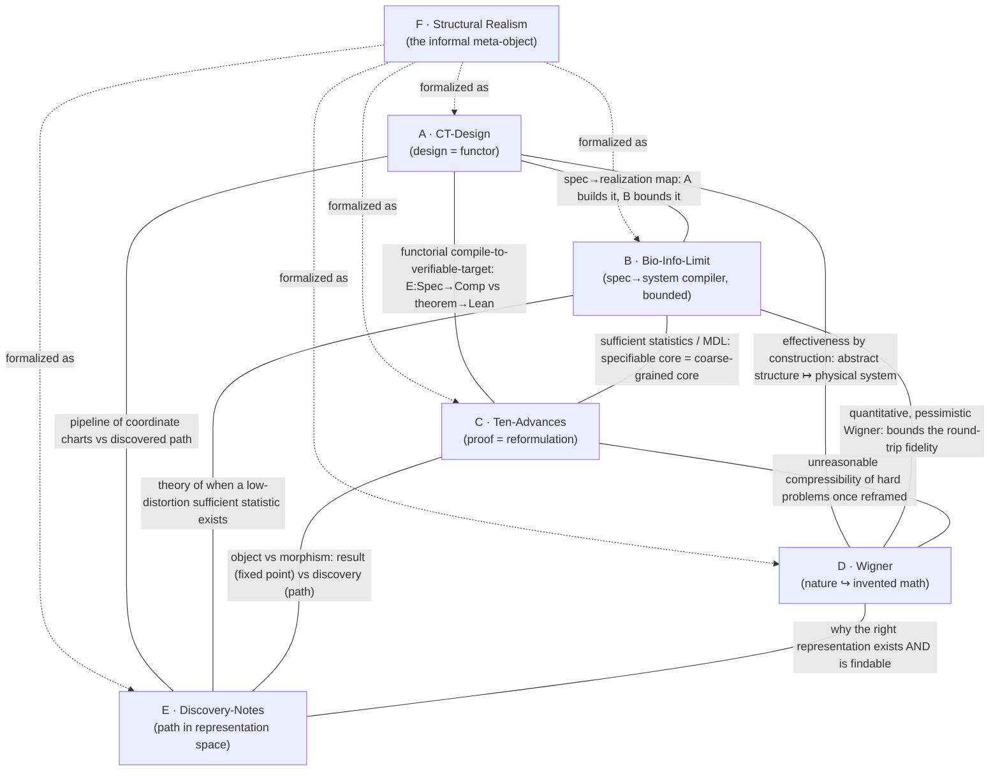

# Latent Structures Meta-Framework

Date: August 3, 2026 (revised same day after primary sources were provided)

Status: **speculative synthesis / conjecture generation.** This note is an
abstraction-hunting exercise, not an empirical result and not a proof. It
optimizes for the deepest unifying abstraction across a set of works rather than
for historical or exegetical accuracy, per the directing prompt. Where existing
terminology is insufficient it coins new language; every coined term is flagged.
This revision is **grounded in the primary texts** — all sources were supplied
directly and read in full (earlier draft worked from a partial retrieval and is
superseded).

Directing question (human director, Jawaun Brown): *find the hidden latent
spaces underpinning, revealed by, and lying between these works — the latent
mathematical structures that generate all of them as different projections of
one object.* The sharper form: not "what mathematics do they use?" but **what
latent space each work treats as the true object of computation.**

The corpus turned out to contain its own answer key. A sixth item — the
director's structural-realist ontology thread (source F) — is very nearly a
natural-language statement of the meta-object the other five works instantiate
from different technical directions. This note formalizes F and exhibits A–E as
its projections.

---

## 1. Source set and provenance

| # | Short name | Work | Provenance |
|---|---|---|---|
| A | **CT-Design** | Category Theory Design (MIT LAMM), `github.com/lamm-mit/CategoryTheoryDesign` + assoc. *J. Mech. Phys. Solids* (2026) | Repo `README.md` (GitHub raw); ScienceDirect article page (image). |
| B | **Bio-Info-Limit** | Kiiskinen, Kivinen & Rivas, *Information-theoretic Limits on Programmatic Specification of Biological Systems*, bioRxiv `10.64898/2026.07.27.740886` (posted 2026-07-30) | **Full PDF read** (23 pp). Stanford Biomedical Data Science + Aalto Math & Systems Analysis. |
| C | **Ten-Advances** | OpenAI, *Ten Advances in Mathematics and Theoretical Computer Science* (Astra model) | `openai/ten-proofs` README (GitHub raw) + the ten problems verbatim from the announcement image. |
| D | **Wigner** | E. Wigner, *The Unreasonable Effectiveness of Mathematics in the Natural Sciences* (1960) | **Full PDF read** (9 pp). |
| E | **Discovery-Notes** | *How the Ideas Came Together: Mathematical Discovery Notes* (AI-authored companion to C) | **Full PDF read.** Confirmed: *"written by an AI model that read the original chains of thought together with the resulting mathematical papers … reconstructs how the proof came together."* The reasoning-walkthrough dual of C. |
| F | **Structural-Realism** | "Digital Rummage" (@feedfracture) X thread, 7/11/26: a 17-part structural-realist ontology ("Reality is fundamentally structural"), explicitly indebted to Michael Levin (@drmichaellevin) | Read from supplied screenshots (IMG_5959–5967). Not peer-reviewed; a framing document / worldview, used as the informal meta-object, not as evidence. |

Earlier draft caveat (now resolved): B, D, and E were previously egress-blocked
and analyzed reconstructively; they are now quotation-grounded. The
reconstruction proved accurate — B's own prose (below) matches the posited
framework closely — which is reassuring but was luck, not method.

---

## 2. Method

For each work we answer the director's ten questions (explicit object; hidden
space actually manipulated; invariants preserved; information discarded;
morphisms; category; coordinate system; distance; latent geometry; what becomes
simpler after re-representation). Then we build the pairwise structure graph
(§4), formalize the meta-object (§5), and show F states it informally (§5.1).

Organizing lens. Every work has a **spec pole** (a compact, manipulable
description — a program, theory, proof, genome, design, symbolic structure) and
a **realization pole** (a high-cardinality system the spec is about — a material,
an organism, a physical referent, a theorem's full content, an instantiated
structure). The recurring claim: **the true object of computation is neither pole
but the map between them**, and intelligence is the search for a spec-pole
coordinate in which a target invariant of the realization pole becomes
*manifest* — a coordinate axis rather than a hidden relation.

---

## 3. The works under the ten-question lens

### A — CT-Design (LAMM)

Explicit object: four categories — `Nat` (biological structural hierarchy),
`Art` (engineered hierarchy), `Spec` (fabrication specification), `Comp`
(machine program) — with functors `F : Nat → Art` (implementation by parameter
substitution), `π : Spec → Art` (verification), `E : Spec → Comp`
(compilation). Application: bio-inspired 4D-printed hygromorphic materials.

| Q | Answer |
|---|---|
| Hidden space | Structure-preserving translations between a biological design logic and a manufacturable one. |
| Invariants preserved | Compositional/hierarchical relations across scales; the stimulus→response functional role survives `F`. |
| Information discarded | Everything about the organism not needed to reproduce the functional response. `F` is lossy on purpose. |
| Morphisms | Cross-scale refinements; the functors between hierarchies. |
| Category | A commuting diagram of four categories; design = choosing functors that commute up to `π`. |
| Coordinate system | The **bundle** (semicolon-delimited `key=value` specs) propagated downstream. |
| Distance | Closeness of engineered response to biological target under `π`. |
| Latent geometry | A fibered poset of scales; a compilation chain `Nat → Art → Spec → Comp`. |
| Simpler after re-representation | Once design is a functor, "bio-inspiration" becomes verifiable, composable construction. |

### B — Bio-Info-Limit (Kiiskinen, Kivinen & Rivas)

Explicit object: an information-theoretic accounting proving *"an organism does
not contain enough organism-specific information to specify its own fully
functioning microscopic organization."* Formal objects: microstate space `Σ`
(finite, Å-scale); genomic channel `g` with Hartley capacity `C_G = 2n`;
environmental channel `U` with capacity `C_E`; runtime randomness `W`; and a
*"universal compiler and physics substrate `Φ`"* — the invariant physical laws
that *"transform sparse specifications into organized microstates,"* carrying no
organism-specific bits. Two axioms (finite capacity, Markovian causal locality);
mixing lemma (initial-condition information decays exponentially).

Central result — **Theorem 1 (coarse-graining threshold):** let `P` be the
lattice of coarse-grainings of `Σ`; there is a threshold antichain `C*` of
maximal capacity-compatible coarse-grainings such that organism-controlled
information of budget `B = C_G + C_E` can specify the trajectory `X_C` at any
resolution *coarser* than `C*` and, by pigeonhole/runtime-randomness, *cannot* at
any finer resolution. Two "faces": a **Shannon face** (`H`, stochastic
generation) and a **Hartley face** (`H_0`, zero-error deterministic
addressability), with `C_0(B) ⊆ C_1(B)`.

| Q | Answer |
|---|---|
| Hidden space | The **channel** from a finite specification to a realized system — development as a rate-limited, many-to-one map. |
| Invariants preserved | The coarse-grained, functionally sufficient description above `C*` (copy numbers, expression states, fate specifications). |
| Information discarded | Microscopic configuration below `C*` (spatial localization, conformational state, exact trajectories) — handed to physics/noise. |
| Morphisms | Coarse-graining surjections `q_{C,C'} : C' → C` on the lattice `P`; entropy-monotone under refinement. |
| Category | The lattice `P` ordered by refinement, with a capacity-bounded realization map; explicitly a **block-spin / real-space renormalization-group** operation (Remark 1). |
| Coordinate system | The sufficient statistic the channel can carry — the genome as *"a blueprint of the ensemble, not of the trajectory."* |
| Distance | Rate–distortion: bits of specification vs distortion of the realized system. |
| Latent geometry | A rate–distortion frontier; a one-way RG ladder of coarse-grainings. |
| Simpler after re-representation | The genome is *"a generator specification rather than a trajectory program"*; specification is *"a form of lossy compression."* |

The paper's own conclusion is, almost verbatim, this note's thesis:
*"Biological function must therefore be organized around **invariants that survive
this compiler-induced residual**, rather than relying on exact microstate
identity."* And: *"The genome specifies the generator. The universal compiler,
operating on the physics substrate, computes the samples. Selection acts on the
statistics of the resulting ensemble."*

### C — Ten-Advances (OpenAI / Astra, results)

Explicit object: ten decade-open problems, each closed and Lean-4-certified.
Verbatim from the announcement: (1) high-dimensional sphere packing — the
asymptotic strength of the **Cohn–Elkies linear program** is determined exactly,
settling the Fourier sign-uncertainty problem asymptotically; (2) binary and
spherical codes improved by exponential factors; (3) an explicit **non-sofic
group** via property-(T) expanders and the binary Leavitt algebra; (4) a
counterexample to **Connes's rigidity conjecture**; (5) permanent
arithmetic-circuit lower bounds `Ω(n² log log n)`; (6) **quantum parallel
repetition** for all finite two-player entangled games; (7) `n^{1/400}` hardness
for the **closest vector problem** via a 3SAT reduction; (8) **Ehrhart's volume
conjecture** `(n+1)^n/n!`; (9) **multicolor Ramsey** `R_k(3) = k^{Θ(k)}`; (10)
disproofs of the Erdős–Simonovits compactness and an Erdős degeneracy conjecture
in extremal graph theory.

| Q | Answer |
|---|---|
| Hidden space | The **space of representations of a problem** — the reformulation under which the theorem becomes reachable (a packing → a Fourier LP; a group question → a self-similar ring). |
| Invariants preserved | Truth of the statement (Lean-certified); the problem's essential content across every reformulation. |
| Information discarded | The original intractable phrasing; dead search directions; everything off the successful path. |
| Morphisms | Reductions, dualities, symmetry/representation-theoretic reparametrizations. |
| Category | Problems and truth-preserving reductions; a proof is a morphism to a certified `True`. |
| Coordinate system | Whatever representation makes the obstruction vanish (modular forms, an irreducible rep, a von Neumann algebra, a lattice basis). |
| Distance | Proof-search cost; reduction distance to a solved anchor. |
| Latent geometry | A landscape over representation-space whose minima are provable phrasings. |
| Simpler after re-representation | Each advance *is* a re-representation collapsing a decade of difficulty to a short certificate. |

### D — Wigner

Explicit object: the claim that mathematics — *"the science of skillful
operations with concepts and rules invented just for this purpose"* — maps onto
physical law with accuracy far exceeding the data any law was fit to (Newton's
law verified to <1e-4; matrix mechanics; complex numbers chosen for
manipulability yet native to QM).

| Q | Answer |
|---|---|
| Hidden space | The space of physical theories expressible in pre-invented mathematical concepts — and the astonishment that reality lands inside it. |
| Invariants preserved | Invariance/symmetry principles as the precondition of physics — *"without invariance principles … physics would not be possible."* |
| Information discarded | The contingent, "unmathematical" residue laws ignore; the boundary conditions bracketed off. |
| Morphisms | The correspondence maps from mathematical structures to measurable regularities. |
| Category | (Implicit) mathematical structures ↔ physical regularities, with an unreasonably good functor between them. |
| Coordinate system | Concepts *"chosen for their amenability to clever manipulations and to striking, brilliant arguments"* — selected for manipulability and beauty, not fit. |
| Distance | The residual between predicted and observed — anomalously near-zero far outside the fitting range. |
| Latent geometry | Unnamed; the essay marks the *existence* of a low-distortion embedding of nature into invented structure as a *"miracle … which we neither understand nor deserve."* |
| Simpler after re-representation | Re-representing nature in invented mathematics makes it predictable — the meta-observation itself. |

### E — Discovery-Notes (companion to C)

Explicit object: a reconstruction, from reasoning traces, of *how* each proof in
C came together — *"which ideas first suggested a path forward, which substantial
approaches encountered genuine obstacles, **what changes of perspective revealed
the underlying structure**."* The section titles are a catalogue of
representation-changes: *"How a packing becomes a Fourier linear program,"* *"The
radial Fourier transform becomes a Mellin reflection,"* *"Two problems with the
same missing degree of freedom,"* *"Why a self-similar ring became the right
playground,"* *"The quadratic Boolean module that makes the carry equivariant."*

| Q | Answer |
|---|---|
| Hidden space | The **trajectory through representation-space** — the path of reframings ending at a provable phrasing. |
| Invariants preserved | The identity of the target theorem across the path; the "why this move" rationale. |
| Information discarded | Abandoned branches; the gap between idealized narrative and the real search. |
| Morphisms | Individual representation-changes (each subsection) — the *arrows* whose endpoints are C's results. |
| Category | The same problem-category as C, but the object of interest is the **path**, not the terminal object. |
| Coordinate system | Successive coordinate charts, each simplifying the next move. |
| Distance | Path/description length of the discovery, not of the result. |
| Latent geometry | A route through C's representation landscape — descent to a minimum. |
| Simpler after re-representation | Discovery itself becomes an object of study: C is the destination, E is the map of the roads. |

### F — Structural-Realism ontology (the director's framing)

A 17-part thread building from *"PRIMITIVE ASSUMPTION: Reality is fundamentally
structural"* through Structure → Instantiation → Causation → Systems →
Complexity → Selection → Agency → Knowledge → Truth → Symbolic Structures →
Symbolic Technologies → Applied Symbolic Causation → Culture → Art → Closing
Proposition. It is not a mathematical work; it is the *worldview* under which the
other five are special cases. Its load-bearing claims:

- **Instantiation is embodiment, not identity.** *"A structure may be
  instantiated in many substrates … The substrate changes. The structure remains
  recognisably itself."* (= substrate-independence / multiple realizability; the
  invariant preserved under realization.)
- **Knowledge = preserved relations, not reproduction.** *"A model does not
  reproduce reality. It preserves those relations necessary for successful
  navigation … No model exhausts reality. Some nevertheless preserve more
  consequential relations than others."* (= lossy compression with a task-relevant
  distortion measure.)
- **Truth = invariance across independent contexts.** *"A model approaches truth
  to the extent that the structures it identifies remain invariant across contexts
  whose criteria of success are independent of the model itself, and continue to
  support reliable navigation and action."* (= the Manifest-Invariant Principle of
  §5; also this repo's *weakness* criterion.)
- **Symbolic structures are the fixed points.** *"Destroy a book and the story
  may survive. Erase one proof and the theorem remains. The pattern persists
  beyond any individual instance."* (= `T`-algebras / the object-vs-morphism split
  of C vs E: *erase the proof (E), the theorem (C) remains*.)
- **Boundaries are chosen coarse-grainings.** *"Every apparent boundary is a
  practical distinction rather than an ontological absolute."* (= B's partitions of
  `Σ`; the coarse-graining is a modeling choice.)
- **Closing proposition = the passive→active transition.** The thread declares
  itself *"an attempt to instantiate a symbolic structure capable of altering the
  conditions of its own future embodiment,"* to be judged by *"whether the
  structures it identifies remain invariant under tests whose criteria it does not
  itself define."* A structure that maintains its own future embodiment is exactly
  an *active, self-re-representing* system — the threshold this repo calls
  passive→active.

---

## 4. Pairwise structure graph

Nodes are the six works; F is drawn central because A–E are its projections. Among
the five technical works A–E all ten possible edges are non-trivial, and every one
is a variant of a single thing — *a compression / re-representation map between a
spec pole and a realization pole*. That the A–E subgraph is complete, with one
structure recurring on every edge, is the evidence for a single generating object;
F is that object stated in prose.

Edge dossier for the A–E core (the shared latent structure on each edge):

| Edge | Shared latent structure |
|---|---|
| A–B | The **specification→realization map** itself. A *constructs* it (`Nat→Art→Spec→Comp`); B gives the *capacity theorem* for the same channel and independently calls the physical substrate a *"universal compiler"* — the same compiler metaphor A encodes as `E : Spec → Comp`. Constructive vs impossibility, one object. |
| A–C | **Compile-to-a-verifiable-target.** A's `E : Spec → Comp` (checked by `π`) has the shape of C's theorem → Lean certificate. Design and proof are both functorial descent to a checkable object. |
| A–D | **Effectiveness made constructive.** A enacts Wigner's miracle: compositional mathematics mapped onto a fabricated material with the functional invariant preserved. |
| A–E | **Representation as a chain of charts.** A is a *fixed* pipeline of coordinate changes; E is a *discovered* one. Same type, different provenance. |
| B–C | **Sufficient statistics / MDL.** B: microscopic state is not specifiable beyond a coarse core. C: a decade-hard theorem compresses to a short certificate once reframed. Both about the gap between description length and system complexity. |
| B–D | **Round-trip fidelity.** B *bounds* how faithfully a compact description reconstructs its system (§5's counit gap `ε`); D *marvels* that it is faithful at all. Same quantity, opposite affect. |
| B–E | **Existence vs instance of a low-distortion statistic.** B is the theory of when a compact sufficient statistic exists; E logs an instance of finding one (a proof's essential kernel). |
| C–E | **Object vs morphism — the categorical core.** C = terminal certificates (fixed points); E = the discovery path (morphisms). Two halves of one artifact, related as `Ob` to `Hom`. F states it: *"erase one proof and the theorem remains."* Sharpest edge. |
| C–D | **Unreasonable compressibility.** C is Wigner's miracle inside pure mathematics; the winning representations are the symmetry-rich, "beautiful" ones (Fourier/modular, representation theory, operator algebras). |
| D–E | **Epistemology of representation-finding.** D asks *why* a low-distortion representation exists and is *findable*; E is the empirical record that answers the second half — discovery is navigation of representation-space, and it converges. |

F's edges (F as the prose statement each technical work realizes):

| Edge | F says … | realized by |
|---|---|---|
| F–A | *structure is substrate-independent, causal via instantiation* | A's `F : Nat → Art` carrying structure across substrates |
| F–B | *knowledge preserves consequential relations; boundaries are practical coarse-grainings* | B's threshold `C*` and lossy-compression genome |
| F–C | *symbolic structures persist beyond any instance* | C's Lean-certified theorems (fixed points) |
| F–D | *the same relation exists as thought, ink, silicon, orbital mechanics* | D's multiple-realizability miracle |
| F–E | *truth = invariance across independent tests; art/inquiry instantiates structure for encounter* | E's search for the invariant-revealing representation |

---

## 5. The meta-framework: the Representation Adjunction

**Claim.** All six works are projections of one object: an *adjunction* between a
category of specifications and a category of realizations, graded by a distortion
budget. Intelligence, discovery, effectiveness, developmental specification,
functorial design, and structural realism are facets of manipulating this
adjunction.

Let **Spec** be a category of compact descriptions (programs, theories, proofs,
genomes, design bundles, symbolic structures) and **Sys** a category of realized
systems (materials, organisms, physical referents, full theorem content,
instantiated structures). Posit two functors:

- `R : Spec → Sys` — **realize** (decompress / instantiate / develop /
  fabricate). = A's executed `Nat→Art→Spec→Comp`; B's *"universal compiler"* `Φ`
  compiling `g` into an ensemble; C/E's instantiation of a phrasing's full
  content; D's nature-as-referent; F's *instantiation*.
- `C : Sys → Spec` — **coarse-grain** (compress / abstract / observe / model). =
  B's threshold projection `S ↦ X_C`; C/E's reduction of a problem to its provable
  kernel; D's embedding of nature into invented concepts; A's reading of a
  biological hierarchy into a bundle; F's *knowledge = preserved relations*.

Take `R ⊣ C` (realize left-adjoint to coarse-grain), so
`Sys(R s, y) ≅ Spec(s, C y)`. Two canonical maps carry the whole synthesis:

- **Unit** `η_s : s → C(R(s))`. Round-trip a specification through realization and
  back; its failure to be iso — the **unit defect** — is *exactly* B's threshold
  theorem: below `C*`, a genome cannot recover (address) the microstate of the
  system it specifies. B measures `‖η defect‖` and proves it bounded below by
  `H_0(X_{C'} | b) − B`.
- **Counit** `ε_y : R(C(y)) → y`. Coarse-grain a system, re-realize the model,
  compare to the world; the nearness of `ε` to iso — the **counit gap** — is
  *exactly* D's miracle and F's *truth = invariance across independent contexts*.
  D marvels the gap is small; B is the pessimistic cousin bounding when it must be
  large; F makes small-gap-across-independent-tests the *definition* of truth.

Coined vocabulary (existing terminology was insufficient):

- **Coarse-graining monad** `T = C ∘ R : Spec → Spec`. Its algebras are the
  **stable representations** — the fixed points that survive round-tripping. A
  *sufficient statistic*, a *conserved quantity*, an *irreducible representation*,
  a *provable phrasing*, and F's *symbolic structures that persist beyond any
  instance* are all `T`-algebras. B's monad is literally a renormalization-group
  block-spin map; its algebras are the descriptors above `C*`.
- **Manifest-Invariant Principle** (the unifying claim): *for a finite adaptive
  system the true object of computation is the adjunction `R ⊣ C`, not either pole;
  intelligence is the search over objects of **Spec** for a coordinate in which the
  task-relevant component of the counit `ε` becomes an isomorphism — the
  representation in which the target invariant is a coordinate axis rather than a
  hidden relation.* "Finding the right representation in which hidden invariants
  become obvious" *is* finding the `Spec`-object where `ε` restricted to the task
  sub-object is iso. F states this in words; C/E enact it; D observes that such
  objects exist and are unreasonably compact; B bounds which sub-objects can be
  made manifest at budget `B`.
- **Representation search**: functor/gradient flow on the object-space of **Spec**
  minimizing counit distortion on a declared task sub-object. C is an automated
  instance; E is its logged trajectory; A is a hand-designed geodesic.

Projection table:

| Work | Projection of the adjunction `R ⊣ C` |
|---|---|
| A · CT-Design | An engineered factorization of `R` (`Nat→Art→Spec→Comp`), `π` verifying a chosen coordinate keeps the functional invariant manifest. |
| B · Bio-Info-Limit | The **capacity theorem for the unit `η`** — a lower bound on the unit defect of the develop-then-observe round trip, with Shannon and Hartley faces. |
| C · Ten-Advances | **Representation search over Spec** driving the task-relevant counit gap to zero (a provable phrasing); Lean certifies the resulting `T`-algebra. |
| D · Wigner | The empirical observation that the **counit gap is unreasonably small** for physics. |
| E · Discovery-Notes | The **path** of representation search — `Spec`-morphisms whose terminus is C's fixed points. |
| F · Structural-Realism | The **prose statement of the whole adjunction**: structure (Spec-object), instantiation (`R`), knowledge (`C`), truth (near-iso `ε` across independent contexts), symbolic structures (`T`-algebras), the passive→active closing proposition. |

### 5.1 Passive vs active — and F's self-referential closing

The passive/active axis (this repo's standing question) drops out. A **passive**
representation is merely a `T`-algebra: a fixed point that sits there. An
**active** one is a `T`-algebra that also *runs `R` and `C` in a closed loop and
maintains its own coarse-graining* — an autopoietic, self-re-representing system.
The threshold from representation to agency is where a system starts optimizing
its own counit gap online.

F's closing proposition is precisely an active `T`-algebra describing itself: *"a
symbolic structure capable of altering the conditions of its own future
embodiment."* F even supplies the acceptance test — *invariance under independent
tests* — i.e. a small counit gap that the structure did not itself define. This
is the same passive→active boundary named in
`notes/geometric_convergence_research_synthesis.md`, now with a categorical home
and an explicit falsifiable criterion.

---

## 6. Contact with existing evidence in this repo

- **Weakness beats MDL (`experiments/symbolic_weakness`).** The flagship result:
  *symmetry-compatible-hypothesis weakness* predicts OOD generalization where
  simplicity/MDL/compression do not. MDL is a property of the **unit** (how short
  the spec is); weakness is a property of the **counit over a broad task
  sub-object** (how much of the realization stays near-iso across many futures).
  The Manifest-Invariant Principle predicts exactly this ordering, and F states it
  independently: *truth = invariance across contexts whose criteria are independent
  of the model* is weakness, not brevity.
- **Rate–distortion for reward deformation (`notes/reward_deformation_ratedistortion.md`, Paper B).**
  A value signal warping a learned code's induced metric is a reweighting of the
  distortion measure defining `C`; "concern deforms representation" = "the task
  sub-object on which we demand a small counit gap gets reweighted."
- **Michael Levin lineage.** F is explicitly indebted to Levin; this repo already
  cites Levin-adjacent work (TAME, "virtual governor" alignment, Webb–Miolane
  geometry-of-consciousness). B likewise locates bioelectric/morphogenetic fields
  *"at the ensemble level above `C*`"* — the same active-coarse-graining register.
  The corpus and the repo share a source lineage, not just a rhyme.
- **Geometry as the portable language of constraints (README thesis).** `T`-
  algebras are described by what they preserve — distances, neighborhoods,
  invariants — which is the geometry of the sub-object kept iso by `ε`.

---

## 7. Falsifiable predictions (for promotion beyond conjecture)

1. **Counit-gap generalization law.** A direct estimator of the task-restricted
   counit gap (round-trip `R∘C` fidelity on held-out task-relevant structure)
   should predict OOD generalization at least as well as weakness, and strictly
   better than MDL/description-length, across the repo's symbolic/neural benchmarks.
   A short spec with a large counit gap generalizing as well as a weak one with a
   small gap would falsify the principle.
2. **Unit-defect floor (direct B test).** In a controlled specification→realization
   simulator, no compression scheme should push realized-state recovery below B's
   `H_0(X_{C'} | b) − B` bound; a hard floor independent of program cleverness
   corroborates the unit interpretation. B's own AlphaFold / syn3A / stochastic-
   network checks are the biological instance.
3. **Discovery = descent in representation-space.** In E's traces, the sequence of
   reframings should be measurable as (near-)monotone descent of the task-restricted
   counit gap. Persistent non-descent trajectories that still succeed would falsify
   the "geodesic in Spec" reading.

Pre-registration-ready gates, not claims. Route through the
`scientific-discovery-regime-audit` skill before any sweep.

---

## 8. Limitations and rejected alternatives

- **The adjunction is posited, not proven.** `R ⊣ C` is a *modeling choice* that
  organizes the works; for any given pair the functors are only sketched, and
  whether a genuine adjunction (vs a looser Galois-connection-flavored pair) holds
  is open. Flagged under the `AGENTS.md` mathematical-claim gate: **not** promoted
  to a theorem. B's actual object is a rate–distortion/capacity threshold on a
  Markov channel; casting it as a categorical unit defect is interpretation, and
  the interpretation must not be cited as if it were B's theorem.
- **Source F is a worldview, not evidence.** F is a non-peer-reviewed X thread
  stating the director's structural realism. It is used as the *framing* the other
  works instantiate; it does not license any empirical claim, and its coherence is
  something the note asserts, not demonstrates. A skeptical reply on the thread
  itself (*"the topic is about science, not philosophy or metaphysics"*) is worth
  preserving as the standing objection.
- **Rejected — "it's all just information theory."** Keep B's rate–distortion
  frame, drop the categorical structure. Rejected: it loses the object/morphism
  distinction that is the entire content of the C–E edge and of A's functorial
  design (and F's *erase the proof, the theorem remains*).
- **Rejected — "it's all just category theory."** Drop the distortion grading,
  keep only functors. Rejected: it loses B and D entirely, both of which are about
  *how much* is preserved — a metric fact. The distortion grading is load-bearing.
- **Convergence is not identity.** The claim is not that these systems are the
  same, but that the same *form of explanation* — search for the coordinate that
  makes an invariant manifest — keeps winning, because all six face one problem:
  preserve the right distinctions while discarding almost everything.

---

## 9. One-line synthesis

Across a materials-design functor, a proven bound on genomic specification, ten
machine-found proofs, Wigner's miracle, the notes on how those proofs came
together, and a structural-realist ontology, the single latent object is the
**adjunction between description and system**: its **unit defect** is the biology
theorem, its **counit gap** is Wigner's miracle and F's definition of truth, its
**fixed points** are the theorems and the designs and F's persisting symbolic
structures, and the **search for a coordinate that makes an invariant manifest**
is what all six works call, in their different dialects, *intelligence*.
