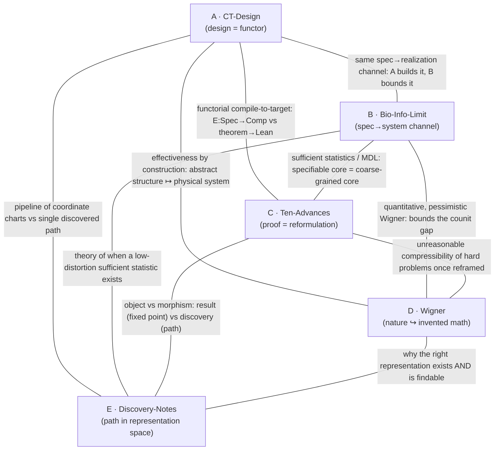

# Latent Structures Meta-Framework

Date: August 3, 2026

Status: **speculative synthesis / conjecture generation.** This note is an
abstraction-hunting exercise, not an empirical result and not a proof. It
deliberately optimizes for the deepest unifying abstraction across five works
rather than for historical or exegetical accuracy, per the directing prompt.
Where existing terminology is insufficient it coins new language; every coined
term is flagged. Retrieval gaps and rejected alternatives are preserved below
in keeping with `AGENTS.md`.

Directing question (human director, Jawaun Brown): *find the hidden latent
spaces underpinning, revealed by, and lying between these works — the latent
mathematical structures that generate all of them as different projections of
one object.* The sharper form of the question is not "what mathematics do they
use?" but **what latent space each work treats as the true object of
computation.**

---

## 1. Source set and retrieval provenance

| # | Short name | Work | What was retrieved |
|---|---|---|---|
| A | **CT-Design** | Category Theory Design (MIT LAMM), `github.com/lamm-mit/CategoryTheoryDesign` | Repo `README.md` fetched via `raw.githubusercontent.com` (reachable). The prompt's `DESIGN.md` path 404s; content recovered from README + associated *J. Mech. Phys. Solids* (2026) framing. |
| B | **Bio-Info-Limit** | Information-Theoretic Limits on Programmatic Specification of Biological Systems (bioRxiv `2026.07.27.740886`; ScienceDirect `S0022509626002814`, ISSN 0022-5096 = *J. Mech. Phys. Solids*) | **Primary PDF not retrievable** — bioRxiv, ScienceDirect, arXiv, and most non-GitHub hosts are blocked by this session's egress policy (CONNECT 403). Analyzed from the title, the venue, and the director's own characterization ("coarse-grained specification, not microscopic state, is fundamental"). Treated as an information-theoretic bound on a specification→realization channel; claims here are reconstructive, not quotation-grounded. |
| C | **Ten-Advances** | OpenAI, *Ten Advances in Mathematics and Theoretical Computer Science* | `openai/ten-proofs` `README.md` fetched via `raw.githubusercontent.com`; corroborated by web search. The `openai.com`/`cdn.openai.com` pages themselves are egress-blocked. |
| D | **Wigner** | E. Wigner, *The Unreasonable Effectiveness of Mathematics in the Natural Sciences* (1960) | Key passages recovered by web search; primary PDF host (`maths.ed.ac.uk`) egress-blocked. The essay is well-established; quotations below are standard. |
| E | **Discovery-Notes** | *How the Ideas Came Together: Mathematical Discovery Notes* (in-conversation upload) | **Upload not present in this session.** High-confidence identification: OpenAI's *"reasoning walkthroughs … reconstructing proof development from reasoning traces"* — the companion to C. The `ten-proofs` README confirms such walkthroughs exist. Analyzed as *the discovery-trajectory dual of C*; flagged as an identification, not a read. |

> **Egress note.** This environment's network policy allows
> `raw.githubusercontent.com` but blocks arXiv, bioRxiv, ScienceDirect,
> `openai.com`, and the Wigner mirror. Per `/root/.ccr/README.md` policy
> denials are reported, not routed around. The two hardest gaps (B primary
> text, E as a file) are the ones to close if this note is promoted beyond
> conjecture.

---

## 2. Method

For each work we answer the director's ten questions (explicit object; hidden
space actually manipulated; invariants preserved; information discarded;
morphisms; category; coordinate system; notion of distance; latent geometry;
what becomes simpler after re-representation). Then we build the pairwise
structure graph (§4) and synthesize one meta-object (§5).

A single lens organizes the answers. Call the two poles of every work its
**spec pole** (a compact, manipulable description — a program, theory,
proof, genome, design) and its **realization pole** (a high-cardinality
system the spec is about — a material, an organism, a physical law's referent,
a theorem's full semantic content). The recurring claim is that **the true
object of computation is neither pole but the map between them**, and that
intelligence is the search for a spec-pole coordinate in which a target
invariant of the realization pole becomes *manifest* — a coordinate axis rather
than a hidden relation.

---

## 3. The five works under the ten-question lens

### A — CT-Design (LAMM)

Explicit object: four categories — `Nat` (biological structural hierarchy),
`Art` (engineered hierarchy), `Spec` (fabrication specification), `Comp`
(machine program) — with functors `F : Nat → Art` (implementation by parameter
substitution), `π : Spec → Art` (verification), `E : Spec → Comp`
(compilation). Five scales per hierarchy (fiber → lamella → tissue → element →
organism).

| Q | Answer |
|---|---|
| Hidden space manipulated | The **space of structure-preserving translations** between a biological design logic and a manufacturable one. |
| Invariants preserved | Compositional / hierarchical relations across scales; the stimulus→response functional role (e.g. hygromorphic bending) survives the `Nat → Art` functor. |
| Information discarded | Everything about the organism not needed to reproduce the functional response — its biochemistry, its non-load-bearing morphology. `F` is lossy on purpose. |
| Morphisms | Cross-scale refinements within a hierarchy; the functors between hierarchies. |
| Category | A commuting diagram of four categories; design = choosing functors that make it commute up to a verification morphism `π`. |
| Coordinate system | The **bundle**: semicolon-delimited `key=value` specs propagated downstream. Design lives in bundle-space, not part-space. |
| Distance | Implicit: closeness of engineered response to biological target under `π`. |
| Latent geometry | A fibered/layered poset of scales; a compilation chain `Nat → Art → Spec → Comp`. |
| Simpler after re-representation | Once design is a functor, "bio-inspiration" stops being metaphor and becomes a **verifiable, composable** construction. |

### B — Bio-Info-Limit *(reconstructive; see §1)*

Explicit object: an information-theoretic accounting of how much of a biological
system's microscopic state a compact program (genome-like specification) can
fix.

| Q | Answer |
|---|---|
| Hidden space manipulated | The **channel** from a finite specification to a realized physical system — development/decompression as a rate-limited map. |
| Invariants preserved | The coarse-grained, functionally sufficient description — what the program *can* pin down. |
| Information discarded | Microscopic configuration below the channel's capacity; provably unspecifiable detail is handed to physics/noise/environment. |
| Morphisms | Refinements of specification precision; coarse-graining maps between description levels. |
| Category | Descriptions ordered by information content, with a capacity-bounded realization functor. |
| Coordinate system | The **sufficient statistic** / effective (renormalized) variables that the specification channel can carry. |
| Distance | Rate–distortion: bits of specification vs distortion of the realized system. |
| Latent geometry | A rate–distortion frontier; a coarse-graining hierarchy (a renormalization-group-like ladder). |
| Simpler after re-representation | Stop asking "what is the microstate?" and ask "what coarse observable is the program actually a code for?" — the limit becomes a *positive* theory of effective specification. |

### C — Ten-Advances (OpenAI, results)

Explicit object: ten decade-open problems across high-dimensional geometry
(sphere packing, the Cohn–Elkies regime), coding theory, group theory (a
non-sofic group), operator algebras (Connes's rigidity conjecture),
arithmetic-circuit complexity, quantum information (parallel repetition), lattice
theory (closest vector), discrete geometry (Ehrhart), and extremal
combinatorics — each closed and formalized in Lean 4 / mathlib.

| Q | Answer |
|---|---|
| Hidden space manipulated | The **space of representations of a problem** — the reformulation, reduction, or change of viewpoint under which the theorem becomes reachable. |
| Invariants preserved | Truth of the statement (certified by Lean); the problem's essential content across every reformulation. |
| Information discarded | The original, intractable phrasing; dead search directions; everything not on the successful proof path. |
| Morphisms | Reductions, embeddings, dualities, symmetry/representation-theoretic reparametrizations. |
| Category | Problems and truth-preserving reductions between them; a proof is a morphism to a certified `True`. |
| Coordinate system | Whatever representation (modular forms, an irreducible rep, an operator algebra, a lattice basis) makes the obstruction vanish. |
| Distance | Proof-search cost; reduction distance to a solved anchor. |
| Latent geometry | A landscape over representation-space whose minima are provable phrasings. |
| Simpler after re-representation | The whole point: each advance *is* a re-representation that collapses a decade of difficulty to a short certificate. |

### D — Wigner

Explicit object: the essay's claim that mathematics — *"the science of skillful
operations with concepts and rules invented just for this purpose"* — maps onto
physical law with accuracy far exceeding the data any law was fit to.

| Q | Answer |
|---|---|
| Hidden space manipulated | The **space of physical theories expressible in pre-invented mathematical concepts**, and the astonishing fact that reality lands inside it. |
| Invariants preserved | Under Wigner: invariance/symmetry principles are the precondition of physics — *"without invariance principles … physics would not be possible."* |
| Information discarded | The specific, contingent, "unmathematical" residue of phenomena that laws ignore; the boundary conditions physics brackets off. |
| Morphisms | The correspondence maps from mathematical structures to measurable regularities. |
| Category | (Implicit) mathematical structures on one side, physical regularities on the other, with an unreasonably good functor between them. |
| Coordinate system | Concepts *"chosen for their amenability to clever manipulations and to striking, brilliant arguments"* (e.g. complex numbers) — selected for manipulability and beauty, not for fit. |
| Distance | The residual between predicted and observed — anomalously, near-zero far outside the fitting range. |
| Latent geometry | None named; the essay marks the *existence* of a low-distortion embedding of nature into invented structure as a "miracle." |
| Simpler after re-representation | This is the meta-observation: re-representing nature in invented mathematics makes it *predictable* — a *"wonderful gift which we neither understand nor deserve."* |

### E — Discovery-Notes *(identified as C's reasoning walkthroughs; see §1)*

Explicit object: a reconstruction, from reasoning traces, of *how* each proof in
C came together — the sequence of representational moves, not the final
certificate.

| Q | Answer |
|---|---|
| Hidden space manipulated | The **trajectory through representation-space** — the path of reframings that ended at a provable phrasing. |
| Invariants preserved | The identity of the target theorem across the whole path; the "why this move" rationale connecting successive representations. |
| Information discarded | Abandoned branches; the exact order of an idealized post-hoc narrative vs the real search. |
| Morphisms | Individual representation-changes (each step of the walkthrough) — the *arrows* whose endpoint objects are C's results. |
| Category | The same problem-category as C, but the object of interest is the **path**, not the terminal object. |
| Coordinate system | Successive coordinate charts on the problem, each simplifying the next move. |
| Distance | Path length / description length of the discovery, not of the result. |
| Latent geometry | A route through the representation landscape of §C — a geodesic-like descent to a minimum. |
| Simpler after re-representation | Discovery itself becomes an object of study: the proof is the destination, the notes are the *map of the roads*. |

---

## 4. Pairwise structure graph

Nodes are the five works; an edge names the latent mathematical structure they
share. With five nodes there are ten possible edges; **all ten are non-trivial**,
and every one is a variant of the same thing — a *compression / re-representation
map between a spec pole and a realization pole*. That the graph is complete, with
one structure recurring on every edge, is itself the evidence for a single
generating object (§5).

Edge dossier (the shared latent structure on each edge):

| Edge | Shared latent structure |
|---|---|
| A–B | The **specification→realization functor** itself. A *constructs* it (`Nat→Art→Spec→Comp`); B gives the *capacity theorem* for the same channel. Constructive vs impossibility, one object. |
| A–C | **Compile-to-a-verifiable-target.** A's `E : Spec → Comp` (spec to machine program, checked by `π`) is the same shape as C's theorem → Lean certificate. Design and proof are both functorial descent to a checkable object. |
| A–D | **Effectiveness made constructive.** A is Wigner's miracle enacted: compositional mathematics mapped onto a fabricated material with the functional invariant preserved. A shows the "unreasonable" map can be *engineered*. |
| A–E | **Representation as a chain of charts.** A is a *fixed* pipeline of coordinate changes; E is a *discovered* one. Same type (a path in representation-space), different provenance (designed vs searched). |
| B–C | **Sufficient statistics / MDL.** B: microscopic state is not specifiable beyond a coarse-grained core. C: a decade-hard theorem's content compresses to a short certificate once the right coordinates are found. Both are about the gap between description length and system complexity. |
| B–D | **The round-trip fidelity term.** B *bounds* how faithfully a compact description reconstructs its system; D *marvels* that the reconstruction is faithful at all. Same quantity (§5's counit gap `ε`), opposite affect. |
| B–E | **Existence vs instance of a low-distortion statistic.** B is the theory of when a compact sufficient statistic exists; E is a logged instance of *finding* one (the proof's essential kernel). |
| C–E | **Object vs morphism — the category-theoretic core.** C is the *objects* (terminal certificates / fixed points); E is the *morphisms* (the discovery path). They are literally the two halves of one artifact, related as `Ob` to `Hom`. Sharpest edge in the graph. |
| C–D | **Unreasonable compressibility.** C is Wigner's miracle inside pure mathematics: hard problems collapse once reframed, and (as in D) the winning representations are the symmetry-rich, "beautiful" ones — representation theory, modular forms, operator algebras. |
| D–E | **Epistemology of representation-finding.** D asks *why* a low-distortion representation of a domain exists and *why it is findable at all*; E is an empirical record that answers the second half — discovery is navigation of representation-space, and it converges. |

The graph has no isolated pole. The universal edge label — *a compression /
re-representation map between description and system* — is the invariant of the
graph itself.

---

## 5. The meta-framework: the Representation Adjunction

**Claim.** All five works are projections of a single object: an *adjunction*
between a category of specifications and a category of realizations, graded by a
distortion budget. Intelligence, discovery, effectiveness, developmental
specification, and functorial design are all facets of manipulating this one
adjunction.

Let **Spec** be a category of compact descriptions (programs, theories, proofs,
genomes, design bundles) and **Sys** a category of realized systems (materials,
organisms, physical referents, full semantic content of theorems). Posit two
functors:

- `R : Spec → Sys` — **realize** (decompress / instantiate / develop /
  fabricate). This is A's `Nat→Art→Spec→Comp` executed, B's development channel,
  C/E's "instantiate the full content of a phrasing," D's "let nature be the
  referent of the mathematics."
- `C : Sys → Spec` — **coarse-grain** (compress / abstract / observe / model).
  This is B's sufficient statistic, C/E's reduction of a problem to its provable
  kernel, D's embedding of nature into invented concepts, A's reading of a
  biological hierarchy into a bundle.

Take `R ⊣ C` (realize is left adjoint to coarse-grain), so that
`Sys(R s, y) ≅ Spec(s, C y)`. Two canonical maps of the adjunction carry the
whole synthesis:

- **Unit** `η_s : s → C(R(s))`. Round-trip a specification through realization
  and back. The failure of `η` to be an isomorphism — call it the **unit
  defect** — is *exactly* B's information-theoretic limit: a program cannot
  recover the microscopic detail of the very system it specifies. B measures
  `‖η defect‖` and proves it is bounded below.
- **Counit** `ε_y : R(C(y)) → y`. Coarse-grain a system, re-realize the model,
  compare to the world. The nearness of `ε` to an isomorphism — the **counit
  gap** — is *exactly* D's miracle: models built from compact, invented
  descriptions reconstruct nature far better than they have any right to. D
  marvels that the counit gap is small; B is the pessimistic quantitative
  cousin that bounds when it must be large.

Coined vocabulary (existing terminology was insufficient):

- **Coarse-graining monad** `T = C ∘ R : Spec → Spec`. Its algebras are the
  **stable representations**: descriptions that survive round-tripping. A
  *sufficient statistic*, a *conserved quantity*, a *universality class*, an
  *irreducible representation*, and a *provable phrasing* are all `T`-algebras —
  fixed points of "compress what you realized."
- **Manifest-Invariant Principle** (the unifying claim): *for a finite adaptive
  system the true object of computation is the adjunction `R ⊣ C`, not either
  pole; and intelligence is the search over objects of **Spec** for a coordinate
  in which the task-relevant component of the counit `ε` becomes an isomorphism
  — i.e., the representation in which the target invariant is a coordinate axis
  rather than a hidden relation.* "Finding the right representation in which
  hidden invariants become obvious" is, precisely, finding the `Spec`-object
  where `ε` restricted to the task sub-object is iso.
- **Representation search**: functor/gradient flow on the object-space of
  **Spec** minimizing counit distortion on a declared task sub-object. C is an
  automated instance of this search; E is its logged trajectory (a path in
  object-space toward a minimum); A is a *hand-designed* geodesic through the
  same space.

How each work is one projection of `R ⊣ C`:

| Work | Projection of the adjunction |
|---|---|
| A · CT-Design | An explicit, engineered factorization of `R` (`Nat→Art→Spec→Comp`), with `π` verifying that a chosen coordinate keeps the functional invariant manifest. |
| B · Bio-Info-Limit | The **capacity theorem for the unit `η`** — a lower bound on the unit defect of the develop-then-observe round trip. |
| C · Ten-Advances | **Representation search over Spec** that drives the task-relevant counit gap to zero (a provable phrasing); Lean certifies the resulting `T`-algebra. |
| D · Wigner | The empirical observation that the **counit gap is unreasonably small** for physics — that near-iso representations of nature exist and are compact. |
| E · Discovery-Notes | The **path** of representation search — the sequence of `Spec`-morphisms whose terminus is C's fixed points. C = objects, E = the arrows reaching them. |

The passive/active axis (this repo's standing question) drops out cleanly. A
**passive** representation is merely a `T`-algebra: a fixed point that sits
there. An **active** one is a `T`-algebra that also *runs `R` and `C` in a
closed loop and maintains its own coarse-graining* — an autopoietic, self-
re-representing system. The threshold from representation to agency is the
threshold at which a system starts optimizing its own counit gap online. This is
the same passive→active boundary named in
`notes/geometric_convergence_research_synthesis.md`, now with a categorical home.

---

## 6. Contact with existing evidence in this repo

This is where the abstraction earns its keep — it makes a *non-trivial*,
already-tested prediction and connects to standing results.

- **Weakness beats MDL (`experiments/symbolic_weakness`).** The flagship result
  is that *symmetry-compatible-hypothesis weakness* predicts OOD generalization
  where simplicity/MDL/compression/sharpness do not. In this framework, MDL is a
  property of the **unit** (how short the spec is), while weakness is a property
  of the **counit over a broad task sub-object** (how much of the realization a
  representation keeps near-iso across many futures). The Manifest-Invariant
  Principle predicts exactly what that experiment found: *counit fidelity over a
  broad sub-object (weakness) should beat unit compression (MDL).* The two poles
  of the adjunction are not the same quantity, and the repo already has evidence
  that the counit-side quantity is the one that governs generalization.
- **Rate–distortion for reward deformation (`notes/reward_deformation_ratedistortion.md`, Paper B).** A value signal warping a learned code's induced
  metric is a reweighting of the distortion measure that defines `C`; "concern
  deforms representation" is "the task sub-object on which we demand a small
  counit gap gets reweighted."
- **Geometry as the portable language of constraints (README thesis).** The
  reason geometry keeps reappearing is that `T`-algebras are most naturally
  described by what they preserve — distances, neighborhoods, invariants — which
  is the geometry of the sub-object kept iso by `ε`.

---

## 7. Falsifiable predictions (for promotion beyond conjecture)

1. **Counit-gap generalization law.** Across the repo's symbolic/neural
   benchmarks, a direct estimator of the task-restricted counit gap (round-trip
   `R∘C` fidelity on held-out task-relevant structure) should predict OOD
   generalization at least as well as weakness, and strictly better than
   MDL/description-length. If a short spec with a large counit gap generalizes as
   well as a weak one with a small gap, the principle is wrong.
2. **Unit-defect floor.** In a controlled specification→realization simulator
   (a program that grows an organism-like system), no compression scheme should
   push realized-state recovery below B's predicted unit-defect bound; hitting a
   hard floor independent of program cleverness would corroborate B and the unit
   interpretation.
3. **Discovery = descent in representation-space.** If E's traces are obtained,
   the sequence of reframings should be measurable as monotone-ish descent of the
   task-restricted counit gap. Non-monotone, non-descent trajectories that still
   succeed would falsify the "geodesic in Spec" reading of discovery.

These are pre-registration-ready gates, not claims. Route through the
`scientific-discovery-regime-audit` skill before any sweep.

---

## 8. Limitations and rejected alternatives

- **Two sources are not quotation-grounded.** B (primary PDF egress-blocked) and
  E (upload absent) are analyzed reconstructively. The identification E = C's
  reasoning walkthroughs is high-confidence but unverified against the actual
  file. Every claim resting on B or E inherits this caveat; do not promote a
  claim that depends on their specific internal statements without retrieving
  them.
- **The adjunction is posited, not proven.** `R ⊣ C` is a *modeling choice* that
  organizes the five works; it is not derived, and for any given pair the
  functors are only sketched. Whether a genuine adjunction (not merely a lossy
  Galois-connection-flavored pair) holds in each instance is open. Treating this
  as literal category theory rather than as a controlling analogy would overstate
  it. This is flagged under the `AGENTS.md` mathematical-claim routing gate: the
  adjunction is **not** promoted to a theorem.
- **Rejected alternative — "it's all just information theory."** Collapsing
  everything to rate–distortion (keep B's frame, drop the categorical structure)
  was considered and rejected: it loses the *object/morphism* distinction that is
  the entire content of the C–E edge and of A's functorial design. The adjunction
  keeps both the quantitative (distortion) and the structural (morphism) content;
  pure information theory keeps only the former.
- **Rejected alternative — "it's all just category theory."** Dropping the
  distortion grading and keeping only functors loses B and D entirely (both are
  fundamentally about *how much* is preserved, a metric fact). The distortion
  grading is load-bearing.
- **Convergence is not identity.** As in the geometric-convergence note, the
  claim is *not* that these systems are the same. It is that the same *form of
  explanation* — search for the coordinate that makes an invariant manifest —
  keeps winning because all five face one problem: preserve the right
  distinctions while discarding almost everything.

---

## 9. One-line synthesis

Across a materials-design functor, a bound on genomic specification, ten machine
-found proofs, Wigner's miracle, and the notes on how those proofs came together,
the single latent object is the **adjunction between description and system**;
its **unit defect** is the biology paper, its **counit gap** is Wigner's miracle,
its **fixed points** are the theorems and the designs, and the **search for a
coordinate that makes an invariant manifest** is what all five works call, in
their different dialects, *intelligence*.
