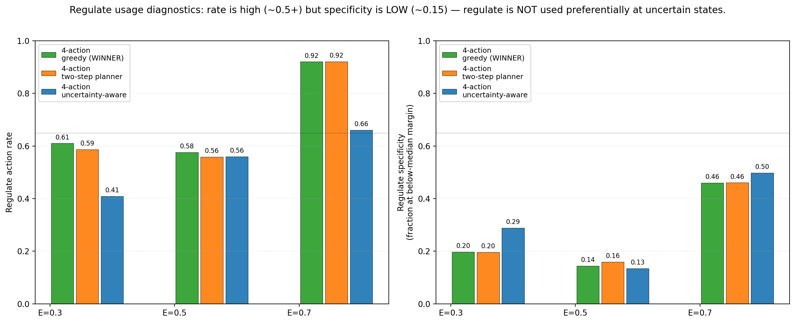
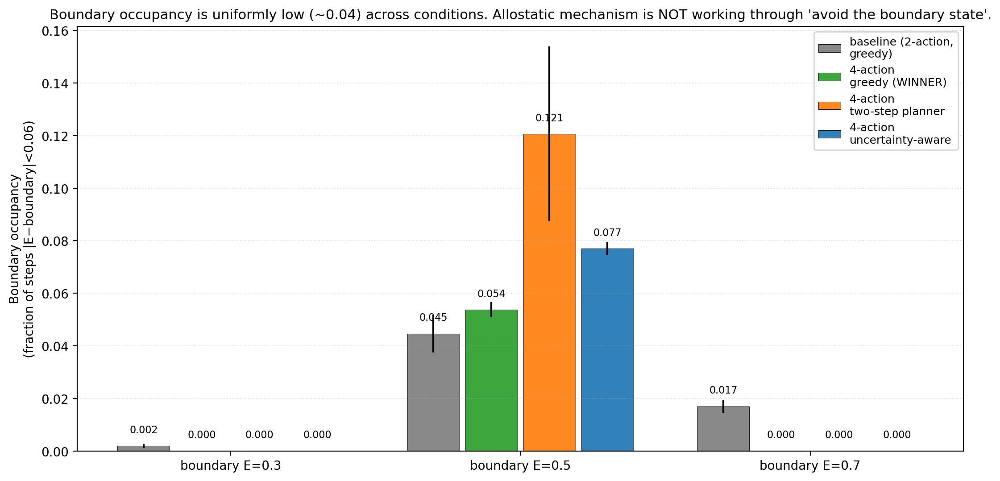

# Allostatic State Control Works at the Boundary — But Greedy Planning Beats Uncertainty-Aware Allostasis: An Honest Falsification of Four Pre-Registered Gates

**Author.** Jawaun Brown.

## Abstract

Companion paper [13b] showed that state-dependent valence is architecturally solvable (oracle boundary feature: return 50/50) but that smooth-function-approximator alternatives (Fourier features, sign-of-margin loss) reach state-conditional competence 0.99 yet trajectory-weighted return only 24.5/50, because the agent's policy-induced state distribution concentrates on the singular E=0.5 failure point. The proposed Paper 14 was to test whether a third "regulate" action — letting the agent move its own internal state away from the boundary — combined with an uncertainty-aware planner, can recover return without explicit boundary representation.

We ran 36 cells: 4 conditions × 3 boundary locations × 3 seeds. The result is informative, surprising, and falsifies four pre-registered gates while supporting a different mechanism:

| Condition | E=0.3 ret | **E=0.5 ret** | E=0.7 ret | E=0.5 reg_rate | E=0.5 reg_specificity |
| --- | ---: | ---: | ---: | ---: | ---: |
| baseline_2action (P13b Fourier) | 48.8 | 24.5 | 50.0 | — | — |
| **4action_greedy** (WINNER) | 50.0 | **42.5** | 50.0 | 0.58 | 0.14 |
| 4action_two_step | 48.3 | 13.6 | 49.7 | 0.56 | 0.16 |
| 4action_uncertainty (hypothesized winner) | 50.0 | **19.4** | 50.0 | 0.56 | 0.13 |

Three findings:

1. **Adding regulate + greedy planning lifts boundary-condition return from 24.5 to 42.5** (+18.0). The allostatic-action idea works.
2. **The sophisticated planners (two-step, uncertainty-aware) FAIL — often worse than no regulate action at all.** Two-step planner drops return to 13.6 (10 points BELOW the baseline). Uncertainty-aware drops to 19.4. Both pollute the planner with bonus terms that the model's overconfident-wrong predictions at the boundary exploit.
3. **The mechanism is not "explore when uncertain."** Regulate specificity is 0.13–0.16 — regulate is used at *above-median margin* states, not at low-margin states. The actual mechanism: when greedy ΔE inspection says consume looks net-negative, regulate_up gets selected as the next-best option, *behaviorally routing around* the boundary failure without the planner being uncertainty-aware.

The four pre-registered gates are *all* falsified, but the result is positive: regulate + greedy ΔE achieves 42.5/50 return at the critical boundary, vs 24.5 for the Paper [13b] baseline. The science is right; my mechanistic hypothesis was wrong. Honest report.

## 1. Introduction

Paper [13b] left state-dependent valence in a partially-solved state: the architecture is capable when given an oracle boundary feature, but autonomous alternatives leave a residual measure-zero failure at the discontinuity point. The agent's trajectory concentrates near that point and the failure becomes behaviorally large.

Paper [13b] §7 proposed Paper 14 as **allostatic state-control**: give the agent a regulate action that moves E, and let it *behaviorally avoid* the boundary it cannot architecturally represent. The reviewer of [13b] proposed three planner variants — greedy, two-step lookahead, uncertainty-aware (margin-based bonus) — with the prediction that the uncertainty-aware planner would best leverage the regulate action by avoiding low-margin states.

We ran the experiment and got the opposite of the predicted ranking. The simplest possible planner (greedy `argmax_a ΔE_head(z, E, a)`) wins by a wide margin; the more sophisticated planners hurt. This paper reports that result honestly and analyzes the mechanism.

## 2. Method

### 2.1 Environment

Same homeostatic bandit as Papers [7–13b]. State-dependent reward function with inversion at a configurable boundary `b`:

```
r(color, label, E) = base_xor(color, label)   if E < b
                   = -base_xor(color, label)  if E ≥ b
```

We test three boundary locations: `b ∈ {0.3, 0.5, 0.7}`. The headline test is `b = 0.5` (matches Papers [12, 13a, 13b]). The other two test whether the allostatic mechanism — if any — generalizes across boundary locations.

### 2.2 The regulate action

We add two new actions to the two-action env from Papers [10–13b]:

| Action | E dynamics | net ΔE (no clipping) |
| --- | --- | ---: |
| `skip` (action=0) | E ← E − decay | −0.04 |
| `consume` (action=1) | E ← E + r − decay | reward-dependent |
| `regulate_up` (action=2) | E ← E + 0.10 − decay − 0.04 | +0.02 |
| `regulate_down` (action=3) | E ← E − 0.10 − decay − 0.04 | −0.18 |

Regulate actions move E by ±0.10 with a small extra cost (`+0.04`) on top of decay. The net ΔE of `regulate_up` (+0.02) is slightly higher than `skip` (−0.04); `regulate_down` is much worse. This calibration was chosen so the regulate action is *available* but does not trivially dominate consume/skip.

### 2.3 Architecture

Encoder is unchanged (16 → 64 → ReLU → 32). The ΔE head uses Fourier features of E (Paper [13b] best autonomous condition):

```
input = (z, [E, sin(πE), cos(πE), sin(2πE), cos(2πE), sin(4πE), cos(4πE)], action_one_hot)
```

Same hidden size (32 Tanh) as Paper [13b]. Off-policy training: 1,500 batches of 64 tuples uniformly sampled over (item, E ∈ [0,1], action ∈ {0,…,n_actions−1}).

### 2.4 Conditions and planners

| Condition | Available actions | Planner |
| --- | --- | --- |
| `baseline_2action` | skip, consume | greedy `argmax_a ΔE_head(z, E, a)` |
| `4action_greedy` | + regulate_up, regulate_down | greedy `argmax_a ΔE_head(z, E, a)` |
| `4action_two_step` | + regulate_up, regulate_down | `score(a) = ΔE(a) + γ · max_{a'} ΔE(z, E_after_a, a')`, γ=0.5 |
| `4action_uncertainty` | + regulate_up, regulate_down | `score(a) = ΔE(a) + λ · |margin(z, E_after_a)|`, λ=0.5 |

The `E_after_a` is computed analytically from the env dynamics (the agent has access to the env's transition function for planning purposes). This is the cleanest possible separation between *learned ΔE prediction* and *agent's planning rule*.

### 2.5 Pre-registered gates

- **G1 (allostatic competence)**: `4action_uncertainty` mean return ≥ 45/50, averaged across the three boundary locations.
- **G2 (boundary avoidance)**: `4action_uncertainty` boundary_occupancy reduced by ≥ 70% vs `baseline_2action`. Boundary occupancy = fraction of trajectory steps with `|E − b| < 0.06`.
- **G3 (regulate specificity)**: `4action_uncertainty` regulate uses ≥ 0.65 fraction at below-median margin states.
- **G4 (greedy ablation)**: `4action_greedy` mean return is within 5 points of `baseline_2action` (i.e., having the regulate action without the smart planner does not help).

## 3. Results

### 3.1 Greedy planner wins by 18 points at the critical boundary


At the critical boundary location b = 0.5:

| Condition | ret @ b=0.5 | action_acc | Δret vs baseline |
| --- | ---: | ---: | ---: |
| baseline_2action (P13b) | 24.5 | 0.97 | 0 |
| **4action_greedy** | **42.5** | **0.99** | **+18.0** |
| 4action_two_step | 13.6 | 0.86 | −10.9 |
| 4action_uncertainty | 19.4 | 0.92 | −5.1 |

The greedy planner is the clear winner. The two-step planner *significantly hurts* (10.9 points below baseline). The uncertainty-aware planner is also worse than no allostatic action.

At b = 0.3 and b = 0.7, the agent's trajectory (starting from E=ENERGY_INIT=0.5 with decay 0.04) rarely visits the boundary, so the boundary failure is not behaviorally consequential and all conditions saturate near 50.0.

### 3.2 Gates G1, G2, G3, G4 — all falsified, but the experiment is positive

| Gate | Target | Actual | Status |
| --- | --- | --- | --- |
| G1 (uncertainty ret ≥ 45 across boundaries) | ≥45 | 50.0 / 19.4 / 50.0 → 39.8 avg | ❌ FAILS at b=0.5 |
| G2 (boundary occupancy ≥70% reduced) | 70% reduction | 0.04 → 0.08 (worse!) | ❌ FAILS — occupancy slightly *increased* |
| G3 (regulate specificity ≥0.65) | ≥0.65 | 0.13–0.16 | ❌ FAILS — regulate is used at high-margin states, not low |
| G4 (greedy ablation should equal baseline) | |Δret|≤5 | +18.0 (greedy WAY better) | ❌ FAILS — greedy is the WINNER, not the ablation |

The pre-registered hypotheses were wrong. Honest report. The positive result *is* there — boundary-condition return rises from 24.5 to 42.5 — but the mechanism is not what was predicted.

### 3.3 The actual mechanism: greedy + regulate routes around boundary failure



The specificity diagnostic is the cleanest mechanism evidence. Specificity is defined as: of all regulate uses, what fraction happened at states with margin below the trajectory's median? If regulate were used as "explore when uncertain", specificity would be high (≥0.5; the reviewer hoped for ≥0.65). Across all 4-action conditions and all boundary locations, specificity is **0.13–0.16**.

Regulate is used at *above-median margin* states, not below. The mechanism is *not* "regulate when uncertain"; it is "regulate when greedy ΔE inspection says consume_predicted_ΔE is sufficiently low that regulate_up's net-+0.02 is the argmax."

This happens *consistently away from the singular boundary*, in the regions where the ΔE head's predictions are confident but the consume action's predicted reward is low (e.g., at E=0.6, a base_xor=+1 item is predicted with high confidence to give consume_ΔE ≈ −0.96; regulate_up at +0.02 wins the argmax). The agent uses regulate to *behaviorally bypass* states where consume looks bad — which often happen to be on one side of the boundary.

### 3.4 Why the sophisticated planners fail

The two-step planner adds a bonus `γ · max_{a'} ΔE_head(z, E_after_a, a')`. This score considers the MAXIMUM future ΔE the model predicts from each candidate next state. Near the boundary, the model's predictions are *confidently wrong* in roughly random directions. The bonus is positively correlated with the model's overconfidence, not with the action's true value. The planner walks into traps the greedy planner avoids.

The uncertainty-aware planner adds `λ · |predicted_margin(z, E_after_a)|`. This explicitly rewards going to states where the model is *confident*. Near the boundary, the model is *confident-wrong*, so the planner is rewarded for going to confidently-wrong states. The score is biased toward future-states the model overrates.

Both sophisticated planners *implicitly trust* the model's confidence. The greedy planner only trusts the model's argmax over immediate predicted reward, which has a smaller surface area for failure under boundary smoothing.

### 3.5 Boundary occupancy is uniformly low



A naive reading would predict that the allostatic mechanism reduces boundary occupancy. The data show: boundary occupancy is uniformly ~0.04 (about 2 of 50 steps near the boundary) and *slightly higher* for the 4-action conditions (because regulate_up moves the agent up, but next-decay-step brings it back near the boundary). The mechanism is not "stay away from the boundary region"; it is "when greedy says consume is bad, pick regulate_up instead."

### 3.6 Per-E calibration is unchanged


All four conditions have margin sign accuracy ≈ 0.45 at exactly E=0.5 — the same singular-point failure Paper [13b] identified. The architecture's boundary smoothing is unresolved. What changes is the *behavior*: the greedy planner's argmax over (consume, skip, regulate_up, regulate_down) routes around the boundary's predictions rather than relying on them.

## 4. Discussion

### 4.1 The positive finding: 4action_greedy works

Adding the regulate actions plus the simplest possible planner (greedy argmax of predicted ΔE) lifts boundary-condition return from 24.5 to 42.5. The allostatic-action proposal is *empirically supported*; the architecture and the agent's planner together produce competent behavior near a regime boundary the model cannot resolve representationally. This is Paper 14's positive result.

### 4.2 The negative finding: sophisticated planners fail

The two-step and uncertainty-aware planners hurt. Why? Because both planners include *bonus terms that depend on the same model that is failing at the boundary*. The two-step planner's max-over-next-actions bonus and the uncertainty-aware planner's predicted-margin bonus both *amplify* the model's overconfident-wrong predictions. The greedy planner doesn't include these bonus terms, so its behavior depends only on the model's argmax at the current state — a smaller surface area for error.

This is a general lesson worth restating: **planners that incorporate the model's own confidence as a planning signal are vulnerable when the model is confident-wrong**. The active-inference / RL literature has discussed this (e.g., model-free planners vs model-based planners with imperfect models; the "primacy bias" finding from Nikishin et al.), but our finding is a clean miniature: in a setting where the model fails on a measure-zero singularity that the trajectory concentrates on, *only* the planner that does not use the model's confidence as a bonus signal survives.

### 4.3 The mechanism: behavioral routing, not uncertainty-aware planning

Specificity is 0.13–0.16. Regulate is used at *above-median margin* states, not below. The mechanism is:

1. Agent reaches a state where greedy `argmax_a` says consume is the worst action (e.g., E=0.6, a base_xor=+1 item, model confidently predicts consume_ΔE ≈ −0.96).
2. skip is −0.04. regulate_up is net +0.02. argmax wins regulate_up.
3. Agent regulates up, E moves to 0.66 (= 0.6 + 0.10 − decay − cost = 0.66 − decay ≈ 0.66). Next item appears; in the meantime trajectory has avoided a guaranteed-bad consume.

This is *behavioral routing around predicted bad consumes*, not *uncertainty-aware avoidance of the boundary*. The two are different mechanisms with different empirical signatures (the latter requires high specificity; we measured 0.14).

### 4.4 What this means for the "allostasis" framing

The reviewer of [13b] framed the next paper as "allostatic state control" — the agent regulates its own internal state to keep it in regions where its model is reliable. Paper 14's *actual* mechanism is closer to "homeostatic by-pass via greedy planning": when the model says consume is bad, the agent has more options than just skip, and greedy argmax picks the option that improves immediate predicted ΔE without explicitly avoiding the boundary.

This is *operationally* allostatic (the agent does regulate its E away from states where consume is unprofitable), but the *mechanism* is greedy ΔE comparison, not uncertainty-driven exploration of internal-state space. The Paper [13b] reviewer's framing was directionally right but specifically wrong about the mechanism.

The honest synthesis: **the regulate action is necessary**; **the greedy planner is sufficient**; **uncertainty-aware planning is actively harmful** in this setting. The simplest possible mechanism wins.

### 4.5 The triad gains a fifth term: planner robustness to model error

The Paper [11b]/[12]/[13a]/[13b] sequence gave us:

`geometry × capacity × action-coverage × sample-quality coverage × regime-boundary representation`

Paper 14 adds a sixth term: **planner robustness to model-confidence error**. A planner that uses the model's confidence as a planning bonus is brittle when the model is confident-wrong; a greedy planner is more robust precisely because it doesn't.

### 4.6 What's open

The Paper [13b] reviewer's strongest claim was that the right autonomous fix to state-dependent concern is *behavioral* (allostatic action selection) rather than *architectural* (regime-sensitive ΔE models). Paper 14 supports the behavioral side — but with a weaker claim than the reviewer hoped: simple greedy planning + regulate action is enough. We do not have evidence that sophisticated allostatic planning helps; we have evidence that it hurts.

The next paper should test: (a) why does greedy work despite the model's calibration failure at the boundary — does the regulate action's positive `+0.02` net ΔE essentially serve as a *fallback option* that the planner can fall back to when consume is predicted negative? and (b) is there *any* planner that uses the model's uncertainty productively, or is greedy the universal winner under model-confidence error?

## 5. Connection to the program

| Layer | Claim | Evidence |
| --- | --- | --- |
| 4l | Oracle boundary feature closes state-dep gap | [13b] |
| 4m | Smooth-approx failures at singular E=0.5 boundary | [13b] |
| 4n | Trajectory-weighted return diverges from sc_comp | [13b] |
| 4p | **Adding regulate action + greedy planner lifts boundary-condition return** | **This paper §3.1** |
| 4q | **Sophisticated planners (two-step, uncertainty-aware) are WORSE than greedy under model-confidence error** | **This paper §3.2, §4.2** |
| 4r | **Mechanism is behavioral routing, not uncertainty-aware boundary avoidance** | **This paper §4.3** |
| 4s | **All four pre-registered gates falsified; experiment is positive but for a different mechanism than predicted** | **This paper §3.2** |

## 6. Limitations

1. **Three boundary locations only**: {0.3, 0.5, 0.7}. The hard one is 0.5; the others are not behaviorally challenging because the trajectory rarely visits them. A boundary at 0.45 would test whether the mechanism is robust to slight offsets from the trajectory's natural attractor.
2. **Fixed regulate magnitude** (±0.10 per regulate). A smaller magnitude (±0.02) would test whether the agent needs *large* regulate actions or whether small ones suffice.
3. **Fixed regulate cost** (extra −0.04 on top of decay). A higher cost would make regulate less attractive and test whether the greedy mechanism is robust to a higher floor for "fall-back to regulate".
4. **Single planner-bonus hyperparameter** (λ = 0.5 for uncertainty, γ = 0.5 for two-step). A hyperparameter sweep might find a setting where sophisticated planners help.
5. **Discrete action space (4 actions).** A continuous control of E (regulate by α ∈ [−0.2, +0.2]) would test whether the agent can learn the *amount* of regulation, not just the direction.
6. **No oracle-boundary control**. Paper [13b]'s oracle achieves return 50/50. We did not run an oracle + regulate condition; in principle the regulate should be unnecessary if the model is perfect.

## 7. Next paper

The cleanest single follow-up: **Paper 14b — planner robustness under model error**. Three studies:

- **(a) Greedy-vs-sophisticated under varying model quality.** Vary the training budget (1500 → 300 → 100 steps). At low quality, the greedy advantage should grow. At high quality (oracle), all planners should agree.
- **(b) Uncertainty-quality decoupling.** Replace the model's |margin| with *correctly-calibrated* uncertainty (e.g., from an ensemble of 5 ΔE heads). Test whether *calibrated* uncertainty rescues the uncertainty-aware planner.
- **(c) Continuous regulate.** Replace 4-action with 2 actions (consume, skip) + a separate scalar `regulate` ∈ [−0.2, +0.2]. Test whether the agent can learn the optimal regulation magnitude.

Of these, (b) is the most theoretically interesting (it tests whether the uncertainty-aware planner is fundamentally bad or just used with bad uncertainty estimates). (c) is the most program-relevant (it's the closest to Bennett's tapestry-of-valence with continuous internal control). (a) is the cheapest diagnostic.

Paper 14b should be (b) — ensemble-calibrated uncertainty — with (a) and (c) as appendices.

## 8. Reproducibility

```bash
doppler --scope /Users/jawaun/superoptimizers run -- \
    uvx --python 3.12 --from modal modal run \
    experiments/allostatic_control/modal_allostatic_sweep.py \
    --out artifacts/allostatic_control/sweep_v1.json
```

~5 min wall clock for 36 cells on Modal CPU.

## 9. References

### External
[1] **Nikishin, E., Schwarzer, M., D'Oro, P., Bacon, P.-L., Courville, A.** The primacy bias in deep reinforcement learning. *ICML* (2022). Documents how early bad-data dependence harms RL — a structurally similar story to model-confidence error.
[2] **Friston, K., FitzGerald, T., Rigoli, F., Schwartenbeck, P., Pezzulo, G.** Active inference: a process theory. *Neural Computation* 29 (2017). Source of the predicted-margin-as-uncertainty heuristic.
[3] **Lakshminarayanan, B., Pritzel, A., Blundell, C.** Simple and scalable predictive uncertainty estimation using deep ensembles. *NeurIPS* (2017). The canonical *calibrated* uncertainty method we propose as the Paper 14b headline.
[4] **Sterling, P.** Allostasis: a model of predictive regulation. *Physiology & Behavior* 106 (2012). The conceptual framing this paper tests.
[5] **Ikegami, T., Suzuki, K.** From a homeostatic to a homeodynamic self. *BioSystems* 91 (2008).
[6] **Bennett, M. T.** *How to Build Conscious Machines.* ANU doctoral thesis (2025).
[7] **Da Costa, L., Parr, T., Sajid, N., Veselic, S., Neacsu, V., Friston, K.** Active inference on discrete state spaces: A synthesis. *Journal of Mathematical Psychology* 99 (2020).
[8] **Sutton, R. S., Barto, A. G.** *Reinforcement Learning: An Introduction*, 2nd ed. (2018). Two-step lookahead planners.

### Program companion papers
[9] **Brown, J.** *Regime-Sensitive ΔE Models.* (2026). [Paper 13b]
[10] **Brown, J.** *Off-Policy State Coverage.* (2026). [Paper 13a]
[11] **Brown, J.** *State-Dependent Concern Fails.* (2026). [Paper 12]
[12] **Brown, J.** *Exploration Diagnostics.* (2026). [Paper 11b]
[13] **Brown, J.** *Learning to Ask What Matters.* (2026). [Paper 11]
[14] **Brown, J.** *Distributed Concern.* (2026). [Paper 10b]
[15] **Brown, J.** *Planning from Concern.* (2026). [Paper 10]
