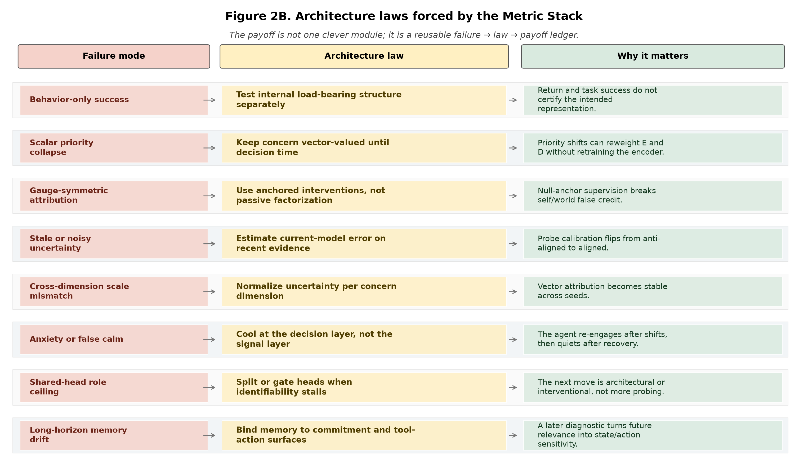

# Architecture Laws for Machine Agency: A Synthesis of the Probe-Calibration Lineage

**Jawaun Brown**  
2026-07-06

## Abstract

This note distills the program's practical architecture lessons from the
first-order self, probe-calibration, world-responds, planning, and long-horizon
papers. The empirical arc does not show consciousness, full agency, or general
intelligence. It shows something narrower and more useful: small architectural
changes repeatedly determine whether an agent's behavior is tied to the intended
internal structure or to a proxy.

The recurring pattern is:

1. A behavior-level success appears.
2. A representation or control diagnostic shows the success is proxy-mediated.
3. A simple architecture change restores the intended causal structure.
4. A harder setting reveals the next proxy.

The resulting contribution is a ledger of architecture laws for machine agency:
preserve vector-valued concern, use identifying interventions, recompute memory
against the current model, normalize uncertainty before allocating inquiry,
re-open inquiry after apparent convergence, cool at the decision layer rather
than deleting the signal, split or gate heads when component identifiability
stalls, bind memory to future action surfaces, and expose expected deployment
transformations as local selection or training pressures. The newest
virtual-governor diagnostic adds one more law: translate live system stress into
the local action surface, and test stale or wrong stress as controls.

## 1. Claim Boundary

These are **minimal computational precursors**. The experiments are mostly small
homeostatic bandits, plus newer long-horizon language-agent diagnostics. The
right claim is not "we made conscious agents." The right claim is that the
program found a sequence of cheap, testable architecture constraints that move a
system from behavior-only competence toward maintained self/world, memory/action,
and concern/action coupling.

The recent non-peer-reviewed preprint by Lyons, Pio-Lopez, and Levin (2026) uses
the phrase **virtual governor** for a distributed signal architecture that turns
global constraint violations into local incentives. That phrase is useful
framing here, but not evidence. In our terms, an architecture law is a tested
constraint on the signal architecture: it asks whether the local action pressure
really tracks the intended global concern.

## 2. The Ledger

| Failure mode | Architecture law | Agency payoff |
|---|---|---|
| Behavior-only success | Test internal load-bearing structure separately | Return is no longer mistaken for representation. |
| Scalar priority collapse | Keep concern vector-valued until decision time | Priorities can reweight E and D without retraining. |
| Gauge-symmetric attribution | Use anchored interventions, not passive factorization | Self/world false credit becomes measurable and correctable. |
| Stale or noisy uncertainty | Estimate current-model error on recent raw evidence | Probe calibration flips from anti-aligned to aligned. |
| Cross-dimension scale mismatch | Normalize uncertainty per concern dimension | Vector attribution becomes stable across seeds. |
| Learned quiet after shifts | Add a re-engagement floor or surprise detector | The agent can restart inquiry after the world changes. |
| Anxiety or false calm | Cool at the decision layer, not the signal layer | The agent re-engages after shifts and quiets after recovery. |
| Shared-head role ceiling | Split or gate heads when identifiability stalls | The next move becomes architectural or interventional. |
| Long-horizon memory drift | Bind memory to commitment and tool-action surfaces | Memory becomes control-relevant, not merely present. |
| Dispatch-surface brittleness | Harden commitment surfaces across parser, repair, and wording variants | Tool/action memory remains useful under interface stress. |
| Shortcut-compatible OOD success | Score or regularize structure-compatible transformations | Global deployment stress becomes local model pressure. |
| Invisible global stress | Transduce live system stress into local policy features | Policies recover after target shifts instead of optimizing proxies. |

## 3. Why These Laws Matter

### 3.1 Memory

The current-error calibration paper gives the simplest memory rule: do not store
only stale residual tokens. Store enough raw evidence to replay it through the
current model. A long-horizon agent's memory is useful when it can be revalued by
the policy and world model that will act now.

### 3.2 Planning

Planning from concern closes a loop: learned concern-shaped representation can
drive a predictive policy without external reward supervision. The architecture
lesson is that a planner should consume a representation that preserves the
dimensions of mattering until decision time. Premature scalarization makes
planning brittle under shifted priorities.

### 3.3 Action

The null-intervention and world-responds papers show that self/world
attribution requires actions whose purpose is identification, not reward. In
nonstationary worlds, the action policy also needs a way to re-open inquiry after
the model becomes quiet. Learned silence is not evidence of world stability.

### 3.4 Reafference And Selfhood

The first-order self result is a negative law: input factorization does not
identify causal source. Reafference needs a gauge-breaking signal. In this
program, the gauge breaker is an active null-anchor intervention plus calibrated
probe selection. This is a selfhood ingredient, not a consciousness certificate.

### 3.5 Long Trajectories

The long-horizon bottleneck work adds the temporal complement: a hidden clue
matters only if it reaches a later commitment surface, such as a tool call,
schema field, or irreversible action. Memory without future action coupling is
just context. Memory with commitment coupling becomes agentic state.

The dispatch robustness follow-up sharpens the same law. The issue is not just
whether a model remembers a hidden value; it is whether the value survives the
surface on which it must be used: parser-facing text, aliases, generated JSON,
tool repair, and black-box API dispatch wording. A sparse OpenAI GPT-4.1 Nano
negative under one dispatch repair cell is therefore useful precisely because it
localizes the pressure point without turning it into a broad provider claim.

### 3.6 Virtual-Governor Stress Signals

The virtual-governor diagnostic makes the preprint vocabulary executable. Five
small neural policies receive the same oracle action labels but different
features: reward-only, local-state proxy, stale stress memory, wrong stress
signal, and live global stress. The live condition reaches global recovery score
0.843 versus 0.184 for reward-only, 0.520 for local proxy, 0.517 for wrong
stress, and 0.678 for stale memory. The architecture lesson is not that the
policy is conscious or aligned in general; it is that current global constraint
violation must be represented where local action is chosen.

### 3.7 Structure-Compatible Generalization

The structure-compatible generalization work adds an OOD complement. When ID
evidence admits both shortcuts and transportable rules, the architecture needs a
surface that asks whether the learned function preserves the transformation
expected to generate deployment cases. Phase one shows this as model selection;
phase two weakens the oracle by inferring supported modular shifts and using
them as a compatibility regularizer. In virtual-governor terms, the training
loop converts a global deployment constraint into local pressure on the model,
but the claim remains finite-domain and task-family bounded.

## 4. Simple Changes That Moved Outcomes

The strongest "small changes, large effects" observed so far are:

1. **Current replay:** keep a compact raw buffer and recompute residuals against
   the present model. This changed V_probe from anti-calibrated to positively
   calibrated.
2. **Per-dimension normalization:** scale-normalize probe targets or thresholds.
   This removed the vector seed-collapse failure.
3. **Active null anchoring:** add an identifying intervention instead of relying
   on passive self/world factorization. This broke the attribution gauge.
4. **Re-engagement floor / surprise trigger:** add a path back into inquiry
   after convergence. This fixes self-confirming silence.
5. **Decision-layer cooling:** damp the action tendency after recent probing
   without erasing the surprise signal. This avoids both anxiety and false calm.
6. **Commitment-surface memory:** test whether early information causally reaches
   a later action surface. This relocates long-horizon agency from context length
   to state/action coupling.
7. **Dispatch-surface hardening:** test the same commitment under aliases,
   parser-facing wording, generated JSON, repair, and API dispatch variants.
   This prevents hidden memory from evaporating at the action interface.
8. **Compatibility selection/regularization:** score or train against the
   transformations that define the deployment shift. This converts an OOD
   constraint into a local architecture pressure.
9. **Stress transduction:** expose live system-level constraint violation as a
   feature at the local action surface. Stale or wrong stress behaves like a
   proxy; live stress supports recovery after target shifts.

## 5. Major Contribution Opportunity

The major contribution is not a single module. It is a transferable method:

> For every proposed agent capability, find the proxy that lets behavior pass
> without the intended structure, then add the smallest architecture change that
> makes the structure load-bearing.

This is where the work should push hardest next. The homeostatic arc produced
the laws. The next contribution is to test whether they transfer to:

- long-horizon tool agents,
- structure-compatible OOD generalization,
- multi-agent or decentralized coordination,
- learned intervention discovery rather than hand-coded null actions,
- richer memory systems whose retrieval is coupled to future commitments.

## 6. Critical Caveats

- The homeostatic experiments use simulator-defined viability variables and a
  privileged null action.
- Most results use three seeds.
- The virtual-governor preprint is useful framing but not peer-reviewed
  evidence.
- The laws are empirically grounded within this repo's tasks; transfer to LLM
  agents, robotics, markets, or biological systems remains a hypothesis.
- Consciousness language must remain bounded. These laws concern control,
  attribution, memory, and inquiry surfaces, not subjective experience.

## References

- Lyons, B., Pio-Lopez, L., & Levin, M. (2026). *Alignment is to a virtual
  governor: A theory of coordination in diverse intelligence*. Preprints.org.
  doi:10.20944/preprints202607.0220.v1. Not peer-reviewed.
- `papers/metric_stack_synthesis/paper.md`
- `papers/current_error_calibration/paper.md`
- `papers/vector_first_order_self/paper.md`
- `papers/scale_normalized_vprobe/paper.md`
- `papers/world_responds/paper.md`
- `papers/planning_from_concern/paper.md`
- `papers/long_horizon_bottleneck/paper.md`
- `papers/structure_compatible_generalization/structure_compatible_generalization.md`
- `papers/structure_compatible_generalization/inferred_transformations_intervention.md`
- `papers/virtual_governor_stress_signal/paper.md`
- `experiments/long_horizon_bottleneck/results/zzzzzzzzzzzzzzzzzzzz_api_dispatch_robustness_openai_gpt41_nano_2026_07_06.md`
- `experiments/virtual_governor_stress_signal/results/virtual_governor_stress_signal_l4_2026_07_06.md`
