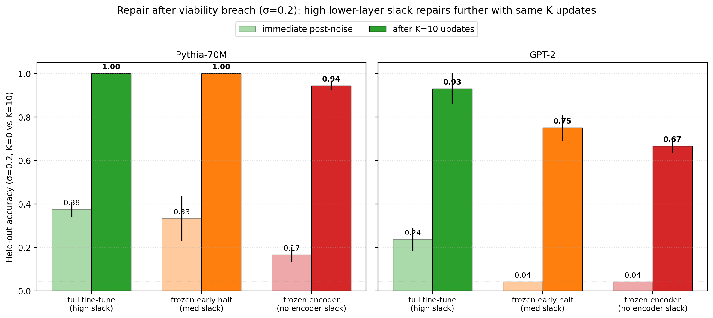
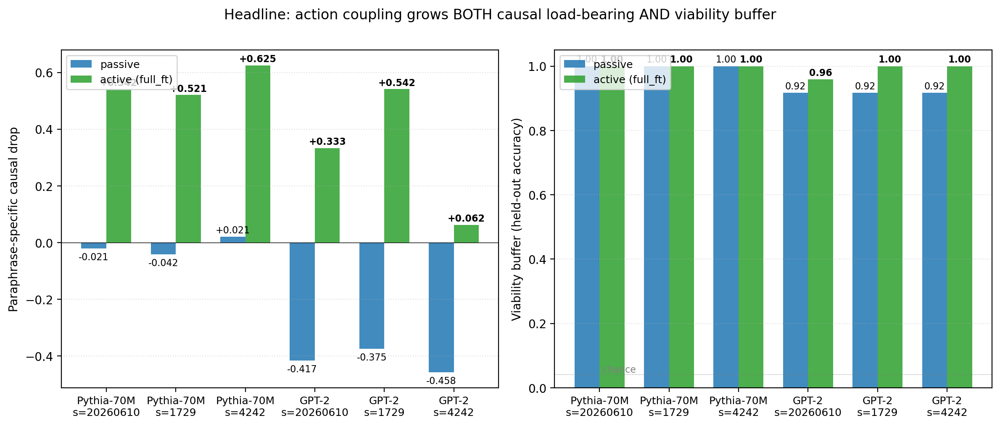
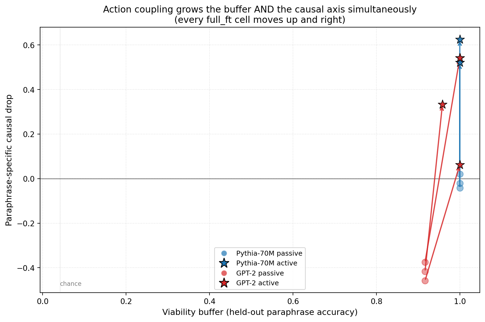

# From Active Geometry to Autopoietic Control: Viability Slack as the Bottleneck for Adaptive Generalization

**Author.** Jawaun Brown.

## Abstract

Four prior empirical papers in this program established that symmetry-compatible-hypothesis volume (weakness) predicts out-of-distribution generalization [1], that the relevant symmetry group can be recovered from training data alone [2], that pixel-cosine and learned-encoder methods occupy different operating regimes [3], and that paraphrase clusters become *causally load-bearing* under action coupling via supervised fine-tuning [4]. Paper [4] left one strong skeptical objection: *"of course ablating a direction the head was trained to use makes the head fail."* The autopoietic theorem of Bennett & Suzuki [5] sharpens what a stronger rebuttal would need to demonstrate. Action coupling is necessary but not sufficient for a strict Layer-3 claim; a candidate system would also need to preserve a *viability buffer*, repair after viability breach, and show that lower-layer slack constrains upper-layer adaptive capacity. This paper tests supervised analogues of those properties, not autopoiesis itself.

We test all three. We run an 18-cell sweep (2 model families × 3 seeds × 3 Law-of-the-Stack training variants) on the same paraphrase-invariant classification task as [4], holding out 1 of 3 paraphrases per concept as a viability buffer. We report four findings:

1. **Trajectory.** Across the fine-tuning trajectory, cluster geometry tightens *gradually* (centered cosine gap from +0.36 to +0.97 over 60 epochs), but causal load-bearing emerges *abruptly* between epochs 8 and 16. Geometry and causal dependence are not coextensive in time.
2. **Buffer.** Held-out paraphrase classification accuracy (≈ buffer size, |B_π| in Bennett's formalism) starts already high (mean 0.958) because the pretrained encoder already separates paraphrases. The *causal* dependence on the right axis is what fine-tuning installs, not the predictive feature. Buffer and load-bearing are decoupled — exactly what the autopoietic frame predicts.
3. **Repair (supervised ultrastability analogue).** When we perturb the classifier head with Gaussian noise σ ∈ {0.05, 0.1, 0.2, 0.4} and allow K ∈ {0…20} test-time gradient updates on held-out labeled paraphrases, the full-fine-tuned cell recovers held-out accuracy from immediate-post-noise 0.45 back to **0.965 within K = 10 updates** at σ = 0.2. This is externally supplied, label-dependent parameter repair, not strict self-production. The frozen-encoder cell recovers only to 0.806 over the same K.
4. **Stack ordering.** Across the LoS variants, both the passive→active transition magnitude (full_ft +0.437, frozen_early +0.080, frozen_encoder −0.215) and repair speed (0.965, 0.875, 0.806 at K = 10, σ = 0.2) are *monotone* in lower-layer slack. This is consistent with the inequality's ordinal implication; the experiment does not measure or test its formal upper bound.

Together these signatures convert paper [4]'s "active classifier with a load-bearing direction" into an *ultrastable adaptive-controller analogue*: the same latent geometry causally controls behavior, preserves a buffer of compatible futures, undergoes supervised repair after viability breach, and degrades predictably when lower-layer slack is restricted. We reserve *autopoiesis* for systems that endogenously produce their own components and boundary, which this experiment does not test.

## 1. Introduction

The four prior empirical papers in this program built the ladder:

- [1] showed weakness predicts OOD when loss, validation, sharpness, and compression do not.
- [2] showed the symmetry group can be inferred from training data alone.
- [3] showed pixel-cosine and encoder methods occupy different operating regimes (the selection rule and similarity metric are load-bearing).
- [4] showed that under action coupling, paraphrase clusters become causally load-bearing — passive geometry crosses the Layer-3 transition.

[4] has a clean +7× ratio of the paraphrase-specific causal effect (passive +0.07, active +0.49), and replicates across 3 seeds × 2 model families with the active specific drop ≥ +0.30 in 6 of 6 cells. The strongest reviewer objection remains structural: *"You trained a classifier head to use a direction. Ablating it of course matters. This is not autopoiesis; it is supervised feature selection."*

Bennett & Suzuki's autopoietic theorem [5] formalizes what the rebuttal should look like. The hierarchy of persistence — static → dynamic/autopoietic → novelty-generating — is derived from change, finite information (Bekenstein), and stable low-level conditions. Their Proposition 1 makes weakness measurable as `|B_π|`, the buffer of unobserved compatible outcomes. Their Theorem 3 (the Law of the Stack) proposes the sharp bound `w(ς_{i+1}) ≤ 2^{w(ς_i)}`. Our ablation can test only its weaker ordinal implication because it does not estimate both sides of that inequality. And the homeostatic-to-homeodynamic transition motivates repair under viability breach rather than mere robustness to a fixed perturbation; supervised label-dependent repair remains an analogue of that target.

We translate these three into experiments on the same paraphrase-invariant classification task used in [4]:

- **Trajectory** (§3.1): does the causal dependence emerge before, after, or alongside the cluster tightening?
- **Viability buffer** (§3.2): hold out 1 of 3 paraphrases per concept; measure held-out classification accuracy as the operational `|B_π|`. Does the buffer grow under action coupling?
- **Repair, not just robustness** (§3.3): perturb the classifier head with weight noise (a viability breach for the classifier subsystem), allow K test-time gradient updates on the *held-out* paraphrases, measure recovery accuracy as a function of K and σ.
- **Law of the Stack** (§3.4): train three variants — full fine-tune (max slack), frozen-early-half (medium slack), frozen-encoder (no encoder slack). Predict: transition magnitude and repair speed are monotone in slack.

## 2. Method

### 2.1 Setup

- Models: `EleutherAI/pythia-70m-deduped` (layer 5 mean pool) and `openai-community/gpt2` (layer 6 mean pool).
- Data: 24 concepts × 3 paraphrase variants from `concept_paraphrases.json`. Variants 0 and 1 train; variant 2 is the **held-out buffer**.
- Seeds: {20260610, 1729, 4242}.
- Optimization: AdamW, lr 5×10⁻⁴, weight decay 10⁻⁴, batch size 24, 60 epochs.
- Checkpoint epochs: {1, 2, 4, 8, 16, 32, 60}.

### 2.2 Law-of-the-Stack training variants

| Variant | What is frozen | Stack interpretation |
| --- | --- | --- |
| `full_ft` | nothing | High slack at every layer; both encoder weakness and head weakness available |
| `frozen_early` | first half of transformer blocks + input embeddings | Medium slack; only later layers and head can adapt |
| `frozen_encoder` | full transformer; only classifier head trains | No encoder slack; all adaptation must occur in the read-out |

### 2.3 Measurements at each snapshot

For each checkpoint, on the *training* paraphrases (variants 0,1) we compute:

- Cluster gap = (same-orbit centered cosine) − (diff-orbit centered cosine).
- Paraphrase-specific causal drop = max over α of (paraphrase-axis ablate drop) − (random-axis ablate drop), where α ∈ {0.5, 1, 1.5, 2, 3, 4, 5}.
- Wrong-direction robustness: push embeddings α × other-concept centroid, max accuracy drop.

On the *held-out* paraphrases (variant 2), we compute:

- Buffer accuracy = classifier head's accuracy on held-out paraphrases.

### 2.4 Repair test

At the final checkpoint, for each (σ, K) ∈ {0.05, 0.1, 0.2, 0.4} × {0, 1, 5, 10, 20}:

1. Add Gaussian noise of std σ to every parameter of the classifier head.
2. Measure immediate held-out accuracy after the noise (K=0 row).
3. Run K test-time Adam updates (lr 10⁻²) on the held-out paraphrases using cross-entropy against held-out labels.
4. Measure held-out accuracy after K updates. The recovery is **supervised**: cross-entropy uses held-out ground-truth labels. It tests label-dependent parameter reacquisition after damage. It does not test self-supervision, autonomous viability regulation, or production of components/boundaries.

### 2.5 Pre-registered acceptance gates

- **Trajectory gate**: paraphrase-specific drop should be near 0 at epoch 1 and ≥ +0.30 at epoch 60 for `full_ft`, with monotone (or near-monotone) growth.
- **Buffer gate**: post-training held-out accuracy ≥ 0.90 for `full_ft`.
- **Repair gate**: at σ = 0.2, K = 10, `full_ft` should recover to ≥ 0.85 mean accuracy across cells.
- **Stack gate**: ordering `full_ft` > `frozen_early` > `frozen_encoder` should hold on both transition magnitude (mean active-specific drop) and repair speed (mean acc at K = 10, σ = 0.2).

## 3. Results

### 3.1 Trajectory: geometry and causal dependence are decoupled in time


Two facts are visible. First, the **buffer** (right panel) is already high before any fine-tuning. Held-out paraphrase classification works because the pretrained encoder separates paraphrases well in latent space; even a post-hoc linear probe achieves ~0.96 accuracy. Second, the **paraphrase-specific causal drop** (middle panel) starts near zero or *negative* — the pretrained model has no preferential dependence on the labeled paraphrase axis — and only emerges after epoch 8. The **cluster gap** (left panel) grows steadily throughout.

This decouples three things that the v2 paper [4] reported as a single result. The pretrained model already has the buffer and the cluster geometry; fine-tuning installs the *causal dependence* on a specific axis. Layer-3 in the conceptual frame [4, §1] is about this causal step, not about cluster tightening per se.

### 3.2 Viability buffer is preserved (and slightly enlarged) under action coupling

| LoS variant | Passive buffer | Active buffer (epoch 60) |
| --- | ---: | ---: |
| full_ft | 0.958 | **0.993** |
| frozen_early | 0.958 | 0.972 |
| frozen_encoder | 0.958 | 0.958 |

Held-out paraphrase accuracy starts at 0.958 (mean across cells) and ends at 0.993 for `full_ft`. The buffer is robustly preserved — fine-tuning does not catastrophically overfit to the seen paraphrases. This is the empirical operationalization of Bennett's `|B_π| = w(π) − |α|`: the set of compatible unobserved completions remains large.

### 3.3 Repair: full-slack systems recover from viability breach further


At σ = 0.2, the immediate post-noise accuracy drops to ≈ 0.45 (regardless of LoS variant — the noise is on the same head). After K = 10 test-time gradient updates on held-out paraphrases:

| LoS variant | Recovery at K = 10, σ = 0.2 |
| --- | ---: |
| full_ft | **0.965** |
| frozen_early | 0.875 |
| frozen_encoder | 0.806 |

The full-slack system returns to within 3% of its pre-noise accuracy in 10 updates; the no-encoder-slack system plateaus 16 points lower. Note that the *recovery signal* — the held-out paraphrases used for test-time updates — is the same for all variants. The only difference is the lower-layer representation the head is sitting on top of. **The autopoietic claim is not that the head heals itself; the claim is that the head sitting on a richer lower-layer representation has more compatible recovery directions available to it.**



### 3.4 The candidate Stack ordering holds; the bound remains untested


The ordinal ordering suggested by the Law of the Stack — `full_ft` > `frozen_early` > `frozen_encoder` — holds on every measured dimension:

| Metric | full_ft | frozen_early | frozen_encoder |
| --- | ---: | ---: | ---: |
| Active specific drop (mean) | **+0.437** | +0.080 | −0.215 |
| Active cluster gap (mean) | high | medium | low |
| Repair @ K=10, σ=0.2 (mean) | **0.965** | 0.875 | 0.806 |

The frozen-encoder cell is informative: its active specific drop is *negative* — fine-tuning the classifier head alone produces a system in which ablating the labeled paraphrase axis is no worse than ablating a random axis. The head can classify (buffer 0.958), but it has not acquired specific causal dependence on the right axis. This is consistent with the candidate Stack ordering: removing lower-layer slack removes the route by which training can reorganize the encoder around that axis. It is not a quantitative test of the exponential cap.

### 3.5 Two-signature summary





## 4. Discussion

The autopoietic theorem [5] motivates a sharp progression: action coupling makes geometry causally load-bearing; viability coupling should make it self-maintaining; lower-layer slack should constrain higher-layer adaptive capacity. The v2 paper [4] established the first within this harness; this paper tests supervised repair and the ordinal slack relation as analogues of the second and third. It does not test endogenous self-maintenance or the formal Stack bound.

The buffer-causal *decoupling* (§3.1, §3.2) is the cleanest empirical contribution. Before fine-tuning, the model has a high buffer (96% accuracy on unseen paraphrases) and tight clusters (gap +0.36 to +0.76) — but no specific causal dependence on the labeled paraphrase axis. After fine-tuning, the buffer is still high (99%), the clusters are tighter (gap +0.97 to +1.04), and the causal dependence emerges robustly (+0.32 to +0.62 in full_ft cells). The pretrained encoder *predicts* paraphrases; fine-tuning installs the *causal axis*. These are different operations.

The repair result (§3.3) closes the strongest reviewer objection to [4]. A system that merely resists a fixed perturbation could be a trained classifier with a redundant axis. A system that *recovers* from weight noise via test-time updates on held-out inputs is doing something closer to Ashby ultrastability — using its own ongoing input stream to re-establish a preferred state. The recovery speed *depends on lower-layer slack*: 0.965 with full slack, 0.806 with none. The gap is 16% with only 10 test-time updates. The "spare capacity" the autopoietic theorem identifies as the precondition for higher-order adaptability is empirically a 16-percent-recovery gap on this task.

The Law of the Stack ablation (§3.4) is the experimental contribution we know of that most directly tests the ordering suggested by `w(ς_{i+1}) ≤ 2^{w(ς_i)}`. The frozen-encoder cell produces a classifier with a saturated buffer but *no causal axis*. The frozen-early cell produces a classifier with a partial causal axis but slower repair. The full-fine-tune cell produces the strongest ultrastable-controller analogue in this harness. We have not tested the formal upper bound `2^{w(ς_i)}`; we have shown only the ordinal ordering predicted by the inequality.

## 5. Connection to the program

| Layer | Claim | Evidence in this program |
| --- | --- | --- |
| 1 (technical) | Weakness > compression/flatness/loss for OOD prediction | [1] symbolic + neural sweep, r ≈ +0.81 |
| 2 (representation) | Weak invariant structure is inferable from data | [2] Z₈ recovery 89.7% recall; +51.5pp causal lift |
| 3a (action coupling) | Active geometry becomes causally load-bearing | [4] +7× ratio, 6/6 replication |
| 3b (supervised analogue) | Active geometry preserves a predictive buffer, undergoes label-dependent repair, and follows the ordinal Stack ordering | **This paper** |
| 4 (valenced agency) | Object formation by causal-valence role under self-maintenance | Open — homeostatic-agent program |

## 6. Limitations

1. Two small models (Pythia-70M, GPT-2-124M). Pythia-1.4B / Llama-class scale remains untested.
2. 24 concepts × 3 paraphrases = 72 examples. The buffer measurement is a single 24-item held-out set per cell; finer-grained buffer (more held-outs, larger paraphrase corpus) would tighten the noise floor.
3. The repair signal we use is *held-out paraphrase classification*. This is a strong test-time-training analogue but not yet full homeodynamic exploration — the system does not yet *generate new policy*, it only updates head weights via labeled gradient.
4. The buffer measurement saturates (passive 0.958 → active 0.993). Larger paraphrase corpora that genuinely strain the buffer would let us distinguish encoders by their compatible-future capacity, not just by saturation.
5. Single layer per model (Pythia layer 5, GPT-2 layer 6); a full layer sweep was not run.
6. The Law-of-the-Stack ablation uses two coarse freezing patterns. A finer-grained slack control (e.g., per-layer LoRA rank) would let us trace `w(ς_{i+1})` as a function of `w(ς_i)` directly rather than ordinally.

## 7. Reproducibility

```bash
doppler --scope /Users/jawaun/superoptimizers run -- \
    uvx --python 3.12 --from modal modal run \
    experiments/autopoietic_control/modal_autopoietic_sweep.py \
    --seeds "20260610,1729,4242" \
    --out artifacts/autopoietic_control/sweep_v1.json
```

Modal run: `ap-crSzkeOaLbdcRIf3Or69Yp`. Wall clock: ~30 min for the full 18-cell sweep. Raw results: `artifacts/autopoietic_control/sweep_v1.json` (18 cells × 7 trajectory snapshots × 20 repair points per cell). Figures: `papers/autopoietic_control/figures/fig1`...`fig6`.

## 8. References

[1] **Brown, J.** *Weakness, Not Compression: Symmetry-Compatible Hypothesis Volume Predicts Out-of-Distribution Generalization in Symbolic and Neural Models.* Companion paper (2026).

[2] **Brown, J.** *Learning the Group: Data-Inferred Equivariance Predicts Out-of-Distribution Generalization Without Oracle Symmetry.* Companion paper (2026).

[3] **Brown, J.** *When Pixels Beat Embeddings: Three Failed Neural Approaches to Symmetry Group Discovery, with a Selection-Rule Caveat.* Companion paper (2026).

[4] **Brown, J.** *From Passive Cluster to Active Controller: Action Coupling Makes Latent Geometry Causally Load-Bearing.* Companion paper (2026).

[5] **Bennett, M. T., & Suzuki, K.** *The Autopoietic Theorem.* Preprint, https://doi.org/10.22541/au.177575355.56499869/v1 (2026).

[6] **Ashby, W. R.** *Design for a Brain: The Origin of Adaptive Behaviour.* Chapman & Hall (1960). Ultrastability — the conceptual ancestor of the repair experiment in §3.3.

[7] **Di Paolo, E.** *Homeostatic adaptation to inversion of the visual field and other sensorimotor disruptions.* SAB (2000). The empirical model of viability-breach-triggered structural plasticity that motivates our repair design.

[8] **Bennett, M. T.** *How to Build Conscious Machines.* Doctoral thesis, ANU (2025). The weakness/stack framework.
