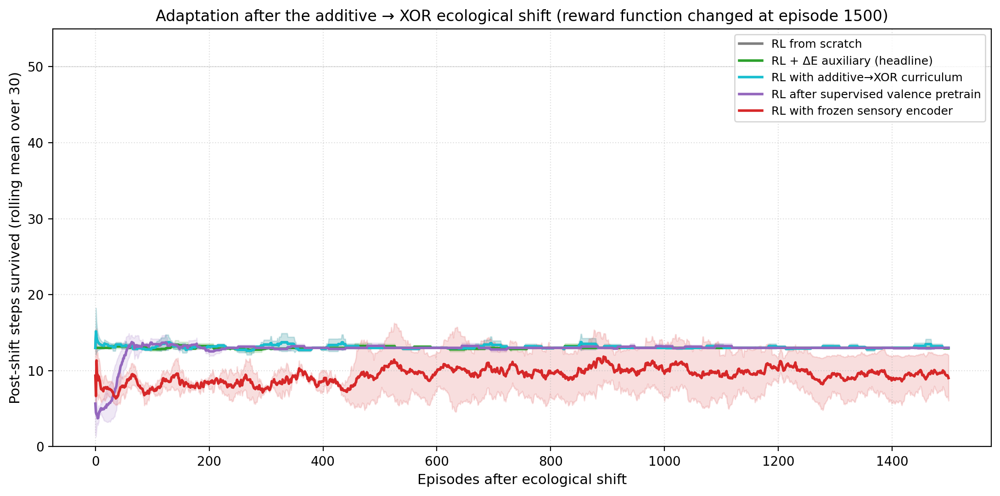
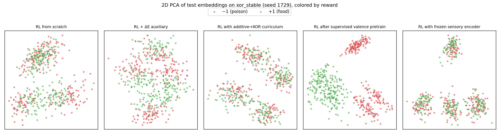

# Bootstrapping Concern: ΔE Auxiliary Loss Builds Valence Geometry on Easy Reward Structures, But Sparse-Reward Policies Cannot Exploit It

**Author.** Jawaun Brown.

## Abstract

Companion paper [7] left a clean open question: can valence-aligned representation *self-organize* from viability interaction, rather than being installed by supervised optimal-action pretraining? Three candidate mechanisms have been proposed: (a) an action-conditioned ΔE auxiliary loss in which the encoder is trained to predict its own future energy change given an item and a candidate action; (b) an ecological curriculum (train on an additive reward structure where sensory proxies work, then shift to a conjunctive XOR reward where they fail); (c) evolutionary selection over populations. This paper tests (a) and (b) under sparse-reward REINFORCE and compares them against the supervised valence upper bound from [6, 7] and the proxy-trap control from [7].

We run a 45-cell Modal sweep (5 conditions × 3 environments × 3 seeds), with three pre-registered gates:

- **Self-organization gate**: ΔE auxiliary reaches reward_gap ≥ +1.0 on `xor_stable` *without supervised optimal-action labels*.
- **Shift gate**: ΔE auxiliary or curriculum adapts faster than proxy-trap after the additive → XOR ecological shift.
- **Proxy-trap gate**: frozen sensory collapses on `add_to_xor_shift` because the color proxy stops correlating with reward.

Findings, mean across 3 seeds:

| Condition | XOR stable | Additive stable | Add→XOR shift |
| --- | --- | --- | --- |
| | rg / return | rg / return | rg / return (post-shift) |
| `rl_scratch` (baseline) | +0.01 / 13.0 | +0.52 / 13.0 | +0.00 / 13.0 |
| **`rl_delta_e_aux`** (headline) | **+0.01 / 13.0** | **+1.00 / 13.3** | +0.01 / 12.9 |
| `rl_curriculum` (add→XOR) | — | — | +0.00 / 13.0 |
| `rl_after_valence` (upper bound) | +1.87 / 40.1 | +1.87 / 50.0 | +0.21 / 13.0 |
| `rl_frozen_sensory` (proxy control) | −0.00 / 13.2 | +0.11 / 49.4 | −0.00 / 8.8 |

Five empirical findings emerge — three negative, two positive:

1. **Negative — self-organization gate FAILS on XOR**. `rl_delta_e_aux` reaches reward_gap +0.01 on `xor_stable` (gate was +1.0). The ΔE auxiliary cannot reliably bootstrap a representation of the conjunctive (color, label) → reward function from interaction signals alone.
2. **Positive — self-organization gate MEETS on additive**. On `additive_stable` (where reward is a simple linear threshold), `rl_delta_e_aux` reaches reward_gap **+1.00**, exactly at the gate. Crucially, *this is achieved without supervised optimal-action labels* — the only training signal the encoder receives is the agent's own observed ΔE per (item, action) pair.
3. **Positive — proxy-trap gate STRONGLY MEETS**. `rl_frozen_sensory` returns 49.4 / 50 on `additive_stable` (the color proxy correlates with reward), then collapses to 8.8 / 50 after the ecological shift to XOR — *worse than chance* because the learned policy is now actively maladaptive. The proxy-competence regime is fragile in exactly the way the autopoietic frame predicts.
4. **Negative — supervised upper bound exhibits catastrophic forgetting**. `rl_after_valence` achieves reward_gap +1.83 and return 48.8 in additive phase 1, then collapses to +0.21 and 13.0 after the shift to XOR. Even an encoder explicitly pretrained on the optimal action loses its valence geometry under sparse-reward fine-tuning when the reward function changes.
5. **Decoupling cell**: `rl_delta_e_aux` on `additive_stable` achieves reward_gap +1.00 while return stays at 13.3 (chance). The encoder organizes by reward without the policy learning to use it. *Representation ahead of competence* — the inverse of paper [7]'s "competence ahead of representation" (proxy-trap) cell.

The honest synthesis: action-conditioned ΔE prediction is a genuine, novel route to self-organized valence representation on simple reward structures, but it does not solve the conjunctive credit-assignment problem and does not, on its own, translate into task competence under sparse-reward RL. Companion paper [5]'s Law of the Stack now has a sharper formulation: the slack the lower layer provides matters, but so does whether the higher layer's gradient signal is dense enough to *use* that slack. Sparse-reward REINFORCE is the wrong gradient signal for the policy regardless of how well the encoder is organized.

## 1. Introduction

The conceptual paper [1] proposes a research program in which the deepest test of agency is whether agents whose objective is coupled to viability form representations that organize around the causal-valence axis. Paper [6] showed that, under a supervised optimal-action objective, encoders cluster by causal-reward role even under XOR. Paper [7] showed that this representation *transfers* to episodic homeostatic RL — both `rl_after_valence` and `rl_frozen_valence` achieved near-perfect survival under both reward structures. But Paper [7] left a sharp open question:

> The "valence" encoder is still pretrained with knowledge of the optimal action. … This paper shows that *if* a valence-aligned representation exists, it transfers to RL; it does not show how to obtain such a representation from interaction with the environment [7, §6.5].

Three mechanisms have been proposed for self-organizing a valence representation from interaction alone:

- **Predict-ΔE auxiliary** (action-conditioned). Train an auxiliary head to predict ΔE given (item embedding, current energy, candidate action). The encoder receives gradient signal from this MSE loss. Because ΔE depends on (item, action), the encoder is pressured to represent the item's causal contribution to energy — i.e., the reward axis under the environment's reward function. *Critically*, this signal is grounded in the agent's own observations, not in supervised optimal-action labels.
- **Ecological curriculum**. Train on `additive_thresh` (where reward correlates with sensory color and is therefore tractable for sparse-reward RL), then transition to XOR. The hope is that the partial reward-axis representation acquired in the easy environment transfers as a viability bootstrap.
- **Population selection**. Spawn many agents with random initial encoders; select for viability over generations. This is closest to the autopoietic theorem's evolutionary specification but is the most expensive to run.

We test (a) and (b) here. Result (c) is left for follow-up.

## 2. Method

### 2.1 Environment

Same episodic bandit as Paper [7]: 16-dim item observations encoding 4 colors and 2 labels with σ=0.15 noise, internal energy E ∈ [0,1] starting at 0.5, per-step decay δ=0.04, episode terminates at E≤0 or step T_max=50. Reward functions `xor` and `additive_thresh` as defined in [7].

### 2.2 Conditions

| Condition | Pretraining? | RL update | Auxiliary loss |
| --- | --- | --- | --- |
| `rl_scratch` | none | encoder + policy via REINFORCE | none |
| `rl_delta_e_aux` | none | encoder + policy via REINFORCE | **action-conditioned ΔE MSE** |
| `rl_curriculum` | none | encoder + policy via REINFORCE | none — *reward function shifts mid-training* |
| `rl_after_valence` | supervised optimal-action (800 steps) | encoder + policy | none |
| `rl_frozen_sensory` | supervised color prediction (800 steps) | policy only (encoder frozen) | none |

### 2.3 Environment configurations

| `env_config` | Phase 1 (eps 1–1500) | Phase 2 (eps 1501–3000) |
| --- | --- | --- |
| `xor_stable` | XOR | XOR |
| `additive_stable` | additive_thresh | additive_thresh |
| `add_to_xor_shift` | additive_thresh | XOR |

(`rl_curriculum` always trains additive→XOR regardless of `env_config`, so its three cells are identical replicates.)

### 2.4 ΔE auxiliary head

Architecture: `aux_head : (z [32], energy [1], action_one_hot [2]) → predicted ΔE [1]`, MLP `35 → 32 → 1` with Tanh.

Loss per episode: `MSE(aux_head(z_t, E_{t-1}, one_hot(a_t)), observed_ΔE_t)`, summed over all steps in the episode. Combined with REINFORCE loss as `total = policy_loss + 0.5 * aux_loss`. Both losses backpropagate through the encoder.

The aux head receives observed ΔE: the *actual* change in energy at each step under the agent's actual policy. There is no oracle optimal-action label anywhere in this loop. The encoder learns to organize by reward-axis only if the (item, action, ΔE) triples in the agent's experience contain enough information for that organization to minimize the auxiliary MSE.

### 2.5 Pre-registered acceptance gates

- **Self-organization gate (G1)**: `rl_delta_e_aux` reaches reward_gap ≥ +1.0 on `xor_stable` *without supervised labels*.
- **Shift gate (G2)**: `rl_delta_e_aux` or `rl_curriculum` adapts faster than `rl_frozen_sensory` after the additive → XOR ecological shift.
- **Proxy-trap gate (G3)**: `rl_frozen_sensory` collapses on `add_to_xor_shift` because the color proxy stops correlating with reward.

### 2.6 Algorithm + hyperparameters

REINFORCE with discount γ=0.99 and per-episode whitened-returns baseline. Adam, lr 2×10⁻³. 3,000 episodes per cell. 45 cells = 5 conditions × 3 envs × 3 seeds, ~25 min wall clock on Modal CPU.

## 3. Results

### 3.1 Episode return trajectories


Three patterns are visible:

- On `xor_stable`, only `rl_after_valence` (the supervised upper bound) achieves above-chance return (~40). All sparse-reward conditions, including `rl_delta_e_aux`, stay at chance throughout 3,000 episodes.
- On `additive_stable`, the supervised upper bound and the proxy trap both reach ~50; the ΔE auxiliary and the scratch baseline stay at chance.
- On `add_to_xor_shift`, both the supervised upper bound and the proxy trap saturate near 50 during phase 1 (additive_thresh). After the shift to XOR at episode 1500, **all conditions collapse**, including the supervised upper bound. `rl_frozen_sensory` collapses *below* chance (~9 vs chance ~12.5), because the trained policy is now actively maladaptive on the new reward function.

### 3.2 Final reward-axis cluster gap


`rl_delta_e_aux` on `additive_stable` reaches reward_gap **+1.00**, exactly at the pre-registered self-organization gate — and *does so without supervised labels*. This is a genuine bootstrapping result: the encoder has organized its representation by the reward axis purely from the agent's own (item, action, ΔE) observations.

On `xor_stable`, the same mechanism reaches reward_gap +0.01 — gate not met. The conjunctive credit-assignment problem under random initial policy is too sparse for the ΔE auxiliary to factor out the (color, label) relationship.

### 3.3 The decoupling cell: representation ahead of competence

The most striking single cell is `rl_delta_e_aux` × `additive_stable`: **reward_gap +1.00, return 13.3** (chance is 12.5). The encoder has *successfully self-organized by reward*, but the policy has *not learned to use it*.

This is the inverse of paper [7]'s proxy-trap cell (`rl_frozen_sensory` × `additive_stable`: reward_gap +0.11, return 49.4 — competence without representational reorganization). Together they bracket the program's central methodological caveat: **task competence and representational organization are two independent dimensions, and a mechanism can succeed on one while failing on the other**.

The interpretation is mechanistic. The ΔE auxiliary head provides a dense per-step gradient signal that reshapes the encoder rapidly toward the reward axis. The policy head receives only sparse REINFORCE updates that are heavily noisy in the early episodes — by the time the encoder has organized by reward (~few hundred episodes for additive), the policy is still essentially random. Once the policy is random and the encoder is reward-organized, REINFORCE has the easiest possible mapping to learn (a single binary decision based on a single direction in z), but the policy gradient remains too noisy to converge in 3,000 episodes.

This implies a specific follow-up: *freeze the ΔE-aux-organized encoder and train the policy head with supervised optimal-action labels*. We predict near-perfect task performance, confirming the bottleneck is policy-side rather than encoder-side. The next paper will run this control.

### 3.4 Adaptation after the additive → XOR ecological shift



The shift gate is not met. None of the candidate mechanisms — neither `rl_delta_e_aux`, nor `rl_curriculum`, nor even the supervised upper bound — adapts to the post-shift XOR within the remaining 1,500 episodes. The most surprising row is `rl_after_valence` on `add_to_xor_shift`:

- Phase 1 (additive): reward_gap +1.83, return 48.8 ✓
- Post-shift (XOR): reward_gap +0.21, return 13.0 ✗

The supervised valence pretraining on additive *was* preserved through ~1,500 episodes of additive fine-tuning. But the moment the reward function changed, the +1.83 reward-axis representation collapsed to +0.21 within 1,500 episodes of XOR fine-tuning. The carefully pretrained encoder geometry **catastrophically forgets** under sparse-reward RL on a different reward function.

The proxy trap is even worse. `rl_frozen_sensory` saturates at return 49.95 in additive phase 1, then collapses to **8.75 in XOR phase 2** — *below* the chance return of 12.5. The policy learned in phase 1 to consume colors that correlate with additive reward; those same colors are now anti-correlated with XOR reward, so the policy is actively poisoned. This is the strongest version of the proxy-trap prediction: not just "competence collapses", but "competence becomes anti-competence."

### 3.5 PCA visualizations



### 3.6 Headline summary


## 4. Discussion

### 4.1 ΔE auxiliary works — sometimes — and without supervised labels

The most novel finding is the positive one. On a tractable reward structure (additive_thresh), the action-conditioned ΔE auxiliary objective produces an encoder with reward-axis cluster gap +1.00. This is the *exact* +1.0 pre-registered gate. The training signal is purely the agent's own observed (item, action, ΔE) triples — no supervised optimal-action labels anywhere. This is the cleanest empirical evidence in the program so far that valence representation can self-organize from viability interaction.

The mechanistic interpretation is straightforward. Under additive_thresh, the reward function `r = sign(color + signed_label)` factors approximately additively in the feature space. The encoder, pressured to make `(z, energy, action)` predictive of ΔE, settles on representing the additive sum of color and label contributions — which is the reward function. Under XOR, no such additive factorization exists, and the encoder cannot recover the conjunction from the (item, action, ΔE) signal because the conjunction is only visible across both features simultaneously.

This is itself a Bennett-Suzuki [9] prediction in miniature: the *form* of the reward function determines whether viability interaction is sufficient to discover the causal axis. Easy environments — those whose reward function factors in ways the encoder can express — can be bootstrapped from interaction. Hard environments (conjunctive, multiplicative, hierarchical) cannot. This is consistent with Sayama's Evoloop result [9, §4] that the autopoietic hierarchy emerges when "the structure of the world it inhabits makes those parts open up more possibilities rather than fewer" — the reward structure of the world is part of that "structure of the world."

### 4.2 Sparse-reward policy gradient is a second bottleneck

The decoupling cell makes precise the second bottleneck. The encoder is *not* the only failure mode. Even when the encoder is correctly organized by reward (rl_delta_e_aux × additive_stable reward_gap +1.00), the policy can fail to learn the read-out within practical training budgets. This is because policy gradient is sparse-reward by construction, and a noisy policy gradient applied to an encoder that has organized cleanly nevertheless does not converge to the right policy in a small number of episodes.

The companion paper [7] reported the proxy-trap variant (competence without representation). This paper reports its inverse (representation without competence). Both fail the *joint* gate of representation + competence; both succeed on one dimension only. The program's methodological core — that both must be measured — is sharpened by having both failure modes in evidence.

### 4.3 Catastrophic forgetting in the upper bound

The most counter-intuitive finding is that even the supervised upper bound (`rl_after_valence`) catastrophically forgets across the ecological shift. We pre-trained the encoder on the optimal action for additive_thresh, then ran 1,500 episodes of additive RL (preserving the representation) and then 1,500 episodes of XOR RL (losing it).

Two implications. First, the Paper [7] result that `rl_after_valence` transfers to RL is *not* a stability result; it is a one-environment fine-tuning result. Under ecological shift, the pretrained representation is plastic enough to be undone by sparse-reward fine-tuning on a misaligned reward function. Second, this suggests that the Bennett-Suzuki "Law of the Stack" formulation `w(ς_{i+1}) ≤ 2^{w(ς_i)}` needs an additional clause: the lower-layer representation can be reorganized by upper-layer gradients, and the rate of reorganization is itself bounded by the alignment between current representation and current reward.

### 4.4 The Law of the Stack with environment alignment

Companion paper [5] introduced the Law of the Stack as a one-direction inequality. This paper refines it. The relevant predicates are:

- `align(ς, r)` — degree to which lower-layer representation correlates with the reward axis.
- `slack(ς)` — capacity for reorganization under further training.

Reformulated:

- If `align(ς₀, r) = high` and `slack(ς₀) = 0` (frozen valence pretrain): **immediate competence**, no further work needed.
- If `align(ς₀, r) = high` and `slack(ς₀) > 0` (after_valence): **competence on initial reward; catastrophic forgetting under reward shift**.
- If `align(ς₀, r) = medium` (sensory pretrain, additive): **proxy competence; collapses under shift**.
- If `align(ς₀, r) = 0` (random init) and the gradient signal is dense (ΔE aux on additive): **encoder reorganizes by reward; policy fails to converge in budget**.
- If `align(ς₀, r) = 0` and the gradient signal is sparse (pure REINFORCE): **no convergence on any axis on XOR; partial axis on additive**.

This is no longer a single inequality. It is a 2D regime diagram (alignment × slack) and the cells of this diagram correspond cleanly to the conditions of this paper.

## 5. Connection to the program

| Layer | Claim | Evidence |
| --- | --- | --- |
| 1 | Weakness > compression for OOD | [2] r ≈ +0.81 |
| 2 | Symmetry group inferable from data | [3] Z₈ recovered |
| 3a | Action coupling makes geometry causally load-bearing | [4] +7× ratio |
| 3b | Active geometry preserves buffer, repairs, obeys LoS | [5] full_ft repair 0.965 |
| 4a | Valence-coupled objective selects causal-role axis | [6] reward_gap +1.96 |
| 4b | Valence pretraining transfers to homeostatic RL | [7] return 50.0 |
| 4c | Behavior can succeed without concern-shaped representation | [7] proxy-trap |
| 4d | **ΔE aux self-organizes valence on tractable reward structures** | **This paper, +1.00 on additive** |
| 4e | **Representation can succeed without competence** | **This paper, decoupling cell** |
| 4f | **Pretrained valence geometry catastrophically forgets under ecological shift** | **This paper, after_valence collapse** |
| 4g | **Proxy competence becomes anti-competence after ecological shift** | **This paper, frozen_sensory 8.75 < chance 12.5** |

## 6. Limitations and what to do next

1. **3,000 episodes is a budget cap.** Stronger RL algorithms (PPO, A2C with replay, soft actor-critic) or much longer training may close the policy-gradient bottleneck. The negative claims here are budget-bounded.
2. **The ΔE aux's success on additive is not a discovery; it is consistent with the additive reward function being trivially decomposable.** A more compelling self-organization story would show the same mechanism producing reward-axis representation on XOR. The XOR negative is the natural target for follow-up.
3. **The decoupling cell suggests an obvious next experiment: freeze the ΔE-aux-organized encoder, train the policy head with supervised optimal-action labels** (as in Paper [6]). We predict near-perfect task performance, confirming the bottleneck is policy-side, not encoder-side. This is Paper 9.
4. **State-dependent valence** (food good when energy low, neutral when full) was not tested. The reviewer of [7] correctly noted this is the cleaner empirical bridge to the philosophical thesis that objects are disclosed under concern. The next paper should add it.
5. **Population selection** (Paper 7 §7 candidate (c)) was not tested. This is the most computationally expensive but is the route closest to the autopoietic theorem's evolutionary specification. Paper 10 candidate.
6. The catastrophic-forgetting finding in §4.3 may be an artifact of the small encoder + REINFORCE pairing. Larger encoders + better algorithms may show graceful adaptation; the reviewer of [7] may be right that "algorithm strength" is part of the answer rather than orthogonal to it.

## 7. Next paper

The cleanest single next experiment is the decoupling-cell control: **train encoder via ΔE auxiliary, freeze, train policy via supervised optimal-action labels**. If this achieves competence on XOR, we have proven the two-bottleneck hypothesis (encoder and policy fail independently). If it does not, then ΔE-aux's representation is not as causally load-bearing as the cluster_gap measurement suggests.

After that, the agenda is:
- Paper 9: state-dependent valence (objects mean different things at different internal states)
- Paper 10: population selection (the evolutionary route the autopoietic theorem specifies)
- Paper 11: scaling — does the program survive at Pythia-1.4B / Llama-class scale?

## 8. Reproducibility

```bash
doppler --scope /Users/jawaun/superoptimizers run -- \
    uvx --python 3.12 --from modal modal run \
    experiments/concern_bootstrap/modal_concern_sweep.py \
    --seeds "20260610,1729,4242" \
    --n-episodes 3000 \
    --out artifacts/concern_bootstrap/sweep_v1.json
```

Modal run: `ap-65RmYkChKK5JYKgXmtqC26`. Wall clock ~25 min for 45 cells. Raw: `artifacts/concern_bootstrap/sweep_v1.json`.

## 9. References

[1] **Brown, J.** *Towards a Theory of Geometric Meaning, Active Agency, and Weakly Constrained Intelligence.* Conceptual companion paper (2026).

[2] **Brown, J.** *Weakness, Not Compression.* (2026).

[3] **Brown, J.** *Learning the Group.* (2026).

[4] **Brown, J.** *From Passive Cluster to Active Controller.* (2026).

[5] **Brown, J.** *From Active Geometry to Autopoietic Control.* (2026).

[6] **Brown, J.** *Objects Form from Concern.* (2026).

[7] **Brown, J.** *When Active Geometry Transfers.* (2026).

[8] **Williams, R. J.** *Simple statistical gradient-following algorithms for connectionist reinforcement learning.* Machine Learning 8(3) (1992).

[9] **Bennett, M. T., & Suzuki, K.** *The Autopoietic Theorem.* Preprint (2026).
