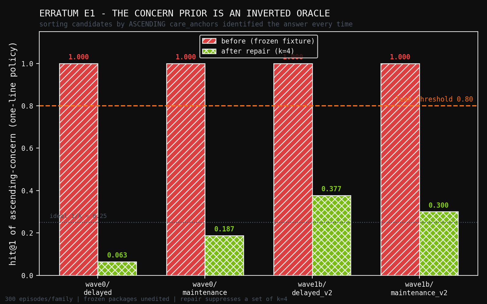

# Erratum E1: A Perfect Inverted Oracle in the Concern-Gated Retrieval Fixtures

**Human director:** Jawaun Brown
**Producing agent:** Claude Code, directed
**Program:** Concern-Gated Retrieval (COGR)
**Status:** erratum. Corrects the record of PRs #411, #412, #413, #414, #415.
**Date:** 2026-07-24

---

## Summary

After the concern-gated retrieval arc's five papers were merged, a routine
information-content check on the concern channel returned an extreme answer:
sorting candidates by **ascending** `care_anchors` and taking the first
achieves **hit@1 = 1.000** on every family tested, including the confirmatory
pool Wave 1b ran on. `care_anchors` is a policy-visible field, so a one-line
policy outperforms every mechanism the program built.

This erratum records the defect, its root cause, precisely what it does and
does not invalidate, the repair, and the one-sort gate that would have caught
it at Wave 0. The frozen packages are deliberately left unedited so the
historical record and its analysis hashes stay intact and the defect stays
visible.



**Found:** 2026-07-24, after PRs #411, #412, #413, #414, #415 were merged.
**Severity:** program-wide fixture defect. Affects Wave 0, Wave 1a, Wave 1b, MX1.
**Frozen packages are NOT edited.** `wave0/` and `wave1b/` stand as the
historical record with the defect documented; their analysis hashes remain
valid for what they hashed. The repair lives here, alongside.

## 1. The defect

Sorting candidates by **ascending** `care_anchors` and taking the first
achieves **hit@1 = 1.000**:

| family | bucket | descending hit@1 | **ascending hit@1** |
|---|---|---:|---:|
| `wave0/delayed_commitments` | calibration | 0.0000 | **1.0000** |
| `wave0/maintenance_fault` | calibration | 0.0000 | **1.0000** |
| `wave1b/delayed_commitments_v2` | calibration | 0.0000 | **1.0000** |
| `wave1b/delayed_commitments_v2` | **confirmatory** | — | **1.0000** (300/300) |
| `wave1b/maintenance_fault_v2` | calibration | 0.0000 | **1.0000** |

`care_anchors` is a **policy-visible field on `EpisodeContext`** — handed to
every policy by design. So a one-line policy outperforms every mechanism the
program built.

## 2. Root cause

Wave 0 `PREREGISTRATION.md` §5 specifies the adversarial prior as: inflate a
plausible alarm region to `W_ALARM_INIT = 1.0`, and suppress *"at least one
true commitment region"* to `W_COMMIT_INIT = 0.05`. The families implement it
as:

```python
prior[load_bearing] = W_COMMIT_INIT      # exactly ONE node -- and it IS the answer
```

Concern over candidates therefore takes three values — `0.2` baseline (~10
nodes), `1.0` alarm (~2 nodes), `0.05` suppressed (**exactly 1 node, the
answer**). The suppressed value uniquely identifies the target. The prior is
adversarial as intended; it is *also* a perfect inverted oracle, which was not
intended.

## 3. Why every gate missed it

- **G0 `IntegrityAudit`** forbids policy code from dereferencing `role`,
  `utility`, `_answer_key`. `care_anchors` is none of those — it is a
  legitimate policy input, so nothing fired.
- **G9 leakage audit** (label-permutation + randomized-generator) audited the
  **learned geometry** (`learn_graph`). The leak is in the hand-authored
  prior, which G9 never inspected.
- **Wave 1a G3 specificity** compared *information-matched* signals
  (recency / value / priority / salience / wrong-agent). It never tested an
  **inverted** reading of any signal, including concern itself.

The common shape: every gate asked "can the policy reach something forbidden?"
None asked "does something *permitted* already contain the answer?"

## 4. Validity impact — what stands, what changes

### Stands (leak cancels; concern held constant across both arms)

- **Wave 1b L1 KILL.** The contrast is `LEARNED` vs `FREQ_MATCHED_RANDOM`
  geometry with `FROZEN_WRONG` concern **identical in both arms**. The leak is
  present equally on both sides and cancels in the paired difference.
  *"Learned geometry ≈ degree-matched random"* is unaffected.
- **Wave 1b G2** interventional edge-ablation — a geometry intervention with
  concern constant.
- **Wave 1b G9's conclusion about the geometry** — correct for what it audited.
- **MX1 Part B** (verifier split, 109/109 → 0, precision 1.0 on 6,920
  controls). It scores sets against planted bundles and never touches concern
  ranking. Unaffected.

### Re-explained, not invalidated (the leak supplies the missing mechanism)

- **Wave 0's headline** — `multiplicative_ppr` sitting ~10× *below* the best
  matched-budget baseline. `multiplicative_ppr` **upweights** concern, and
  high concern is precisely the non-answer. The mechanism was not merely using
  a wrong prior; it was using a *perfect* signal with **inverted sign**. That
  is why it did so badly, and it is a sharper statement than the original.
- **MX1 Part A.** `concern_sequential` ranks by `multiplicative_ppr`, i.e. it
  is steered actively *away* from the target. Its `0.545` success rate came
  from exhausting ~6 of ~13 candidates, not from the ranking.

### Newly questionable

- Every **absolute** performance number in the program was measured on a
  substrate where a one-line policy scores `1.000`. Success rates such as
  MX1's `0.545` mean "these policies ignored a perfect signal in their own
  input," not "the task is hard."
- **Wave 1a's G3 specificity KILL** — `info_matched_recency` reproducing the
  oracle ceiling is less remarkable once min-concern *is* the oracle. The
  specificity slate should have carried an inverted-concern comparator.
- The **two-flashlight thesis was never tested as posed.** Concern was not a
  weak second signal to be combined with context; it was an oracle used
  backwards.

## 5. The repair

`prior_repair.repair_wrong_prior` suppresses a **set** of `k` candidates — the
load-bearing node plus `k-1` non-answer, non-alarm distractors — instead of
the answer alone. This honours the preregistration's actual wording
("suppress at least one true commitment region") while removing
identifiability. Measured at `k = 4`, 300 episodes per family:

| family | before | after repair |
|---|---:|---:|
| `wave0/delayed_commitments` | 1.0000 | **0.0633** |
| `wave0/maintenance_fault` | 1.0000 | **0.1867** |
| `wave1b/delayed_commitments_v2` | 1.0000 | **0.3767** |
| `wave1b/maintenance_fault_v2` | 1.0000 | **0.3000** |

All fall below the `0.8` leak threshold.

**Residual, stated honestly.** The ideal post-repair value is `1/k = 0.25`;
two families land above it (`0.3767`, `0.3000`). The cause is deterministic
tie-breaking by node id inside the suppressed set, which leaks a little
positional information. A stricter repair would randomise tie-breaking. The
current repair is sufficient to clear the gate but is **not** a
fully-randomised control.

## 6. The gate that would have caught it

`inverted_signal_audit.audit_signal` scores every policy-visible signal `s` in
**both** directions against the answer key and flags a leak if *either*
reaches `hit@1 >= 0.8`. One sort per signal per direction; seconds to run.

**Standing rule for this program:** at fixture-freeze time, audit every
policy-visible field in both orderings. Every gate the program had asked
whether the policy could reach something *forbidden*. None asked whether
something *permitted* already contained the answer.

## 7. Reproduce

```
uv run --no-sync python -m experiments.concern_gated_retrieval_e2.erratum_e1.verify_erratum
```

Receipt: [`results/erratum_receipt.json`](results/erratum_receipt.json).
Local CPU, seconds, no Modal.
