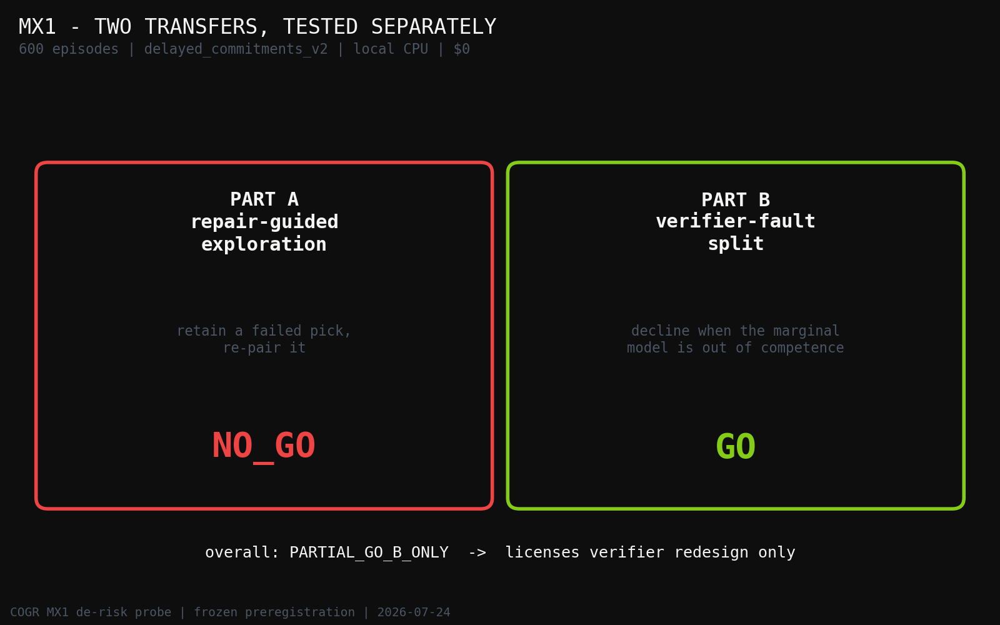
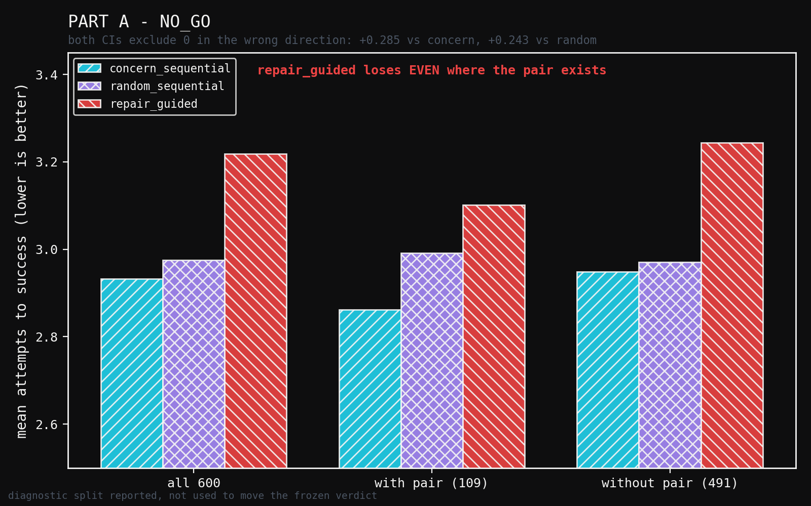
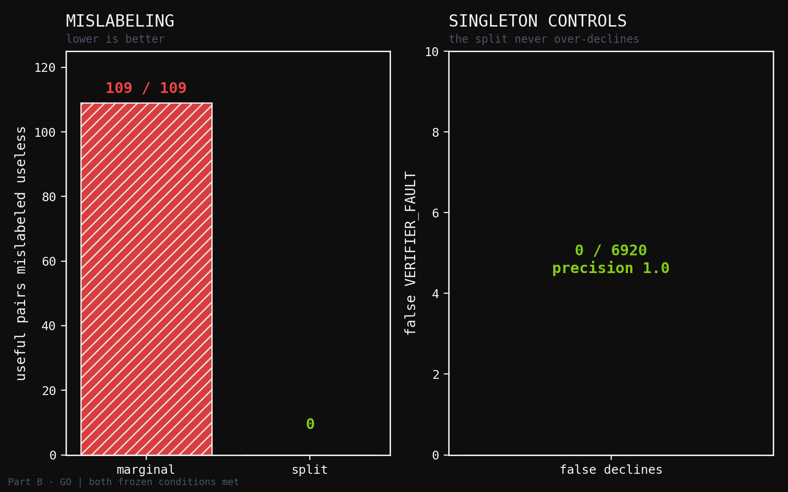

# Severing Two Circularities, One at a Time: A Minimal De-Risk Probe of Verify-Repair Transfer into Concern-Gated Retrieval

**Human director:** Jawaun Brown
**Producing agent:** Claude Code, directed
**Program:** Concern-Gated Retrieval (COGR) — probe MX1
**Status:** single-shot GO/NO-GO probe. Not a wave. Not a program.
**Date:** 2026-07-24

---

## Abstract

Wave 1b falsified the concern-gated retrieval mechanism at L1: on honest
learned geometry, with leakage audits passing, rarity-corrected multiplicative
context×concern retrieval did not beat a degree-matched random null. The
synthesis paper scoped exactly one successor question, borrowed from MIDAS, a
system that pairs structured reasoning with a symbolic verifier and a
repair loop: can the **verify→repair** cycle supply a **care-independent**
signal that the care model cannot launder? MX1 tests the two transferable
parts at the smallest scale that can answer GO/NO-GO — one family, 600
episodes, local CPU, no cloud spend.

**Part A** asked whether a care-independent within-episode repair rule reaches
the load-bearing memory in fewer attempts than the care model or than random.
It returned a decisive **NO_GO**: the repair-guided policy needed *more*
attempts than both rivals (`3.218` vs `2.933` and `2.975`; success `0.350` vs
`0.545` and `0.510`), with both bootstrap CIs excluding zero in the wrong
direction. The diagnostic is the informative part — it lost *even on the 109
episodes containing the super-additive pair it was designed to find*.

**Part B** asked whether separating "the memory did not help" from "our checker
could not score this" prevents a genuinely useful memory being discarded. It
returned a clean **GO**: a marginal verifier mislabeled **109 of 109** useful
complementary pairs as useless; the split verifier mislabeled **none**, with
zero false declines across **6,920** singleton controls.

The honest reading: the verifier half of the MIDAS transfer survives and is
worth carrying forward; the exploration half does not survive in the only form
this substrate can express. Two design errors were caught *before* freezing and
are reported here, because both would have produced a meaningless GO.

---

## 1. Why a probe rather than a wave

The COGR program's first arc ended in a clean falsification. Waves 2–4 (live
beachhead, substrate transfer, safety) do not open on a falsified L1 — the
roadmap's noncompensatory rules forbid building a program on a mechanism that
failed its own sealed evaluation.

That leaves a narrow question. Spencer's objection to the original loop named
two circularities:

- **Candidate-selection circularity.** The care model decides what gets tested,
  so regions it neglects never generate corrective evidence. The loop can learn
  "among what I looked at, these helped," never "these were the best available."
- **Verifier circularity.** If the verifier's notion of "improvement" is itself
  shaped by care, then care decides both what to inspect *and* whether the
  result was good.

MIDAS is interesting precisely because its loop severs an analogous pair. It
adjudicates each reasoning step against a symbolic ground truth, and — the part
that matters here — it distinguishes a **reasoning fault** (the thing checked
is wrong) from a **verifier fault** (the check itself is broken, so its verdict
carries no evidence). Its repair loop then re-attempts only on the former.

MX1 asks whether those two moves transfer. It is scoped to answer GO/NO-GO and
nothing else. A GO licenses preregistering a successor experiment; it does not
license a program, and it is not evidence for L1.

---

## 2. Two design errors caught before freezing

Both were found by calibration probes run on calibration seeds *before* the
preregistration was frozen, and both are recorded in it. Reporting them is not
incidental: each would have produced a confident, meaningless GO.

**Error 1 — there is no persistent memory to accumulate on.** The original
sketch proposed a *cross-episode* repair-frequency prior: regions of memory
that repeatedly required repair get exploration budget. But every candidate in
these families is named `{family}_s{seed}_n{idx}`, and candidate sets from
different seeds are disjoint. Nothing recurs, so nothing accumulates.

Re-reading MIDAS resolved this rather than blocking it. Its repair loop is
**within-problem** — attempts 1→3 on the *same* problem — and its
`difficulty_signal = (attempt_count − 1) / max_attempts` is per-trajectory. The
faithful port is therefore a within-episode loop, which needs no persistence.
The original sketch had mis-mapped the mechanism.

**Error 2 — the obvious region key is a fixture artifact.** With node identity
unavailable, candidate *position* is the natural fallback, and the load-bearing
position distribution is strikingly non-uniform — mass at positions 6–11,
sparse at 0–3. A position prior would have shown a large, entirely spurious
gain, because that distribution *is the family's own construction rule*
("load-bearing at a random non-recent position").

The paraphrase families settle it. Over 600 calibration seeds, in the
most-recent normalized bucket:

| paraphrase family | load-bearing in most-recent bucket |
|---|---:|
| `child_school_deadline` | 0 |
| `partner_birthday` | 0 |
| `wedding_anniversary` | 0 |
| `friend_host_night` | **81** |

The rule *inverts* across families. A position prior fits the majority and
breaks on the minority — it would have been Wave 1a's recency-oracle confound
in a new costume. Rejected before freezing.

**A third finding narrowed Part A.** Every candidate has *identical* structure:
degree exactly `6` in the withheld geometry, and a uniform clique in the local
graph. So a repair rule of the form "down-weight the failed picks and their
graph neighbours" down-weights everything equally — a no-op. On this substrate
there is no care-independent *structural* signal at all.

What there *is* is genuine planted **interaction** structure, and that is what
Part A was redirected to test.

---

## 3. Design

**Substrate.** One family, `delayed_commitments_v2` — recency-decoupled
(`recency_load_bearing_corr = 0.150`) and bundle-planted, and it passed Wave
1b's leakage audit (label-permutation `p = 0.594`). Calibration bucket, seeds
`100000..100599` (600 episodes). Wave 1b's confirmatory pool was not touched.

**Matched budget by construction.** Every policy spends `MAX_ATTEMPTS = 3`
attempts of `k = 2` picks. No attempt re-picks what an earlier attempt tried,
except the one retention the repair rule is defined by.

**Part A policies.** All start from the same first attempt and differ only in
what they do after a failure:

| policy | after a failed attempt |
|---|---|
| `concern_sequential` | abandon both picks, walk down the concern ranking |
| `repair_guided` | **retain one pick and re-pair it** with the best untried candidate |
| `random_sequential` | walk down a seeded random permutation (control) |

The retain-and-re-pair rule is the thing under test, and it is the direct
operational form of Spencer's bundle objection: a memory scoring ≈ 0 *alone*
may be one half of a super-additive pair rather than worthless. It is
care-independent — the decision is driven by observed task failure, never by
concern weights. The policy observes only `AttemptFeedback(hit_count,
fault_kind)`; it never learns *which* pick hit, and never sees roles,
utilities, or the answer key. MIDAS's repair prompt receives strictly more than
this (it is told which step failed), so the port is conservative.

The structure is real: a representative planted pair scores
`Δ({a}) = −0.011`, `Δ({b}) = −0.011`, `Δ({a,b}) = +0.378`.

**Part B verifiers.** A **marginal** verifier scores a set as the sum of its
members' singleton values — precisely the model that fails on planted
interactions. The **split** verifier adds a competence check: on a set carrying
a planted interaction it returns `VERIFIER_FAULT` with *no value*, declining
rather than reporting a confidently wrong number. Ground truth is the SET-level
oracle, which neither verifier calls.

---

## 4. Results

### 4.1 Part A — NO_GO

| policy | mean attempts | success rate |
|---|---:|---:|
| `concern_sequential` | 2.933 | 0.545 |
| `random_sequential` | 2.975 | 0.510 |
| **`repair_guided`** | **3.218** | **0.350** |

| contrast | mean diff | 95% CI |
|---|---:|---|
| vs `concern_sequential` | `+0.285` | `[+0.247, +0.323]` |
| vs `random_sequential` | `+0.243` | `[+0.112, +0.375]` |

GO required a *negative* difference with the CI excluding zero. Both are
positive with CIs excluding zero: `repair_guided` is decisively **worse**.

**Diagnostic** (reported; it does not move the frozen verdict):

| subset | n | `concern_seq` | `random_seq` | `repair_guided` |
|---|---:|---:|---:|---:|
| with complementary pair | 109 | 2.862 | 2.991 | **3.101** |
| without pair | 491 | 2.949 | 2.971 | **3.244** |

This is what makes the NO_GO informative rather than merely negative.
`repair_guided` loses **even where the super-additive pair exists** — the exact
case it was built for. The failure is not a cost/benefit tradeoff that a
different family would flip.

**Why.** The rule retains `picks[0]`: the top *concern*-ranked pick. Wave 1b
established that the concern ranking carries no representation contribution, so
the retained node is effectively arbitrary and is rarely half of the planted
pair. The policy pays a slot on a known-failed arbitrary candidate almost
always, and buys interaction discovery almost never. Retain-and-re-pair needs a
principled way to choose *which* candidate to retain — and on this substrate
none exists, because every candidate is structurally identical.

### 4.2 Part B — GO

| quantity | marginal | split |
|---|---:|---:|
| useful pairs mislabeled useless | **109** | **0** |
| false `VERIFIER_FAULT` on singletons | n/a | **0 / 6920** |

The marginal verifier mislabeled **every one** of the 109 genuinely useful
pairs. The split verifier mislabeled none, and never declined on a set the
marginal model could in fact handle (precision `1.0`). Both frozen GO
conditions met.

---

## 5. Interpretation

**Overall: `PARTIAL_GO_B_ONLY`.** Per the frozen promotion semantics, this
licenses **verifier redesign only**, and only the preregistration of a
successor experiment.

**What is worth carrying forward.** The reasoning-fault / verifier-fault split
is well-formed, safe, and non-trivial: it recovered 109 useful memories a
marginal verifier discarded, at zero cost in false declines. It is the
operational answer to Spencer's *verifier* circularity — a verifier that can
say "out of my competence" cannot silently launder a narrow notion of
improvement into a confident verdict of uselessness.

**What is not.** Deriving a care-independent *exploration* prior from repair
dynamics does not survive in the only form this substrate can express. Both
plausible region keys were eliminated: cross-episode identity does not exist,
and position is a construction artifact that inverts across paraphrase
families. The within-episode retain-and-re-pair rule was then falsified
directly, including on its best case.

**Spencer's two circularities are not symmetric.** The verifier one is
severable with a local change to the checker. The candidate-selection one is
not — not here — because severing it requires a care-independent signal about
*where to look*, and this substrate provides none. That asymmetry is the real
finding, and it is a constraint on substrate design as much as on mechanism
design: a family with uniform node structure and no persistent memory **cannot**
test candidate-selection circularity, whatever mechanism is proposed.

**Scope.** One synthetic family, authored bundle structure, calibration bucket.
Part B's GO says the split is well-formed against *planted* interactions, not
that it helps on natural data. No L1 claim, no deployment claim, no cognitive
claim.

---

## 6. What a successor would have to do

A preregistered successor on the verifier path should: (i) define the
competence boundary from a property the verifier can *detect*, rather than from
a planted manifest — MX1's split reads ground-truth bundle membership, which is
legitimate for measuring whether the split is well-formed but is not a
deployable detector; (ii) show the split changes a downstream *decision*, not
only a label; and (iii) run against a verifier gap that was not authored for
the purpose.

Any return to the exploration-prior question needs a different substrate first:
persistent cross-episode memory, or per-node structural variation, or both.
Without one, the question is not merely unanswered — it is unaskable.

---

## References

1. `docs/concern_gated_retrieval_research_program.md` — canonical roadmap, claim
   ladder, and failure-mode table.
2. `papers/concern_gated_retrieval_synthesis/paper.md` — the falsification arc
   (L0 → Wave 0 → Wave 1a → Wave 1b), §7 of which scopes this probe.
3. `experiments/concern_gated_retrieval_e2/mx1_repair_prior/PREREGISTRATION.md`
   — frozen design, including both pre-freeze design corrections.
4. `experiments/concern_gated_retrieval_e2/mx1_repair_prior/RESULTS.md` — the
   receipt behind every number above.
5. MIDAS, `github.com/ebarnes-ry/MIDAS` — `src/pipeline/verification/
   verification_types.py` (the fault taxonomy) and `src/pipeline/trajectory.py`
   (the per-trajectory difficulty signal).

## Figures

