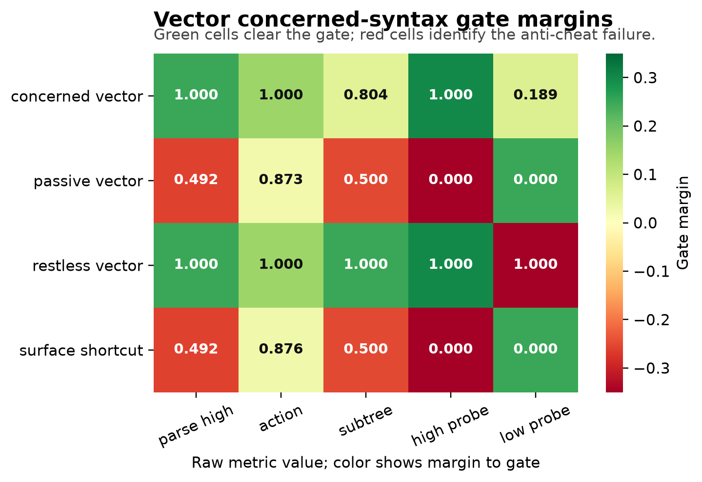

# Constituency Tests for Concerned Representation in Minimal Agents

**Jawaun Brown**  
2026-06-18

## Abstract

Arc 1 of the maintained-concern program showed that a minimal homeostatic agent
can detect boundary staleness, allocate costly null probes, saturate after
identification, and re-engage after regime shifts. It also found a precise
ceiling: under a shared-head, null-only intervention regime, better probe
policy no longer closes role-specific mediated identifiability. This paper
opens Arc 2A by asking whether the next intervention problem is syntactic:
can a concerned agent discover which parts of a world belong together
causally?

We introduce the **Concerned Shape Grammar**, a symbolic benchmark inspired by
constituency tests from cognitive work on geometric shape syntax. A visible
six-part shape can have the same surface but different hidden parse trees.
Causal roles such as shield, poison, repair, core, food, and trap interact
only when they are bound inside the same constituent. The agent must decide
whether to pay for an intervention that reveals the parse, and it must avoid
probing low-concern ambiguity that does not affect viability.

In a 200-trial deterministic design pilot, a 5,000-trial symbolic Modal sweep,
a learned 5-seed Modal sweep, a vector-observation 5-seed Modal sweep, a
pixel-rendered 5-seed local sweep, a pixel-level intervention-invention
5-seed Modal sweep, and a rich intervention-program 5-seed Modal sweep, the
concern-gated syntax agent is the only agent family that passes the full gate.
The first learned agent receives
candidate parses as visible hypotheses but never receives the hidden true parse
at test time. The vector-observation agent then removes those candidate-parse
features: the visible coordinate surface is invariant under swapping the hidden
true and alternate parse. The pixel-rendered agent removes vector parts as a
given representation: it receives 48x48 RGB images, extracts objects by
connected components, and learns from centroids, colors, areas, and shape
density. Across five pixel seeds, the concerned pixel agent reaches
high-concern parse accuracy 0.996, action accuracy 0.999, subtree accuracy
0.786, object extraction rate 1.000, low-concern probe rate 0.187, and gate
pass rate 1.000. The intervention-invention gate then makes the agent choose
among `observe_pair(a,b)` programs rather than receiving the causal target.
Across five Modal seeds, the concerned program inventor reaches high-concern
parse accuracy 1.000, action accuracy 1.000, target accuracy 1.000, useful
program rate 1.000, low-concern probe rate 0.156, and gate pass rate 1.000. A
target-only agent identifies the right pair but probes low concern at 1.000; a
concern-without-target agent probes at the right times but targets only 0.088
of high-concern cases. The rich-program gate then requires choosing among
`observe_pair`, `move_anchor`, `ablate_pair`, and composed move+observe
families. Across five Modal seeds, the concerned program composer reaches
family accuracy 1.000, target accuracy 1.000, useful-program rate 1.000,
rich-program rate 1.000, low-concern program rate 0.162, and gate PASS.
Shortcut reward, passive perceptual inference, no-tree planning, random
program probing, family-only selection, target-only selection, rich programs
without concern, and restless inquiry all fail for different anti-cheat
reasons. The result is still not a claim about human cognition or learned
unsupervised object slots. It is an accepted Phase 2A learned-mechanism
surface: **reward is not syntax, compression is not syntax, probe availability
is not intervention invention, target selection is not program composition,
and uncertainty reduction is not concerned inquiry.**

## 1. Why Arc 2A Exists

The Metric Stack of Concern ended with a positive mechanism and a ceiling. The
positive mechanism was a detect-allocate-saturate-re-engage cycle for
self/world attribution in minimal homeostatic agents. The ceiling was equally
important: under null-only intervention and shared mediated heads, the agent
could predict total world response while failing to identify role-specific
mediated components.

That ceiling has two sides. Arc 2B studies the body side: what architectures
can express the required distinctions? Arc 2A studies the intervention side:
what actions make the world's hidden grammar visible?

The motivation comes from a nearby but distinct empirical result. Revencu,
Pajot, and Dehaene (2026) argue that adult geometric-shape representations
show syntactic structure. Their key methodological move is not merely to show
that shape complexity predicts behavior. They replace compression proxies with
constituency tests: structural ambiguity, subtree facilitation, and syntactic
movement. They also report that current neural networks can partially solve
match/deviant tasks without showing the same syntactic effects.

This paper imports that methodological lesson into the concern program. The
claim is not that minimal agents have human visual syntax. The claim is that
the Metric Stack needs an analogous gate:

> Performance is not constituency. Compression is not constituency.
> Uncertainty reduction is not concerned inquiry.

Recent object-centric and neuro-symbolic work also shaped the pixel gate.
Causal-JEPA uses object-level latent interventions to force interaction-aware
world-model dependencies rather than letting predictors fall back on
self-dynamics. Object-centric causal-representation work warns that
multi-object observations break simple injective vector assumptions, making
entity factorization part of the causal-learning problem. Neuro-symbolic ARC
systems similarly separate perception, object abstraction, hypothesis
proposal, and consistency filtering. The pixel gate below imports the modest
version of that lesson: before claiming syntax from pixels, first require an
auditable object extraction layer and show that passive object attributes are
still insufficient without concern-gated intervention.

## 2. Benchmark

Each trial has a six-part visible shape. The visible role sequence is fixed,
but two hidden parse trees can organize the same surface differently. A parse
is a pair of high-level constituents, each containing three leaves.

Examples of parse candidates:

```text
repeat_concat    = (0,1,2) | (3,4,5)
hooked_repeat    = (0,1,3) | (2,4,5)
alternating_bind = (0,2,4) | (1,3,5)
edge_core        = (0,4,5) | (1,2,3)
```

Causal roles interact only when they belong to the same constituent:

| Role pair | Causal rule |
|---|---|
| shield + poison | shield reduces poison damage only within a subtree |
| repair + core | repair reduces core damage only within a subtree |
| food + trap | trap contaminates food only within a subtree |
| signal + ornament | structural ambiguity with no viability consequence |

The low-concern case is essential. Without it, a generic uncertainty reducer
could look successful simply by probing every ambiguity.

## 3. Interventions

The intervention language contains five operations:

| Intervention | Purpose |
|---|---|
| `null` | no information, no cost |
| `pair_probe` | test whether the causal role pair is in the same subtree |
| `distractor_pair_probe` | matched non-informative pair probe |
| `high_constituent_move` | test which high-level group moves as a unit |
| `role_ablation` | observe the viability signature of the causal constituent |

The central selector, `concerned_syntax`, chooses an intervention by expected
parse information weighted by the viability gap, minus intervention cost. It
has a hard no-restless-inquiry threshold: if the parse gap is below 0.10, it
chooses `null`.

## 4. Selectors

| Selector | What it tests |
|---|---|
| `null_policy` | behavior without inquiry |
| `flat_valence` | roles without constituency |
| `compression_proxy` | shortest parse without intervention |
| `uncertainty_only` | information gain without concern |
| `concerned_syntax` | information gain gated by viability relevance |

This is the anti-cheat surface. A selector can be good at action while failing
parse. It can recover parse while probing too much. It can choose a compressed
parse while missing the causally relevant one.

## 5. Pilot Result

Local command:

```bash
python3 -m experiments.concerned_syntax.benchmark \
  --trials 200 --seed 20260616 \
  --out artifacts/concerned_syntax/pilot.json \
  --report experiments/concerned_syntax/results/pilot_2026_06_16.md
```

Summary:

| Selector | Parse high | Action | Subtree | High probe | Low probe | Mean regret | Gate |
|---|---:|---:|---:|---:|---:|---:|---|
| compression_proxy | 0.523 | 0.890 | 0.550 | 0.000 | 0.000 | 0.055 | fail |
| concerned_syntax | 1.000 | 1.000 | 0.805 | 1.000 | 0.000 | 0.001 | PASS |
| flat_valence | 0.000 | 0.920 | 0.540 | 0.000 | 0.000 | 0.074 | fail |
| null_policy | 0.523 | 0.890 | 0.550 | 0.000 | 0.000 | 0.055 | fail |
| uncertainty_only | 1.000 | 1.000 | 1.000 | 1.000 | 1.000 | 0.000 | fail |

The result has the desired diagnostic pattern:

1. `flat_valence` has high action accuracy but fails parse and subtree gates.
2. `compression_proxy` sometimes guesses the right parse, but does not
   intervene and fails the mechanistic gate.
3. `uncertainty_only` recovers parse perfectly but probes all low-concern
   ambiguity, failing no-restless-inquiry.
4. `concerned_syntax` probes every high-concern ambiguity, avoids low-concern
   probing, and preserves action.

## 6. Discovery-Regime Status

This is a regime transition relative to Arc 1. Arc 1 represented concern as
viability prediction, valence, self/world attribution, probe value, and
component identifiability. Arc 2A adds a new artifact type: **causal
constituency under concern**.

That makes the result discovery-leaning, but still benchmark-level. The pilot
does not show that a neural agent has learned syntax. It shows that the repo
now has a task surface on which syntax, compression, uncertainty, and concern
can dissociate.

## 7. Modal Multi-Seed Sweep

The multi-seed sweep was run remotely through Modal:

```bash
doppler --scope /Users/jawaun/superoptimizers run -- \
  uvx --python 3.12 --from modal modal run \
  experiments/concerned_syntax/modal_concerned_syntax_sweep.py \
  --trials 1000
```

The sweep used five seeds and 1,000 shape trials per seed. Raw JSON remains
local under `artifacts/concerned_syntax/`; the public report is
`experiments/concerned_syntax/results/modal_sweep_2026_06_16.md`.

Summary:

| Selector | Parse high | Action | Subtree | High probe | Low probe | Mean regret | Gate pass rate |
|---|---:|---:|---:|---:|---:|---:|---:|
| compression_proxy | 0.560 | 0.891 | 0.583 | 0.000 | 0.000 | 0.048 | 0.000 |
| concerned_syntax | 1.000 | 1.000 | 0.808 | 1.000 | 0.000 | 0.003 | 1.000 |
| flat_valence | 0.000 | 0.876 | 0.503 | 0.000 | 0.000 | 0.066 | 0.000 |
| null_policy | 0.560 | 0.891 | 0.583 | 0.000 | 0.000 | 0.048 | 0.000 |
| uncertainty_only | 1.000 | 1.000 | 1.000 | 1.000 | 1.000 | 0.000 | 0.000 |

This replicates the design-pilot pattern across seeds. The key result is not
that `concerned_syntax` has the best reward; `uncertainty_only` has zero
regret too. The key result is that only concern-weighted syntax passes both
the positive inquiry gate and the no-restless-inquiry gate.

## 8. Learned-Agent Gate

The next gate removes the hand-coded selector. Candidate parses remain visible
as hypotheses, as in a structural-ambiguity task, but the true parse is hidden
at test time. A small learned agent trains three binary components:

- a concern-gated intervention policy;
- a parse interpreter that binds pair-probe observations to candidate
  constituents;
- a shortcut action head used as a reward-only control.

The tree-binding body receives candidate-subtree equality features for the
probed pair. The no-tree control receives the same surface roles, pair
identity, concern weight, and probe observation, but not the candidate-binding
features needed to attach that observation to a constituent. The guarded
learner also gets a deterministic 20% low-concern calibration budget. This is
below the 0.25 anti-restless cap and prevents syntax maintenance from failing
exactly at the subtree threshold.

Remote command:

```bash
doppler --scope /Users/jawaun/superoptimizers run -- \
  uvx --python 3.12 --from modal modal run \
  experiments/concerned_syntax/modal_learned_agents_sweep.py \
  --train-trials 3000 --test-trials 1200 --epochs 90
```

Summary:

| Agent | Parse high | Action | Subtree | High probe | Low probe | Gate |
|---|---:|---:|---:|---:|---:|---|
| guarded syntax | 1.000 | 1.000 | 0.797 | 1.000 | 0.202 | PASS |
| no-tree planner | 0.492 | 0.875 | 0.494 | 1.000 | 0.000 | fail |
| restless tree | 1.000 | 1.000 | 1.000 | 1.000 | 1.000 | fail |
| shortcut reward | 0.494 | 0.880 | 0.495 | 0.000 | 0.000 | fail |

The full public report also records mean probe cost and regret.

This is the first learned Phase 2A result. It shows that a learner can pass
the concerned-syntax gate without hidden parse access, but only when it has
both the tree-binding feature needed for causal constituency and the formal
guard needed to prevent restless low-concern inquiry.

The next version should add richer learned agents:

- tree-structured model
- flat MLP baseline
- object-slot baseline
- learned intervention policy
- role/parse held-out generalization
- neural anti-cheat probes for parse, subtree, and intervention usefulness

## 9. Vector-Observation Gate

The learned-agent gate still provided candidate parses as visible structural
hypotheses. The next gate removes that crutch. Each trial is rendered as a
six-part vector surface: role markers, part coordinates, pair identity, and
pairwise distances. The surface is deliberately parse-invariant: swapping the
hidden true and alternate parse leaves the vector observation unchanged. The
only reliable way to recover the causal binding bit is to pay for the pair
probe.

Remote command:

```bash
doppler --scope /Users/jawaun/superoptimizers run -- \
  uvx --python 3.12 --from modal modal run \
  experiments/concerned_syntax/modal_vector_shapes_sweep.py \
  --train-trials 3000 --test-trials 1200 --epochs 90
```

Summary:

| Agent | Parse high | Action | Subtree | Low probe | Gate |
|---|---:|---:|---:|---:|---|
| concerned vector | 1.000 | 1.000 | 0.804 | 0.189 | PASS |
| passive vector | 0.492 | 0.873 | 0.500 | 0.000 | fail |
| restless vector | 1.000 | 1.000 | 1.000 | 1.000 | fail |
| surface shortcut | 0.492 | 0.876 | 0.500 | 0.000 | fail |



This is a stronger anti-cheat surface than the candidate-parse run. Surface
and passive vector agents can learn action priors, but they cannot identify
which hidden causal binding is active. Restless vector probing recovers syntax
while failing concern. The accepted agent passes because it learns when the
hidden binding matters and uses the intervention only under a capped
calibration guard.

## 10. Pixel-Rendered Gate

The vector-observation gate still hands the learner explicit generated parts.
The next gate renders each six-part surface as a 48x48 RGB image. Role
appearance is expressed through color, size, and shape; no candidate parse or
hidden binding label is rendered. The extractor computes connected components,
then records centroids, areas, mean colors, bounding boxes, densities, and
pairwise distances. This is not an unsupervised slot-attention model, but it is
a pixel-to-object transition: the learner receives object attributes recovered
from pixels, not a symbolic role list or candidate parse.

Local 5-seed command:

```bash
python3 -m experiments.concerned_syntax.pixel_shapes \
  --train-trials 1200 --test-trials 500 --seed 20260616 --epochs 60 \
  --out artifacts/concerned_syntax/pixel_shapes_local.json \
  --agent-report experiments/concerned_syntax/results/pixel_shapes_local_2026_06_16.md
```

The public local report was produced by the same settings across five seeds:
`20260616`, `1729`, `4242`, `8675309`, and `314159`.

Summary:

| Agent | Parse high | Action | Subtree | Objects | Low probe | Gate |
|---|---:|---:|---:|---:|---:|---|
| concerned pixel | 0.996 | 0.999 | 0.786 | 1.000 | 0.187 | PASS |
| passive pixel | 0.503 | 0.874 | 0.497 | 1.000 | 0.000 | fail |
| restless pixel | 1.000 | 0.999 | 1.000 | 1.000 | 1.000 | fail |
| surface pixel shortcut | 0.503 | 0.882 | 0.497 | 1.000 | 0.000 | fail |

This is the first pixel-level result in Arc 2A. It strengthens the vector
claim in one specific way: the surface is now a rendered image, and the
perceptual transition is explicit enough to test. It does not strengthen the
claim into human-like vision. Passive object extraction still fails because the
same image can be generated by multiple hidden parses. Restless probing still
fails because syntax without concern probes low-concern ambiguity. The accepted
agent passes only when object extraction, concern gating, intervention, and
binding are composed.

## 11. Intervention-Invention Gate

The pixel-rendered gate still provides the target of the intervention: the
agent learns when to run a pair probe, but the probe is already aimed at the
causal role pair. That is probe use, not intervention invention. The next gate
therefore exposes a tiny program menu:

```text
null
observe_pair(a,b) for all 15 object pairs
```

The agent does not receive `trial.causal_pair` as metadata. It aligns extracted
pixel components to the six visible object positions, scores object slots and
candidate pair programs, and composes the selected `observe_pair(a,b)` program
with the learned concern gate. This is a deliberately minimal form of
intervention invention. It does not yet discover raw motor primitives, but it
does force the agent to choose which experiment would make the
viability-relevant hidden binding observable.

Remote command:

```bash
doppler --scope /Users/jawaun/superoptimizers run -- \
  uvx --python 3.12 --from modal modal run \
  experiments/concerned_syntax/modal_intervention_invention_sweep.py \
  --train-trials 3000 --test-trials 1200 --epochs 90
```

The tracked public report is
`experiments/concerned_syntax/results/intervention_invention_modal_2026_06_16.md`.

Summary:

| Agent | Parse high | Action | Subtree | Low probe | Target high | Useful high | Gate |
|---|---:|---:|---:|---:|---:|---:|---|
| concerned program inventor | 1.000 | 1.000 | 0.796 | 0.156 | 1.000 | 1.000 | PASS |
| concern without target | 0.534 | 0.883 | 0.522 | 0.156 | 0.088 | 0.088 | fail |
| random program probe | 0.519 | 0.879 | 0.530 | 1.000 | 0.060 | 0.060 | fail |
| surface program shortcut | 0.486 | 0.876 | 0.494 | 0.000 | 0.000 | 0.000 | fail |
| target without concern | 1.000 | 1.000 | 1.000 | 1.000 | 1.000 | 1.000 | fail |

This result sharpens the causal-discovery connection. Recent active causal
discovery work treats experimental design as a policy problem and separates
prediction from mechanism fidelity. This gate imports the small concern-side
version of that demand: the agent must not only predict or probe, but select
the intervention target whose observation changes the admissible causal
binding under a no-restless constraint.

## 12. Rich Program-Language Gate

The `observe_pair(a,b)` gate still treats one program family as universally
useful. The richer gate makes program-family choice part of intervention
invention:

```text
null
observe_pair(a,b)
move_anchor(anchor)
ablate_pair(a,b)
compose_move_observe(anchor,a,b)
```

Different role mechanisms require different families. Shield/poison cases
require a composed move+observe operation, repair/core cases require
move-anchor, food/trap cases require ablation, and low-concern ornament/signal
cases should still choose `null`. The accepted agent must therefore compose
four decisions: whether concern warrants action, which target matters, which
family exposes the mechanism, and how the resulting observation changes
action.

Remote command:

```bash
doppler --scope /Users/jawaun/superoptimizers run -- \
  uvx --python 3.12 --from modal modal run \
  experiments/concerned_syntax/modal_rich_program_language_sweep.py \
  --train-trials 3000 --test-trials 1200 --epochs 90
```

The tracked public report is
`experiments/concerned_syntax/results/rich_program_language_modal_2026_06_17.md`.

<div style="page-break-before: always;"></div>

Gate summary:

| Agent | Parse | Action | Subtree | Low program | Gate |
|---|---:|---:|---:|---:|---|
| concerned composer | 1.000 | 1.000 | 0.794 | 0.162 | PASS |
| family no target | 0.541 | 0.890 | 0.534 | 0.162 | fail |
| target no family | 0.503 | 0.881 | 0.633 | 1.000 | fail |
| rich no concern | 1.000 | 1.000 | 1.000 | 1.000 | fail |
| random rich | 0.503 | 0.881 | 0.507 | 1.000 | fail |
| surface shortcut | 0.503 | 0.879 | 0.507 | 0.000 | fail |

Program metrics:

| Agent | Family | Target | Useful | Rich |
|---|---:|---:|---:|---:|
| concerned composer | 1.000 | 1.000 | 1.000 | 1.000 |
| family no target | 1.000 | 0.080 | 0.080 | 1.000 |
| target no family | 0.000 | 1.000 | 0.000 | 0.000 |
| rich no concern | 1.000 | 1.000 | 1.000 | 1.000 |
| random rich | 0.249 | 0.139 | 0.021 | 0.749 |
| surface shortcut | 0.000 | 0.000 | 0.000 | 0.000 |

This is stronger than the v1 intervention-invention gate because target
selection is no longer enough. The target-only control identifies the right
object pair but cannot choose the useful operation family. The
rich-without-concern control can choose rich programs but probes low-concern
cases restlessly. The accepted agent passes only when concern gating, target
binding, program-family selection, and rich program composition are all
present.

## 13. Limitations

The current benchmark is still synthetic. The newest agent receives generated
pixels with algorithmic connected-component extraction, not natural images,
learned object slots, continuous control, or human subjects. The newest
rich-program gate selects among a provided finite program grammar; it does not
invent raw motor primitives or open-ended experimental apparatus. The point of
this first paper is to define and pass a minimal learned acceptance surface
before larger compute.

The most important limitation is also the next step: the agent should learn the
object slots, transfer across held-out role/parse families, and instantiate
program/body components as learned modules, not merely select among provided
program tokens and bind observations to an extracted object surface.

## 14. Conclusion

Arc 2A inserts a new layer into the maintained-concern ladder:

```text
difference -> geometry -> syntax -> salience -> valence
          -> action -> attribution -> maintenance
```

The results support a narrow methodological claim: concerned syntax needs its
own tests. Reward, compression, uncertainty, action accuracy, target selection
without concern, rich program use without concern, and even syntax without
concern can all dissociate from causal constituency under maintained concern.
The learned-agent, vector-observation, pixel-rendered, intervention-invention,
and rich-program gates show that the gate is passable without hidden parse
access, but only when object extraction, useful target selection, program
family selection, binding, intervention, and formal concern gating are present
together.

## References

Brehmer, J., De Haan, P., Lippe, P., & Cohen, T. (2022). Weakly supervised
causal representation learning. *Advances in Neural Information Processing
Systems*, 35.

Brown, J. (2026). *The Metric Stack of Concern: From Viability Prediction to
Maintained Self/World Boundaries in Minimal Agents*.

Cooper, P., & Velasquez, A. (2026). Active Causal Experimentalist (ACE):
Learning intervention strategies via direct preference optimization. arXiv:
2602.02451.

Das, A., Ghugarkar, O., Bhat, V., & Aali, A. (2026). Compositional
neuro-symbolic reasoning. arXiv:2604.02434.

Le Lidec, Q., Biza, O., Goudet, O., Balestriero, R., & Lajoie, G. (2026).
Causal-JEPA: Learning World Models through Object-Level Latent Interventions.
arXiv:2602.11389.

Mansouri, A., Hartford, J., Zhang, Y., & Bengio, Y. (2024). Object centric
architectures enable efficient causal representation learning. ICLR 2024.

Nishimoto, Y., & Matsubara, T. (2026). Object-centric world models for
causality-aware reinforcement learning. arXiv:2511.14262.

Revencu, B., Pajot, M., & Dehaene, S. (2026). Representations of geometric
shapes have syntactic structure. *Journal of Experimental Psychology:
General*, 155(4), 1081-1102. https://doi.org/10.1037/xge0001890

Roy, A., & Parbhoo, S. (2026). Why LLMs fail at causal discovery and how
interventional agents escape. arXiv:2605.27567.

Scholkopf, B., Locatello, F., Bauer, S., Ke, N. R., Kalchbrenner, N., Goyal,
A., & Bengio, Y. (2021). Toward causal representation learning. *Proceedings
of the IEEE*, 109(5), 612-634.

Yang, J., Zhang, D., Song, X., Dai, Q., Liu, X., Chen, Y., Vashishtha, A.,
Shi, J., Tan, C., & Peng, H. (2026). CausaLab: A scalable environment for
interactive causal discovery toward AI scientists. arXiv:2605.26029.

Zhang, J., Meng, F., & Deng, C. (2024). Representation Learning of Geometric
Trees. arXiv:2408.08799.
