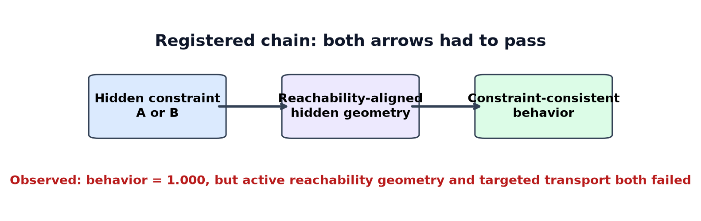
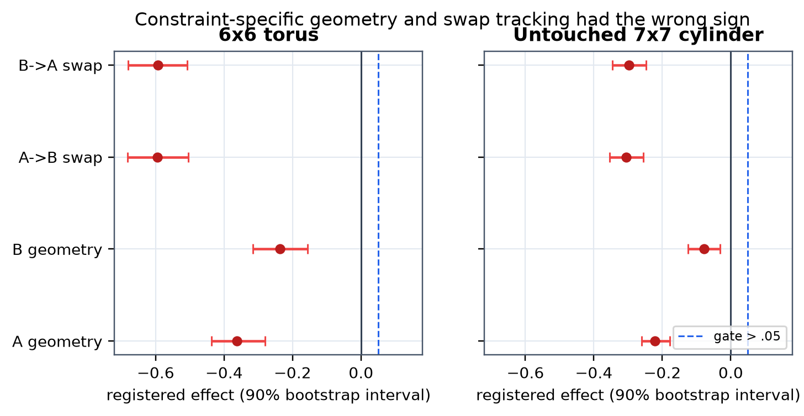
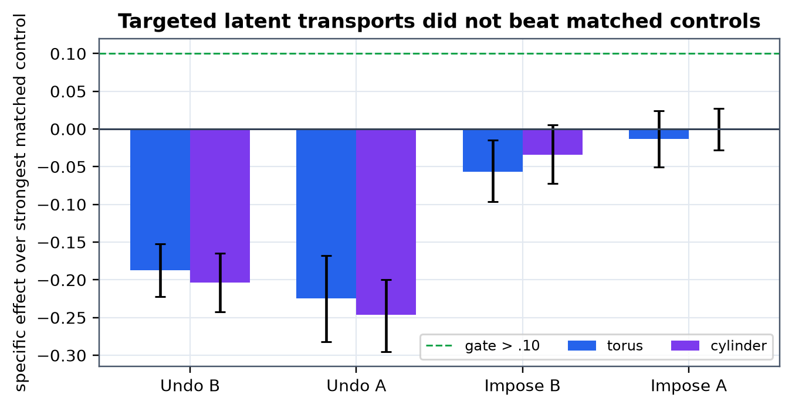
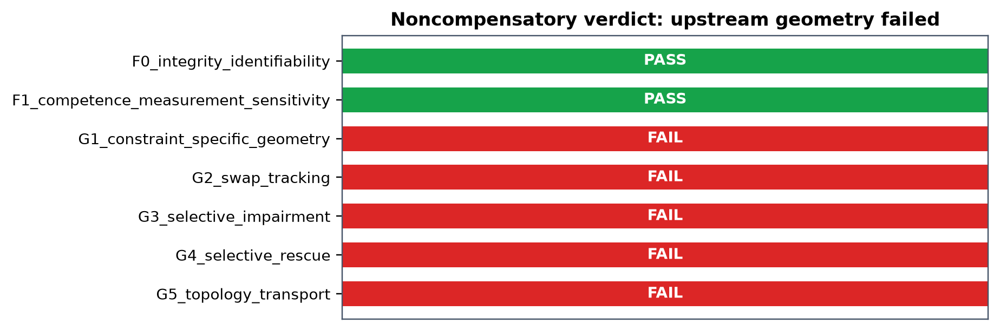

# Constraint Is Not Geometry

**Subtitle.** A preregistered counterexample to reachability-aligned causal deformation in a frozen meta-recurrent agent

**Author.** Jawaun Brown

**Date.** 27 July 2026

**Status.** Agent-generated experiment and manuscript draft under human review

## Abstract

Does changing the rule that determines successful futures necessarily deform an
agent's internal similarity geometry toward those futures, and does that
deformation cause the changed behavior? We tested this claim in a finite world
where every future-language element was exactly enumerable. Thirty-two paired
meta-GRUs inferred one of two hidden, balanced future-admissibility constraints
from matched demonstrations. Observations, transition dynamics, feedback
channel, timing, magnitude, marginal label entropy, architecture, initialization
scheme, and training budget were controlled. Both tasks and a learnable control
were solved perfectly (mean accuracy 1.000); a randomized-label sham remained at
chance (0.509); and an injected-geometry positive control was recovered
strongly (alignment lift 0.917). The registered constraint-specific geometry
gate nevertheless failed in both directions: active-minus-inactive partial
alignment was -0.363 for constraint A and -0.237 for B. Counterbalanced swaps
moved the geometry opposite the prediction, and rank-, norm-, and
covariance-matched latent transports failed selective impairment and rescue
gates. The result replicated on an untouched cylinder topology. We therefore
reject the registered claim that these constraints induce a
reachability-aligned hidden deformation and reject the downstream
geometry-to-behavior causal chain. The result does not show that constraints can
never shape representation. It shows, decisively in this regime, that perfect
constraint-dependent behavior does not require the proposed geometry and that a
constraint alone is not a sufficient causal primitive.

## 1. Question and contribution

Task context, reward contingency, transition structure, and reachable futures
can all correlate with learned representations. The stronger proposal tested
here was causal:

> constraint -> reachability-aligned geometry -> behavior.

A plot or probe cannot establish this chain. The geometry must follow an
independently specified future object after a constraint swap, and a
state-independent intervention must selectively reverse or impose both geometry
and behavior while leaving nuisance competence intact.

The contribution is a controlled counterexample. The agents inferred and used
the active constraint perfectly, but the registered future-language geometry
did not become the active hidden geometry. The measurement could recover known
injected geometry, so the negative was not an insensitive metric null. The
targeted transports also failed against severe matched controls. These facts
jointly reject the proposed mechanism for the registered model and tasks.



## 2. Relation to prior work

Representational similarity analysis formalized comparisons between model and
neural dissimilarity matrices [1]. The successor representation established
that state similarity can be organized by policy-conditioned future occupancy
[2], while reachability-aware representation learning showed that ordinary
latent Euclidean distance need not match true control reachability [3].

Context-sensitive RNNs and multitask networks can form task-dependent,
orthogonal, or reusable dynamical structures [4-6]. In a hippocampal network
model, task-specific latent structure and policy co-evolved; perturbations
linked representational biases to behavior [7]. Interchange interventions
provide a formal route from neural variables to high-level causal variables
[8], and recent manifold steering work directly tests whether
representation-respecting edits steer behavior [9].

Those results make constraint-induced geometry plausible, not necessary.
Successor features are policy-conditioned; task manifolds may reflect context,
readout, value, confidence, or training history; and a fitted latent transform
can carry these variables while creating off-manifold states. Empirical-design
work further warns that trajectories are not independent replicates and that
seed-level uncertainty is essential [10]. Our design therefore used
policy-free future languages, paired seed inference, counterbalanced no-swap
controls, an injected measurement positive control, and matched latent nulls.

## 3. Exact experimental world

### 3.1 Decision units and hidden constraints

The physical state space was a 6 by 6 torus. A decision unit contained current
cell x and goal g. The behavior alphabet was accept/reject. The hidden
constraint was inferred from demonstrations:

```text
C_A(x,g) = 1[(x_1 + x_2) mod 2 = (g_1 + g_2) mod 2]

C_B(x,g) = 1[x_1 mod 2 = g_1 mod 2]

C_D(x,g) = 1[x_2 mod 2 = g_2 mod 2]
```

C_A and C_B were the confirmatory constraints. C_D was an equally balanced,
learnable deterministic control. Each rule contained exactly 648 accept and
648 reject units. The same observation alphabet exposed all candidate parity
relations but never identified which rule was active. Each demonstration used
the same feedback channel, timing, and scalar magnitude. The experiment does
not claim "the same information": different rules necessarily carry different
conditional information.

### 3.2 Policy-free future language

The independent geometric target was not the model's policy. For physical
suffixes alpha of length H=4 from {north, south, east, west, stay}, define

```text
phi_C,g(u)[alpha] =
    |A_0|^(-H/2)
    * 1[C_C(u)=1 and f_g^alpha(x)=goal].

d_reach,C,g(u,v)^2 = ||phi_C,g(u) - phi_C,g(v)||_2^2.

V_C,g(u) = sum_alpha phi_C,g(u)[alpha]^2.
```

The volume V was residualized separately. Thus alignment could not pass merely
because two units had similar counts of successful suffixes.

### 3.3 Recurrent representation

A recurrent state is history-dependent. We therefore measured

```text
eta_t = (o_0:t, a*_0:t-1, r_0:t-1)

h_theta(u,eta_t) = GRU_theta(eta_t, o(u)).
```

The one-layer 48-unit GRU was trained on identical observation schedules for
A, B, and D. Query activations were taken after 12 demonstrations, at the GRU
output immediately before a fixed linear action head. Eight matched histories
were collected for each of 96 balanced decision units.

## 4. Geometry and causal estimands

### 4.1 Cross-validated hidden distance

Repeated histories were split. With split means mu and a shrinkage residual
covariance Sigma, the registered hidden dissimilarity was

```text
d_H(i,j) =
    (mu_i^(1) - mu_j^(1))^T
    Sigma^(-1)
    (mu_i^(2) - mu_j^(2)).
```

This crossnobis estimator may be negative in finite samples; no metric
nonnegativity claim is made for the estimator.

For vectorized upper-triangle RDMs y and x_C, nuisance matrix Z included sensory
distance, unconstrained physical distance, both reachability-volume
differences, and all three oracle-action equality RDMs. Matched history identity
and probe frequency were exact zero-variance integrity controls. With
M_Z = I - Z Z^+:

```text
A_C = corr(M_Z y, M_Z x_C)

g = A_B - A_A.
```

The swap estimand used a counterfactual no-swap difference:

```text
tau_A->B =
    [g_post - g_pre]_(A->B)
    - [g_post - g_pre]_(A->A).
```

B-to-A was symmetric and had to pass independently.

### 4.2 Low-rank interventions

Decision units were hash-split into 60% transport anchors and 40% untouched
tests. Only torus anchors fitted a state-independent affine delta map:

```text
T_S->T(h) = h + b + h U V^T

rank(U V^T) <= 4.
```

The map was applied once at the query commitment surface before the unchanged
action head. Primary intervention effects were:

```text
N_B = E[Acc_B(identity)] - E[Acc_B(T_B->A)]

S_B =
    E[Acc_B(T_early->B)]
    - E[Acc_B(T_matched_random)].
```

Targeted effects had to exceed the strongest anchor-permuted or
rank-, norm-, and covariance-matched random control, move the registered
geometry in the intended direction, preserve linear state/goal decoding within
0.03, keep activation norm and covariance drift below 10%, and show a monotone
dose response. "Necessity" and "sufficiency" are restricted to this subspace,
surface, and frozen network.

## 5. Preregistered design and gates

Seeds 0-31 were confirmatory. Seeds 1000-1003 were permanently reserved for
implementation smoke tests. Hyperparameters, layer, metric, transport rank,
probe split, topologies, bootstrap, and thresholds were frozen before
confirmatory execution. Seed was the inferential unit. Ten thousand paired
bootstrap resamples produced the intervals.

The initial vertical-versus-horizontal fiber design was rejected before model
training because its future RDMs were automorphic under action relabeling and
its behavior-action marginals were unmatched. That rejected alternative is
preserved in the preregistration amendment.

| Gate | Required evidence | Result |
| --- | --- | --- |
| F0 integrity | exact schedules, matched marginals, non-collinear RDMs, full-rank nuisance design, VIF < 10, disjoint transport split | PASS |
| F1 competence | A/B >= .85; 28/32 seeds > .80; D >= .75; sham <= .60; injected lift lower bound > .20 | PASS |
| G1 geometry | both lower bounds > .05; 28/32 positive; all comparators beaten | FAIL |
| G2 swap | both swap lower bounds > .05; no-swap upper 90% bound < .05 | FAIL |
| G3 impairment | both directions selectively impaired with nuisance preservation | FAIL |
| G4 rescue | both directions selectively rescued with nuisance preservation | FAIL |
| G5 topology | F1-G4 transport without refitting on untouched cylinder | FAIL |

The overall claim was an intersection-union decision. Downstream evidence could
not compensate for G1.

## 6. Results

### 6.1 The test was competent and sensitive

All 32 agents achieved 1.000 mean accuracy on A, B, and D on the torus and the
untouched cylinder. Every seed exceeded the registered competence threshold.
The randomized-label sham was 0.509 (90% bootstrap interval [0.500, 0.518]).
The injected-geometry recovery lift was 0.907 [0.864, 0.947] on the torus and
0.559 [0.535, 0.583] on the untouched 7-by-7 cylinder, using the primary
calibration precision without refitting. F0 and F1 passed.

### 6.2 Active reachability geometry was absent

The central prediction had the wrong sign. Active-minus-inactive alignment was
-0.363 [-0.436, -0.281] under A and -0.237 [-0.315, -0.157] under B. Only
5/32 A seeds and 7/32 B seeds had the predicted positive direction, far below
the registered 28/32 requirement. The cylinder replicated the negative
direction: -0.222 [-0.261, -0.178] and -0.079 [-0.125, -0.032]. Because
competence and measurement sensitivity passed, G1 is a valid rejection rather
than an inconclusive null.



### 6.3 Swaps moved opposite the prediction

The no-swap-adjusted A-to-B effect was -0.594 [-0.682, -0.504]; B-to-A was
-0.593 [-0.680, -0.508]. Transfer effects were also negative. The no-swap
drift upper 90% bound was 0.067, above the 0.05 tolerance. Thus geometry did
not track the active constraint on the registered clock.

### 6.4 Targeted transports did not beat matched controls

Selective impairment effects were -0.187 for undo-B and -0.225 for undo-A.
Selective rescue effects were -0.057 and -0.014. A negative specificity value
means a matched control changed active behavior at least as strongly as the
targeted transport. The transports also violated nuisance-preservation bounds;
they were not valid selective mediator interventions. G3 and G4 failed
independently of the upstream G1 failure.





## 7. What the result disproves

The registered proposition was:

> switching the active successful-future constraint makes hidden geometry more
> similar to that constraint's policy-free future language, and a targeted
> low-rank transport of the deformation selectively changes behavior.

That proposition is false for the tested meta-GRU, constraint pair,
intervention class, seeds, and topologies. The stronger informal statement that
a task constraint is sufficient to make reachability geometry the central
causal primitive is therefore disproved by this counterexample.

Three weaker claims survive:

1. Agents can infer and use hidden future-admissibility rules from matched demonstrations.
2. Their recurrent states change with context and history.
3. A known geometric signal would have been detectable by the registered analysis.

None implies that the model organizes pairwise similarity by the complete
successful-future language.

## 8. Why behavior can succeed without the proposed geometry

The observation exposed all candidate parity relations. A recurrent context
state only needed to select which relation fed the fixed binary readout. That
computation can be implemented by gating or directional readout without making
the complete pairwise hidden RDM resemble the future-language RDM. Distance
geometry also cannot detect codes that differ only by transformations
preserving pairwise distances.

This yields the main correction:

> Constraint-dependent behavior does not entail constraint-shaped global
> distance geometry.

Future work should distinguish at least four objects: feasibility language,
policy-conditioned occupancy, decision boundary, and recurrent dynamics.
Whichever object is claimed causal must be the object directly intervened on.

## 9. Contradictions and reliability audit

The practitioner lens says perfect behavior is the operative fact; the model
found a cheaper relation-selection solution than enumerating future languages.
The academic lens says task geometry and successor-like representations are
real but conditional phenomena. The skeptic notes that any one RDM family is
incomplete; our conclusion is therefore metric-specific. The incentives lens
warns that positive manifold stories are easier to publish than severe nulls.
The historical lens places this result in the recurring correction from
decodability to causal use.

The evidence ranking is:

1. **High reliability:** exact finite enumeration, matched marginals, complete seed set, competence, sham, and injected positive control.
2. **High reliability within metric:** the sign-reversed G1 and G2 estimates.
3. **Moderate reliability:** transport failure, because the transports violated nuisance-preservation bounds as well as specificity.
4. **Not established:** absence of all task-relevant codes, other metrics, persistent recurrent interventions, other architectures, or a universal claim about meaning and goals.

## 10. Reproducibility and provenance

The public package contains the frozen preregistration and manifest, exact
world enumerator, training code, seed-level public rows, gate logic, figure
builder, manuscript, and deterministic PDF builder. Raw checkpoints and the
complete run payload remain in gitignored `artifacts/`.

Registered execution:

```text
uv run --no-sync python -m \
  experiments.constraint_swap_causal_geometry.run_experiment \
  --seeds 32 --workers 4
```

The seed rows are sufficient to recompute every interval and gate. The paper
reports negative and rejected artifacts rather than deleting them.

## 11. Conclusion

The experiment decisively rejects its scoped causal-deformation hypothesis.
Constraints A and B completely controlled successful behavior, but neither
became the active policy-free future-language geometry. Geometry failed before
causal intervention was considered, swaps moved opposite prediction, and
targeted transports did not beat matched nulls. The broad research program
remains open, but its principle must be weakened:

> A constraint can shape representation under some objectives and
> architectures; it does not, by itself, force a reachability-aligned geometry
> or make that geometry the causal basis of behavior.

## References

1. Kriegeskorte N, Mur M, Bandettini PA. Representational similarity analysis - connecting the branches of systems neuroscience. Frontiers in Systems Neuroscience. 2008;2:4. doi:10.3389/neuro.06.004.2008.
2. Dayan P. Improving generalization for temporal difference learning: the successor representation. Neural Computation. 1993;5(4):613-624. doi:10.1162/neco.1993.5.4.613.
3. Wang K, Zhou K, Feng J, Hooi B, Wang X. Reachability-aware Laplacian representation in reinforcement learning. ICML/PMLR 202. 2023.
4. Mante V, Sussillo D, Shenoy KV, Newsome WT. Context-dependent computation by recurrent dynamics in prefrontal cortex. Nature. 2013;503:78-84. doi:10.1038/nature12742.
5. Flesch T, Juechems K, Dumbalska T, Saxe A, Summerfield C. Orthogonal representations for robust context-dependent task performance in brains and neural networks. Neuron. 2022;110:1258-1270.e11. doi:10.1016/j.neuron.2022.01.005.
6. Driscoll LN, Shenoy K, Sussillo D. Flexible multitask computation in recurrent networks utilizes shared dynamical motifs. Nature Neuroscience. 2024;27:1349-1363. doi:10.1038/s41593-024-01668-6.
7. Cone I, Clopath C. Latent representations in hippocampal network model co-evolve with behavioral exploration of task structure. Nature Communications. 2024;15:687. doi:10.1038/s41467-024-44871-6.
8. Geiger A, Lu H, Icard T, Potts C. Causal abstractions of neural networks. NeurIPS. 2021.
9. Wurgaft D et al. Manifold steering reveals the shared geometry of neural network representation and behavior. arXiv:2605.05115. 2026. Preprint.
10. Agarwal R, Schwarzer M, Castro PS, Courville AC, Bellemare M. Deep reinforcement learning at the edge of the statistical precipice. NeurIPS. 2021.
