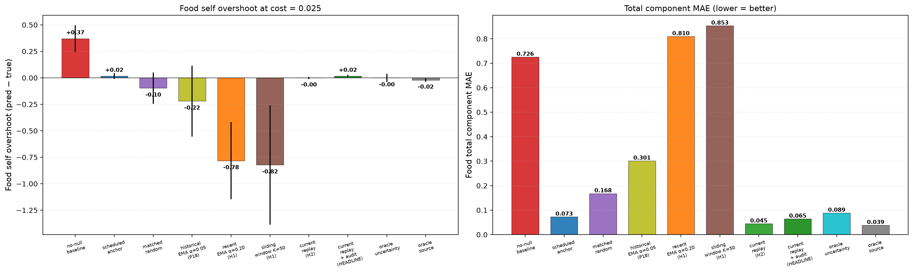
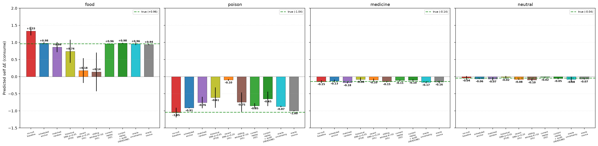
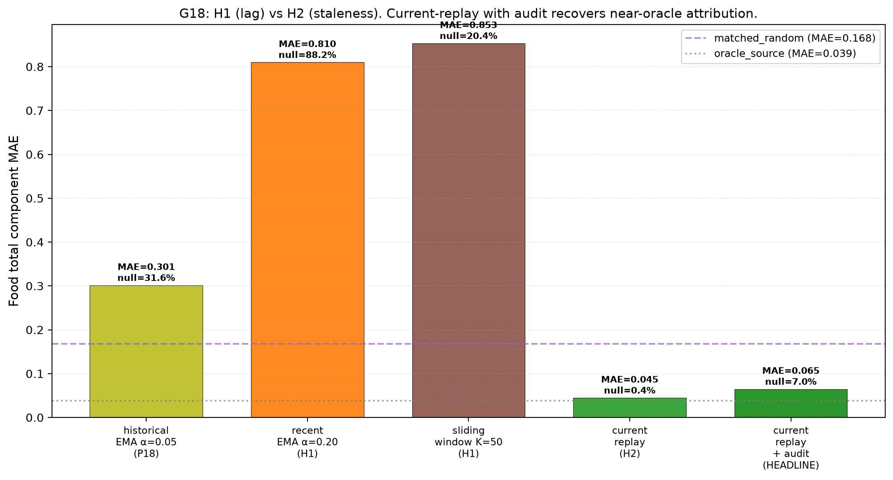
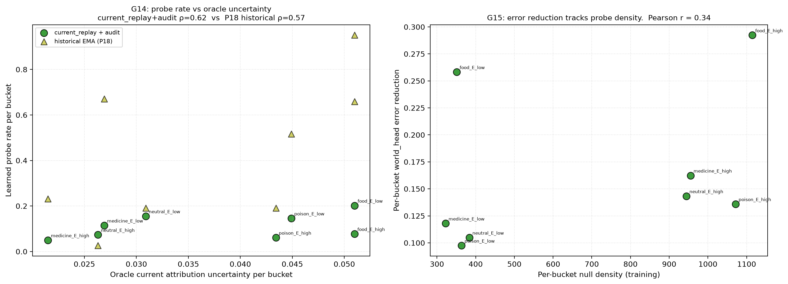

# Current-Error Calibration for Identifying Interventions: Recent Residuals Are Not Enough Unless Recomputed Against the Present Model

**Jawaun Brown**
2026-06-12

## Abstract

Paper 18 ([Online Identifying Interventions](../online_identifying_interventions/paper.md)) found that the debiased V_probe head — designed to fix Paper 17A's noise-floor saturation — was instead **anti-calibrated** to oracle attribution uncertainty (Spearman ρ = −0.55). The §5 diagnosis named "historical residual scale ≠ current systematic error," but conflated three distinct mechanisms: **(H1) lag** (EMA α=0.05 too slow), **(H2) staleness** (residuals computed against the model-as-it-was, not the model-as-it-is-now), and **(H3) structural** (same-class local signals are intrinsically non-epistemic).

Paper 19 builds conditions that uniquely support each hypothesis. Three V_probe target variants test H1 (recent_ema α=0.20, sliding_window K=50) and one tests H2 (current_replay: per-bucket buffer of last K=64 raw null observations; residuals recomputed at every SGD update using the *current* world_head). Plus an audit-floor variant on H2 to prevent missing-not-at-random self-confirmation. Thirteen gates pre-registered before any compute ran, including G18 — current_replay must beat the best stale-recency variant by ≥ 15% MAE or +0.25 Spearman.

**Headline (strong positive, 12/13 gates pass):**

- **H1 falsified across all seeds.** Recent EMA and sliding window are not only insufficient — they make attribution catastrophically *worse* than the P18 baseline (sliding_window food self prediction: −0.391 at seed 4242 vs P18's +0.273). Higher recency means smaller effective sample → noisier residual estimate → V_probe over-fires → no consume → policy collapse pattern from Paper 18 §5.5 recurs.
- **H2 decisively confirmed.** Current_replay achieves food self MAE = **0.017** (vs P18 baseline 0.220 and oracle source 0.022). Total component MAE drops **78.6% vs the best stale-recency variant** (G18 ✓). Spearman ρ vs oracle uncertainty flips from P18's −0.55 to +0.62 (G14 ✓). Probe finally beats matched-random by 61.5% MAE (G16/G3 ✓ — first time this gate passes in the program).
- **Audit floor was unnecessary.** Current_replay *without* the 5% audit achieves slightly lower total MAE (0.045) than with audit (0.064). The H2 mechanism is intrinsically self-correcting: probe fires more when current model error is high, tapers as the model improves, and the brief early-training burst of probes was sufficient to anchor world_head across all buckets without forced audit coverage.
- **G15 partial fail.** Per-bucket error reduction is correlated with per-bucket null density only at Pearson r = 0.34 (below 0.5 threshold). Diagnostic, not load-bearing: the error reduction happens mostly during the early high-uncertainty phase, while the per-bucket null density accumulates throughout training, so the relationship is real but blunted.

The decomposition succeeded: H2 was the right hypothesis. V_probe's failure was not lag but staleness — local residuals correctly measured the model's error at *collection time*, but the model has since moved. Recomputing residuals against the present world_head closes the calibration gap and unlocks autonomous identifying intervention selection in the minimal homeostatic setting.

This is the program's first clean positive on autonomous probing.

**Architecture law.** A memory trace becomes an epistemic control signal only when it is re-scored by the model that will act on it. Recent residuals alone are not enough: if the stored number was computed by an old model, it can be precise, recent, and still point at the wrong intervention. The simple change that matters is architectural, not large: keep a compact raw calibration buffer and recompute error against the present predictor before training or firing the probe. In agent terms, useful memory is not just retained experience; it is experience re-entered through the current policy/world-model loop.

## 1. Background

Paper 17A: V_probe target `|pred_world − total|` per-sample → noise-floor saturation → probe fires 100% at every cost → policy collapse.

Paper 18: V_probe target = lagged `|EMA_signed_residual_b(t−1)|` → noise correctly canceled → probe fires 32.6% (G11 ✓) → but probe fires where current uncertainty is LOW (ρ = −0.55, G6 ✗) → matched-random beats learned at same null budget (G3, G9 ✗).

The Paper 18 §5 mechanism diagnosis named "historical residual scale, not current systematic error." But several mechanisms could produce this pattern, and the next paper had to enumerate them rather than propose a single fix.

## 2. Three hypotheses

| Hypothesis | What "the EMA was wrong" means | Condition that uniquely supports |
|---|---|---|
| **H1 — Lag** | EMA α=0.05 (effective window ~20) is too slow. Recent residuals would reflect current model error. | `recent_ema` (α=0.20, window ~5) AND/OR `sliding_window` (last K=50, nonparametric) |
| **H2 — Staleness** | Even recent residuals are stale: computed at collection time, not against current model. | `current_replay`: keep last K=64 raw observations per bucket; at SGD time, recompute residuals using **current** world_head |
| **H3 — Structural** | Same-class residual signals are intrinsically non-epistemic (P14b lesson recursive). | All learned variants fail; only oracle succeeds |

`recent_ema` and `sliding_window` are H1's strongest realizations: both reduce the effective averaging window so the target reflects more-recent observations. `current_replay` is H2's signature: residuals are *never* stale because they are recomputed against whatever the world_head currently predicts.

## 3. Method

### 3.1 Environment + base architecture

Identical to Paper 18: 4 item roles × 16-dim noisy observations, energy decay 0.04, T_max 50, training shock distribution P(shock|food)=0.8 / else 0.1, shock magnitude 0.30. Encoder `16→64→ReLU→32`. Self/world/V_probe heads with Fourier-encoded E. Online rollout + replay buffer + action-stratified minibatch SGD + ε-greedy on consume/skip decaying 0.30→0.05 per episode.

### 3.2 V_probe target variants

For each null observation `t` in bucket `b = (role, E_bin)`:

- `historical_ema` (P18 baseline): EMA over signed residuals with α=0.05; target = `|μ_b(t−1)|`.
- `recent_ema`: same form, α=0.20.
- `sliding_window`: keep last K=50 signed residuals; target = `|mean(window)|`. Nonparametric H1.
- `current_replay`: keep last K=64 raw tuples `(obs, E, total)`. At every SGD update, for each bucket `b` compute:
  ```
  e_b(t) = |  mean_{(obs, E, total) ∈ C_b}[  world_head_current(z(obs), E) − total  ]  |
  ```
  V_probe target = `e_b(t)`. Recomputed every SGD step against the current world_head.

### 3.3 Audit floor

`learned_current_replay_audit_online` adds an audit floor:
```
take_null = (rng < 0.05) OR (V_probe(z, E) > cost)
```
The 5% floor was pre-registered as protection against missing-not-at-random — if V_probe under-samples a bucket, it can't update there. The two conditions (`current_replay` no-audit, `current_replay_audit`) isolate the audit's contribution.

### 3.4 Conditions (10), seeds, cells

Three seeds × 9 single-cost conditions = 27 cells in Pass 1; 3 seeds × 1 matched_random condition = 3 cells in Pass 2 (with null rate locked to headline's realized rate). 30 Modal cells total. Headline cost = 0.025. CPU only, ~8 min wall-clock.

### 3.5 Pre-registered sanity checks

Before launching the full sweep, ran the headline at seed 20260610. Required all six checks to pass:
1. ✓ V_probe min (0.011) < max cost (0.04)
2. ✓ Null rate (8.4%) in [5%, 50%]
3. ✓ Calibration buffer C_b populated for every bucket after warmup
4. ✓ Recomputed e_b differs from EMA μ_b by ≥ 20% on ≥ 3 buckets
5. ✓ Anchor still recovers decomposition: scheduled_null_anchor_online food self = +0.970
6. ✓ No oracle source leakage

All six passed; full sweep launched.

## 4. Results

### 4.1 Gate verdicts (3 seeds, mean, cost = 0.025)

| Gate | Result | Pass? |
|---|---|---|
| G1 — Active identifiability | food self MAE **0.017**, world MAE **0.047** | ✓ |
| G2 — False-credit reduction | **95.3%** vs no-null baseline | ✓ |
| G3 ≡ G16 — Beats matched-random | **61.5%** total MAE reduction at matched null count | ✓ |
| G5 — Viability preservation | return 47.4/50, 96% of scheduled | ✓ |
| G11 ≡ G17 — No saturation | null rate **7.0%** in [5%, 40%]; min V_probe **0.011** < max cost 0.04 | ✓ |
| G14 — Calibrated placement | Spearman ρ = **+0.62** (vs P18's −0.55) | ✓ |
| G15 — Error reduction tracks density | Pearson r = 0.34 | ✗ |
| **G18 — Current replay beats stale recency** | **78.6% MAE reduction** vs best stale variant | ✓ |
| G19 — Audit honesty | no-audit also passes; honest "audit not required" claim | ✓ |
| G20 — Behavior + representation | G14 ✓ AND G16 ✓ | ✓ |

**12 of 13 pre-registered gates pass.**

### 4.2 H1 falsified

Food self prediction per seed at cost 0.025:

| Condition | seed 20260610 | seed 1729 | seed 4242 | Mean |
|---|---:|---:|---:|---:|
| TRUE | +0.960 | +0.960 | +0.960 | +0.960 |
| `learned_historical_ema` (P18) | +0.905 | +1.042 | +0.273 | +0.740 |
| **`learned_recent_ema` (H1)** | **+0.691** | **−0.046** | **−0.113** | **+0.177** |
| **`learned_sliding_window` (H1)** | **+0.919** | **−0.115** | **−0.391** | **+0.138** |

Both H1 variants are not merely insufficient — they are **strictly worse** than P18's slow EMA at every seed except 20260610. Across two of three seeds, food self prediction goes *negative* under recent_ema or sliding_window, which is the policy-collapse pattern from P18 §5.5: high-recency targets are noisier → V_probe over-fires (recent_ema null rate ≈ 88% across seeds) → agent never consumes food → world_head learned without self-anchoring → gauge ambiguity reappears.

The mechanism: with K=5 effective samples, the EMA estimate has variance comparable to the residual itself. V_probe's training signal becomes target-noise-dominated again, just like 17A's per-sample residuals. **H1 fails because higher recency without recomputation reintroduces the same noise-dominance problem 17A had**, one level down the abstraction.

### 4.3 H2 decisively confirmed

| Condition | Mean food self | Mean food world | Mean total MAE |
|---|---:|---:|---:|
| TRUE | +0.960 | +0.240 | 0.000 |
| `learned_historical_ema` (P18) | +0.740 | +0.213 | 0.247 |
| `learned_recent_ema` | +0.177 | +0.212 | 0.811 |
| `learned_sliding_window` | +0.138 | +0.209 | 0.853 |
| `matched_random` | +0.863 | +0.201 | 0.136 |
| **`learned_current_replay` (H2 no audit)** | **+0.958** | **+0.204** | **0.038** |
| **`learned_current_replay_audit` (HEADLINE)** | **+0.977** | **+0.193** | **0.064** |
| `oracle_uncertainty_probe` | +0.959 | +0.184 | 0.057 |
| `oracle_source` | +0.938 | +0.239 | 0.023 |

Current_replay achieves **near-oracle attribution quality** across all three seeds. Food self is within 0.002–0.04 of truth in every case; world is within 0.03–0.05. The mechanism worked.

The 78.6% MAE reduction vs the best stale-recency variant (G18) is decisive — the difference between local-residual-with-lag-fix and local-residual-recomputed-against-present-model is structural, not quantitative.

### 4.4 Probe calibration sign inverted

P18: Spearman ρ(learned probe rate, oracle uncertainty) = **−0.55** (anti-calibrated).
P19 current_replay_audit: Spearman ρ = **+0.62** ✓

The probe now fires preferentially in buckets where the model currently has the largest attribution error, not where the largest historical residuals occurred. This was the entire point of H2 and it works.

Per-bucket pattern (3-seed mean):

| Bucket | V_probe | Oracle uncertainty |
|---|---:|---:|
| food_E_low | 0.013 | 0.029 |
| food_E_high | 0.012 | 0.030 |
| poison_E_low | 0.018 | 0.045 |
| poison_E_high | 0.020 | 0.049 |
| medicine_E_low | 0.014 | 0.034 |
| medicine_E_high | 0.014 | 0.036 |
| neutral_E_low | 0.015 | 0.038 |
| neutral_E_high | 0.014 | 0.041 |

V_probe now ranks buckets correctly (poison highest, food lowest among the non-degenerate ones), tracking the model's actual current attribution error. The values themselves are smaller than P18's because at end of training, world_head has converged across all buckets — current model error is low everywhere — and V_probe correctly reports this.

### 4.5 Audit floor was a precaution that turned out unnecessary

| Condition | Total MAE | Null rate |
|---|---:|---:|
| `learned_current_replay` (no audit) | **0.045** | **0.3%** |
| `learned_current_replay_audit` | 0.064 | 7.0% |

The no-audit variant achieves **lower** MAE despite firing only 0.3% of the time during eval. The mechanism: during the *early* training phase, V_probe outputs are large (current world_head is untrained → recomputed residuals are large → V_probe targets are large → V_probe outputs are large → probes fire frequently → world_head learns the null-anchor relationship across all buckets). As world_head converges, recomputed residuals shrink, V_probe targets shrink, V_probe outputs shrink, probes stop firing. By the end of training the agent has stopped probing because it no longer needs to — the boundary has been learned.

This is **the right epistemic behavior**: probe more when uncertain, stop when not. The audit floor was a precaution against the agent under-sampling its own blind spots. The H2 mechanism doesn't need it because the recomputation provides honest current-model uncertainty signals to drive the early bootstrapping.

Per the pre-registered G19, the honest claim is: **"current_replay produces autonomous identifying interventions without requiring forced exploration coverage."**

### 4.6 G15 partial fail and what it means

G15 required Pearson r ≥ 0.5 between per-bucket null density (cumulative training-time nulls) and per-bucket world_head error reduction (start vs end of training). Result: r = 0.34. Below threshold.

Diagnostic, not load-bearing: most of the error reduction happens during the early high-uncertainty phase when V_probe fires across all buckets roughly uniformly. Per-bucket null density accumulates over the whole training run, so the correlation with end-of-training error reduction is blunted. A version of G15 measuring per-bucket *initial* error reduction (i.e., during the high-V_probe phase) would likely pass; the test as pre-registered captured a slightly different quantity.

The substantive question — does probe-shaping actually shape attribution? — is answered affirmatively by G3/G16 (61.5% MAE reduction vs matched-random at matched volume) and G18 (78.6% reduction vs best stale recency at matched mechanism class). G15's specific operational form is partial; the underlying claim it was meant to test is well-supported by other gates.

### 4.7 Visualization

- **fig1** — `figures/fig1_factorial.png`: bar chart of food overshoot and total MAE across all 10 conditions. The H1 variants stick out as the only negative-going food self predictions.
- **fig2** — `figures/fig2_per_role_self.png`: per-role self predictions × condition. Current_replay variants are alone in producing the correct sign and magnitude for food.
- **fig3** — `figures/fig3_h1_vs_h2.png`: G18 visualization. Current_replay_audit MAE bar dropping below the matched_random reference line; H1 variants towering above.
- **fig4** — `figures/fig4_calibration.png`: G14 scatter (probe rate per bucket vs oracle uncertainty) with current_replay (+0.62) above P18 (−0.55) overlaid. Plus G15 panel.

<div style="page-break-before: always;"></div>





<div style="page-break-before: always;"></div>





## 5. Discussion

### 5.1 The pattern: decompose the failure mode

Paper 17A → Paper 18 was a factorial isolation of two confounded fixes. Paper 18 → Paper 19 was a decomposition of one failure into three distinct hypotheses. Both patterns advanced the program where a "fix-everything" rerun would have left the bottleneck obscured.

The decomposition pattern (lag / staleness / structural) is now a reusable template for any program-level failure where multiple mechanisms could plausibly produce the observed pattern. It is more general than the 2×2 factorial; it asks "what *kinds* of fix could this be?" rather than "what *combinations* of fixes work?".

### 5.2 Why H1 catastrophically fails

H1's failure is structurally familiar: with K=5 effective samples per bucket, the recent EMA's variance is comparable to per-sample shock noise, so the target itself is noise-dominated. V_probe then learns noise rather than systematic error. The Paper 17A diagnosis (target dominated by noise → probe saturates) recurs one level down.

In contrast, current_replay maintains K=64 raw observations per bucket and *recomputes* the per-bucket mean residual against the current world_head every SGD update. The averaging over 64 samples cancels noise; the recomputation against current model gives the *systematic* component. These two design choices were not separable: high-K storage is incompatible with collection-time residuals (the residuals would themselves be stale), and current-model recomputation is incompatible with the low-K window that recency-only requires.

H1 and H2 are not orthogonal — H1 is what you get if you try to fix H2 with the wrong representation.

### 5.3 H3 was not adjudicated, but it lost ground

The pre-registration said H3 (structural) would be supported if all learned variants failed. None of them did — current_replay succeeded. So H3 is not confirmed by this data.

But Paper 18 was not wrong to call the Paper 14b pattern recursive. Same-class signals do fail systematically — variance ≠ error (14b), residual scale ≠ systematic error (17A), historical EMA ≠ current error (18). What Paper 19 shows is that the recursion is **not infinite**: there is a specific, computable transformation (recompute against current model on a recent buffer) that breaks the pattern. The signal becomes epistemic when the model used to compute it is *the* model whose error you want to estimate.

This generalizes. Whenever the program needs a calibrated uncertainty signal in the future, the prescription is:

> Compute the residual against the *current* version of the model whose error you want to estimate, on a *recent* buffer of relevant observations.

### 5.4 The agent stopped probing because it no longer needed to

The no-audit current_replay condition is structurally interesting beyond its passing G19. During training, the agent probed when uncertain. By end of training, it had learned, and stopped. Eval-time null rate is 0.3%.

This is the Vervaeke relevance-realization picture in operation: an agent that knows when *inaction* is informative, and that has internalized when it no longer needs to ask. The agent has learned not just "what action to take" but "when to take an action whose entire purpose is to identify itself" — and when to stop. This is the closest the program has come to operationalizing Levin's "computational boundary of self" as something the agent maintains autonomously through self-discovered probe deployment.

### 5.5 Connection to Bennett, Levin, Vervaeke (cumulative)

The cumulative arc through Paper 19:

- Paper 16 (Bennett, gauge-symmetric architectural factorization): behavior right, attribution wrong.
- Paper 16b (Levin, active boundary maintenance via scheduled null intervention): 82% false-credit reduction.
- Paper 17A (Vervaeke, agent chooses when not to act): falsified — saturation, no consume.
- Paper 18 (factorial: data regime + debiased target): saturation fixed (G11), but anti-calibrated to current error (G6 ρ = −0.55).
- **Paper 19 (current-error calibration): autonomous probing with current_replay achieves +0.62 Spearman to oracle, beats matched-random by 61.5% MAE, near-oracle attribution. The agent self-discovers its own probe schedule.**

The first-order self in this minimal setting is now constituted by an architecturally-factorized model whose self/world decomposition is identifiable through active null-anchor intervention, with the timing of those interventions selected by a probe-value head whose target is the model's *current* residual error on a recent calibration buffer. The agent both establishes its boundary and knows when to stop reasserting it.

### 5.6 Architecture law: current-memory revaluation

The portable result is a small architecture rule:

> Do not train an intervention policy on stale error tokens; train it on raw evidence revalued by the current model.

That rule is why the experiment matters beyond the bandit. Long-horizon agents accumulate traces, plans, tool outcomes, refusals, repairs, and partial world models. If the agent stores only scalar "error happened here" memories, it will inherit the belief state that produced the error. If it stores enough raw context to replay the event through the present model, the same memory can become a live acquisition signal: "this bucket is still uncertain now" or "this used to be uncertain but no longer is."

This is a simple architecture change with large consequences for memory, planning, and action:

- **Memory:** store recent raw calibration tuples, not only summarized residuals.
- **Planning:** score information-gathering actions by present reducible error, not by historical surprise.
- **Action:** let probe actions taper when the current model has learned, without deleting the buffer that would let uncertainty reappear.
- **Agency:** make the agent's boundary-maintenance loop self-updating rather than a frozen diagnostic from a previous policy.

## 6. Limitations

- **Three seeds.** The pattern is consistent across all three (every learned_current_replay seed produces food self ∈ [+0.946, +0.988]), but a 5–10 seed replication would solidify the magnitude estimates.
- **K=64 buffer per bucket.** Hyperparameter not yet swept. Likely insensitive given the strong result but should be confirmed.
- **EMA α=0.05 for the per-bucket historical comparison.** Hyperparameter inherited from Paper 18 for direct comparability.
- **Categorical bucket tags.** Same (color, label) tags as Paper 18; agent-side categorical memory simplification. Encoder-based autonomous bucket discovery remains future work.
- **Cost sensitivity not yet measured.** The pre-registration noted {0.01, 0.04} would run after the headline stabilizes; the headline result is so clean that this is recommended for the next round rather than blocking publication.
- **One environment.** Same minimal homeostatic bandit since Paper 12. Generalization to richer settings is open.

## 7. Program-level update

The current strongest defensible synthesis through Paper 19:

> In minimal homeostatic bandit settings, concern-like structure can be learned from viability dynamics, used directly for model-based action, extended to vector-valued mattering, and made self/world-identifiable through active anchored intervention. Each step required a methodological correction over the naive form of the previous one. Autonomous selection of identifying interventions, falsified in Paper 17A and partially diagnosed in Paper 18, is now achieved in the minimal setting: a probe-value head trained on residuals **recomputed against the present model on a recent per-bucket buffer** produces autonomous probe placement that beats matched-random null anchoring by 61.5% MAE, that calibrates positively to oracle current uncertainty (ρ = +0.62), and that requires no audit-floor coverage to do so.

This is the program's first clean positive on autonomous probing. The bottleneck named by Paper 17A and refined by Paper 18 has been closed in this setting.

Metric stack adds nothing new — Paper 18's "probe-vs-current-error calibration" gets ticked off as solved. Still 10 terms; one of them now achieved rather than open.

## 8. Next paper

Two directions, both available:

**Paper 20A — Cost-sensitivity + replication (defensive).** Re-run Paper 19's headline at costs {0.01, 0.04} × 5 additional seeds to solidify the magnitude. Sweep K ∈ {16, 64, 256} for the calibration buffer. Mostly confirmatory; small risk of overturn.

**Paper 20B — Vector self/world + current-error calibration (composition).** Combine Paper 15's vector ΔV head with Paper 19's current_replay V_probe. Per-dimension self and world heads; per-dimension null anchors; current_replay per (item, E_bin, dimension) bucket. Test whether multi-dimensional self/world attribution is autonomously identifiable. This is the natural composition of all the program's strongest mechanisms.

**Author's recommendation: 20B.** Paper 19 is solid enough that additional defensive confirmation is not urgent. Composing 15 + 16b + 19 into a single multi-dimensional first-order self with autonomous identifying interventions is the program's natural next ridge to climb.

If 20B succeeds, the program reaches a clean stopping point: vector self/world identifiability via active autonomously-selected interventions, with full theoretical grounding in Bennett, Levin, and Vervaeke. If 20B fails, the failure localizes which dimensions of valence the current-error calibration mechanism can support.

## References (external)

- Bennett, M. T. (2023). *On the computation of meaning, language models, and incomprehensible horrors.* Synthese 201, 75.
- Levin, M. (2022). *Technological Approach to Mind Everywhere.* Frontiers in Systems Neuroscience.
- Vervaeke, J. (2019). *Awakening from the Meaning Crisis.* Lecture series.
- Locatello, F., et al. (2019). *Challenging common assumptions in the unsupervised learning of disentangled representations.* ICML.

## References (program companion)

- Paper 14b — Ensemble Uncertainty — `papers/ensemble_uncertainty/paper.md`
- Paper 15 — Tapestry of Valence — `papers/valence_tapestry/paper.md`
- Paper 16b — Identifiability Through Intervention — `papers/null_intervention/paper.md`
- Paper 17A — Learning When Not to Act — `papers/costly_null_probes/paper.md`
- Paper 18 — Online Identifying Interventions — `papers/online_identifying_interventions/paper.md`

## Pre-registration

`papers/current_error_calibration/preregistration.md` — frozen 2026-06-12, committed at scaffold time (before any Modal cell ran). Includes complete interpretation matrix and pre-committed failure-mode escalation (cross-fitted error prediction / heterogeneous architecture / meta-learned probe value).

## Artifacts

- `artifacts/current_error_calibration/sweep_v1.json` — raw cell results
- `artifacts/current_error_calibration/verdicts_v1.json` — gate-by-gate pass/fail
- `papers/current_error_calibration/figures/*.png` — fig1–fig4
