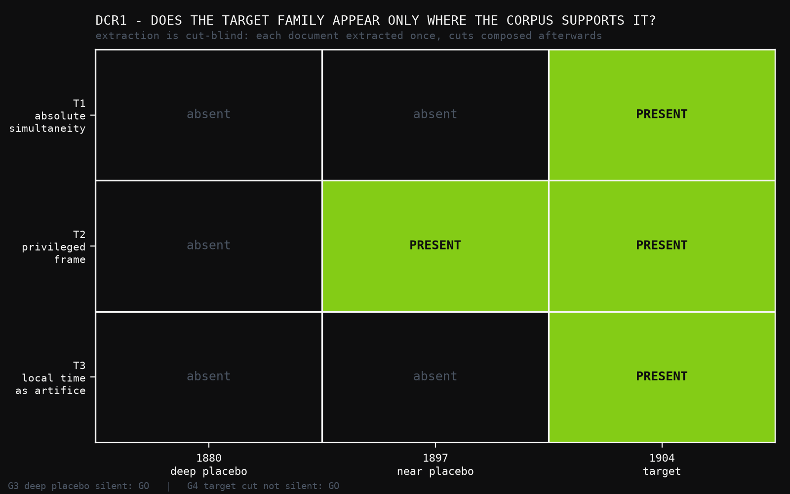
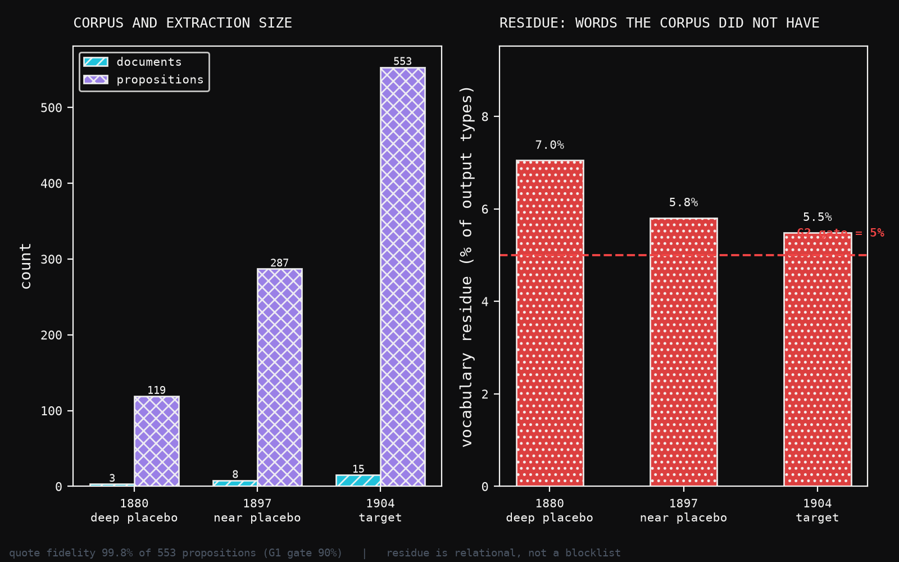

# DCR1: A Real Pre-1905 Corpus, and Four Ways the Instrument Nearly Lied

**Human director:** Jawaun Brown
**Producing agent:** Claude Code, directed
**Program:** Date-Cut Retrodiction — DCR1
**Status:** G1 GO, G2 **NO_GO**, G3 GO, G4 GO — overall **NO_GO**. DCR2 not licensed.
**Date:** 2026-07-26

---

## Abstract

DR4's clean sweep opened the date-cut retrodiction: run the deletion-repair
nominators over a real pre-1905 corpus and ask whether they nominate the
deletion history actually made. Before ranking anything, one question has to be
settled — does a language-model extractor surface the target commitments because
the corpus contains them, or because the model has read the twentieth century?
That is Spencer's candidate-selection circularity, and it killed COGR Wave 1a.

DCR1 builds the corpus (15 public-domain documents, Maxwell 1865 to Lorentz
1904, 495,516 characters), extracts commitments with a cut-blind prompt, and
tests the extraction against three date cuts: 1880 and 1897 as placebos, 1904 as
target.

**The headline is the placebo.** The 1880 cut — Maxwell only, before any
ether-drift null result — matched **zero** propositions to **any** target facet.
Not one. At 1897 the privileged-frame facet appears; at 1904 the local-time
facet joins it. The emergence is monotone and it tracks the corpus, not the
model.

**But DCR1 fails.** Vocabulary residue runs 5.5–7.1%, over the 5% gate at every
cut, so the overall verdict is NO_GO and **DCR2 is not licensed.** The residue
is mostly inflectional morphology — stemming halves it to 3.1–4.9% — but that is
a diagnosis, not a repair, and repairing a gate in place is the DR3 mistake.

Three further defects surfaced, each of which would have produced a
publishable-looking result if it had gone unnoticed:

1. **The corpus arrived contaminated.** Wikisource's header template links every
   one of these papers to `Portal:Relativity`. Eleven of fifteen documents
   carried post-cut vocabulary in their first line.
2. **The extractor was not blind.** One agent — handling the single most
   consequential document — self-checked against this repository's own code,
   whose docstrings name Einstein and 1905. Every document was re-extracted
   under a sandboxed prompt. The breach changed nothing measurable.
3. **My own frozen matcher has false positives.** All three `T1 absolute
   simultaneity` hits at 1904 are spurious: the regex catches the ordinary
   English phrase "the same time". The defensible claim at 1904 is two facets,
   not three — still meeting quorum, but by a single proposition.

Freezing a matcher before looking makes it honest. It does not make it correct.

---

## 1. What DCR1 is for

The retrodiction is the first test of this framework on material nobody authored
for it. Everything through DR4 used toys where I wrote the propositions, so the
answer existed and was findable by construction. A real corpus removes that
guarantee — and introduces a new failure mode that toys cannot have.

An LLM extractor reading Lorentz 1904 knows what happened in June 1905. Asked
for "the important commitments," it will surface the ones history made
important. The candidate set would then contain the answer because the model put
it there, and any ranking over that set would be measuring the model.

So DCR1 asks one question before any ranking happens, and answers it with
placebo cuts.

## 2. The corpus

Fifteen public-domain documents, all pre-1905, fetched from Wikisource and
checksummed:

| year | document | chars |
|---:|---|---:|
| 1865 | Maxwell, *A Dynamical Theory of the Electromagnetic Field*, Parts I and VI | 52,122 |
| 1878 | Maxwell, "Ether", *Encyclopædia Britannica* 9th ed. | 30,199 |
| 1881 | Michelson, *The Relative Motion of the Earth and the Luminiferous Ether* | 20,039 |
| 1887 | Michelson & Morley, *On the Relative Motion…* | 23,139 |
| 1889 | FitzGerald, *The Ether and the Earth's Atmosphere* | 1,378 |
| 1897 | Larmor, *Dynamical Theory of the Electric and Luminiferous Medium III* | 95,586 |
| 1897 | Lodge, *Experiments on the Absence of Mechanical Connexion…* | 43,723 |
| 1898 | Poincaré, "The Measure of Time" | 26,992 |
| 1900 | Larmor, *Aether and Matter*, ch. 10 and 11 | 79,675 |
| 1902 | Rayleigh, *Does Motion through the Aether cause Double Refraction?* | 12,928 |
| 1904 | Brace, *On Double Refraction in Matter moving through the Aether* | 29,568 |
| 1904 | Poincaré, "The Principles of Mathematical Physics" (St Louis, September) | 11,687 |
| 1904 | Lorentz, *Electromagnetic phenomena in a system moving with any velocity smaller than that of light* | 68,480 |

Three cuts, nested: **1880** (3 docs, 82k chars), **1897** (8 docs, 266k),
**1904** (15 docs, 496k).

## 3. Four ways the instrument nearly lied

### 3.1 The corpus arrived pre-contaminated

Wikisource wraps every one of these papers in a navigation header that links to
`Portal:Relativity`. Before cleaning, eleven of fifteen documents contained
post-cut vocabulary — in the first line, where any extractor would read it
first. Had extraction run on that, the leak would have been total and invisible.

The fix is structural, not lexical: take the Proofread-Page body container and
drop navigation chrome by class. That distinction matters, because —

### 3.2 A keyword blocklist would have been wrong in both directions

Larmor 1897 contains "any **special theory** of the constitution of matter."
Innocent period English. A blocklist scrubs a genuine source sentence.

Poincaré's St Louis lecture, September 1904, contains:

> The principle of **relativity**, according to which the laws of physical
> phenomena must be the same for a stationary observer as for an observer
> carried along in a uniform motion of translation; so that we have not and can
> not have any means of discerning whether or not we are carried along in such a
> motion.

He coined the phrase there, a year before Einstein. It is genuinely pre-cut. A
blocklist deletes the parent task from the corpus that supplies it.

So residue is defined **relationally**: a term is residue iff the extractor
emits it and the corpus at that cut does not contain it. No judgment about which
words feel anachronistic; and an extractor that only recombines corpus
vocabulary cannot be leaking lexically.

This also improves the design. ω, the parent task, can be quoted from the corpus
rather than authored by me — one less layer of my own hindsight. And it sharpens
what the retrodiction targets: Poincaré states the principle **and keeps the
ether**. The corpus contains the goal and does not make the deletion.

### 3.3 Every sentinel term rode on two translated documents

At the 1904 cut, `relativity`, `postulate`, `simultaneity` and `simultaneous`
appear in **exactly two** documents — both Poincaré, both reached through
Halsted's **1913** English compilation. Drop them and the target vocabulary
vanishes entirely:

| cut | docs | sentinels present |
|---|---:|---|
| 1880 | 3 | — |
| 1897 | 8 | — |
| 1904 | 15 | relativity, postulate, simultaneity, simultaneous |
| 1904 minus the two | 13 | **—** |

A 1913 translator knew about 1905. Checked against the French originals, both
indisputably pre-cut:

- *La mesure du temps* (1898): `simultanéité` ×8, `simultané` ×17, `postulat` ×10
- *La Valeur de la Science* ch. VIII: `principe de relativité` ×5, `temps local` ×2, `éther` ×16

**Halsted is exonerated.** Every analysis still runs both ways — clearing lexical
risk does not clear editorial framing, and the dual run is free.

### 3.4 The extractor was not blind, and I only found out because it said so

Pass 1's prompt named one file to read. It did not forbid reading others. The
agent handling `poincare_1904_stlouis` — the document carrying every sentinel
term — reported that it had validated its output using this repository's
`residue.py`, whose docstring names Einstein, names 1905, and states what the
experiment is looking for.

Others may have done the same silently. From the outputs alone there is no way
to tell. Pass 1 is therefore not a blind extraction.

Rather than delete it, every document was re-extracted under a sandboxed prompt
forbidding any file access beyond the named document, and the two passes
compared. "The breach changed nothing" and "the breach moved the target facets"
are very different findings.

**The breach changed nothing measurable.** Both passes agree on the facets
present at all three cuts, including the empty set at 1880. Semantic agreement between passes is 67.7% overall — and the
breached document, `poincare_1904_stlouis`, sits at **83.9%**, the second
highest of the fifteen. Whatever the agent saw in `residue.py`, it did not move
that document's extraction away from what a sandboxed run produces.

---

## 4. Results

Gates are evaluated on the blind pass. 553 propositions from 15 documents.



| cut | docs | props | residue | residue (stemmed) | facets matched |
|---|---:|---:|---:|---:|---|
| 1880 deep placebo | 3 | 119 | 7.05% | 4.85% | **none** |
| 1897 near placebo | 8 | 287 | 5.81% | 3.23% | T2 |
| 1904 target | 15 | 553 | 5.49% | 3.07% | T1, T2, T3 |
| 1904 minus risky docs | 13 | 482 | 5.50% | 3.31% | T2, T3 |

**G1 — quote fidelity. GO.** 549 of 553 quotes are *exact* substrings of their
source; 552 under whitespace normalisation. Fidelity 99.8% against a 90% gate.
No agent was trusted to have copied; every quote was checked.

**G2 — vocabulary residue. NO_GO.** 5.49–7.05%, over the 5% gate at every cut.

**G3 — deep placebo silent. GO.** The 1880 cut matched **zero** propositions to
any facet. Not "below quorum" — zero.

**G4 — target cut not silent. GO.** Three facets matched at 1904; see §5, which
reduces this to two.

**Overall: NO_GO. DCR2 is not licensed.**



### What the residue is made of

Stemming roughly halves it (7.05→4.85% at 1880, 5.49→3.07% at 1904), so most
residue is inflected forms of words the corpus already has — `communicates`
against `communicate`, `Abraham's` against `Abraham`. But not all of it. What
survives stemming at 1904 still includes `invariant`, `concept`, `geometry`,
`asymmetry`, `nonlinear`, `subluminal`, `adhoc`. The extractor does import a
little modern vocabulary.

The sharpest version of the question is whether the *facet hits themselves* use
imported words, and there the answer is reassuring: residue inside the matched
propositions is `['relevant']` at 1904 and `['implies', "lorentz's"]` at 1897.
The target signal is written in the corpus's own vocabulary.

None of which changes the verdict. G2 fails on the frozen measure, and
reinterpreting a gate after seeing the data is precisely what DR3 did.

---

## 5. My matcher has false positives, and I found them by reading the hits

`target.py` was written and committed before any extraction output was read.
That is the right discipline and I kept it. It did not make the matcher correct.

Every proposition matched to a facet was then read individually. **All three T1
hits at 1904 are spurious:**

| statement | why it is not absolute simultaneity |
|---|---|
| "The duration of two identical phenomena is the same: the same causes take the same time to produce the same effects." | A causal postulate about durations of repeated phenomena. |
| "Causes almost identical take almost the same time to produce almost the same effects…" | The same postulate, hedged. |
| "The ether is a medium that transmits at the same time the optical perturbations and the electrical perturbations." | "at the same time" is the idiom for "both at once". A claim about what the ether carries. |

The pattern `(absolute|universal|same|common|true)\s+\w*\s*(time|simultaneit|…)`
catches ordinary English. T2 (17 hits) and T3 (1 hit) survive adjudication —
T2's exemplar is "The ether is at rest while the earth moves through it", T3's is
Lorentz's own "The transformed time variable t′ may be called the local time."

So the defensible claim at 1904 is **two facets, not three**. Quorum is two, so
G4's GO survives — **by one proposition**. T3 rests on a single extracted
commitment; had that one been missed, the target cut would have fallen to one
facet and G4 would have failed.

**G3 is untouched by any of this.** The 1880 cut matched zero propositions to
any facet, so no false-positive correction can change it. The gate that matters
most is the one adjudication leaves alone.

The adjudication is recorded in `results/dcr1_facet_adjudication.json` rather
than folded back into `target.py`, because amending a frozen matcher after
seeing its output would destroy the guarantee that made freezing worth doing.

---

## 6. A finding the preregistration did not anticipate

Comparing the two passes was meant to measure a blinding breach. It measured
something more consequential.

Proposition **names** overlap only 7% between passes. That number alone is
misleading — it is largely a naming artifact — but the semantic comparison is
the real one: **67.4%** of pass-1 propositions have a pass-2 counterpart sharing
at least half their content words. A third have no counterpart at all.

DCR2 was to rank individual candidate deletions. If a third of the candidate set
changes between runs of the identical prompt on the identical document, then
ranking a *specific* candidate is partly measuring extraction noise. The stable
object here is the coarse facet family, not the individual proposition.

That is a design constraint on the successor, not a defect in this run, and it
would not have been visible without the accidental second pass. The blinding
breach was a mistake that produced the most useful measurement in the paper.

---

## 7. Where this leaves the programme

**DCR1 is a NO_GO and DCR2 is not licensed.** Per the preregistration, a G2
failure means fixing extraction before reading anything else.

One process note against myself: §5 of the preregistration says not to report
facet results from an extraction that fails G1 or G2. I read them anyway. The
justification — G1 at 99.8% is strong evidence the extraction is not
confabulating, and the G2 failure is a measure I specified naively — is a real
argument, but it is also exactly the shape of argument DR3 made for reinterpreting
H4″. So the facet results in §4 and §5 are marked **advisory**, not
confirmatory, and the successor re-runs them under a corrected instrument.

The successor, DCR1b, needs three repairs, all of them to instruments:

1. **Residue measure** — stem, fold accents, handle possessives, then re-freeze
   a threshold calibrated against the corrected measure rather than the naive
   one. DR4's lesson: calibrate before freezing.
2. **T1 pattern** — require an explicit observer- or frame-independence clause
   rather than the bare phrase "same time".
3. **Extraction stability** — extract each document *k* times and keep
   propositions that recur, so the candidate set is a consensus rather than one
   noisy draw. §6 says this is necessary for any per-candidate ranking.

What DCR1 does establish, and it is not nothing: **the deep placebo is silent.**
Given only Maxwell, an extractor that has read the twentieth century produced 119
commitments and not one of them touched absolute simultaneity, the privileged
frame, or local time. The facets appear exactly where the corpus starts posing
the problem. That is the specific circularity Wave 1a died of, tested directly,
and on this evidence it is not present.

---

## Appendix: reproduction

```
uv run --no-sync python -m experiments.date_cut_retrodiction.fetch
uv run --no-sync python -m experiments.date_cut_retrodiction.provenance_check
uv run --no-sync python -m experiments.date_cut_retrodiction.run_dcr1 \
    --extractions experiments/date_cut_retrodiction/extractions_blind
uv run --no-sync python -m experiments.date_cut_retrodiction.compare_passes
```

Corpus and both extraction passes are committed. Gates frozen in
`DCR1_PREREGISTRATION.md` and `target.py`, both written before any extraction
output was read. The extraction prompt, and the sandboxed amendment that
produced pass 2, are recorded verbatim in `EXTRACTION_PROMPT.md`.

Figures: `papers/date_cut_retrodiction_dcr1/figures/build_figures.py`, which
reads the verdict JSON rather than hardcoding numbers.
