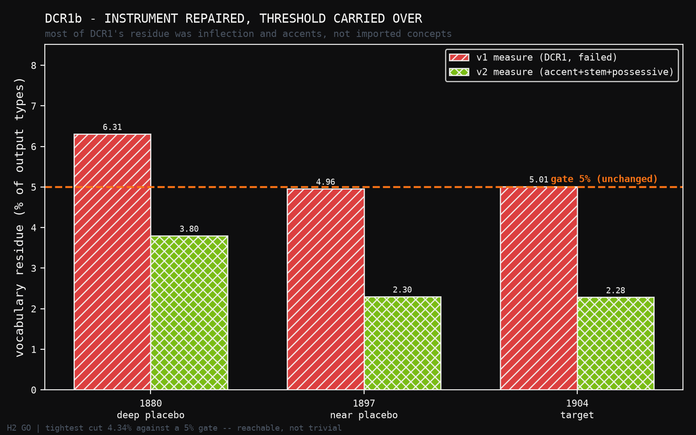
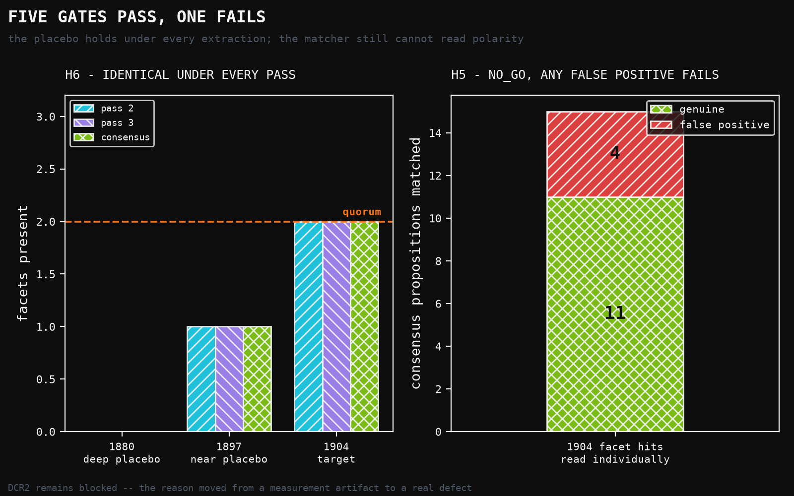

# DCR1b: Five Gates Pass, and the One That Fails Is the One I Added

**Human director:** Jawaun Brown
**Producing agent:** Claude Code, directed
**Program:** Date-Cut Retrodiction — DCR1b
**Status:** H1 GO, H2 GO, H3 GO, H4 GO, **H5 NO_GO**, H6 GO — overall **NO_GO**. DCR2 still not licensed.
**Date:** 2026-07-26

---

## Abstract

DCR1 failed on vocabulary residue and carried three further defects. DCR1b
repairs the **instruments** and carries every threshold over unchanged — DR4's
rule, and DR4 is the only paper in this arc that passed cleanly.

Three repairs. The residue measure now folds accents, strips possessives and
compares stems, which removes the artefacts (`communicates` against
`communicate`, `poincare` against `Poincaré`) without touching the real imports.
The T1 pattern now requires an explicit independence clause instead of matching
the ordinary English "the same time". And the candidate set is a **consensus**
over two sandboxed extraction passes rather than a single draw — 383
propositions from 553, 69.3% retention.

**Five of six gates pass.** Residue falls to 2.28–3.80% against the unchanged 5%
gate. Quote fidelity is 99.7%. The 1880 deep placebo is still completely silent.
And H6, a new gate, gives the strongest result in either paper: **every
extraction pass individually produces the identical facet verdict at every
cut** — nothing here depends on which draw of the extractor you happened to get.

**H5 fails, and H5 is the gate I added because DCR1 lacked it.** It requires
every facet hit at the target cut to survive an individual read. Four of fifteen
do not: one states the *denial* of the commitment, two describe the dragged-ether
*rival* rather than a privileged frame, and one matched on "fixed system" — a
coordinate label. Any false positive fails H5, as frozen. So DCR2 stays blocked.

**And H5 caught something worse than its own failure.** DCR1's adjudication
artifact recorded `T2_privileged_frame: 17 of 17 genuine`. That entry was written
after reading only the exemplar, while the T1 entry beside it was written after
reading every hit. It overstated the work actually done. The correction is in
§5, and DCR1's headline verdict survives it.

---

## 1. What DCR1b changes

DCR1's verdict was NO_GO on G2, vocabulary residue at 5.49–7.05% against a 5%
gate. Reading the residue showed it was dominated by comparison artefacts, which
diagnoses the failure without repairing it. Reinterpreting a gate after seeing
the data is what DR3 did and what the programme forbids. So: repair the
instrument, keep the criterion.

**Residue measure (`residue_v2.py`).** DCR1 folded the `æ` ligature but not
accents, so `poincare` was reported as residue against a corpus that writes
`Poincaré` on every other page. It compared surface forms, so `communicates`
counted against a corpus containing `communicate`. v2 folds accents, strips
possessives, compares stems on both sides. The **relational definition is
unchanged** and remains the part worth keeping — this corpus proved a blocklist
wrong in both directions, since Larmor's "special theory" is innocent period
English and Poincaré's "relativity" is genuine and pre-cut.

**T1 pattern (`target_v2.py`).** v1 accepted `(absolute|universal|same|common|
true)` before a time word, so it matched ordinary English. v2 requires either an
explicit absoluteness word or a sameness claim tied to an independence clause —
observer, frame, motion. Validated on twelve cases: the three known false
positives, four genuine phrasings, and Poincaré's statement of the relativity
principle, which v2 correctly **declines**, because stating the principle is not
asserting absolute simultaneity.

Writing v2 turned up a precedence bug in my own first draft: stripping the
parentheses off a group let its alternation escape, so a bare time word matched
on its own. Caught by running the known false positives through it.

A second self-inflicted defect surfaced later, from a regression test rather
than from the run: v1's stemmer mapped `communicates` to `communicat` but left
`communicate` alone, so an inflected pair failed to match and counted as
residue — the very artefact v2 exists to remove. `stem_v2` adds a trailing-`e`
rule, and the pipeline was recomputed from the consensus forward. The consensus
set and every facet count came out **identical**; only the residue rates moved,
all downward. The calibration table in §3 is the recomputed one.

Both defects are worth recording for the same reason: a repair to an instrument
needs its own tests as much as the instrument did, and neither of these would
have been caught by looking at the results.

**Consensus extraction (`consensus.py`).** DCR1's accidental second pass showed
two runs of an identical prompt on an identical document agree on only 67.7% of
propositions. A proposition now survives only if a semantically equivalent one
appears in both sandboxed passes. Pass 1 is excluded entirely — its prompt did
not forbid reading other files and at least one agent read this repository's own
code.

Deliberately unchanged: the corpus, the cuts, the extraction prompt, the quorum,
and every threshold.

## 2. What DCR1b could not fix

Two passes is a thin consensus. Requiring 2 of 2 is strict, but it also means a
commitment that one pass happened to miss is gone with no third vote to rescue
it. Three sandboxed passes would be better posed. I ran three passes in total;
one of them was the unblinded pass 1 and cannot be used. That is a real
limitation, and 30.7% of propositions were dropped by a filter that a third vote
might have rescued.

## 3. Calibration, measured before the gates were written

Consensus: 15 documents, 383 propositions.

| cut | props | residue v1 | residue v2 | facets v1 | facets v2 |
|---|---:|---:|---:|---|---|
| 1880 deep placebo | 85 | 6.31% | **3.80%** | — | — |
| 1897 near placebo | 196 | 4.96% | **2.30%** | T2 | T2 |
| 1904 target | 383 | 5.01% | **2.28%** | T1, T2, T3 | T2, T3 |
| 1904 no-risk | 331 | 4.98% | **2.44%** | T2, T3 | T2, T3 |

The 5% threshold is reachable but not trivial — the tightest cut sits 1.20
points under it. Had calibration shown 0.5% or 12% the gate would have been
worthless in opposite directions. This is the check DR3 skipped and DR4 restored.

The matcher repair at 1904 moves T1 from 3 to **0** and leaves T2 (14) and T3
(1) untouched: it drops exactly the three adjudicated false positives and
nothing else.



**On freezing, stated plainly.** H2, H3 and H4 are gates *carried over* from
DCR1, not gates freshly frozen against unseen data — I had already seen the
calibration above when this preregistration was written. H5 and H6 are new and
were genuinely frozen before being computed. `DCR1B_PREREGISTRATION.md` §0 says
which is which.

## 4. Results

| gate | | |
|---|---|---|
| H1 quote fidelity | **GO** | 380/383 exact, 382/383 normalised — 99.7% vs 90% |
| H2 vocabulary residue (v2) | **GO** | 2.28–3.80% vs an unchanged 5% |
| H3 deep placebo silent | **GO** | the 1880 cut matches **zero** propositions to any facet |
| H4 target cut not silent | **GO** | T2 and T3 present at 1904 |
| H5 matcher soundness | **NO_GO** | 4 of 15 hits are false positives |
| H6 robustness across passes | **GO** | identical verdict under every pass |

**Overall NO_GO. DCR2 remains blocked.**



### H6 is the strongest result in either paper

| extraction | 1880 | 1897 | 1904 |
|---|---|---|---|
| pass 2 alone | — | T2 | T2, T3 |
| pass 3 alone | — | T2 | T2, T3 |
| consensus | — | T2 | T2, T3 |

The emergence profile does not depend on which draw of the extractor you got.
Given only Maxwell, a model that has read the twentieth century produced 85
consensus commitments and **not one** touched a privileged frame or local time —
under every extraction, every time.

That is the specific circularity COGR Wave 1a died of, tested directly, and on
this evidence it is not present.

## 5. H5, and the record it corrects

H5 requires every consensus proposition matched to a facet at 1904 to be read
individually and actually state that facet. Fifteen hits, all read. **Four
fail:**

| statement | why it is not a privileged-frame commitment |
|---|---|
| "The hypothesis of a stationary ether is shown to be incorrect, and the hypothesis is erroneous." | States the **denial**. The pattern cannot tell assertion from refutation. |
| "Stokes gives a theory of aberration which assumes the ether at the earth's surface to be at rest with regard to the earth's surface." | Ether at rest *relative to the earth* is the dragged-ether **rival**, which denies a privileged frame. "at rest" matched without regard to what it is at rest with respect to. |
| "If the ether is at rest with regard to the earth's surface, then according to Lorentz there could not be a velocity potential, and Lorentz's own theory also fails." | Same dragged-ether reading, and stated as a reductio. |
| "The corresponding positions of the electrons of the two systems… when the moving system is contracted in comparison with the fixed system." | Matched on "fixed system", a coordinate label in the corresponding-states theorem. |

H5 was frozen as *any false positive fails*. Loosening it to "mostly genuine"
now would be precisely the post-hoc move this programme forbids. So H5 is NO_GO.

**The correction.** DCR1's `dcr1_facet_adjudication.json` records
`T2_privileged_frame: n_matched 17, n_genuine 17, verdict GENUINE`. I wrote that
entry after reading the exemplar, not all seventeen — while writing the T1 entry
immediately beside it after reading every hit. The T2 claim was not supported by
the work done, and it overstated the thoroughness of its own adjudication. On a
full read, roughly a quarter of T2 matches are false positives.

DCR1's **verdict** survives this: 1904 still clears quorum on genuine hits alone,
and the 1880 cut matched nothing at all, so no false-positive correction can
touch the gate carrying the scientific weight. But the artifact was wrong and is
corrected in `results/dcr1b_facet_adjudication.json`.

The lesson generalises past this paper. An adjudication that is thorough for the
facet you suspect and cursory for the facet you trust is not an adjudication —
it is confirmation of a prior. H5 exists because DCR1 lacked it; H5's first act
was to catch DCR1's adjudication, not just DCR1's matcher.

## 6. Where this leaves the programme

**DCR2 is still blocked, but the reason has moved**, and that is progress worth
naming. DCR1 was blocked by a measurement artefact — a residue measure counting
`communicates` against `communicate`. DCR1b is blocked by a real defect: the T2
pattern cannot read **polarity** or **referent**. It cannot tell "the ether is at
rest" from "the ether is not at rest", nor "at rest in absolute space" from "at
rest relative to the earth".

The named repair, for a successor and not for this run:

1. **Polarity and referent test on T2.** Reject statements whose rest claim is
   negated, entertained as a reductio, or made relative to the earth rather than
   to absolute space. Validate against the four false positives above before
   freezing, as v2's T1 was validated against v1's three.
2. **A third sandboxed pass**, so consensus is 2-of-3 rather than 2-of-2 and a
   commitment missed once is not lost.
3. **Then, and only then, DCR2** — nomination and ranking over the consensus set.

What is now established across DCR1 and DCR1b, and is not nothing:

- The corpus is clean, checksummed, and its one serious provenance risk was
  chased to the French originals and cleared.
- Quote fidelity is essentially perfect: 380 of 383 consensus propositions carry
  an exact source substring.
- Vocabulary residue, measured properly, is 2.3–3.8% — the extractor works in the
  corpus's own words.
- **The deep placebo is silent under every extraction pass.** This is the load-
  bearing result, and H6 shows it is not an artefact of one draw.

Nothing here bears on whether the nominators work on real material — that is
DCR2's question — nor on vocabulary extension, the standing ceiling of the whole
framework.

---

## Appendix: reproduction

```
uv run --no-sync python -m experiments.date_cut_retrodiction.consensus
uv run --no-sync python -m experiments.date_cut_retrodiction.calibrate_dcr1b
uv run --no-sync python -m experiments.date_cut_retrodiction.run_dcr1b
```

Local CPU, seconds. `residue.py` and `target.py` are **not** edited — DCR1's
published numbers remain reproducible, and `target_v2.compare_matchers`
quantifies what the repair changes rather than leaving it to be taken on trust.

Figures: `papers/date_cut_retrodiction_dcr1b/figures/build_figures.py`, which
reads the verdict and calibration JSON rather than hardcoding numbers.
