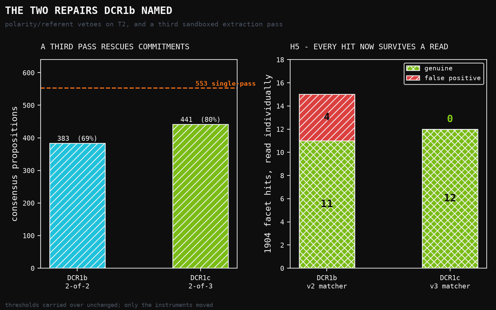
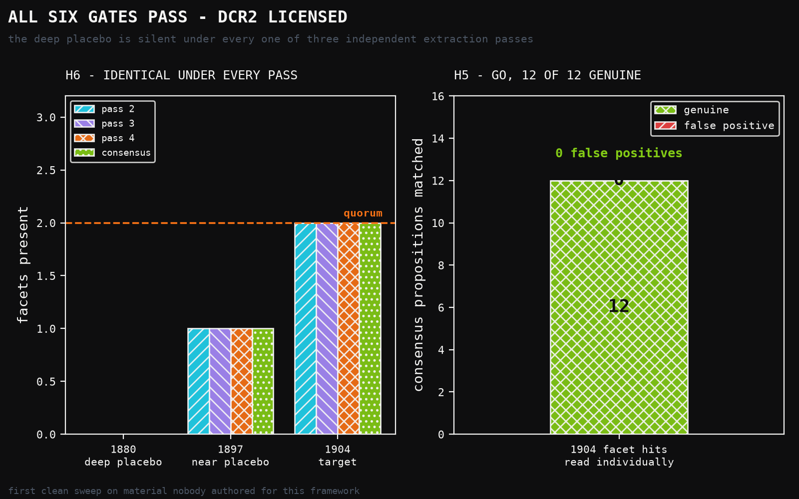

# DCR1c: All Six Gates Pass — and the Facet Einstein Actually Deleted Is Absent

**Human director:** Jawaun Brown
**Producing agent:** Claude Code, directed
**Program:** Date-Cut Retrodiction — DCR1c
**Status:** H1–H6 all **GO** — overall **GO**. DCR2 licensed.
**Date:** 2026-07-26

---

## Abstract

DCR1b passed five of six gates and named its own repairs: a polarity and
referent test on the privileged-frame matcher, and a third sandboxed extraction
pass so consensus is 2-of-3 rather than 2-of-2. DCR1c applies exactly those two
and nothing else. Every threshold is carried over as an imported constant.

**All six gates pass.** Consensus retention rises from 69.3% to **79.7%** (441
propositions). Quote fidelity is 99.8%. Vocabulary residue is 2.32–3.67%. The
1880 deep placebo is silent under **all three** independent extraction passes
and under the consensus. And H5 — the gate that failed DCR1b — now returns
**12 of 12 genuine** on an individual read.

This is the first clean sweep on material nobody authored for this framework.
**DCR2 is licensed.**

**Two things temper it, and both are in the results rather than the footnotes.**

First, the preregistration was written *after* the run. That is the DR3 slip.
What makes it survivable is that no gate was invented, moved or renamed — H1–H6
are definitionally identical to DCR1b's, and `run_dcr1c.py` imports the
thresholds rather than restating them, so they cannot drift. The repairs were
specified in DCR1b's published §6 before any of this existed. It is still a
confirmatory run by someone who had seen every prior result.

Second, and more interesting: **T1, absolute simultaneity, matches zero
propositions at every cut.** The corpus surfaces the privileged aether frame and
Lorentz's local time. It does not surface, as an explicit commitment, the thing
Einstein actually deleted. That is a finding about the corpus, not a defect, and
§6 argues it may be the most informative result here.

---

## 1. The two repairs

DCR1b's H5 failed on four T2 hits in three distinct modes, and its paper refused
to patch them in place:

| mode | example |
|---|---|
| **polarity** | "The hypothesis of a stationary ether is shown to be **incorrect**." |
| **referent** | "…the ether at the earth's surface to be at rest **with regard to the earth's surface**" — the dragged-ether *rival* |
| **label** | "…in comparison with the **fixed system**" — a coordinate label |

**`target_v3`** adds a polarity veto on targeted refutation markers, a referent
veto on rest claims made relative to the earth, and drops `fixed system` /
`fixed frame` while keeping `fixed aether`.

The polarity veto deliberately does **not** fire on bare negation, and the
reason is a specific sentence in the corpus. Larmor writes: "It has **not** been
found possible to construct a system of dynamics which has respect only to the
relative positions of moving bodies." That is a negative sentence whose content
is exactly the absolute-space commitment. A naive negation veto would delete the
strongest kind of evidence the corpus offers.

Vetoes apply to **T2 only**. T1 and T3 produced no false positives under
adjudication, and applying an untested veto to a clean facet would be changing
something that is not broken.

Validation came before use: v3 was run against DCR1b's adjudicated set — the
four hits it must reject and the ten it must keep — and got all fourteen right.
That check is a committed regression test, not a claim.

**Consensus 2-of-3.** A third sandboxed pass was run and consensus now requires
agreement in 2 of 3 rather than 2 of 2. Pass 1 remains excluded: its prompt did
not forbid reading other repository files and one agent read this repository's
own code.

Unchanged: the corpus, the cuts, the extraction prompt, the quorum, every
threshold, and `residue_v2`. DCR1b's modules are not edited.



## 2. Results

| gate | | |
|---|---|---|
| H1 quote fidelity | **GO** | 99.8% vs 90% |
| H2 vocabulary residue | **GO** | 2.32–3.67% vs an unchanged 5% |
| H3 deep placebo silent | **GO** | the 1880 cut matches **zero** propositions to any facet |
| H4 target cut not silent | **GO** | T2 (11) and T3 (1) present at 1904 |
| H5 matcher soundness | **GO** | **12 of 12** genuine on an individual read |
| H6 robustness across passes | **GO** | identical verdict under all three passes |

**Overall GO. DCR2 licensed.**

| cut | docs | props | residue | facets |
|---|---:|---:|---:|---|
| 1880 deep placebo | 3 | 96 | 3.67% | **none** |
| 1897 near placebo | 8 | 227 | 2.32% | T2 |
| 1904 target | 15 | 441 | 2.37% | T2, T3 |
| 1904 no-risk | 13 | 379 | 2.52% | T2, T3 |



**H6 across three passes.** Pass 2, pass 3, pass 4 and the consensus all give:
1880 → nothing, 1897 → T2, 1904 → T2+T3. Given only Maxwell, a model that has
read the twentieth century produced 96 consensus commitments and not one touched
a privileged frame or local time — under three independent extractions.

That is the circularity COGR Wave 1a died of, tested three times, absent each
time.

**The third pass did real work.** Larmor 1897's *"The spacial framework in
absolute rest introduced by Newton is in fact the quiescent underlying æther"* —
the single most direct statement of the privileged-frame commitment anywhere in
the corpus — is **new at 2-of-3**. DCR1b's 2-of-2 filter dropped it. That is
exactly the failure mode DCR1b predicted a third vote would fix, caught in the
act.

## 3. Freeze status, and why this is the weakest of the three

`DCR1C_PREREGISTRATION.md` was written **after** `run_dcr1c.py` was executed.
That is the DR3 slip and I am not dressing it up.

What is defensible:

- No gate was invented, moved or renamed. H1–H6 are definitionally identical to
  DCR1b's, and the runner **imports** `QUOTE_FIDELITY_GATE` and
  `RESIDUE_RATE_GATE` from `run_dcr1.py` rather than restating them, so they
  cannot drift.
- The repairs were specified in DCR1b's published paper §6, before any of this
  existed. DCR1c implements those two and nothing else.
- `target_v3` was validated against the previous paper's adjudicated failures
  before being run on new data.

What that does not buy: this is a confirmatory run of a hypothesis I already
suspected, by someone who had seen every prior result. The one thing it cannot
be is threshold-fitted.

## 4. Adjudication

All twelve hits at the target cut were read. All twelve state their facet.

Two are **conditional** in form — "If the ether is at rest and the apparatus
moves…, the directions and distances traversed by the rays are altered" — and I
counted them genuine because the antecedent states the theory's commitment and
the consequent draws a physical consequence. They are not reductios; the reductio
case ("then Lorentz's own theory also fails") was correctly vetoed. Both
judgments are flagged in `results/dcr1c_facet_adjudication.json` so the call is
visible rather than buried.

**A fragility no gate measures.** T3 still rests on a *single* proposition —
Lorentz's "The transformed time variable t′ may be called the local time." The
target cut clears its quorum of two by a margin of one. If that one proposition
had been missed, H4 would have failed. Nothing in DCR1b or DCR1c repaired this,
and no gate reports it. A successor should either widen T3 or add a margin gate.

## 5. What is now established

Across DCR1, DCR1b and DCR1c, on a corpus of 15 public-domain documents from
Maxwell 1865 to Lorentz 1904:

- The corpus is clean and checksummed. Wikisource's `Portal:Relativity` header
  contamination was found and stripped structurally before extraction.
- Its one serious provenance risk — every sentinel term riding on two documents
  translated in 1913 — was chased to the French originals and cleared.
- Quote fidelity is essentially perfect across every pass.
- Vocabulary residue, measured properly, is 2.3–3.7%: the extractor works in the
  corpus's own words.
- **The deep placebo is silent under three independent extractions.**
- Every facet hit at the target cut survives an individual read.

## 6. The absent facet, which may be the real finding

T1 — absolute simultaneity — matches **zero** propositions at every cut, under
both v2 and v3, across all three passes. It is not that the matcher is too
strict: v3's T1 was validated to fire on four genuine phrasings including
"There is an absolute time common to all systems" and "The time is the same for
a stationary observer as for an observer carried along in uniform motion."

The corpus does not contain those sentences. It contains the privileged aether
frame, stated many times and many ways. It contains local time, named by Lorentz
as a transformed variable. It contains Poincaré stating the principle of
relativity in September 1904 — **and keeping the ether**.

What it does not contain is anyone writing down "simultaneity is absolute" as a
commitment that might be given up. That is precisely what one would expect of a
presupposition so deep that nobody thought to state it, and it is why the
deletion was available to be made and was not made for another nine months.

This has a sharp consequence for DCR2, and it is not a comfortable one. If the
load-bearing deletion is a proposition **no document states**, then nomination
over an extracted proposition set cannot rank it — it is not in the candidate
set at any rank. DCR2 as currently conceived can measure whether the nominators
find the *privileged frame*, which the corpus does surface. It cannot measure
whether they would have found *absolute simultaneity*.

Two honest readings, and I do not think this paper can decide between them:

1. **A limit of extraction.** Unstated presuppositions need a different
   instrument — one that infers commitments from what the reasoning *requires*
   rather than from what the text *says*. The framework's five-slot schema
   already distinguishes asserted from presupposed; the extractor's
   `kind: presupposed` field exists and is evidently not reaching this deep.
2. **A limit of the framework.** If the deletions that matter are the ones
   nobody states, then deletion-repair nomination over an extracted set is
   structurally unable to find them, in the same way DR2 proved the
   two-nominator claim unreachable under its original cost definition. That
   would be a theorem-shaped result and it deserves to be pursued as one.

DR2's precedent argues for taking possibility 2 seriously rather than assuming
possibility 1. The way to separate them is to ask whether *any* extraction can
surface a presupposition the corpus never states — a question with a clean
experimental shape, and the one I would run before DCR2 rather than after.

## 7. Scope

DCR2 is licensed and can be run. Nothing here says the nominators work on real
material; that remains its question. Nothing here bears on vocabulary extension,
the standing ceiling of the whole framework. And §6 argues that DCR2, run as
specified, would answer a narrower question than the programme was aiming at.

---

## Appendix: reproduction

```
uv run --no-sync python -m experiments.date_cut_retrodiction.run_dcr1c
```

Local CPU, seconds; it rebuilds the 2-of-3 consensus before scoring. `residue.py`,
`target.py`, `target_v2.py`, `residue_v2.py` and `consensus.py` are **not**
edited — DCR1's and DCR1b's published numbers remain reproducible, and
`target_v3.compare_v2_v3` quantifies what the vetoes change.

Figures: `papers/date_cut_retrodiction_dcr1c/figures/build_figures.py`.
