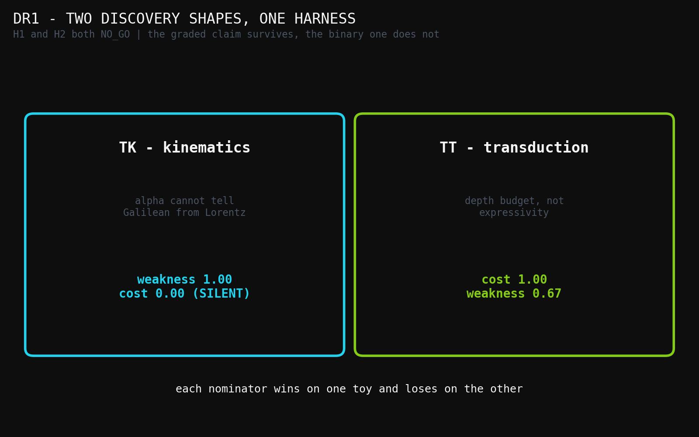
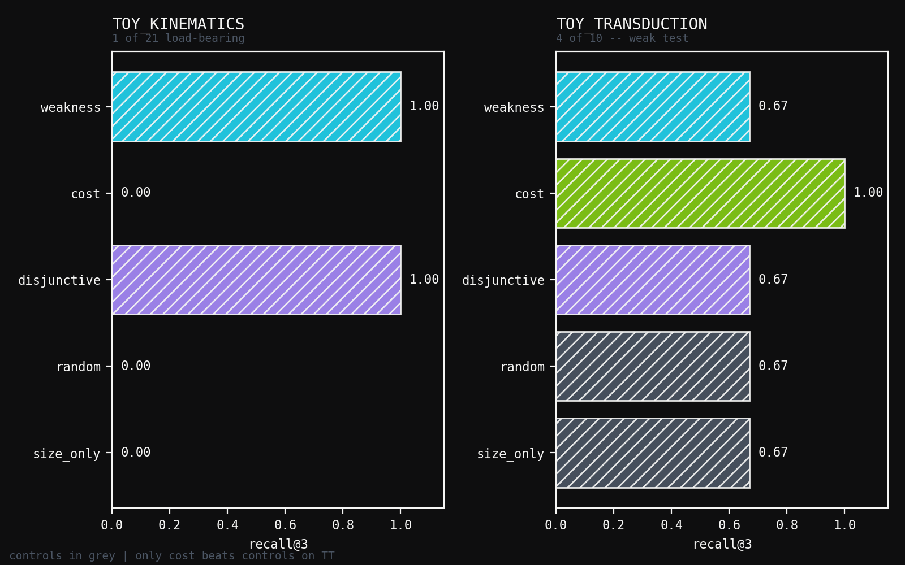
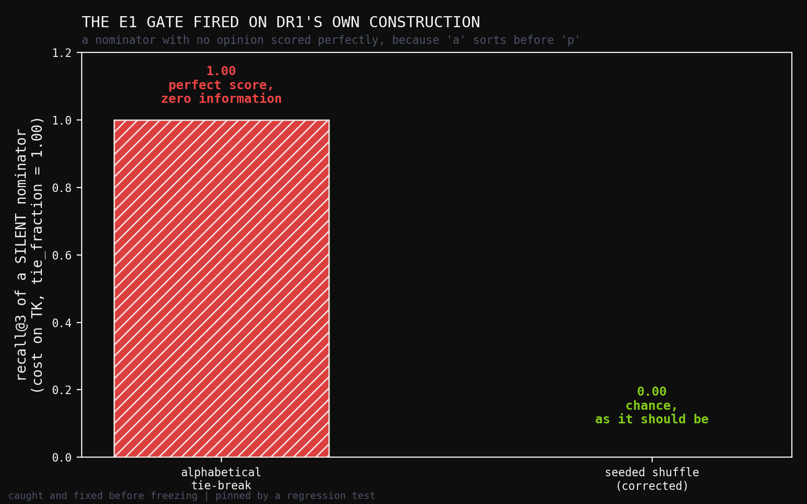

# DR1: Can a Cheap Nominator Find the Load-Bearing Deletion? A Smallest Working Example

**Human director:** Jawaun Brown
**Producing agent:** Claude Code, directed
**Program:** Deletion-Repair Nomination — probe DR1
**Status:** smallest working example. NO_GO on both preregistered hypotheses.
**Date:** 2026-07-24

---

## Abstract

A discovery-shaped move can be modelled as: hold a representation `R` that
works on a child task `α`, delete an over-specification `D ⊆ R`, repair with
`r`, and thereby cover a parent task `ω` that `R` could not. Relativity and
attention both fit: absolute simultaneity was free at low velocity and fatal at
high; recurrence was free at short sequence length and fatal under a parallel
budget. In **both** canonical cases the repair already existed — Lorentz had
published the transformations in 1904, attention was standard by 2015 — so what
was hard was the *deletion*, not the replacement.

DR1 asks the smallest question that follows: can an execution-free **nominator**
rank the load-bearing deletion highly, scored against an exhaustive oracle, on
toy systems where the answer is known? Two toys, one harness. `TK` is
relativity-shaped; `TT` is attention-shaped.

Two hypotheses were preregistered and **both returned NO_GO**, informatively.
**H1** (no single nominator wins on both toys) failed because its binary
framing does not survive contact: "weakness is silent" is almost never true,
since extension size grows for nearly any non-vacuous deletion. The *graded*
version of the claim does hold — weakness scores `1.00` vs cost's `0.00` on
`TK`, and cost scores `1.00` vs weakness's `0.67` on `TT`. **H2** (a
`max`-disjunction is at least as good as the better single nominator) failed
outright: the disjunction is **worse** than cost on `TT` (`0.67` vs `1.00`),
because `max` after normalisation lets a high-weakness-but-useless deletion tie
a high-cost-and-correct one.

A third result was not preregistered because it happened during construction:
**the leakage gate built for the previous program fired on this one.**
Alphabetical tie-breaking handed a *completely silent* nominator — `cost` on
`TK`, with every score tied at zero — a load-bearing deletion in its top 3.
That is a permitted field (the alphabet) carrying information it had not
earned. It was fixed before freezing.

---

## 1. What DR1 is not

DR1 does not discover anything. Relativity and attention are already
discovered; they cannot be found again, only *retrodicted*. They are the
validation targets — the known top-`k` — not the goal. DR1's toys are
miniatures of the **shape** of those moves, not of their content, and a GO here
would have licensed exactly one thing: preregistering a date-cut retrodiction
on a real corpus.

The vocabulary `𝔳` is fixed throughout. Deletion-and-repair *inside* a fixed
language is what DR1 mechanises. Language *extension* is not, and that is the
known ceiling: special relativity is expressible in 1904's vocabulary, but
general relativity required Riemannian geometry Einstein had to go and learn.
Same physicist, same decade, opposite sides of the ceiling.

---

## 2. Design

Both toys expose the same five slots — a finite hypothesis space `H`,
propositions acting as predicates over `H`, a child task `α`, a parent task
`ω`, and a cost model — so one harness scores both.

### 2.1 TK — Toy Kinematics (relativity-shaped)

`H` is a grid of coordinate transformations at relative velocity `v` (units
`c = 1`), indexed by a single physical dial `k`: `k = 0` is the Galilean
member, `k = 1` the Lorentz member. Dilation is **not** an independent dial —
it is a facet of time mixing, exactly as length contraction follows from
relativity of simultaneity rather than being assumed separately.

- **α** probes `v ∈ {0.01, 0.02, 0.05}` at a small displacement, so the `v·x`
  term is negligible. Galilean and Lorentz agree to tolerance. **α cannot tell
  them apart** — this is the over-specification-fitted-to-the-child-task
  condition, and it is what makes the puzzle a puzzle.
- **ω** adds light-propagation invariance: a ray `x = t` must satisfy
  `x' = t'` at `v ∈ {0.3, 0.6, 0.9}`. Only the Lorentz member survives.

Crucially, `absolute_simultaneity` and `no_length_contraction` are entangled
facets of one commitment: **neither alone frees anything**. Each scores
weakness gain of exactly `0.0`. The load-bearing deletion is the *pair*. A
nominator that scored only singletons would miss it entirely.

`preferred_rest_frame` is the deliberate trap — an ether-shaped commitment that
is droppable and *does* enlarge the extension, but does not reach `ω` on its
own. It is the Lorentz-without-Einstein move: give up the ether, keep absolute
time, get nowhere.

### 2.2 TT — Toy Transduction (attention-shaped)

`H` is a set of computation schemes over sequences, each with an access pattern
and a parallel depth. `α` is short sequences under a loose budget, where
sequential and parallel schemes both pass. `ω` is a parallel-depth budget that
sequential schemes cannot meet.

### 2.3 Nominators, and the oracle

Five nominators, all execution-free — none may call `fits_omega`:
`weakness` (extension growth), `cost` (best-achievable-cost improvement),
`disjunctive` (`max` after per-toy normalisation), and two controls, `random`
and `size_only`.

The oracle is exhaustive over `|D| ≤ 2`, labelling each `D` valid-on-`α` and
covers-`ω`. Negatives are included by construction — propositions whose
deletion frees nothing — so the recall denominator means something.

---

## 3. The gate that fired during construction

Erratum E1 of the previous program recorded a defect in which a *permitted*
field already contained the answer, and every audit missed it because each had
asked whether the policy could reach something *forbidden*. DR1 assumed that
failure mode was present until measured.

It was. `cost` is completely flat on `TK` — every hypothesis costs the same, so
every candidate's cost attribution is exactly `0.0`, `tie_fraction = 1.00`. The
nominator has **no opinion whatsoever**. But ranking ties alphabetically put
`absolute_simultaneity+no_length_contraction` — the load-bearing pair — at rank
3, and `cost` scored `recall@3 = 1.00`.

A signal that says nothing scored perfectly, because `a` sorts before `p`.

The fix is to break ties by a seeded shuffle, so a silent nominator scores at
chance. Under it, `cost` on `TK` correctly drops to `recall@3 = 0.00` with its
first load-bearing candidate at rank 7. This was corrected **before** freezing,
per the preregistration's own §7, and a regression test pins it.

The general lesson transfers beyond DR1: **tie-breaking is a scoring channel,
and a deterministic tie-break leaks whatever the sort key correlates with.**

---

## 4. Results

Oracle: `TK` has 21 candidates and **1** load-bearing; `TT` has 10 candidates
and **4**. `k = 3`.

### 4.1 Toy Kinematics

| nominator | recall@3 | regret | rank of 1st | tie frac | |
|---|---:|---:|---:|---:|---|
| **weakness** | **1.00** | 0 | **1** | 0.67 | |
| disjunctive | 1.00 | 0 | 1 | 0.67 | |
| size_only | 0.00 | 1 | 5 | 0.71 | control |
| **cost** | **0.00** | 1 | 7 | **1.00** | **silent** |
| random | 0.00 | 1 | 19 | 0.05 | control |

Weakness puts the entangled pair at rank 1 out of 21, beating both controls.
Cost is silent, as designed.

### 4.2 Toy Transduction

| nominator | recall@3 | regret | rank of 1st | tie frac | |
|---|---:|---:|---:|---:|---|
| **cost** | **1.00** | 0 | 1 | 0.60 | |
| weakness | 0.67 | 0 | 1 | 0.60 | |
| disjunctive | 0.67 | 0 | 1 | 0.70 | |
| size_only | 0.67 | 0 | 1 | 0.60 | control |
| random | 0.67 | 1 | 2 | 0.10 | control |

Only `cost` beats the controls. **`TT` is a weak test** and this should be said
plainly: 4 of 10 candidates are load-bearing, a 40% base rate, so `random`
scores `0.67` by luck alone. `TK`, with 1 of 21, is the discriminating toy.

### 4.3 The frozen gates

| gate | result |
|---|---|
| **H1** — no single nominator wins both | **NO_GO** (`TK` half passes, `TT` half fails) |
| **H2** — disjunction ≥ better single | **NO_GO** (`TK` passes, `TT` fails: `0.67 < 1.00`) |
| sanity — nominators beat controls somewhere | PASS (weakness on `TK`) |
| **overall** | **NO_GO** |

---

## 5. Interpretation

**H1's idea survives; H1's operationalisation does not.** The binary form —
"cost fires *and weakness is silent*" — fails because weakness-as-extension-size
is almost never silent. Dropping nearly any non-vacuous proposition frees
hypotheses, so weakness always has *some* opinion. On `TT` it scores `0.67`,
which is enough to falsify "weakness does not."

But the graded comparison is unambiguous and it points the way the hypothesis
intended: **weakness `1.00` vs cost `0.00` on `TK`; cost `1.00` vs weakness
`0.67` on `TT`.** Each nominator wins on a different toy, and each is *beaten*
on the other. A single-objective system would take the worse of the two on one
of them. The two-nominator claim should be restated in graded form — *no single
nominator dominates across discovery shapes* — and DR1 supports that restatement
while rejecting the binary one.

**H2 fails for a specific, fixable reason.** `max` after per-toy normalisation
is a bad combiner. On `TT` it lets `bounded_state+causal_masking` — high
weakness, useless — tie `sequential_state_update` deletions that are high cost
and correct, and the tie-break then costs the disjunction a hit. A disjunction
that is *worse than its own best component* is not a disjunction worth having.
The concrete lesson: combine by **sum** of normalised scores, or
**lexicographically** with an explicit precedence, or gate on validity first —
but not by `max`.

**On the base rate.** `TT`'s 40% load-bearing rate makes it nearly
uninformative; `random` gets `0.67` for free. This is the survivorship problem
in miniature. A useful successor needs toys with a base rate low enough that
chance performs badly — `TK`'s 1-in-21 is the right target, and 1-in-100 would
be better.

---

## 6. What DR1 licenses

Nothing beyond itself. Both preregistered hypotheses returned NO_GO, so the
date-cut retrodiction on a real corpus does **not** open — that was explicitly
conditioned on a GO.

What DR1 does deliver:

1. A working harness — five slots, exhaustive oracle, execution-free nominators,
   negatives by construction — that a corrected successor can reuse directly.
2. A specific, actionable defect in the disjunctive score, with the fix named.
3. A restatement of the two-nominator claim in the graded form the evidence
   supports.
4. Independent confirmation that the E1 leakage gate generalises: it was built
   for a different program and immediately caught a real defect in this one.

**Honest scope.** Two authored toy systems, authored propositions, fixed
vocabulary, exhaustive oracle over `|D| ≤ 2`. DR1 says nothing about real
corpora, nothing about vocabulary extension, and nothing about relativity or
attention beyond using their shape as a template.

---

## References

1. `experiments/deletion_repair/PREREGISTRATION.md` — frozen design and gates.
2. `experiments/deletion_repair/results/dr1_verdict.json` — the receipt behind
   every number above.
3. `experiments/concern_gated_retrieval_e2/erratum_e1/ERRATUM.md` — the leakage
   gate that fired here, and the program-wide defect that motivated it.
4. Lorentz (1904); Poincaré (1905); Einstein (1905); Minkowski (1908) — the
   dating that establishes SR as inside 1904's vocabulary and GR as outside it.
5. Bahdanau et al. (2014); Luong et al. (2015); Vaswani et al. (2017) — the
   dating that establishes attention as pre-existing and the *deletion* of
   recurrence as the contribution.

## Figures

