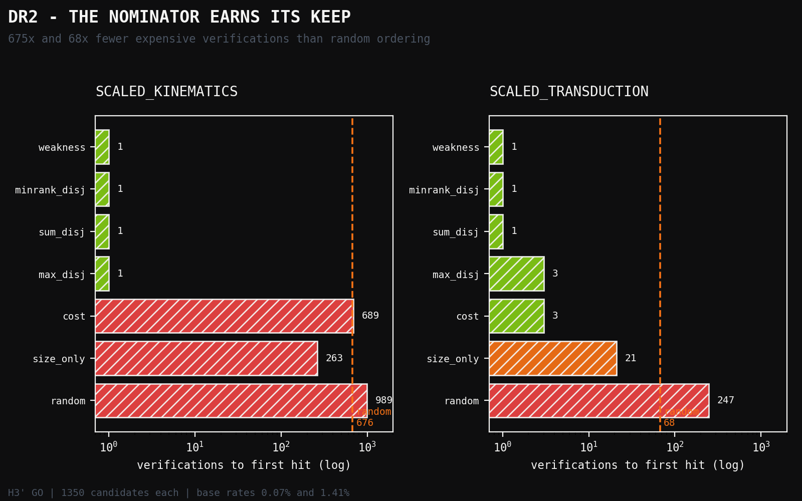
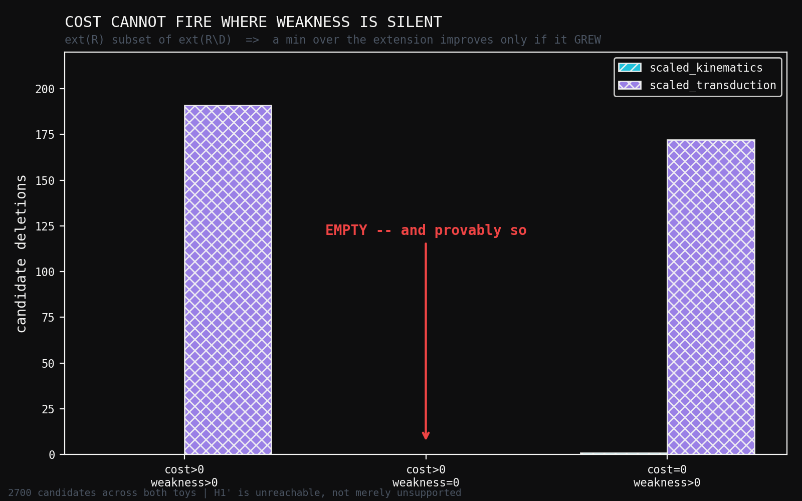

# DR2: Cheap Nomination Beats Exhaustive Search — and Cost Attribution Cannot Be Independent of Weakness

**Human director:** Jawaun Brown
**Producing agent:** Claude Code, directed
**Program:** Deletion-Repair Nomination — DR2
**Status:** H3′ GO, H2′ GO, H1′ NO_GO. Overall NO_GO, with a theorem.
**Date:** 2026-07-24

---

## Abstract

DR1 could not answer the question it was built for. With 21 candidate
deletions, each cheap to verify, exhaustive search *is* the answer — a
nominator cannot earn its keep in a regime where enumeration is free. DR2
scales until enumeration hurts: 20 deletable propositions, `|D| ≤ 3`, **1350
candidates**, and load-bearing base rates of **0.07%** and **1.41%**, so a
random ordering needs **675** and **68** expensive verifications respectively.

Three hypotheses were preregistered. Two returned GO and one returned NO_GO,
and the NO_GO turns out to be a **theorem** rather than a measurement.

**H3′ — the nominator earns its keep: GO, decisively.** The best nominator
finds a load-bearing deletion on the **first** verification on both toys:
**675× and 68× faster than random ordering**. In a pipeline where verification
is the expensive step, cheap execution-free ranking converts a 675-verification
search into a 1-verification one. This is the question DR1 could not reach, and
the answer is yes.

**H2′ — the combiner fix: GO.** DR1 named a specific defect — its `max`
disjunction scored *worse* than its own best component. Both proposed fixes,
sum-of-normalised and min-of-ranks, match the better single nominator on both
toys, while `max` still fails. The defect and its repair both replicate.

**H1′ — dominance: NO_GO, structurally.** The two-nominator hypothesis holds
that weakness gain and cost attribution catch different over-specifications, so
a single-objective system misses one. Across all **2700** candidate deletions,
the set `{cost > 0 and weakness = 0}` is **empty**. That is not an accident of
these toys. Because `ext(R) ⊆ ext(R\D)` always, a minimum taken over the
extension can only improve when the extension **grows** — so
`cost_attribution > 0 ⟹ weakness_gain > 0` necessarily. Cost can never fire
where weakness is silent. Within this formalisation the two nominators cannot
come apart in the direction the hypothesis requires.

---

## 1. What DR1 established, and what it could not

DR1 tested whether an execution-free nominator ranks the load-bearing deletion
highly against an exhaustive oracle. Both its hypotheses returned NO_GO, and it
named two defects in itself: a `max` combiner that underperformed its own best
component, and a toy whose 40% base rate let `random` score 0.67 by luck.

Its deeper limitation was neither. It was **regime**. A nominator exists to
make an expensive verifier run on few candidates. With 21 candidates, each
cheap, there is nothing to save. DR1 validated the harness and could not have
validated the nominator.

DR2 changes the regime and applies both named fixes. These are continuation of
a NO_GO, not rescue of one: the changes were specified by the failed experiment
*before* DR2 was designed, and the hypotheses are stated fresh rather than
relaxed.

---

## 2. Design

### 2.1 SK — Scaled Kinematics (weakness-shaped)

Three **entangled facets** of one commitment — absolute simultaneity, no length
contraction, no time dilation — each pinning the same dial. **No subset frees
anything; only the full triple does.** A nominator that scores singletons or
pairs cannot see it, which is why `|D| ≤ 3` is required rather than convenient.
`preferred_rest_frame` is the Lorentz-without-Einstein trap: droppable,
enlarges the extension, reaches nothing. Cost is flat by construction.

### 2.2 ST — Scaled Transduction (cost-shaped)

Dropping sequential update collapses parallel depth from `O(n)` to `O(1)`, but
leaves a **dangling obligation**: recurrence was supplying order information
implicitly, so the deletion covers the parent task only when
`no_positional_input` is dropped alongside it. This mirrors the real case, in
which removing recurrence forced positional encodings. Every load-bearing
deletion contains **both** propositions; `sequential_state_update` alone is not
load-bearing.

Sixteen inert nuisance propositions pad each toy. They are the negatives.

### 2.3 Measured calibration, before freezing

| toy | candidates | load-bearing | base rate | E[verifications] under random |
|---|---:|---:|---:|---:|
| SK | 1350 | 1 | 0.07% | **675.5** |
| ST | 1350 | 19 | 1.41% | **67.5** |

### 2.4 Metric

**`verifications_to_first_hit`** — the number of expensive parent-task
verifications a cost-ordered pipeline runs before it succeeds. This is what a
nominator is *for*, and DR1's `recall@k` could not express it.

---

## 3. Results

### 3.1 Scaled Kinematics

| nominator | verifications | speedup | recall@10 | tie frac | |
|---|---:|---:|---:|---:|---|
| **weakness** | **1** | **675.5×** | 1.00 | 1.00 | |
| max_disjunction | 1 | 675.5× | 1.00 | 1.00 | |
| sum_disjunction | 1 | 675.5× | 1.00 | 1.00 | |
| minrank_disjunction | 1 | 675.5× | 1.00 | 0.00 | |
| size_only | 263 | 2.6× | 0.00 | 0.84 | control |
| **cost** | 689 | 1.0× | 0.00 | **1.00** | **silent** |
| random | 989 | 0.7× | 0.00 | 0.00 | control |

One verification instead of 675. Cost is silent, as designed.

### 3.2 Scaled Transduction

| nominator | verifications | speedup | recall@10 | tie frac |
|---|---:|---:|---:|---:|
| **minrank_disjunction** | **1** | **67.5×** | 0.60 | 0.00 |
| **sum_disjunction** | **1** | **67.5×** | 1.00 | 0.73 |
| **weakness** | **1** | **67.5×** | 1.00 | 0.73 |
| cost | 3 | 22.5× | 0.20 | 0.86 |
| max_disjunction | 3 | 22.5× | 0.20 | 0.73 |
| size_only | 21 | 3.2× | 0.00 | 0.84 |
| random | 247 | 0.3× | 0.00 | 0.00 |

### 3.3 The frozen gates

| gate | result |
|---|---|
| **H3′** — best nominator ≥ 10× speedup on both | **GO** (675.5× and 67.5×) |
| **H2′** — a combiner fix matches the best single on both | **GO** (both `sum` and `minrank`; `max` still fails) |
| **H1′** — no single nominator best on both | **NO_GO** (`weakness` wins both) |
| overall | **NO_GO** |

---

## 4. The theorem

`weakness` winning on the *cost-shaped* toy is not a quirk of ST's encoding.
Across all 2700 candidates on both toys:

| | SK | ST |
|---|---:|---:|
| `cost > 0` and `weakness > 0` | 0 | 191 |
| **`cost > 0` and `weakness = 0`** | **0** | **0** |
| `cost = 0` and `weakness > 0` | 1 | 172 |

The middle row is empty, and it must be. Take cost attribution as defined —
the improvement in the *best achievable* cost, i.e. a minimum over the
surviving extension:

1. Deleting constraints can only admit hypotheses, so `ext(R) ⊆ ext(R\D)` for
   every `D`.
2. A minimum over a superset is no larger than the minimum over the subset, so
   `cost_attribution(D) ≥ 0` always.
3. If `ext(R\D) = ext(R)` the two minima are equal, so `cost_attribution(D) = 0`.
4. Contrapositive: `cost_attribution(D) > 0 ⟹ ext(R\D) ⊋ ext(R) ⟹
   weakness_gain(D) > 0`.

**Cost attribution's support is a subset of weakness gain's support.** Cost can
never nominate a deletion that weakness ignores. The converse fails freely —
172 deletions on ST have weakness gain with no cost improvement — so weakness
strictly dominates cost in support.

This is why H1′ is unreachable rather than merely unsupported. The
two-nominator hypothesis requires cost to catch something weakness misses, and
in this formalisation that event has probability zero.

### 4.1 What would have to change

The theorem's premise is that **cost is a minimum over the extension**. That
is what couples it to extension size. For a genuinely independent second
nominator, cost must attach to something the extension does not determine —
the *procedure* that searches, or the description length of `R` itself, rather
than the contents of the surviving hypothesis set.

Concretely: as long as an architecture choice is represented as a predicate
over hypotheses, deleting it enlarges the hypothesis set and weakness sees it.
To make cost independent, the resource being spent must not be a property of
the hypotheses at all. That is a sharp, actionable design requirement, and it
is the main thing DR2 hands to a successor.

---

## 5. Interpretation

**The framework's core mechanism works.** H3′ is the result that matters
practically. Execution-free nomination turned a 675-verification search into a
1-verification one, and a 68-verification search into a 1-verification one.
Cost-ordered filtering is not decorative once enumeration is expensive — it is
worth two orders of magnitude on the harder toy.

**The two-nominator elaboration does not.** It failed in DR1 on its binary
framing, and it fails in DR2 on the graded dominance framing that DR1's
evidence suggested — this time provably. The right revision is not a better
cost signal within this formalisation; it is to move cost outside the
extension, or to drop the second nominator and accept that weakness alone
carries the ranking.

**`max` is confirmed as a defect and both fixes replicate.** `max_disjunction`
fails H2′ on ST exactly as DR1 predicted it would, while `sum` and `minrank`
both match the best single nominator on both toys. `minrank_disjunction` is
additionally the only combiner with `tie_fraction = 0.00` on both toys — it
never leaves the tie-breaker deciding anything, which after two programmes of
tie-breaking leaks is worth something on its own.

**A caution about ties.** Four of the SK nominators report
`tie_fraction = 1.00` alongside a perfect result. That is not the silent-signal
pathology erratum E1 caught: on SK exactly one deletion has nonzero weakness
gain, so the *remaining* 1349 are tied at zero and the tie fraction is
dominated by them. `cost` on SK is genuinely silent — every candidate tied,
first hit at rank 689, indistinguishable from random. The distinction is
visible in the numbers, and the seeded tie-shuffle is what keeps it visible.

---

## 6. What DR2 licenses

Overall NO_GO, so the date-cut retrodiction on a real corpus does **not** open.
That remains conditioned on a clean GO, and one of three gates failed.

What DR2 delivers:

1. **H3′**: cheap nomination beats exhaustive search by 1–2 orders of magnitude
   once verification is the expensive step. The harness's central premise is
   sound.
2. **A theorem** bounding the framework: cost attribution defined as a minimum
   over the extension can never be independent of weakness gain.
3. **A named, actionable fix**: move cost off the extension — onto the search
   procedure or the representation's own description length.
4. **A validated combiner**: `minrank_disjunction`, which matches the best
   single nominator on both toys and never defers to a tie-break.

**Honest scope.** Two authored toy systems, authored propositions, fixed
vocabulary `𝔳`, exhaustive oracle over `|D| ≤ 3`. Nothing here bears on real
corpora, and nothing bears on vocabulary extension — the known ceiling, and the
reason special relativity is inside 1904's expressible language while general
relativity is not.

---

## References

1. `experiments/deletion_repair/DR2_PREREGISTRATION.md` — frozen design and gates.
2. `experiments/deletion_repair/results/dr2_verdict.json` — the receipt.
3. `papers/deletion_repair_dr1/paper.md` — DR1, which named both defects DR2 fixed.
4. `experiments/concern_gated_retrieval_e2/erratum_e1/ERRATUM.md` — the
   leakage gate, and the tie-breaking discipline carried into DR2.

## Figures

