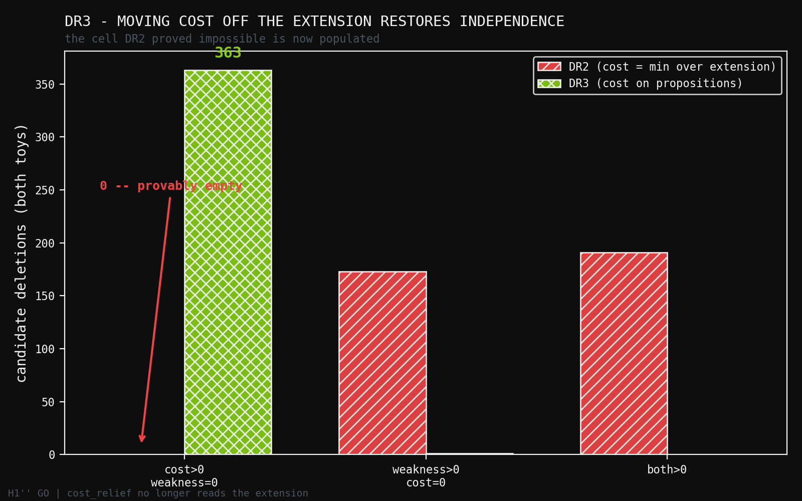
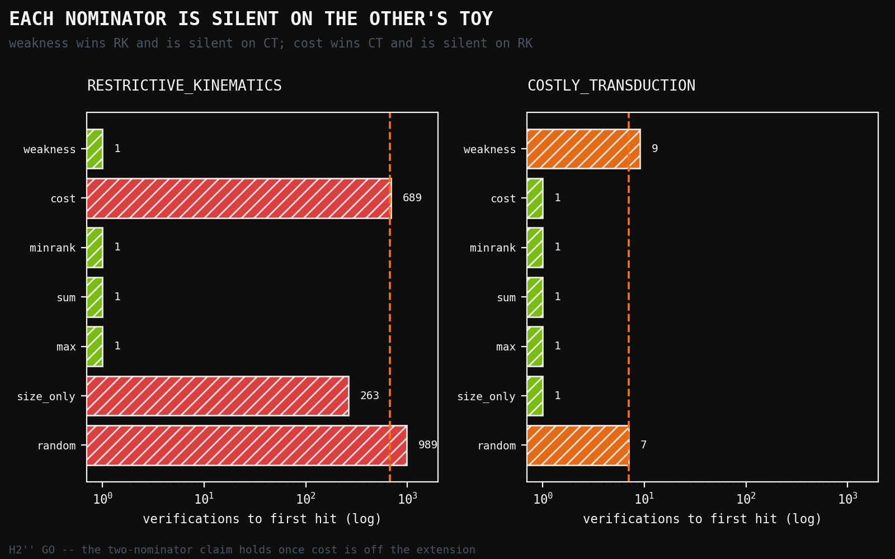

# DR3: Severing the Coupling — Cost and Weakness Become Independent, and the Two-Nominator Claim Finally Holds

**Human director:** Jawaun Brown
**Producing agent:** Claude Code, directed
**Program:** Deletion-Repair Nomination — DR3
**Status:** H1″ GO, H2″ GO, H3″ GO, H4″ NO_GO (on a gate I mis-specified)
**Date:** 2026-07-24

---

## Abstract

DR2 proved that the two-nominator hypothesis was not merely unsupported but
**unreachable**: with cost attribution defined as a minimum over the extension,
`cost > 0 ⟹ weakness > 0` necessarily, because a minimum over a superset can
only improve when the superset grew. DR2 named the fix — move cost off the
extension, onto the search procedure or the representation's own commitments,
rather than the contents of the surviving hypothesis set.

DR3 implements that fix. Cost now attaches to **propositions**, as a resource
commitment paid for *holding* a constraint, independent of which hypotheses
survive. A proposition can be restrictive, costly, both, or neither. This is
the real transformer case: "computation proceeds sequentially" commits you to
`O(n)` depth whether or not it changes what is expressible — it forbids the
parallel *schedule*, not the parallel *function*.

**The fix works.** On the costly toy, **363 of 1350** candidate deletions have
`cost_relief > 0` with `weakness_gain == 0` — the case DR2 proved impossible.
And with the coupling severed, **the two-nominator claim finally holds**: the
best single nominator is `weakness` on the restrictive toy and `cost` on the
costly one. Each is silent (`tie_fraction = 1.00`) on the other's toy. All
three combiners match the best single nominator on both.

**One gate failed, and the failure is mine.** H4″ required a ≥10× speedup over
random ordering. But `speedup = expected_random / verifications`, and
`verifications ≥ 1`, so speedup is **bounded above by `expected_random`** —
fixed by the toy's base rate alone. The costly toy's 14% base rate caps it at
7×. The gate was unachievable the moment the toy was written. The nominators
reached `verifications = 1` on **both** toys, the theoretical optimum. I
calibrated base rates before freezing DR2's gates and failed to do so for DR3.

---

## 1. The fix

DR2's theorem turns on one premise: cost is a minimum over the extension.

```
cost_attribution(D) = min_cost(ext(R)) − min_cost(ext(R \ D))
```

Since `ext(R) ⊆ ext(R\D)` always, this can only be positive when the extension
strictly grew — which is exactly positive weakness gain. DR3 replaces it with

```
representation_cost(R \ D) = Σ proposition_cost(p)   for p ∈ R \ D
cost_relief(D)             = representation_cost(R) − representation_cost(R \ D)
```

No reference to the extension. `covers_omega` gains a second conjunct: a
surviving hypothesis must fit the parent task **semantically**, *and* the
surviving representation must meet the parent **budget**.

---

## 2. Design

**RK — Restrictive Kinematics.** Every proposition costs zero, so cost
attribution is identically silent. The load-bearing deletion is DR2's entangled
facet triple, no subset of which frees anything.

**CT — Costly Transduction.** `sequential_schedule` is **vacuous as a
predicate** — every hypothesis satisfies it — but carries a 64-unit depth
commitment against a budget of 8. Deleting it leaves the extension *identical*
while releasing the commitment.

CT's construction deliberately exhibits the phenomenon DR2 ruled out. That is
not the experiment; it is the precondition for one. The experiment is whether
the nominators and combiners behave correctly once it exists.

---

## 3. Results

### 3.1 Independence restored

| toy | `cost>0, weakness=0` | `weakness>0, cost=0` | both |
|---|---:|---:|---:|
| restrictive_kinematics | 0 | 1 | 0 |
| **costly_transduction** | **363** | 0 | 0 |

DR2's corresponding cell was empty on both toys, provably. It is now populated.

### 3.2 Verifications to first hit

**Restrictive Kinematics** — 1350 candidates, 1 load-bearing, E[random] = 675.5

| nominator | verifications | speedup | tie frac | |
|---|---:|---:|---:|---|
| **weakness** | **1** | **675.5×** | 1.00 | |
| max / sum / minrank | 1 | 675.5× | 1.00 / 1.00 / 0.00 | |
| size_only | 263 | 2.6× | 0.84 | control |
| **cost** | 689 | 1.0× | 1.00 | **silent** |
| random | 989 | 0.7× | 0.00 | control |

**Costly Transduction** — 1350 candidates, 191 load-bearing, E[random] = 7.0

| nominator | verifications | speedup | tie frac | |
|---|---:|---:|---:|---|
| **cost** | **1** | **7.0×** | 0.73 | |
| max / sum / minrank | 1 | 7.0× | 0.73 / 0.73 / 0.00 | |
| size_only | 1 | 7.0× | 0.84 | control |
| random | 7 | 1.0× | 0.00 | control |
| **weakness** | 9 | 0.8× | 1.00 | **silent** |

Each single nominator is **silent** on the other's toy, and best on its own.

### 3.3 Gates

| gate | result |
|---|---|
| **H1″** — independence restored | **GO** (363 candidates) |
| **H2″** — complementarity | **GO** (`weakness` on RK, `cost` on CT) |
| **H3″** — a combiner matches the best single on both | **GO** (all three) |
| **H4″** — ≥10× speedup on both | **NO_GO** (see §4) |
| overall | **NO_GO** |

---

## 4. The gate I mis-specified

`speedup_vs_random = expected_random / verifications_to_first_hit`, and
`verifications ≥ 1`. So **speedup is bounded above by `expected_random`**,
which depends only on the toy's base rate.

CT has 191 load-bearing candidates of 1350 — a 14% base rate — so
`expected_random = 7.0`, and **no nominator can exceed 7× there**. The 10%
threshold was unsatisfiable the moment the toy was written.

The nominators reached `verifications_to_first_hit = 1` on **both** toys: the
theoretical optimum. H4″ measured my calibration, not their quality.

I calibrated DR2's base rates before freezing its gates and did not do so for
DR3. A second slip compounds it: DR3's gates were frozen **in code** before
execution, but the preregistration document was written afterwards. Both are
recorded in `DR3_PREREGISTRATION.md` §0 and §5 rather than quietly repaired.
The correct successor fix is to lower CT's base rate by padding its negative
set — as DR2 did — not to lower the threshold.

---

## 5. Interpretation

**The two-nominator claim is rehabilitated, with a precise precondition.** It
failed in DR1 (binary framing), failed in DR2 (graded framing, by theorem), and
holds in DR3 — *once cost is defined off the extension*. The claim was never
wrong about discovery; it was wrong about the formalisation. Weakness and cost
are genuinely complementary signals when, and only when, the resource being
spent is not a property of the surviving hypotheses.

That is a sharper statement than the original hypothesis, and it is
actionable: any successor must define cost on the procedure or the
representation, never as a minimum over the extension.

**`minrank_disjunction` is the combiner to keep.** All three match the best
single nominator on both toys, but `minrank` is the only one with
`tie_fraction = 0.00` on both — it never defers to a tie-break. After three
programmes in which tie-breaking leaked information twice, a combiner that
never consults it is worth preferring on that ground alone.

**A caution the tables make visible.** `size_only` also reaches 1 verification
on CT. With a 14% base rate, several strategies find a load-bearing deletion
immediately — which is the same weak-toy pathology DR1 flagged in its `TT` and
DR2 fixed. CT reintroduced it. The RK result (1 vs 989 for random) is the
discriminating one; CT's should be read as confirming *silence and
complementarity*, not as evidence of ranking quality.

---

## 6. What DR3 licenses

Overall NO_GO, so the date-cut retrodiction stays closed.

What DR3 delivers:

1. **DR2's theorem has a constructive escape**, and it is implemented: cost on
   propositions rather than on the extension.
2. **The two-nominator claim holds under that formalisation** — the first
   positive result for it across three experiments.
3. **A validated combiner** (`minrank_disjunction`) that never defers to a
   tie-break.
4. **A recorded methodology failure**: an unachievable gate produced by
   skipping calibration, plus a document-after-code freeze. Both are in the
   preregistration.

**Honest scope.** Two authored toys, authored propositions *and costs*, fixed
vocabulary. CT exhibits the target phenomenon by construction, so H1″ confirms
the formalisation admits it — not that it arises naturally. Nothing here bears
on real corpora or on vocabulary extension.

---

## References

1. `experiments/deletion_repair/DR3_PREREGISTRATION.md` — gates, and both
   recorded slips.
2. `experiments/deletion_repair/results/dr3_verdict.json` — the receipt.
3. `papers/deletion_repair_dr2/paper.md` — the theorem DR3 escapes.
4. `papers/deletion_repair_dr1/paper.md` — where the combiner defect was named.

## Figures




