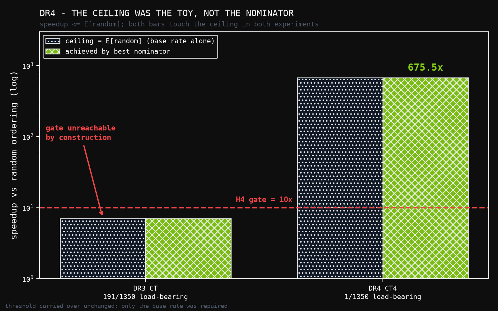
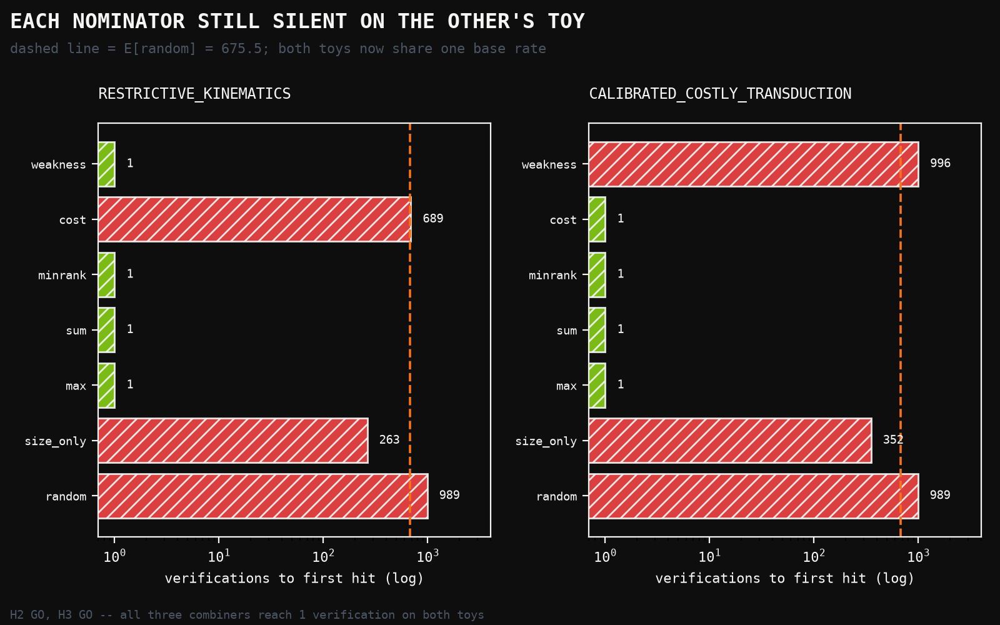

# DR4: Repairing the Instrument Rather Than the Criterion — and Discovering the Criterion Went Coarse

**Human director:** Jawaun Brown
**Producing agent:** Claude Code, directed
**Program:** Deletion-Repair Nomination — DR4
**Status:** H1‴ GO, H2‴ GO, H3‴ GO, H4‴ GO — overall **GO**, with a metric defect reported
**Date:** 2026-07-25

---

## Abstract

DR3 passed three of four gates and failed the fourth on a threshold that was
unsatisfiable by construction. `speedup = expected_random / verifications` with
`verifications ≥ 1`, so speedup is bounded above by `expected_random`, which
depends only on the toy's base rate. DR3's costly toy had a 14% base rate,
capping speedup at 7× against a 10× gate.

DR4 repairs the instrument and carries the threshold over unchanged. The costly
toy's parent budget is tightened from 8 to 1 against commitments of 64, 4 and
2, so that no proper subset of the three costly propositions suffices — all
three must be released together. The base rate falls from 191/1350 to 1/1350,
matching the restrictive toy, and `expected_random` rises to 675.5.

**All four gates pass.** Independence holds (517 candidates with
`cost_relief > 0` and `weakness_gain == 0`). Complementarity holds — `weakness`
wins the restrictive toy and is exactly silent on the costly one
(`tie_fraction = 1.00`); `cost` wins the costly toy and is exactly silent on the
restrictive one. All three combiners reach one verification on both toys. Best
speedup is 675.5× on both, clearing 10×.

**But the GO comes with a defect I am reporting rather than burying.** Fixing
the ceiling made the criterion coarse. With exactly one load-bearing candidate
per toy, speedup is now binary: a nominator that ranks the answer first scores
exactly `expected_random`, and one that does not scores a random draw. There is
nothing in between. The 10× threshold no longer discriminates — it has become a
restatement of "hit@1." DR4's H4‴ is therefore a *pass*, but a weaker test than
DR3's H4″ was intended to be. Section 5 states what a successor must do.

Per the preregistration, a clean sweep opens the date-cut retrodiction. It is
open — with the qualification above attached to it.

---

## 1. What was actually wrong with DR3

DR3's H4″ was not a hard test that the nominators failed. It was an
arithmetically impossible one:

```
speedup_vs_random = expected_random / verifications_to_first_hit
verifications_to_first_hit ≥ 1
⇒ speedup_vs_random ≤ expected_random
```

and `expected_random = (n+1)/(L+1)` for `n` candidates and `L` load-bearing
ones — a property of the toy, not of any nominator. DR3's costly toy had
`L = 191` of `n = 1350`, giving `expected_random = 7.0`. No ordering procedure,
however good, could have exceeded 7×.

The nominators had in fact already reached `verifications = 1` on both toys —
the theoretical optimum. The NO_GO measured my calibration.

DR3's paper named the correct repair: lower the costly toy's base rate, not the
threshold. Two repairs were available and they are not equivalent.

**The cosmetic repair** would be to lower the threshold to 5×. That fits the
data by moving the goalpost, and the program has an explicit rule against it.

**The structural repair** is to change the toy so that fewer deletions qualify.
DR4 takes this one. The threshold is untouched.

---

## 2. The recalibrated toy

DR3's costly toy had a single 64-unit commitment against a budget of 8. Any
deletion containing `sequential_schedule` met the budget, so 191 of 1350
candidates qualified.

DR4's CT4 has three costly propositions —

```
sequential_schedule     64.0
checkpoint_every_step    4.0
sync_barrier             2.0
```

— against a budget of **1.0**. Dropping the two largest still leaves 2 > 1. No
proper subset suffices; the unique load-bearing deletion is the full triple.

Each of the three remains **vacuous as a predicate**: every hypothesis satisfies
it, so deleting any of them leaves the extension identical and
`weakness_gain == 0` exactly. Only the commitment changes. This is the property
DR2 proved unreachable when cost was a minimum over the extension, and it
survives the recalibration intact.

The change is more than an arithmetic convenience. It sharpens the analogy the
toy is meant to carry. The real move in a representational repair is rarely
"drop one thing" — it is drop the constraint *and* discharge whatever the
constraint was silently providing. CT4 now requires releasing an entangled set,
mirroring the entangled facet triple the restrictive toy has had since DR2.

---

## 3. Calibration, measured before the gates were written

This is the step DR3 skipped, and it is the reason DR4 exists.

| toy | candidates | load-bearing | base rate | `E[random]` | 10× needs |
|---|---:|---:|---:|---:|---:|
| RK — restrictive_kinematics | 1350 | 1 | 0.07% | 675.5 | ≤ 67 verifications |
| CT4 — calibrated_costly_transduction | 1350 | 1 | 0.07% | 675.5 | ≤ 67 verifications |

Independence, also measured before freezing:

| toy | `cost>0, weakness=0` | `weakness>0, cost=0` | `both>0` |
|---|---:|---:|---:|
| RK | 0 | 1 | 0 |
| CT4 | **517** | 0 | 0 |

`DR4_PREREGISTRATION.md` was written after this table and before the scored
run. That ordering — calibrate, then freeze gates, then run — is what DR3
inverted.



---

## 4. Results

| nominator | RK verifications | RK speedup | CT4 verifications | CT4 speedup |
|---|---:|---:|---:|---:|
| `weakness` | **1** | 675.5× | 996 *(silent)* | 0.7× |
| `cost` | 689 *(silent)* | 1.0× | **1** | 675.5× |
| `max_disjunction` | **1** | 675.5× | **1** | 675.5× |
| `sum_disjunction` | **1** | 675.5× | **1** | 675.5× |
| `minrank_disjunction` | **1** | 675.5× | **1** | 675.5× |
| `size_only` | 263 | 2.6× | 352 | 1.9× |
| `random` | 989 | 0.7× | 989 | 0.7× |

*(silent)* marks `tie_fraction = 1.00` — the nominator assigns every candidate
the same score and contributes no information. Its verification count is then a
seeded shuffle draw, not a measurement: `weakness`'s 996 on CT4 should be read
as "no signal," not "worse than random."



**H1‴ — independence. GO.** 517 candidates on CT4 have `cost_relief > 0` with
`weakness_gain == 0`. DR2's empty cell stays populated.

**H2‴ — complementarity. GO.** Best single nominator is `weakness` on RK and
`cost` on CT4. Each is exactly silent on the other's toy.

**H3‴ — combiner. GO.** All three combiners reach one verification on both
toys, matching the better single nominator everywhere.

**H4‴ — speedup. GO.** 675.5× on both, against the 10× threshold carried over
unchanged from DR3.

---

## 5. The defect in the repaired gate

The GO is real, but it is worth less than it looks, and the reason is a direct
consequence of the fix.

With `L = 1` load-bearing candidate, a nominator either ranks it first —
scoring `verifications = 1` and therefore exactly `expected_random = 675.5×` —
or it does not, in which case its position is essentially arbitrary. Every
non-degenerate outcome is one of two values. The 10× threshold is cleared by an
enormous margin or missed entirely; there is no regime in which it
discriminates between a good nominator and a mediocre one.

So DR4 traded an *unsatisfiable* gate for a *coarse* one. H4‴ is now
operationally identical to "does the nominator achieve hit@1," and the numeric
threshold is decorative. That is a better failure than DR3's — a coarse test
that passes is more informative than an impossible test that fails — but it is
not the graded speedup measurement the gate was written to be.

The correct successor design is a base rate that is low but not degenerate:
roughly 5–20 load-bearing candidates out of 1350, giving `expected_random`
between 65 and 225. Then `verifications_to_first_hit` can take intermediate
values, speedup becomes graded, and a 10× threshold separates nominators that
rank well from nominators that rank the answer somewhere in the top fifth.
DR4's toys cannot produce that, because the entangled-set construction admits
exactly one qualifying deletion by design.

I did not anticipate this when specifying DR4. Calibrating the base rate
correctly fixed the ceiling and, in the same move, collapsed the metric's
resolution. Recording it here is the same discipline that produced DR4 from
DR3's failure.

---

## 6. What DR4 establishes

On toy systems with authored propositions, authored costs, a fixed vocabulary
`𝔳`, and an exhaustive oracle over `|D| ≤ 3`:

- Cost defined off the extension yields a signal genuinely independent of
  weakness gain — 517 candidates exhibit the case DR2 proved impossible.
- The two signals are complementary: each is the sole informative nominator on
  one toy and exactly silent on the other.
- Disjunctive combiners exploit both without a tuned weight, matching the best
  single nominator on both toys.
- Execution-free nomination locates the load-bearing deletion at rank 1 out of
  1350 on both toys.

What it does not establish, stated as plainly as the above:

- Nothing about real material. Both toys are authored so that the answer exists
  and is findable; `cost` on CT4 is close to a direct readout of the planted
  commitment structure. That is why a GO *opens* the retrodiction rather than
  concluding anything.
- Nothing about vocabulary extension — the known ceiling of the whole
  framework. Every deletion here is over a fixed proposition set.
- Nothing graded about nomination quality, for the reason in §5.

---

## 7. What opens

Per `DR4_PREREGISTRATION.md` §5, a clean sweep of all four gates opens the
**date-cut retrodiction**: run the nominators over a real pre-1905 corpus with
a hard date cut, and ask whether the load-bearing deletion they nominate is the
one the historical record actually made. That has been closed since DR1 and is
now open.

It should be entered with §5's qualification attached. The retrodiction will
have a naturally occurring base rate, not an authored one, so the speedup metric
will be graded there whether or not the toys could produce it. The coarseness is
a property of DR4's instruments, not of the measure.

---

## Appendix: reproduction

```
uv run --no-sync python -m experiments.deletion_repair.run_dr4
```

Local CPU, seconds. Verdict written to
`experiments/deletion_repair/results/dr4_verdict.json`. Gates frozen in
`DR4_PREREGISTRATION.md`, written before the scored run; calibration in §3
measured before the gates. Ties broken by seeded shuffle (`seed = 20260724`),
never by name — the defect DR1 caught in itself.

Figures: `papers/deletion_repair_dr4/figures/build_figures.py`.
