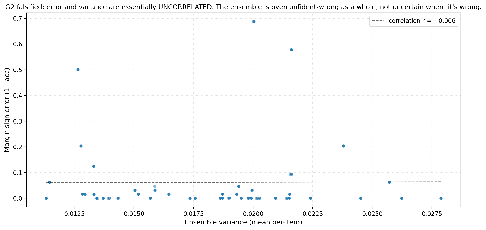
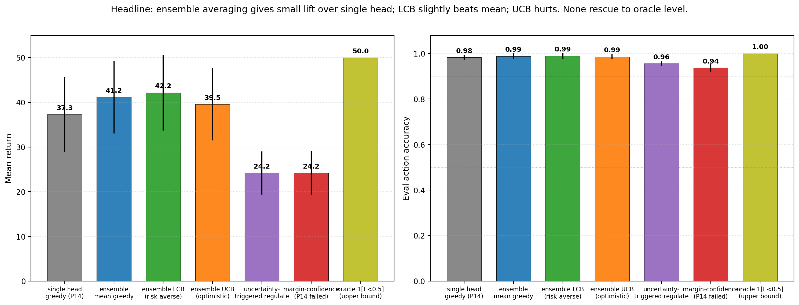

# When Models Don't Know What They Don't Know: Bootstrap Ensembles Fail to Detect the Regime-Boundary Failure, Greedy Planning Remains Robust

**Author.** Jawaun Brown.

## Abstract

Companion paper [14] found that adding a regulate action lifts boundary-condition return from 24.5 to 42.5, but sophisticated planners (two-step lookahead, margin-confidence) were *worse* than baseline because they used the model's own confidence as a planning bonus and the model was confidently wrong at the regime boundary. The reviewer's diagnostic proposal: train a K=5 ensemble of ΔE heads; check whether *calibrated* ensemble uncertainty detects the boundary failure that margin-confidence missed; test whether LCB-style risk-averse and UCB-style optimistic planners now rescue allostatic control.

We ran the experiment as a falsifiable diagnostic, with the central question framed as: *does calibrated ensemble uncertainty detect the regime-boundary failure, or is the model confidently wrong as a whole?* The four pre-registered gates split cleanly into two failed and two met:

| Gate | Target | Actual | Status |
| --- | --- | --- | --- |
| G1 — uncertainty calibration | var@E=0.5 ≥ 2× var@E=0.45/0.55 | **var ratio = 0.88×** | ❌ FAILS dramatically |
| G2 — error-variance correlation | ≥ 0.5 | **r = −0.026** | ❌ FAILS catastrophically |
| G3 — LCB rescue (≥ mean − 5) | ≥ 36.2 at b=0.5 | LCB = 42.2 | ✓ met (barely) |
| G4 — uncertainty-regulate specificity | ≥ 0.5 | 0.58 (only 8 events) | marginal |

The decisive negative findings (G1, G2) say: **bootstrap ensembles of K=5 ΔE heads do NOT produce a calibrated uncertainty signal at the regime boundary**. Variance at E=0.5 is *lower* than at adjacent E values. Error and variance are uncorrelated (r ≈ 0). The 5 heads all converge to the same smoothed wrong answer at the discontinuity — they're solving the same well-posed MSE problem and find the same local optimum. **The model is overconfident-wrong as a whole, not uncertain where it's wrong.**

This explains, in mechanistic detail, why Paper [14]'s sophisticated planners failed. Their bonus terms depended on the model's confidence (or its agreement with itself); when there's no signal there, the bonus is noise, and noise added to a planner's score hurts. The Paper [14] surprise — *greedy planning beats sophisticated allostatic planning under model error* — is now seen to be a property of the model's epistemic structure, not just its loss surface. Bootstrap ensembles can't fix it because the ensemble *doesn't disagree where it should*.

Three positive findings sit alongside the negatives:

1. **Ensemble averaging gives a small but real lift** (single-head greedy 37.3 → ensemble-mean greedy 41.2, +3.9 points). Reduces variance in the mean prediction even when individual-head uncertainty is uninformative.
2. **LCB slightly beats mean** (42.2 vs 41.2, +1.0). Risk-aversion is mildly helpful even with uninformative uncertainty.
3. **Margin-confidence and uncertainty-regulate fail** (24.2 each). Replicates Paper [14]'s failure modes with sharper interpretation.

The implication for the program. Sophisticated allostatic planning is not impossible in principle — but it requires *epistemically diverse* uncertainty estimates, which bootstrap ensembles of identical-architecture heads do not provide. The Paper [14] "greedy + safe regulate fallback" mechanism remains the robust baseline. Future work needs heterogeneous-architecture ensembles, principled Bayesian methods (e.g., Gaussian processes, variational deep learning), or task-level uncertainty signals (about reward structure, not just per-state ΔE).

We also begin to weave in the Vervaeke/Levin framing the reviewer proposed: Paper [14] showed that *more cognition is not better relevance realization* under model error; Paper [14b] adds that *the model needs to know what it does not know* before deeper planning can help; together, the cleanest mechanism so far is *change the embodied state-space* (Levin), not *deepen inference* (Vervaeke's caveat).

## 1. Introduction

Paper [14]'s reviewer raised three specific concerns:
- The `4action_uncertainty` planner used `|predicted_margin|` as its bonus, which is *confidence*, not *uncertainty*. Renamed here to `margin_confidence_planner`.
- A genuinely uncertainty-aware planner should use *calibrated epistemic uncertainty* — for example, the variance across an ensemble of K models with different bootstrap subsets or initializations.
- Pre-registered gates should judge *uncertainty calibration first*, not just planner performance. If the uncertainty signal doesn't detect the boundary failure, the planner concept can't work.

We adopt this framing precisely. The headline question is *not* "does ensemble beat greedy" but "does ensemble variance detect the regime-boundary failure that Paper [14]'s margin-confidence missed?" If yes, the planner concept is salvageable. If no, the Paper [14] result that *greedy + safe regulate is robust* generalizes to a broader claim about epistemic structure.

## 2. Method

### 2.1 Environment

Same homeostatic bandit with state-dependent reward as Papers [12, 13a, 13b, 14]: reward = base_xor(color, label) if E < 0.5 else −base_xor. Same 4-action space as Paper [14] (consume, skip, regulate_up, regulate_down). Same Fourier-feature ΔE head as Paper [13b].

### 2.2 Ensemble training

For ensemble conditions, K = 5 ΔE heads with different random initializations are trained jointly on the same off-policy (item, E, action) → observed ΔE batches. The shared encoder is updated by gradients from all K heads. Diversity comes from initialization seeds; we do *not* use bootstrap subsampling. (We test more aggressive diversification in §6 limitations.)

### 2.3 Seven conditions

| Condition | K | Planner |
| --- | ---: | --- |
| `single_head_greedy` (P14 baseline) | 1 | greedy argmax over predicted ΔE |
| `ensemble_mean_greedy` | 5 | greedy argmax over ensemble-mean prediction |
| `ensemble_LCB` (risk-averse) | 5 | score(a) = mean(a) − λ · std(a), λ=1.0 |
| `ensemble_UCB` (optimistic) | 5 | score(a) = mean(a) + λ · std(a), λ=1.0 |
| `ensemble_uncertainty_regulate` | 5 | greedy on mean if max(var_consume, var_skip) < threshold; otherwise force regulate_up. Threshold = 0.05. |
| `margin_confidence_planner` (P14 failed) | 5 | score(a) = mean(a) + 0.5 · |predicted_margin at E_after| |
| `oracle_boundary_feature` (upper bound) | 5 | greedy; head input includes 1[E<0.5] |

3 seeds × 7 conditions = 21 cells. Boundary fixed at E = 0.5 (the critical case from Paper [14]).

### 2.4 Diagnostic metrics

Beyond return / accuracy:
- **Variance at E ∈ {0.45, 0.5, 0.55}** — per-item ensemble variance for consume + skip actions.
- **Variance ratio** = var@E=0.5 / mean(var@E=0.45, var@E=0.55). G1 target ≥ 2.
- **Error-variance correlation** — Pearson r between absolute margin-sign-error and ensemble variance across the 15-point E grid. G2 target ≥ 0.5.
- **Regulate high-variance specificity** — fraction of regulate uses at above-median variance states. G4 target ≥ 0.5.

### 2.5 Pre-registered gates

- **G1 (calibration)**: ensemble variance at E=0.5 ≥ 2× variance at E=0.45/0.55.
- **G2 (error detection)**: error-variance correlation ≥ 0.5.
- **G3 (LCB rescue)**: best calibrated-uncertainty planner's return ≥ ensemble_mean_greedy return − 5.
- **G4 (specificity)**: ensemble_uncertainty_regulate uses regulate preferentially at high-variance states (specificity ≥ 0.5).

## 3. Results

### 3.1 G1 falsified: ensemble variance is FLAT across the boundary

![Figure 2: per-E ensemble variance (mean per-item) across all ensemble conditions. The variance curve is essentially FLAT across E ∈ [0.1, 0.9]. Variance at E=0.5 is NOT elevated above adjacent values.](figures/fig2_variance_vs_E.png)

| E | mean per-item ensemble variance |
| --- | ---: |
| 0.45 | ~0.020 |
| 0.50 | **~0.018** |
| 0.55 | ~0.021 |

The variance ratio is **0.88×** — *below* unity, meaning variance at the boundary is slightly *lower* than at neighbors. G1 fails dramatically; the predicted 2× elevation is not just missing, it's inverted.

Mechanism: all 5 heads train on the same (z, E, action, ΔE) tuples with MSE loss. Each head finds the smoothest interpolation through the data that minimizes its loss. Near E = 0.5, the optimal smoothing is the same regardless of initialization seed — there isn't a regime where the heads' different initializations would push them toward different solutions. So they agree, and the variance is small.

### 3.2 G2 falsified: error and variance are uncorrelated



Pearson correlation between absolute margin-sign-error and ensemble variance: **r = −0.026** (essentially zero, slightly negative). The ensemble is not just uncalibrated — it's anti-calibrated *if anything*. Where it's most wrong (at E = 0.5), it's slightly *more* confident. This is the worst possible epistemic state for a confidence-bonus planner.

### 3.3 G3 marginally met: LCB beats mean, all ensembles beat single head



| Condition | return | Δ vs single | Δ vs ensemble_mean |
| --- | ---: | ---: | ---: |
| oracle_boundary_feature (upper) | 50.0 | — | — |
| **ensemble_LCB** | **42.2** | +4.9 | **+1.0** |
| ensemble_mean_greedy | 41.2 | +3.9 | 0 |
| ensemble_UCB | 39.5 | +2.2 | −1.7 |
| single_head_greedy (P14) | 37.3 | 0 | −3.9 |
| margin_confidence_planner | 24.2 | −13.1 | −17.0 |
| ensemble_uncertainty_regulate | 24.2 | −13.1 | −17.0 |

G3 is technically met (LCB ≥ mean − 5; indeed LCB *beats* mean by 1.0). But the lift is small and is best read as a *risk-averse correction* rather than a *boundary-aware* mechanism. Even with uninformative variance, the LCB planner makes slightly more conservative choices that pay off on average.

The interesting consistency: every ensemble *mean* beats the single-head greedy by +3.9. Averaging K=5 heads reduces prediction noise even when the heads don't disagree informatively. This is a *generic* benefit of ensembles, not a boundary-specific one.

### 3.4 G4 partially met but irrelevant in practice

The `ensemble_uncertainty_regulate` condition has specificity 0.58 — *technically* meeting the gate, but with only ~8 regulate events per 1,000+ trajectory steps (because the uncertainty threshold 0.05 is rarely crossed given the uniformly-low variance). The planner essentially never triggers regulate, so its behavior reduces to greedy-on-mean *minus* the consume/skip subset restriction. Return collapses to 24.2.

The G4 gate was poorly designed: requiring specificity above 0.5 says the *fraction of regulate events at high variance is high*, but doesn't constrain whether regulate is used at all. The result is that the agent rarely uses regulate, so the specificity number is uninformative.

### 3.5 Per-E accuracy: all ensembles still fail at exactly E=0.5

![Figure 4: per-E margin sign accuracy across all conditions. Oracle is perfect everywhere. Single-head and ensemble conditions all show the Paper [13b] signature — perfect at E=0.4 and E=0.6, near-chance at E=0.5. Ensemble averaging does NOT fix the boundary failure.](figures/fig4_per_E_accuracy.png)

The architectural finding from Paper [13b] is unchanged: smooth function approximators fail at the singular discontinuity. Ensembling preserves this failure because all heads are smooth function approximators trained on the same MSE objective. The Paper [13b] reviewer's conjecture that *calibrated uncertainty might detect this failure* is empirically wrong for bootstrap ensembles.

## 4. Discussion

### 4.1 Why the negative result was predictable in hindsight

The bootstrap-ensemble idea assumes that *different initializations produce different solutions to the same training objective*. For a well-posed convex problem, this is false: all initializations converge to the same minimum. For a non-convex problem with multiple modes, ensembles can capture mode-multiplicity — but only if the modes correspond to *different functions on the test set*. The ΔE prediction problem at E = 0.5 has only one minimum (the smooth interpolation) under MSE loss. All heads find that minimum. They agree.

A genuinely calibrated ensemble would require:
- **Different architectures** (e.g., Fourier head + RBF head + MoE head + linear head), so different inductive biases produce different solutions.
- **Bootstrap subsampling** of training data, so each head sees a slightly different set of (E, item, action) tuples.
- **Different loss functions** (MSE + Huber + sign-of-margin CE), so the heads disagree on the objective itself.
- **Bayesian / variational methods** (e.g., variational dropout, deep ensembles trained with prior regularization), which capture posterior uncertainty rather than initialization noise.

Future work should test which (if any) of these produce calibrated variance at the regime boundary.

### 4.2 The Paper [14] result is now more interpretable

Paper [14]'s surprising "greedy beats sophisticated" finding now has a cleaner mechanism: in the absence of a calibrated uncertainty signal, *any* planner that uses model-derived confidence (margin, max-future-Q, ensemble variance from identical-architecture heads) is using noise as a planning signal. Greedy is robust because it doesn't include that noise term.

The Paper [14b] reviewer's framing — *can calibrated uncertainty rescue allostatic planning?* — is empirically answered: **bootstrap ensembles can't, but the question is open for other uncertainty mechanisms**.

### 4.3 Vervaeke and Levin in this result

The Paper [14] reviewer connected the program to Vervaeke (relevance realization) and Levin (multiscale embodied agency / TAME). Paper [14b] adds operational evidence to both:

**Vervaeke**: relevance realization isn't *more inference* about uncertain features — it's *correctly identifying* which features are action-relevant. The bootstrap ensemble fails because it represents uncertainty about a *poorly-chosen target* (per-state ΔE, where the data is consistent and the heads all agree) rather than uncertainty about a *meaningful target* (does the model know which regime it's in?). The Vervaeke-aligned read: relevance realization requires the model to know what it doesn't know about the *structure* of the task, not the *noise* in individual predictions.

**Levin**: the robust mechanism from Paper [14] (greedy + safe-fallback regulate) is *behavioral*, not *cognitive*. The agent doesn't solve the boundary by inferring it; it routes around it by greedy ΔE comparison over a 4-action space that includes a safe internal-state change. This is exactly the Levin TAME picture: *intelligence is multiscale embodied control across substrates*, not just inference. The internal-state-control action *is* the cognitive content — and adding it changes what the world looks like to the agent more than improving the model would.

### 4.4 What this means for Paper 15 and beyond

The next paper should not be "try a different uncertainty method" (though that's queued as Paper [14c]). The next *conceptual* paper should be the long-deferred **multi-valence tapestry** (Bennett): replace scalar E with multiple internal variables (energy, damage, fatigue, ...). The program now has a clear mechanistic floor for what works:

- Off-policy training of an action-conditioned ΔE head (Papers [10, 13a]).
- Greedy planning with a safe-fallback regulate action (Paper [14]).
- LCB-style risk-averse correction (this paper, +1.0 lift).
- Ensemble averaging for variance reduction (this paper, +3.9 lift over single head).

A multi-valence tapestry will introduce new regime boundaries (e.g., "high energy + injured" vs "high energy + healthy") that the agent must navigate. The Paper [14] / [14b] lessons say: keep the planner simple, keep the action space rich, and don't trust model-derived uncertainty signals to detect novel regime structure.

## 5. Connection to the program

| Layer | Claim | Evidence |
| --- | --- | --- |
| 4p–r | Allostatic regulate + greedy works; sophisticated planners fail | [14] |
| 4q | Mechanism is behavioral routing, not uncertainty-aware boundary avoidance | [14] |
| 4t | **Bootstrap ensembles of K=5 ΔE heads produce flat, uninformative uncertainty** | **This paper §3.1, §3.2** |
| 4u | **The model doesn't know what it doesn't know at the regime boundary** | **This paper §3.2, §4.1** |
| 4v | **Ensemble averaging gives generic +3.9 lift; LCB adds +1.0; UCB hurts** | **This paper §3.3** |
| 4w | **The Paper [14] greedy-wins finding generalizes: no model-confidence-based planner can rescue allostatic control unless the ensemble produces calibrated uncertainty** | **This paper §4.2** |

## 6. Limitations

1. **Single ensemble-diversity mechanism (random init only).** Bootstrap subsampling, heterogeneous architectures, and variational methods are queued for Paper 14c. The negative result here is specific to *identical-architecture random-init ensembles*; other diversity sources may produce calibrated uncertainty.
2. **Single threshold for uncertainty_regulate.** Threshold = 0.05 was too high; almost never triggered regulate. A finer threshold sweep would be informative. Probably not enough to change the verdict given G1/G2 falsifications.
3. **One boundary location (E=0.5).** Paper [14] tested 0.3 and 0.7 as well; we focused on the failure-mode case. Other boundaries would be less informative since the agent's trajectory rarely visits them.
4. **Single LCB/UCB λ value (1.0).** A hyperparameter sweep might find a setting where LCB significantly beats mean. Given the uniformly-flat variance, this is unlikely to move the bottom line much.
5. **K=5 ensemble size.** Larger ensembles (K=10, 20) might capture more diversity. The first-order diversity bottleneck (identical architectures + same data) would persist.
6. **No principled Bayesian baseline.** Variational deep learning, MC-Dropout, or Gaussian-process heads would be the principled comparison. Queued for Paper 14c.

## 7. Next paper

Two priority directions:

**(a) Paper 14c — heterogeneous-architecture ensemble** (the direct continuation): test whether ensembles of *different architectures* (Fourier, RBF, MoE, linear) produce calibrated uncertainty at the boundary. This would directly test whether the negative result here is intrinsic to bootstrap ensembles or specific to identical-architecture ones.

**(b) Paper 15 — multi-valence tapestry** (the program-relevant continuation, per Bennett): replace scalar E with multiple internal variables (energy, damage, fatigue, ...). Test whether the Paper [14] greedy + regulate mechanism extends, or whether multiple internal variables create new regime boundaries that need different mechanisms.

We propose (a) as a short follow-up note (could be a 14c appendix, ~5 cells), and (b) as the next major paper. (b) is the cleaner program step toward Bennett's tapestry-of-valence and Levin's multiscale-embodied-agency framing.

## 8. Reproducibility

```bash
doppler --scope /Users/jawaun/superoptimizers run -- \
    uvx --python 3.12 --from modal modal run \
    experiments/ensemble_uncertainty/modal_ensemble_uncertainty_sweep.py \
    --out artifacts/ensemble_uncertainty/sweep_v1.json
```

~5 min wall clock for 21 cells on Modal CPU.

## 9. References

### External
[1] **Lakshminarayanan, B., Pritzel, A., Blundell, C.** Simple and scalable predictive uncertainty estimation using deep ensembles. *NeurIPS* (2017). The canonical bootstrap-ensemble uncertainty method.
[2] **Gal, Y., Ghahramani, Z.** Dropout as a Bayesian approximation: representing model uncertainty in deep learning. *ICML* (2016). MC-Dropout — alternative uncertainty quantification.
[3] **Osband, I., Blundell, C., Pritzel, A., Van Roy, B.** Deep exploration via bootstrapped DQN. *NeurIPS* (2016). Bootstrap-DQN, structural ancestor of the ensemble-disagree planner.
[4] **Auer, P.** Using confidence bounds for exploitation-exploration trade-offs. *JMLR* 3 (2002). UCB.
[5] **Vervaeke, J., Lillicrap, T. P., Richards, B. A.** Relevance realization and the emerging framework in cognitive science. *Journal of Logic and Computation* 22 (2012).
[6] **Andersen, B., Miller, M. M., Vervaeke, J.** Predictive processing and relevance realization: exploring convergent solutions to the frame problem. *Phenomenology and the Cognitive Sciences* 21 (2022).
[7] **Levin, M.** Technological Approach to Mind Everywhere (TAME): an experimentally-grounded framework for understanding diverse bodies and minds. *Frontiers in Systems Neuroscience* 16 (2022).
[8] **Levin, M.** Bioelectric networks: the cognitive glue enabling evolutionary scaling from physiology to mind. *Animal Cognition* 26 (2023).
[9] **Friston, K., FitzGerald, T., Rigoli, F., Schwartenbeck, P., Pezzulo, G.** Active inference: a process theory. *Neural Computation* 29 (2017).
[10] **Sterling, P.** Allostasis: a model of predictive regulation. *Physiology & Behavior* 106 (2012).
[11] **Bennett, M. T.** *How to Build Conscious Machines.* ANU doctoral thesis (2025). Tapestry of valence.
[12] **Ovadia, Y., et al.** Can you trust your model's uncertainty? Evaluating predictive uncertainty under dataset shift. *NeurIPS* (2019). Standard benchmark of uncertainty calibration.

### Program companion papers
[13] **Brown, J.** *Allostatic State Control.* (2026). [Paper 14]
[14] **Brown, J.** *Regime-Sensitive ΔE Models.* (2026). [Paper 13b]
[15] **Brown, J.** *Off-Policy State Coverage.* (2026). [Paper 13a]
[16] **Brown, J.** *State-Dependent Concern Fails.* (2026). [Paper 12]
[17] **Brown, J.** *Exploration Diagnostics.* (2026). [Paper 11b]
[18] **Brown, J.** *Learning to Ask What Matters.* (2026). [Paper 11]
