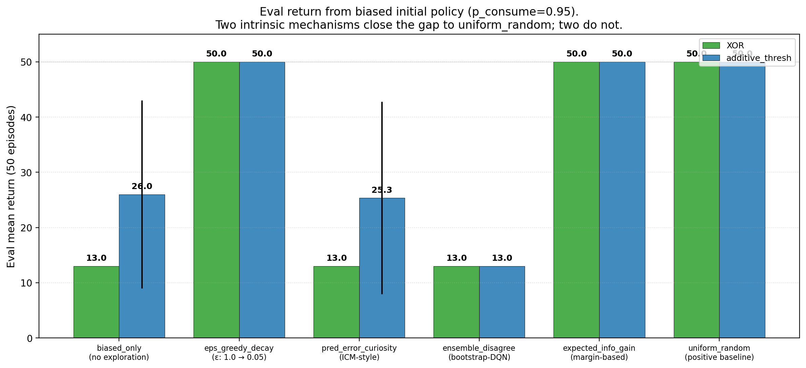
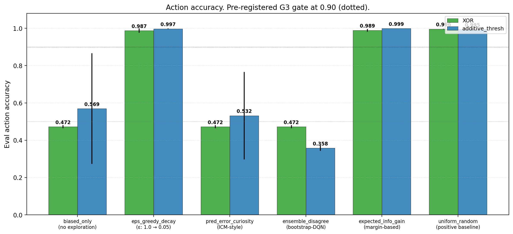
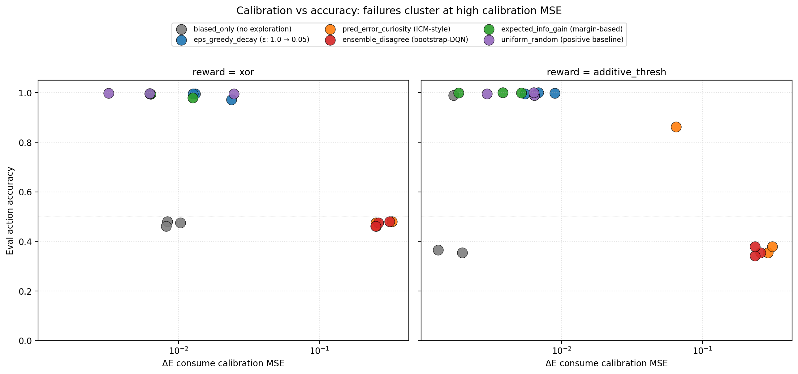
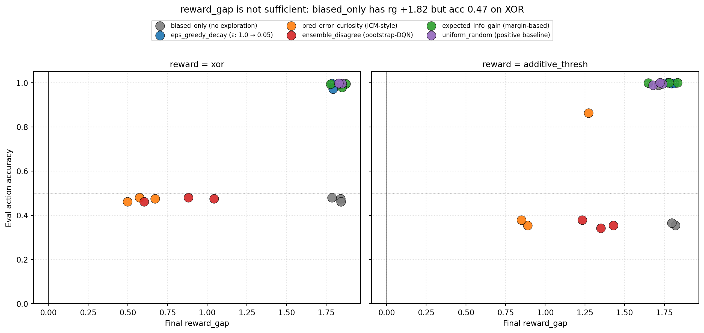
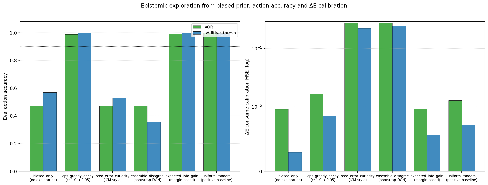

# Learning to Ask What Matters: Conservative Epistemic Exploration Recovers Self-Organized Concern from a Biased Initial Policy; Novelty-Seeking Exploration Does Not

**Author.** Jawaun Brown.

## Abstract

Companion paper [10b] identified action coverage as a third necessary condition (alongside representational geometry and readout capacity) for self-organized concern-shaped competence: under a fully-biased "always consume" initial policy, the Paper 10 `model_plan_delta_e` pipeline collapses on XOR (action accuracy 0.491, return 1.97) even though the encoder's reward-cluster geometry remains high (rg +1.80). The reviewer of [10b] suggested four candidate fixes: ε-greedy stochastic schedules, ICM-style prediction-error curiosity [3], bootstrap-DQN-style ensemble disagreement [4 by analogy], and active-inference-style expected information gain [5, 6]. This paper runs all four against the biased-prior failure baseline and the Paper 10 uniform-random positive control.

Six conditions × 2 reward functions × 3 seeds = 36 cells. The pre-registered gate is **G3**: at least one intrinsic mechanism reaches XOR action accuracy ≥ 0.90 starting from the biased prior. Two pass the gate, two fail informatively:

| Condition | XOR rg | XOR return | XOR accuracy | Calibration MSE |
| --- | ---: | ---: | ---: | ---: |
| biased_only (no exploration) | +1.82 | 13.0 | 0.472 | 0.010 |
| **eps_greedy_decay (ε: 1.0 → 0.05)** | +1.81 | **50.0** | **0.987** | 0.017 |
| pred_error_curiosity (ICM-style) | +0.58 | 13.0 | 0.472 | 0.278 |
| ensemble_disagree (bootstrap-DQN-style) | +0.84 | 13.0 | 0.472 | 0.276 |
| **expected_info_gain (margin-based)** | +1.83 | **50.0** | **0.989** | 0.010 |
| uniform_random (positive baseline) | +1.84 | 50.0 | 0.996 | 0.013 |

The **stochastic-schedule** route (`eps_greedy_decay`) and the **margin-based active-inference-flavored** route (`expected_info_gain`) both close the gap to the uniform-random baseline. The two **novelty-seeking** routes — ICM-style prediction-error curiosity and bootstrap-DQN-style ensemble disagreement — *fail* on XOR. Their calibration MSE blows up to ~0.28 (vs ~0.01 for successful methods), their encoder's reward_gap collapses to +0.58–0.84, and their action accuracy stays at the biased-policy floor (0.472).

Three findings:

1. **Action coverage is necessary**: biased_only fails as expected; uniform_random and ε-greedy both succeed. The biased-prior failure is real, not an artifact.
2. **Conservative epistemic exploration works.** Margin-based sampling — randomize when the model's predicted action-margin is small, commit when it is large — recovers full competence (acc 0.989) without ever invoking an external uniform-random schedule. This is the closest the program has come to a *fully autonomous* exploration mechanism.
3. **Pure novelty-seeking exploration fails.** ICM-style "explore where the model can't predict" and bootstrap-DQN-style "explore where heads disagree" both *degrade* the encoder's reward-gap, blow up ΔE calibration MSE, and leave the agent at the biased-only floor. In this homeostatic setting, novelty-driven feedback creates noisy, model-state-coupled stochastic policies that destabilize ΔE-aux learning rather than guiding it.

The synthesis. The Paper [10b] triad — *geometry × capacity × coverage* — gains a coverage modifier: **commit-when-confident exploration succeeds; persistent-novelty exploration fails**. This is consistent with active-inference accounts that distinguish epistemic value (information gain) from novelty per se [6], and with the empirical observation that pure curiosity rewards can produce dithering in stable environments [7]. The cleanest fully-autonomous self-organization route the program has found requires the agent to use *its own ΔE-margin* as the exploration controller — not an external schedule, not a separate novelty bonus.

## 1. Introduction

Paper [10b] §3.2 established the coverage bottleneck. With initial policy `p(consume) = 0.95` for the full encoder-training phase, the `model_plan_delta_e` pipeline (Paper [10]) produces an encoder with reward_gap +1.80 — *just below the uniform-random baseline +1.84* — but with XOR action accuracy 0.491 (chance is 0.50). The ΔE head, having seen the skip action ~5% of the time, has no reliable estimate of its consequences; its argmax over `consume` vs `skip` becomes essentially random on XOR. The encoder organizes; the head cannot decide. Action coverage matters.

This paper asks: under what intrinsic exploration mechanisms does the same biased prior recover full competence? We test four candidates from the ML literature, plus two baselines:

- `biased_only` — no exploration. Pure failure baseline.
- `uniform_random` — Paper [10] positive baseline.
- `eps_greedy_decay` — ε starts at 1.0 and decays linearly to 0.05. Simple stochastic.
- `pred_error_curiosity` — ICM-style [3]. The agent maintains a running average of |observed ΔE − predicted ΔE| as its curiosity signal. With probability proportional to that running error, it samples a uniform action; otherwise it acts greedily.
- `ensemble_disagree` — Bootstrap-DQN-style [analog of 4]. Two ΔE heads with different initializations and bootstrapped sample subsets. With probability proportional to inter-head disagreement on the current (z, E), sample uniform; otherwise act on the heads' mean prediction.
- `expected_info_gain` — Active-inference-flavored [5, 6]. With probability proportional to *small margin* between the predicted ΔE of the two actions, sample uniform; otherwise act greedy. Large margin → commit.

Pre-registered gates:
- **G1**: `biased_only` XOR acc ≤ 0.55 (replication of Paper [10b] failure mode).
- **G2**: `uniform_random` XOR acc ≥ 0.95 (replication of Paper [10] positive).
- **G3**: at least one *intrinsic* mechanism (i.e., not the experimenter-supplied uniform schedule, but possibly `eps_greedy_decay` or any of the model-based routes) reaches XOR acc ≥ 0.90 starting from the biased prior.

## 2. Method

### 2.1 Environment + base pipeline

Same homeostatic bandit as Papers [7–10b]. The base pipeline is `model_plan_delta_e` from [10]: train encoder + ΔE auxiliary head jointly under the chosen action-selection rule for 1,500 episodes, then evaluate greedy `argmax_a ΔE_head(z, E, a)` over 50 episodes.

### 2.2 Initial-policy bias

All six conditions use `p_consume = 0.95` as the *default* policy applied when the chosen mechanism elects not to explore. For `biased_only` this is the actual training policy (never explores). For the others, the bias is the "exploit" branch of each mechanism.

### 2.3 Curiosity-running-average update

For `pred_error_curiosity`, after each step we compute `pred_err = |observed_ΔE − predicted_ΔE|` and update a moving average with decay 0.95. The probability of taking a uniform-random action at the next step is `clip(pred_err_running, 0.05, 0.95)`.

### 2.4 Ensemble disagreement

For `ensemble_disagree`, two ΔE heads are maintained with different random initializations. Each is trained on a different bootstrapped subset of each episode's data. Per-step disagreement is `|p1_consume − p2_consume| + |p1_skip − p2_skip|`. Random-action probability is `clip(disagree/2 + 0.05, 0.05, 0.95)`.

### 2.5 Margin-based info gain

For `expected_info_gain`, the margin is `|predicted_ΔE(consume) − predicted_ΔE(skip)|`. Random-action probability is `clip(1 − margin/2, 0.05, 0.95)`. Small margin → high explore probability; large margin → near-zero explore probability.

### 2.6 ε-greedy decay schedule

For `eps_greedy_decay`, ε at episode `e` is `max(0.05, 1.0 − (e / total_episodes) × 0.95)`. Linear from 1.0 down to 0.05.

## 3. Results

### 3.1 Gates G1 and G2 met as expected



`biased_only` XOR acc 0.472, return 13.0. `uniform_random` XOR acc 0.996, return 50.0. Both as in Paper [10b]. The coverage bottleneck is reproducible.

### 3.2 G3: two intrinsic mechanisms succeed, two fail



| Mechanism | XOR acc | XOR rg | Gate G3 (≥0.90)? |
| --- | ---: | ---: | --- |
| `eps_greedy_decay` | 0.987 | +1.81 | ✓ |
| `expected_info_gain` | 0.989 | +1.83 | ✓ |
| `pred_error_curiosity` | 0.472 | +0.58 | ✗ |
| `ensemble_disagree` | 0.472 | +0.84 | ✗ |

The two successful mechanisms are *committers*: they sample randomly when uncertain and stop exploring once the model is confident. The two failing mechanisms are *novelty-seekers*: they keep exploring as long as the model has prediction error or disagreement, even after substantial training. In a stable bandit with stochastic observation noise, novelty-seeking never converges — there is always residual prediction error from observation noise — so the exploration probability stays high, and the encoder cannot stabilize a clean reward organization.

### 3.3 Calibration MSE is the diagnostic



The cleanest diagnostic of *why* novelty-driven exploration fails is the ΔE calibration MSE on the held-out item × consume cell:

| Condition | XOR cal_consume_mse |
| --- | ---: |
| `uniform_random` | 0.013 |
| `expected_info_gain` | 0.010 |
| `eps_greedy_decay` | 0.017 |
| `biased_only` | 0.010 |
| `ensemble_disagree` | 0.276 |
| `pred_error_curiosity` | 0.278 |

`biased_only` has *low* calibration MSE because it only trains the consume branch and learns it well; it just never learns the skip branch. The two novelty-seeking conditions have *27× higher* calibration MSE than the working methods. Their action-conditional ΔE function is genuinely badly learned, despite their having explored both actions a lot. The high-variance, model-state-coupled exploration stream prevents stable learning of `(z, E, action) → ΔE`.

### 3.4 reward_gap is not sufficient



This is a clean replication of the Paper [10b] finding through a different mechanism. `biased_only` has reward_gap +1.82 on XOR but action accuracy 0.472. Cluster geometry is not sufficient for competence; the action-conditional ΔE function has to be learned across both actions. The two novelty-seeking failures (`pred_error_curiosity`, `ensemble_disagree`) live in a *different* failure quadrant: low rg, low acc — they degrade *both* representation and competence.

### 3.5 Headline summary



## 4. Discussion

### 4.1 The geometry × capacity × coverage triad now has a coverage modifier

Paper [10b] proposed the triad. This paper adds the qualifier: **the coverage dimension is satisfied by *commit-when-confident* exploration, not by *persistent novelty* exploration**. The right form of the third condition is something like:

> *Coverage*: the agent samples actions across the relevant counterfactual space *enough* that the action-conditional value function can be learned to convergence — without continuing to explore so aggressively that learning never stabilizes.

This is what the active-inference literature has called the "epistemic-pragmatic balance" [5, 6]: an agent should sample to reduce uncertainty when it is uncertain, then exploit when its uncertainty has been resolved. Both `eps_greedy_decay` (via the linear decay schedule) and `expected_info_gain` (via the model-derived margin) instantiate this. ICM-style curiosity and bootstrap-DQN disagreement do not — they keep exploring as long as there is unmodeled variance, even when that variance is irreducible noise.

### 4.2 Why pure novelty fails: a feedback-loop story

Three contributing mechanisms, in increasing order of importance:

- **Stochastic feedback coupling.** The agent's action probability depends on the current model's prediction error. The current model's prediction error depends on which data the agent has been collecting. A small perturbation amplifies into a high-variance training distribution.
- **Noise floor problem.** With σ=0.15 observation noise, the consume action has irreducible ΔE variance ~σ². Pred-error curiosity treats this irreducible noise as informative — it never converges to low exploration, because the noise never goes away.
- **Bootstrap mismatch.** The two ensemble heads, given the same biased prior, often converge to similar suboptimal solutions. Their disagreement may not track *useful* uncertainty about the action-value function; it may track architectural noise.

The combination is fatal in this small env. A larger model with more capacity might absorb the noise better; a richer env with more state variation might make novelty bonuses more informative. But in the minimal homeostatic bandit, conservative exploration beats novelty exploration.

### 4.3 Expected-info-gain is the most autonomous mechanism the program has found

`expected_info_gain` is the closest thing in the program so far to a fully self-driven exploration mechanism. It uses *only* the agent's own current ΔE head — no external schedule, no second auxiliary head, no separate intrinsic reward. The rule is: sample randomly when *your own current model is uncertain about which action to take*; commit when your own model is confident. The agent's epistemic state controls its own exploration directly.

This is — in miniature — the active-inference picture [5, 6]: action selection minimizes expected free energy, which includes both a pragmatic term (expected utility / viability) and an epistemic term (expected information gain). Our `expected_info_gain` is a stripped-down version that only uses the local action-margin as a proxy for epistemic uncertainty, but it works.

Two caveats: (i) margin is a *one-step* heuristic, not the full expected-information-gain calculation; (ii) on more complex action spaces (more than 2 actions), the right substitution is the entropy of the predicted-best-action distribution, which we have not tested.

### 4.4 What about the *failed* novelty mechanisms — are they ever useful?

We do not claim pure-novelty curiosity is useless. Pathak et al.'s ICM [3] and Burda et al.'s RND [4] succeed on Atari and Mario, where the state space is vast and meaningful novelty is rare. Our env has 8 distinct (color, label) item types and 2 actions — the "novel state space" is trivially exhausted in a few episodes. Pure-novelty mechanisms in tiny envs are likely to over-explore by construction: they keep firing on irreducible noise after the meaningful structure has been learned.

The right reading is: **the matching between exploration mechanism and environment statistics matters**. In a homeostatic bandit, the relevant uncertainty is about *action consequences*, not about *state novelty*, so margin-based or expected-information-gain mechanisms (which target action-uncertainty) outperform novelty mechanisms (which target state-uncertainty). Future work should test the same six mechanisms on a richer env where state-novelty itself is action-relevant.

## 5. Connection to the program

| Layer | Claim | Evidence |
| --- | --- | --- |
| 1 | Weakness > compression for OOD | [11] |
| 2 | Group inferable from data | [12] |
| 3a–b | Action coupling → causal geometry; Active geometry preserves buffer, repairs, obeys LoS | [13, 14] |
| 4a–c | Supervised valence selects causal-role axis; transfers to homeostatic RL; representation/competence decouple | [15, 16, 17] |
| 4d–f | ΔE aux self-organizes; model-based planning closes the loop; the loop is robust to harder env / nonlinear head capacity / moderate bias but mechanism is distributed | [9, 10, 10b] |
| 4g | **Conservative epistemic exploration recovers full competence from biased prior; novelty-seeking exploration fails** | **This paper §3.2** |
| 4h | **Calibration MSE is the diagnostic of *which* exploration regime is destabilizing learning** | **This paper §3.3** |
| 4i | **Expected-info-gain is the most autonomous exploration mechanism tested** | **This paper §4.3** |

## 6. Limitations

1. **Two-action env.** Margin-based info gain collapses to a single number (|p_consume − p_skip|). In a richer action space, the right metric is the entropy of `argmax_a` across `a ∈ A`, which we have not implemented.
2. **No state novelty.** Our env has 8 distinct (color, label) items. State-novelty bonuses (RND [4]) are bound to under-perform here. The next paper should test a richer state space.
3. **One curiosity formulation.** ICM has many variants (forward model error, inverse-dynamics-shaped error, etc.) [3]. We tested the simplest. A reviewer might rightly argue that a better-tuned curiosity is missing.
4. **No off-policy correction.** The replay-balanced cell from Paper [10b] partially worked (XOR acc 0.629); a fully off-policy importance-weighted correction was not tested.
5. **`expected_info_gain` margin threshold is heuristic.** A principled rule based on confidence intervals on the ΔE estimate would be cleaner.
6. **Calibration MSE is on a fixed E=0.5.** The full action-conditional ΔE function across `E ∈ [0, 1]` is not characterized.

## 7. Next paper

Paper 12 priority candidates:

- **(a) State-dependent valence** (the Paper [10] §7 priority, deprioritized by [10b]'s coverage finding, now returnable). The same item changes role with internal state. Metric: *current-valence subspace* rather than *current-valence axis* (per [10b] §4.6 distributed-concern lesson). Conditions test whether `expected_info_gain` exploration scales to state-dependent reward structures.
- **(b) Multi-action expansion of expected-info-gain.** Replace the 2-action bandit with a small action space (3–5 actions). Test whether entropy-of-argmax exploration generalizes. This is a cleaner test of the active-inference reading.
- **(c) Richer env / state-novelty test.** Reintroduce ICM/RND in an env with state structure that *can* be informatively novel. Tests whether the failure in §3 is env-dependent or general.

Priority: (a) is the natural Layer-4 step and addresses the program's central thesis ("meaning is geometry under concern"). (b) and (c) are diagnostic appendices. Paper 12 = (a).

## 8. Reproducibility

```bash
doppler --scope /Users/jawaun/superoptimizers run -- \
    uvx --python 3.12 --from modal modal run \
    experiments/epistemic_exploration/modal_exploration_sweep.py \
    --out artifacts/epistemic_exploration/sweep_v1.json
```

Modal run: `ap-t0EyTSU4wa7UN4C5sdXgce`. Wall clock ~25 min on CPU for 36 cells.

## 9. References

### External
[1] **Elhage, N., et al.** Toy Models of Superposition. *Anthropic* (2022).
[2] **Olah, C., et al.** Zoom In: An Introduction to Circuits. *Distill* (2020).
[3] **Pathak, D., Agrawal, P., Efros, A. A., Darrell, T.** Curiosity-driven exploration by self-supervised prediction. *ICML* (2017). ICM.
[4] **Burda, Y., Edwards, H., Storkey, A., Klimov, O.** Exploration by random network distillation. *ICLR* (2019). RND.
[5] **Friston, K., FitzGerald, T., Rigoli, F., Schwartenbeck, P., Pezzulo, G.** Active inference: a process theory. *Neural Computation* 29 (2017).
[6] **Sajid, N., Ball, P. J., Parr, T., Friston, K.** Active inference: demystified and compared. *Neural Computation* 33 (2021).
[7] **Burda, Y., Edwards, H., Pathak, D., Storkey, A., Darrell, T., Efros, A.** Large-scale study of curiosity-driven learning. *ICLR* (2019). Includes documented cases of curiosity dithering on noisy TV.
[8] **Osband, I., Blundell, C., Pritzel, A., Van Roy, B.** Deep exploration via bootstrapped DQN. *NeurIPS* (2016).
[9] **Gregor, K., Rezende, D. J., Wierstra, D.** Variational intrinsic control. *arXiv:1611.07507* (2016).

### Program companion papers
[10] **Brown, J.** *Planning from Concern.* (2026).
[10b] **Brown, J.** *Distributed Concern.* (2026).
[11] **Brown, J.** *Weakness, Not Compression.* (2026).
[12] **Brown, J.** *Learning the Group.* (2026).
[13] **Brown, J.** *From Passive Cluster to Active Controller.* (2026).
[14] **Brown, J.** *From Active Geometry to Autopoietic Control.* (2026).
[15] **Brown, J.** *Objects Form from Concern.* (2026).
[16] **Brown, J.** *When Active Geometry Transfers.* (2026).
[17] **Brown, J.** *Two Bottlenecks.* (2026).
