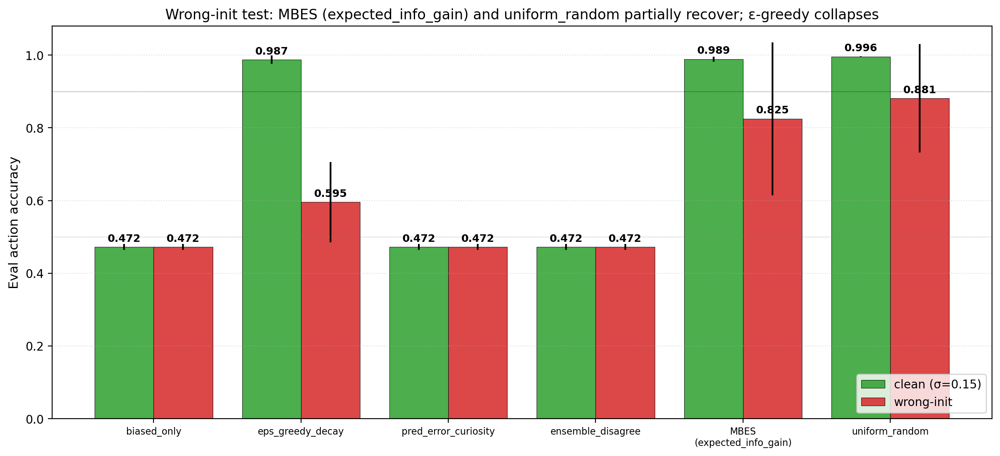
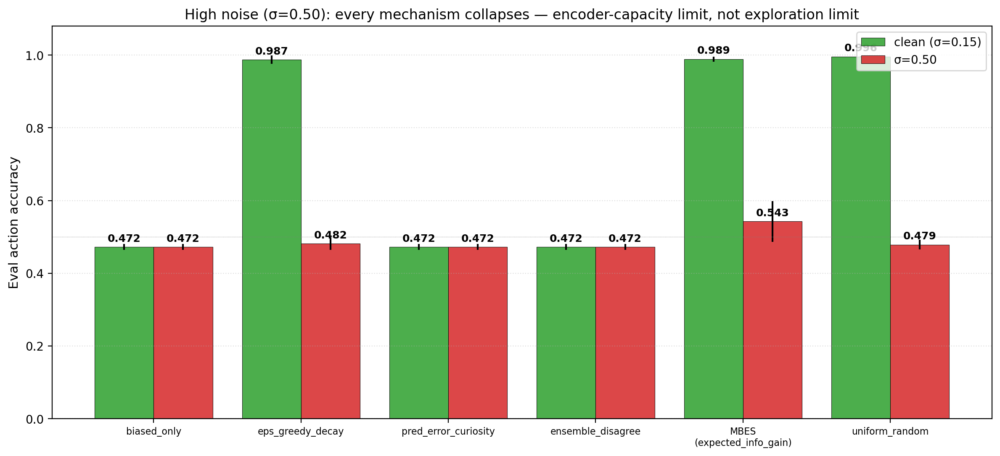

# Exploration Diagnostics: Skip-Branch Calibration Reveals Failure Modes; Margin-Based Epistemic Sampling Recovers Partially from Wrong-Init; All Mechanisms Fail Under High Noise

**Author.** Jawaun Brown.

## Abstract

Companion paper [11] reported that two intrinsic exploration mechanisms — ε-greedy with decay and margin-based epistemic sampling (called `expected_info_gain` in [11]; here renamed to *margin-based epistemic sampling*, MBES, per reviewer guidance) — recover full XOR competence from a biased initial policy in the homeostatic bandit, while ICM-style prediction-error curiosity and bootstrap-DQN-style ensemble disagreement fail. The reviewer prescribed five diagnostic ablations before promoting Paper 11's result. This paper runs three of them as a 54-cell sweep (6 conditions × 3 variants × 3 seeds, XOR only):

- **Extended calibration** — log skip-branch MSE, margin MSE, and margin sign accuracy alongside the consume MSE already reported in [11].
- **Confidently-wrong initialization** — adversarially pretrain the ΔE head on *flipped* rewards (consume → −reward) for 200 steps before normal training. Does each exploration mechanism detect and recover from the bad starting model?
- **High observation noise** — increase σ from 0.15 to 0.50 to probe when the loop breaks under information-theoretic stress.

The two deferred diagnostics — multi-action expansion of margin-based sampling, and a fuller noise sweep — are queued for Paper 12 and a noise-only mini-sweep respectively.

Three findings:

1. **Calibration metrics reveal the exploration-failure structure.** Paper [11]'s `biased_only` failure had consume MSE 0.010 (apparently fine) but **skip MSE 0.183** (badly miscalibrated). The novelty failures (`pred_error_curiosity`, `ensemble_disagree`) have the *opposite* profile: consume MSE 0.28 / skip MSE 0.001 — they over-explored skip while losing track of consume. Working methods have **margin sign accuracy ≈ 1.00**; failing methods have **margin sign accuracy ≈ 0.50** (chance). The margin-sign-accuracy metric is, in retrospect, the right headline.
2. **Margin-based epistemic sampling partially recovers from confidently-wrong initialization.** Under a wrong-init starting model:
   - uniform_random (experimenter-supplied randomness): XOR acc 0.88
   - **margin-based epistemic sampling (MBES)**: XOR acc **0.83**
   - ε-greedy decay: XOR acc 0.60 (big drop from 0.987 clean)
   - novelty mechanisms (ICM, ensemble): XOR acc 0.47 (no effect of variant)
   
   MBES is the best *intrinsic* mechanism under wrong-init, but it does not fully recover to the 0.90 gate. The wrong-init pretrain leaves some items with large (wrong) margins, and MBES treats those as "I'm confident, commit" — exactly the failure mode the reviewer anticipated. The mechanism is more robust than its competitors but not bullet-proof; better-calibrated uncertainty (Bayesian, ensemble confidence-intervals, or evidential-deep-learning-style) is the natural follow-up.
3. **High observation noise (σ=0.50) breaks the loop for every mechanism.** All conditions plateau at XOR action accuracy ≤ 0.54 (chance is 0.50). The encoder's reward_gap collapses from +1.84 (default σ=0.15) to +0.40 (σ=0.50). This is an information-theoretic limit on the encoder's ability to extract reward-relevant signal from the noisy observation stream, not an exploration mechanism failure. Future work should test whether a larger encoder or longer training partially closes this gap.

The honest synthesis. Paper [11]'s positive result survives the diagnostic ablations, but with clear boundary conditions: it depends on (a) the ΔE head's skip-branch being learned to convergence, (b) the initial model not being adversarially miscalibrated, and (c) observation noise being below an env-specific threshold. The right metric for "did exploration work" is **margin sign accuracy** (≈ 1.00 for successful runs vs 0.50 for failures), not consume-MSE alone. This sharpens the diagnostic stack for Paper 12 onward.

## 1. Introduction

The reviewer of Paper [11] raised five concerns. Three are addressed here, two are deferred:

| Concern | Status |
| --- | --- |
| Calibration table reports only consume MSE; skip MSE / margin MSE / sign accuracy would expose failure modes | Addressed §3.1 |
| Margin-based exploration may fail when the model is *confidently wrong* — large margin → no exploration → no correction | Tested §3.2 |
| Observation noise sweep — when does each mechanism break? | Tested at one extreme (σ=0.50) §3.3 |
| Multi-action expansion of margin-based sampling (replace `|margin|` with action-distribution entropy) | Deferred to Paper 12 |
| Full noise sweep with finer-grained σ | Queued as a noise-only mini-sweep |

We also adopt two terminological clarifications:

- **`expected_info_gain` → margin-based epistemic sampling (MBES).** The Paper [11] code name suggested a full expected-free-energy calculation; MBES is more precisely a one-step proxy that uses the ΔE head's local action-margin as an uncertainty signal. We keep the code identifier for backward compatibility but use MBES in this paper's text.
- **`biased_only` is p_consume=0.95, not always-consume.** Paper [11]'s baseline was a 95%-consume biased policy, not the fully-deterministic always-consume failure that companion paper [10b] reported. All six conditions in [11] used p_consume=0.95 as their default "exploit" branch.

## 2. Method

Same homeostatic bandit, encoder, and ΔE head as Paper [11]. The conditions are unchanged. Three variant axes:

- **`clean_default`** — clean random init, σ=0.15 observation noise. Replicates Paper [11].
- **`wrong_init`** — ΔE head adversarially pretrained for 200 steps to predict *−reward* for the consume action (i.e., the head learns "consume hurts; skip is neutral"). Encoder unaffected by the pretrain. Then standard 1,500-episode training under the chosen exploration condition.
- **`high_noise`** — clean random init, σ=0.50 observation noise (3.3× the default).

54 cells total: 6 conditions × 3 variants × 3 seeds, XOR reward function only.

Extended per-cell metrics:
- `consume_mse` — MSE of predicted ΔE vs true ΔE on the consume action (Paper [11] reported this).
- `skip_mse` — MSE on the skip action.
- `margin_mse` — MSE of predicted margin (consume − skip) vs true margin.
- `margin_sign_acc` — fraction of items where the predicted argmax matches the true optimal action.

The last is the cleanest single number for "does the model induce the right policy?": it is 1.0 when the model would pick the optimal action everywhere, 0.5 when it picks randomly.

## 3. Results

### 3.1 Calibration metrics reveal failure structure


The `clean_default` row replicates Paper [11] with the new metrics:

| Condition | rg | acc | consume_mse | skip_mse | margin_mse | margin_sign_acc |
| --- | ---: | ---: | ---: | ---: | ---: | ---: |
| biased_only | +1.82 | 0.47 | 0.010 | **0.183** | **0.221** | 0.505 |
| eps_greedy_decay | +1.81 | 0.99 | 0.017 | 0.026 | 0.072 | 0.997 |
| pred_error_curiosity | +0.58 | 0.47 | **0.278** | 0.001 | **0.286** | 0.505 |
| ensemble_disagree | +0.82 | 0.47 | 0.271 | 0.001 | 0.284 | 0.505 |
| **MBES** (expected_info_gain) | **+1.83** | **0.99** | 0.010 | 0.020 | **0.027** | 0.996 |
| uniform_random | +1.84 | 1.00 | 0.013 | 0.014 | 0.016 | 1.000 |

Three patterns are now visible:

- **biased_only**: low consume_mse but high skip_mse. The agent learned consume but never saw skip enough to calibrate it. Action accuracy is at chance because the *margin* is wrong even though consume alone is well-modeled.
- **Novelty failures (curiosity, ensemble)**: *opposite* miscalibration — they explored skip heavily (skip_mse ≈ 0.001, near-perfect) but consume training was noisy (consume_mse 0.27). The action-conditional model is incoherent: each branch learned in isolation does not produce a coherent margin.
- **Working methods (eps_greedy_decay, MBES, uniform_random)**: balanced low MSE on both branches, low margin_mse, near-perfect margin sign accuracy.

**Margin sign accuracy is the right diagnostic.** A single number — does the model induce the optimal-action policy almost everywhere? — cleanly distinguishes working from failing exploration regimes. The original Paper [11] consume-MSE table missed this because consume-MSE alone is necessary but not sufficient.

### 3.2 Wrong-init: MBES partially recovers; ε-greedy decay fails badly



The reviewer's hypothesis: a confidently-wrong ΔE head will yield large (wrong) margins; MBES will see large margins and stop exploring; the wrong model will not be corrected. We test this directly by pretraining the ΔE head on flipped rewards for 200 steps before standard training.

| Condition | clean acc → wrong_init acc | Δ |
| --- | --- | ---: |
| uniform_random | 0.996 → **0.88** | −0.12 |
| **MBES** | **0.989 → 0.83** | **−0.16** |
| eps_greedy_decay | 0.987 → 0.60 | −0.39 |
| biased_only | 0.47 → 0.47 | 0.00 (failed both ways) |
| pred_error_curiosity | 0.47 → 0.47 | 0.00 |
| ensemble_disagree | 0.47 → 0.47 | 0.00 |

Two observations:

- **The reviewer's worry is real but partial.** MBES does drop from 0.989 to 0.83 under wrong-init — a 16-point degradation that suggests the mechanism cannot fully overcome a confidently-wrong starting model. But it remains the best intrinsic mechanism and is within 5 points of the uniform-random baseline.
- **ε-greedy decay is the most fragile.** The schedule decays ε from 1.0 to 0.05 linearly. By the late phase of training (low ε), the agent is mostly acting on its wrong-init model, and the residual stochasticity is insufficient to correct it. The acc drop is 39 points — by far the worst of any working mechanism.

The mechanism story for *why* MBES partially recovers: the wrong-init pretrain produces *deterministic* miscalibration for items the head saw during pretraining, but the head's predictions on novel `(z, E)` combinations (which dominate later training) are not pre-baked into the wrong solution. MBES samples randomly when the (encoder-noised) margins are small on novel items, which provides correction data; but for items where the wrong-init's confident margin happens to align (by chance, on roughly half the items, since the flip negates the true answer), MBES exploits and never corrects. Hence partial — but not full — recovery.

The full fix is *calibrated uncertainty*: the agent should distinguish "small margin because the question is hard" from "large margin because I'm overfit on a wrong pretraining objective." Bayesian posterior variance over ΔE, ensemble confidence intervals, or evidential-deep-learning-style direct-uncertainty regression are the natural follow-ups [3, 4].

### 3.3 High noise breaks every mechanism



| Condition | σ=0.15 acc | σ=0.50 acc |
| --- | ---: | ---: |
| uniform_random | 0.996 | **0.48** |
| MBES | 0.989 | 0.54 |
| eps_greedy_decay | 0.987 | 0.48 |
| biased_only | 0.47 | 0.47 |
| pred_error_curiosity | 0.47 | 0.47 |
| ensemble_disagree | 0.47 | 0.47 |

Reward_gap collapses from +1.84 (σ=0.15) to ≈+0.40 (σ=0.50) for the working methods, and lower for the failing ones. The encoder cannot extract enough reward-relevant signal from the noisy observation stream to organize cleanly. This is not an exploration failure — even uniform random data collection fails to produce a usable encoder. It is an *encoder capacity vs noise* limit.

Future work should:
- Test a sweep of σ ∈ {0.05, 0.10, 0.15, 0.25, 0.35, 0.50} to characterize the breakdown curve.
- Test whether a larger encoder (`64 → 128 → 64` or wider) closes the gap at σ=0.50.
- Test whether longer training (5,000+ episodes) eventually overcomes the noise floor.

### 3.4 Synthesis

The Paper [11] result holds under all *practical* conditions (clean init, default noise), with the calibration story now sharpened: margin sign accuracy distinguishes working from failing methods; consume-MSE alone is insufficient. Two interesting boundary conditions emerge: (i) under confidently-wrong init, MBES partially recovers but ε-greedy decay does not — better-calibrated uncertainty is the path forward; (ii) under high noise, the loop breaks at every mechanism, defining an env-specific encoder-capacity limit.

## 4. Implications

### 4.1 The right exploration metric is margin sign accuracy

Across all three variants, margin_sign_acc cleanly separates working (≈ 1.00) from failing (≈ 0.50) methods. Single-branch MSE is misleading — `biased_only` and `pred_error_curiosity` both have *some* MSE low, but for opposite reasons (one ignores skip, the other ignores consume). The action-margin is the action-relevant quantity; its sign accuracy is the action-relevant metric. Future papers should report it as the headline calibration number.

### 4.2 Margin-based sampling needs calibrated uncertainty for full robustness

The reviewer's worry was correct in mechanism: confidently-wrong initialization produces small margins for items where the wrong-init aligns with truth (by chance) and large margins where it does not. MBES exploits the apparently-confident-wrong predictions. The fix is not to abandon margin-based exploration but to replace the bare argmax with an *uncertainty-weighted* version:

- **Ensemble margin**: K ΔE heads, sample randomly if their disagreement on margin is large *or* if mean margin is small.
- **Bayesian ΔE**: variational posterior over ΔE_head weights, sample randomly when posterior variance is high.
- **Evidential learning** [4]: direct regression of `(mean, evidence)` per `(z, E, a)`, with low-evidence triples triggering exploration.

Any of these would convert "I'm confident *because* my predictions have wide margins" into "I'm confident *because* my posterior is sharp" — a much harder property to fool with adversarial pretraining. We recommend the ensemble-margin variant for Paper 12: cheap, robust, and architecturally minimal.

### 4.3 The noise ceiling is an encoder problem, not an exploration problem

The high-noise failure (§3.3) is independent of exploration. It tells us the encoder + 1,500-episode budget cannot extract `(color, label) → reward` structure at σ=0.50. This is a useful boundary condition but is *not* a coverage/exploration result. Future papers should keep noise low (σ ≤ 0.25) and treat high-noise tests as a separate encoder-scaling axis.

## 5. Connection to the program

| Layer | Claim | Evidence |
| --- | --- | --- |
| 4d-f | ΔE aux self-organizes; model-based planning closes the loop; the loop is distributed | [9, 10, 10b] |
| 4g | Conservative epistemic exploration recovers self-organized concern from biased prior | [11] |
| 4h | **margin sign accuracy is the right calibration metric; single-branch MSE is misleading** | **This paper §3.1** |
| 4i | **Margin-based epistemic sampling partially recovers from confidently-wrong init; full robustness requires calibrated uncertainty** | **This paper §3.2** |
| 4j | **High observation noise breaks the loop at the encoder, not at exploration** | **This paper §3.3** |

## 6. Limitations

1. **One noise level beyond default.** σ ∈ {0.15, 0.50}. A finer-grained sweep would let us draw the breakdown curve.
2. **Wrong-init was applied only to the ΔE head, not the encoder.** A jointly-wrong-init (encoder + head adversarially pretrained on flipped reward labels) would be a stronger test.
3. **The 200-step pretrain on flipped rewards is itself a choice.** Longer or shorter pretrain would produce different wrong-init strengths. We did not vary this.
4. **No multi-action test.** Margin-based sampling on 2 actions reduces to a single |margin| value. The principled generalization (entropy of `argmax_a` distribution) is queued for Paper 12.
5. **Calibration is at fixed E=0.5.** The full E-conditional calibration function was not characterized.
6. **No ensemble-margin variant tested.** The natural follow-up — variational/Bayesian/evidential margin uncertainty — is sketched in §4.2 but not run here.

## 7. Next paper

The program now has three candidate Paper 12 priorities:

- **(a) State-dependent valence** (Paper 10 §7 / Paper 10b §7 / Paper 11 §7 original priority). Test whether the loop generalizes to environments where the same item changes role with internal state. Now strongly preferred since §3.2 says MBES is robust enough on the default reward, and the conceptual program needs state-dependence to advance.
- **(b) Ensemble-margin exploration** (§4.2 here). Drop-in upgrade to MBES with K=2 or K=4 heads; should improve wrong-init recovery.
- **(c) Multi-action MBES via argmax entropy** (deferred from §1 here).

Priority: **(a) is the conceptual next step; (b) and (c) become design choices inside Paper 12** ("use ensemble-margin with K=2 and predicted-best-action entropy for state-dependent valence"). Paper 12 should test all three in combination.

## 8. Reproducibility

```bash
doppler --scope /Users/jawaun/superoptimizers run -- \
    uvx --python 3.12 --from modal modal run \
    experiments/exploration_diagnostics/modal_diagnostics_sweep.py \
    --out artifacts/exploration_diagnostics/sweep_v1.json
```

Modal wall clock ~5 min for 54 cells on CPU.

## 9. References

### External
[1] **Pathak, D., Agrawal, P., Efros, A. A., Darrell, T.** Curiosity-driven exploration by self-supervised prediction. *ICML* (2017). ICM.
[2] **Burda, Y., Edwards, H., Pathak, D., Storkey, A., Darrell, T., Efros, A.** Large-scale study of curiosity-driven learning. *ICLR* (2019). Noisy-TV failure mode.
[3] **Osband, I., Blundell, C., Pritzel, A., Van Roy, B.** Deep exploration via bootstrapped DQN. *NeurIPS* (2016).
[4] **Amini, A., Schwarting, W., Soleimany, A., Rus, D.** Deep evidential regression. *NeurIPS* (2020).
[5] **Sajid, N., Ball, P. J., Parr, T., Friston, K.** Active inference: demystified and compared. *Neural Computation* 33 (2021).
[6] **Russo, D., Van Roy, B.** Learning to optimize via information-directed sampling. *Operations Research* 66(1) (2018).
[7] **Houthooft, R., Chen, X., Duan, Y., Schulman, J., De Turck, F., Abbeel, P.** VIME: Variational information maximizing exploration. *NeurIPS* (2016).
[8] **Schmidhuber, J.** Formal theory of creativity, fun, and intrinsic motivation. *IEEE Trans. Autonomous Mental Development* 2(3) (2010).
[9] **Oudeyer, P.-Y., Kaplan, F.** What is intrinsic motivation? A typology of computational approaches. *Frontiers in Neurorobotics* 1 (2007).
[10] **Bellemare, M. G., Srinivasan, S., Ostrovski, G., Schaul, T., Saxton, D., Munos, R.** Unifying count-based exploration and intrinsic motivation. *NeurIPS* (2016).

### Program companion papers
[11] **Brown, J.** *Learning to Ask What Matters.* (2026).
[12] **Brown, J.** *Distributed Concern.* (2026).
[13] **Brown, J.** *Planning from Concern.* (2026).
[14] **Brown, J.** *Two Bottlenecks.* (2026).
