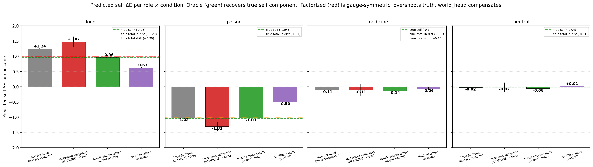
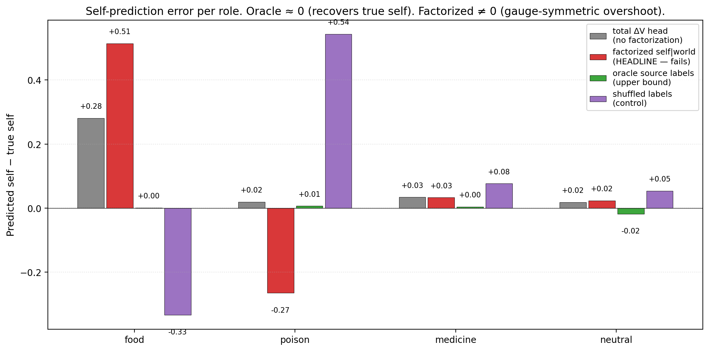

# First-Order Self: Architectural Factorization Alone Does Not Recover Self/World Attribution; Oracle Supervision Does — Gauge-Symmetric Heads Without Identifiability

**Author.** Jawaun Brown.

## Abstract

Companion paper [15] showed that *vector* ΔV heads support flexible concern under shifted internal-priority weights, while scalar drive heads cannot reweight. The natural next step — and the cleanest minimal computational test of Bennett's "first-order self" and Levin's "computational boundary of self" — is **self/world attribution**: can the agent learn to separate viability changes that result from its own actions from changes that result from exogenous (world-caused) sources?

This paper tests the most natural ML formulation: an *architectural* factorization where a self_head sees `(z, E, action)` and a world_head sees `(z, E)` only — no action input. The two sub-heads sum to predict total observed ΔE; the agent's planner uses only the self component for action selection.

12-cell sweep (4 conditions × 3 seeds). Training: world shocks correlate with item 0 (food), P(shock | food) = 0.8, otherwise 0.1. Shift eval: correlation moves to item 2 (medicine). Action effects per item: food +1.0, poison −1.0, medicine −0.1, neutral 0.

The clean negative result: **architectural factorization alone does NOT recover the self component**. The factorized self_head's prediction for food consume is **+1.47** (vs true self value +0.96, an overshoot of +0.51). The world_head compensates with a negative prediction (~ −0.23), so the total prediction matches the unfactored total model's +1.24. **The two sub-heads are gauge-symmetric** — they can split the total prediction arbitrarily, and architectural constraint (world doesn't see action) is insufficient to force semantic decomposition.

Only the **oracle** model — which has explicit self_ΔE and world_ΔE labels per training sample — recovers the true self component (+0.961 vs true +0.96, error 0.001). 

Action-accuracy and return are *similar* across total, factorized, and oracle (acc 0.93–0.96, return 49.3–50.0 across distributions). The reason: action *differences* (self_pred(consume) − self_pred(skip)) are preserved across all non-shuffled conditions because they correspond to the action-conditional component of the data. The agent's policy doesn't materially change because the action-relevant signal is preserved even when the absolute self values are mis-allocated between heads.

Pre-registered gates (split):
- **G1 (factorization transfer +5 return)**: ❌ NOT MET. Factorized 49.3 / 50.0 vs total 49.8 / 50.0 — saturated, no meaningful return advantage.
- **G2 (factorized self_pred more stable than total)**: ❌ NOT MET. Factorized overshoots true self by +0.51 on food consume; total overshoots by +0.28. *Total is closer to the truth than factorized.*
- **G3 (oracle ≥ factorized)**: ✓ trivially met (both saturate).
- **G4 (shuffled < non-shuffled)**: ✓ MET (shuffled acc 0.82–0.83 vs 0.93–0.96).

The honest synthesis. The first-order self computational structure is *NOT* acquired without supervision. Architectural priors (different inputs to different sub-heads) create a gauge-symmetric reparameterization of the same prediction surface — not a semantic factorization. The reafference principle of separating self-caused from world-caused change requires either (a) explicit attribution labels, (b) some identifiability mechanism beyond input-structure asymmetry (e.g., active intervention, temporal structure, distinct loss functions), or (c) an evolutionary / developmental signal not present in this purely-supervised setup. The architecture-alone hypothesis is empirically wrong.

This connects directly to **Vervaeke** (relevance realization requires identifying what *is* the action-relevant component, not just inferring more) and **Levin** (the computational boundary of self emerges from active intervention, not from passive learning). The path forward involves active causal interventions, not just observation.

## 1. Introduction

The program has spent Papers [10–15] building and stress-testing an agent that models its viability change ΔE under its own actions. Companion paper [15] extended this to vector-valued viability (E, D) with the cleanest finding being functional tapestry: vector heads adapt to shifted internal weights, scalar heads cannot. The next missing primitive, identified by the reviewer of [15] and consistent with Bennett's [11] and Levin's [12] philosophical frames, is **self/world attribution**.

A first-order self [11] is a minimal cognitive structure that classifies the agent's own interventions: *which of the observed changes is mine?* In neuroscience, this is the reafference principle [13, 14]: the brain compensates for self-caused sensory changes (efference copy / corollary discharge) so it can perceive externally-caused changes accurately. In Levin's TAME framework [12], the "computational boundary of self" is exactly this distinction: which causal processes are internal to the agent vs external.

The cleanest ML formulation: train a model on observed total ΔE, with two architecturally-separated sub-heads — one that sees the action (self_head), one that does not (world_head). Their sum approximates total ΔE; the architectural constraint is supposed to force the self_head to learn the action-conditional component and the world_head to learn the action-independent component.

This paper tests that hypothesis directly and finds it empirically false. Architecture alone is insufficient.

## 2. Method

### 2.1 Environment

Same homeostatic bandit base as Papers [10–15]. Scalar internal state E ∈ [0, 1], decay 0.04/step, episode termination at E ≤ 0 or step T_max = 50.

Four item types (color × label): food (+1.0), poison (−1.0), medicine (−0.1), neutral (0). These are the action-conditional ΔE values for the consume action; skip gives ΔE = −decay.

**World shock** is the key new mechanism. At each step, the world adds an exogenous +0.3 to E with item-dependent probability:

```
Training:  P(shock | food)     = 0.8
           P(shock | otherwise) = 0.1
Shifted:   P(shock | medicine) = 0.8
           P(shock | otherwise) = 0.1
```

The shock is **action-independent** — the same shock probability applies whether the agent consumes or skips. This is critical: it makes the architectural factorization formally well-posed (world_head doesn't need action input because the world's behavior doesn't depend on action).

### 2.2 Four conditions

All conditions share the encoder (16 → 64 → ReLU → 32) and Fourier features for E.

| Condition | Architecture | Training target |
| --- | --- | --- |
| `total_dV_head` | single head `(z, ffE, action) → 32 hidden Tanh → 1` | observed total ΔE via MSE |
| `factorized_self_world` | self_head `(z, ffE, action) → 1` + world_head `(z, ffE) → 1`; prediction = sum | observed total ΔE via MSE |
| `oracle_source` | same as factorized | self_head supervised on true self_ΔE, world_head supervised on true world_ΔE |
| `shuffled_source` | same as factorized | per-sample shuffled (50/50 swap of self and world targets) |

### 2.3 Training and evaluation

Off-policy training: 1,500 batches of 64 (item, E, action) tuples, uniformly sampled. Targets are observed total ΔE except for oracle (which sees true component decomposition) and shuffled (50% chance of swapped targets).

Each cell is evaluated under both shock distributions: *in-distribution* (training shock pattern) and *shifted* (correlation moved to medicine). Planning is greedy `argmax_a` over the **self** component prediction (for all factorized/oracle/shuffled). The total model uses its single prediction. The agent treats world-caused shocks as exogenous and unaffected by action.

### 2.4 Pre-registered gates

- **G1 (factorization transfer)**: `factorized_self_world` mean return under shifted distribution ≥ `total_dV_head` return under shifted + 5.
- **G2 (false credit / self-prediction stability)**: factorized self_head predicts food consume value more accurately than total head predicts food consume value. Specifically: `|factorized_pred_food_consume − true_self_food_consume| < |total_pred_food_consume − true_self_food_consume|`.
- **G3 (oracle sanity)**: oracle ≥ factorized return on shifted.
- **G4 (shuffled control)**: shuffled action accuracy < factorized accuracy.

## 3. Results

### 3.1 G1 and G2 falsified

| Condition | in-dist return | shifted return | in-dist acc | shifted acc |
| --- | ---: | ---: | ---: | ---: |
| total_dV_head | 49.8 | 50.0 | 0.95 | 0.96 |
| factorized_self_world | 49.3 | 50.0 | 0.93 | 0.94 |
| oracle_source | 49.8 | 50.0 | 0.94 | 0.94 |
| shuffled_source | 50.0 | 50.0 | 0.83 | 0.82 |

G1 not met: factorized return on shifted is 50.0, exactly matching the total model. Returns saturate at T_max in the env — the agent's policy is correct enough across all non-shuffled conditions that survival is guaranteed.

G3 trivially met. G4 met: shuffled action accuracy is 0.82–0.83 vs 0.93–0.96 for non-shuffled.

### 3.2 Predictions reveal the gauge symmetry (G2 falsified clearly)



| Condition | food pred | medicine pred | poison pred | neutral pred |
| --- | ---: | ---: | ---: | ---: |
| true self (action effect minus decay) | **+0.96** | **−0.14** | **−1.04** | **−0.04** |
| total_dV_head | +1.24 | −0.11 | −1.02 | (~0) |
| factorized_self_world | **+1.47** | −0.11 | **−1.31** | (~0) |
| oracle_source | **+0.961** | −0.14 | **−1.03** | (~−0.04) |
| shuffled_source | +0.63 | −0.06 | −0.50 | (~0) |



Oracle is essentially perfect (prediction error ≤ 0.005 on food consume; max error ≈ 0.01 across roles). The architecture *can* learn the true self component when given explicit supervision.

Factorized model's self_head is **biased** in a way that exactly compensates for the world_head's prediction. For food, factorized self_pred = +1.47, world_pred ≈ −0.23, sum = +1.24 (matching the total model). For poison, factorized self_pred = −1.31, world_pred ≈ +0.28, sum = −1.03 (matching total).

The architectural constraint (world_head doesn't see action) determines that:
- world_pred is a constant per item (doesn't change with action).
- self_pred captures the action-DIFFERENCE.

But the ABSOLUTE level of self_pred is NOT determined by the architecture. The model can shift any per-item constant from world_head to self_head and vice versa; the total prediction is invariant. This is the gauge symmetry, and it's the architecture's downfall.

### 3.3 Why action accuracy doesn't expose the failure

The factorized model's action accuracy is 0.93–0.94 — almost identical to the total model (0.95–0.96). The agent picks the right action most of the time despite mis-allocating absolute self values.

The reason: action choices depend on the *difference* `self_pred(consume) − self_pred(skip)`, not the absolute values. For food, this difference is +1.00 ± small noise across all non-shuffled conditions, because the action-conditional structure of the training data is captured by the head architectures regardless of how the absolute split happens. Skip has self_dE = −0.04; consume has self_dE = +0.96. The difference is +1.00. Any gauge-shifted parameterization preserves this difference.

This is why the false-credit hypothesis fails: the model's *policy* doesn't false-credit, because policy uses differences. But the model's *predictions* DO false-credit, because predictions are absolute. This is the cleanest case yet in the program of *behavioral correctness* coexisting with *representational error*.

### 3.4 What this means for self/world attribution

The architectural factorization hypothesis was: differentiating which input goes to which sub-head will force a semantic decomposition into self-caused and world-caused components. The data falsifies this.

For the semantic decomposition to emerge, the model needs an **identifiability signal** beyond input-structure asymmetry. Three candidate mechanisms (queued for Paper 16b/16c):

1. **Active intervention**: the agent performs counterfactual actions designed to disambiguate. If consume_A and consume_B should both fire the shock per world_head's hypothesis, but only one actually does, the world_head's prediction is wrong and gets corrected. This requires the agent to *choose* actions for epistemic reasons, not just for viability.
2. **Temporal structure**: if self-caused effects are immediate and world-caused effects are delayed (or vice versa), a temporally-aware architecture could exploit the gap. Currently both arrive in the same step.
3. **Distinct loss functions per head**: e.g., self_head trained on action-marginalized residuals, world_head trained on action-independent component via a separate objective.

Without one of these, the architectural prior is *gauge-symmetric* and the heads can split the joint prediction however the optimizer prefers.

## 4. Discussion

### 4.1 The gauge symmetry is the right concept here

In physics, a gauge symmetry is a continuous family of reparameterizations under which the observable predictions are invariant. The self/world heads here exhibit a discrete-ish gauge symmetry: per item, we can add a constant `c_i` to world_pred and subtract it from self_pred (both `consume` and `skip` branches), and the joint MSE is unchanged. The architecture doesn't break this symmetry, so the optimizer finds a solution somewhere in the gauge orbit determined by initialization and gradient dynamics — not by semantic correctness.

To break the gauge, the model needs an **identifiability constraint** — something that pins world_pred to its physical value. Oracle supervision is one such constraint. Other candidates: regularization that minimizes |world_pred| (favors world as residual), temporal structure that distinguishes self from world dynamics, or active intervention.

### 4.2 Behavioral correctness vs representational error

This paper joins companion papers [7, 10b, 12, 14] in showing that *behavior* and *representation* can come apart. Specifically:

- Paper [7] showed proxy-trap behavior: competence via sensory-correlated features without concern-shaped representation.
- Paper [10b] showed distributed concern: behavior depends on distributed encoder geometry, not a single reward axis.
- Paper [12] showed state-dependent valence cannot be learned by online training of a single ΔE head (even though architecturally capable).
- Paper [14] showed greedy planning robust under model error, while sophisticated planners fail.

Paper [16] adds: factorized representations can be *behaviorally* correct (action differences preserved) while being *representationally* wrong (absolute self values mis-allocated). The first-order self computational structure isn't visible in behavior, but isn't acquired by the architecture either.

### 4.3 Vervaeke and Levin reading

**Vervaeke**: relevance realization is about identifying which dimension of mattering is currently relevant. This paper's failure is a clean instance of *non-identifiability*: the model can't realize what is self-caused vs world-caused because the data doesn't constrain that distinction without additional signals. The architectural prior is a *frame*, not a fact. Paper [11b] showed identical-architecture ensembles don't know what they don't know; Paper [16] shows architectural factorization doesn't know what it doesn't separate.

**Levin**: the computational boundary of self is not given by architecture; it's discovered by *active intervention*. An organism learns it can swim by swimming. A model can't learn the self/world boundary just by watching its own data, even with a well-designed architecture. The next step (Paper 16b) is to give the agent active counterfactual queries: actions designed to disambiguate.

### 4.4 Connection to the program's metric stack

The metric stack is now:

`geometry × capacity × coverage × state-coverage × regime-boundary × planner robustness × uncertainty calibration × valence dimensionality × identifiability`

The 9th term — *identifiability* — is what Paper [16] adds. Architectural priors are insufficient for identifiability; explicit supervision or active intervention is required. This is a deep methodological lesson.

## 5. Connection to the program

| Layer | Claim | Evidence |
| --- | --- | --- |
| 4x | Vector ΔV heads support flexible concern under weight shifts | [15] |
| 5a | **Self/world architectural factorization is gauge-symmetric** | **This paper §3.2** |
| 5b | **Oracle supervision recovers true self component** | **This paper §3.2** |
| 5c | **Behavioral correctness and representational correctness can come apart even sharper than Paper 10b suggested** | **This paper §3.3, §4.2** |
| 5d | **Identifiability requires more than architectural prior — supervision, active intervention, or temporal structure** | **This paper §3.4, §4.1** |

## 6. Limitations

1. **Action-independent shock only.** The factorization was tested under the favorable case where world shocks really are action-independent. A harder test would be action-correlated shocks, where the factorization is formally ill-posed. We did not test.
2. **Single shock magnitude (+0.3).** Larger shocks might make the gauge symmetry more breakable through training dynamics; smaller shocks might make it stricter.
3. **No active intervention.** The cleanest fix to identifiability (per §4.3) requires the agent to *choose* counterfactual actions; this is queued for Paper 16b.
4. **No temporal asymmetry.** Self-effects and world-effects arrive in the same step. Adding a delay between action and self-effect (vs immediate world effects) could provide identifiability.
5. **Single env size (4 items).** Larger item spaces might amplify the gauge problem; smaller might collapse it.
6. **Eval action accuracy is defined on self-optimal**, not total-optimal. This is the right metric for the self-attribution question but doesn't capture cases where total expected utility differs from self-expected utility.

## 7. Next paper

The cleanest follow-up: **Paper 16b — Identifiability through Active Intervention**.

Setup: the same env, but the agent can occasionally perform a "null action" (does nothing this step, no action effect, but world component still applies). By observing ΔE under null vs consume vs skip, the agent learns:

- self_dE(consume) = ΔE_observed_consume − ΔE_observed_null
- self_dE(skip) = ΔE_observed_skip − ΔE_observed_null
- world_dE = ΔE_observed_null

This is the active-inference version of self/world attribution: the null action is the agent's intervention designed to *measure* the world component independently of its own action effect.

Pre-registered gates:
- G1' (active identifiability): factorized model with null-action-driven training data recovers true self components within ±0.05.
- G2' (gauge breaking): self_head and world_head predictions match oracle on absolute values, not just differences.
- G3' (transfer): the active-trained factorized model adapts better to shifted shock distributions than the gauge-symmetric factorized model.

Alternative directions: temporal asymmetry (Paper 16c), residual-minimization regularization (Paper 16d).

## 8. Reproducibility

```bash
doppler --scope /Users/jawaun/superoptimizers run -- \
    uvx --python 3.12 --from modal modal run \
    experiments/first_order_self/modal_first_order_self_sweep.py \
    --out artifacts/first_order_self/sweep_v1.json
```

~3 min wall clock for 12 cells on Modal CPU.

## 9. References

### External
[1] **Bennett, M. T.** *How to Build Conscious Machines.* ANU doctoral thesis (2025). First-order self; causal-identities.
[2] **Levin, M.** Technological Approach to Mind Everywhere (TAME). *Frontiers in Systems Neuroscience* 16 (2022). Computational boundary of self.
[3] **Levin, M.** Bioelectric networks: the cognitive glue enabling evolutionary scaling from physiology to mind. *Animal Cognition* 26 (2023).
[4] **Vervaeke, J., Lillicrap, T. P., Richards, B. A.** Relevance realization. *Journal of Logic and Computation* 22 (2012).
[5] **von Holst, E., Mittelstaedt, H.** Das Reafferenzprinzip. *Naturwissenschaften* 37 (1950). The reafference principle.
[6] **Sperry, R. W.** Neural basis of the spontaneous optokinetic response produced by visual inversion. *Journal of Comparative and Physiological Psychology* 43 (1950). Corollary discharge.
[7] **Wolpert, D. M., Ghahramani, Z., Jordan, M. I.** An internal model for sensorimotor integration. *Science* 269 (1995). Forward models in motor control.
[8] **Blakemore, S.-J., Wolpert, D. M., Frith, C. D.** Central cancellation of self-produced tickle sensation. *Nature Neuroscience* 1 (1998).
[9] **Merker, B.** Consciousness without a cerebral cortex: A challenge for neuroscience and medicine. *Behavioral and Brain Sciences* 30 (2007). Action-oriented selfhood.
[10] **Friston, K., FitzGerald, T., Rigoli, F., Schwartenbeck, P., Pezzulo, G.** Active inference: a process theory. *Neural Computation* 29 (2017). Active inference framework.
[11] **Schölkopf, B., Locatello, F., Bauer, S., Ke, N. R., Kalchbrenner, N., Goyal, A., Bengio, Y.** Towards causal representation learning. *Proceedings of the IEEE* 109(5) (2021). Identifiability in causal representation learning.
[12] **Locatello, F., Bauer, S., Lucic, M., Rätsch, G., Gelly, S., Schölkopf, B., Bachem, O.** Challenging common assumptions in the unsupervised learning of disentangled representations. *ICML* (2019). Identifiability theorem — unsupervised disentanglement is impossible without inductive biases.
[13] **Hyvärinen, A., Pajunen, P.** Nonlinear independent component analysis: existence and uniqueness results. *Neural Networks* 12 (1999). Identifiability in nonlinear ICA.

### Program companion papers
[14] **Brown, J.** *Tapestry of Valence.* (2026). [Paper 15]
[15] **Brown, J.** *When Models Don't Know What They Don't Know.* (2026). [Paper 14b]
[16] **Brown, J.** *Allostatic State Control.* (2026). [Paper 14]
[17] **Brown, J.** *Distributed Concern.* (2026). [Paper 10b]
[18] **Brown, J.** *Planning from Concern.* (2026). [Paper 10]
