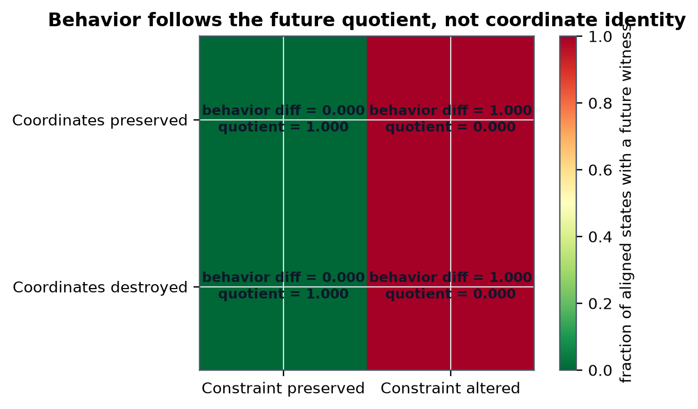
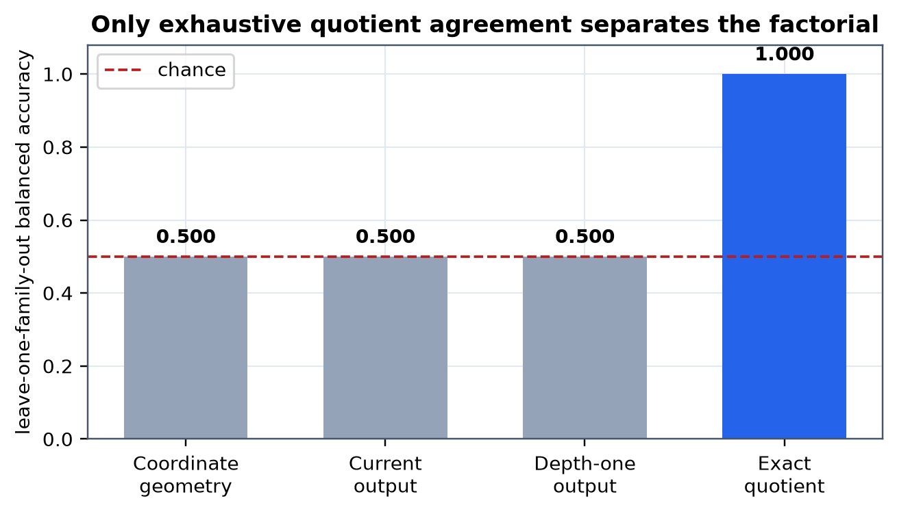

# The Coordinates Are Not the Causal Object

## Exact Future-Commitment Quotients in Deterministic Finite Agents

**Human director:** Jawaun Brown
**Producing agent:** OpenAI Codex, directed
**Program:** Constraint Discovery / Representation Repair
**Date:** 2026-07-27
**Status:** Preregistered exact theorem-and-construction study

## Abstract

A recurring proposal in representation learning and mechanistic
interpretability is that an internal vector, feature, neuron, or symbol is the
scientifically primary object. A stronger alternative says that the invariant
object is whatever internal structure preserves possible future commitments
under intervention. We isolate the finite logical core of that proposal.

For deterministic finite Moore agents, we define two states as equivalent when
every finite intervention word produces the same commitment. We prove that
this relation is the greatest commitment bisimulation, is invariant under
coordinate conjugacy, and induces the coarsest exact Markov abstraction for
the registered intervention alphabet. A product-state search returns a finite
distinguishing word whenever equivalence fails. These are specializations of
classical automata minimization and bisimulation, not a novel quotient theorem.

We then execute a preregistered 2×2 construction over three delayed-commitment
machine families, 64 fixed seeds, four coordinate/transition conditions, and
768 exact rows. Destroying coordinate identity and geometry while preserving
transition and commitment conjugacy leaves future behavior unchanged.
Preserving coordinates, current commitments, and every depth-one commitment
while changing one delayed load-bearing transition changes the exact quotient.
Leave-one-family-out balanced accuracy is 1.000 for quotient agreement and
0.500 for coordinate geometry, current output, and depth-one output.

The result is decisive but narrow. It proves that raw coordinates are neither
necessary nor sufficient for future-commitment equivalence in the registered
finite white-box class. It does not show that learned agents discover such
quotients, that natural tasks admit the registered intervention family, or
that constraint relaxation and repair can be automated. The formal experiment
therefore sharpens the research target: the open problem is not defining the
invariant after exhaustive access; it is learning the right intervention
quotient and discovering which load-bearing constraint to revise.

## 1. The question that can actually be proved

The broad philosophical sentence

> Intelligence preserves constraints across transformations.

is not a mathematical claim until `constraint`, `transformation`, and
`preserves` are typed. The present paper deletes that ambiguity. We ask only:

> When two finite internal states can be subjected to a fixed intervention
> alphabet, what state information is necessary and sufficient to predict
> every future commitment?

The answer is classical in mathematical form. It is the equivalence class
induced by equality of future outputs, or equivalently the maximal
output-preserving bisimulation. State aggregation and bisimulation have long
used this principle to construct reduced decision processes [1--3]. Recent
work gives a bounded-interaction Myhill--Nerode theorem for finite POMDP probe
families, with a canonical, minimal, unique quotient [10]. Our deterministic
finite result is a simpler specialization.

Why run an experiment if the theorem is known? Because the proposed
representation ontology makes two empirical-sounding predictions that are
often conflated:

1. radically different coordinates can realize the same operative state;
2. identical local coordinates and probes can conceal delayed consequences.

The registered factorial makes those predictions diverge exactly. It is a
model-checking experiment on a constructed class, not a natural-data estimate.

## 2. Formal setup

### 2.1 Deterministic finite agents

An agent is a tuple:

```text
A = (X, U, delta, pi, E)
```

where:

- `X` is a nonempty finite state set;
- `U` is a finite intervention alphabet;
- `delta: X x U -> X` is a total deterministic transition;
- `pi: X -> Y` is a deterministic commitment label;
- `E: X -> R^d` is an injective coordinate realization.

The coordinate map is intentionally separated from the transition/output
object. It can be useful without being identifiable or invariant.

For `w in U-star`, let `delta-star(x,w)` be the state after applying the finite
intervention word `w`. The future-commitment signature is:

```text
Sigma_A(x) = ( pi(delta*(x,w)) ) for every w in U*
```

For states from possibly different agents with the same `U` and `Y`:

```text
x ==_Sigma y
iff
pi_A(delta_A*(x,w)) = pi_B(delta_B*(y,w)) for every w in U*
```

This is an interventional output equivalence. It is not an assertion that
states have the same content, meaning, coordinate, history, or mechanism
outside the registered interface.

### 2.2 Commitment bisimulation

A cross-agent relation `R` between `X_A` and `X_B` is a commitment
bisimulation when

```text
x R y  implies  pi_A(x) = pi_B(y)
and
delta_A(x,u) R delta_B(y,u) for every u in U
```

The quotient `X / ==_Sigma` is the paper's operative object. The term
`constraint` refers only to the restrictions on future commitment traces
captured by this quotient. No semantic ontology is inferred from a block.

## 3. Theorems

### Theorem 1: future-commitment completeness

For finite deterministic agents with common typed alphabets,
`x ==_Sigma y` if and only if `x` and `y` are related by the greatest
commitment bisimulation.

**Proof.** Let `R_Sigma` relate states with identical signatures. Equality
for the empty word gives equal current commitments. For any intervention `u`
and continuation `w`, equality for the concatenated word `uw` implies that
the `u`-successors have equal signatures. Thus `R_Sigma` is a commitment
bisimulation.

Conversely, if `x R y` for a commitment bisimulation `R`, induction on word
length gives related successor states after every common word. Related states
have equal commitments, so their signatures agree. Therefore every
commitment bisimulation is contained in `R_Sigma`, making `R_Sigma` the
greatest one. QED.

### Theorem 2: coordinate-gauge invariance

Let `g: X -> X'` be a bijection satisfying:

```text
g(delta(x,u)) = delta'(g(x),u)
and
pi(x) = pi'(g(x))
```

Then `x ==_Sigma g(x)` for every `x`, and the two quotient machines are
isomorphic.

**Proof.** Induction on word length gives
`g(delta-star(x,w)) = delta-prime-star(g(x),w)`. Applying the output equality
yields equal commitments for every word. The induced map on equivalence
classes is therefore well-defined, bijective, output-preserving, and
transition-preserving. QED.

### Theorem 3: minimal exact Markov abstraction

Let `r: X -> Z` admit a total abstract transition
`delta_bar: Z x U -> Z` and output `pi_bar: Z -> Y` such that:

```text
r(delta(x,u)) = delta_bar(r(x),u)
and
pi(x) = pi_bar(r(x))
```

Then:

```text
r(x) = r(y)  implies  x ==_Sigma y
```

Hence any exact Markov abstraction refines the future-commitment quotient, and
the quotient is the coarsest exact abstraction for the registered interface.

**Proof.** Equal abstract states remain equal under every abstract
intervention word. Their abstract outputs, and therefore their ground outputs,
agree after every word. The kernel of `r` is consequently contained in
`==_Sigma`. The quotient map factors through `r`, proving coarseness. QED.

### Theorem 4: finite distinguishing bound

If states in agents of sizes `n_A` and `n_B` are not equivalent, a
distinguishing word exists with length strictly less than `n_A times n_B`.

**Proof.** Breadth-first search on the product state space starts from the
state pair and explores one successor pair per intervention. If no pair with
different outputs is reachable, the reachable-pair relation is a commitment
bisimulation. If one is reachable, a shortest simple product path reaches it
without repeating a pair. The product contains `n_A times n_B` pairs, so the
path length is less than `n_A times n_B`. QED.

These theorems do not depend on the coordinate map `E`. They also do not
identify which intervention alphabet should be used. That choice determines
what the quotient preserves.

Theorems 1--4 are proved finite specializations or corollaries of classical
automata-minimization, bisimulation, and distinguishing-sequence results; they
are not presented as novel theorems.

[[PAGEBREAK]]

## 4. Registered experiment

The preregistration was frozen at 15:14 EDT on 2026-07-27 before implementation
or result inspection. Its SHA-256 digest is:

`179afa61ba7052ab202533309bc9d4a74d3ea8d88a07ec2bc0008d02669e99c6`.

### 4.1 Machine families

We construct three delayed-commitment Moore families:

- parity memory with two memory values;
- modulo-three memory with three values;
- order memory with `none`, `last-zero`, and `last-one` values.

Each family crosses memory with a three-phase clock. Outputs are `defer` until
the terminal phase and then `accept` or `reject`. The common intervention
alphabet is `zero`, `one`, `advance`, and `reset`.

The registered delayed mutant changes one phase-zero memory transition. It
leaves the state set, coordinate rows, current commitments, clock transitions,
and every depth-one commitment unchanged. The implementation rejects a mutant
unless product search finds a later commitment witness.

### 4.2 The 2×2 factorial

| Cell | Coordinates | Transition constraint | Future behavior |
|---|---|---|---|
| RP-CP | preserved | preserved | predicted same |
| RD-CP | destroyed | conjugate | predicted same |
| RP-CA | preserved | one delayed edge altered | predicted different |
| RD-CA | destroyed | one delayed edge altered | predicted different |

`RP` and `RD` mean representation preserved and destroyed. `CP` and `CA` mean
future constraint preserved and altered.

For each seed, RD-CP and RD-CA share one nonidentity state permutation and one
hash-seeded random injective coordinate assignment. This pairing makes
coordinate statistics exactly independent of the constraint label. CP cells
must satisfy output and transition conjugacy. CA cells must fail conjugacy and
contain a delayed witness.



### 4.3 Baselines and exact target

We compare:

- aligned coordinate equality;
- correlation of Euclidean representational distance matrices;
- current-output agreement;
- depth-one successor-output agreement;
- exact quotient agreement.

The target is whether the full future constraint is preserved. Thresholds are
fit on two families and tested on the third. Balanced accuracy is used because
the current and depth-one baselines are constant.

This comparison is intentionally diagnostic. Quotient agreement is computed
from the same exhaustive future behavior that defines the target. Its perfect
score validates the formal bridge and implementation; it is not an empirical
learning victory over tuned baselines.

## 5. Results

All 768 confirmatory rows were generated: 3 families × 64 seeds × 4 cells.
All integrity and theorem-implementation gates passed.

### 5.1 Exact double dissociation

| Cell | Coordinate equality | Geometry correlation | Depth-one agreement | Quotient agreement | Behavioral disagreement |
|---|---:|---:|---:|---:|---:|
| RP-CP | 1.000 | 1.000 | 1.000 | 1.000 | 0.000 |
| RD-CP | 0.000 | -0.004 | 1.000 | 1.000 | 0.000 |
| RP-CA | 1.000 | 1.000 | 1.000 | 0.000 | 1.000 |
| RD-CA | 0.000 | -0.004 | 1.000 | 0.000 | 1.000 |

The rows do not matter; the columns do. Destroying coordinates did not change
behavior when the quotient was preserved. Preserving coordinates did not
preserve behavior when the delayed transition constraint changed.

Every RD-CP state had no distinguishing word. Every RP-CA aligned state had a
valid delayed witness of length at least two and below the product bound. The
result replicated separately in all three families; no pooled score rescued a
failed family.

### 5.2 Predictor separation

| Predictor | Leave-one-family-out balanced accuracy |
|---|---:|
| Coordinate geometry | 0.500 |
| Current output | 0.500 |
| Depth-one output | 0.500 |
| Exact quotient agreement | 1.000 |



The coordinate score is exactly nonpredictive because each coordinate
realization appears once with the constraint preserved and once altered.
Current and depth-one outputs are also matched by construction. The quotient
separates the cells because it includes the delayed transition consequences
that the local baselines omit.

### 5.3 Gate verdict

| Gate | Result |
|---|---|
| F0 construction and provenance | PASS |
| F1 formal implementation | PASS |
| G1 representation non-necessity | PASS |
| G2 representation/local non-sufficiency | PASS |
| G3 factorial predictor separation | PASS |
| G4 family transfer | PASS |
| G5 claim calibration | PASS |

Decision: `ACCEPT_SCOPED_FINITE_QUOTIENT_CLAIM`.

## 6. What has been proved

Within the registered deterministic finite class:

1. raw coordinates are not necessary for exact future behavior;
2. coordinate identity and depth-one outputs are not sufficient;
3. maximal commitment bisimulation is sufficient for the registered alphabet;
4. its quotient is the coarsest exact Markov abstraction for that interface;
5. inequivalence has a finite, machine-checkable intervention witness.

This gives precise content to one part of the phrase “representation as
constraint preserved to commitment.” The operative invariant is not a
particular vector. It is an equivalence class of states under all registered
future commitment tests.

## 7. What has not been proved

The result does not establish the proposed major-ML capability.
It withholds claims about learned constraint discovery, stochastic agents,
real networks, natural tasks, and general intelligence.

### 7.1 The quotient was not learned

We had white-box transition tables and exhaustively refined the partition.
Representation learning, causal abstraction learning, and interventional
causal representation learning address the harder problem of identifying
useful latent structure from finite observations or interventions [5, 7--9].
We solved none of those identification problems.

### 7.2 The intervention family was supplied

Equivalence is relative to `U-star`. A smaller probe family yields a coarser
quotient; a richer family can split blocks. Nixon's bounded-interaction result
makes this observer dependence explicit [10]. In a natural scientific or
agentic setting, choosing the interventions is part of the discovery problem.

### 7.3 The target makes the quotient perfect by definition

The 1.000 predictor score is an exact consistency result, not an out-of-sample
statistical surprise. It shows why local coordinates cannot substitute for the
registered future object in this factorial. It does not show that an estimated
quotient will beat CKA, probes, or causal abstractions on real networks.
Representation similarity methods such as CKA are designed for different
questions and invariance classes [4].

### 7.4 No constraint was discovered or repaired

The delayed mutant was authored by the experiment. The system did not infer a
hidden assumption, rank candidate relaxations, or construct a minimal repair.
Learned constraint discovery remains open.

### 7.5 Deterministic finite scope matters

Stochastic agents require distributional output equality and probabilistic
bisimulation or a metric relaxation [1, 2]. Continuous state, partial
observability, approximate equivalence, nonstationarity, and unbounded
interaction introduce further identification and approximation choices. The
present proofs cannot be exported unchanged.

## 8. Resolution of the earlier Constraint-Swap null

The earlier Constraint-Swap Causal Geometry experiment tested whether a hidden
task constraint appeared as a reachability-aligned recurrent geometry and
whether low-rank transports of that geometry selectively changed behavior.
Competence and measurement-sensitivity controls passed, but every registered
geometry and causal gate failed.

This paper does not rescue that mechanism. It changes the object:

- Constraint-Swap tested learned hidden geometry in a recurrent agent.
- The present study computes an exact quotient from complete finite transition access.

These claims occupy different validity layers and evidence regimes. The null
remains evidence against the geometry-mediated mechanism. The current positive
is a formal construction showing what would be invariant if exhaustive future
interventions were available.

## 9. Relation to prior work

Model minimization and bisimulation already establish coordinate-free state
equivalence for planning and transition systems [1--3]. Bisimulation metrics
relax exact equivalence to quantitative state similarity [2]. The
Myhill--Nerode tradition characterizes minimal automata by future
distinguishability, and the 2026 bounded-interaction theorem extends that logic
to agent-limited POMDP probes [10].

Representation learning supplies complementary warnings. Unsupervised
disentanglement is not identifiable without inductive biases [5], and
underspecified pipelines can produce predictors with similar validation
performance but different downstream behavior [6]. Causal abstraction and
distributed alignment work use interventions to connect neural states to
high-level causal models [7--9]. Our construction should be read as a minimal
test fixture for those harder learning problems, not a replacement for them.

The contribution is therefore not a new equivalence relation. It is:

1. a preregistered 2×2 diagnostic separating coordinates from future constraints;
2. an exact bridge from representation language to classical quotient mathematics;
3. a calibrated conclusion that hidden-constraint discovery and repair remain open.

## 10. The next decisive experiment

The honest successor is not another coordinate scramble. It is a partial-access
learning test:

1. hide the transition table;
2. expose a bounded training set of intervention traces;
3. require the system to choose informative interventions;
4. estimate an approximate quotient with calibrated uncertainty;
5. hold out one machine family and longer distinguishing words;
6. introduce several candidate delayed mutations, only one load-bearing;
7. require ranking the load-bearing mutation and proposing the smallest repair;
8. compare automata, bisimulation, causal, probe, geometry, and search baselines.

That would begin to test constraint discovery and representation repair. The
current result supplies its oracle target and adversarial controls.

## 11. Conclusion

The finite formal question has a clean answer:

```text
operative state = future-commitment equivalence class
```

for the stated deterministic finite agent, intervention alphabet, and exact
commitment interface.

The experiment proves the intended double dissociation inside that scope.
Coordinates can change while behavior does not; coordinates can stay fixed
while delayed behavior changes. But the same result also blocks the grander
claim from being presented as a new theory. The quotient is bisimulation in
commitment language. The field-changing problem begins one level later:
learning the quotient from partial access, discovering which constraint is
load-bearing, and constructing a minimal repair that survives held-out
domains.

## References

[1] R. Givan, T. Dean, and M. Greig. “Equivalence Notions and Model
Minimization in Markov Decision Processes.” *Artificial Intelligence*
147(1–2):163–223, 2003.
https://doi.org/10.1016/S0004-3702(02)00376-4

[2] N. Ferns, P. Panangaden, and D. Precup. “Bisimulation Metrics for
Continuous Markov Decision Processes.” *SIAM Journal on Computing*
40(6):1662–1714, 2011. https://doi.org/10.1137/10080484X

[3] L. Li, T. J. Walsh, and M. L. Littman. “Towards a Unified Theory of State
Abstraction for MDPs.” *ISAIM*, 2006.
https://rbr.cs.umass.edu/aimath06/proceedings/P21.pdf

[4] S. Kornblith, M. Norouzi, H. Lee, and G. Hinton. “Similarity of Neural
Network Representations Revisited.” *ICML*, 2019.
https://proceedings.mlr.press/v97/kornblith19a.html

[5] F. Locatello et al. “Challenging Common Assumptions in the Unsupervised
Learning of Disentangled Representations.” *ICML*, 2019.
https://proceedings.mlr.press/v97/locatello19a.html

[6] A. D'Amour et al. “Underspecification Presents Challenges for Credibility
in Modern Machine Learning.” *JMLR* 23(226):1–61, 2022.
https://www.jmlr.org/papers/v23/20-1335.html

[7] A. Geiger et al. “Inducing Causal Structure for Interpretable Neural
Networks.” *ICML*, 2022.
https://proceedings.mlr.press/v162/geiger22a.html

[8] A. Geiger et al. “Finding Alignments Between Interpretable Causal
Variables and Distributed Neural Representations.” *CLeaR*, 2024.
https://proceedings.mlr.press/v236/geiger24a.html

[9] X. Li, S.-O. Kaba, and S. Ravanbakhsh. “On the Identifiability of Causal
Abstractions.” *AISTATS*, 2025.
https://proceedings.mlr.press/v258/li25g.html

[10] A. T. Nixon. “The Myhill-Nerode Theorem for Bounded Interaction:
Canonical Abstractions via Agent-Bounded Indistinguishability.” arXiv:
2603.21399, 2026. https://arxiv.org/abs/2603.21399

[11] J. Brown. “Constraint Is Not Geometry: A Preregistered Causal Test of
Constraint-Induced Representational Deformation.” 2026. Repository artifact:
`papers/constraint_swap_causal_geometry/paper.md`.

## Reproduction

```bash
uv run --no-sync python -m \
  experiments.future_commitment_quotient.run_experiment
uv run --no-sync python scripts/make_future_commitment_quotient_figures.py
uv run --no-sync python scripts/build_future_commitment_quotient_pdf.py
uv run --no-sync python -m pytest -q \
  tests/test_future_commitment_quotient.py
```

Public exact rows:
`experiments/future_commitment_quotient/results/registered_rows.jsonl`.

Public gate summary:
`experiments/future_commitment_quotient/results/summary.json`.

The complete run payload remains under the gitignored
`artifacts/future_commitment_quotient/` directory.
