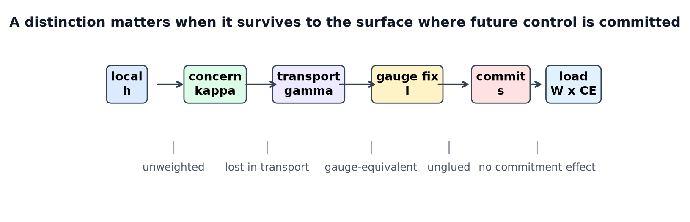
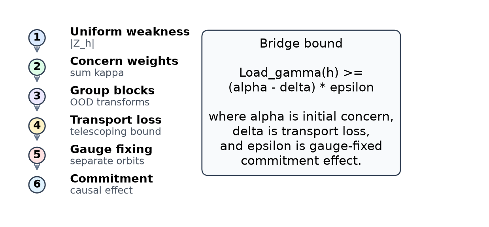
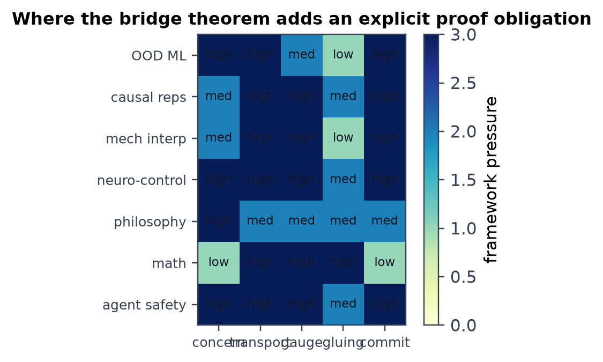
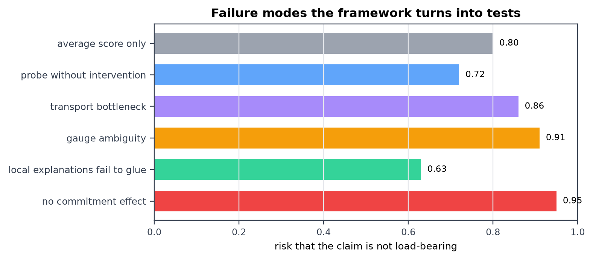

# Gauge-Fixed Transport of Concern

**Subtitle.** A bridge theorem for load-bearing agency, representation, and finite intelligence

**Author.** Jawaun Brown

**Date.** July 7, 2026

## Abstract

This paper proposes a mathematical bridge between four ideas that are often studied separately: weakness in finite hypothesis choice, concern or relevance in embodied cognition, gauge freedom in representation, and causal load-bearing structure at the point of action. The thesis is simple: a finite agent does not merely have representations; it transports concern-weighted distinctions across contexts until they reach a commitment surface, and a claim about intelligence, mind, meaning, or safety becomes scientifically useful only when that transport is gauge-fixed and causally load-bearing. The framework is self-contained. It begins with finite sets and counting, recovers Bennett's weakness principle as the uniform special case, extends it by replacing uniform extension count with concern-weighted extension mass, and then adds transport maps, group actions, sheaf-like gluing conditions, and intervention-based gauge fixing. The main bridge theorem states that if a distinction has positive concern mass, survives a specified transport chain, is separated from gauge-equivalent alternatives by an intervention or commitment, and changes the expected commitment by a nonzero amount, then the distinction is load-bearing relative to that chain. The proof is elementary, but the payoff is broad: it gives one vocabulary for out-of-distribution generalization, causal representation learning, mechanistic interpretability, reafference, allostasis, type-theoretic proof obligations, topological obstruction, and philosophy of mind. The paper ends with experimental templates and application diagrams rather than appeals to prior unpublished work.

## 1. Problem

Many fields now face the same failure in different costumes.

In machine learning, two models can have the same validation score and fail differently under deployment shift. In mechanistic interpretability, a feature can be decodable without being used. In neuroscience, a neural signal can track a variable without controlling behavior. In philosophy of mind, an internal description can be postulated without explaining why anything matters to the system. In safety, an agent can say the right thing while the operative bottleneck has moved to memory, tools, policy, or a later action surface.

The common mistake is to ask whether a representation exists as a spatial object: where is the representation, feature, self-model, goal, belief, or concern? The more useful question is temporal and structural: when does a distinction survive the transformations that matter, and when does it become load-bearing for commitment?

This paper gives a formal answer:

> A concern is usable when a concern-weighted distinction is transported across the relevant context changes, gauge-fixed against equivalent descriptions, glued across overlapping contexts, and shown to alter a commitment surface.

The phrase "concern" here is not used as a folk-psychological attitude. It is a nonnegative measure over distinctions that matter for the system's future control, viability, action, or evaluation. The phrase "gauge" is also not decorative. A gauge is a family of reparameterizations that changes an internal description while leaving the observations and commitments invariant. If there is no intervention, ablation, perturbation, or commitment that separates two descriptions, the difference between them is not yet an identified load-bearing structure.

The paper has three goals.

1. Prove a bridge theorem that connects weakness, concern, transport, gauge fixing, and commitment.
2. Show why the theorem is not a metaphor by reducing several known mathematical and experimental ideas to special cases.
3. Give a practical protocol for designing experiments across machine learning, neuroscience, robotics, cognitive science, and philosophy of mind.

## 2. Running Picture



Figure 1 summarizes the core claim. A local distinction is first weighted by concern. It is then transported through contexts: distribution shifts, abstraction layers, time delays, interventions, body-world loops, or model layers. Along the way it can lose mass, split into gauge-equivalent descriptions, fail to glue with neighboring contexts, or disappear before the decision point. A distinction becomes load-bearing only when it reaches a commitment surface and changing it changes the commitment.

This is meant to be mathematically modest and conceptually sharp. The theorem does not say that every biological or artificial system "really has" a single scalar concern. It says that when a researcher claims that some structure matters to a finite agent, the claim should specify the concern measure, the transport chain, the gauge ambiguities, and the commitment effect.

## 3. Finite Setup

We work first in a finite setting. Continuous versions are obtained by replacing sums with integrals and maps with Markov kernels or measurable maps.

Let C be a finite category or directed multigraph of contexts. A context can be a data distribution, a task environment, a model layer, a time slice, a sensorimotor condition, an intervention regime, or an action surface. For each context c in C, let S(c) be a finite set of local sections. A section is a possible assignment of distinctions at that context.

A hypothesis or distinction h at context c determines an extension set:

```text
Z_h(c) subset S(c)
```

Z_h(c) is the set of local sections compatible with h. If h is strong, it rules out many sections; if h is weak, it leaves many sections possible.

A concern density at c is a map:

```text
kappa_c : S(c) -> R_{\ge 0}
```

The concern-weighted extension mass of h at c is:

```text
W_c(h) = sum_{s in Z_h(c)} kappa_c(s).
```

When kappa_c(s) = 1 for all s, W_c(h) is just |Z_h(c)|. Thus concern-weighted weakness recovers ordinary extension-count weakness as the uniform case.

For each morphism m : c -> d in C, let T_m be a transport operation. In the deterministic finite case:

```text
T_m : S(c) -> S(d).
```

In the stochastic case, T_m is a Markov kernel K_m(s,t). The deterministic case is enough for the core theorem, while the stochastic case is the natural form for neural, biological, and social systems.

The transported extension of h along m is:

```text
T_m Z_h(c) = { T_m(s) : s in Z_h(c) } subset S(d).
```

For a chain gamma = (c_0 -> c_1 -> ... -> c_n), write T_gamma for the composite transport. A commitment surface is a terminal or selected context c_n equipped with a commitment map:

```text
a_n : S(c_n) -> A
```

where A is a set of actions, answers, policies, interventions, reports, motor commitments, or institutional decisions.

Finally, let G_c be a gauge group acting on a latent description space L(c). An observation map O_c : L(c) -> S(c) and commitment map a_c are gauge-invariant if:

```text
O_c(g . l) = O_c(l)
a_c(O_c(g . l)) = a_c(O_c(l))
```

for all g in G_c. Two latent descriptions in the same gauge orbit are not separated by observation or commitment unless some extra intervention breaks the symmetry.

## 4. Theorem Ladder



The ladder in Figure 2 is the main derivation path. The early steps are counting arguments. The later steps turn counting into a testable standard for load-bearing representation.

### Definition 1: Concern-weighted weakness

For finite S(c), concern density kappa_c, and distinction h:

```text
Weak_kappa,c(h) = W_c(h) = sum_{s in Z_h(c)} kappa_c(s).
```

If U subset S(c) is a deployment region or evaluation region, define:

```text
Weak_kappa,U(h) = sum_{s in Z_h(c) cap U} kappa_c(s).
```

This says: do not count all compatible worlds equally when only some worlds matter for the relevant future. Count the compatible worlds that matter, with the weights that matter.

### Theorem 1: Uniform weakness is a special case

If kappa_c(s) = 1 for every s in S(c), then:

```text
Weak_kappa,c(h) = |Z_h(c)|.
```

If U subset S(c), then:

```text
Weak_kappa,U(h) = |Z_h(c) cap U|.
```

Therefore maximizing concern-weighted weakness with uniform concern is exactly maximizing finite extension weakness.

**Proof.** Substitute kappa_c(s) = 1 into the definition. The sum over compatible sections counts the number of compatible sections. The restricted case is identical with the domain of summation replaced by Z_h(c) cap U. QED.

This theorem connects directly to Bennett's result that, under the relevant uniform assumptions, choosing the weakest valid hypothesis maximizes probability of generalization. The present paper does not replace that result; it changes the measure when the relevant future is not uniform.

### Theorem 2: Concern weights recover group-block generalization

Let a finite group G act on contexts or examples, and let B_g subset S be the block associated with transformation g. Let mu_g >= 0 be the deployment or concern mass assigned to block g. Define:

```text
W_G(h) = sum_{g in G} mu_g |Z_h cap B_g|.
```

Then W_G is concern-weighted weakness for the concern density:

```text
kappa(s) = sum_{g : s in B_g} mu_g.
```

If the blocks are disjoint, this reduces to kappa(s) = mu_g for s in B_g.

**Proof.** By definition:

```text
sum_{s in Z_h} kappa(s)
= sum_{s in Z_h} sum_{g : s in B_g} mu_g
= sum_{g in G} mu_g |Z_h cap B_g|.
```

The last equality is finite exchange of summation. QED.

This theorem explains why group theory enters naturally. A group is not merely a symmetry to admire. It specifies transformations across which the distinction must remain compatible. Concern weights say which transformations matter more for deployment.

### Definition 2: Transport loss

For a chain gamma = c_0 -> c_1 -> ... -> c_n and a distinction h at c_0, let:

```text
W_i(h) = W_{c_i}(T_{0:i} h).
```

Here T_{0:i} h denotes the transported distinction at context c_i. If W_{i+1}(h) <= W_i(h), define the transport loss:

```text
ell_i(h) = W_i(h) - W_{i+1}(h).
```

The monotone case covers filters, bottlenecks, lossy abstractions, irreversible time steps, and evaluation regions. The nonmonotone case can be handled by signed gains and losses, but monotone loss is the clean case for proof.

### Theorem 3: Transport bottleneck bound

If W_{i+1}(h) <= W_i(h) along a chain gamma, then:

```text
W_n(h) = W_0(h) - sum_{i=0}^{n-1} ell_i(h).
```

In particular:

```text
W_n(h) <= min_i W_i(h).
```

If ell_i(h) <= delta_i for each i, then:

```text
W_n(h) >= W_0(h) - sum_i delta_i.
```

**Proof.** The first equality is telescoping:

```text
W_0 - W_n = (W_0-W_1) + (W_1-W_2) + ... + (W_{n-1}-W_n).
```

The upper bound follows from monotonicity. The lower bound follows by replacing each ell_i with its upper bound delta_i. QED.

This is the first place where the temporal question matters. A distinction that is highly concern-weighted at perception may still have zero load at action if it is lost before commitment.

### Definition 3: Gauge ambiguity and gauge fixing

Let G_c act on L(c), and let O_c : L(c) -> S(c). A property P of latent descriptions is gauge-ambiguous under observations E when:

```text
for every evidence e in E and every l in L(c),
Pr(e | l) = Pr(e | g . l)
```

for some nontrivial g in G_c that changes P. An intervention family I is an eta-gauge-fixing family for P if, for any l and l' with different P-values, at least one intervention i in I separates their induced evidence or commitment distributions by distance at least eta.

Distance can be total variation, Wasserstein distance, KL divergence when defined, change in expected utility, or task-specific effect size.

### Theorem 4: No gauge-free identification

If observations and commitments are invariant under a nontrivial gauge action G_c, then no procedure using only those observations and commitments can identify which element of a gauge orbit is the true latent description.

**Proof.** Let l and g . l be two latent descriptions in the same orbit. Gauge invariance gives identical observations:

```text
O_c(l) = O_c(g . l).
```

It also gives identical commitments:

```text
a_c(O_c(l)) = a_c(O_c(g . l)).
```

Any procedure whose input is only observations and commitments receives the same input under l and g . l. Therefore it must return the same output distribution under both. If l and g . l differ in the target property P, the procedure cannot identify P. QED.

This theorem is the formal version of a familiar warning: decodability is not possession, correlation is not mechanism, and internal coordinate choice is not scientific identification.

### Definition 4: Commitment effect

Let V : A -> R be a value, loss, viability, reward, or evaluation function over commitments. Let do(h) denote an intervention that enforces the transported distinction h at the commitment surface, and let do(not h) denote a matched contrast intervention. Define the commitment effect:

```text
CE_s(h) = | E[V(a_s) | do(h)] - E[V(a_s) | do(not h)] |.
```

If the system is deterministic, this is just the absolute difference in V after the two interventions.

### Definition 5: Load-bearing concern

For a chain gamma from c_0 to a commitment surface s, define:

```text
Load_gamma(h) = W_s(T_gamma h) * CE_s(T_gamma h).
```

A distinction is epsilon-load-bearing at concern scale alpha if:

```text
W_s(T_gamma h) >= alpha
CE_s(T_gamma h) >= epsilon.
```

### Theorem 5: Gauge-fixed transport bridge theorem

Let h be a distinction at c_0, gamma a transport chain from c_0 to commitment surface s, and I an eta-gauge-fixing intervention family for the relevant latent property of h. Suppose:

1. Initial concern mass is positive: W_0(h) >= alpha.
2. Transport loss is bounded: sum_i ell_i(h) <= delta < alpha.
3. Gauge ambiguity is separated by I at scale eta, and the measured commitment effect is corrected by at most eta.
4. The corrected commitment effect is nonzero: CE_s(T_gamma h) - eta >= epsilon > 0.

Then:

```text
Load_gamma(h) >= (alpha - delta) * epsilon.
```

Consequently, h is load-bearing relative to gamma, I, kappa, and s.

**Proof.** By Theorem 3:

```text
W_s(T_gamma h) >= W_0(h) - delta >= alpha - delta.
```

By gauge fixing, the intervention family I separates the relevant gauge alternatives, so the remaining commitment effect after gauge correction is at least epsilon:

```text
CE_s(T_gamma h) >= epsilon.
```

Multiplying the two nonnegative lower bounds gives:

```text
Load_gamma(h) = W_s(T_gamma h) * CE_s(T_gamma h)
>= (alpha - delta) * epsilon.
```

QED.

The theorem is intentionally elementary. Its novelty is not a hard proof trick. Its usefulness is the accounting discipline: a claim about a representation, concern, self-model, goal, or semantic structure must specify a concern measure, a transport path, a gauge-fixing intervention, and a commitment effect. Without those parts, the claim is underidentified.

## 5. Natural Corollaries

### Corollary 1: Weakness is concern-free transport at one context

Set gamma to the identity chain, set kappa = 1, and ignore gauge. Then Load reduces to extension count times commitment effect. If the commitment effect is constant across valid hypotheses, maximizing Load reduces to maximizing weakness.

### Corollary 2: Concern-weighted weakness is nonuniform deployment weakness

When deployment contexts have unequal consequence, probability, or cost, maximizing |Z_h| is the wrong objective. The correct objective is W_kappa(h). Uniform weakness is recovered only when all future sections have equal concern density.

### Corollary 3: Equivariance is transport made architectural

If a model layer implements a representation rho(g) for each g in G and satisfies:

```text
f(g . x) = rho(g) f(x),
```

then the architecture hard-codes a transport rule for group-generated contexts. Group equivariant networks are therefore one special case of concern transport where the transport map is built into the model class.

### Corollary 4: Mechanistic interpretation requires commitment effect

A feature can be linearly decodable at layer l while CE_s = 0 at the output. It then has representational availability but no established load-bearing role. Causal mediation, activation patching, interchange interventions, and model editing are gauge-fixing and commitment-effect tests.

### Corollary 5: Reafference is self/world gauge fixing

A motor command and a sensory change can be explained by self-action or world-change. Efference copy breaks this gauge ambiguity by transporting predicted self-caused sensory change to the comparison surface. The self/world distinction becomes load-bearing when the comparison changes action.

### Corollary 6: Allostasis is moving concern over time

Homeostatic accounts often assume fixed set points. Allostatic regulation instead moves the concern density kappa with anticipated future demand. In this framework, allostasis is time-dependent concern transport: the metric of what matters changes before the commitment surface arrives.

### Corollary 7: Type theory supplies admissibility conditions

A claim of load-bearing concern can be read as a dependent record type:

```text
LoadBearing(h, gamma, kappa, I, s) =
  concern_mass : W_0(h) >= alpha
  transport    : loss(gamma,h) <= delta
  gauge_fix    : separates(I,h) >= eta
  commitment   : CE_s(T_gamma h) >= epsilon
```

The type is inhabited only when the evidence fields are supplied. This prevents an informal representation claim from passing as a proof.

### Corollary 8: Sheaf gluing detects contextual failure

If local transported distinctions agree on overlaps, they glue to a global section. If they cannot be glued, the failure is not merely noise; it is an obstruction. In practice, this diagnoses context-sensitive systems whose local explanations cannot be combined into one global account.

## 6. Why This Connects So Many Fields



The framework looks broad because many fields are solving the same problem at different scales.

### Machine learning

Out-of-distribution generalization is transport across deployment contexts. Underspecification says many models can match training evidence while differing in deployment behavior. The bridge theorem says what is missing: a gauge-fixing family of shifts or interventions and a concern-weighted evaluation region. A model should not merely minimize average loss; it should preserve high-concern distinctions across the transformations that matter.

### Causal representation learning

Causal representation learning asks when high-level causal variables can be recovered from low-level observations. Pure observation is often insufficient. Weak supervision, paired interventions, environment changes, or known mechanisms break the gauge ambiguity. In the present terms, causal representation learning is the problem of finding gauge-fixed sections whose transported effects survive interventions.

### Mechanistic interpretability

Mechanistic interpretability often moves from "feature exists" to "feature participates in the algorithm." The bridge theorem makes the transition explicit. A circuit claim should identify the concern-weighted behavior it explains, the transport path through model layers, the gauge alternatives, and the causal effect at the output. Probing is a weak existence test. Patching, ablation, interchange intervention, and editing are stronger gauge-fixing tests.

### Neuroscience and cognitive science

Neural systems constantly separate self-caused from world-caused change, anticipate bodily demand, and preserve action-relevant distinctions through recurrent loops. Reafference, corollary discharge, predictive processing, active inference, and allostasis can be read as transport-plus-gauge-fixing mechanisms. The point is not that all brains implement one formalism. The point is that the evidential standard for a claimed neural representation is the same: transported concern plus commitment effect.

### Philosophy of mind

The framework translates several philosophical questions into proof obligations. Intentionality is not just internal aboutness; it is successful transport of a distinction through a concern-weighted action ecology. Meaning is not only covariance; it is covariance that survives gauge fixing and matters at commitment. Phenomenal valence, if studied scientifically, should be treated as a concern density over possible future regulation, not as a free-floating private label.

### Mathematics

Group theory describes transformations. Representation theory describes how transformations act in latent spaces. Category theory describes structure-preserving transport. Type theory describes what evidence must inhabit a claim. Topology and sheaf theory describe whether local data can be glued globally. Measure theory and continuous optimization replace finite sums with integrals and rate-distortion-like allocation laws. Combinatorics supplies the finite extension counts that make weakness precise.

## 7. Literature Review

This section gives the external backbone so the paper can stand without reference to any prior internal corpus.

### Weakness, learning, and finite hypothesis choice

Bennett argues that under a formal enactive setup and uniform task assumptions, the optimal choice of hypothesis is the weakest rather than the shortest. This paper takes that result as the uniform finite base case and asks what happens when future possibilities are not equally important. Wolpert and Macready's no-free-lunch theorems show why some assumption or concern distribution is unavoidable: averaged over all possible problems, no learner has a universal advantage. Valiant's learnability framework made explicit that learning claims need a task class, sample process, and success criterion. Shannon's information theory and Tishby, Pereira, and Bialek's information bottleneck formalism clarify the compression side: not all compression is useful; useful compression preserves relevant information.

### Causality, identifiability, and representation

Pearl's structural causal models give the modern language for intervention and counterfactual dependence. Peters, Buhlmann, and Meinshausen show how invariance across environments can identify causal structure. Peters, Janzing, and Schoelkopf provide a broad learning-theoretic causal foundation. Schoelkopf, Locatello, Bauer, Ke, Kalchbrenner, Goyal, and Bengio identify causal representation learning as a central problem: the causal variables are often not given. Locatello, Bauer, Lucic, Raetsch, Gelly, Schoelkopf, and Bachem prove that unsupervised disentanglement is impossible without inductive biases. Brehmer, de Haan, Lippe, and Cohen show that weak supervision via paired interventions can identify causal representations. These results all point toward the same principle: observation alone leaves a gauge orbit; interventions break it.

### Robustness, underspecification, and groups

D'Amour, Heller, Moldovan, Sculley, and collaborators show that modern ML pipelines can be underspecified: predictors with equivalent held-out performance can behave differently in deployment. Arjovsky, Bottou, Gulrajani, and Lopez-Paz propose invariant risk minimization as a way to learn features stable across environments. Sagawa, Koh, Hashimoto, and Liang study group distributionally robust optimization for group shifts. Cohen and Welling's group-equivariant convolutional networks make symmetry preservation architectural. Bronstein, Bruna, Cohen, and Velickovic place these ideas inside a wider geometric deep learning program built around grids, groups, graphs, geodesics, and gauges. The present paper reframes these as transport constraints over concern-weighted contexts.

### Uncertainty, active learning, and value of probing

Lakshminarayanan, Pritzel, and Blundell show that ensembles can provide practical predictive uncertainty. Gal and Ghahramani connect dropout with approximate Bayesian uncertainty. Settles surveys active learning, while Houlsby, Huszar, Ghahramani, and Lengyel develop Bayesian active learning by disagreement. These literatures are necessary but not sufficient: uncertainty is not automatically concern. A query matters when it reduces uncertainty about a high-concern distinction that will be transported to commitment.

### Philosophy, embodied cognition, and biology

Gibson's affordances, Uexkull's Umwelt, Maturana and Varela's autopoiesis, Thompson's enactive mind, Di Paolo's autonomy work, Jonas's philosophical biology, Vervaeke, Lillicrap, and Richards's relevance realization, and Levin's work on diverse intelligences all emphasize that cognition is organized around action, viability, and organism-environment coupling. The present paper gives a minimal mathematical skeleton for that intuition: concern is a measure over distinctions, and cognition is the transport of those distinctions into action.

### Neuroscience and control

Ashby's cybernetics and law of requisite variety connect adaptive behavior to control capacity. Von Holst and Mittelstaedt's reafference principle and Sperry's corollary discharge explain self-generated sensory change by transporting motor predictions to sensory comparison. Friston's free-energy principle and active inference emphasize perception-action loops under uncertainty. Sterling and Eyer's allostasis, and McEwen and Stellar's allostatic load, move regulation from fixed set points to anticipatory control. These theories differ, but all need a way to say which variables matter, how they move through the system, and when they affect action.

### Mathematical structure

Noether's theorem is the classic model of symmetry producing conserved structure. Mac Lane's category theory gives the language of objects, morphisms, functors, and naturality. Abramsky and Brandenburger's sheaf-theoretic contextuality shows how global obstruction can be formalized by failure of compatible local sections to glue. Martin-Lof type theory and homotopy type theory show how proofs can be treated as structured objects with witnesses. Edelsbrunner and Harer, Carlsson, and Ghrist develop persistent topology for robust structure in data. These tools are not ornamental analogies. They correspond to exact jobs in the framework: transformations, transports, evidence types, gluing, and persistence.

### Interpretability and model editing

Olah, Cammarata, Schubert, Goh, Petrov, and Carter's circuits program studies neural networks by finding human-legible algorithms in weights and activations. Vig, Gehrmann, Belinkov, and Qian apply causal mediation to language models. Geiger, Lu, Icard, and Potts use causal abstraction and interchange interventions to test whether neural representations realize high-level causal variables. Meng, Bau, Andonian, and Belinkov's ROME uses causal tracing and editing to locate factual associations in GPT models. These are concrete examples of the bridge theorem's last two requirements: gauge-fix the representation and test its commitment effect.

## 8. Demonstrations and Experimental Templates

The framework is useful only if it changes what one measures. This section gives self-contained demonstrations that can be run in different fields.



### Demo A: OOD model selection

**Claim being tested.** A model has learned a shape concept rather than a spurious texture concept.

**Concern measure.** Assign high kappa to deployment contexts where shape is safety-critical and texture is unreliable.

**Transport chain.** Training images -> augmentation contexts -> deployment blocks -> decision surface.

**Gauge ambiguity.** Shape and texture predictors can be observationally equivalent on the training set.

**Gauge-fixing intervention.** Break the correlation: hold shape fixed while changing texture, then hold texture fixed while changing shape.

**Commitment effect.** Measure action or classification change under the interventions, weighted by deployment concern.

**Prediction.** The preferred model is not necessarily the shortest, simplest, or best average-validation model. It is the model with the largest concern-weighted transported mass after the gauge-fixing shifts.

### Demo B: Causal representation learning

**Claim being tested.** A latent variable represents a causal factor rather than a visual proxy.

**Concern measure.** Put mass on interventions that matter for control.

**Transport chain.** Pixel observation -> latent state -> learned causal graph -> action or prediction.

**Gauge ambiguity.** Multiple latent coordinate systems reconstruct the same observations.

**Gauge-fixing intervention.** Use paired before/after samples under random unknown interventions.

**Commitment effect.** Test whether manipulating the latent factor changes downstream causal prediction or control.

**Prediction.** Pure reconstruction will not identify the causal variable. Weak intervention supervision can.

### Demo C: Mechanistic interpretability

**Claim being tested.** A transformer component stores or computes a factual association used in the answer.

**Concern measure.** Weight facts or distinctions by task consequence.

**Transport chain.** Prompt token -> subject representation -> middle-layer mechanism -> final-token distribution.

**Gauge ambiguity.** Many directions can decode the fact; only some are causal.

**Gauge-fixing intervention.** Patch, ablate, or edit the candidate component while preserving matched controls.

**Commitment effect.** Measure change in answer probability, not just probe accuracy.

**Prediction.** A probe-only feature can fail the bridge theorem. A patched or edited mechanism with specific answer change passes a stronger load-bearing test.

### Demo D: Reafference and self-world attribution

**Claim being tested.** A system distinguishes self-caused sensory change from external change.

**Concern measure.** Weight sensory discrepancies by control cost or viability risk.

**Transport chain.** Motor command -> efference copy -> predicted sensory change -> comparator -> corrective action.

**Gauge ambiguity.** The same sensory input can be caused by self-motion or world motion.

**Gauge-fixing intervention.** Null the motor command, perturb the efference copy, or replay sensory input under different action conditions.

**Commitment effect.** Measure correction, stabilization, or policy change.

**Prediction.** The self/world distinction exists for the system only when the transported prediction changes commitment.

### Demo E: Long-horizon tool agents

**Claim being tested.** An agent remembers a future-relevant commitment.

**Concern measure.** Weight facts by their consequence for later action, not their salience at encoding.

**Transport chain.** Initial instruction -> scratchpad/tool state -> retrieval -> final decision.

**Gauge ambiguity.** The information may be in model weights, context, a tool, or a policy prior.

**Gauge-fixing intervention.** Move, corrupt, or patch each candidate bottleneck separately.

**Commitment effect.** Measure whether final behavior changes.

**Prediction.** Memory is located at the bottleneck that controls the later commitment, not necessarily where the information first appeared.

## 9. Continuous Version

The finite theory is the clean proof base. For continuous systems, replace the finite set S(c) with a measurable space X_c, the concern density with a measure kappa_c, and the transport map with a Markov kernel K_m.

Concern-weighted weakness becomes:

```text
W_c(h) = integral_{Z_h(c)} d kappa_c(x).
```

Transport becomes pushforward:

```text
kappa_d = (K_m)_# kappa_c.
```

When the system learns a representation phi : X -> R^d, local metric deformation can be expressed with a pullback metric:

```text
g_x = J_phi(x)^T J_phi(x).
```

If concern weight w(x) changes the distortion objective, a rate-distortion style allocation problem has the form:

```text
min rho integral w(x) D(rho(x)) dx
subject to integral rho(x) dx <= B.
```

For common distortion families D(rho) proportional to rho^{-2/d_eff}, the optimal density has the qualitative form:

```text
rho*(x) proportional to w(x)^{d_eff/(d_eff + 2)}.
```

The exponent depends on effective dimension, not always physical dimension. This matters because a system can live in a two-dimensional arena while allocating representation along an effectively one-dimensional concern gradient. Continuous math therefore does not replace the finite theorem; it extends the same concern-transport logic to densities, flows, manifolds, and learned metrics.

## 10. What Would Make This Groundbreaking

The framework becomes more than a synthesis if it produces new tests and laws. The paper suggests four.

### Law 1: Concern-weighted weakness law

Among valid hypotheses under nonuniform future concern, the best finite generalization proxy is not raw weakness |Z_h| but concern-weighted weakness W_kappa(h). Raw weakness is recovered only under uniform concern.

### Law 2: Gauge-fixed transport law

A representation claim is scientifically identified only relative to a transport chain and a gauge-fixing family. If no intervention or commitment separates two descriptions, the difference is not yet an identified mechanism.

### Law 3: Commitment-surface law

For finite agents, what matters is measured at the surface where future control is committed. Earlier representations count only insofar as their concern mass is transported to that surface.

### Law 4: Moved-bottleneck law

In systems with memory, tools, recurrence, or institutions, the operative representation often moves. The relevant location is the bottleneck whose intervention changes commitment, not the earliest or most interpretable encoding.

These are intentionally falsifiable. A field can reject the framework by showing cases where raw weakness beats concern-weighted weakness under known nonuniform concern, where ungauge-fixed probes reliably identify mechanisms across interventions, or where commitment effects are unnecessary for robust explanatory success.

## 11. Practical Protocol

To use the theorem in a new domain:

1. Name the commitment surface. What action, answer, policy, physiological response, or institutional decision is at stake?
2. Define the concern density. Which distinctions matter, and with what weights?
3. Specify the transport chain. Through which contexts, transformations, layers, times, or bodies must the distinction pass?
4. List gauge alternatives. Which different latent descriptions produce the same observations?
5. Choose gauge-fixing interventions. What perturbation, ablation, environment shift, patch, or contrast separates the alternatives?
6. Measure commitment effect. Does changing the distinction change the commitment?
7. Report the bound. Give W_0, transport loss, gauge-fixing scale, commitment effect, and the resulting Load lower bound.

This protocol is deliberately stricter than ordinary correlation, probing, or average validation. That is the point. It turns "the system has X" into a claim with inspectable proof obligations.

## 12. Limits and Nonclaims

This paper does not claim that concern is always scalar. Many systems require vector-valued, partially ordered, or context-dependent concern. The finite scalar case is the entry point, not the final ontology.

It does not claim that every representation must be conscious, semantic, or morally relevant. Load-bearing concern is a general evidential structure; consciousness and moral status require additional arguments.

It does not claim that category theory, type theory, topology, or gauge theory are required to run every experiment. The finite theorem can be used with ordinary sets, interventions, and effect sizes. The higher mathematics becomes useful when contexts compose, local explanations conflict, symmetries matter, or evidence obligations need formal checking.

It does not claim that proof replaces experiment. The proof tells us what must be measured. The application lives or dies by the interventions.

## 13. Conclusion

The latent unity across weakness, concern, representation, topology, type theory, mechanistic interpretability, and cognitive science is transport. A finite agent is not explained by locating a representation in space. It is explained by showing how a concern-weighted distinction survives transformations through time and becomes causally active where the system commits.

The bridge theorem is small enough to prove and broad enough to use:

```text
Load_gamma(h) >= (initial concern mass - transport loss)
                * (gauge-fixed commitment effect).
```

This inequality is not the whole theory of intelligence. It is a load-bearing gate for theories of intelligence. It tells us when a distinction has earned the right to be treated as meaningful for a finite system.

## References

1. Michael Timothy Bennett. "The Optimal Choice of Hypothesis Is the Weakest, Not the Shortest." AGI 2023 / arXiv:2301.12987. https://arxiv.org/abs/2301.12987
2. David H. Wolpert and William G. Macready. "No Free Lunch Theorems for Optimization." IEEE Transactions on Evolutionary Computation, 1997. https://ieeexplore.ieee.org/document/585893
3. Leslie G. Valiant. "A Theory of the Learnable." Communications of the ACM, 1984. https://dl.acm.org/doi/10.1145/1968.1972
4. Claude E. Shannon. "A Mathematical Theory of Communication." Bell System Technical Journal, 1948. https://people.math.harvard.edu/~ctm/home/text/others/shannon/entropy/entropy.pdf
5. Naftali Tishby, Fernando C. Pereira, and William Bialek. "The Information Bottleneck Method." arXiv:physics/0004057. https://arxiv.org/abs/physics/0004057
6. Judea Pearl. Causality: Models, Reasoning, and Inference. Cambridge University Press, 2009. https://www.cambridge.org/core/books/causality/B0046844FAE10CBF274D4ACBDAEB5F5B
7. Jonas Peters, Peter Buhlmann, and Nicolai Meinshausen. "Causal Inference by Using Invariant Prediction." JRSS B, 2016. https://academic.oup.com/jrsssb/article-abstract/78/5/947/7040653
8. Jonas Peters, Dominik Janzing, and Bernhard Schoelkopf. Elements of Causal Inference. MIT Press, 2017. https://mitpress.mit.edu/9780262037310/elements-of-causal-inference/
9. Bernhard Schoelkopf, Francesco Locatello, Stefan Bauer, Nan Rosemary Ke, Nal Kalchbrenner, Anirudh Goyal, and Yoshua Bengio. "Towards Causal Representation Learning." arXiv:2102.11107. https://arxiv.org/abs/2102.11107
10. Francesco Locatello, Stefan Bauer, Mario Lucic, Gunnar Raetsch, Sylvain Gelly, Bernhard Schoelkopf, and Olivier Bachem. "Challenging Common Assumptions in the Unsupervised Learning of Disentangled Representations." ICML 2019. https://arxiv.org/abs/1811.12359
11. Johann Brehmer, Pim de Haan, Phillip Lippe, and Taco Cohen. "Weakly Supervised Causal Representation Learning." NeurIPS 2022. https://arxiv.org/abs/2203.16437
12. Alexander D'Amour, Katherine Heller, Dan Moldovan, Ben Adlam, Babak Alipanahi, Alex Beutel, Christina Chen, Jacob Eisenstein, Matthew Hoffman, Farhad Hormozdiari, Neil Houlsby, Mario Lucic, Andrea Montanari, Victor Veitch, D. Sculley, and collaborators. "Underspecification Presents Challenges for Credibility in Modern Machine Learning." JMLR, 2022. https://arxiv.org/abs/2011.03395
13. Martin Arjovsky, Leon Bottou, Ishaan Gulrajani, and David Lopez-Paz. "Invariant Risk Minimization." arXiv:1907.02893. https://arxiv.org/abs/1907.02893
14. Shiori Sagawa, Pang Wei Koh, Tatsunori B. Hashimoto, and Percy Liang. "Distributionally Robust Neural Networks for Group Shifts." ICLR 2020. https://arxiv.org/abs/1911.08731
15. Taco S. Cohen and Max Welling. "Group Equivariant Convolutional Networks." ICML 2016. https://arxiv.org/abs/1602.07576
16. Michael M. Bronstein, Joan Bruna, Taco Cohen, and Petar Velickovic. "Geometric Deep Learning: Grids, Groups, Graphs, Geodesics, and Gauges." arXiv:2104.13478. https://arxiv.org/abs/2104.13478
17. Balaji Lakshminarayanan, Alexander Pritzel, and Charles Blundell. "Simple and Scalable Predictive Uncertainty Estimation Using Deep Ensembles." NeurIPS 2017. https://papers.nips.cc/paper/7219-simple-and-scalable-predictive-uncertainty-estimation-using-deep-ensembles
18. Burr Settles. "Active Learning Literature Survey." University of Wisconsin-Madison, 2009. https://minds.wisc.edu/items/37538f44-36ae-413e-8967-e6c831e17a8e
19. Neil Houlsby, Ferenc Huszar, Zoubin Ghahramani, and Mate Lengyel. "Bayesian Active Learning for Classification and Preference Learning." arXiv:1112.5745. https://arxiv.org/abs/1112.5745
20. James J. Gibson. The Ecological Approach to Visual Perception. 1979. https://www.taylorfrancis.com/books/mono/10.4324/9781315740218/ecological-approach-visual-perception-james-gibson
21. Jakob von Uexkull. A Foray into the Worlds of Animals and Humans, with A Theory of Meaning. 1934/2010. https://germanhistory-intersections.org/en/knowledge-and-education/ghis:document-143
22. Humberto Maturana and Francisco Varela. Autopoiesis and Cognition: The Realization of the Living. 1980. https://link.springer.com/book/10.1007/978-94-009-8947-4
23. Evan Thompson. Mind in Life: Biology, Phenomenology, and the Sciences of Mind. Harvard University Press, 2007. https://www.hup.harvard.edu/books/9780674057517
24. Ezequiel Di Paolo. "Autopoiesis, Adaptivity, Teleology, Agency." Phenomenology and the Cognitive Sciences, 2005. https://link.springer.com/article/10.1007/s11097-005-9002-y
25. Hans Jonas. The Phenomenon of Life: Toward a Philosophical Biology. 1966. https://nupress.northwestern.edu/9780810117495/the-phenomenon-of-life/
26. John Vervaeke, Blake A. Richards, and Timothy P. Lillicrap. "Relevance Realization and the Emerging Framework in Cognitive Science." Journal of Logic and Computation, 2012. https://academic.oup.com/logcom/article/22/1/79/948871
27. Michael Levin. "Technological Approach to Mind Everywhere" and TAME-related work on diverse intelligence. https://www.frontiersin.org/articles/10.3389/fnsys.2022.768201/full
28. W. Ross Ashby. Design for a Brain. 1952. https://ashby.info/Ashby%20-%20Design%20for%20a%20Brain%20-%20The%20Origin%20of%20Adaptive%20Behavior.pdf
29. Karl Friston. "The Free-Energy Principle: A Unified Brain Theory?" Nature Reviews Neuroscience, 2010. https://www.nature.com/articles/nrn2787
30. Erich von Holst and Horst Mittelstaedt. "Das Reafferenzprinzip." Naturwissenschaften, 1950. https://link.springer.com/rwe/10.1007/978-3-319-47829-6_660-1
31. Roger W. Sperry. "Neural Basis of the Spontaneous Optokinetic Response." Journal of Comparative and Physiological Psychology, 1950. https://psycnet.apa.org/record/1951-01154-001
32. Peter Sterling and Joseph Eyer. "Allostasis: A New Paradigm to Explain Arousal Pathology." 1988. https://link.springer.com/rwe/10.1007/978-3-030-39903-0_1627
33. Bruce S. McEwen and Eliot Stellar. "Stress and the Individual: Mechanisms Leading to Disease." Archives of Internal Medicine, 1993. https://pubmed.ncbi.nlm.nih.gov/8379800/
34. Emmy Noether. "Invariant Variation Problems." 1918 / English translation. https://arxiv.org/abs/physics/0503066
35. Saunders Mac Lane. Categories for the Working Mathematician. Springer, 1971/1998. https://link.springer.com/book/10.1007/978-1-4757-4721-8
36. Samson Abramsky and Adam Brandenburger. "The Sheaf-Theoretic Structure of Non-Locality and Contextuality." New Journal of Physics, 2011. https://arxiv.org/abs/1102.0264
37. Per Martin-Lof. Intuitionistic Type Theory. Bibliopolis, 1984. https://archive-pml.github.io/martin-lof/pdfs/Bibliopolis-Book-retypeset-1984.pdf
38. The Univalent Foundations Program. Homotopy Type Theory: Univalent Foundations of Mathematics. 2013. https://homotopytypetheory.org/book/
39. Herbert Edelsbrunner and John Harer. Computational Topology: An Introduction. AMS, 2010. https://www.ams.org/bookstore-getitem/item=mbk-69
40. Gunnar Carlsson. "Topology and Data." Bulletin of the AMS, 2009. https://www.ams.org/bull/2008-45-01/S0273-0979-07-01191-3/
41. Robert Ghrist. "Barcodes: The Persistent Topology of Data." Bulletin of the AMS, 2008. https://www2.math.upenn.edu/~ghrist/preprints/barcodes.pdf
42. Chris Olah, Nick Cammarata, Ludwig Schubert, Gabriel Goh, Michael Petrov, and Shan Carter. "Zoom In: An Introduction to Circuits." Distill, 2020. https://distill.pub/2020/circuits/zoom-in
43. Jesse Vig, Sebastian Gehrmann, Yonatan Belinkov, Sharon Qian, Daniel Nevo, Yaron Singer, and Stuart Shieber. "Causal Mediation Analysis for Interpreting Neural NLP." NeurIPS 2020. https://arxiv.org/abs/2004.12265
44. Atticus Geiger, Hanson Lu, Thomas Icard, and Christopher Potts. "Causal Abstractions of Neural Networks." NeurIPS 2021. https://arxiv.org/abs/2106.02997
45. Kevin Meng, David Bau, Alex Andonian, and Yonatan Belinkov. "Locating and Editing Factual Associations in GPT." NeurIPS 2022. https://arxiv.org/abs/2202.05262
