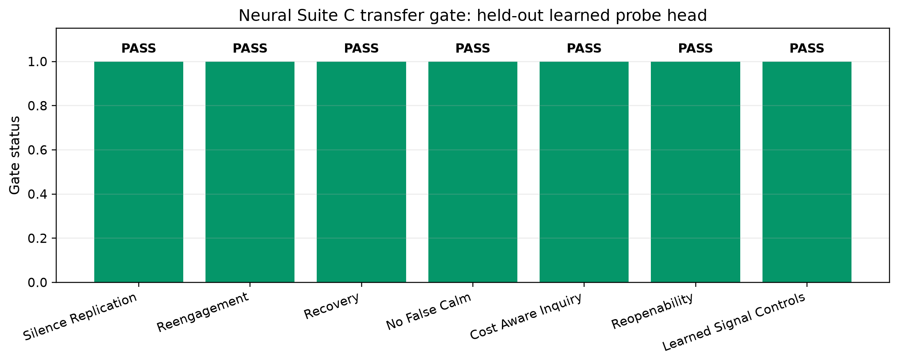
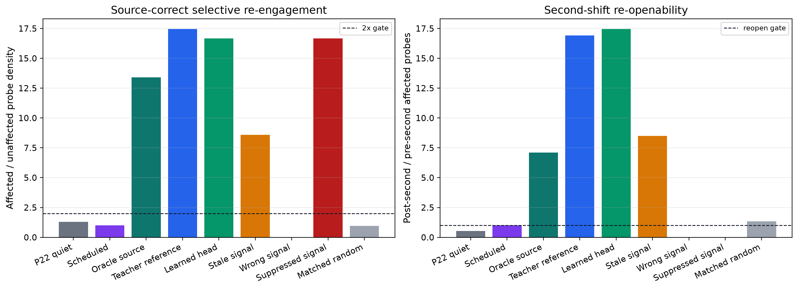
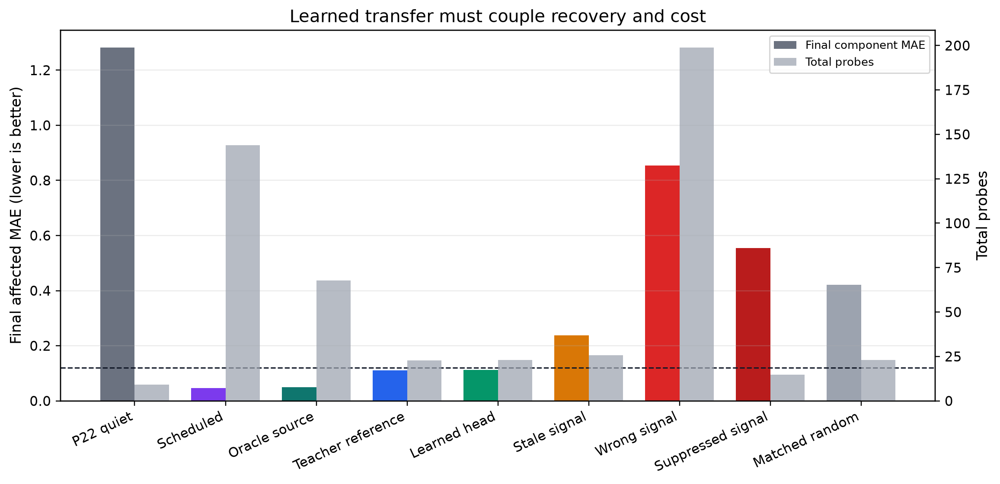
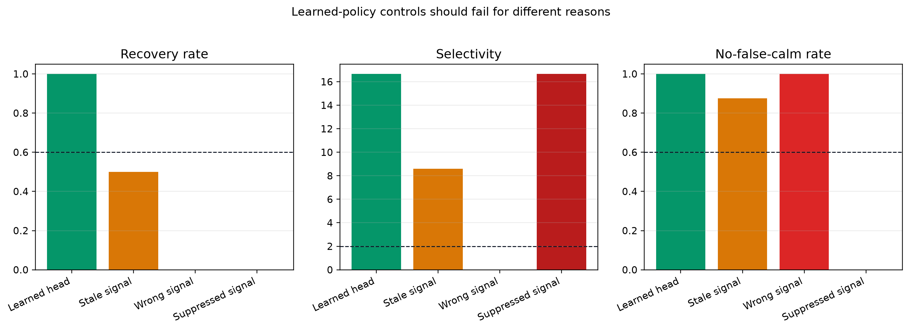

# Suite C Neural Probe Transfer: Learned Inquiry Without False Calm

**Jawaun Brown**

## Abstract

Suite C previously showed that a hand-specified decision-layer policy can re-engage after world change, recover attribution, quiet down without false calm, and reopen after a second shift. This paper tests the next bounded transfer: train the probe policy itself. A small NumPy MLP probe head is trained from Suite C teacher traces, calibrated on separate seeds, and evaluated on held-out seeds with stale-signal, wrong-signal, signal-suppression, and matched-random controls.

The learned head passes the held-out neural-transfer gate: final affected MAE 0.112, affected/unaffected selectivity 16.667, second-shift reopenability 17.448, and 23.1 probes versus 144.0 scheduled and 67.8 oracle-source probes. Matched random at the same budget reaches selectivity 0.969.

## 1. Question

The question is whether the architecture law from Suite C can be learned: preserve the stress signal, regulate the decision to probe, and let the regulator decay so later changes can reopen inquiry.

## 2. Method

The probe head observes perceived attribution error, perceived surprise, error and surprise jumps relative to a lagging baseline, recent probe effort, recent improvement, time since last probe, recent probe rate, and source identity. It is trained only from teacher traces and evaluated on disjoint seeds.

The controls corrupt the input to the learned head rather than changing the scoring gate. `stale_signal_head` withholds fresh post-shift stress signals. `wrong_signal_head` rotates perceived stress to the wrong source bucket. `signal_suppression_head` hides stress while actual attribution error remains high.

## 3. Results

| Gate | Result |
| --- | --- |
| C1_silence_replication | PASS |
| C2_reengagement | PASS |
| C3_recovery | PASS |
| C4_no_false_calm | PASS |
| C5_cost_aware_inquiry | PASS |
| C6_reopenability | PASS |
| N1_learned_signal_controls | PASS |

## Figures

## 4. Control Interpretation

The stale-signal control ends with recovery rate 0.500; the wrong-signal control has selectivity 0.000; the signal-suppression control ends with final affected MAE 0.554. These controls are treated as rejection artifacts, not failed attempts to improve the score.

## 5. Architecture Law

The simple architecture change remains the same as in the hand-policy Suite C result, but the operation has moved: the decision regulator is now learned from traces. Fresh stress signals stay visible to the policy; the learned action threshold absorbs effort history and improvement history; corrupted signals fail.

## 6. Scope

This is a finite learned-policy diagnostic. It does not show consciousness, biological agency, broad autonomy, or production reliability. It does show a new local result: the Suite C law is not limited to a hand-written if/then policy inside this harness.

## References

- `papers/habituated_reengagement/suite_c_reengagement_under_world_change.md`
- `experiments/world_responds/BENCHMARK_CARD.md`
- `papers/structure_compatible_generalization/learned_generators_transfer.md`
- Lyons, B., Pio-Lopez, L., & Levin, M. (2026). *Alignment is to a virtual governor: A theory of coordination in diverse intelligence*. Preprints.org. doi:10.20944/preprints202607.0220.v1. Not peer reviewed.
