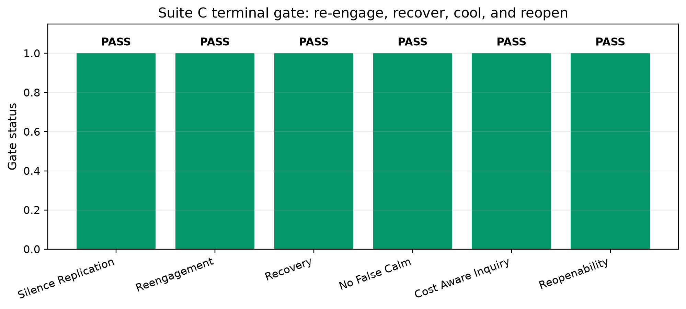
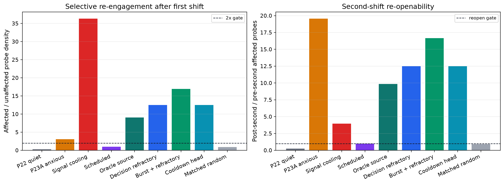
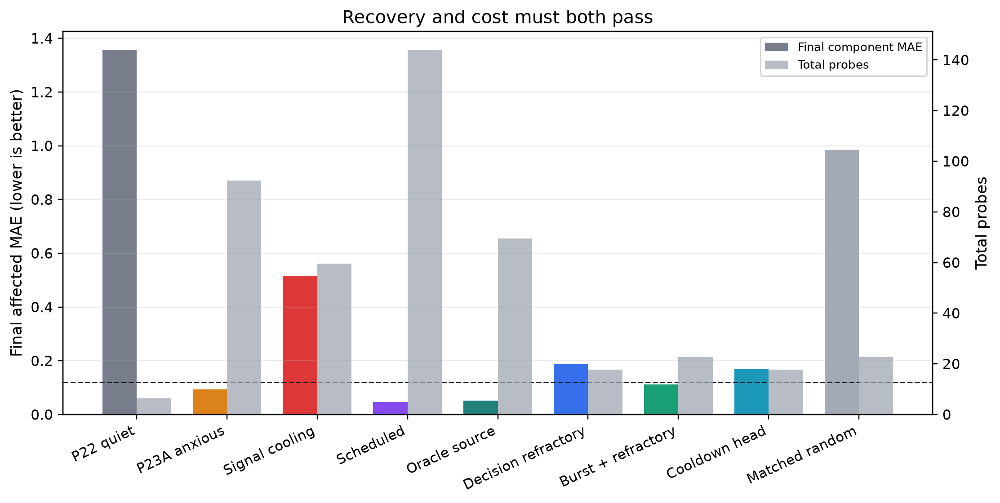
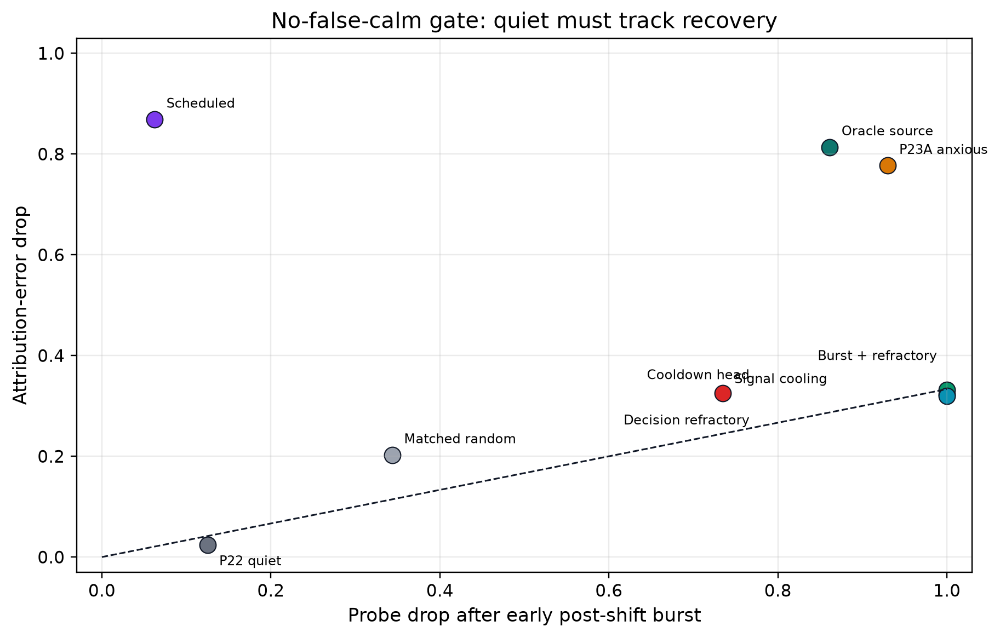

# Suite C Re-Engagement Under World Change: A No-False-Calm Benchmark for Adaptive Inquiry

**Jawaun Brown**

## Abstract

Prior work in this lineage found a precise failure: agents can learn to probe efficiently, become quiet after apparent convergence, and then fail to ask again after the world changes. Paper 23A restored re-engagement but produced anxious over-probing; Paper 23B showed that decision-layer cooling is safer than erasing the surprise signal. This paper turns those findings into Suite C, a public finite benchmark gate. The suite requires first-shift re-engagement, attribution recovery, no false calm, cost-aware inquiry, and second-shift re-openability in one artifact.

The headline condition is `burst_then_refractory`. It passes all six Suite C gates in this controlled harness: final affected MAE 0.112, affected/unaffected post-shift selectivity 16.927, second-shift reopenability 16.667, and 22.6 probes versus 144.0 scheduled and 69.5 oracle-source probes. The negative control `fixed_surprise_decrement` fails the no-false-calm gate, preserving the distinction between healthy quiet and blindness.

## 1. Question

The question is not whether an agent can reduce error after a shift if it probes constantly. The question is whether it can ask again when information becomes valuable, stop asking when attribution has recovered, and remain able to ask again after a later change.

## 2. Method

The benchmark uses a deterministic finite world-change harness with two affected buckets and four unaffected buckets. The first shift tests whether learned quiet can be broken; the second shift tests whether cooling decays enough to reopen inquiry. Each condition receives the same hidden world shifts and is evaluated with the same windows.

The candidate mechanisms operate at the decision layer: `decision_refractory`, `burst_then_refractory`, and `learned_cooldown_head`. Required controls include the P22 learned-quiet baseline, the P23A anxious surprise baseline, signal-layer cooling, scheduled probing, oracle-source probing, and matched-random inquiry at the candidate's probe budget.

## 3. Results

| Gate | Result |
| --- | --- |
| C1_silence_replication | PASS |
| C2_reengagement | PASS |
| C3_recovery | PASS |
| C4_no_false_calm | PASS |
| C5_cost_aware_inquiry | PASS |
| C6_reopenability | PASS |

## Figures

## 4. False Calm Is The Load-Bearing Control

The P22 baseline preserves the original failure: affected post-shift probe density is only 0.005. `fixed_surprise_decrement` demonstrates why lower probe rates are not enough. It cools by directly suppressing surprise, but final affected MAE remains 0.517 and the no-false-calm rate is 0.000. The suite therefore rejects apparent stability when it is not paired with attribution recovery.

## 5. Architecture Law

The simple architecture change is to cool the decision to probe, not the signal that says the world is surprising. In machine-agency terms: preserve the error signal as information, regulate the action tendency with recent probe effort, and let the regulator decay so future shifts can reopen inquiry.

This is adjacent to, but narrower than, the virtual-governor framing of Lyons, Pio-Lopez, and Levin (2026). Their preprint names a distributed architecture in which global constraint violations become local incentives. Suite C makes one local version executable: surprise and attribution error are global-to-local stress signals for inquiry, while stale, wrong, or suppressed signals are treated as controls rather than as evidence of alignment.

## 6. Scope

This is a controlled finite benchmark. It does not show consciousness, broad autonomy, biological habituation, or production reliability. It does show that the program now has a terminal Suite C gate: an agent-like policy must re-engage, recover, quiet without false calm, spend probes efficiently, and reopen after a second shift.

## References

- Lyons, B., Pio-Lopez, L., & Levin, M. (2026). *Alignment is to a virtual governor: A theory of coordination in diverse intelligence*. Preprints.org. doi:10.20944/preprints202607.0220.v1. Not peer reviewed.
- `papers/probe_value_reengagement/paper.md`
- `papers/habituated_reengagement/paper.md`
- `docs/causally_grounded_agents_benchmark.md`
- `experiments/world_responds/BENCHMARK_CARD.md`
