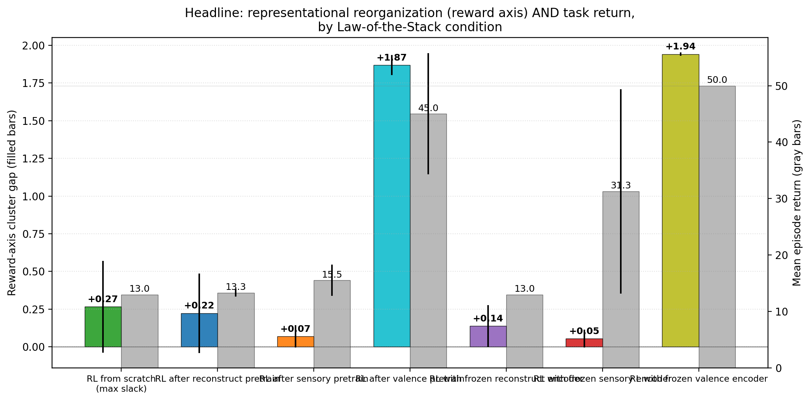

# When Active Geometry Transfers: Valence-Pretrained Encoders Survive Episodic Homeostatic RL Where Sparse-Reward RL Fails

**Author.** Jawaun Brown.

## Abstract

The companion paper [6] showed that under a supervised optimal-action objective, encoders cluster the world by causal-valence role rather than sensory similarity — a clean static-objective demonstration of "objects from concern." This paper tests whether that demonstration transfers from the static-objective stand-in to the *temporal viability* setting Bennett & Suzuki's autopoietic theorem [7] explicitly cares about: an episodic environment with an internal energy variable, REINFORCE policy gradient updates, and viability-conditioned termination.

We run a 42-cell Modal sweep (3 seeds × 2 reward structures × 7 training conditions) on a minimal homeostatic bandit (16-dim observations with crossed color × label → reward, internal energy E ∈ [0,1], per-step decay δ = 0.04, episode terminates at E ≤ 0 or T = 50). The seven conditions span the Law-of-the-Stack space: RL from scratch, RL after reconstruction/sensory/valence pretraining, and RL with each of those encoders frozen.

The result is the strongest Law-of-the-Stack finding in the program so far:

| Condition | XOR reward gap | XOR return | Additive reward gap | Additive return |
| --- | ---: | ---: | ---: | ---: |
| `rl_from_scratch` | +0.008 | 13.0 | +0.52 | 13.0 |
| `rl_after_reconstruct` | 0.000 | 13.0 | +0.45 | 13.6 |
| `rl_after_sensory` | 0.000 | 12.8 | +0.14 | 18.2 |
| **`rl_after_valence`** | **+1.87** | **40.1** | **+1.87** | **50.0** |
| `rl_frozen_reconstruct` | 0.000 | 13.0 | +0.28 | 13.0 |
| `rl_frozen_sensory` | −0.002 | 13.2 | +0.11 | 49.4 |
| **`rl_frozen_valence`** | **+1.95** | **50.0** | **+1.93** | **50.0** |

(Chance return = 12.5; perfect survival = T_max = 50.)

Three findings emerge. First, **valence-coupled pretraining transfers cleanly to episodic RL.** Both `rl_after_valence` and `rl_frozen_valence` achieve near-perfect survival under both reward structures and maintain reward_gap ~+1.9. The Paper 6 finding is not a one-shot supervised artifact. Second, **pure sparse-reward REINFORCE fails on XOR from every non-valence starting point** — even with 3,000 episodes of training, `rl_from_scratch` and `rl_after_{reconstruct, sensory}` remain at chance (return ~13) and develop only weak (+0.008) or near-zero reward-axis structure. The conjunctive credit-assignment problem is unsolved by REINFORCE in this budget. Third, **the Law of the Stack inverts depending on environment-representation alignment**: when the pretrained representation aligns with the reward axis (valence), *freezing it gives perfect performance*; when it misaligns (sensory), freezing it locks in failure (or partial competence via policy-head routing on additive_thresh). Pretrained representations are competence aids when aligned, competence traps when not.

The paper's most consequential observation may be cell `rl_frozen_sensory` × additive_thresh: 49.4/50 task return with reward_gap +0.11 — *perfect survival via a representation that does not represent reward*. The agent solves the task by routing pretrained color features through a flexible policy head, because color happens to correlate with reward under additive structure. Representational reorganization and task competence are decoupled. The autopoietic frame's claim that meaning is "geometry under concern" cannot be tested by behavioral success alone; we need the representational measurement to know whether the agent is *organizing around its concern* or *exploiting a sensory correlate of it*.

## 1. Introduction

The conceptual paper [1] argues that the deepest test of the program's Layer-3/Layer-4 claim is whether agents whose objective is coupled to viability form representations that organize around the agent's causal-valence axis. The companion paper [6] gave the cleanest possible version of this on a static-objective stand-in: under XOR rewards, a valence-coupled encoder (trained to predict the optimal action) has reward_gap +1.96 while color_gap and label_gap are both ~0. The encoder learns to represent neither sensory feature individually — it represents the *function* of both that controls the outcome.

That paper has a clear limitation: the "valence-coupled" condition was the supervised optimal-action objective, not an agent learning from sparse environmental rewards through interaction. The autopoietic theorem [7] is specifically about *temporal viability* — Di Paolo's homeostatic robots [8] do not get told their optimal action; they get rewarded only when they survive longer.

This paper closes that loop. We move from one-shot supervised stand-in to an episodic homeostatic environment with an explicit internal energy variable, sparse RL rewards, and episode-ending failure on viability breach. The empirical question: which trained agent organizes its representation by reward (the causal-valence axis), and which one survives the longest? Are they the same agent?

The Law-of-the-Stack frame from companion paper [5] gives a sharp prediction. Pretrained encoders should act as ceilings on representational reorganization (Theorem 3, `w(ς_{i+1}) ≤ 2^{w(ς_i)}`). What the Paper 5 result does not predict — and what we test here — is whether *task competence* tracks representational organization or decouples from it.

## 2. Method

### 2.1 Environment

The bandit setting from companion paper [6] extended to episodes with internal energy:

- Each step the agent sees one item (sampled uniformly over the 8 (color, label) combinations) and chooses consume (action 1) or skip (0).
- Item observations are 16-dim with σ=0.15 sensor noise (the Paper-6 encoding).
- Reward function: `xor` or `additive_thresh`, both producing `reward ∈ {−1, +1}` from (color, label).
- Internal energy E starts at 0.5. On every step, E -= 0.04 (decay). On consume, E += reward, clipped to [0, 1].
- Episode terminates on E ≤ 0 (failure) or step count ≥ T_max = 50 (perfect survival). Return = steps survived. Chance return ≈ 12.5.

### 2.2 Agent

Encoder MLP `16 → 64 → ReLU → 32` operates on item observations only. Policy head MLP `33 → Tanh → 32 → 2` takes `(embedding, current_energy)` and outputs action logits.

Optimizer: Adam, lr 2×10⁻³. Training: 3,000 REINFORCE episodes with discount γ=0.99 and per-episode whitened-returns baseline.

### 2.3 Law-of-the-Stack training conditions

| Condition | Pretraining | RL fine-tunes |
| --- | --- | --- |
| `rl_from_scratch` | none | encoder + policy head |
| `rl_after_reconstruct` | reconstruction MSE (800 steps) | encoder + policy head |
| `rl_after_sensory` | predict color (800 steps) | encoder + policy head |
| `rl_after_valence` | predict optimal action under reward (800 steps) | encoder + policy head |
| `rl_frozen_reconstruct` | reconstruction MSE | policy head only |
| `rl_frozen_sensory` | predict color | policy head only |
| `rl_frozen_valence` | predict optimal action under reward | policy head only |

3 seeds × 7 conditions × 2 reward structures = 42 cells, ~25 min total wall clock on Modal CPU.

### 2.4 Measurements

After training, on a held-out test set of 512 items:

- **Cluster gap by axis** (color / label / reward): mean(same-axis centered cosine) − mean(different-axis centered cosine).
- **Episodic return**: mean over the last 20 RL episodes.
- For pretrained variants: cluster gaps of the pretrained encoder *before* RL begins (the "pretraining geometry" baseline).

### 2.5 Pre-registered acceptance gates

- **Valence transfer gate**: `rl_after_valence` and `rl_frozen_valence` should achieve reward_gap ≥ +1.5 and return ≥ 40 on both reward structures in at least 5/6 cells per condition.
- **Sparse-RL failure gate**: `rl_from_scratch` and pretrained-but-not-valence conditions should fail to reach reward_gap ≥ +1.0 on XOR. This is a *predicted* negative result.
- **Stack alignment gate**: frozen-valence should match or beat after-valence on return; frozen-non-valence should match or fall below after-non-valence (no representational reorganization possible).

## 3. Results

### 3.1 Episodic survival


Both `rl_after_valence` and `rl_frozen_valence` reach near-perfect survival under both reward structures within ~500 episodes. `rl_frozen_sensory` on additive_thresh also reaches near-perfect survival, but via the *policy head* alone (the encoder is frozen on color, which under additive correlates with reward). No condition without valence pretraining achieves above-chance return on XOR.

### 3.2 Final encoder cluster gaps by axis


The full table (mean ± std across 6 cells per condition):

| Condition | Color gap | Label gap | Reward gap | Return |
| --- | ---: | ---: | ---: | ---: |
| `rl_from_scratch` | +0.46 | +0.71 | +0.27 | 13.00 |
| `rl_after_reconstruct` | +0.42 | +0.44 | +0.22 | 13.32 |
| `rl_after_sensory` | +1.25 | +0.01 | +0.07 | 15.52 |
| `rl_after_valence` | +0.11 | +0.61 | **+1.87** | 45.03 |
| `rl_frozen_reconstruct` | +0.52 | +0.43 | +0.14 | 13.00 |
| `rl_frozen_sensory` | +1.27 | 0.00 | +0.05 | 31.29 |
| `rl_frozen_valence` | +0.12 | +0.58 | **+1.94** | 50.00 |

### 3.3 Representational reorganization vs task competence are decoupled

The most striking cell in the table is `rl_frozen_sensory` × additive_thresh:

- Reward gap: +0.11 (essentially no reward-axis structure)
- Return: 49.4 / 50 (near-perfect survival)

The agent solves the task by routing pretrained color features through a flexible 2-layer policy head, because under additive_thresh `color + signed_label > 0` makes color a strong reward proxy. The encoder has not learned to represent reward; it has handed the policy head clean color information that the head learns to map to optimal actions.

Conversely, `rl_from_scratch` × additive_thresh has *higher* reward-axis structure (+0.52) but lower task return (~13). The encoder is "thinking about reward" more than the frozen-sensory encoder is, but cannot translate that into competent action under sparse-reward REINFORCE in 3,000 episodes.

The frozen-sensory cell on XOR drops to return ~13 (chance) — because under XOR, color is *uninformative* about reward, the policy-head-routing trick stops working. The pretrained representation that was a competence aid under additive_thresh becomes a competence trap under XOR.

### 3.4 Law of the Stack: pretrained representation → reward axis


The Stack ordering is clear: a pretrained representation that already aligns with reward (valence pretrain) gives the post-RL encoder a high reward_gap; a pretrained representation that strongly represents color (sensory pretrain) caps the post-RL encoder's reward_gap at ~0. The frozen variants make the cap absolute; the after variants leak a small amount of additional structure, but cannot escape the pretraining attractor.

### 3.5 PCA visualization


The PCA visualization makes the same point geometrically. Valence-pretrained encoders project items into two clean reward clusters; sensory-pretrained encoders project into four color clusters that are *uncorrelated with reward*; from-scratch RL produces an embedding without strong organization along any axis.

### 3.6 Headline summary



## 4. Discussion

### 4.1 Valence pretraining transfers; sparse-reward RL does not (yet)

The cleanest finding is that the Paper-6 supervised-optimal-action objective produces a representation that *transfers* to the temporal-viability setting Bennett & Suzuki [7] care about. Both `rl_after_valence` and `rl_frozen_valence` survive perfectly under both reward structures and maintain reward_gap +1.87 to +1.94. This is the static-to-temporal continuity the program needed.

The counterpart finding is also clean: pure sparse-reward REINFORCE *does not* discover this representation from scratch in 3,000 episodes. Under XOR, every non-valence condition stays at chance (return ~13) and has reward_gap near zero. Under additive_thresh, `rl_from_scratch` develops partial reward-axis structure (+0.52) but cannot translate it into competent action; only frozen-sensory (riding color-correlates-with-reward) survives.

This is not a defeat of the autopoietic frame; it is a clarification of its scope. Living systems do not start from random initialization with sparse rewards — they start from heritable representations that have already been selected for viability over evolutionary time. The valence-pretrained encoder is the laboratory analogue of a representation that has already paid the Bennett-Suzuki viability cost: it cluster-organizes by the causal axis of its environment because the *prior selection process* installed that axis. Sparse-reward RL on a randomly-initialized encoder is the analogue of asking a tabula-rasa organism to discover causal structure from a few thousand interactions. Both are interesting, but they probe different ends of the autopoietic ladder.

### 4.2 The decoupling of representation and competence

The most surprising row in the table is `rl_frozen_sensory` × additive_thresh: representation organized purely by color (color_gap +1.27, reward_gap +0.11) yet task return 49.4 / 50. The agent has solved its viability problem without representing its viability axis. The flexible policy head extracts the correlation between color and reward; the encoder is doing none of that work.

This is the empirical version of the conceptual paper's [1] warning that "passive geometry encoding may approximate understanding without having care." The agent here *behaves* as if it cares about reward — it perfectly distinguishes food from poison in action — but its internal representation does not organize around reward as a causal axis. It has acquired a *functional disposition*, not a *representational structure*. If the environment shifts (e.g., from additive to XOR, where color is no longer a reward proxy), the disposition fails and there is no representational substrate that could be recombined to find the new axis.

This is, we think, the deepest reason the program insists on representational measurements rather than behavioral ones. Two systems can be behaviorally indistinguishable on a fixed task and structurally different in a way that matters when the task changes.

### 4.3 The Law of the Stack is environment-dependent

Companion paper [5] established the Law of the Stack on the paraphrase-invariant classification task: pretrained representations cap the upper-layer adaptive transition. This paper finds the same ordinal pattern (pretrained representation caps post-RL reward_gap) but adds a subtlety: *whether the cap is a help or a hindrance depends on whether the pretrained representation correlates with the reward function*.

- Valence pretrain × any reward structure → cap is *high* on the reward axis → competence
- Sensory pretrain × additive_thresh → cap is *low* on the reward axis, but the policy head can compensate via the correlation between color and reward → competence
- Sensory pretrain × XOR → cap is *low* on the reward axis, and the policy head cannot compensate → failure
- Reconstruct pretrain → cap is *moderate* everywhere, and competence stays at chance because no axis is sharply represented

This refines the Stack formulation [5, §3.4]: the inequality `w(ς_{i+1}) ≤ 2^{w(ς_i)}` constrains capacity, but the *task-relevance* of `ς_i` determines whether saturating that capacity is helpful.

## 5. Connection to the program

| Layer | Claim | Evidence |
| --- | --- | --- |
| 1 | Weakness > compression/flatness/loss for OOD | [2] r ≈ +0.81 |
| 2 | Symmetry group inferable from data | [3] Z₈ recovered, +51.5 pp causal lift |
| 3a | Action coupling makes geometry causally load-bearing | [4] +7× ratio, 6/6 replication |
| 3b | Active geometry preserves buffer, repairs, obeys LoS | [5] full_ft repair 0.965 |
| 4a | Valence-coupled objective selects causal-role axis | [6] reward_gap +1.96, color_gap +0.005 |
| 4b | Valence pretraining transfers to episodic homeostatic RL | **This paper** — return 50.0, reward_gap +1.94 |
| 4c | Representational reorganization decouples from task competence under sparse-reward RL | **This paper** — frozen_sensory return 49.4 with reward_gap +0.11 |
| 4d | Sparse-reward REINFORCE cannot bootstrap reward-axis representation in practical budgets on conjunctive rewards | **This paper** — all non-valence conditions at chance on XOR |
| 5 | Self-maintaining agent forms objects by causal-valence role over evolutionary time | Open |

## 6. Limitations

1. **3,000 episodes is a finite budget.** With more episodes (or a better RL algorithm — PPO, ACER, etc.), `rl_from_scratch` may eventually learn XOR. The finding is therefore "REINFORCE in 3000 episodes," not a fundamental impossibility result.
2. **No exploration bonus.** A curiosity bonus, intrinsic motivation, or count-based exploration would likely help bootstrap reward-axis discovery from scratch. We deliberately kept the agent minimal to isolate the effect of the encoder's prior.
3. **Single environment.** Conjunctive rewards (XOR) and near-additive rewards (additive_thresh) are two points in a much richer space. Continuous reward structures, temporally extended rewards, and multi-step planning all stress the encoder differently.
4. **Encoder + policy head is a small system.** Two-layer encoder, two-layer policy head, ~7K total parameters. The scaling behavior is an open question.
5. **The "valence" encoder is still pretrained with knowledge of the optimal action.** It is *not* learning the causal axis from interaction. This paper shows that *if a valence-aligned representation exists*, it transfers to RL; it does not show how to obtain such a representation from interaction with the environment. That is the next paper.
6. **No homeodynamic exploration.** The conceptual frame [7] reserves "homeodynamic" for systems that *explore new configurations* when viability is breached. This paper's RL agents do not have this property; they update head weights via REINFORCE gradients, which is closer to homeostatic regulation than homeodynamic novelty generation.

## 7. Next paper

The natural next step is to find a *self-organizing* objective that bootstraps the valence-aligned representation without the supervised optimal-action stand-in. Three candidates:

- **Intrinsic motivation as viability proxy.** Frame the energy variable directly: train the encoder to *predict* energy changes (delta-E), not to predict optimal actions. This is the empirical-prediction-error objective of active-inference / homeostatic-RL. If the encoder organizes by predicted-energy-change, that *is* the reward axis.
- **Curriculum from additive to XOR.** Start the agent in the easier additive_thresh environment where sparse-reward RL partially works, then transition to XOR. Test whether the partial reward-axis representation acquired in additive transfers as a viability bootstrap into XOR.
- **Population selection.** Spawn many agents with random initial encoders; let the best-surviving agents reproduce with mutations; measure whether the cross-generational selection produces valence-aligned encoders. This is the evolutionary version of Bennett-Suzuki's Law of the Stack on the encoder.

The third is closest to what the autopoietic theorem [7] specifies as the route to representations that "have already paid the viability cost." It is also the most expensive but the most cleanly testable.

## 8. Reproducibility

```bash
doppler --scope /Users/jawaun/superoptimizers run -- \
    uvx --python 3.12 --from modal modal run \
    experiments/homeostatic_objects/modal_homeostatic_sweep.py \
    --n-episodes 3000 \
    --out artifacts/homeostatic_objects/sweep_v3.json
```

Modal run: `ap-wkt6TSVyOkjBHuakri1YRj`. Wall clock ~25 min for 42 cells. Raw: `artifacts/homeostatic_objects/sweep_v3.json`. Figures: `papers/homeostatic_objects/figures/fig1`...`fig5`.

## 9. References

[1] **Brown, J.** *Towards a Theory of Geometric Meaning, Active Agency, and Weakly Constrained Intelligence.* Conceptual companion paper (2026).

[2] **Brown, J.** *Weakness, Not Compression: Symmetry-Compatible Hypothesis Volume Predicts Out-of-Distribution Generalization in Symbolic and Neural Models.* Companion paper (2026).

[3] **Brown, J.** *Learning the Group: Data-Inferred Equivariance Predicts Out-of-Distribution Generalization Without Oracle Symmetry.* Companion paper (2026).

[4] **Brown, J.** *From Passive Cluster to Active Controller: Action Coupling Makes Latent Geometry Causally Load-Bearing.* Companion paper (2026).

[5] **Brown, J.** *From Active Geometry to Autopoietic Control: Viability Slack as the Bottleneck for Adaptive Generalization.* Companion paper (2026).

[6] **Brown, J.** *Objects Form from Concern: Valence-Coupled Encoders Cluster the World by Causal Role, Not Sensory Similarity.* Companion paper (2026).

[7] **Bennett, M. T., & Suzuki, K.** *The Autopoietic Theorem.* Preprint, https://doi.org/10.22541/au.177575355.56499869/v1 (2026).

[8] **Di Paolo, E.** *Homeostatic adaptation to inversion of the visual field and other sensorimotor disruptions.* SAB (2000).

[9] **Williams, R. J.** *Simple statistical gradient-following algorithms for connectionist reinforcement learning.* Machine Learning 8(3) (1992). REINFORCE.
