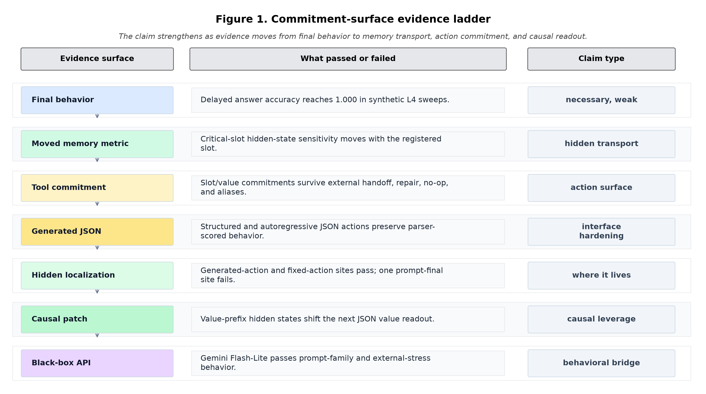

# Future Control Moves Memory: A Long-Horizon Moved-Bottleneck Diagnostic for Synthetic Agents

**Jawaun Brown**
2026-07-06

## Abstract

This paper asks a narrow question about finite neural agents: when one early
state variable becomes future-critical for a delayed decision, does the agent's
memory geometry become specifically sensitive to that variable, and does that
sensitivity move when the critical variable moves?

We introduce the **long-horizon moved-bottleneck diagnostic**. Four early clue
slots are matched for salience and frequency. One slot is selected as the
future-critical bottleneck, moved across registered positions, and queried only
after a long delay. The primary metric is not just final accuracy; it is the
relative displacement of the final hidden state under single-slot bit flips.
The registered gate requires the final-state sensitivity peak to follow the
moved critical slot while remaining absent in a visible-control condition.

The result is positive across a ladder of increasingly agent-like synthetic
regimes. A transformer on Modal `L4` solves the base delayed-memory task,
survives longer horizons through sequence length 384, and preserves the moved
bottleneck through closed-loop external-state handoff, repair after tool error,
parsed structured calls, multi-field tool schemas, stochastic API failures, an
8-slot larger argument namespace, an alias-rich argument surface, parser-facing
text arguments, fixed-length generated JSON strings, and autoregressively
decoded JSON-like action strings. Across the confirmed Modal reports, the
relevant bottleneck groups reach 1.000 closed-loop accuracy and positive
moved-slot specificity, while visible controls keep specificity near zero.

The first prompt-level transfer produced a useful controlled strong negative at
one hidden site: `Qwen/Qwen2.5-0.5B-Instruct` emits valid parser-scored JSON
actions and passes the behavioral gates, but final-prompt hidden specificity is
not confirmed. A follow-up localization sweep resolves that ambiguity. Across
`Qwen/Qwen2.5-0.5B-Instruct`, `Qwen/Qwen2.5-1.5B-Instruct`, and
`HuggingFaceTB/SmolLM2-1.7B-Instruct`, all behavior controls pass and 17
registered hidden sites pass. The strongest signal appears at final generated
JSON tokens, with additional late/final prompt-token sites passing for Qwen
1.5B.

The diagnostic now also has a black-box API surface. A dependency-free
evaluator emits JSONL rows and scored summaries for fixture, Gemini,
Anthropic, OpenAI, and OpenAI-compatible providers. A matched follow-up across
`gemini-3.1-flash-lite`, `claude-haiku-4-5-20251001`, and `gpt-4.1-nano`
passes the registered prompt-family behavior suite for all three providers.
The external-stress suite is mixed: Gemini and Anthropic pass, while OpenAI
GPT-4.1 Nano gives a controlled strong negative on two `dispatch` cells. A
Modal CPU robustness follow-up narrows that negative to one reproduced cell out
of 16 `(stress, critical slot)` cells. This is behavioral evidence only, not
hidden-state evidence.

The allowed claim is deliberately modest: in this synthetic neural-agent
setting, **future control relevance can move finite memory-state and
tool-commitment sensitivity**. This is not a production-agent reliability or
consciousness claim. Its value is as a cheap, reproducible diagnostic for
whether an agent's internal state, generated action trajectory, or black-box
tool-call behavior tracks the variables that will later control action.

The architecture lesson is equally bounded: memory becomes most agent-relevant
where it is coupled to a future commitment surface. In these experiments, the
critical variable matters because it must later be selected, emitted, repaired,
or patched at an action/value interface.

## 1. Motivation

Many long-horizon agent evaluations ask whether an agent eventually gives the
right answer. That is necessary but weak. A system can succeed by a shortcut,
by storing everything uniformly, by using local query cues, or by relying on a
privileged final token. The moved-bottleneck diagnostic tests a sharper
property: whether the agent's internal memory metric follows the variable that
will matter later.

This matters for three fields.

1. **Interpretability:** it gives a controlled way to ask where future-relevant
   information lives in a model's hidden state.
2. **Agent evaluation:** it tests delayed commitment and repair, not just
   answer selection at the final step.
3. **Safety and monitoring:** it suggests a cheap diagnostic for variables that
   silently become control bottlenecks in long-horizon systems.

The experiment is intentionally synthetic. That is a feature, not a defect, for
this stage: the task isolates memory transport, critical-variable movement, and
tool-interface hardening before introducing the confounds of natural language
and real APIs.

## 2. Diagnostic Design

Each episode contains matched early clues:

```text
slot_0: bit b0
slot_1: bit b1
slot_2: bit b2
slot_3: bit b3
...
delayed query
```

In the `bottleneck` condition, the correct final action is the bit at one
registered critical slot. The critical slot is moved across runs. In the
`visible_control` condition, the final answer is visible at the query token and
the early clues are matched distractors.

For each trained cell, the metric intervention flips one early clue bit at a
time and measures the final hidden-state displacement. Slot densities are
z-scored within model. The primary specificity statistic is:

```text
z_density(critical_slot) - mean z_density(noncritical_slots)
```

The core gates are:

- behavior: bottleneck accuracy at least 0.90;
- metric transport: bottleneck memory-specificity CI lower bound above zero;
- rank: the critical slot ranks above chance among registered slots;
- visible-control null: visible-control specificity remains below 0.50.

The tool-interface regimes add gates for committed slot/value accuracy, schema
validity, parsed action validity, repair behavior, stochastic failure handling,
and no-op behavior after successful first calls.

## 3. Evidence Ladder

The experiment was advanced through a sequence of regimes. Each regime keeps
the moved critical slot and visible-control null, then changes one surface of
the agent's interaction with future-relevant information.

| Regime | What changed | Cells | Key signal | Report key |
|---|---|---:|---|---|
| Base moved bottleneck | Delayed query over four matched clue slots | 64 | Bottleneck final accuracy 1.000; memory specificity +2.309; visible null | `base` |
| Horizon stress | Delay lengths 128, 256, 384 | 96 | All lengths preserve final accuracy 1.000 and moved-slot specificity | `horizon` |
| Closed-loop tool handoff | Model commits slot/value to recover external state | 32 | Tool bottleneck final accuracy 1.000; slot/value commitment 1.000 | `commit` |
| Repair bottleneck | First tool attempt receives an error; model must repair | 48 | Repair condition final accuracy 1.000; repair slot/value 1.000 | `repair` |
| Structured tool call | One parsed JSON-like action token replaces direct heads | 48 | Direct and repair structured calls pass schema and parsed-slot gates | `structured` |
| Multifield schema | Separate opcode, slot, and value fields | 48 | Multifield direct/repair groups pass field, schema, and parsed-value gates | `multifield` |
| Stochastic tool failure | First-call success/failure sampled per episode | 32 | Failed repair and success no-op both 1.000; failure rate 0.506 | `stochastic` |
| 8-slot stochastic | Larger argument namespace and longer sequence | 64 | 8-slot stochastic gates pass; memory specificity +3.023 | `8slot` |
| Alias argument surface | Three equivalent aliases per canonical slot | 32 | Alias parsed slot/value, failed repair, and success no-op all 1.000 | `alias` |
| Text argument surface | Parser-facing phrases such as `second clue` replace alias IDs | 32 | Text parsed slot/value, failed repair, and success no-op all 1.000 | `text` |
| Generated JSON surface | Model emits a fixed-length JSON-like token sequence | 32 | Generated sequence/schema, parsed slot/value, and repair gates all 1.000 | `generated_json` |
| Autoregressive JSON surface | JSON action is decoded token-by-token from commit state | 32 | Greedy decoded sequence/schema, parsed slot/value, and repair gates all 1.000 | `autoregressive_json` |
| Prompt JSON transfer | Pretrained open model emits parser-scored JSON text | 64 | Controls and behavior pass; hidden specificity CI crosses zero | `prompt_json_transfer` |
| Prompt JSON hidden localization | Multi-model, multi-layer, multi-token hidden-site grid | 192 behavior cells + 576 hidden rows | Controls and behavior pass for three models; 17 hidden sites pass | `prompt_json_hidden_localization` |
| Prompt JSON fixed-action localization | Teacher-forced constant assistant actions under slot flips | 192 behavior cells + 960 hidden rows | Controls and behavior pass; 24 hidden sites pass after generated action tokens are held fixed | `prompt_json_fixed_action_localization` |
| Prompt JSON causal patch | Patch base hidden state into critical-slot-flipped prompt before JSON value token | 1,536 causal-patch rows | Value-prefix patch sites pass in all three model families; prompt-final sites do not pass | `prompt_json_causal_patch` |
| Prompt-family causal patch | Repeat causal patch over standard, compact, and audit-checklist prompt framings | 4,608 causal-patch rows | All 9 family/model pairs are causally ready and patch-pass | `prompt_json_prompt_family_causal_patch` |
| API black-box prompt-family | One-command provider evaluator over parser-scored JSON actions | 288 rows across 3 providers | Gemini, Anthropic, and OpenAI pass all registered prompt-family behavior cells | `api_blackbox_multi_provider` |
| API black-box external stress | Wider slots, longer gaps, retrieval and dispatch prompt framings | 240 rows across 3 providers | Gemini and Anthropic pass; OpenAI 4.1 Nano yields a controlled `dispatch` strong negative | `api_blackbox_multi_provider` |
| API dispatch robustness | Modal CPU expansion across dispatch stress cells and critical slots | 336 rows; 720 API requests | OpenAI 4.1 Nano failure is sparse: 1/16 cells reproduces and localizes | `api_dispatch_robustness` |

All model-weight sweeps used Modal `L4`, not H100/H200. The API robustness
follow-up used Modal CPU workers and GPT-4.1 Nano API calls. The timeout-based
conservative spend guard for the listed confirmed reports is under USD 190 in
aggregate; individual confirmed model-weight passes used guards of USD 1.08 to
USD 17.26.
Actual runtime was much lower than the timeout budget, with the latest
autoregressive JSON pass averaging 15.08 seconds per remote cell. The
prompt-level transfer used one `L4` container for all 64 logical cells, with a
conservative timeout guard of USD 1.08 and a 212.0 second remote runtime. The
prompt-level hidden-localization sweep used three parallel `L4` model jobs, 192 behavior
cells, 576 hidden rows, and a conservative timeout guard of USD 6.47. The
fixed-action localization counterfactual used the same three parallel `L4`
model jobs, 192 behavior cells, 960 hidden rows, and the same conservative
timeout guard of USD 6.47. The causal-patch pass used three parallel `L4`
model jobs, 1,536 patch rows, and the same conservative timeout guard of USD
6.47. The prompt-family causal-patch robustness pass used three parallel `L4`
model jobs, 4,608 patch rows, and the same conservative timeout guard of USD
6.47. The black-box API runs used provider calls rather than GPUs. The matched
multi-provider follow-up used 792 planned API requests for 528 scored rows:
432 requests for the prompt-family suite and 360 requests for the
external-stress suite.

Report keys map to committed summaries under
`experiments/long_horizon_bottleneck/results/`; the README maintains the full
command ledger.

## 4. Prompt-Level JSON Transfer and Hidden Localization

The autoregressive JSON pass completed the synthetic ladder: the trained model
could decode parser-scored JSON-like action strings token by token under
stochastic first-call failure and conditional repair. The next question was
whether the same diagnostic transfers to a pretrained prompt-level model.

The prompt-level transfer used `Qwen/Qwen2.5-0.5B-Instruct` on one Modal `L4`
container. The model saw natural-language memory records and had to emit one
JSON object:

```json
{"tool":"read_slot","slot":"second clue","value":0}
```

or:

```json
{"tool":"noop"}
```

The confirmatory run used 64 logical cells: 4 conditions, 4 moved critical
slots, and 4 seeds, with 8 episodes per cell. Format, visible-control, and
short-horizon controls passed. The behavioral bottleneck also passed:
closed-loop final accuracy was 0.977, first parsed slot/value were 0.984/0.977,
failed-repair slot/value were 1.000/1.000, and success repair no-op was 1.000.

The full prompt-level gate nevertheless failed by the preregistered hidden
metric. Critical-slot memory specificity was +0.695, but its 95% bootstrap
interval was [-0.376, 2.080], so the lower bound was not above zero. The rank
metric was above chance by mean rank percentile (0.594), but the primary
specificity gate did not pass.

This is a controlled strong negative, not an interface failure. The model can
solve the parser-scored prompt-level moved-bottleneck behavior, including
stochastic repair, but this run does not show reliable hidden-state transport
of the future-critical slot.

The hidden-localization follow-up asked whether that negative was specific to
the measured site. It ran three cheap open models in parallel on Modal `L4`:
`Qwen/Qwen2.5-0.5B-Instruct`, `Qwen/Qwen2.5-1.5B-Instruct`, and
`HuggingFaceTB/SmolLM2-1.7B-Instruct`. The sweep preserved the same behavior
conditions, then measured hidden specificity at `prompt_final`,
`generated_first`, and `generated_final` token positions across early, mid,
late, and final layer aliases.

This run was positive. All behavior controls passed for all three models.
Behavioral bottleneck accuracy was 1.000 for SmolLM2 1.7B, 0.961 for Qwen 0.5B,
and 0.938 for Qwen 1.5B. Seventeen registered hidden sites passed both the
specificity and rank gates. The strongest sites were generated-final states:
SmolLM2 1.7B generated-final/mid had specificity +228.301 with CI
[129.438, 386.540]; Qwen 1.5B generated-final/early had +216.902 with CI
[119.175, 332.137]; and Qwen 0.5B generated-final/early had +183.444 with CI
[99.032, 279.601]. Qwen 1.5B also passed late/final prompt-final sites.

The interpretation is therefore narrower and stronger than the first prompt
run: final behavior transfers, and hidden localization is present in the
generated action trajectory. The original negative was a measurement-site
failure, not evidence that prompt-level hidden geometry is absent.

The fixed-action counterfactual then tested the main confound in that positive
result. For each base prompt and every slot-flipped prompt, the assistant
action tokens were teacher-forced to remain fixed: either `{"tool":"noop"}` or
`{"tool":"read_slot","slot":"<critical slot phrase>","value":0}`. The model
therefore could not reveal the moved slot merely by generating a different
answer string under the counterfactual prompt.

This stricter run was also positive. It used the same three-model `L4` grid,
192 behavior rows, and 960 hidden rows across `prompt_final`,
`fixed_noop_first/final`, and `fixed_read_first/final` positions. Behavior
again passed for all three models. Twenty-four registered hidden sites passed
both hidden gates. Fixed noop final-layer sites passed in all three model
families, with the strongest at Qwen 1.5B `fixed_noop_final/final`
(specificity +12.514, CI [8.035, 18.310], rank 0.984). This removes the simple
generated-answer-token explanation for the localization effect.

Finally, the causal-patch pass asked whether the localized state can shift a
behavior-adjacent readout. The runner appended a partial assistant action prefix
ending immediately before the JSON value token, patched one donor hidden state
from the base prompt/prefix into the critical-slot-flipped prompt/prefix, and
measured the donor-value minus corrupted-value next-token logit margin.

This run was positive across all three model families. Clean prompts preferred
the donor value, corrupted prompts preferred the flipped value, and
`value_prefix_final` late/final patch sites passed in every model. The strongest
site was SmolLM2 `value_prefix_final/final`, with patch effect +7.053 and CI
[6.738, 7.344]; Qwen 0.5B final had +5.503 [5.299, 5.697], and Qwen 1.5B final
had +6.916 [6.375, 7.453]. Prompt-final patch sites did not pass. That negative
control localizes the causal leverage to the action/value prefix state rather
than the raw final prompt token.

The prompt-family robustness pass then repeated the causal-patch grid across
three frozen prompt framings: the original `standard` wording, a `compact`
wording, and an audit-checklist `ledger` wording. This run was also positive.
All 9 prompt-family/model pairs were causally ready and patch-pass. Final-layer
`value_prefix_final` effects remained large: compact Qwen 1.5B had +7.754 with
CI [7.282, 8.234], ledger Qwen 1.5B had +6.648 [6.159, 7.132], and standard
SmolLM2 had +7.049 [6.751, 7.346]. Prompt-final sites remained negative
controls across the robustness grid.

The API black-box evaluator then exposed the same parser-scored behavior as a
public benchmark package. The command `python3 -m
experiments.long_horizon_bottleneck.eval` builds cases, calls a provider
adapter, writes JSONL rows, and writes a scored summary. Deterministic fixture
runs validate the package locally. A matched multi-provider follow-up used
Gemini 3.1 Flash-Lite, Anthropic Haiku 4.5, and OpenAI GPT-4.1 Nano. The
registered prompt-family behavior suite was positive across all three
providers: 288 scored rows, 432 API requests, and all nine provider/family
cells complete, controls-pass, and bottleneck-pass.

The external-stress suite covered 20 stress/family cells per provider over
4-slot and 8-slot settings, gap sizes 8 and 16, and two extra black-box prompt
framings (`retrieval` and `dispatch`). Gemini and Anthropic passed all 20
cells. OpenAI GPT-4.1 Nano produced a controlled strong negative: controls
passed, but two `dispatch` bottleneck cells failed, including a failed-tool
repair value miss in the 8-slot, gap-16 cell. This result adds API-model
behavioral evidence and a provider-specific stress failure surface, but because
the API is black-box it does not add hidden-localization or causal-patch
evidence.

A Modal CPU dispatch-robustness characterization then expanded that OpenAI
`dispatch` follow-up across four stress cells and critical slots 0-3, for 336
scored rows and 720 API requests. The run kept the parser, controls, provider
adapter, repair/no-op phases, and diagnostic variants fixed while comparing the
original dispatch wording against neutral wording, value-copy assistance, and
repair hinting. The result was `sparse_reproduced_localized`: 15 of 16 cells
passed, while only the 8-slot, gap-16, critical-slot-0 cell reproduced as a
failed-repair value miss. Neutral wording, copy assistance, and repair hinting
all passed in the reproduced cell. The allowed interpretation is narrower than
the initial stress negative: this is black-box behavioral localization of a
sparse OpenAI repair-surface pressure point, not a broadly stable dispatch
failure and not a hidden-state mechanism claim.

## 5. Interpretation

The core result is a **metric transport** result. The future-critical variable
does not merely determine the final label; it becomes the slot to which the
agent's final hidden state and commitment heads are specifically sensitive.
When the critical slot moves, the sensitivity peak moves with it. When the final
answer is visible at query time, the early-slot peak disappears.

The tool regimes add a second claim: the moved bottleneck survives when the
agent has to externalize the critical variable through a tool interface. It must
commit an argument, receive or fail to receive an external return, repair when
needed, no-op when not needed, and still preserve the correct delayed decision.

This makes the diagnostic more relevant to long-horizon agents than to ordinary
sequence classifiers. The bottleneck is not just "remember bit 2." It becomes
"know which early variable must later be committed through an interface, recover
it under feedback, and ignore matched distractors."

The prompt-level results sharpen the interpretation. Final behavior alone is
not enough: a small open model can pass the prompt-level JSON behavior while one
registered hidden site fails. But localization across token positions and layers
recovers a positive signal, and the fixed-action counterfactual shows that the
signal can survive even when generated answer tokens are held constant. The
causal-patch pass then shows that the value-prefix state can shift the
behavior-adjacent value-token readout, and the prompt-family pass shows that
this causal leverage survives several controlled wording changes. That split is
the point of the diagnostic: it can distinguish interface behavior,
prompt-state memory, action-surface commitment, causal leverage over the next
action token, and prompt-family robustness.

The API result adds operational evidence: several current black-box models pass
the registered prompt-family suite, and the stress suite can produce useful
provider-specific negatives rather than only confirmations. OpenAI 4.1 Nano
passes the main prompt-family gate but fails narrow `dispatch` stress cells
under passing controls. A robustness follow-up narrows the failure to one
8-slot, gap-16, critical-slot-0 repair surface out of 16 tested cells; neutral
wording, value-copy assistance, and repair hinting pass. This does not locate
state inside any API model; it shows other labs can run the prompts and parser
without local weights, hooks, or GPUs, and that the OpenAI dispatch negative is
sparse rather than broadly stable.

## 6. Architecture Law: Commitment Surfaces

The paper's central design law is:

> A memory trace becomes agent-relevant when future control relevance crosses a
> commitment surface: a decision head, tool argument, generated action token,
> repair branch, or value-token readout.



This is the long-horizon complement to the concern/self-world papers. In the
homeostatic arc, a variable matters when it affects viability and can be
identified through intervention. In this temporal arc, a variable matters when
it becomes a delayed constraint on action. The same methodological discipline
appears in both: do not stop at behavior; test the internal surface where the
claim says the variable should become load-bearing.

The negative controls are part of the law. Visible-control conditions remove
the early-slot memory peak. The first prompt-level hidden site failed even when
behavior passed. Prompt-final causal patch sites do not pass while
value-prefix sites do. Those failures keep the claim from becoming vague. They
say that future relevance is not "stored everywhere"; it is most diagnostic
near the surfaces where the model must commit to the future-relevant value.

This also clarifies the relationship to planning and agency. Planning is not
just retaining a fact over a long context. At minimum, it is retaining a fact in
a form that can control a later choice, tool call, repair, or generated action.
The moved-bottleneck diagnostic tests that exact transition from memory to
commitment.

## 7. Boundaries

The strongest honest statement is:

> Future control relevance can move finite memory and commitment sensitivity in
> a synthetic long-horizon neural agent, and that moved bottleneck survives
> progressively harder parsed tool-interface regimes.

The result does not establish:

- production API reliability;
- autonomous language-agent tool use;
- robustness across arbitrary natural-language prompt families;
- multi-step planning in an open environment;
- human cognition or consciousness.

The latest prompt-level hidden-state result uses real pretrained tokenizers and
teacher-forced/generated JSON text, but it is still a compact harness. The
latest API results use real API models, but only as black-box behavior
surfaces; they do not expose hidden states or production tool execution.

## 8. Why This Is Valuable

The experiment's field value is not that it solves a benchmark. It gives a
small, inspectable test for a pattern that current agent evaluations often miss:
future relevance can reorganize internal memory geometry and action commitment.

A useful follow-on benchmark could ask, for a real agent or language model:

1. Which early facts become future-critical under a delayed objective?
2. Do internal representations or tool-call logits become specifically
   sensitive to those facts?
3. Does that specificity move when the objective moves?
4. Does it remain absent when the answer is visible later?
5. Does it survive tool failure, repair, and aliasing of argument names?

That is a sharper evaluation target than final-task success alone.

## 9. Remaining Work

The synthetic mechanism ladder is complete enough to write up and share:
synthetic behavior, tool commitment, generated JSON, prompt-level behavior,
hidden localization, fixed-action localization, causal patching, prompt-family
robustness, and black-box API behavior all have bounded terminal results.

The next regimes answer different questions: expand dispatch robustness across
model sizes and endpoints; broaden external validity over longer contexts and
paraphrase families; test multi-token or path-level causal mediation; transfer
to real tool traces; add multi-step planning; and compare the metric to
attention, activation patching, and linear probes.

The most valuable immediate next step is to publish the compact benchmark card:
the current package now includes a multi-provider API prompt-family positive and
a provider-specific dispatch stress negative narrowed by robustness follow-up to
one sparse, reproduced repair-surface failure.

## 10. Reproducibility

Experiment code lives in experiments/long_horizon_bottleneck/.

The full reproduction command ledger is maintained in
experiments/long_horizon_bottleneck/README.md. The main entry points are:
modal_stochastic_tool_failure_sweep.py for the synthetic ladder,
modal_prompt_json_transfer_sweep.py for the prompt-level transfer,
modal_prompt_json_hidden_localization_sweep.py for hidden and fixed-action
localization, modal_prompt_json_causal_patch_sweep.py for causal patching,
python3 -m experiments.long_horizon_bottleneck.eval for black-box API
prompt-family and external-stress runs,
python3 -m experiments.long_horizon_bottleneck.api_blackbox_report for the
multi-provider aggregate, and
python3 -m experiments.long_horizon_bottleneck.api_dispatch_characterization
for the targeted dispatch-failure follow-up. The Modal entry point
modal_api_dispatch_robustness_sweep.py runs the multi-slot API robustness grid
on cheap CPU containers.

The raw Modal/API outputs are kept under gitignored artifacts/; committed
result reports in experiments/long_horizon_bottleneck/results/ summarize every
run. Local code verification uses ruff, ty, pyright, compileall, and pytest.
