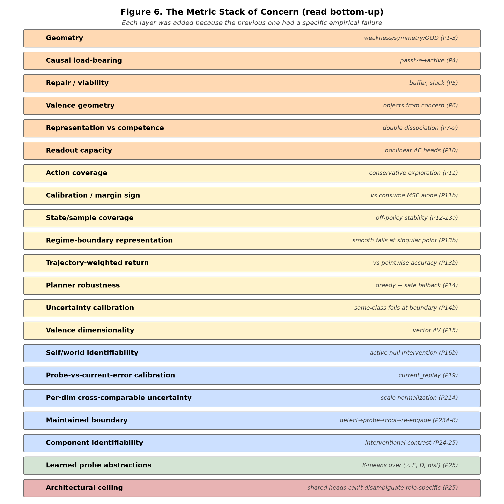
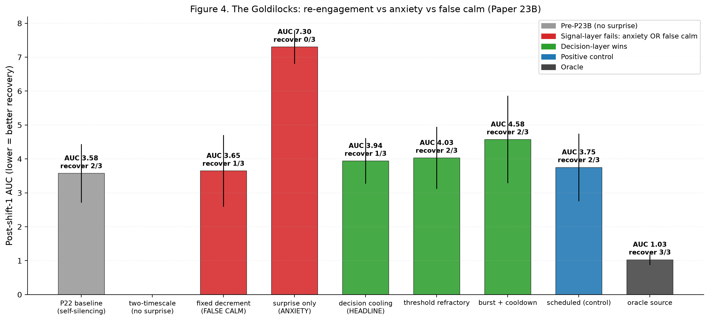

# The Metric Stack of Concern: From Viability Prediction to Maintained Self/World Boundaries in Minimal Agents

**Jawaun Brown**
2026-06-12

## Abstract

We report a 25-paper experimental program in which a minimal homeostatic agent progressively acquires the machinery of autonomous self/world attribution. The agent begins with no notion of self or world, accumulates a stack of internal mechanisms — concern-like representation, vector-valued valence, active null-anchored intervention, calibrated probe selection, decision-layer habituation, learned probe abstractions — and ends at a clearly identified architectural ceiling: shared mediated heads cannot disambiguate role-specific mediated effects regardless of probe-policy design.

The program operationalizes a thesis common to multiple philosophical traditions — that meaning-like structure does not arise from passive representation but from a system's ongoing regulation of what matters for its own continued organization. We make this thesis experimentally tractable by identifying the **metric stack** required for it to become non-vague: geometry, causal load-bearing, repair, valence, competence, ΔE planning, coverage, calibration, identifiability, vector concern, maintained boundary, learned probe abstraction, architectural ceiling.

Each metric was added because the previous one failed. We document a **correction chain** of distinctions: behavior is not representation, representation is not competence, uncertainty is not error, residual scale is not systematic error, current error is not value of probing, re-engagement is not stable re-engagement, total world prediction is not component identifiability, shared head is not role-specific identifiability. The arc concludes when these distinctions reach an architectural rather than a mechanism-level boundary.

The strongest defensible claim:

> In minimal homeostatic bandit settings, concern-like structure can become action-guiding, vector-valued, self/world-identifiable through active intervention, actively maintained under changing world dynamics, and partially decomposed into direct, mediated, and exogenous components. The mechanisms require active intervention, calibrated probe selection, decision-layer habituation, and learned probe abstractions; they fail at a clear architectural ceiling when shared heads must identify role-specific mediated effects.

We do not claim consciousness, full agency, or general intelligence. The contribution is computational and methodological — a working mechanism stack and a metric ladder that makes the philosophical thesis empirically tractable. The autonomous-probing arc reaches its natural endpoint at the architectural ceiling; further closure requires different research questions (disjoint per-role representations, richer interventions, multi-agent or continuous-state environments).

## 1. Introduction

The starting thesis is conceptual: meaning is not merely compression or passive latent geometry. Meaning-like structure appears when differences become salient under concern, and agency-like structure appears when that concern is coupled to action, self-maintenance, boundary preservation, repair, and time. This claim is shared across multiple traditions — Heidegger's care-laden world, Gibson's affordances, Uexküll's Umwelt, the enactive/autopoietic tradition (Maturana, Varela, Thompson, Di Paolo), Ashby's cybernetics, Friston's active inference, Jonas's organism-as-self-concern, Vervaeke's relevance realization, Simondon's individuation. None of these traditions predicted the specific mechanisms we found, but all predicted the shape.

This paper synthesizes an experimental program that operationalizes the thesis in minimal agents. We work in a small homeostatic bandit — at most two internal viability variables (energy E, damage D), four item roles, three actions per step — and let mechanism complexity grow only where empirically required. The result is a stack of internal mechanisms, each added because the previous step failed in a precise way.

The contribution has three parts:

1. **The Metric Stack of Concern** — twelve quantitative metrics, each motivated by a prior failure, that together make the philosophical thesis experimentally non-vague (§2)
2. **The Correction Chain** — eight named distinctions that the program forced (behavior ≠ representation, etc.), each grounded in specific experiments (§3)
3. **The Positive Mechanism** — a working detect-allocate-saturate-re-engage cycle with three-head world decomposition and learned probe abstractions, plus a precise architectural ceiling (§4–§6)

We deliberately avoid claims about consciousness, agency, or general intelligence. The contribution is computational — what mechanisms an agent needs and what failure modes appear when each mechanism is naively implemented — and methodological — what metrics are required to tell the difference between "the mechanism works" and "the agent looks like it works while doing something else."

## 2. The Metric Stack



Each layer was added because the previous one had a specific failure.

| Layer | What it measures | Why it was added | Status at P25 |
|---|---|---|---|
| 1. Geometry | Does the latent space organize relevant differences? | Original starting point: weakness/symmetry predicts OOD. | Necessary but insufficient |
| 2. Causal load-bearing | Does intervening on the representation change behavior? | Paper 4: passive clusters can predict without controlling. | Required for any agency claim |
| 3. Viability / repair / lower-layer slack | Does the system preserve and restore compatible future behavior? | Paper 5: action-coupled geometry can still be ordinary feature use. | Required for autopoiesis-like claims |
| 4. Valence geometry | Does representation organize by causal reward role rather than sensory resemblance? | Paper 6: needed to operationalize "objects form from concern." | Confirmed in supervised valence encoders |
| 5. Representation vs competence | Does the representation actually yield policy success? | Papers 7–9: double dissociation discovered. | Permanent diagnostic axis |
| 6. Readout capacity | Can the head/planner read the relevant structure? | Linear heads and weak policy signals fail. | Nonlinear ΔE heads + model-based planning works |
| 7. Action coverage | Has the model seen enough action-conditional data? | Paper 10b: biased consume policies collapse. | Conservative exploration works; novelty fails |
| 8. Calibration / margin sign | Are action differences correctly signed, including skip branch? | Paper 11b: consume MSE hides failures. | Margin sign accuracy is the right diagnostic |
| 9. State/sample coverage | Does training cover internal states in an i.i.d.-stable way? | Papers 12–13a: online homeostatic loops induce unstable distributions. | Off-policy helps; boundary issue remains |
| 10. Regime-boundary representation | Can the model represent discontinuous state-dependent valence? | Paper 13b: smooth approximators fail at E=0.5. | Oracle boundary works; autonomous boundary open |
| 11. Trajectory-weighted return | Does pointwise competence matter along actual visited states? | Paper 13b: grid accuracy ≠ return. | Must be tracked separately |
| 12. Planner robustness | Does the planner exploit or amplify model errors? | Paper 14: sophisticated planners fail under overconfident wrong predictions. | Greedy + safe fallback remains strongest |
| 13. Uncertainty calibration | Does uncertainty detect actual model error? | Paper 14b: identical-class ensembles fail at boundary. | Same-class signals are non-epistemic |
| 14. Valence dimensionality | Does the head preserve multiple kinds of mattering? | Paper 15: scalar drive cannot zero-shot reweight. | Vector ΔV works functionally |
| 15. Identifiability | Are internal decompositions semantically pinned, not gauge-arbitrary? | Paper 16: self/world factorization correct behavior, wrong attribution. | Active null anchoring works for scalar |
| 16. Probe-vs-current-error calibration | Is the probe-value signal calibrated to current model error, not historical residual or noise? | Papers 17A → 19: multiple same-class failure modes. | Closed by current_replay (P19) |
| 17. Per-dim cross-comparable uncertainty | Is the probe-value signal in cross-dim comparable units? | Paper 20B: scale-asymmetric calibration in vector setting. | Closed by scale normalization (P21A) |
| 18. Maintained boundary (re-engagement + saturation) | Does the agent detect change, probe, satisfy, and re-engage on later change? | Paper 22 G7: probe stops after convergence, doesn't restart. | Closed by decision-layer cooling + non-null surprise (P23B) |
| 19. Mediated/exogenous component identifiability | Are the components of world model identifiable, not gauge-co-shifting? | Paper 23B G8 partial; Paper 24-25 explicit tests. | **Architectural ceiling reached at P25** |
| 20. Learned probe abstractions | Can the agent discover the categories over which probing is useful? | Final question; replaces hand-coded role × E × D buckets. | Closed by K=16 k-means over (z, E, D, hist) at P25 G7 |

The stack reads like a list, but each entry was forced by a specific empirical failure. We do not claim this stack is canonical or complete; we claim it is the minimum we found necessary in this setting.

## 3. The Correction Chain


The program's most reliable pattern is that the naive version of each claim was wrong, and the correction came from experiment, not insight. We record eight major distinctions, each grounded in named papers.

### 3.1 Behavior is not representation (Papers 6–10b)

A model with high return doesn't necessarily have the intended internal representation. Paper 8 showed an agent reaching high return on additive tasks while the encoder learned no separable valence axis. Paper 10b showed concern is distributed across encoder and head, not localized to a single reward axis. Paper 16's three-head model achieved correct behavior with wrong absolute self/world attribution. The distinction is now a permanent program-level diagnostic: never count behavior as success unless the intended internal structure passes its specific gates.

### 3.2 Representation is not competence (Papers 7–9)

Trained valence-axis encoders can support transfer in homeostatic RL (Paper 7) but not be exploited by sparse policy gradients (Paper 8). Paper 9 made the cleanest version: Paper 8's apparent XOR failure was sparse-policy-gradient corruption of the encoder during joint training, not a failure of ΔE geometry. Decoupling representation training from policy training resolved it.

### 3.3 Uncertainty is not error (Paper 14b)

Identical-architecture ensemble variance at the regime boundary E=0.5 was **lower** than at adjacent points, despite the model's prediction error spiking there. Variance and error were uncorrelated (r ≈ 0). The mechanism: ensembles of the same architecture trained on the same data converge to systematically similar mistakes. Same-class uncertainty estimators are not epistemic.

### 3.4 Residual scale is not systematic error (Paper 17A)

V_probe targets defined as per-sample residual magnitudes are dominated by exogenous shock noise rather than model error. The minimum V_probe value (~0.06) exceeded every tested cost (0.01–0.04), so the cost-gated selection rule never engaged. The agent probes 100% of the time because the noise-floor scale never falls below threshold.

### 3.5 Historical EMA is not current systematic error (Papers 18 → 19)

Paper 18 fixed the saturation by using lagged signed-residual EMA targets — Bernoulli shock noise correctly canceled. But the resulting probe was **anti-calibrated** (Spearman ρ = −0.55 vs oracle attribution error): the EMA captured residual scale over training history, not the model's current systematic error. Paper 19's current_replay mechanism — per-bucket buffer of recent null observations, residuals recomputed at every SGD update using the current world_head — closed the gap. The probe-target principle that emerged: **any calibrated uncertainty signal should be computed against the present version of the model whose error it estimates, on a recent buffer**. This generalizes beyond V_probe.

### 3.6 Current error is not value of probing (Paper 22)

The "oracle_probe_value" condition using current attribution error as the probe signal achieved final lc_MAE **5× worse** than learned probing. The mechanism: high current error does not equal high marginal MAE reduction. A bucket can be currently wrong but structurally hard to fix; another can be currently right by coincidence but easy to reduce variance on. This means every program oracle_X condition since Paper 17A had been measuring confounded baselines. The principled `oracle_probe_value(b) = E[MAE_after_anchor − MAE_now]` is what should be used as an upper bound on autonomous probe selection.

### 3.7 Re-engagement is not stable re-engagement (Papers 23A → 23B)

Paper 23A introduced non-null prediction-error surprise as a change-detection signal — for the first time in the program, the agent re-engaged probes after a regime shift (137% of pre-shift density). But the same mechanism produced anxiety: probe rate stayed elevated post-shift, agent paid heavy viability cost in nulls, recovery never completed. Paper 23B isolated the third subproblem: **saturation after sufficient identification**. The fix was decision-layer cooling — not erasing surprise, but reducing the action tendency to keep probing given recent probe effort. Paper 23B's G6 anti-cheating gate ("no false calm: probe rate may only fall if surprise AND MAE also fall") caught signal-layer cooling variants that silenced the agent without resolving attribution. The G6 pattern is a transferable design principle for any acquisition mechanism.



### 3.8 Total world prediction is not component identifiability (Papers 23B → 25)

Three-head world architecture (direct_self + mediated_world + exogenous_world) captures total world prediction with high accuracy in action-correlated environments, but the internal mediated/exogenous split is gauge-arbitrary without explicit anchoring. Paper 24's interventional contrast loss closed most of this gap (mediated MAE 56% reduction). But Paper 25 showed that even under role-specific mediated effects, **the shared mediated head produces near-identical predictions for food vs medicine** — at seed 1729, food's predicted mediated_E and medicine's were identically 0.048 to three decimal places. The architecture's expressive capacity is the limit: shared heads with shared inputs learn the *global* h-dependence response, not role-specific coefficients.

## 4. The Positive Mechanism


The working agent's cycle through Paper 25:

```
quiet  →  world changes  →  non-null surprise rises in affected buckets
       →  V_probe + shift signal allocates probes (decision-layer)
       →  probe_effort builds; effective threshold rises
       →  attribution recovers in affected buckets
       →  surprise falls naturally; probe_effort decays
       →  quiet again
       →  new world change  →  cycle restarts
```

Mechanistically:

```python
# Detection
shift_signal[b, d]      = max(0, |fast_EMA[b, d]| - |slow_EMA[b, d]| - margin)
non_null_surprise[b, d] = EMA(|signed_residual|, α=0.10, non-null actions only)

# Allocation
probe_score[b, d] = base_v_probe[b, d]
                   + λ_shift     · shift_signal[b, d]
                   + λ_surprise  · non_null_surprise[b, d]
effective_threshold[b, d] = τ[d] · (1 + λ_cool · probe_effort[b, d])
take_null = probe_score[b, d] > effective_threshold[b, d]

# Saturation
probe_effort[b, d] := ρ · probe_effort[b, d]  (leaky decay each step)
probe_effort[b, d] += 1.0 when null taken in (b, d)

# Re-engagement happens naturally as probe_effort decays
# while non_null_surprise can spike independently from non-null observations
```

Three-head world prediction (under action-correlated worlds):

```
direct_self_head(z, ff, action)              → (ΔE_self, ΔD_self)
mediated_world_head(z, ff, hist_features)    → (ΔE_mediated, ΔD_mediated)
exogenous_world_head(z, ff)                  → (ΔE_exogenous, ΔD_exogenous)

predicted_total = direct_self + mediated_world + exogenous_world
```

V_probe target (Paper 19 current_replay with Paper 21A scale normalization):

```
For each bucket b, maintain ring buffer of last K=64 null-action observations.
At every SGD update:
    err_d(b) = | mean over C_b [ world_head_current_d(z, ff) - observed_total_d_null ] |
    target_d(b) = err_d(b) / sqrt(running_var_d + ε)
    V_probe trained to predict target_d(b) at corresponding (z, ff).
```

Cooling (Paper 23B decision_refractory):

```
per-bucket per-dim probe_effort  ← leaky integrator of recent null counts
threshold[b, d] ← base threshold · (1 + λ · probe_effort[b, d])
```

Bucket abstractions (Paper 25 fully-learned):

```
K=16 k-means clusters over (z, E, D, hist_features) — 39-dim feature space
Online updates with α=0.05; cluster_id replaces hand-coded role × E_bin × D_bin
```

This stack works. Paper 23B demonstrated the cycle empirically (re-engagement after the first regime shift, then again after the second, with intermediate quiescence and recovery). Paper 25 demonstrated that all components compose under fully-learned buckets, without hand-coded role labels.


## 5. The Architectural Ceiling


Paper 25 is the program's terminal experiment. Its purpose was to design an environment specifically constructed to force role-specific mediated identification, and to test whether explicit interventional contrast supervision could close the residual gap from Paper 23B's G8. The result is precise and structural.

### 5.1 The setup

Per-role hazard amplifiers:
- food: amp_E = 0.50 (strong E-shock under food-trigger history)
- medicine: amp_E = 0.20 (weak E-shock under medicine-trigger history)
- poison: amp_D = 0.33 (D-shock under poison-trigger history)
- neutral: zero amps

Wrong-history contrast pairs — using medicine's high/low pairs to supervise food's mediated head — should now provide *quantitatively wrong* targets (0.06 instead of 0.15). If contrast loss is semantic, wrong-history should fail.

### 5.2 The result

Across 3 seeds, three findings:

1. **Wrong-history STILL improves mediated MAE** to roughly the same level as correct contrast (means: wrong-history 0.078, one-sided correct 0.079).

2. **The mediated head's predictions for food and medicine are nearly identical** at the same `high_hist` diagnostic input. At seed 1729, both equal 0.048 to three decimal places. This is not noise — the network has learned a single h-dependence response that doesn't differentiate by encoder output.

3. **All conditions cluster around oracle_source predictions** (~0.05–0.08). The architecture's expressive capacity is the binding constraint, not the environment or the supervision signal.

### 5.3 Why this is the architectural endpoint

The shared `mediated_world_head(z, ff, hist) → 2` is a single neural network mapping encoder output, state, and history to mediated components. To produce food's true mediated_E ≠ medicine's true mediated_E for the same hist input, the network must produce different outputs for different z values. It has the capacity, but the training signal doesn't disambiguate them with sufficient strength under any of the supervision regimes we tested (one-sided contrast, two-sided contrast at multiple λ values, oracle source). The shared head converges to global h-dependence response calibrated at average observed h.

Closing the gap requires changes that fall outside the autonomous-probing arc's frame:

- **Disjoint per-role mediated heads**, possibly implemented as mixture-of-experts gated on learned bucket cluster ID. This is an architectural change, not a probe-policy variant.
- **Richer interventions beyond null actions** — counterfactual rollouts, action-counterfactuals against a world model, n-step null sequences. The program has used null actions throughout as the interventional primitive; richer interventions are a different research direction.
- **Encoder-level role disentanglement** via contrastive losses on z that push role-distinct representations apart. This is representation-learning territory.

Each is a viable next direction, but none is a mechanism tweak. The autonomous-probing arc has reached its representational ceiling.

## 6. Philosophical Correlates


We do not claim the experiments prove any philosophical position. We claim they operationalize a shared prediction across several traditions: meaning-like structure should not arise from passive representation alone, but from a system's ongoing regulation of what matters for its own continued organization.

Specific correlates:

- **Heidegger**: the world shows up as a field of relevance, not as neutral objects-plus-interpretation. The agent's representations become meaningful only when tied to viability, action, and self-maintenance.

- **Gibson / affordances**: perception is about what the environment affords the organism, not about neutral object description. Papers 6 and 10 — "objects form from concern" — are a minimal computational instance.

- **Uexküll / Umwelt**: every organism inhabits its own mattering-world; the same object means different things under different internal states. Paper 15's vector ΔV + zero-shot reweighting (medicine flips between consume and skip depending on hungry/injured priority) is a small computational instance.

- **Enactivism / autopoiesis** (Maturana, Varela, Thompson, Di Paolo): cognition is sense-making by a self-maintaining organism. The whole detect→probe→cool→re-engage cycle from Paper 23B is the closest computational analog of active sense-making the program produced.

- **Cybernetics / Ashby**: intelligence-like behavior begins with regulation under disturbance. The probe-effort cooling mechanism is regulation of *meta-action* (when to gather information), not just world-facing action — closer to Ashby's ultrastability than to standard RL.

- **Active inference** (Friston): action can be epistemic, not just rewarding. Null probes are exactly this — costly epistemic actions. The program also shows the corollary: epistemic action only works when the uncertainty signal is properly calibrated, and the architecture's expressive capacity bounds what can be identified.

- **Pragmatism** (Peirce, James, Dewey): the meaning of a concept is tied to its practical consequences. The detect→probe→resolve loop is a toy-scale Dewey inquiry cycle: disturbance → experimental intervention → restored coordination.

- **Hans Jonas**: living beings are defined by precarious self-concern; vulnerability creates concern. The minimal homeostatic bandit is a stripped-down version of this — viability is at stake every step, and structure emerges from that pressure.

- **Canguilhem**: life defines norms, not just facts. Paper 23B's G6 gate ("no false calm: probe rate may only fall if surprise AND outcome MAE also fall") is a normative criterion — calm is not good if the boundary is still wrong.

- **Simondon**: individuation is an ongoing process within a metastable field. The maintained-boundary mechanism (Paper 23B G10 re-openability) is computationally exactly this — the boundary is not learned once but maintained through repeated re-identification.

- **Vervaeke / relevance realization**: an agent must decide what matters, when it matters, when to investigate, when to stop, when to re-open. Paper 23B's full cycle is a minimal operational version. Paper 25's architectural ceiling shows the constraint: relevance realization is bounded by representational capacity.

None of these traditions predicted scale-normalized V_probe with decision-layer cooling or any other specific mechanism. They predicted the *shape*: meaning is care-laden, action-oriented, embodied, regulative, boundary-maintaining, and temporally renewed. Our experiments identify the mechanisms and failure modes that make this shape experimentally tractable.

## 7. Representative experiments

Eight experiments anchor the program's evidence. Earlier papers (1–15) provide the setup and the metric-stack origins; Papers 16b–25 are the autonomous-probing arc proper.

| Paper | Title | Headline result |
|---|---|---|
| 1 | Weakness predicts OOD | Symmetry-compatible hypothesis volume selects invariant rules in cyclic/dihedral cases, predicts neural OOD |
| 6 | Objects form from concern | Valence-shaped encoders cluster by causal reward role, not sensory similarity |
| 10 | Planning from concern | Learned ΔE prediction + greedy planning yields full-reward behavior without optimal-action labels or policy gradients |
| 15 | Tapestry of valence | Vector ΔV heads adapt medicine handling under shifted priorities; scalar drive collapses |
| 16b | Null intervention | Active null-anchored intervention breaks the gauge symmetry that defeats architectural self/world factorization (82% false-credit reduction) |
| 19 | Current-error calibration | Current_replay V_probe (residuals recomputed against present model) closes the autonomous-probing calibration gap (Spearman ρ +0.62 vs oracle, 61.5% MAE reduction vs matched-random) |
| 23B | Habituated re-engagement | Decision-layer cooling produces stable maintained boundary; G6 anti-cheating gate catches false-calm; G10 re-openability after second regime shift |
| 25 | Architectural ceiling | Shared mediated head cannot disambiguate role-specific mediated effects even under role-specific environment + two-sided gauge anchoring; fully-learned buckets match oracle-bucket performance |

This is the empirical spine. The remaining 17 papers in the program iteratively closed specific calibration failures, ran controls, and forced the distinctions in §3.

## 8. Limitations

We do not claim consciousness, agency, selfhood, or general intelligence. The agents are tiny, the environment is minimal, the viability variables are hand-designed, and the null action is privileged throughout.

Specific limitations:

- **Tiny environments.** Two viability variables, four item roles, three actions, 16 buckets in the hand-coded version or K=16 in the learned-bucket version. Generalization to richer environments is open.
- **Hand-designed viability variables.** E and D are simulator-defined. Learned viability dimensions are out of scope.
- **Null action is privileged.** All identifying intervention is via null observation. Richer intervention types (counterfactual rollouts, action-counterfactuals, n-step sequences) are open.
- **Shared-head ceiling.** Mediated/exogenous identification is bounded by representational capacity, not mechanism (§5).
- **No multi-agent or social structure.** Other agents, communication, and theory-of-mind are open.
- **Continuous state and real-world embodiment remain untested.** The minimal-bandit framing is deliberate but it does not validate generalization to robotics or continuous control.

## 9. Next phase

The natural next phase is not "another autonomous-probing paper." Three directions are pre-committed:

1. **Disjoint per-role mediated representation** (mixture-of-experts gated on learned cluster IDs, or factored heads with role-discriminative supervision). Tests whether the architectural ceiling lifts.

2. **Richer interventions beyond null.** Counterfactual rollouts against a learned world model; action-counterfactual queries; temporally extended interventions. Tests whether null observation is the right interventional primitive.

3. **Multi-agent and continuous environments.** Other agents introduce communication, theory-of-mind, and shared world structure. Continuous state and embodied robotics tests transfer.

We expect these will produce new failure modes, new metric-stack entries, and new corrections. The methodological pattern — name the failure, build the smallest sufficient mechanism, verify with anti-cheat gates, identify the next ceiling — should transfer.

## 10. Conclusion

The program documents a working stack: a minimal agent that detects boundary staleness, allocates identifying interventions, satiates its probe drive after sufficient identification, re-engages on subsequent shifts, and discovers learned probe abstractions — all without hand-coded role labels. The stack succeeds within its expressive limit and fails at a clean architectural ceiling.

The deeper contribution may be the methodological pattern. We repeatedly discovered that the naive version of each claim was wrong — that behavior is not representation, uncertainty is not error, current error is not value of probing, re-engagement is not stable re-engagement, total prediction is not component identifiability. Each correction added a metric layer. Building these distinctions empirically — rather than asserting them theoretically — is what makes the philosophical thesis (meaning is maintained concern) experimentally tractable.

We end where the philosophical traditions began. Heidegger argued meaning emerges from care. Gibson argued perception is action-possibility. Uexküll argued each organism inhabits its own mattering-world. Enactivism argued cognition is sense-making by self-maintaining systems. Cybernetics argued intelligence begins with regulation. Active inference argued action can be epistemic. Pragmatism argued meaning is tied to consequences. Vervaeke argued meaning is maintained relevance.

The experiments operationalize what they all share: meaning-like structure is not passive representation but the regulation a system performs to keep itself coherent. We show what minimum machinery this regulation computationally requires, and we identify a precise architectural ceiling beyond which mechanism design cannot push without a representational change.

## Acknowledgments

The 25-paper experimental arc was conducted with substantial assistance from AI-mediated research tooling, including iterative feedback on pre-registration design, factorial isolation methodology, and anti-cheating gate construction. The methodological pattern — pre-registration before sweep, factorial separation of confounded fixes, decomposition of failure modes — emerged through that collaboration.

## References

### External — six clusters per the program's literature stack

**Foundations of the conceptual frame**: Bennett, M. T. (2023). On the computation of meaning, language models, and incomprehensible horrors. Synthese 201, 75. Heidegger, M. *Being and Time*. Gibson, J. J. *The Ecological Approach to Visual Perception*. Uexküll, J. *A Foray into the Worlds of Animals and Humans*. Maturana, H. & Varela, F. *Autopoiesis and Cognition*. Thompson, E. *Mind in Life*. Di Paolo, E. *Autopoiesis, adaptivity, teleology, agency*. Ashby, W. R. *Design for a Brain*. Friston, K. *Active Inference: The Free Energy Principle in Mind, Brain, and Behavior*. Dewey, J. *Logic: The Theory of Inquiry*. Jonas, H. *The Phenomenon of Life*. Canguilhem, G. *The Normal and the Pathological*. Simondon, G. *L'Individu et sa genèse physico-biologique*. Vervaeke, J. *Awakening from the Meaning Crisis* lecture series.

**Calibrated active learning failure**: *Calibrated Uncertainty Sampling for Active Learning*; *When Active Learning Fails, Uncalibrated Out-of-Distribution Uncertainty*.

**Epistemic uncertainty in deep learning**: *Epistemic Neural Networks*; *Quantifying Epistemic Uncertainty in Deep Learning*.

**Information-theoretic action selection**: *Bayesian Active Learning by Disagreements*; *Active Inference and Epistemic Value in Graphical Models*; *Empowerment: Universal Agent-Centric Measure of Control*.

**Causal representation learning**: Brehmer et al. *Weakly Supervised Causal Representation Learning*; *General Identifiability and Achievability for Causal Representation Learning*; *On the Identifiability of Causal Abstractions*; Locatello et al. (2019). *Challenging common assumptions in the unsupervised learning of disentangled representations*. ICML.

**Sense of agency**: comparator-model literature (sensorimotor prediction error as central to agency attribution); *Predictive Processing Model of Perception and Action for Self-Other Distinction*; *Pre-movement sensorimotor oscillations shape the sense of agency*.

**Homeostatic / allostatic active inference**: *Simulating homeostatic, allostatic and goal-directed forms of interoceptive control using Active Inference*; *Active inference, homeostatic regulation and adaptive behavioural control*.

**Levin**: Levin, M. (2022). *Technological Approach to Mind Everywhere*. Frontiers in Systems Neuroscience.

### Program-internal references

Papers 1–25 of the conscious_machines experimental program. Specific paper-by-paper companion files are in `papers/<paper_slug>/paper.md` in the program repository.

## Appendix A — Calibration failure stack

Six independent failures of same-class uncertainty signals documented:

| Paper | Failure | Status |
|---|---|---|
| 14b | Variance ≠ error | Open (out of scope) |
| 17A | Per-sample residual scale ≠ systematic error | Closed (P18 debiasing) |
| 18 | Historical EMA ≠ current systematic error | Closed (P19 current_replay) |
| 20B | Per-dim raw residual scale ≠ cross-dim comparable | Closed (P21A scale normalization) |
| 22 | Current attribution error ≠ value of probing | Partial (P23A principled probe-value oracle improves but doesn't fully close) |
| 23A | Re-engagement ≠ stable re-engagement | Closed (P23B decision-layer cooling) |
| 23B-25 | Component identifiability without disjoint heads | Architectural ceiling (P25) |

Plus three structural patterns:
- G6/G7 anti-cheat gate methodology
- Decision-layer cooling beats signal-layer cooling
- Shared heads architecturally limited for role-specific identification

## Appendix B — Pre-registration discipline

Every paper since 17A pre-registered gates before Modal compute launched. Each pre-registration was committed to git as `papers/<slug>/preregistration.md`. The interpretation matrix mapping result patterns to paper conclusions was also pre-committed.

The pre-registration pattern enabled several findings the program would otherwise have missed:
- Paper 17A's vacuous-gate result (G6 Spearman undefined) was diagnosed honestly rather than retroactively reframed
- Paper 18's factorial design separated bottlenecks that would have been confounded under a single-fix design
- Paper 19's three-hypothesis decomposition (lag/staleness/structural) cleanly identified H2
- Paper 23B's G6 "no false calm" gate caught fixed_surprise_decrement that looked best by AUC alone
- Paper 24's G7 wrong-history gate revealed environment under-constraint
- Paper 25's pre-commitment to "no new mechanism" forced the architectural ceiling to surface

This discipline is part of the methodological contribution.
