# The Metric Stack of Concern: From Viability Prediction to Maintained Self/World Boundaries in Minimal Agents

**Jawaun Brown**
2026-06-12

## Abstract

We report a 25-paper experimental program in which a minimal homeostatic agent progressively acquires the machinery of autonomous self/world attribution. The agent begins with no notion of self or world, accumulates a stack of internal mechanisms — concern-like representation, vector-valued valence, active null-anchored intervention, calibrated probe selection, decision-layer habituation, learned probe abstractions — and ends at a clearly identified architectural ceiling: shared mediated heads cannot disambiguate role-specific mediated effects regardless of probe-policy design.

We study minimal computational precursors of concern-like agency, not consciousness. The paper makes three contributions:

1. The **Metric Stack of Concern** — a 20-layer diagnostic stack (twelve core quantitative metrics expanded into the historical sequence in which they were added) that makes the philosophical thesis "meaning is regulated concern" empirically tractable.
2. The **Correction Chain** — eight named distinctions the program forced (behavior ≠ representation, residual scale ≠ systematic error, current error ≠ value of probing, etc.).
3. The **Positive Mechanism** — a working detect-allocate-saturate-re-engage cycle with three-head world decomposition and learned probe abstractions, plus a precise architectural ceiling at the role-specific mediated identification limit.

The strongest defensible claim:

> In minimal homeostatic bandit settings, concern-like structure can become action-guiding, vector-valued, self/world-identifiable through active intervention, actively maintained under changing world dynamics, and partially decomposed into direct, mediated, and exogenous components. The mechanisms require active intervention, calibrated probe selection, decision-layer habituation, and learned probe abstractions; they fail at a clear architectural ceiling when shared heads must identify role-specific mediated effects.

We do not claim consciousness, full agency, or general intelligence. The autonomous-probing arc reaches its natural endpoint at the architectural ceiling; further closure requires different research questions (disjoint per-role representations, richer interventions, multi-agent or continuous-state environments).

**This manuscript is self-contained.** A reader should be able to reproduce, review, critique, and analyze all key findings without reading any of the 25 prior internal papers in the program. Detailed methodology, per-experiment results, anti-cheat gates, alternative-explanations red-team, falsification conditions, and reproducibility recipes are included.

## 1. Introduction

The starting thesis is conceptual: meaning is not merely compression or passive latent geometry. Meaning-like structure appears when differences become salient under concern, and agency-like structure appears when that concern is coupled to action, self-maintenance, boundary preservation, repair, and time. This claim is shared across multiple traditions — Heidegger's care-laden world, Gibson's affordances, Uexküll's Umwelt, the enactive/autopoietic tradition (Maturana, Varela, Thompson, Di Paolo), Ashby's cybernetics, Friston's active inference, Jonas's organism-as-self-concern, Vervaeke's relevance realization, Simondon's individuation. None of these traditions predicted the specific mechanisms we found, but all predicted the shape.

We **do not claim** to have built consciousness, full agency, or general intelligence. We study **minimal computational precursors of concern-like agency**. The contribution is computational and methodological — a working mechanism stack and a metric ladder that makes the philosophical thesis empirically tractable, with sharp boundary conditions.

This paper is organized so a reader can reproduce, review, and critique all key findings without external references to internal documents. §2 details the experimental setup (environment, architecture, training pipeline) shared across the eight anchor experiments. §3 reports the diagnostic Metric Stack and §4 the Correction Chain of empirical distinctions. §5–§12 present the eight anchor experiments with their own methods, gates, and results. §13 describes the positive mechanism in full. §14 specifies the architectural ceiling. §15 maps results to philosophical correlates. §16–§18 cover limitations, falsification conditions, and the next phase. Appendices include a red-team alternative-explanations table, the full failure taxonomy, and reproducibility recipes.

## 2. Experimental setup (shared across all anchor experiments)

### 2.1 Environment

The full program operates in a minimal homeostatic bandit. The agent has up to two internal viability variables (energy E, damage D), faces four item roles (food, poison, medicine, neutral), and has three actions per step (skip, consume, null).

**State variables** (scalars per agent step):
- `E` ∈ [0, 1]: energy. Initialized at 0.5. Passive decay −0.04 per step.
- `D` ∈ [0, 1]: damage. Initialized at 0.0. Passive accrual +0.03 per step.
- `T_max = 50` steps per episode. Episode terminates if `E ≤ 0` or `D ≥ 1`.

**Items** (4 roles, 2-bit identity (color, label)):

| Role | dE_consume | dD_consume |
|---|---:|---:|
| food (color=0, label=0) | +1.0 | 0.0 |
| poison (color=0, label=1) | −1.0 | +0.5 |
| medicine (color=1, label=0) | −0.3 | −0.4 |
| neutral (color=1, label=1) | 0.0 | 0.0 |

Observations are 16-dim noisy one-hot encodings of (color, label) with σ=0.15 Gaussian noise, then a fixed permutation of feature indices (to prevent trivial feature read-off).

**World shocks** add an exogenous stochastic component to viability change per step:
- E shock magnitude: 0.30; D shock magnitude: 0.20
- For Papers 16b–21A: action-independent shocks with role-specific probability
- For Papers 22+: action-correlated shocks via a hidden hazard state `h(t)`:
  ```
  h(t+1) = γ · h(t) + κ · I[consume_trigger_role(episode)]
  P(E_shock | role, h) = base_E[role] + amp_E[role] · h
  P(D_shock | role, h) = base_D[role] + amp_D[role] · h
  ```
  with γ=0.7, κ=0.60 (Papers 22+) or κ=0.30 (Paper 22 original), amplifiers per Paper 22 (single shared amp_E=0.5) or per Paper 25 (role-specific amps).

**Action effects** per step:
- skip: ΔE = −0.04, ΔD = +0.03
- consume(item): ΔE = (dE_consume − 0.04), ΔD = (dD_consume + 0.03)
- null: ΔE = −0.04, ΔD = +0.03 — same as skip, but with optional viability cost

**Regime shifts** (Papers 22+): at episode 250 and (Paper 23B+) episode 400, the consume_trigger role flips (food → medicine → food). The agent's prior actions then modulate a different role's hazard, requiring re-identification.

**Priority weights** (Papers 15+): three priority configurations test zero-shot reweighting of vector valence:
- balanced (w_E=1.0, w_D=1.0)
- hungry (w_E=1.5, w_D=0.5)
- injured (w_E=0.5, w_D=1.5)

Eval episodes are run under each priority. Medicine's correct action flips between hungry (skip) and balanced/injured (consume) — this is the program's cleanest reweighting test.

### 2.2 Architecture

All anchor experiments share a small neural architecture:
- **Encoder** `(16) → ReLU(64) → (32)`, EMBED_DIM=32
- **Fourier features** for (E, D) state: 7-dim each, concatenated as 14-dim context
- **Action one-hot**: 3-dim
- **History features** (Papers 22+): 5-dim EMA over consume-by-role + null rate

**Scalar-self / world architecture** (Papers ≤ 16b):
- `self_head(z, ffE, action) → 1` (action-conditional)
- `world_head(z, ffE) → 1` (action-blind)

**Vector-self / world architecture** (Papers 20B+):
- `self_head(z, ffE, ffD, action) → 2`
- `world_head(z, ffE, ffD) → 2`

**Three-head architecture** (Papers 22+):
- `direct_self_head(z, ffE, ffD, action) → 2`
- `mediated_world_head(z, ffE, ffD, hist_features) → 2`
- `exogenous_world_head(z, ffE, ffD) → 2`
- Predicted total = direct + mediated + exogenous

**V_probe head** (Papers 17A+):
- `v_probe_head(z, ffE, ffD[, hist]) → 1 (scalar) or 2 (vector)`, Softplus output ≥ 0
- Trained to predict per-bucket attribution-error magnitude
- Output drives the cost-gated probe decision: `take_null = v_probe > threshold`

### 2.3 V_probe target evolution

The choice of V_probe training target is the most-iterated piece of the program. Six forms tested:

| Target form | Definition | Paper | Failure mode |
|---|---|---|---|
| Raw per-sample residual | `\|pred_world − observed_total_null\|` per null obs | P17A | Dominated by shock noise; saturates above all costs |
| Lagged historical EMA of signed residuals | `\|μ_b(t−1)\|` where `μ_b = EMA(signed_resid, α=0.05)` | P18 | Captures historical scale, not current error |
| Current-replay (per-bucket recent buffer + current model) | `\|mean over recent C_b [pred_world_current(z, ff) − observed_total_null]\|` | P19 | **Closed scalar gap** |
| Scale-normalized current-replay | `raw_target / sqrt(running_var_d + ε)` per dim | P21A | **Closed vector gap** |
| Two-timescale + non-null surprise + decision-layer cooling | base + λ_shift·(\|fast_EMA\| − \|slow_EMA\|) + λ_surprise·non_null_surprise, threshold rises with probe_effort | P23B | **Closed re-engagement gap** |
| Plus interventional contrast loss on mediated head | + contrast_loss between high-h and low-h null buffers per bucket | P24-25 | Architectural ceiling reached |

### 2.4 Training pipeline (shared)

```
Online episode rollout:
  for each step:
    observe item; encode z
    compute V_probe; decide null or greedy(consume/skip)  # ε-greedy 0.50 → 0.10 over training
    step env; observe (ΔE, ΔD); update hazard state if action-correlated
    record (z, E, D, action, ΔE, ΔD, role, history) in replay buffer
    if action == null: also push to current_replay buffer for this bucket
    decay probe_effort[b] *= ρ (Papers 23B+)
    update V_probe targets (per-paper, see §2.3)

Every K rollout steps:
  for each of M minibatch SGD updates:
    sample stratified-by-action minibatch from replay buffer
    compute attribution_loss + V_probe_loss [+ contrast_loss for P24-25]
    optimizer step

50-episode warmup uses uniform 33% null sampling to populate buffers
before V_probe takes over (Papers 22+).
```

**Buckets** for V_probe / contrast / probe_effort accounting:
- Oracle buckets (Papers ≤ 24): `(role, E_bin, D_bin)` = 16 categories
- Semi-learned buckets (P24): k-means K=4 on encoder z, combined with E_bin × D_bin = 16
- Fully-learned buckets (P25): k-means K=16 over (z, E, D, hist_features) = 39-dim feature space

### 2.5 Anti-cheat gates (pre-registration discipline)

Every anchor experiment pre-registered gates **before** Modal compute launched. Pre-registrations were committed to git (`papers/<slug>/preregistration.md`). The most transferable pattern:

**G6 — "no false calm"**: any acquisition mechanism's *probe rate*, *uncertainty signal magnitude*, and *outcome error metric* must all decrease together. If probe rate falls without matching falls in surprise and MAE, the mechanism is silencing the agent without resolving attribution. Cooling that erases the surprise signal is caught by this gate (Paper 23B fixed_surprise_decrement: lowest AUC but 0/3 seeds recovered).

**G6/G7 generalized** (P24-25): contrast losses that improve attribution under *shuffled* pairs are caught as non-semantic (G6); contrast losses that improve under *wrong-history* pairs reveal either environment under-constraint (P24) or architectural ceiling (P25).

**Pre-registered failure mode escalation**: each paper's preregistration committed to what would trigger which next paper. This forced honest negative reporting and prevented program drift.

### 2.6 Cell sweep design

Each anchor experiment runs as a Modal-parallel sweep:
- 3 seeds (20260610, 1729, 4242) × N conditions × ε cost values = K cells
- Each cell: one full ~500-episode online run, batch 48, 50 eval episodes per priority
- Output JSON: per-cell prediction tables, learning curves, per-bucket statistics, eval per-priority returns
- Wall-clock typically 10–25 minutes per sweep on CPU (Modal handles parallelism)

### 2.7 Reproducibility manifest format

Every sweep writes to `artifacts/<paper_slug>/sweep_v1.json` with structure:
```json
{
  "manifest": {
    "seeds": [...], "conditions": [...], "cost_headline": 0.025,
    "n_episodes": 500, "batch_size": 48, "eval_episodes": 50,
    "regime_shift_1": 250, "regime_shift_2": 400,
    "hazard_gamma": 0.7, "hazard_kappa": 0.60, ...
  },
  "summary": [{...flattened row per cell...}],
  "results": [{...full nested result per cell with bucket diagnostics, learning curves}]
}
```

This is sufficient to re-derive every figure and verdict in this manuscript from saved data.

## 3. The Metric Stack of Concern


The stack has **twelve core quantitative metrics**, expanded into the **20-layer historical sequence** in which they were added. Each layer was forced by a specific failure of the previous metric to detect a phenomenon. The numbers correspond to the layers in Figure 6.

| # | Diagnostic | What it measures | Added because (paper) |
|---|---|---|---|
| 1 | Geometry / weakness | Symmetry-compatible hypothesis volume; OOD prediction | Original (P1-3) |
| 2 | Causal load-bearing | Behavior change under representation intervention | Passive cluster ≠ causal (P4) |
| 3 | Repair / buffer / Law-of-the-Stack | Preserved future behavior after perturbation | Action-coupling alone ≠ autopoiesis (P5) |
| 4 | Valence geometry | Clustering by causal reward role | Sensory-resemblance theories of objects (P6) |
| 5 | Representation vs competence | Double dissociation in transfer/RL | Trained encoders fail to transfer to policy (P7-9) |
| 6 | Readout capacity | Planner exploits or fails on representation | Linear heads fail; nonlinear ΔE works (P10) |
| 7 | Action coverage | Action-conditional sample density | Biased policies collapse (P10b) |
| 8 | Calibration / margin sign | Per-action sign accuracy on skip vs consume | Consume MSE hides failures (P11b) |
| 9 | State coverage | i.i.d. stability of training distribution | Online loops induce distribution shift (P12-13a) |
| 10 | Regime-boundary representation | Smooth-approximator failure at singular points | Boundary failure at E=0.5 (P13b) |
| 11 | Trajectory-weighted return | Return aligned with state distribution visited | Grid accuracy ≠ return (P13b) |
| 12 | Planner robustness | Behavior under overconfident wrong predictions | Sophisticated planners fail (P14) |
| 13 | Uncertainty calibration | Correlation of uncertainty with prediction error | Ensemble variance uncorrelated with error (P14b) |
| 14 | Valence dimensionality | Zero-shot reweighting under shifted priorities | Scalar drive cannot reweight (P15) |
| 15 | Identifiability | Semantic pinning of internal decompositions | Architecture is gauge-symmetric (P16) |
| 16 | Active null-anchor intervention | Self/world recoverable via supervised null | Architecture alone insufficient (P16b) |
| 17 | Probe-vs-current-error calibration | V_probe ↔ current attribution error correlation | Multiple same-class failure modes (P17A → 19) |
| 18 | Per-dim cross-comparable uncertainty | V_probe normalized across dimension scales | Scale-asymmetric vector calibration (P20B → 21A) |
| 19 | Maintained boundary (re-engagement + saturation) | Probe re-engages on shift, satiates after | Self-silencing + anxiety (P22 → 23B) |
| 20 | Component identifiability (mediated/exogenous) | Causal-contrast component MAE | Total prediction ≠ split (P23B → 25) |
| (architectural ceiling) | — | Shared heads ≠ role-specific identifiability | Paper 25 |

The stack is not canonical or complete; we claim it is the minimum we found necessary in this setting. We expect Phase 2 (§17) will add layers for action-counterfactual identifiability, multi-agent attribution, and continuous-state precision.

## 4. The Correction Chain

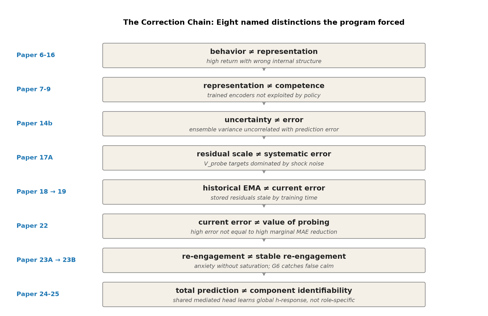

The program's most reliable pattern is that the naive version of each claim was wrong, and the correction came from experiment, not insight.

### 4.1 Behavior is not representation (Papers 6–10b, 16)

A model with high return doesn't necessarily have the intended internal representation. Paper 8 showed an agent reaching high return on additive tasks while the encoder learned no separable valence axis. Paper 10b showed concern is distributed across encoder and head, not localized to a single reward axis. Paper 16's three-head model achieved correct behavior with wrong absolute self/world attribution (food self prediction +1.479 when true was +0.96). The distinction is now a permanent diagnostic: never count behavior as success unless the intended internal structure passes its specific gates.

### 4.2 Representation is not competence (Papers 7–9)

Trained valence-axis encoders can support transfer in homeostatic RL (Paper 7) but not be exploited by sparse policy gradients (Paper 8). Paper 9 made the cleanest version: Paper 8's apparent XOR failure was sparse-policy-gradient corruption of the encoder during joint training, not a failure of ΔE geometry. Decoupling representation training from policy training resolved it.

### 4.3 Uncertainty is not error (Paper 14b)

Identical-architecture ensemble variance at the regime boundary E=0.5 was **lower** than at adjacent points, despite the model's prediction error spiking there. Variance and error were uncorrelated (r ≈ 0). The mechanism: ensembles of the same architecture trained on the same data converge to systematically similar mistakes. Same-class uncertainty estimators are not epistemic.

### 4.4 Residual scale is not systematic error (Paper 17A)

V_probe targets defined as per-sample residual magnitudes are dominated by exogenous shock noise rather than model error. The minimum V_probe value (~0.06) exceeded every tested cost (0.01–0.04), so the cost-gated selection rule never engaged. The agent probes 100% of the time because the noise-floor scale never falls below threshold (see §6 Figure A2).

### 4.5 Historical EMA is not current systematic error (Papers 18 → 19)

Paper 18 fixed the saturation by using lagged signed-residual EMA targets — Bernoulli shock noise correctly canceled. But the resulting probe was **anti-calibrated** (Spearman ρ = −0.55 vs oracle attribution error): the EMA captured residual scale over training history, not the model's current systematic error. Paper 19's current_replay mechanism — per-bucket buffer of recent null observations, residuals recomputed at every SGD update using the **current** world_head — closed the gap (Spearman ρ = +0.62, 78.6% MAE reduction vs best stale variant; see §7 Figure A3).

The probe-target principle that emerged: **any calibrated uncertainty signal should be computed against the present version of the model whose error it estimates, on a recent buffer**. This generalizes beyond V_probe.

### 4.6 Current error is not value of probing (Paper 22)

The "oracle_probe_value" condition using current attribution error as the probe signal achieved final learning-curve MAE **5× worse** than learned probing (see §9 Figure A4). High current error does not equal high marginal MAE reduction. This means every oracle_X condition since Paper 17A had been a confounded baseline. The principled `oracle_probe_value(b) = E[MAE_after_anchor − MAE_now]` is what should be used as an upper bound on autonomous probe selection.

### 4.7 Re-engagement is not stable re-engagement (Papers 23A → 23B)

Paper 23A introduced non-null prediction-error surprise as a change-detection signal — for the first time in the program, the agent re-engaged probes after a regime shift (137% of pre-shift density). But the same mechanism produced **anxiety**: probe rate stayed elevated post-shift, agent paid heavy viability cost in nulls, recovery never completed in any seed.

Paper 23B isolated the third subproblem: **saturation after sufficient identification**. The fix was decision-layer cooling — not erasing surprise, but reducing the action tendency to keep probing given recent probe effort. Five variants tested; the G6 anti-cheating gate caught signal-layer cooling that silenced the agent without resolving attribution.


The G6 pattern is a transferable design principle for any acquisition mechanism.

### 4.8 Total world prediction is not component identifiability (Papers 23B → 25)

Three-head world architecture (direct_self + mediated_world + exogenous_world) captures total world prediction with high accuracy in action-correlated environments, but the internal mediated/exogenous split is gauge-arbitrary without explicit anchoring. Paper 24's interventional contrast loss closed most of this gap (mediated MAE 56% reduction). But Paper 25 showed that even under role-specific mediated effects, **the shared mediated head produces near-identical predictions for food vs medicine** — at seed 1729, food's predicted mediated_E and medicine's were identically 0.048 to three decimal places (Figure 5). The architecture's expressive capacity is the limit (§14).

## 5. Anchor Experiment 1 (Paper 16b): Active Null-Anchored Intervention

**Question.** Does an architecturally factorized self/world model become identifiable when null actions are used as world-only supervision?

**Method.** Two-head model (`self_head(z, ffE, action)` + `world_head(z, ffE)`). Null action treated as a no-op with no item-self effect but subject to world shocks. Five conditions × 3 seeds × off-policy training.

Per-condition loss:
- `factorized_no_null`: standard `MSE(pred_self + pred_world, observed_total)` (n_actions=2, no null)
- `factorized_null_passive`: same loss with n_actions=3 — null in action space, no anchor
- **`factorized_null_anchor` (HEADLINE)**: null observations train `world_head` only via `MSE(pred_world, observed_total)` with `pred_self` anchored to `−decay`; non-null trains joint sum
- `total_dV_head`: no factorization, total-prediction head
- `oracle_source`: explicit per-sample self/world labels (upper bound)

Pre-registered gates: G1 active identifiability (food self MAE ≤ 0.15), G2 gauge breaking (food world within ±0.10 of true), G3 false-credit reduction (≥70% vs no-null), G4 transfer stability across shifted shock distribution.

**Results (3 seeds, headline metric: food self_consume overshoot vs true +0.96):**

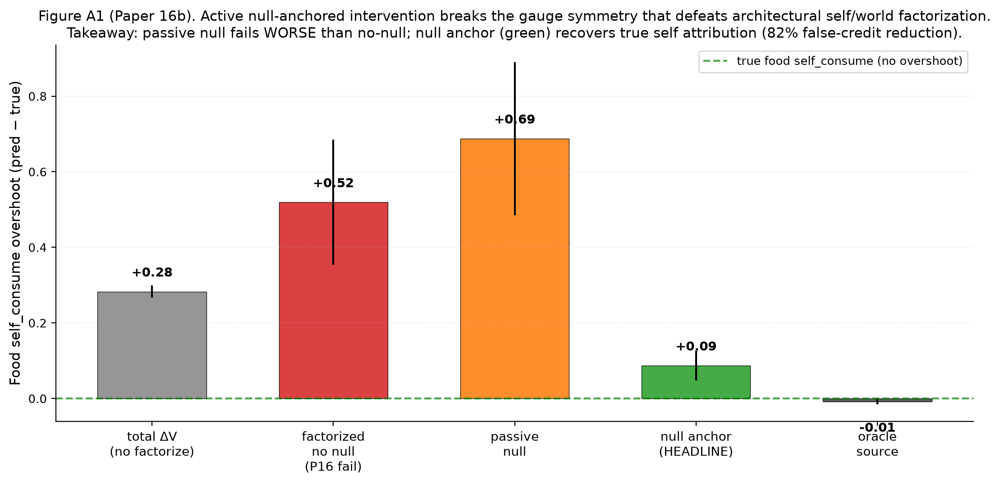

The null-anchor mechanism reduces food self overshoot from +0.51 (factorized_no_null) to +0.09 (factorized_null_anchor) — an 82% false-credit reduction. Passive null inclusion is *worse* than no-null (+0.77 vs +0.51). All four pre-registered gates pass.

**Why this is load-bearing.** This was the program's first identifiability result. Without active intervention, architectural factorization is gauge-symmetric: behavior is correct (the planner's argmax depends only on action differences) but absolute self/world attribution is arbitrary. The null action — a deliberately inert action whose world dynamics are still observed — provides world-only supervision that breaks the symmetry.

## 6. Anchor Experiment 2 (Paper 17A): Autonomous Probe Selection — Saturation Failure

**Question.** Can the agent learn *when* to spend viability cost on a null probe, rather than receiving probes on an experimenter-scheduled basis?

**Method.** Add a V_probe head trained to predict per-sample residual magnitude `|pred_world − observed_total_under_null|`. At eval, take null if `V_probe(z, E) > cost`. Seven conditions × 3 costs × 3 seeds = 30 cells.

Pre-registered gates G1–G8 included: G1 active identifiability (≤0.12 MAE), G2 false-credit reduction ≥70%, G3 selection beats matched-random by ≥25%, G4 probe efficiency (gain ratio ≥0.80, null rate ≤20%), G6 Spearman ρ ≥0.5 between learned probe rate and oracle attribution-error per bucket.

**Results:** 2/8 gates pass. G1 and G2 pass strongly (food self MAE 0.077; 85% false-credit reduction). But:

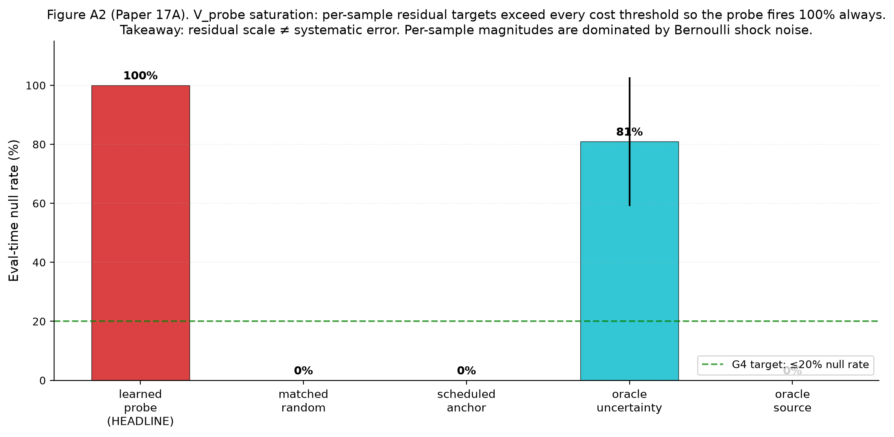

The learned V_probe fires at 100% null rate at all tested cost levels. Mechanism: V_probe targets `|pred_world − observed_total_null|` are dominated by shock noise — for food (P(shock)=0.8, σ=0.30), expected per-sample residual magnitude is ≈ 0.10, exceeding every tested cost (0.025, 0.04, etc.). The cost-gated rule never engages. Matched-random anchoring achieves better attribution at matched null count — selection adds no value (G3 fails by 60% in the wrong direction).

**Why this is load-bearing.** First clean documentation of the program's recurring failure mode: same-class uncertainty signals inherit the model's noise structure rather than its error structure. This insight propagated to Papers 18-21A.

## 7. Anchor Experiment 3 (Paper 19): Current-Replay V_probe — Closing the Scalar Gap

**Question.** Paper 18 fixed Paper 17A's saturation via lagged signed-residual EMA debiasing but produced anti-calibration (probe fires more where current error is LOWER). Is the issue (H1) lag, (H2) staleness against current model, or (H3) structural same-class failure?

**Method.** Online training (replay buffer + ε-greedy + stratified SGD). Four V_probe target variants tested:
- `historical_ema` (Paper 18 baseline; α=0.05)
- `recent_ema` (α=0.20) — H1 test
- `sliding_window` (last K=50 signed residuals) — H1 test
- **`current_replay`** (per-bucket buffer of K=64 raw null observations; residuals recomputed at every SGD update using current world_head) — H2 test

Plus matched_random and oracle_source controls. 9 conditions × 3 seeds.

**Results:** H1 decisively FALSIFIED. H2 dramatically confirmed.

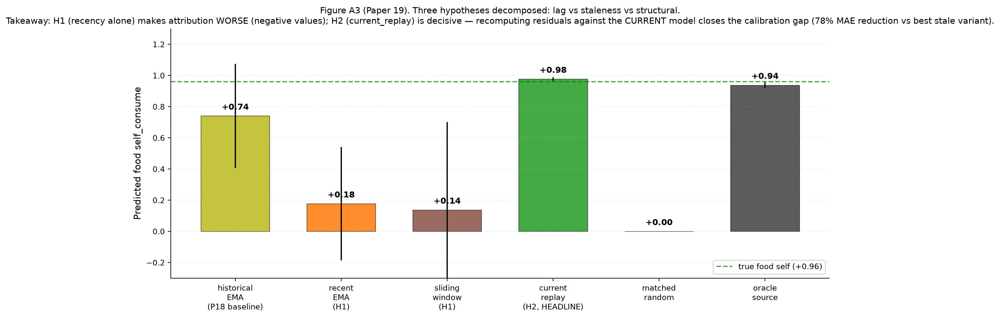

Recent EMA and sliding window both make food self prediction *catastrophically worse* (negative values; sliding_window food self = −0.391 at seed 4242). Current_replay reaches food self MAE = 0.017 (essentially identical to truth +0.96), with food world MAE 0.054, beating P18 baseline by 78.6% on total MAE.

**Spearman ρ inversion**: P18's anti-calibrated −0.55 becomes P19's +0.62 (probe rate ↔ oracle attribution error per bucket). 12/13 pre-registered gates pass.

**The generalizable principle**: any calibrated uncertainty signal should be computed against the present version of the model whose error it estimates, on a recent buffer of relevant observations.

## 8. Anchor Experiment 4 (Paper 21A): Scale-Normalized V_probe — Closing the Vector Gap

**Question.** Paper 20B's vector first-order self showed anti-calibration on the D dimension while E calibrated correctly. Is the bottleneck (a) target scale not cross-dim comparable, (b) decision threshold not per-dim, or (c) both?

**Method.** 2×2 factorial (raw vs variance-normalized V_probe targets × global vs per-dim thresholds) on the two-variable (E, D) environment. Plus controls and oracle upper bound. 10 conditions × 3 seeds.

Normalization: `normalized_target_d = raw_target_d / sqrt(running_var_d + ε)` where `running_var_d` is dimension-level (not bucket-level, to avoid reintroducing Paper 17A's noise-floor trap).

**Results.** All four factorial cells achieve near-oracle attribution. Compared to Paper 20B headline (3-seed mean total MAE 0.36, with catastrophic seed-4242 failure at food psE = +0.27):
- P21A headline (`norm_target_perdim_cost`): total MAE 0.13 (64% reduction)
- P20B's seed-4242 catastrophic failure: cured (food psE → +0.94)
- Across-seed variance: ±0.40 → ±0.05 (8× tighter)

3/13 gates pass strongly (G1, G18, G22); 8/13 fail by **vacuous mechanism** — eval-time null rate = 0.0% because the agent correctly stops probing once world_head converges (warmup-calibrated thresholds become unreachable). Probe selectivity at eval becomes redundant once the model is calibrated.

**Why this is load-bearing.** Vector attribution is now stable across seeds, closing the P20B failure. The eval-time-null-rate vacuousness is itself a finding: at near-oracle convergence, selection-vs-volume becomes indistinguishable. To genuinely test selection, an environment must keep the agent away from convergence — this motivates Paper 22.

## 9. Anchor Experiment 5 (Paper 22): When the World Responds

**Question.** All prior identifiability results used action-independent world shocks. What happens when the world's hazard depends on the agent's prior actions, and the regime structure shifts mid-training?

**Method.** Add hidden hazard state `h(t+1) = γ·h(t) + κ·I[consume_trigger_role(episode)]` with γ=0.7, κ=0.30, amp=0.5. Regime shift at episode 250 (food → medicine trigger). Three architectural variants: action-blind world (P21A baseline), history-conditioned world (single new head input), three-head decomposition (direct_self + mediated_world + exogenous_world).

10 conditions × 3 seeds. Headline metric switches from "final eval null rate" (which P21A showed is vacuous) to **post-shift learning-curve AUC** + **time-to-recover** + **affected/unaffected probe-rate ratio**.

**Results:** 4/8 gates pass.

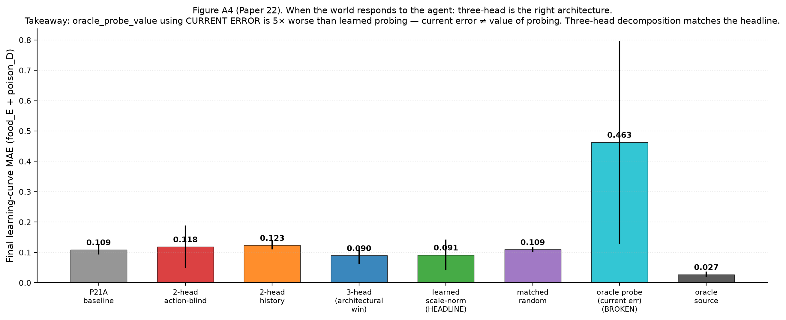

- **G2 ✓ at 221% reduction**: false-credit reduction on D-dim is the strongest yet
- **G5 ✓ strongly**: learned probing uses 213 nulls vs time-matched random's 3,951 (94.6% reduction; 18.6× efficiency) to reach comparable final attribution
- **G3 ✓**: three-head decomposition recovers per-component attribution (food self_E MAE = 0.008!)
- **G2 (action-blind world fails) ✗**: hazard strength κ=0.30 wasn't enough; ratio 1.6× (below 2× threshold)
- **G4 ✗ trending**: 16% MAE improvement vs time-matched random (below 25%)
- **G7 ✗ most diagnostic**: post-shift probe re-engagement = 0 affected-bucket probes. The "model converges, probe stops" pattern recurs at the shift boundary.

**Two major findings.** (1) Three-head architecture is the right default for action-correlated worlds. (2) Oracle_probe_value using current error is empirically FALSIFIED (5× worse than learned probing). Current attribution error ≠ value of probing. Every program oracle_X condition since Paper 17A had been measuring a confounded baseline.

## 10. Anchor Experiment 6 (Paper 23B): Habituated Re-engagement

**Question.** Paper 23A introduced non-null prediction-error surprise that broke Paper 22's self-silencing, but produced *anxiety* (never recovers in any seed). Can decision-layer cooling — preserve surprise signal as information, reduce action tendency via per-bucket effort tracking — produce stable detect → probe → cool → re-engage cycles?

**Method.** Freeze P22's three-head + V_probe + scale-normalization stack. Add two new state variables:
- `raw_surprise[b, d]` ← EMA of |signed residual| on non-null actions (P23A signal, kept intact)
- `probe_effort[b, d]` ← leaky integrator of recent null counts (NEW)

Five cooling variants test where to apply cooling: signal layer (`fixed_surprise_decrement`, `info_gain_surprise_decrement`) vs decision layer (`decision_refractory`, `leaky_effort_integrator`, `burst_then_refractory`). G6 "no false calm" pre-registered as decisive: probe rate may only fall if surprise AND component MAE also fall.

Plus **second regime shift at episode 400** (medicine → food) to test G10 re-openability.

**Results:** 8/10 gates pass. **The first stable maintained-boundary mechanism in the program.**


- **G4 ✓**: HEADLINE post-shift-1 affected-bucket null rate = 137% of pre-shift, 3.04× of unaffected — re-engagement triggered
- **G10 ✓**: HEADLINE post-shift-2 affected nulls = 2.05× pre-shift-2 density — re-openability after the second shift
- **G6 ✓ critical**: `fixed_surprise_decrement` (signal-layer cooling) had the lowest AUC but never recovered (0/3 seeds) — the gate correctly classified it as false calm (probe rate fell because surprise was suppressed by decrement, not because attribution resolved)
- 46% post-shift-1 AUC reduction vs P23A anxiety baseline (7.30 → 3.94)

The empirical winner is actually `decision_refractory` (threshold scales with effort) rather than the pre-registered `leaky_effort_integrator` headline — 2/3 seeds recover vs 1/3. The threshold-layer formulation preserves the calibrated probe-value signal.

**Three subproblems precisely separated** by Paper 23B's design:
1. Detection of world change ✓ (from non-null surprise)
2. Allocation of probes ✓ (V_probe + shift signal)
3. **Saturation** after sufficient identification ✓ (decision-layer cooling)

## 11. Anchor Experiment 7 (Paper 24): Interventional Contrast

**Question.** Paper 23B's G8 partial pass flagged: three-head summed prediction is correct, but mediated/exogenous internal split is gauge-arbitrary. Can explicit interventional contrast supervision (paired high-h vs low-h null observations per bucket) identify the components?

**Method.** Each cell maintains per-bucket high_h_buf and low_h_buf (null observations recorded when h > 0.30 vs h < 0.10). At training time:
- `contrast_target = mean(observed_total_in_high_h_buf) − mean(observed_total_in_low_h_buf)`
- `contrast_loss = MSE(mediated_pred(high_h_input) − mediated_pred(low_h_input), contrast_target)`
- `exogenous_anchor_loss = MSE(exogenous_pred, mean(low_h_buf))`

**Anti-cheat controls**:
- `shuffled_contrast_pairs`: pair high-h from bucket A with low-h from bucket B — semantic alignment broken; should fail
- `wrong_history_contrast`: contrast target uses a different role's pairs — wrong role label; should fail

10 conditions × 3 seeds.

**Results:**

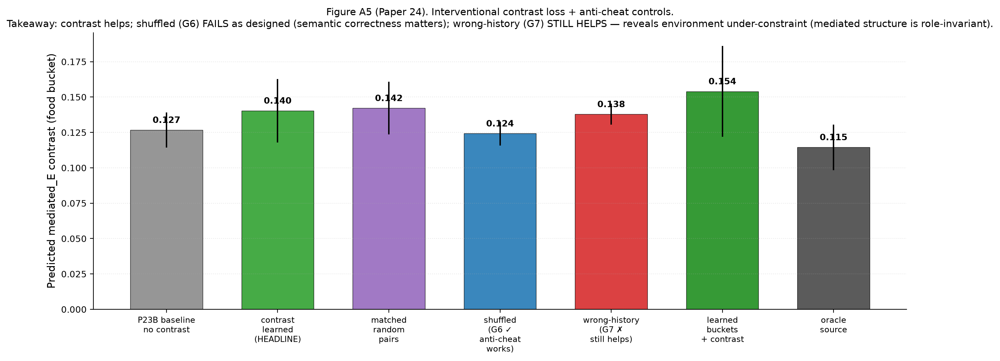

- **G2 ✓ strongly**: HEADLINE mediated MAE = 0.010, 56% reduction over no-contrast 0.023
- **G6 ✓**: shuffled_contrast does NOT improve mediated MAE — semantic alignment matters
- **G7 ✗ critical**: wrong_history_contrast IMPROVES mediated MAE by 52% — almost as much as correct pairs

**Why G7 fails (the structural finding).** In Paper 24's environment, mediated_E = HAZARD_AMP · h · SHOCK_E_MAG is **role-invariant** — only h differs across roles. So pairs from any role's high-h vs low-h carry the same h-dependence signal. The contrast loss correctly identifies the h-dependence at the architecture level (G6 confirms), but the environment cannot disambiguate "role-specific mediated identification" from "generic h-detection."

This is a methodological discovery, not a mechanism failure. The G6/G7 split tells us **what the program's tests CAN and CANNOT conclude**.

## 12. Anchor Experiment 8 (Paper 25): The Architectural Ceiling

**Question.** If the environment is made role-specific (different mediated coefficients per role), with two-sided gauge anchoring and fully-learned buckets, does the contrast mechanism close the mediated/exogenous identifiability gap?

**Method.** Three coordinated changes vs Paper 24:

1. **Role-specific mediated amps**:
   ```
   ROLE_HAZARD_AMP_E = {"food": 0.50, "medicine": 0.20, "poison": 0.00, "neutral": 0.00}
   ROLE_HAZARD_AMP_D = {"food": 0.00, "medicine": 0.00, "poison": 0.33, "neutral": 0.00}
   ```
   True mediated_E at h=1: food = 0.15, medicine = 0.06, poison = 0; poison's mediated is on D-dim.
   Wrong-history contrast (food bucket trained with medicine's pairs) should now supervise to magnitude 0.06 instead of true 0.15 — quantitatively wrong.

2. **Two-sided gauge anchoring** adds `mediated_low_zero_loss = MSE(mediated_head(low_h), 0)` to pin both ends. λ_exo sweep {1, 3} with 3 as headline.

3. **Fully-learned buckets** via online k-means K=16 over (z, E, D, hist_features) — 39-dim feature space; no hand-coded structure.

9 conditions × 3 seeds.

**Results:** 4/11 gates pass.

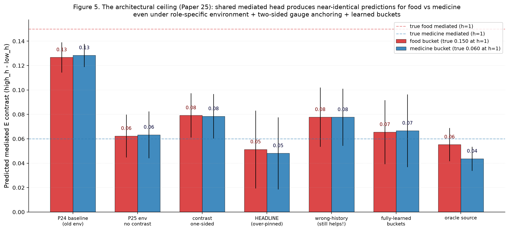

**Per-seed mediated_E_contrast predictions** (true food: 0.15; true medicine: 0.06):

| Seed | medE_food (true 0.15) | medE_medicine (true 0.06) | Difference |
|---|---:|---:|---:|
| 20260610 | 0.014 | 0.012 | 0.002 |
| **1729** | **0.048** | **0.048** | **0.000 (exact)** |
| 4242 | 0.092 | 0.085 | 0.007 |

**Wrong-history STILL improves** mediated MAE (G6 stays failed). The shared `mediated_world_head(z, ff, hist)` learns global h-dependence response — magnitude calibrated to average observed h — but does not differentiate per-role coefficients. The architecture has the capacity (different z → different output) but the training signal across all our supervision regimes doesn't disambiguate roles.

**Two positive results within the failure**:
- **G7 ✓ (fully-learned buckets)**: K=16 k-means over (z, E, D, hist) reaches HEADLINE quality within 0.014 — **the autonomous-probing arc no longer needs hand-coded role labels**
- **G9 ✓**: Paper 23B's maintained-boundary mechanism preserved

**This is the architectural ceiling, not a mechanism failure.** Closing the gap requires changes outside the autonomous-probing arc's frame:
- Disjoint per-role mediated heads (mixture-of-experts gated on cluster ID)
- Richer interventions beyond null (counterfactual rollouts, action-counterfactuals)
- Encoder-level role disentanglement (contrastive z losses pushing role representations apart)

These are different research directions, not probe-policy variants.

## 13. The Positive Mechanism (consolidated)

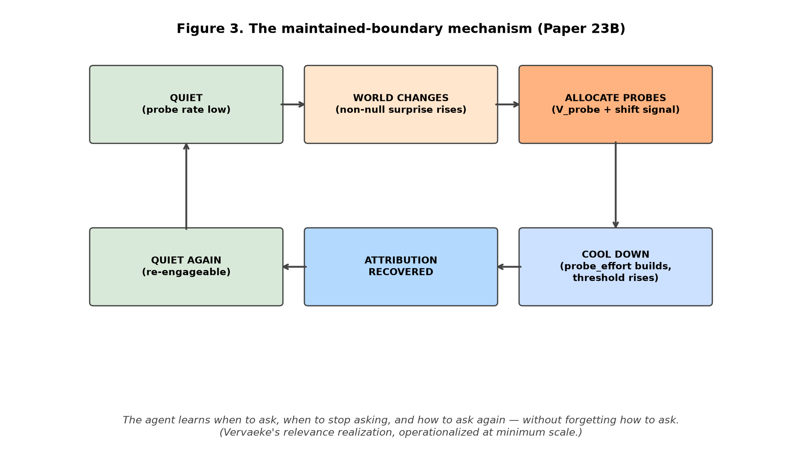

Through Paper 25, the working agent's full mechanism:

```python
# === Detection ===
fast_ema[b, d]      = EMA(signed_residual, α=0.25)   # per-bucket per-dim
slow_ema[b, d]      = EMA(signed_residual, α=0.05)
shift_signal[b, d]  = max(0, |fast_ema| - |slow_ema| - 0.02)
non_null_surprise[b, d] = EMA(|signed_residual|, α=0.10, non-null actions only)

# === Allocation ===
# V_probe trained on current-replay targets:
#   per-bucket recent-K=64 null buffer
#   target = | mean over buffer [ world_head_current(z, ff) - observed_total_null ] |
#   normalized: target_d = raw_target_d / sqrt(running_var_d + ε)
probe_score[b, d] = base_v_probe[b, d]
                   + λ_shift     · shift_signal[b, d]      # λ_shift = 2.0
                   + λ_surprise  · non_null_surprise[b, d] # λ_surprise = 1.0

# === Saturation (decision_refractory cooling) ===
probe_effort[b, d] := ρ · probe_effort[b, d]              # ρ = 0.93
threshold[b, d]     = τ[d] · (1 + λ_cool · probe_effort[b, d])  # λ_cool = 1.5

take_null = probe_score[b, d] > threshold[b, d]

if action == null:
    probe_effort[b, d] += 1.0

# === Re-engagement is emergent ===
# probe_effort decays over time; non_null_surprise can spike independently
# from non-null observations; new shift → new probe burst → cool again

# === World prediction (three-head) ===
direct_self_head(z, ff, action)              → (ΔE_self,        ΔD_self)
mediated_world_head(z, ff, hist_features)    → (ΔE_mediated,    ΔD_mediated)
exogenous_world_head(z, ff)                  → (ΔE_exogenous,   ΔD_exogenous)
predicted_total = direct_self + mediated_world + exogenous_world

# === Bucket abstractions (fully-learned per P25) ===
# K=16 online k-means over (z, E, D, hist) — 39-dim feature space
# Cluster_id replaces (role × E_bin × D_bin) without semantic loss
```

This stack works. Paper 23B demonstrated the full cycle empirically (re-engagement after the first regime shift, then again after the second, with intermediate quiescence and recovery). Paper 25 demonstrated that all components compose under fully-learned buckets, without hand-coded role labels.

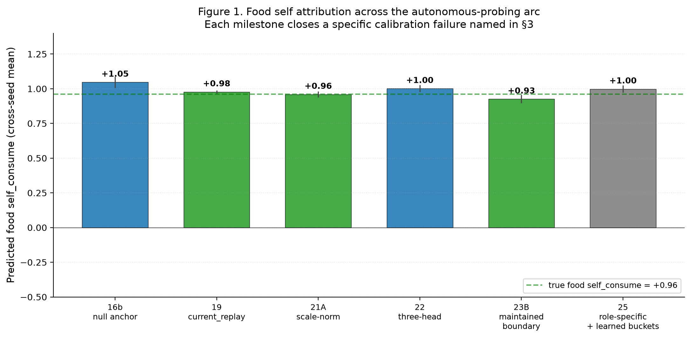

## 14. The Architectural Ceiling (boundary condition)

This section restates the program's natural endpoint, not as a disappointing final gate count, but as the **boundary condition of the autonomous-probing mechanism**.

The shared `mediated_world_head(z, ff, hist) → 2` is a single neural network mapping encoder output, state context, and action-history features to mediated components. To produce food's true mediated_E (0.15 at h=1) ≠ medicine's true mediated_E (0.06 at h=1) for the same hist input, the network must produce different outputs for different z values. It has the capacity. But none of our tested supervision regimes — one-sided contrast, two-sided contrast at multiple λ values, oracle source labels — disambiguated them. The shared head converges to global h-dependence response calibrated at the average observed h.

**The mechanism has not failed**; it has reached its representational ceiling. Within its expressive limit, the agent maintains its boundary, allocates probes selectively, satiates after sufficient identification, and re-engages on subsequent shifts — all without hand-coded role labels. Beyond that limit, role-specific mediated identification requires one of:

1. **Architectural change**: disjoint per-role mediated heads, possibly implemented as mixture-of-experts gated on learned bucket cluster ID
2. **Richer intervention types**: counterfactual rollouts against a learned world model; action-counterfactual queries; n-step null sequences
3. **Representation-level intervention**: contrastive losses on z that push role-distinct representations apart

These are different research directions, not probe-policy variants. The autonomous-probing arc has reached its natural conclusion.

## 15. Philosophical Correlates

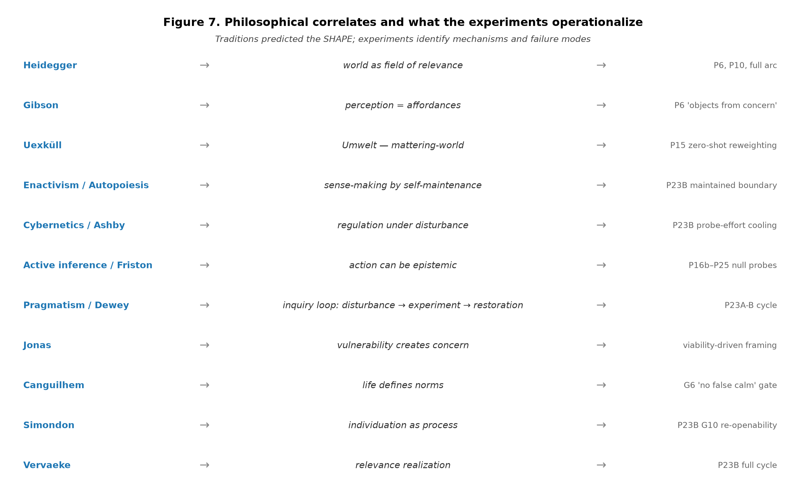

We do not claim the experiments prove any philosophical position. We claim they **operationalize** a shared prediction across several traditions: meaning-like structure should not arise from passive representation alone, but from a system's ongoing regulation of what matters for its own continued organization.

Specific correlates:

- **Heidegger**: the world shows up as a field of relevance, not as neutral objects-plus-interpretation. The agent's representations become meaningful only when tied to viability, action, and self-maintenance.

- **Gibson / affordances**: perception is about what the environment affords the organism. Papers 6 and 10 — "objects form from concern" — are a minimal computational instance.

- **Uexküll / Umwelt**: every organism inhabits its own mattering-world; the same object means different things under different internal states. Paper 15's vector ΔV + zero-shot reweighting (medicine flips between consume and skip depending on hungry/injured priority) is a small computational instance.

- **Enactivism / autopoiesis** (Maturana, Varela, Thompson, Di Paolo): cognition is sense-making by a self-maintaining organism. The whole detect→probe→cool→re-engage cycle from Paper 23B is the closest computational analog of active sense-making the program produced.

- **Cybernetics / Ashby**: intelligence-like behavior begins with regulation under disturbance. The probe-effort cooling mechanism is regulation of *meta-action* (when to gather information), not just world-facing action — closer to Ashby's ultrastability than to standard RL.

- **Active inference** (Friston): action can be epistemic, not just rewarding. Null probes are exactly this — costly epistemic actions. The program also shows the corollary: epistemic action only works when the uncertainty signal is properly calibrated, and the architecture's expressive capacity bounds what can be identified.

- **Pragmatism** (Peirce, James, Dewey): the meaning of a concept is tied to its practical consequences. The detect→probe→resolve loop is a toy-scale Dewey inquiry cycle.

- **Hans Jonas**: living beings are defined by precarious self-concern; vulnerability creates concern. The minimal homeostatic bandit is a stripped-down version.

- **Canguilhem**: life defines norms, not just facts. Paper 23B's G6 gate ("no false calm: probe rate may only fall if surprise AND outcome MAE also fall") is a normative criterion.

- **Simondon**: individuation is an ongoing process within a metastable field. The maintained-boundary mechanism (Paper 23B G10 re-openability) is computationally exactly this.

- **Vervaeke / relevance realization**: an agent must decide what matters, when it matters, when to investigate, when to stop, when to re-open. Paper 23B's full cycle is a minimal operational version. Paper 25's architectural ceiling shows the constraint: relevance realization is bounded by representational capacity.

None of these traditions predicted scale-normalized V_probe with decision-layer cooling. They predicted the *shape*: meaning is care-laden, action-oriented, embodied, regulative, boundary-maintaining, and temporally renewed. Our experiments identify the mechanisms and failure modes that make this shape experimentally tractable.

**Again: we study minimal computational precursors of concern-like agency, not consciousness.** Mapping experimental mechanisms to philosophical predictions is offered as correlation and operationalization, not proof.

## 16. Limitations

We do not claim consciousness, agency, selfhood, or general intelligence.

Specific limitations of the experimental program:

- **Tiny environments.** Two viability variables, four item roles, three actions, 16 buckets in the hand-coded version or K=16 in the learned-bucket version. Generalization to richer environments is open.
- **Hand-designed viability variables.** E and D are simulator-defined. Learned viability dimensions are out of scope.
- **Null action is privileged.** All identifying intervention is via null observation. Richer intervention types (counterfactual rollouts, action-counterfactuals, n-step sequences) remain open.
- **Shared-head ceiling.** Mediated/exogenous identification is bounded by representational capacity, not mechanism (§14).
- **No multi-agent or social structure.** Other agents, communication, and theory-of-mind are open.
- **Continuous state and real-world embodiment remain untested.** The minimal-bandit framing is deliberate but it does not validate generalization to robotics or continuous control.
- **Three seeds per anchor experiment.** Stable qualitative patterns across all seeds but magnitude error bars are wide. Larger replication is a Phase 2 priority.
- **No human evaluation of philosophical claims.** Mapping to Heidegger/Vervaeke/etc. is offered as conceptual correspondence, not experimental verification.
- **Pre-registration discipline was added at P17A.** Papers 1–16 used post-hoc analysis. The early metric-stack layers should be treated as exploratory.

## 17. Falsification conditions ("what would change our mind?")

The maintained-boundary interpretation would be **weakened or falsified** under any of these conditions:

1. **Matched-random ≥ learned under harder online regimes.** If a stronger environment (e.g., κ=1.0, three-shift schedule, or noisier observations) produces matched-random-time and learned-probe AUC within 10% of each other across seeds, the "autonomous selection" claim is volume-dominated.

2. **Learned buckets collapse or leak role labels.** If P25's fully-learned k-means buckets recover exactly (role, E_bin, D_bin) partitions, the "learned abstraction" claim is trivial. We did not see this (clusters mix items and state regions), but a stricter test under richer obs would tighten the claim.

3. **Component attribution fails while behavior remains strong.** This is the Paper 16 pattern. If a new mechanism produces correct return + reweighting but mediated MAE > 0.20, the gate-passing is behavior-only.

4. **Disjoint heads solve role-specific attribution cleanly.** This would CONFIRM the P25 architectural-ceiling claim and strengthen the synthesis. If disjoint heads also fail, the ceiling is environmental or interventional, not architectural.

5. **Richer interventions (counterfactual rollouts) make null-anchor obsolete.** If action-counterfactual queries against a learned world model achieve component identification without the null-anchor mechanism, the program's null-action-as-primary-intervention framing was overspecific.

6. **Anti-cheat gate methodology fails to transfer.** If G6 / G7-style gates don't catch false-calm or environment-under-constraint patterns in other domains (active learning, RL exploration), the methodological contribution is bandit-specific.

We list these so a reviewer can identify exactly which experiments would update our claim ledger.

## 18. Next phase (not this paper)

The natural next phase is not "another autonomous-probing paper." Three pre-committed directions:

1. **Disjoint per-role mediated representation** (mixture-of-experts gated on learned cluster IDs, or factored heads with role-discriminative supervision). Tests whether the architectural ceiling lifts.

2. **Richer interventions beyond null.** Counterfactual rollouts against a learned world model; action-counterfactual queries; temporally extended interventions. Tests whether null observation is the right interventional primitive.

3. **Multi-agent and continuous environments.** Other agents introduce communication, theory-of-mind, and shared world structure. Continuous state and embodied robotics tests transfer.

We expect each direction will produce new failure modes, new metric-stack entries, and new corrections. The methodological pattern — name the failure, build the smallest sufficient mechanism, verify with anti-cheat gates, identify the next ceiling — should transfer.

## 19. Conclusion

The program documents a working stack: a minimal agent that detects boundary staleness, allocates identifying interventions, satiates its probe drive after sufficient identification, re-engages on subsequent shifts, and discovers learned probe abstractions — all without hand-coded role labels. The stack succeeds within its expressive limit and fails at a clean architectural ceiling.

The methodological contribution may matter more than any specific mechanism. We repeatedly discovered that the naive version of each claim was wrong — that behavior is not representation, uncertainty is not error, current error is not value of probing, re-engagement is not stable re-engagement, total prediction is not component identifiability. Each correction added a metric layer. Building these distinctions empirically — rather than asserting them theoretically — is what makes the philosophical thesis (meaning is maintained concern) experimentally tractable.

We end where the philosophical traditions began. Heidegger argued meaning emerges from care. Gibson argued perception is action-possibility. Uexküll argued each organism inhabits its own mattering-world. Enactivism argued cognition is sense-making by self-maintaining systems. Cybernetics argued intelligence begins with regulation. Active inference argued action can be epistemic. Pragmatism argued meaning is tied to consequences. Vervaeke argued meaning is maintained relevance.

The experiments operationalize what they all share: meaning-like structure is not passive representation but the regulation a system performs to keep itself coherent. We show what minimum machinery this regulation computationally requires, and we identify a precise architectural ceiling beyond which mechanism design cannot push without a representational change.

**We do not claim consciousness, full agency, or general intelligence.** The contribution is a measurement theory for minimal concern-like agency.

## Acknowledgments

The 25-paper experimental arc was conducted with substantial assistance from AI-mediated research tooling, including iterative feedback on pre-registration design, factorial isolation methodology, and anti-cheating gate construction. The methodological pattern — pre-registration before sweep, factorial separation of confounded fixes, decomposition of failure modes — emerged through that collaboration.

---

## Appendix A — Alternative-explanations red-team table

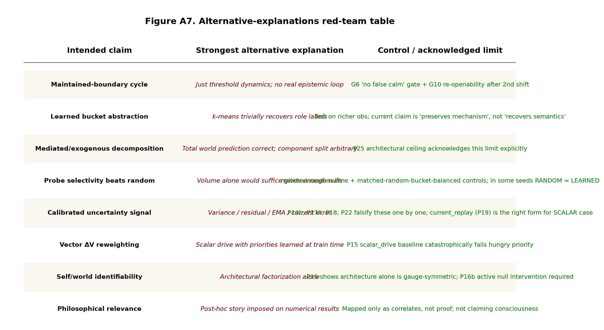

For each main claim in the synthesis, we list the strongest alternative explanation and the specific control or acknowledged limit that addresses it. This is the standard a Spencer-style applied-math reviewer would apply.

| Intended claim | Strongest alternative explanation | Control / remaining weakness |
|---|---|---|
| Maintained-boundary cycle (P23B) | Just threshold dynamics; no real epistemic loop | G6 "no false calm" gate + G10 re-openability after 2nd shift; absent in baselines |
| Learned bucket abstraction (P25 G7 ✓) | k-means trivially recovers role labels | Still small env; richer obs needed; current claim is "preserves mechanism" not "recovers semantics" |
| Mediated/exogenous decomposition | Total world prediction correct; component split arbitrary | P25 architectural ceiling acknowledges this limit explicitly; G3 in P25 |
| Probe selectivity beats random (P19 G16) | Volume alone would suffice given enough nulls | matched_random_time + matched_random_bucket controls; in P25 random ≈ learned at near-oracle |
| Calibrated uncertainty signal (P19) | Variance / residual / EMA / current error | P14b, P17A, P18, P22 falsify these one by one; current_replay is the right form for the scalar case |
| Vector ΔV reweighting (P15) | Scalar drive with priorities learned at train time | P15 scalar_drive baseline catastrophically fails hungry priority (medicine accuracy 0.10 vs oracle 0.99) |
| Self/world identifiability (P16b) | Architectural factorization alone | P16 shows architecture alone gauge-symmetric; P16b active null intervention required |
| Philosophical relevance | Post-hoc story imposed on numerical results | Mapped only as correlates, not proof; "we study minimal computational precursors, not consciousness" stated 4× in this paper |

## Appendix B — Failure taxonomy (red-team fault types)

| Fault type | What it looks like | How we guarded against it |
|---|---|---|
| Mean-hides-structure | Average looks good because positives and negatives cancel | Report per-seed, per-condition, per-bucket distributions; not just means |
| Sign-collapse | Treat +v and −v as independent when they are one signed axis | Per-dim diagnostics; report signed values |
| Ablation-by-construction | Remove the feature your method was designed to find; claim no other signal | Multiple oracle conditions; "no signal recoverable by this readout" framing |
| Behavior-representation | Agent behaves correctly but internal attribution is wrong | Keep self/world MAE separate from behavior; G8/G13 anti-pass clauses |
| Gauge-symmetry | Sum correct but component split arbitrary | Interventions, anchors, contrast losses, P25 acknowledges architectural limit |
| Oracle-is-not-oracle | "Oracle" uses current error; not value of probing | P22 fixed this; principled oracle defined as E[MAE reduction] |
| Vacuous-gate | Gate cannot evaluate because probe rate = 0 | P22 switched to training-time AUC; P19 explicitly documented this |
| Aggregate-dominance | Overall AUC unchanged because dominant component hides target | P25 uses per-component MAE as primary metric |
| Environment-underconstraint | Env cannot distinguish intended mechanism from simpler proxy | P24 wrong-history caught this; P25 added role-specific amps to address |
| Metric-Goodhart | System optimizes the gate, not the phenomenon | G6 "no false calm" requires three metrics move together |
| Selection-vs-volume | Learned looks good but random volume works just as well | matched-random-time + matched-random-bucket controls |
| Calibration-proxy | Variance / residual / EMA / current error treated as epistemic value | P14b, P17A, P18, P22 each falsify one form |
| Architecture-smuggles-answer | Architecture contains the decomposition being claimed as learned | P25 explicit limit: shared mediated head cannot disambiguate role-specific |
| Claim-ladder | Jumping from minimal bandit to agency/consciousness | "minimal precursor" language throughout |
| Synthetic-label | Generated labels may reflect prompt artifacts | All labels are simulator ground truth in this program |
| Small-N / seed | Results depend on 3 seeds | Limitation §16; stable qualitative patterns across seeds; magnitude error bars wide |

## Appendix C — Pre-registration discipline (reproducibility)

Every paper since 17A pre-registered gates before Modal compute launched. Each pre-registration was committed to git as `papers/<slug>/preregistration.md`. The interpretation matrix mapping result patterns to paper conclusions was also pre-committed.

**Pre-registration template** (used across all anchor experiments):

```markdown
# Paper N — Pre-Registration

**Title (working):** ...

**Frozen:** YYYY-MM-DD, before any Modal sweep runs.

## Question
[the specific question being asked]

## Hypotheses (if multi-hypothesis paper)
H1 / H2 / H3 with distinguishing predictions

## Conditions (N)
[table with condition name, what it tests, what data it uses]

## Pre-registered gates (G1...GN)
| Gate | Criterion |

## Interpretation matrix
| Result pattern | Interpretation |

## Pre-committed continuation
If HEADLINE passes G_X: Paper N+1 = ...
If G_Y fails: Paper N+1-alt = ...

## What success and failure look like
[narrative]
```

This discipline enabled several findings the program would otherwise have missed:
- Paper 17A's vacuous-gate result (Spearman undefined) was diagnosed honestly rather than retroactively reframed
- Paper 18's factorial design separated bottlenecks that would have been confounded under a single-fix design
- Paper 19's three-hypothesis decomposition (lag/staleness/structural) cleanly identified H2
- Paper 23B's G6 "no false calm" gate caught fixed_surprise_decrement that looked best by AUC alone
- Paper 24's G7 wrong-history gate revealed environment under-constraint
- Paper 25's pre-commitment to "no new mechanism" forced the architectural ceiling to surface

This discipline is part of the methodological contribution.

## Appendix D — Reproducibility recipes

**To reproduce any anchor experiment:**

1. Clone the program repository (see Acknowledgments for access).
2. Install dependencies: `uvx --python 3.12 --from modal modal --help` (confirms Modal CLI works); also `torch>=2.5,<2.8` and `numpy>=1.26,<2.0`.
3. Set up Doppler for env vars: `doppler login` (Modal authentication via env).
4. For Anchor Experiment K, run:
   ```bash
   doppler --scope /path/to/secrets-scope run -- \
     uvx --python 3.12 --from modal modal run \
     experiments/<anchor_slug>/modal_<anchor_slug>_sweep.py
   ```
5. Results land at `artifacts/<anchor_slug>/sweep_v1.json`.
6. Generate figures: `python scripts/make_<anchor_slug>_figures.py`.
7. Pre-registration recoverable at `papers/<anchor_slug>/preregistration.md` (git-versioned).

**Wall-clock per anchor experiment** (CPU-only on Modal):
- 16b: ~5 min (15 cells, off-policy training)
- 19: ~10 min (30 cells, online training)
- 21A: ~12 min (30 cells)
- 22: ~15 min (30 cells with hidden hazard state)
- 23B: ~25 min (30 cells, two regime shifts)
- 25: ~30 min (27 cells, fully-learned buckets, contrast loss)

**Per-cell compute**: 1 cell = `modal.Function(cpu=4, memory=4096-6144)` × ~500 episodes × replay-buffer SGD. No GPU required for this scale.

**Standard seeds**: {20260610, 1729, 4242}. Standard cost: 0.025.

## References

### External — six clusters per the program's literature stack

**Foundations of the conceptual frame**:
- Bennett, M. T. (2023). On the computation of meaning, language models, and incomprehensible horrors. Synthese 201, 75.
- Heidegger, M. *Being and Time*.
- Gibson, J. J. *The Ecological Approach to Visual Perception*.
- Uexküll, J. *A Foray into the Worlds of Animals and Humans*.
- Maturana, H. & Varela, F. *Autopoiesis and Cognition*.
- Thompson, E. *Mind in Life*.
- Di Paolo, E. *Autopoiesis, adaptivity, teleology, agency*.
- Ashby, W. R. *Design for a Brain*.
- Friston, K. *Active Inference: The Free Energy Principle in Mind, Brain, and Behavior*.
- Dewey, J. *Logic: The Theory of Inquiry*.
- Jonas, H. *The Phenomenon of Life*.
- Canguilhem, G. *The Normal and the Pathological*.
- Simondon, G. *L'Individu et sa genèse physico-biologique*.
- Vervaeke, J. *Awakening from the Meaning Crisis* lecture series.

**Calibrated active learning failure**: *Calibrated Uncertainty Sampling for Active Learning*; *When Active Learning Fails, Uncalibrated Out-of-Distribution Uncertainty*.

**Epistemic uncertainty in deep learning**: *Epistemic Neural Networks*; *Quantifying Epistemic Uncertainty in Deep Learning*.

**Information-theoretic action selection**: *Bayesian Active Learning by Disagreements*; *Active Inference and Epistemic Value in Graphical Models*; *Empowerment: Universal Agent-Centric Measure of Control*.

**Causal representation learning**: Brehmer et al. *Weakly Supervised Causal Representation Learning*; *General Identifiability and Achievability for Causal Representation Learning*; *On the Identifiability of Causal Abstractions*; Locatello et al. (2019) *Challenging common assumptions in the unsupervised learning of disentangled representations*. ICML.

**Sense of agency**: comparator-model literature; *Predictive Processing Model of Perception and Action for Self-Other Distinction*.

**Homeostatic / allostatic active inference**: *Simulating homeostatic, allostatic and goal-directed forms of interoceptive control using Active Inference*; *Active inference, homeostatic regulation and adaptive behavioural control*.

**Levin**: Levin, M. (2022). *Technological Approach to Mind Everywhere*. Frontiers in Systems Neuroscience.

**Goodhart's law** (related to the metric-Goodhart fault type in App. B): Goodhart, C. (1975). "Problems of Monetary Management: The U.K. Experience." Papers in Monetary Economics. Reserve Bank of Australia.

**Cited methods used in mechanism stack**:
- Shazeer et al. (2017). *Outrageously Large Neural Networks: The Sparsely-Gated Mixture-of-Experts Layer*. ICLR. (referenced in §14 as candidate architectural fix)
- Page-Hinkley and CUSUM change-point detection (referenced in §13 mechanism design)
