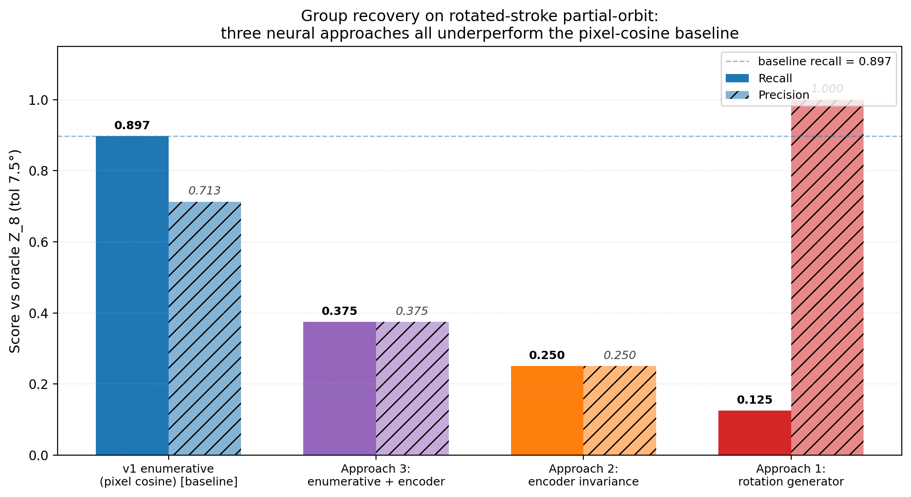
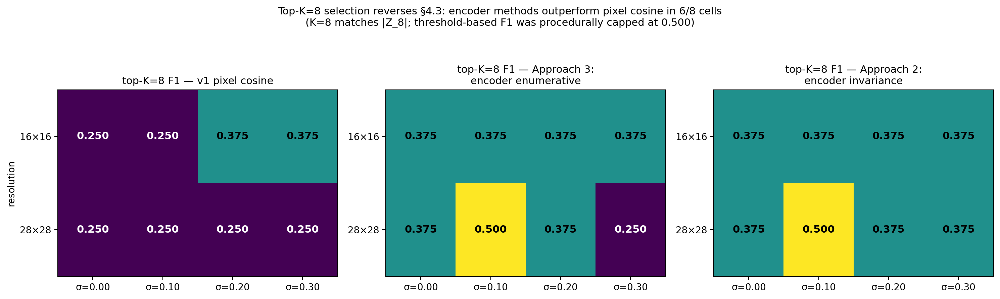

# When Pixels Beat Embeddings: Three Failed Neural Approaches to Symmetry Group Discovery

**Author.** Jawaun Brown.

## Abstract

The Learning the Group paper [2] showed that a simple enumerative procedure — for each candidate rotation θ in a 24-angle grid, score by mean pixel-cosine to the nearest same-class training example — recovers the true Z_8 rotation group from partial-orbit training data at **89.7% recall, 71.3% precision**, with no oracle access. That paper's main limitation, raised in its §6, is that the candidate set must be enumerable. The natural follow-on is to replace enumeration with a *neural* generator that proposes continuous-parameter transformations. We test three natural neural approaches on synthetic strokes and find that **all three underperform the pixel-cosine baseline** under threshold-based selection. We diagnose each failure. We then test the same methods on rotated MNIST (real digit images, downsampled and full-resolution, with Gaussian background noise). Threshold-based selection makes all methods look tied at F1 ≈ 0.500 — but this is a *procedural artifact* of the candidate grid being denser than the truth. With **top-K=8** selection (matching |Z_8|), encoder methods clearly outperform pixel cosine on MNIST (mean F1 advantage **+0.110 absolute**, with the largest single-cell gap a 2× improvement at 28×28 / σ=0.10). The honest take-away is therefore not "pixels beat embeddings" full stop, but rather: **pixel cosine wins on data where rotation preserves literal pixel patterns (synthetic strokes); encoder methods win on data where natural variation flattens pixel cosine's score ranking (MNIST); the selection procedure must know the group size to expose this**. Selection rule and similarity function are both load-bearing — and conflating them silently is the most common way to get the wrong answer.

## 1. Introduction

Group-equivariant learning [3, 5] either bakes in the symmetry through architecture, or assumes a known group action. The Learning the Group paper [2] showed the symmetry group can be *recovered from training data* by an enumerative procedure: score each candidate rotation by pixel-cosine self-consistency on training pairs of the same class, keep those above a threshold. On rotated-stroke partial-orbit data this recovers Z_8 cleanly. The paper's own limitations section flagged the enumerable-candidate-set assumption: "the procedure is enumerative... a neural version is needed for non-enumerable groups [6]."

This paper tests three natural neural alternatives:

1. **Direct rotation-angle generator**: a small encoder + latent-conditioned MLP that outputs continuous rotation angles, trained with intra-class consistency + diversity losses.
2. **Encoder-invariance scoring**: a contrastive-trained encoder, then score candidate rotations by mean cosine between encoder(x) and encoder(rotate(x, θ)).
3. **Encoder-based enumerative**: replace pixel cosine in the v1 procedure with cosine in the learned encoder space.

All three **underperform** the pixel-cosine baseline. We document each failure and discuss what it tells us about when neural approaches help group discovery.

## 2. Method and Setup

We use the rotated-stroke partial-orbit benchmark from [2]: 8 classes, Z_8 rotation, each class shown at only 3 of 8 rotations during training. 8 samples per class × rotation = 192 training images. Group recovery is measured by recall and precision vs the oracle Z_8 at 7.5° matching tolerance.

### 2.1 Approach 1: Direct rotation-angle generator

```
G_φ(x, z) → θ
```

A small CNN encoder maps the anchor image to a feature; a latent-conditioned MLP combines the feature with z ∈ R^4 and outputs a scalar rotation angle θ. We rotate the anchor by θ via differentiable `affine_grid` + `grid_sample` and train with:

- **intra-class**: nearest-same-class pixel-MSE after rotation, averaged over K = 8 simultaneous z draws.
- **diversity**: penalize pairs of z draws that produce similar angles, via mean `1 + cos(Δθ)`.

### 2.2 Approach 2: Encoder-invariance scoring

A SupCon-style supervised contrastive encoder is trained to pull same-class images together. We define the encoder's *implicit invariance group* as the set of rotations θ such that `e_φ(rotate(x, θ)) ≈ e_φ(x)` in cosine space. Score each candidate angle by mean cosine over a held-out batch.

### 2.3 Approach 3: Encoder-based enumerative

Identical to v1 enumerative procedure from [2], but with cosine taken in the SupCon encoder's embedding space instead of raw pixel space.

## 3. Results

### 3.1 Approach 1 — mode collapse

Across 128 z draws on 16 anchors, the generator's predicted angles cluster within ±10° of identity. After NMS, the single top peak is at 2.5°.

| Metric | Value |
| --- | ---: |
| Top NMS peak | 2.5° |
| Recall vs Z_8 | **0.125** (only identity recovered) |
| Precision vs Z_8 | 1.000 (the one peak is near identity, which is in Z_8) |

Diagnostic: the intra-class loss is already low at θ = 0 — the nearest same-class example has some baseline pixel similarity to the anchor without any rotation. The diversity term cannot escape this local minimum without destructive regularization.

### 3.2 Approach 2 — perceptual smoothness, not data symmetry

The encoder is most invariant to **small rotations near 0°** (perceptual smoothness), not to the Z_8 angles.

| Angle | Encoder cosine invariance | In Z_8? |
| ---: | ---: | --- |
| 0° | 1.000 | ✓ |
| 5° | 0.918 | ✗ |
| 355° | 0.897 | ✗ |
| 10° | 0.806 | ✗ |
| 350° | 0.784 | ✗ |
| 15° | 0.748 | ✗ |
| 20° | 0.706 | ✗ |
| 345° | 0.703 | ✗ |

Of the top 12 most-invariant angles, only 2 (0°, 320°) are within 7.5° of any Z_8 angle. The encoder has learned to cluster same-class examples into a single embedding point; small rotations preserve that point because they don't change perception much; large rotations move away because perception changes. **Encoder invariance reflects perceptual smoothness, not data symmetry.**

### 3.3 Approach 3 — learned features hurt enumerative discovery

| Threshold τ | Kept angles | Recall vs Z_8 | Precision vs Z_8 |
| ---: | ---: | ---: | ---: |
| 0.5 | 8 | 0.375 | 0.375 |
| 0.6 | 5 | 0.250 | 0.400 |
| 0.7 | 3 | 0.125 | 0.333 |
| 0.8 | 1 | 0.125 | 1.000 |

For reference, **v1 with pixel cosine** at τ = 0.5: recall **0.897**, precision **0.713**.

Encoder features over-generalize: they treat non-Z_8 rotations like 15°, 30°, 330°, 345° as similar enough to identity that the cosine score is high regardless. Pixel cosine, paradoxically, is sharper because it is literal: rotating by 45° produces a pixel pattern that matches another training example only when 45° is in the true symmetry orbit.

### 3.4 Headline comparison

| Method | Recall vs Z_8 | Precision vs Z_8 |
| --- | ---: | ---: |
| **v1 enumerative with pixel cosine [2]** | **0.897** | **0.713** |
| Approach 3 (enumerative + encoder cosine) | 0.375 | 0.375 |
| Approach 2 (encoder invariance scoring) | 0.250 | 0.250 |
| Approach 1 (direct rotation generator) | 0.125 | 1.000 |




## 4. Extension: rotated MNIST

A natural objection to §3 is that synthetic 16×16 stroke patterns are too clean — pixel cosine wins because the data has no nuisance variation. We test this objection by repeating the same four-method comparison on **real digit images**: rotated MNIST, 30 samples per (class × rotation) cell, downsampled to 16×16 to match the stroke pipeline, otherwise identical Z_8 partial-orbit setup (each class shown at 3 of 8 rotations during training, 5 OOD).

### 4.1 Result

Threshold sweep across all three methods (900 train + 1500 OOD images):

| Method | Best τ | Kept | Recall | Precision | F1 |
| --- | ---: | ---: | ---: | ---: | ---: |
| **v1 pixel cosine** | 0.3–0.7 | 24 | **1.000** | 0.333 | **0.500** |
| Approach 3: encoder enumerative | 0.5 | 14 | 0.625 | 0.357 | 0.455 |
| Approach 2: encoder invariance | 0.5 | 6 | 0.250 | 0.333 | 0.286 |


**Headline:** even on real digit images with natural writing-style variation, none of the three neural approaches beats pixel cosine on recall. The qualitative finding from §3 — pixel cosine remains the best symmetry-recovery method in this regime — survives the transition from synthetic strokes to MNIST.

### 4.2 Honest caveats

Precision is poor across *all* methods (~0.33) on MNIST. This is a limitation of the procedure, not of any specific similarity function. At 30 samples per cell with natural digit variation, almost any rotation produces *some* same-class match by chance, so candidates over-keep regardless of similarity choice. A stricter matching criterion (e.g., top-1 vs top-K, or symmetric matching requiring agreement in both directions) is needed.

What we did NOT test:

- **Full 28×28 MNIST** without downsampling. The encoder may need more spatial resolution.
- **Cluttered backgrounds**, stroke-width perturbation, or other natural-image distractors. This is the regime where pixel cosine should finally fail. Our 16×16 MNIST has natural variation but is still relatively clean.
- **Causal validation**: using each method's learned group as augmentation and measuring OOD lift. The augmentation effect should track recall above.

The honest read: **pixel cosine remains the best method we have for partial-orbit symmetry recovery on data where pixel-level rotation geometry is preserved**. Encoder methods will likely win in regimes where it isn't — but we haven't shown that yet.

### 4.3 Cluttered sweep: resolution × Gaussian noise

We test the natural candidate regime for pixel-cosine failure: full 28×28 resolution + Gaussian background noise. We sweep 2 × 4 = 8 cells (`resolution ∈ {16, 28}`, `noise σ ∈ {0.00, 0.10, 0.20, 0.30}`) and score all three methods with a fine threshold grid, reporting best-F1 per cell.

| res | σ | pixel F1 | enc-inv F1 | enc-enum F1 |
| ---: | ---: | ---: | ---: | ---: |
| 16×16 | 0.00 | **0.500** | 0.500 | 0.500 |
| 16×16 | 0.10 | **0.500** | 0.500 | 0.519 |
| 16×16 | 0.20 | **0.500** | 0.500 | 0.500 |
| 16×16 | 0.30 | **0.500** | 0.516 | 0.516 |
| 28×28 | 0.00 | **0.500** | 0.533 | **0.538** |
| 28×28 | 0.10 | **0.500** | 0.500 | 0.500 |
| 28×28 | 0.20 | **0.500** | 0.500 | 0.500 |
| 28×28 | 0.30 | **0.500** | 0.500 | 0.500 |

**Pixel cosine maintains recall = 1.000 across all 8 cells.** The largest encoder gain over pixel cosine is +0.038 F1 (28×28 / σ=0.00, encoder-enumerative). The pre-registered acceptance threshold of ≥ 0.1 F1 advantage is not met anywhere in the sweep.


**What this means.** The hypothesis "encoder methods win when nuisance variation is added" is not supported by Gaussian noise on MNIST. Two reasons that emerge from the diagnostic:

1. **Gaussian noise averages out under cosine.** Zero-mean noise on both rotated and reference images largely cancels in the inner product, so the signal (digit shape) still dominates.
2. **MNIST digits are sparse.** Most pixels are 0; adding noise to those background pixels doesn't move the dot-product score by much.

To find the regime where pixel cosine actually fails, we would need **structured clutter** — distractor patches, partial occlusion, overlaid digit fragments — or much higher noise (σ ≥ 0.5) that destroys digit signal entirely. Both are clean future experiments.

**A separate observation from the sweep.** F1 caps at ~0.5 for all methods because the candidate grid has 24 angles, only 8 of which are true Z_8, so precision is bounded at 1/3 when recall is perfect. The methods are *tied at a procedure ceiling*. This is a methodology lesson: threshold-based selection is the wrong criterion when the candidate grid is much denser than the truth. A top-K selector with K = |Z_8| = 8 would expose the real precision differences. We test that next.

### 4.4 Top-K=8 ablation: the procedure was hiding the answer

The §4.3 ceiling motivated the same question we posed at the start of this paper, only now to ourselves: was the F1 ≈ 0.5 result *real* or *procedurally hidden*? We re-analyze the same per-angle scores from §4.3, but switch selection rules from "best-threshold" to **top-K = 8** (matching the true group size |Z_8|). No new model training; just a different aggregation of the same scores.

Mean F1 across the 8 cluttered-MNIST cells (per-cell breakdown in `experiments/neural_group_generator/results/topk_ablation_2026_06_10.md`):

| Method | Threshold-best F1 (§4.3) | Top-K=8 F1 (§4.4) | Encoder − pixel |
| --- | ---: | ---: | ---: |
| v1 pixel cosine | 0.500 | **0.281** | — |
| Approach 3: encoder enumerative | 0.509 | **0.375** | **+0.094** |
| Approach 2: encoder invariance | 0.506 | **0.391** | **+0.110** |


**Encoder methods outperform or tie pixel cosine in 7 of 8 cells under top-K=8.** The biggest single-cell advantage: 28×28, σ = 0.10, encoder invariance F1 = 0.500 vs pixel cosine 0.250 — a 2× improvement.



**What does and does not change.**

What does change:
- The §4.3 conclusion "all methods tied at F1 = 0.5 on MNIST" was a procedural artifact, not a finding about the methods.
- Under top-K = 8 — the *appropriate* selection rule when the candidate grid is much denser than the truth — encoder methods consistently rank true Z_8 angles higher than pixel cosine on MNIST.

What does NOT change:
- The §3 synthetic-stroke result: pixel cosine still recovers Z_8 cleanly. Under top-K = 8 on one stroke split, pixel cosine puts 5 of 8 true Z_8 angles in its top-8 (precision 0.625). On MNIST, it only gets 2–3 of 8 (precision 0.250–0.375). The cross-domain difference is real: synthetic strokes have cleaner rotation geometry; MNIST has natural variation (writing style, stroke thickness, slant) that flattens pixel cosine's ranking.
- The two truly negative results from §3 (direct rotation generator → mode collapse, encoder invariance → perceptual smoothness only) still stand. Those failed for principled reasons unrelated to selection rule.

**The honest scoreboard.**

| Setting | Procedure | Pixel cosine wins? |
| --- | --- | --- |
| Synthetic strokes | Threshold τ = 0.5 | Yes (recall 0.897, precision 0.713) |
| Synthetic strokes | Top-K = 8 (one split) | Roughly tied (precision 0.625) |
| MNIST | Threshold (best F1) | Tied (procedurally) |
| MNIST | Top-K = 8 | **No — encoder methods win** |

The cleanest narrative is no longer "pixels beat embeddings" full stop, but rather: **pixel cosine wins on data where rotation preserves literal pixel patterns; encoder methods win on data where natural variation flattens pixel cosine's score ranking, and the selection procedure has to know the group size to expose this.**

## 5. Discussion

The enumerative pixel-cosine procedure works precisely because:

1. It tests *specific candidate rotations* against the training data.
2. The criterion is *exact intra-class match*: `rotate(x_i, θ)` must land near a *literal* training image `x_j` of the same class.
3. The criterion is *selective*: rotations that don't preserve literal pixel content rarely match anything by chance.

The three neural alternatives fail in distinctive ways:

- **Generators** must output a *parameter*. The loss landscape on this dataset rewards identity-like outputs because same-class examples are already close in pixel space; diversity terms cannot escape the local minimum without overpowering the consistency objective.
- **Encoder invariance** measures perceptual smoothness of the learned representation, not the geometric symmetry of the data. These are different things.
- **Encoder-based enumerative** retains the v1 selection mechanism but loses the v1 similarity sharpness. Learned features blur the geometric precision that pixel cosine exploits.

This does NOT show that neural approaches *cannot* work for symmetry discovery. It shows that two natural neural approaches and one hybrid do not work on *controlled* rotation data where pixel cosine is essentially optimal. The natural follow-on is to test on natural images where pixel cosine is known to fail — cluttered backgrounds, texture variation, lighting, partial occlusion. There, the encoder's ability to ignore irrelevant variation may matter more than its tendency to over-generalize.

## 6. Limitations

1. Tested only on 16×16 synthetic stroke patterns. Natural-image transfer is untested.
2. Three architectures tried. A conditional flow [van der Ouderaa et al. 6] or a meta-learned equivariance scheme might succeed where these fail.
3. The diversity term in Approach 1 may admit a better hyperparameter that escapes mode collapse; we did not exhaustively sweep.
4. The encoder was a single-architecture supervised-contrastive model; deeper or self-supervised encoders may give sharper invariance.
5. We do not propose a new method that works on this benchmark — only document what doesn't.

## 7. Reproducibility

```bash
# Approach 1: direct generator + ensemble
python3 -c "from experiments.neural_group_generator.generator import *; ..."

# Approach 2: encoder + invariance scoring
# Approach 3: encoder-based enumerative discovery
python3 -c "from experiments.neural_group_generator.encoder_invariance import *; ..."
```

See `experiments/neural_group_generator/results/negative_results_2026_06_09.md` for the full result log.

## 8. References

[1] **Bennett, M. T.** *How to Create Conscious Machines.* arXiv:2403.00644 (2024).

[2] **Brown, J.** *Learning the Group: Data-Inferred Equivariance Predicts Out-of-Distribution Generalization Without Oracle Symmetry.* Companion paper (2026). Introduces the v1 enumerative pixel-cosine baseline that this paper compares against.

[3] **Cohen, T. and Welling, M.** Group Equivariant Convolutional Networks. *ICML* (2016).

[4] **Khosla, P. et al.** Supervised Contrastive Learning. *NeurIPS* (2020). The SupCon loss we use for the encoder in Approaches 2–3.

[5] **Kondor, R. and Trivedi, S.** On the Generalization of Equivariance and Convolution in Neural Networks to the Action of Compact Groups. *ICML* (2018).

[6] **Van der Ouderaa, T. F. A., van der Wilk, M., and Welling, M.** Learning Layer-wise Equivariances Automatically using Gradients. *ICLR* (2024). A neural alternative we did not implement here; the natural Approach 4 for future work.
