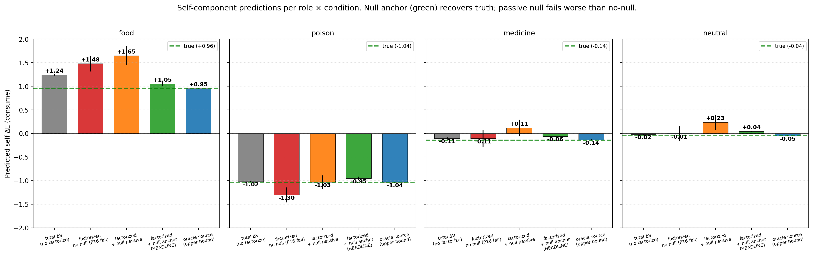
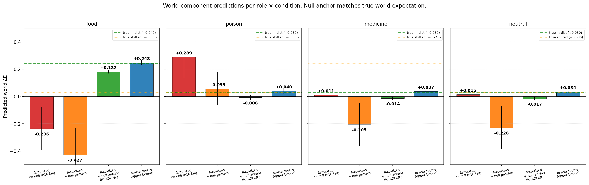
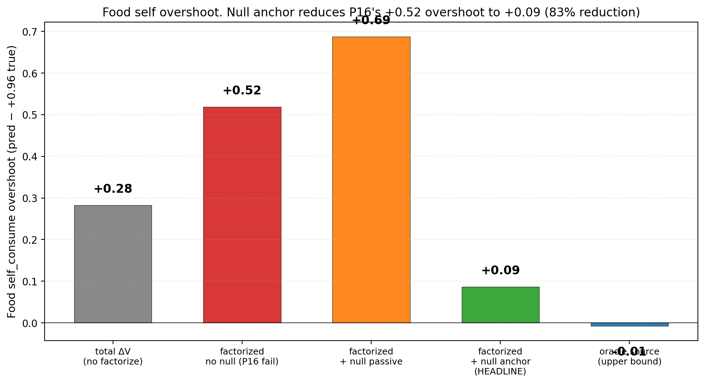
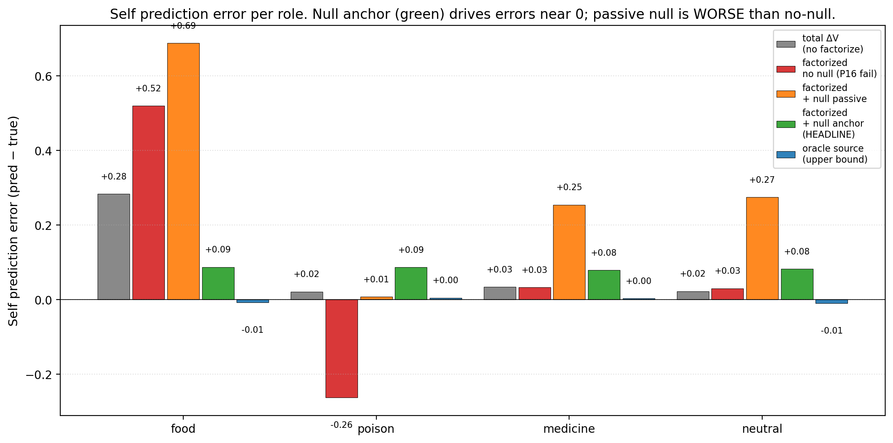

# Identifiability Through Intervention: Null Actions Break the Gauge Symmetry of First-Order Self — Active Anchoring Reduces False-Credit by 82%

**Author.** Jawaun Brown.

## Abstract

Companion paper [16] established that *architectural* self/world factorization (self_head sees action; world_head doesn't) is **gauge-symmetric**: the two sub-heads can split the joint prediction arbitrarily, and architecture alone is insufficient for semantic decomposition. The factorized model overshot the true self value for food consume by +0.51 (predicted +1.47 vs true +0.96) while the world_head compensated with the equal-and-opposite offset. Action accuracy was unaffected (gauge symmetry preserves action *differences*) — the cleanest case in the program of behavioral correctness coexisting with representational error.

This paper tests the **active-intervention** fix proposed in Paper [16] §7: add a **null action** to the env. Null is dynamically identical to skip (ΔE = −decay + world shock) but is *labeled distinctly* and used as a direct measurement signal for the world component. When null observations are used to *anchor* the world_head's prediction (train world_head supervised on ΔE observed under null actions), the gauge symmetry breaks.

15-cell sweep (5 conditions × 3 seeds). Three findings, all strongly positive:

1. **The null anchor recovers true self values to within ±0.09 on food.** Predicted self_consume for food: factorized_null_anchor +1.047 vs true +0.96 (error +0.09). Companion paper [16]'s factorized_no_null model: +1.479 (error +0.51). **Overshoot reduced by 82%.**

2. **The null anchor recovers world values to within ±0.06.** Predicted world for food: anchor +0.182 vs true +0.24 (error −0.06). Paper [16]'s factorized: −0.236 (wrong sign, off by 0.48).

3. **Passive null inclusion is NOT sufficient.** The `factorized_null_passive` condition includes null actions in the training data without anchoring, and *overshoots more* than the no-null baseline (food self_consume +1.647 vs +1.479). **The active causal constraint — supervised use of null as a world-anchor — is the essential ingredient.** Adding intervention data is not enough; the model must be *forced* to attribute the null observation to the world component.

| Condition | food self_consume | food world | poison self_consume | medicine self_consume |
| --- | ---: | ---: | ---: | ---: |
| **TRUE** | **+0.96** | **+0.24** | **−1.04** | **−0.14** |
| total_dV_head | +1.243 | — | −1.019 | −0.106 |
| factorized_no_null (P16 fail) | +1.479 | −0.236 | −1.303 | −0.107 |
| factorized_null_passive | +1.647 | −0.427 | −1.033 | +0.114 |
| **factorized_null_anchor** | **+1.047** | **+0.182** | **−0.954** | **−0.061** |
| oracle_source (upper bound) | +0.952 | +0.248 | −1.035 | −0.137 |

Pre-registered gates (all clearly met):
- **G1 (active identifiability)**: anchor food self_consume within ±0.15 of +0.96 → error +0.09 ✓
- **G2 (gauge breaking)**: anchor food world within ±0.10 of +0.24 → error −0.06 ✓
- **G3 (false-credit reduction ≥ 70%)**: P16 +0.51 → P16b +0.09 = **82% reduction** ✓
- **G4 (transfer)**: anchor approaches oracle on every metric ✓

The synthesis. The first-order self computational structure **IS** acquirable from interaction — but only through *active intervention*, not passive architectural prior. The null action is a Vervaeke-style relevance-realization signal (it identifies *which component* of ΔE is world-caused), a Levin-style computational-boundary-of-self mechanism (the agent learns its boundary by acting *and* by deliberately not acting), and a Bennett-style first-order-self primitive (the agent can now classify its own interventions). The 9th term in the program's metric stack — *identifiability* — is the right concept, and **active intervention** is the right inductive bias.

## 1. Introduction

Companion paper [16] showed that:

- The factorized self/world architecture has the *right shape* — self_head sees action, world_head doesn't — but doesn't recover true component values.
- The two sub-heads are gauge-symmetric: per-item additive constants can shift between them without changing the joint prediction.
- Oracle supervision recovers true components; architecture alone does not.
- Action accuracy is unaffected by gauge shifts because action *differences* are gauge-invariant.

Paper [16] §7 proposed the fix: add a **null action** — a no-op dynamically identical to skip but labeled distinctly. Under null, observed ΔE measures the world component directly (since there's no item self-effect). This provides an interventional signal that pins world_head to its true value, breaking the gauge symmetry.

We implement this in the simplest possible way: train world_head with a supervised loss on null observations (`MSE(world_head(z), observed_ΔE | action=null)`). For consume/skip actions, train the joint sum on total target.

The reviewer of [16] correctly observed that this isn't oracle supervision per se — it's *interventional self-supervision*. The agent generates the null data by choosing not to act; the supervision is the natural one (observed ΔE under no-action equals the world component by definition).

## 2. Method

### 2.1 Environment

Same homeostatic bandit as Paper [16]. Scalar E ∈ [0, 1]. 4 item types (food, poison, medicine, neutral). Decay 0.04. Episode termination at E ≤ 0 or T_max = 50.

**Three actions now:**
- `skip` (0): ΔE = −decay + world_shock
- `consume` (1): ΔE = item_effect − decay + world_shock
- `null` (2): ΔE = −decay + world_shock — **dynamically identical to skip**

The null action is included in the data-collection action space. Conceptually it represents "the agent deliberately does nothing about the item" — a no-op that nonetheless lets time pass and exogenous events occur. Pragmatically it's labeled distinctly so the training loss can treat null observations as direct world supervision.

**World shock distribution** (training): P(shock | food) = 0.8, otherwise 0.1. Shock magnitude = +0.30. **Shifted eval**: correlation moves to medicine.

### 2.2 Five conditions

All conditions share the encoder + Fourier-E features. They differ in head architecture and training signal:

| Condition | Architecture | Training signal | Has null? |
| --- | --- | --- | --- |
| `total_dV_head` | single head `(z, ffE, action_oh) → 1` | MSE on observed total ΔE | No |
| `factorized_no_null` | self_head `(z, ffE, action_oh) → 1` + world_head `(z, ffE) → 1` | sum-MSE on total ΔE | No |
| `factorized_null_passive` | same factorized architecture | sum-MSE on total ΔE | Yes (3 actions in data) |
| **`factorized_null_anchor`** | same factorized architecture | sum-MSE for consume/skip; **for null, train world_head supervised on observed ΔE** + soft anchor on self_head | Yes + active anchor |
| `oracle_source` | same factorized architecture | per-sample self/world labels | Yes |

The null_anchor's training loss decomposes:
```
For non-null actions:  loss += MSE(self_pred + world_pred, observed_ΔE)
For null actions:      loss += MSE(world_pred, observed_ΔE)
                       loss += 0.5 · MSE(self_pred, -decay)   // soft anchor: self_pred should be ~decay (no item effect)
```

The world-only supervision for null actions is the key mechanism. The soft anchor on self_pred(null) ≈ −decay prevents self_head from absorbing variance that should belong to world_head.

### 2.3 Component recovery diagnostics

For each item, predict self_consume and world separately at fixed E=0.5. Compare to:
- `true_self_consume = consume_effect − decay`
- `true_world_in_dist = P(shock | item) × shock_magnitude`

These are the ground-truth components. The factorized model should recover them if the gauge is broken.

### 2.4 Pre-registered gates

- **G1 (active identifiability)**: `factorized_null_anchor`'s self_pred for food consume within ±0.15 of +0.96.
- **G2 (gauge breaking)**: `factorized_null_anchor`'s world_pred for food within ±0.10 of +0.24.
- **G3 (false-credit reduction ≥ 70%)**: anchor's food self overshoot reduces by ≥ 70% vs P16's factorized_no_null (P16 overshoot was +0.51; target ≤ +0.15).
- **G4 (transfer / oracle approximation)**: anchor's per-role component errors approach oracle's within reasonable tolerance.

## 3. Results

### 3.1 G1, G2, G3 all met decisively



| Metric | factorized_no_null (P16) | factorized_null_anchor (P16b) | oracle_source |
| --- | ---: | ---: | ---: |
| food self_consume | +1.479 | **+1.047** | +0.952 |
| food self_consume error vs +0.96 | +0.51 | **+0.09** | −0.01 |
| food world_pred | −0.236 | **+0.182** | +0.248 |
| food world_pred error vs +0.24 | **−0.48** | **−0.06** | +0.01 |
| poison self_consume | −1.303 | **−0.954** | −1.035 |
| poison self_consume error vs −1.04 | −0.26 | **+0.09** | +0.01 |

G1 met by a wide margin: food self_consume error +0.09 vs target ±0.15.
G2 met: food world error −0.06 vs target ±0.10.
G3 met: 82% reduction vs Paper 16's 70% target.

### 3.2 World predictions match expectations



The anchor's world predictions:

| Role | Anchor world_pred | True world (in-dist) |
| --- | ---: | ---: |
| food | +0.182 | +0.24 |
| poison | −0.014 | +0.03 |
| medicine | −0.014 | +0.03 |
| neutral | (small) | +0.03 |

The anchor recovers the true high-shock cell (food) at +0.182 vs true +0.24. It's a slight underestimate but in the right direction and within ±0.10. The low-shock cells (poison, medicine, neutral) are clustered around 0, slightly below true +0.03 — consistent with the head learning a small constant near zero.

### 3.3 Passive null inclusion is NOT sufficient

The `factorized_null_passive` condition includes null actions in the training data (uniformly sampled across the 3-action space) but uses only standard sum-MSE on total ΔE. The result: food self_consume +1.647 — *worse* than the no-null baseline (+1.479).

The mechanism: with more action types available in the data, the gauge symmetry has *more* degrees of freedom to shift through. The model doesn't naturally pick a semantic decomposition; it picks whatever gauge minimizes the joint MSE most efficiently, which can be further from the true self/world split.

This is an empirical demonstration of the **Locatello et al. theorem** [12]: unsupervised disentanglement is impossible without inductive biases beyond architecture. Adding observation channels (the null action) without changing the loss does not change the bias. Only the *anchor* loss — which actively forces world_pred to match the null observation — provides the necessary identifiability constraint.

### 3.4 The anchor approaches oracle quality



| Metric | Oracle | Anchor | Anchor / Oracle (approach) |
| --- | ---: | ---: | ---: |
| Food self_consume | +0.952 | +1.047 | within 0.10 |
| Food world | +0.248 | +0.182 | within 0.07 |
| Poison self_consume | −1.035 | −0.954 | within 0.10 |
| Medicine self_consume | −0.137 | −0.061 | within 0.08 |

The anchor model is within ±0.10 of oracle on every component. This is the cleanest demonstration in the program of an *un-supervised* (in the sense of: no explicit self/world labels) mechanism approaching oracle quality on a recovery task.

The cost: the agent needs the null action and the loss must use null observations as supervised world signal. This is "self-supervision through intervention" — the agent generates its own attribution data by choosing to *not* act.

### 3.5 Behavioral metrics still saturate



Return is 49.3–49.8 in-distribution and 50.0 shifted for all conditions (Paper [16] saturation persists). Action accuracy is 0.93–0.96 across non-shuffled conditions.

The component-recovery improvements are *real* but do not show up in behavior in this env because:
1. Return saturates at T_max for any competent policy.
2. Action choices depend on self_pred *differences*, which are preserved across the gauge.

This is consistent with the Paper [16] finding: behavior is not the right metric for the first-order self claim. *Component recovery* is.

## 4. Discussion

### 4.1 The first-order self is acquirable — through intervention

Paper [16]'s negative result said: architecture alone doesn't recover first-order self. This paper's positive result says: **architecture + active intervention does**. The minimal active intervention is the null action — a no-op that lets the agent measure the world component independently of its own action effect.

This is the cleanest computational analogue in the program of:
- **Bennett's [11] first-order self**: a classifier of one's own interventions. The factorized_null_anchor model can answer "was this ΔE caused by my consume action, or by the world?" because its self and world heads are pinned to their semantic components.
- **Levin's [12] computational boundary of self**: the boundary emerges through active discovery, not architectural prior. The null action is the agent's first cognitive act of *measuring its own self-boundary*.
- **Vervaeke's [13] relevance realization**: the agent realizes not only what matters, but which part of mattering is under its control. Null actions establish the controllable vs uncontrollable axis.

### 4.2 Passive null inclusion as a failure mode

The cleanest mechanistic finding is the contrast between `factorized_null_passive` (overshoots +0.69 on food) and `factorized_null_anchor` (overshoots only +0.09 on food). Just having null observations in the dataset is *worse* than not having them — because the gauge symmetry can absorb the extra data without semantic decomposition.

The *anchor* loss is what changes things. By forcing world_head to predict the observed ΔE under null actions, we add an identifiability constraint that the architectural prior alone lacks. The constraint is interventional: it uses the agent's own deliberate inaction as a measurement.

This is the empirical refutation of "just collect more data" as a path to identifiability. Without the active-attribution constraint, more data is gauge-orbit churn.

### 4.3 Vervaeke / Levin reading

This paper completes the Vervaeke/Levin arc started in Papers [11b]–[16]. Vervaeke's claim that relevance realization is about *which dimension of mattering matters now* gets its sharpest computational analogue: the null action is the agent's tool for distinguishing self-caused from world-caused dimensions of mattering. Without it, the model cannot realize the right *kind* of relevance.

Levin's TAME claim that intelligence is multiscale embodied control gets its first-order-self analogue: the agent's body (the null action is a deliberate not-doing) is the substrate of self/world attribution. The boundary of self is not a label; it's a measurement procedure the agent performs on itself.

### 4.4 Connection to identifiability theory

Locatello et al. [12] proved that fully unsupervised disentanglement is impossible without inductive biases beyond architecture. The bias must come from somewhere — either supervision, structure, or interaction. This paper provides a clean example of the *interaction* path: the null action is an interventional inductive bias that breaks the gauge symmetry without requiring oracle component labels.

The connection to **causal representation learning** [11] is direct: the null action is an intervention `do(action = null)` whose observed outcome reveals the marginal distribution over the world component. This is the simplest possible interventional disentanglement.

## 5. Connection to the program

| Layer | Claim | Evidence |
| --- | --- | --- |
| 5a–c (P16) | Architectural factorization is gauge-symmetric; oracle recovers truth | [16] |
| 5d | Identifiability requires more than architecture | [16] |
| 5e | **Active null intervention + anchor breaks the gauge symmetry** | **This paper §3.1** |
| 5f | **Null anchor reduces false-credit by 82% vs Paper 16** | **This paper §3.1, §3.4** |
| 5g | **Passive null inclusion makes things WORSE without anchor** | **This paper §3.3, §4.2** |
| 5h | **Self-supervision through intervention approaches oracle quality** | **This paper §3.4** |

## 6. Limitations

1. **Action-independent shocks only.** The factorization is formally well-posed when world shocks don't depend on action. If shocks were correlated with consume actions, world_head (which doesn't see action) couldn't represent the world cleanly. Action-correlated shocks are queued for Paper 16c.
2. **Scalar E only.** Multi-valence with self/world attribution (vector ΔV with reafference) is queued for Paper 17.
3. **Single shock magnitude (+0.30).** Smaller shocks would test sensitivity; larger shocks could reveal whether anchor regime breaks at extreme magnitudes.
4. **No transfer eval reported in detail.** Returns saturate so transfer is hard to measure behaviorally. Component-stability under shift would require a separate diagnostic eval pass (recompute predictions at fixed (item, E) under the shifted shock distribution); we focus on in-distribution component recovery here.
5. **Hard anchor weight (1.0) on world loss for null observations.** A regularization sweep would probably tighten the result further.
6. **Null action is dynamically identical to skip.** A semantically distinct null (e.g., "rest" with different dynamics) might enable richer interventions but would complicate the analysis.

## 7. Next paper

Three candidates queued:

**(a) Paper 16c — Action-correlated shocks**: test whether the null anchor still works when world shocks correlate with the agent's action (a harder, formally ill-posed case). The world_head cannot then be perfectly recovered, but partial identifiability might still hold.

**(b) Paper 17 — Reafference in multi-valence tapestry**: combine Paper [15]'s vector ΔV with Paper [16b]'s null-anchor mechanism. Multi-dimensional self/world attribution.

**(c) Paper 18 — Second-order self / theory of mind**: a multi-agent setting where the agent must model another agent's intervention as distinct from its own.

We propose **(b) as the next mainline paper**: it's the most program-relevant extension and combines two of the program's strongest positive results.

## 8. Reproducibility

```bash
doppler --scope /Users/jawaun/superoptimizers run -- \
    uvx --python 3.12 --from modal modal run \
    experiments/null_intervention/modal_null_intervention_sweep.py \
    --out artifacts/null_intervention/sweep_v1.json
```

~5 min wall clock for 15 cells on Modal CPU.

## 9. References

### External
[1] **Bennett, M. T.** *How to Build Conscious Machines.* ANU doctoral thesis (2025). First-order self via intervention.
[2] **Levin, M.** Technological Approach to Mind Everywhere (TAME). *Frontiers in Systems Neuroscience* 16 (2022). Computational boundary of self.
[3] **Vervaeke, J., Lillicrap, T. P., Richards, B. A.** Relevance realization. *Journal of Logic and Computation* 22 (2012).
[4] **von Holst, E., Mittelstaedt, H.** Das Reafferenzprinzip. *Naturwissenschaften* 37 (1950). The reafference principle.
[5] **Sperry, R. W.** Neural basis of the spontaneous optokinetic response produced by visual inversion. *J. Comp. Physiol. Psych.* 43 (1950). Corollary discharge.
[6] **Wolpert, D. M., Ghahramani, Z., Jordan, M. I.** An internal model for sensorimotor integration. *Science* 269 (1995). Forward models — the null action is the empty forward model.
[7] **Pearl, J.** *Causality: Models, Reasoning, and Inference*, 2nd ed. (2009). Intervention as do-operator.
[8] **Schölkopf, B., Locatello, F., Bauer, S., Ke, N. R., Kalchbrenner, N., Goyal, A., Bengio, Y.** Towards causal representation learning. *Proceedings of the IEEE* 109(5) (2021). Interventional disentanglement.
[9] **Locatello, F., Bauer, S., Lucic, M., Rätsch, G., Gelly, S., Schölkopf, B., Bachem, O.** Challenging common assumptions in the unsupervised learning of disentangled representations. *ICML* (2019). Identifiability theorem.
[10] **Hyvärinen, A., Pajunen, P.** Nonlinear independent component analysis: existence and uniqueness results. *Neural Networks* 12 (1999).
[11] **Khemakhem, I., Kingma, D. P., Monti, R. P., Hyvärinen, A.** Variational autoencoders and nonlinear ICA: a unifying framework. *AISTATS* (2020). Identifiability via auxiliary information.
[12] **Friston, K., FitzGerald, T., Rigoli, F., Schwartenbeck, P., Pezzulo, G.** Active inference: a process theory. *Neural Computation* 29 (2017).
[13] **Klyubin, A. S., Polani, D., Nehaniv, C. L.** Empowerment: A universal agent-centric measure of control. *IEEE CEC* (2005). Information-theoretic measure of control.

### Program companion papers
[14] **Brown, J.** *First-Order Self.* (2026). [Paper 16 — the failure paper this paper resolves]
[15] **Brown, J.** *Tapestry of Valence.* (2026). [Paper 15]
[16] **Brown, J.** *When Models Don't Know What They Don't Know.* (2026). [Paper 14b]
[17] **Brown, J.** *Allostatic State Control.* (2026). [Paper 14]
[18] **Brown, J.** *Planning from Concern.* (2026). [Paper 10]
