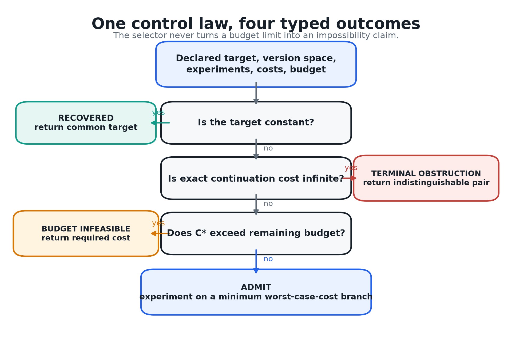
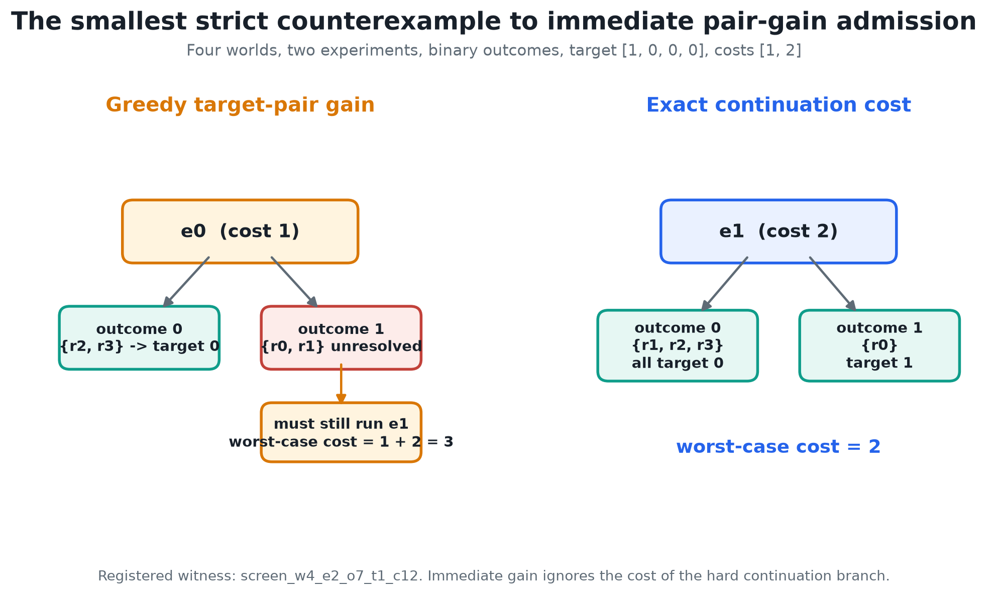
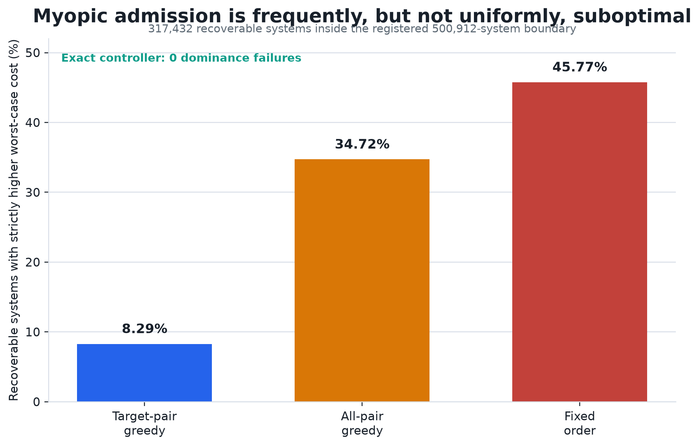

# Obstruction-Aware Admission

## Exact Cost-to-Identification for Bounded Scientific Agents

**Jawaun Brown**  
Human author and research director  

**OpenAI Codex (GPT-5)**  
Experiment code, analysis, and manuscript production under direction and review  

**Date:** July 27, 2026  
**Status:** executable finite benchmark paper  

---

## Abstract

A bounded scientific agent must decide which experiment to perform next, when
to stop, and what kind of stopping claim its evidence licenses. A natural
heuristic is to choose the affordable experiment that immediately separates
the most target-disagreeing candidate worlds per unit cost. We show that this
obstruction-aware greedy rule is safe as a ranking heuristic but not generally
cost-optimal. We introduce an executable **obstruction-aware admission
contract** for exact finite tasks. Its control quantity is the minimum
worst-case remaining cost of target identification, computed by dynamic
programming over version spaces. At every history the controller returns
exactly one typed result: a recovered target, a terminal obstruction pair,
a finite but over-budget recovery cost, or an experiment lying on an optimal
continuation branch.

The mathematics is a target-relative specialization of classical optimal
decision-tree search; we claim no new decision-tree theorem. The contribution
is the integration of exact continuation cost, fail-closed obstruction
certificates, typed resource failure, counterexample-first regression, and a
MIDAS-facing benchmark contract. We preregistered and exhaustively evaluated
all 500,912 deterministic binary systems containing two to four worlds, one
to three experiments, every nonconstant binary target, and costs in
\(\{1,2\}\). The run traversed 1,975,104 hidden-world episodes. The memoized
recurrence and an independent decision-tree enumeration disagreed zero times;
there were zero recovery failures, zero invalid emitted certificates, and zero
oracle-dominance failures.

The screen found 26,304 recoverable systems in which immediate target-pair gain
had strictly higher worst-case cost than exact admission, 8.29% of the
recoverable boundary. The registered minimum has four worlds and two
experiments: greedy spends cost 3 in the worst branch, while exact admission
spends 2. This is the useful obstruction to the obstruction heuristic itself.
The result supports exact finite control and a counterexample-first evaluation
method. It does not support a universal theory of agency, large-scale
efficiency, natural-domain discovery improvement, or the previously falsified
Concern-Gated Retrieval geometry.

---

## 1. The one-shot question

The motivating problem can be stated without a theory of meaning,
representation, or concern:

> Given a target, a set of candidate worlds, a family of permitted
> experiments, and a budget, what should a bounded agent admit next?

Three different questions are often compressed into that sentence.

1. **Identifiability:** Can the target be recovered from the permitted
   experiment family at all?
2. **Resource feasibility:** If recovery is possible, can it be guaranteed
   within the present budget?
3. **Control:** If recovery is both possible and affordable, which experiment
   should be performed next?

Information-Limited Discovery V0 separated the first question from guessing.
Its central artifact is a target-distinct pair of worlds that no permitted
experiment separates. That pair proves that uniform recovery is impossible
relative to the declared family. It also introduced a greedy
`obstruction_first` policy that selects the experiment separating the most
remaining target-distinct pairs per unit cost.

That policy answered the right qualitative question - reduce target ambiguity,
not generic uncertainty - but it left an unproved quantitative implication:
does the largest immediate obstruction reduction minimize total experiment
cost?

This paper asks that single question and deliberately lets the answer govern
the architecture. The answer is **no**. Immediate obstruction reduction can
choose a cheap experiment whose difficult outcome branch still requires an
expensive experiment. A more expensive first experiment can eliminate the
target ambiguity outright and therefore cost less in the worst case.

The clean control law is consequently not a new salience score. It is the exact
cost of the remaining identification decision tree.



### 1.1 The contribution

The contribution has four parts:

- a typed admission interface that separates recovery, terminal obstruction,
  budget infeasibility, and action;
- an exact finite oracle for the minimum worst-case target-identification cost;
- an exhaustive counterexample-first benchmark for admission heuristics; and
- a regression artifact that preserves the smallest found failure of the
  greedy target-pair rule.

The recurrence used by the oracle is standard decision-tree dynamic
programming. Optimal decision-tree construction has a long history, including
classical hardness results and modern approximation algorithms. The novel
boundary, if useful, is therefore methodological and infrastructural: exact
target-relative control is joined to an explicit scientific obstruction
certificate and a claim-calibrated stopping contract.

### 1.2 What is not being claimed

This paper does not claim:

- that all agency is experiment selection;
- that exact decision-tree optimization is new;
- that small finite exact systems model open scientific worlds;
- that an exponential controller is practical at arbitrary scale;
- that a generic context-by-concern score has been validated; or
- that counterexample-first reasoning is the whole of science.

These exclusions are not disclaimers attached after the result. They were
registered as gates before implementation.

---

## 2. Evidence and novelty boundary

The admission problem intersects several established literatures. Keeping
those lineages separate prevents integration from being mistaken for
mathematical novelty.

### 2.1 Optimal decision trees

In the classical optimal decision-tree problem, a hidden hypothesis must be
identified by tests with known responses and costs. Hyafil and Rivest showed
that constructing optimal binary decision trees is NP-complete. Modern work
continues to study approximation algorithms for arbitrary costs,
probabilities, and test responses. Our finite recurrence is an exact
small-instance solver for a target-relative variant: it need not identify the
world itself when all remaining worlds agree on the declared target.

That target-relative quotient is important operationally but does not erase
the lineage. The recurrence is a specialization, not a new optimal
decision-tree theorem.

### 2.2 Active learning and adaptive optimization

Active learning, experimental design, and adaptive submodular optimization ask
which costly observation to acquire next. Greedy policies can have formal
approximation guarantees when the objective satisfies conditions such as
adaptive monotonicity and adaptive submodularity. This paper does not assume or
prove those conditions for immediate target-pair separation. Instead it
constructs the exact finite oracle and searches directly for violations of
greedy optimality.

The distinction matters. “Greedy works well under a declared structural
condition” is compatible with “greedy fails on unrestricted finite
identification systems.” Our result establishes the latter inside a bounded
enumeration; it does not challenge conditional approximation theorems.

### 2.3 Rational metareasoning

Rational metareasoning treats computation itself as an action with cost and
expected value. That is the closest general precedent for deciding whether
another reasoning or experimental step is worth performing. Obstruction-aware
admission adds a particular epistemic contract: the value is relative to a
declared target, and termination must distinguish proof of impossibility from
mere inability to pay.

### 2.4 Retrieval and agent memory

Adaptive retrieval systems such as FLARE and Self-RAG decide when external
information is needed. CORAG explicitly studies retrieval under cost.
Graph-memory systems such as HippoRAG use Personalized PageRank, while
Topic-Sensitive PageRank predates query-plus-profile diffusion. These systems
motivate admission under bounded context, but they do not validate the
specific context-by-concern geometry previously investigated in this
repository.

The Concern-Gated Retrieval program is negative evidence that must remain
visible. On sealed learned geometry, rarity-corrected multiplicative
context-by-concern retrieval did not beat a degree-matched random null. A
subsequent erratum found a perfect inverted oracle in a policy-visible prior,
repaired it, and confirmed that the learned-versus-random KILL remained. The
MX1 successor preserved a verifier-fault distinction but rejected its
repair-guided exploration policy.

This paper therefore removes PageRank, epiplexity, and learned care from the
hard gate. A relevance or concern model may nominate candidates in a large
system. It cannot license a recovery or impossibility claim.

### 2.5 The honest novelty statement

The following elements are established:

- finite version spaces and exact experimental outcomes;
- optimal decision-tree search;
- target/hypothesis identification;
- value-of-information and metareasoning;
- active retrieval;
- counterexamples and abstraction refinement; and
- quotient-style identifiability.

The present artifact contributes their following composition:

> A bounded agent’s next experiment is governed, on an exact finite
> projection, by minimum remaining target-identification cost; the same
> interface returns a validated indistinguishable pair when recovery is
> structurally impossible and a different verdict when recovery is merely too
> expensive.

The benchmark, typed receipts, smallest-counterexample regression, and
MIDAS-facing workflow are the paper's contribution. The underlying optimal
decision-tree mathematics is not.

---

## 3. Formal problem

### 3.1 Declared task

A discovery task is

\[
\mathcal{D}=(R,E,\operatorname{obs},\tau,c,B).
\]

- \(R\) is a finite nonempty set of candidate worlds.
- \(E\) is a finite family of permitted experiments.
- \(\operatorname{obs}_e:R\to O_e\) is the deterministic outcome of
  experiment \(e\).
- \(\tau:R\to T\) is the target query.
- \(c:E\to\mathbb{N}_{>0}\) assigns positive integer costs.
- \(B\in\mathbb{N}\) is the available budget.

One world \(r^\star\in R\) is hidden from the policy. The world table, target
map, costs, and permitted family are public to the evaluator. The task is to
recover \(\tau(r^\star)\), not necessarily the identity of \(r^\star\).

After a transcript

\[
h=((e_1,o_1),\ldots,(e_k,o_k)),
\]

the version space is

\[
V(h)=\{r\in R:\operatorname{obs}_{e_i}(r)=o_i
\text{ for every }i\}.
\]

The target is recovered exactly when \(\tau\) is constant on \(V(h)\).

### 3.2 Target disagreement

For a nonempty version space \(V\), define the set of target-disagreeing pairs

\[
D_\tau(V)=
\{\{r,r'\}\subseteq V:\tau(r)\ne\tau(r')\}.
\]

This object carries exactly the ambiguity relevant to the declared target.
Distinguishing two worlds with the same target may be scientifically
interesting, but it is unnecessary for this decision.

An experiment \(e\) and outcome \(o\) leave the branch

\[
V_{e,o}=
\{r\in V:\operatorname{obs}_e(r)=o\}.
\]

Experiments already present in the transcript are removed from the remaining
family \(A\subseteq E\). An experiment that produces only one nonempty branch
on \(V\) changes no information and is excluded from the minimum.

### 3.3 Exact continuation cost

The minimum worst-case remaining identification cost is

\[
C^\star(V,A)=
\begin{cases}
0,
& D_\tau(V)=\varnothing,\\
\infty,
& D_\tau(V)\ne\varnothing
\text{ and no finite identifying continuation exists},\\
\min_{e\in A}
\left[
c(e)+
\max_{o:V_{e,o}\ne\varnothing}
C^\star(V_{e,o},A\setminus\{e\})
\right],
& \text{otherwise.}
\end{cases}
\]

Stable declared order breaks exact ties. The recurrence uses no prior over
worlds. It optimizes the worst hidden-world branch because the requested
guarantee is uniform recovery within a hard budget.

An expected-cost variant would require a declared prior and corresponding
posterior updates. That is a legitimate different objective, not a silent
replacement for the worst-case contract.

### 3.4 Four typed outcomes

At each history the controller returns exactly one status.

**Recovered.** If \(D_\tau(V)=\varnothing\), return the common target.

**Terminal obstruction.** If \(C^\star(V,A)=\infty\), return two worlds
\(r,r'\in V\) with different target values that agree under every remaining
permitted experiment.

**Budget infeasible.** If \(C^\star(V,A)\) is finite but exceeds the remaining
budget, return the required cost and a local target-disagreement witness. The
witness is not called terminal because a separating experiment exists.

**Admit.** Otherwise return the first experiment of a continuation achieving
\(C^\star(V,A)\).

### 3.5 Mathematical claims

**Proposition 1 - recovery soundness.** If the controller returns
`recovered`, the returned target equals \(\tau(r^\star)\).

**Proof.** The hidden actual world remains in the exact version space because
every transcript outcome came from it. The controller returns only when the
target is constant on that version space. Therefore the common value equals
the hidden world's target. \(\square\)

**Proposition 2 - finite optimality.** For a finite task,
\(C^\star(V,A)\) is the minimum worst-case cost among adaptive policies
restricted to \(A\).

**Proof.** Induct on \(|A|\). If the target is constant, zero is optimal. If no
identifying continuation exists, no policy can uniformly recover the target.
Otherwise every adaptive policy begins with some informative experiment
\(e\), pays \(c(e)\), and must solve every nonempty outcome branch. By the
inductive hypothesis, the least worst-case continuation cost on each branch is
\(C^\star(V_{e,o},A\setminus\{e\})\). Taking the worst branch gives the cost of
starting with \(e\); minimizing over possible first experiments gives the
recurrence. \(\square\)

This is standard Bellman reasoning for a finite decision tree. The paper's
independent enumeration tests the implementation; it is not offered as a new
proof technique.

**Proposition 3 - terminal obstruction equivalence.** For finite deterministic
tasks, \(C^\star(V,A)=\infty\) if and only if some target-distinct pair in
\(V\) agrees under every experiment in \(A\).

**Proof.** If such a pair exists, any adaptive policy receives identical
transcripts in the two worlds and cannot return different target values.
Conversely, if every target-distinct pair is separated by some experiment in
\(A\), running all experiments in \(A\) produces a transcript on which no
target-distinct pair remains. A finite identifying continuation therefore
exists. \(\square\)

**Proposition 4 - immediate target-pair gain is not cost-optimal.** There is a
four-world, two-experiment deterministic task with costs in \(\{1,2\}\) on
which maximizing immediately separated target-distinct pairs per cost has
worst-case cost 3, while \(C^\star=2\).

The constructive proof is the registered minimum in Section 5.2.

---

## 4. Benchmark design

### 4.1 Preregistration

The experiment was frozen before implementation. The preregistration declared:

- the mathematical objects and recurrence;
- the four typed outcomes;
- exact, target-greedy, all-pair-greedy, and fixed-order policies;
- the complete finite enumeration boundary;
- the ordering used to define the minimum counterexample;
- independent recurrence, hidden-world, mutation, invariance, redundancy, and
  legacy-evidence controls;
- ten noncompensatory gates; and
- a claim ceiling limited to exact finite control.

If the greedy search had found no counterexample, the paper was required to
report only a bounded null and withhold universal optimality.

### 4.2 Exhaustive boundary

The screen enumerated:

- \(n\in\{2,3,4\}\) worlds;
- \(m\in\{1,2,3\}\) experiments;
- every deterministic binary \(n\times m\) outcome table;
- every nonconstant binary target map; and
- every cost vector in \(\{1,2\}^m\).

The number of systems is therefore

\[
\sum_{n=2}^{4}\sum_{m=1}^{3}
2^{nm}(2^n-2)2^m
=500{,}912.
\]

Every world in every system was included as the hidden actual world, producing
1,975,104 audited hidden-world episodes. Duplicate and constant experiment
columns were intentionally retained. They test redundancy and terminal
collisions rather than being cleaned away.

Enumeration order was preregistered as world count, experiment count, outcome
table interpreted as an integer, target map interpreted as an integer, and
cost vector. “Minimum counterexample” means first strict witness in this exact
finite order. It is not a claim of minimality over arbitrary outcome alphabets,
real-valued costs, or other objectives.

### 4.3 Policies

**Exact.** Choose an experiment realizing \(C^\star\).

**Greedy target pairs.** Maximize the number of immediately separated
target-distinct pairs divided by experiment cost. Break ties by raw separated
count and then declared order. This is the Information-Limited Discovery V0
heuristic.

**Greedy all pairs.** Apply the same rule to every candidate pair, regardless
of target. This measures the cost of generic uncertainty reduction.

**Fixed order.** Choose the first remaining informative experiment.

For each recoverable system, the benchmark computes every policy's exact
worst-case cost over its induced adaptive tree. For terminally obstructed
systems, it validates a pair certificate rather than assigning an arbitrary
penalty.

### 4.4 Independent checks

The implementation computes \(C^\star\) using memoized dynamic programming.
A structurally separate, non-memoized decision-tree enumeration recomputes the
same quantity on every registered system. Although both implement the same
mathematical recurrence, their state handling and execution paths differ.

The policy-tree audit then visits every outcome branch and accounts for every
hidden world. At a recovery leaf it verifies target constancy and path cost. At
an impossible root it validates the emitted obstruction.

Certificate mutation controls alter:

- target values to make the pair target-equal;
- the transcript to contradict both worlds;
- the separator list;
- a world identifier; and
- the valid unmodified certificate.

The validator must accept only the unmodified certificate.

### 4.5 Invariance and redundancy

The minimum counterexample is replayed after:

- reversing world order;
- renaming and complementing target labels;
- renaming experiments while preserving declared order; and
- adding a duplicate experiment column.

Policy costs must be unchanged under relabeling. Adding a redundant experiment
must not improve the exact optimum.

### 4.6 Noncompensatory gates

| Gate | Requirement |
|---|---|
| G0 | All finite task objects are aligned and costs are positive integers. |
| G1 | Memoized and independent exact costs agree everywhere. |
| G2 | Every recovery leaf is target-correct. |
| G3 | Every emitted obstruction validates and every mutation fails. |
| G4 | Exact cost never exceeds a comparator on a recoverable system. |
| G5 | Recovery, terminal obstruction, and budget infeasibility remain distinct. |
| G6 | Relabeling preserves costs and redundancy cannot improve the optimum. |
| G7 | A greedy counterexample is found or its universal claim is withheld. |
| G8 | Prior Concern-Gated Retrieval negative evidence remains binding. |
| G9 | Manifest, digest, results, and replay artifacts are complete. |

The gates are not averaged. A single false recovery blocks the control claim,
even if average cost is attractive.

---

## 5. Results

All ten registered gates passed.

### 5.1 Exhaustive classification

| Size | Systems | Recoverable | Terminally obstructed | Target-greedy strict counterexamples |
|---|---:|---:|---:|---:|
| 2 worlds, 1 experiment | 16 | 8 | 8 | 0 |
| 2 worlds, 2 experiments | 128 | 96 | 32 | 0 |
| 2 worlds, 3 experiments | 1,024 | 896 | 128 | 0 |
| 3 worlds, 1 experiment | 96 | 24 | 72 | 0 |
| 3 worlds, 2 experiments | 1,536 | 864 | 672 | 0 |
| 3 worlds, 3 experiments | 24,576 | 18,816 | 5,760 | 0 |
| 4 worlds, 1 experiment | 448 | 56 | 392 | 0 |
| 4 worlds, 2 experiments | 14,336 | 5,472 | 8,864 | 192 |
| 4 worlds, 3 experiments | 458,752 | 291,200 | 167,552 | 26,112 |
| **Total** | **500,912** | **317,432** | **183,480** | **26,304** |

Across the full screen:

- memoized versus independent mathematical disagreements: **0**;
- exact-policy recovery failures: **0**;
- invalid emitted certificates: **0**;
- exact-oracle dominance failures: **0**.

Terminal obstruction occurred in 36.63% of the complete boundary. This number
describes the combinatorics of the registered binary tables; it is not an
estimate of how often natural scientific questions are impossible.

### 5.2 The minimum greedy counterexample

The first strict target-greedy counterexample has four worlds, two experiments,
binary outcomes, and costs \(c(e_0)=1\), \(c(e_1)=2\).

| World | Target \(\tau\) | \(e_0\) | \(e_1\) |
|---|---:|---:|---:|
| \(r_0\) | 1 | 1 | 1 |
| \(r_1\) | 0 | 1 | 0 |
| \(r_2\) | 0 | 0 | 0 |
| \(r_3\) | 0 | 0 | 0 |

The three target-disagreeing pairs are
\(\{r_0,r_1\}\), \(\{r_0,r_2\}\), and \(\{r_0,r_3\}\).

- \(e_0\) separates two pairs at cost 1, giving immediate score \(2\).
- \(e_1\) separates all three pairs at cost 2, giving immediate score \(1.5\).

Greedy therefore chooses \(e_0\). If the outcome is 0, the remaining worlds
\(\{r_2,r_3\}\) share target 0 and the cost is 1. If the outcome is 1, the
remaining worlds are \(\{r_0,r_1\}\); the target is unresolved and the policy
must still run \(e_1\). The worst-case cost is \(1+2=3\).

Exact admission chooses \(e_1\) first. Outcome 1 leaves only \(r_0\), while
outcome 0 leaves \(r_1,r_2,r_3\), all with target 0. Both branches terminate
after cost 2. Thus \(C^\star=2\).



This witness is small enough to become a permanent MIDAS regression:

> A selector may be target-aware and still be myopic.

### 5.3 Comparator regret

Among the 317,432 recoverable systems:

| Policy | Strictly worse than exact | Rate | Mean regret over all recoverable systems | Maximum regret |
|---|---:|---:|---:|---:|
| Greedy target pairs | 26,304 | 8.29% | 0.0877 | 2 |
| Greedy all pairs | 110,208 | 34.72% | 0.4488 | 4 |
| Fixed order | 145,288 | 45.77% | 0.7263 | 4 |

The target-aware greedy rule is substantially better than generic pair
reduction and fixed order on this boundary. Its failure is therefore not that
target awareness has no value. The failure is narrower: immediate target
ambiguity reduction omits continuation structure.



### 5.4 Typed termination

The registered hand controls produced:

- `recovered` with cost 0 when all candidate worlds already shared a target;
- `terminal_obstruction` with a validated target-distinct pair when every
  permitted experiment returned the same outcome in both worlds; and
- `budget_infeasible` with required cost 2 and remaining budget 1 when a
  separating experiment existed but was unaffordable.

The budget-infeasible receipt carried a **local** obstruction whose separator
list named the unaffordable experiment. It did not carry a terminal
certificate.

### 5.5 Certificate and invariance controls

All four invalid certificate mutations were rejected; the valid certificate
was accepted. World and target relabeling, experiment relabeling, and the
original counterexample all produced the policy-cost vector:

\[
(C^\star,C_{\text{target-greedy}},
C_{\text{all-greedy}},C_{\text{fixed}})
=(2,3,3,3).
\]

Adding a redundant duplicate of \(e_0\) left the exact optimum at 2.

### 5.6 Legacy evidence integrity

The benchmark checked the local evidence anchors that:

- the Concern-Gated Retrieval synthesis preserves the learned-versus-random
  L1 null; and
- the erratum confirms the KILL under the repaired prior.

Those checks prevent this new paper from narratively converting a prior failed
mechanism into support for the new controller. The present result stands
without learned concern geometry.

---

## 6. What the result means

### 6.1 The obstruction is necessary but not sufficient as a score

A terminal obstruction pair answers whether recovery is possible. A set of
local obstruction pairs describes what remains ambiguous. But the number of
pairs an experiment immediately separates is not the same as the cost of the
remaining adaptive tree.

The minimum witness isolates the missing variable: **branch continuation**.
The greedy score sees that \(e_0\) cheaply eliminates two of three
target-disagreeing pairs. It does not price the fact that its outcome-1 branch
leaves exactly the last pair that only the expensive experiment can separate.

This is the central synthesis:

> Identifiability determines whether a solution exists; continuation cost
> determines which experiment should be admitted.

### 6.2 Hard gate and soft nomination

The earlier Admission proposal used cheap nomination followed by expensive
verification. The present result preserves that architecture while changing
the hard quantity.

In a large system, semantic relevance, graph proximity, standing goals,
recency, novelty, or learned concern may nominate a tractable candidate set.
Those signals are allowed to influence search order. They do not establish
that an action is necessary, that a target has been recovered, or that recovery
is impossible.

On an exact finite projection, the hard controller asks:

1. Is the target already constant?
2. Does a target-distinct indistinguishable pair remain?
3. What is the minimum worst-case cost of eliminating the remaining target
   disagreement?
4. Does the budget cover that cost?
5. Which first experiment realizes it?

This is narrower than a universal agency theory and stronger than a generic
relevance score.

### 6.3 Information-Limited Discovery and Admission are different layers

Information-Limited Discovery supplies:

- the declared target;
- the version space;
- the permitted experiment family;
- recovery semantics; and
- terminal obstruction certificates.

Obstruction-Aware Admission supplies:

- exact continuation cost;
- the next cost-optimal experiment on small finite tasks; and
- a distinct resource-infeasibility status.

Neither replaces the other. Without identifiability, a cheap policy can
overclaim. Without control, an identifiable task can waste its budget.

### 6.4 Relation to MIDAS

The immediate MIDAS loop becomes:

```text
Declare target, worlds, experiments, outcomes, and costs
                         |
                         v
Compute exact finite continuation cost when tractable
           /             |                 \
      target fixed   cost infinite      finite cost
           |             |                 |
       recover       emit pair       compare to budget
                                           |
                                  admit optimal experiment
                                           |
                                  observe and recurse
```

Every result is a regression artifact:

- a terminal pair prevents a future recovery overclaim;
- a budget witness prevents resource failure from being called impossibility;
- the four-world greedy witness prevents immediate pair gain from being called
  optimal; and
- a successful decision tree certifies the exact finite cost.

### 6.5 What survived from Concern-Gated Retrieval

The learned graph mechanism did not survive. Two methodological principles did:

1. nomination and utilization should be evaluated separately; and
2. a verifier must be allowed to decline when its competence is insufficient.

The present controller operationalizes the second point with typed outcomes.
It does not ask one scalar utility to represent recovery, impossibility, and
budget failure. A terminal certificate requires a proof object. Budget
infeasibility requires a finite exact cost. Recovery requires target
constancy.

---

## 7. An engineering contract for bounded agents

The finite controller is directly usable as a regression oracle and indirectly
useful as a design contract for larger agents.

### 7.1 Exact kernel

The exact kernel owns:

- finite state identity;
- a target map;
- a permitted experiment family;
- deterministic outcome tables;
- positive costs;
- version-space filtering;
- certificate validation;
- dynamic programming; and
- typed termination.

For a finite task, this interface is complete and sound under its assumptions.

### 7.2 Large-system projection

Real coding and scientific agents do not possess a complete finite outcome
table. A scalable controller must construct a conservative local projection:

- candidate worlds become explicit hypotheses or program states;
- experiments become typed tool calls or interventions;
- outcomes come from verified execution or measurement;
- costs include runtime, model calls, risk, and opportunity cost; and
- the target is the exact obligation being discharged.

The exact solver can then operate on the projection. Its guarantee is
conditional on projection completeness and outcome correctness. If the actual
world lies outside the candidate set, the finite certificate may be valid
inside the model and misleading about reality.

### 7.3 Capability-first routing

The controller can coexist with a domain-agnostic execution kernel:

1. reject unauthorized effects before execution;
2. reject exact repeated action-state pairs when the action is hermetic;
3. let heuristic models nominate candidate actions;
4. map a tractable candidate subset into the finite admission problem;
5. use exact continuation cost when available;
6. execute in a sandbox;
7. store the observation with provenance; and
8. revise the version space.

For nondeterministic, time-dependent, networked, or hidden-state actions, an
action-state cache key must include every relevant environment dependency.
Otherwise “already tried” is not a sound statement.

### 7.4 Fail-closed pseudocode

```text
admit(problem, history, spent):
    V = worlds_consistent_with(history)

    if target_constant(V):
        return RECOVERED(common_target(V))

    C = exact_remaining_cost(V, unused_experiments(history))

    if C is infinite:
        pair = validate_terminal_pair(V)
        return TERMINAL_OBSTRUCTION(pair)

    if C > budget - spent:
        return BUDGET_INFEASIBLE(required=C)

    experiment = first_action_on_optimal_branch(V)
    return ADMIT(experiment)
```

The difficult production problem is not the interface. It is constructing a
projection whose worlds, outcomes, target, and costs are honest enough for the
interface to mean what it says.

---

## 8. Limitations

### 8.1 Closed-world dependence

Every guarantee is conditional on the declared candidate set. The controller
has no open-world detector. A natural deployment must test whether observations
are inconsistent with every candidate and support model revision.

### 8.2 Deterministic outcomes

The benchmark uses exact deterministic tables. Noisy experiments require a
statistical observation model, posterior or confidence-set semantics,
sequential error control, and a clear distinction between low power and
equivalence.

### 8.3 Worst-case objective

Worst-case cost is appropriate for a uniform guarantee under a hard budget.
It may be conservative when a reliable prior exists. Expected-cost,
risk-sensitive, and regret objectives can choose different experiments. The
objective must be declared rather than inferred from a salience score.

### 8.4 Computational scale

Exact optimal decision-tree construction is computationally hard. The
benchmark deliberately uses small systems. Larger systems will need
approximations, branch-and-bound, structural assumptions, learned proposal
policies, or receding finite projections. The exact solver remains useful as a
small-instance oracle and regression suite.

### 8.5 Hand-enumerated world classes

The screen is exhaustive inside a synthetic binary boundary, not representative
sampling from science or software engineering. The reported 8.29% greedy
failure rate is not a deployment estimate.

### 8.6 No natural-agent result

The benchmark does not measure whether an LLM proposes good candidate worlds,
defines the right target, constructs faithful experiments, or updates its
model after misspecification. Those are separate empirical gates.

### 8.7 No universal philosophy of science

Constructive modeling, instrument invention, analogy, measurement, explanation,
and theory formation are not reducible to obstruction search. This method is a
control and evaluation axis for claims that can be expressed as finite
target-identification problems.

---

## 9. The next decisive experiment

The next step should not enlarge the philosophy. It should test whether the
finite oracle improves a real agent's experiment selection on tasks where a
truthful projection can be built.

A suitable successor would use finite program-repair or theorem-countermodel
tasks with:

- independently generated hidden states;
- typed experiments with measured execution costs;
- a sealed target evaluator;
- exact small-instance \(C^\star\) as the oracle;
- greedy target-pair, generic uncertainty, fixed-order, and learned-ranker
  baselines;
- explicit out-of-model observations;
- success, overclaim, unnecessary abstention, total cost, and oracle regret as
  separate metrics; and
- preregistered transfer to larger instances where exact search is unavailable.

The promotion claim would be:

> a learned or heuristic selector approaches the exact oracle on training-scale
> tasks and reduces verified completion cost on held-out larger tasks without
> increasing overclaim.

Failure would remain useful. Its smallest oracle-regret witness would become
the next regression.

---

## 10. Conclusion

The one-shot move is not to declare a universal admission principle. It is to
make the control boundary executable.

An exact finite agent should:

- recover only when the target is constant over remaining worlds;
- call impossibility only when it can produce a target-distinct pair that every
  permitted experiment leaves indistinguishable;
- call a budget limit a budget limit;
- and choose the next experiment by its full continuation cost, not only its
  immediate information gain.

The exhaustive result exposes a useful hierarchy. Target-aware greedy search is
better than generic uncertainty reduction on this boundary, but it is still
myopic in 26,304 recoverable systems. The smallest witness needs only four
worlds and two experiments.

That counterexample is the paper's most portable result. A system can look
directly at the right obstruction and still choose the wrong next step.
Counterexample-first reasoning must therefore be applied to the selection
policy itself.

The calibrated conclusion is:

> Exact obstruction-aware admission is a verified finite control contract. It
> returns a cost-optimal next experiment, a scoped terminal obstruction, or a
> distinct budget-infeasible verdict.

Whether approximations to that contract improve real scientific agents is now
a well-posed experiment rather than a philosophical assertion.

---

## Reproducibility

Run the registered experiment:

```bash
uv run --no-sync python -m \
  experiments.obstruction_aware_admission.run_benchmark
```

Run the focused test suite:

```bash
uv run --no-sync python -m pytest -q \
  tests/test_obstruction_aware_admission.py
```

The committed public artifacts are:

- `experiments/obstruction_aware_admission/PREREGISTRATION.md`;
- `experiments/obstruction_aware_admission/experiment_manifest.json`;
- `experiments/obstruction_aware_admission/results/summary.json`;
- `experiments/obstruction_aware_admission/results/summary.md`;
- `experiments/obstruction_aware_admission/fixtures/minimal_greedy_counterexample.json`;
- `experiments/obstruction_aware_admission/core.py`;
- `experiments/obstruction_aware_admission/run_benchmark.py`;
- `tests/test_obstruction_aware_admission.py`; and
- this manuscript and its rendered PDF.

The benchmark receipt's source digest is
`ec7902ae10f8097536b52779205263bad1ed78a19809a860c0a1c5a36b2c425b`.

---

## References

Angluin, D. (1987). Learning regular sets from queries and counterexamples.
*Information and Computation*, 75(2), 87-106.
<https://doi.org/10.1016/0890-5401(87)90052-6>

Blackwell, D. (1951). Comparison of experiments. In *Proceedings of the Second
Berkeley Symposium on Mathematical Statistics and Probability*.
<https://doi.org/10.1525/9780520411586-009>

Chen, Y., Hassani, H., & Krause, A. (2017). Near-optimal Bayesian active
learning with correlated and noisy tests. *AISTATS 2017*.
<https://proceedings.mlr.press/v54/chen17b.html>

Clarke, E. M., Grumberg, O., Jha, S., Lu, Y., & Veith, H. (2000).
Counterexample-guided abstraction refinement. *CAV 2000*, 154-169.
<https://doi.org/10.1007/10722167_15>

De Sabbata, C. N., Sumers, T. R., & Griffiths, T. L. (2024). Rational
metareasoning for large language models.
<https://arxiv.org/abs/2410.05563>

Golovin, D., & Krause, A. (2011). Adaptive submodularity: Theory and
applications in active learning and stochastic optimization. *Journal of
Artificial Intelligence Research*, 42, 427-486.
<https://doi.org/10.1613/jair.3278>

Hay, N., Russell, S., Tolpin, D., & Shimony, S. E. (2018). Selecting
computations: Theory and applications. *PLOS Computational Biology*, 14(3),
e1006043.
<https://doi.org/10.1371/journal.pcbi.1006043>

Hyafil, L., & Rivest, R. L. (1976). Constructing optimal binary decision trees
is NP-complete. *Information Processing Letters*, 5(1), 15-17.
<https://doi.org/10.1016/0020-0190(76)90095-8>

Jia, S., Navidi, F., Nagarajan, V., & Ravi, R. (2023). Optimal decision tree
and adaptive submodular ranking with noisy outcomes.
<https://arxiv.org/abs/2312.15357>

Jiang, Z., et al. (2023). Active retrieval augmented generation.
<https://arxiv.org/abs/2305.06983>

Koh, J. Y., et al. (2024). Tree search for language model agents.
<https://arxiv.org/abs/2407.01476>

Li, X., et al. (2024). HippoRAG: Neurobiologically inspired long-term memory
for large language models. <https://arxiv.org/abs/2405.14831>

Shinn, N., et al. (2023). Reflexion: Language agents with verbal reinforcement
learning. <https://arxiv.org/abs/2303.11366>

Sun, Z., et al. (2024). CORAG: A cost-constrained retrieval optimization
framework for retrieval-augmented generation.
<https://arxiv.org/abs/2411.00744>

Haveliwala, T. H. (2002). Topic-sensitive PageRank. *WWW 2002*.
<https://doi.org/10.1145/511446.511513>

Asai, A., et al. (2023). Self-RAG: Learning to retrieve, generate, and critique
through self-reflection. <https://arxiv.org/abs/2310.11511>

Zhuo, Z., & Nagarajan, V. (2025). A simple approximation algorithm for optimal
decision tree. <https://arxiv.org/abs/2505.15641>

Brown, J. (2026). *Relative Identifiability*. Executable theorem-development
paper and regression package in this repository.

Brown, J. (2026). *Information-Limited Discovery*. Finite obstruction-first
benchmark paper and package in this repository.

Brown, J. (2026). *The Concern-Gated Retrieval Program: A Falsification Arc
from Authored Diagnostic to Honest Null*. Synthesis paper in this repository.

Brown, J. (2026). *Erratum E1: A Perfect Inverted Oracle in the Concern-Gated
Retrieval Fixtures*. Corrective report in this repository.
